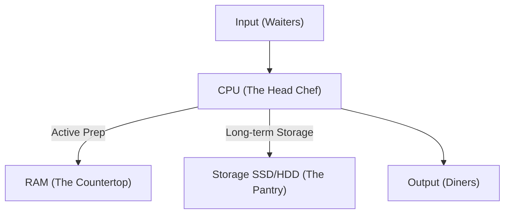
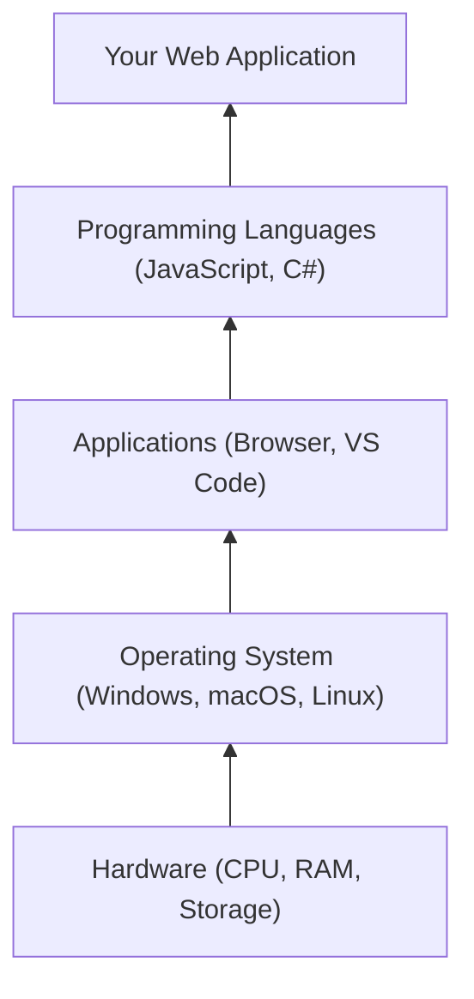
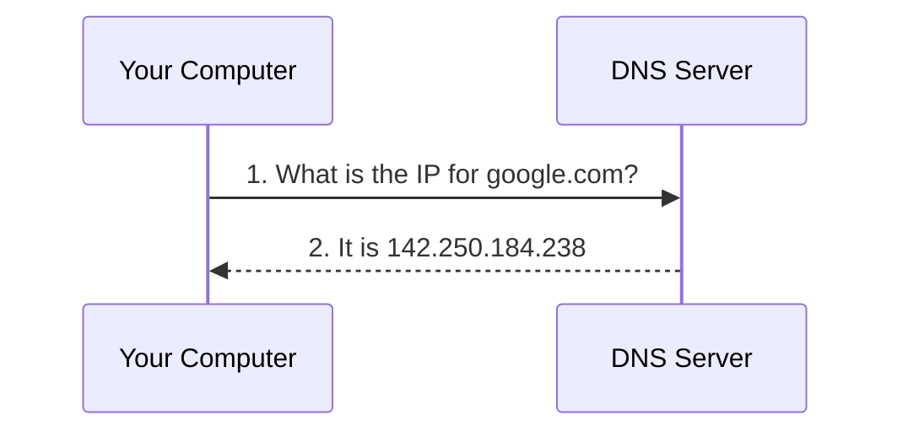
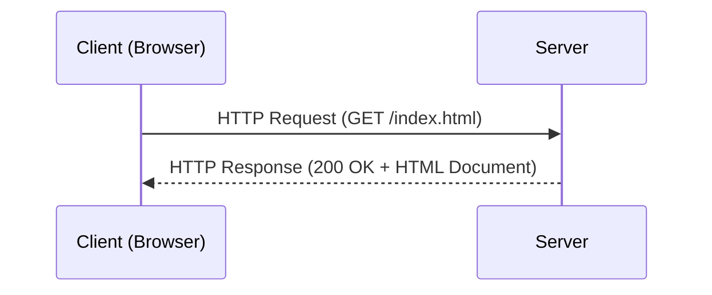

# Lecture 00 — Introduction to Computers & Web Development

**Course:** Full-Stack Web Development  
**Instructor:** Kyrillos Medhat  
**Duration:** 3 hours (Theory + Lab)

---

## 📋 Prerequisites

> Before starting this lecture, make sure you have:
> - ✅ Basic computer literacy (ability to install software, create folders, and navigate your OS)
> - ✅ A reliable internet connection
> - ✅ A computer (Windows, macOS, or Linux) with administrator access so you can install software

---

## 🎯 Learning Objectives

By the end of this lecture, you will be able to:
- Understand the basic hardware components of a computer and how they work together
- Distinguish between different software layers and programming language types
- Explain how the Internet and the World Wide Web function at a high level
- Identify the roles of Frontend, Backend, and Full-Stack Developers
- Set up a professional web development environment on your computer
- Create and view your very first HTML web page

---

## 📋 Agenda

| Time | Topic |
|------|-------|
| 0:00 – 0:20 | What is a Computer? |
| 0:20 – 0:40 | Software Layers & Programming Languages |
| 0:40 – 1:00 | How the Internet Works |
| 1:00 – 1:30 | How the Web Works & Web Browsers |
| 1:30 – 1:40 | Break |
| 1:40 – 2:00 | What is Web Development & Career Paths |
| 2:00 – 2:30 | Developer Tools & Environment Setup |
| 2:30 – 3:00 | Practice Labs & First Webpage |

---

## 1. What is a Computer?

### Plain-English Introduction

Before we can build software, we need to understand the machine that runs it. Everything from a cheap smartphone to a supercomputer follows a simple pattern:
1. **Takes input** — you type on a keyboard, click a mouse, or tap a touchscreen
2. **Processes it** — performs calculations and logical operations at billions of operations per second
3. **Produces output** — shows results on a screen, plays audio, or saves a file

### The Professional Kitchen Analogy

Think of a computer like a professional restaurant kitchen:



#### CPU — Central Processing Unit (The Head Chef)
The CPU is the brain of the computer. It fetches instructions from memory, decodes them, executes them, and stores results — billions of times per second. Modern CPUs have multiple **cores** (think multiple chefs cooking at the same time), which is why your computer can run a music app, a browser, and a code editor simultaneously.

#### RAM — Random Access Memory (The Countertop)
RAM is your computer's short-term working memory. When you open a web browser, the browser's entire program code and all its data are loaded from Storage (the pantry) into RAM (the countertop) so the CPU can access them quickly. RAM is extremely fast but **volatile** — when you turn off the computer, everything in RAM is gone. Common sizes: 8 GB, 16 GB, 32 GB.

#### Storage — SSD / HDD (The Pantry)
Storage keeps your data permanently — even when the power is off.
- **SSD (Solid State Drive):** Modern, fast. Used in most computers today.
- **HDD (Hard Disk Drive):** Older, slower, cheaper. Uses spinning magnetic disks.

#### I/O — Input/Output Devices (Waiters & Diners)
- **Input devices:** Keyboard, mouse, microphone, webcam, touchscreen.
- **Output devices:** Monitor, speakers, printer.

> [!NOTE]
> When you write a program, you are essentially writing a recipe for the CPU (chef) to follow. Data from Storage (pantry) gets loaded into RAM (countertop) while the program runs. The results are then sent to Output devices. Everything else is just details built on top of this foundation.

### Step-by-Step: What Happens When You Open a Web Browser
1. You double-click the Chrome icon (input)
2. The OS loads Chrome's program files from Storage (pantry) into RAM (countertop)
3. The CPU starts executing Chrome's code (the chef starts following the recipe)
4. Chrome draws its window on the monitor (output)
5. You type a URL and press Enter — that's another input event
6. Chrome processes it (more CPU work) and displays the webpage

### Why Does This Matter for Web Development?
When you deploy a website, your code runs on a **server** — which is just another computer, usually without a monitor or keyboard, sitting in a data centre. Understanding CPU, RAM, and Storage helps you write efficient code. For example:
- Loading a 50 MB image that only displays at 200×200 pixels wastes RAM on every visitor's computer.
- Storing user session data in RAM (instead of a database) makes a web app fast, but the data disappears if the server restarts.

### 📌 Section Recap
- A computer = Input → Process (CPU) → Output
- CPU: processes instructions; RAM: holds working data (temporary); Storage: keeps data permanently
- I/O devices: how humans interact with the machine
- Your code is a recipe the CPU follows
- Servers are just computers running your code in a data centre

---

## 2. Software Layers

### Plain-English Introduction
Hardware is useless without software. Think of hardware as a piano — beautiful and full of potential, but useless until someone knows how to play it. Software is the music.

There are different *layers* of software, each built on top of the layer below:



### Layer 1: The Operating System
The OS (Windows, macOS, Linux) is the **restaurant manager**. It:
- Directly controls the hardware
- Decides which application gets to use the CPU at any given moment
- Manages files on the hard drive
- Provides common services (networking, security, user interfaces) so every application doesn't have to reinvent the wheel

When your music app and browser both want to play audio at the same time, the OS arbitrates that conflict.

### Layer 2: Applications
Applications are built *on top of* the OS. They use the OS's services to do specific tasks. Web browsers, code editors, games, and word processors are all applications.

### Layer 3: Programming Languages
Programming languages bridge the gap between human-readable logic and machine-executable instructions (a sequence of 1s and 0s the CPU can understand).

### Compiled vs Interpreted Languages
This is a fundamental concept you'll encounter throughout your career:

> [!NOTE]
> **Compiled Languages** (C++, C#, Java): The entire source code is translated into machine code *before* the program runs. This translation step (compilation) takes time up front, but the resulting program runs very fast because the translation is already done. (Analogy: Like translating an entire book from French to English *before* giving it to your friend to read).
>
> **Interpreted Languages** (JavaScript, Python): The source code is translated into machine code line-by-line *as* the program runs. This makes them faster to write and test (no compile step), but slightly slower to execute. (Analogy: Having a live interpreter whisper translations in your ear as a speaker talks).

### Languages in This Course
- **Frontend (Browser):** JavaScript (interpreted), HTML (markup language), CSS (stylesheet language)
- **Backend (Server):** C# (compiled), ASP.NET Core (framework), SQL Server (database)

### 📌 Section Recap
- Software layers: Hardware → OS → Applications → Your code
- The OS is the manager that coordinates hardware for all applications
- Compiled languages translate before running (faster execution)
- Interpreted languages translate line-by-line (faster to develop and test)
- This course uses JavaScript (frontend, interpreted) and C# (backend, compiled)

---

## 3. How the Internet Works

### Plain-English Introduction
The Internet is often described as a "network of networks." Imagine every computer in the world is a house, and the Internet is the road system connecting all those houses. You can send a letter (data) from your house to any other house in the world via this road system, as long as you know the address. Data travels as electrical signals through cables and as radio waves through the air, at nearly the speed of light.

### Key Concept 1: IP Addresses
Every computer connected to the Internet needs a unique address so data knows where to go. This address is called an **IP address** (Internet Protocol address).
- **IPv4:** `192.168.1.100` (Four numbers, each 0–255. We've run out of these!)
- **IPv6:** `2001:0db8:85a3:0000:0000:8a2e:0370:7334` (Much longer, enough for every atom on Earth).

Your home IP address is assigned by your ISP (Internet Service Provider — companies like AT&T, Vodafone). When you deploy a website, your server gets an IP address. Without it, no one can reach it.

### Key Concept 2: DNS — The Internet's Phone Book
Humans are terrible at remembering IP addresses like `142.250.184.238`. So we use **domain names** like `google.com` instead. **DNS (Domain Name System)** is the service that translates domain names into IP addresses.



### Key Concept 3: Data Packets
Data doesn't travel across the Internet as one giant blob. It's broken into small chunks called **packets**. Each packet may take a DIFFERENT ROUTE through the internet and arrive OUT OF ORDER. They're reassembled at the destination. If your connection drops for a moment, only the missing packets need to be re-sent, not the entire file.

### The TCP/IP Model
The TCP/IP model describes the layered system that makes all of this work:
| Layer | Protocol | Purpose | Analogy |
|-------|----------|---------|---------| 
| Application | HTTP, FTP, SMTP | High-level data exchange | The content of the letter |
| Transport | TCP, UDP | Ensures packets arrive correctly and in order | The envelope with tracking |
| Internet | IP | Routes packets across networks | The postal sorting office |
| Link | Ethernet, Wi-Fi | Physical connection between nearby devices | The delivery truck |

> [!TIP]
> **Latency vs Bandwidth:**
> - **Bandwidth** = how *much* data can travel at once (width of the highway — more lanes = more cars)
> - **Latency** = how *quickly* a single piece of data travels from A to B (the speed limit)
>
> For a responsive web app, **low latency** is often more important than high bandwidth!

### 📌 Section Recap
- The Internet = a global network of interconnected computers
- Every device has a unique IP address (its "street address")
- DNS translates human-readable domain names into IP addresses
- Data travels as small packets that may take different routes and arrive out of order
- Latency = speed of a single packet; Bandwidth = total data capacity

---

## 4. How the Web Works

### Plain-English Introduction
Here's a distinction that trips up almost every beginner:
> **The Internet ≠ The Web**

- **The Internet** is the global physical infrastructure — the cables, routers, and protocols that allow computers to connect.
- **The Web (World Wide Web)** is a *service* that runs *on top of* the Internet — a collection of interconnected documents (web pages) accessed through a browser.

Think of it this way: The Internet is the road system. The Web is one type of vehicle that uses those roads. Email, online gaming, and video calls all use the same Internet roads — they're different "vehicles."

### The Client-Server Model
The Web works on a **request-response cycle** called the Client-Server Model:



**Restaurant analogy:**
- **Client (Browser)** = You, the customer at the table. You look at the menu and place an order.
- **Server** = The kitchen. It prepares your food based on your order.
- **HTTP** = The waiter. Carries your request to the kitchen and brings back the response.

### HTTP Methods & Status Codes
When a browser makes a request, it specifies *what it wants to do* using an HTTP method:
- **`GET`**: Read / Retrieve data (e.g. Loading a page)
- **`POST`**: Create new data (e.g. Submitting a form)
- **`PUT` / `PATCH`**: Update data (e.g. Saving a profile)
- **`DELETE`**: Delete data (e.g. Removing an item from a cart)

The server responds with a **Status Code**:
- **2xx (Success):** `200 OK`
- **3xx (Redirect):** `301 Moved Permanently`
- **4xx (Client Error):** `404 Not Found` (You made a mistake — bad URL)
- **5xx (Server Error):** `500 Internal Server Error` (The server crashed)

> [!IMPORTANT]
> **The golden rule for debugging:**
> - **4xx errors** = *You* (the client) made a mistake.
> - **5xx errors** = *The server* is broken.

### Anatomy of a URL
`https://www.example.com:443/products/shoes?color=red&size=10#details`
- **Scheme:** `https://` (secure HTTP)
- **Domain:** `www.example.com`
- **Port:** `:443`
- **Path:** `/products/shoes`
- **Query String:** `?color=red&size=10`
- **Fragment:** `#details`

### 📌 Section Recap
- The Internet is infrastructure; the Web is a service running on top of it
- Client (browser) sends HTTP requests; Server sends HTTP responses
- HTTP methods: GET (read), POST (create), PUT/PATCH (update), DELETE (delete)
- Status codes: 2xx = success, 4xx = client mistake, 5xx = server broken

---

## 5. Web Browsers

A web browser isn't just a simple viewer — it's one of the most complex pieces of software ever built. Your browser takes raw HTML, CSS, and JavaScript text files and turns them into the interactive experiences you see on screen using a **rendering engine**.

### Rendering Engines
| Browser | Rendering Engine | Market Share (approx. 2026) |
|---------|-----------------|----------------|
| Chrome, Edge, Brave, Opera | **Blink** | ~65% of web users |
| Firefox | **Gecko** | ~4% of web users |
| Safari | **WebKit** | ~19% of web users |

> [!TIP]
> For development, use **Chrome** or **Edge** (both use Blink). They have the most powerful DevTools. But always *test* in Firefox and Safari before releasing, because small differences in rendering engines can cause visual bugs.

### The Critical Rendering Path
Understanding how a browser loads a page helps you write faster websites:
1. **DNS Resolution** → "What IP address is example.com?"
2. **TCP + TLS Handshake** → Secure connection established.
3. **HTTP GET** → Browser requests the main HTML document.
4. **HTML Parsing** → Finds CSS and JS files. CSS blocks rendering!
5. **CSSOM Construction** → Browser builds a tree of styles.
6. **Render Tree** → Combines HTML + CSS.
7. **Layout** → Calculates exact pixel position and size of every element.
8. **Paint** → Draws pixels to the screen layer by layer.

### Browser DevTools — Your Most Important Tool
Every modern browser has **Developer Tools** built in. You'll use these constantly.
**How to open:** Press `F12`.
- **Elements:** Inspect and live-edit any page's HTML and CSS
- **Console:** See JavaScript errors; run JS commands interactively
- **Network:** Watch every HTTP request the page makes — see status codes, response times

---

## 6. What is Web Development?

Web development has three main specialisations:

### Frontend (Client-Side) Development
Everything the user sees and interacts with in their browser.
- **HTML (The Skeleton):** Defines *what* things are (headings, paragraphs, buttons).
- **CSS (The Clothes):** Defines *how* things look (colours, layouts, fonts).
- **JavaScript (The Muscles):** Defines *how* things behave (button clicks, interactive logic).

### Backend (Server-Side) Development
Everything behind the scenes on the server.
- **Server Logic (C# / ASP.NET Core):** Processes data, enforces business rules, handles authentication.
- **Database (SQL Server):** Stores data permanently (user accounts, products).
- **API (Application Programming Interface):** The bridge allowing the frontend and backend to communicate.

### Full-Stack Development
A Full-Stack Developer can build **both** frontend and backend, creating a complete application from scratch.

---

## 7. Career Paths & The 2026 Landscape

Web development remains one of the most in-demand and well-compensated fields in the world. 

| Role | Core Skills | Approx. 2026 Salary (US) |
|------|-------------|--------------------------|
| **Frontend Developer** | HTML, CSS, JS, React/Angular/Vue | $75k – $140k+ |
| **Backend Developer** | APIs, Databases, C#/.NET/Node.js | $85k – $150k+ |
| **Full-Stack Developer** | Frontend + Backend, end-to-end | $95k – $165k+ |
| **DevOps Engineer** | CI/CD, Cloud, Docker, Kubernetes | $105k – $180k+ |

> [!CAUTION]
> **On AI Tools in 2026:** Tools like GitHub Copilot and Cursor are widely used and make skilled developers significantly more productive. However, they have **not** replaced developers. AI tools are like a calculator for a mathematician — they speed up the work, but you must understand the fundamentals to know when the AI is wrong. This course builds the foundation that makes AI tools useful rather than dangerous.

---

## 8. Developer Tools & Environment Setup

Imagine trying to cook a gourmet meal with no knives, no labels on ingredients, and a broken stove. A proper development environment removes friction and lets you focus on solving problems.

### Step 1: Install Visual Studio Code (VS Code)
VS Code is the industry-standard free code editor. Install these essential extensions (`Ctrl+Shift+X`):
- **Live Server:** Runs a local web server that auto-refreshes when you save.
- **Prettier:** Automatically formats your code to look clean and consistent.
- **Material Icon Theme:** Adds icons to files in Explorer.
- **Auto Rename Tag:** Updates closing HTML tags automatically.
- **ESLint:** Highlights JavaScript errors as you type.

### Step 2: Install Node.js
Node.js allows JavaScript to run on your computer outside the browser. Modern frontend tools (Angular, TypeScript compiler) require Node.js. Install the LTS version from `nodejs.org`.

### Step 3: Install Git
Git tracks changes to your code over time — like a time machine for your project. Configure your identity after installing:
```bash
git config --global user.name "Your Full Name"
git config --global user.email "your@email.com"
```

---

## 9. Your First Webpage

Let's test your environment by creating a basic HTML file.
1. Create a folder named `FirstWebpage` and open it in VS Code.
2. Create a file named `index.html`. (`index.html` is the universal standard for a homepage).
3. Type `!` and press `Tab` inside the file. This triggers an **Emmet** shortcut that generates a full HTML5 boilerplate instantly.
4. Modify the code to look exactly like this:

```html
<!DOCTYPE html>
<!-- This tells the browser: "This is an HTML5 document." -->
<html lang="en">
  <head>
    <!-- The <head> contains METADATA — invisible information about the page. -->
    <meta charset="UTF-8">
    <meta name="viewport" content="width=device-width, initial-scale=1.0">
    <title>My First Webpage</title>
  </head>
  <body>
    <!-- Everything the user SEES on screen goes inside the <body>. -->
    <h1>Welcome to Web Development!</h1>
    <p>This is my very first webpage, built in 2026.</p>
    <a href="https://developer.mozilla.org">Learn more at MDN Web Docs</a>
  </body>
</html>
```

5. Save the file (`Ctrl+S`).
6. Right-click `index.html` and select **"Open with Live Server"**.

You just completed the **entire client-server cycle** on your own computer. Your browser sent an HTTP GET request to Live Server (running on `localhost`), and Live Server responded with your HTML file!

---

## 🧠 Think Like a Developer

### Scenario 1: Troubleshooting a Blank Page
> You've written your HTML, saved the file, and opened it in your browser. But the page is completely blank.

**Decision:** Before you rewrite your code, use the scientific method.
1. Did I actually save the file (`Ctrl+S`)? 
2. Did I accidentally put my content inside the `<head>` tag instead of the `<body>` tag? 
3. Open the browser's DevTools (`F12`) and check the `Elements` tab. Is the text there but hidden? Check the `Console` tab for any screaming red errors.

### Scenario 2: Choosing Between Desktop and Cloud Editing
> A friend suggests using an online editor like CodePen instead of installing VS Code locally.

**Decision:** Online editors are fantastic for quick sharing or isolating a 10-line CSS bug. But for building real applications, you must use a local environment like VS Code. Real apps require compiling, running local databases, interacting with the file system, and using Git—none of which is easily done in a simplified online sandbox.

---

## ❌→✅ Before vs After

### 1. Naming Files
```text
/* ❌ Before: Unprofessional file naming with spaces and capitals */
My Home Page.html
ContactUs!.html
app logic.js

/* ✅ After: Industry-standard naming (kebab-case, lowercase, no spaces) */
index.html
contact-us.html
app-logic.js
```

### 2. Formatting Code
```html
<!-- ❌ Before: Messy indentation, hard to read, easy to make mistakes -->
<html><head><title>Test</title></head>
<body><h1>Hello</h1>
<p>World</p></body></html>

<!-- ✅ After: Properly indented using Prettier extension -->
<html>
  <head>
    <title>Test</title>
  </head>
  <body>
    <h1>Hello</h1>
    <p>World</p>
  </body>
</html>
```

---

## ⚠️ Common Mistakes & How to Avoid Them

| ❌ Mistake | ✅ Fix |
|-----------|--------|
| Opening HTML files directly (`file://`) | Always right-click and use **"Open with Live Server"** (`http://`) to avoid cross-origin issues later. |
| Confusing Java and JavaScript | They are completely different languages. JavaScript powers the web. Java is mostly used for enterprise software. |
| Forgetting to save files | Look at the tab in VS Code. A white dot means the file has unsaved changes. Press `Ctrl+S`. |
| Ignoring DevTools | `F12` is your best friend. If something isn't working, immediately open the Console and Network tabs to look for errors. |
| Confusing RAM with Storage | RAM is temporary workspace; Storage is a permanent filing cabinet. |
| Using 404 instead of 500 | 4xx errors mean *you* made a mistake (bad URL). 5xx errors mean the *server* is broken. |

---

## 🧪 Practice Labs

### Lab 1: Verify Your Environment (20 min)
1. Open a terminal in VS Code (`Terminal → New Terminal`).
2. Verify Node.js is installed by running: `node -v` (Should output v18+ or v20+).
3. Verify Git is installed by running: `git --version`.
4. Configure Git with your details (this is mandatory for Git to work):
   ```bash
   git config --global user.name "Your Name"
   git config --global user.email "your.email@example.com"
   ```
5. Configure Prettier to format on save in VS Code Settings (`"editor.formatOnSave": true`).

### Lab 2: DevTools Network Trace (25 min)
1. Open Google Chrome. Press `F12` to open DevTools.
2. Navigate to the **Network** tab. Ensure recording is on (red circle).
3. Go to `https://en.wikipedia.org/wiki/Web_development`.
4. Look at the very top item in the Network list (the main HTML document). Click it.
5. In the right-hand pane, check the **Headers** tab. Find the **Request URL**, **Request Method** (`GET`), and **Status Code** (`200 OK`). You are looking at the raw HTTP transaction!
6. Look at the **Waterfall** column — see how the browser made dozens of follow-up requests for CSS, images, and JavaScript.

---

## 📝 Assignment: "How the Web Works" Report

**Goal:** Create a simple HTML document summarising how a web request works.

### Requirements:
1. Create a folder named `assignment-00` and an `index.html` file inside it.
2. Use the `!` + `Tab` shortcut to generate the boilerplate.
3. Write a mini-report explaining the journey from typing `https://www.google.com` to seeing the page.
4. Include sections on **DNS Resolution**, the **TCP Handshake**, **HTTP Requests**, and **HTML Rendering**.
5. Use semantic HTML: `<h1>` for the main title, `<h2>` for sections, `<p>` for paragraphs, and `<ul>` for lists.
6. Launch it using Live Server to verify it looks correct.

---

## 💼 Interview Prep

**Q1: What happens when you type a URL into the browser and press Enter?**  
> First, the browser checks the DNS cache to resolve the domain name to an IP address. Then, it establishes a TCP connection with the server at that IP. Once connected, it sends an HTTP GET request. The server processes the request and sends back an HTTP response (usually with a 200 OK status and an HTML payload). The browser then parses the HTML, requests additional assets (CSS/JS), and renders the page.

**Q2: What is the difference between a compiled language and an interpreted language?**  
> A compiled language (like C# or Java) is translated completely into machine code before it is run, making execution very fast. An interpreted language (like JavaScript or Python) is translated line-by-line as the program runs, making development faster but execution slightly slower.

**Q3: What do the HTTP status codes 200, 404, and 500 mean?**  
> `200 OK` means the request was successful. `404 Not Found` is a client error meaning the requested resource doesn't exist. `500 Internal Server Error` is a server error meaning the server encountered an unexpected condition that prevented it from fulfilling the request.

**Q4: What is the difference between the Internet and the World Wide Web?**  
> The Internet is the global physical network of connected computers and infrastructure. The Web is a service built on top of the Internet that uses HTTP to transfer HTML documents.

**Q5: What is the Critical Rendering Path?**
> It's the sequence of steps the browser takes to convert HTML, CSS, and JS into pixels on the screen. It includes HTML parsing, CSSOM construction, building the Render Tree, calculating Layout, and finally Painting.

---

## 📄 Cheat Sheet

### Core Concepts
| Term | Definition |
|------|------------|
| **CPU** | The brain. Executes instructions. |
| **RAM** | Short-term memory. Fast, but clears when powered off. |
| **Storage** | Long-term memory (SSD/HDD). Slow, but permanent. |
| **IP Address** | The numeric address of a computer on a network. |
| **DNS** | Translates domain names to IP addresses. |
| **HTTP** | The protocol used to transfer web pages. |

### VS Code Shortcuts
| Action | Windows | Mac |
|--------|---------|-----|
| Save File | `Ctrl + S` | `Cmd + S` |
| Toggle Terminal | `Ctrl + ~` | `Cmd + ~` |
| Command Palette | `Ctrl + Shift + P` | `Cmd + Shift + P` |
| HTML Boilerplate | `!` then `Tab` | `!` then `Tab` |

### Terminal Commands
```bash
node -v          # Check Node.js version
git --version    # Check Git version
mkdir folderName # Create a new folder
cd folderName    # Enter a folder
```

---

## 🔗 Resources

| Resource | Link |
|----------|------|
| Visual Studio Code | https://code.visualstudio.com/ |
| Node.js | https://nodejs.org/ |
| Git | https://git-scm.com/ |
| MDN: How the Web Works | https://developer.mozilla.org/en-US/docs/Learn/Getting_started_with_the_web/How_the_Web_works |
| HTTP Status Dogs | https://httpstatusdogs.com/ |

---

## 📌 Key Takeaways
- The **Internet** is infrastructure; the **Web** is an application running on top of it.
- **Frontend** development handles the user interface (HTML/CSS/JS); **Backend** handles server logic, databases, and APIs.
- Your computer relies on the **CPU** to process, **RAM** for temporary workspace, and **Storage** for permanent files.
- You must always write code inside a properly configured environment (VS Code + extensions).
- **Live Server** is essential for viewing HTML files. Never open them directly from the file explorer.
- The browser **DevTools** (`F12`) is your most powerful asset for debugging websites.

---

**Next Lecture:** [Lecture 01 — Introduction to Web Development & HTML5 Basics](./01%20-%20Introduction%20to%20Web%20Development%20%26%20HTML5%20Basics.md)
