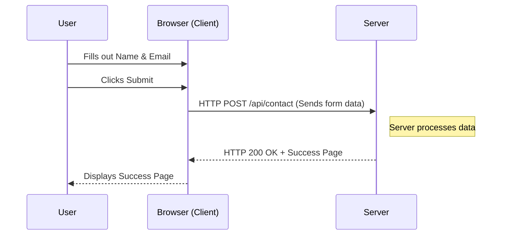
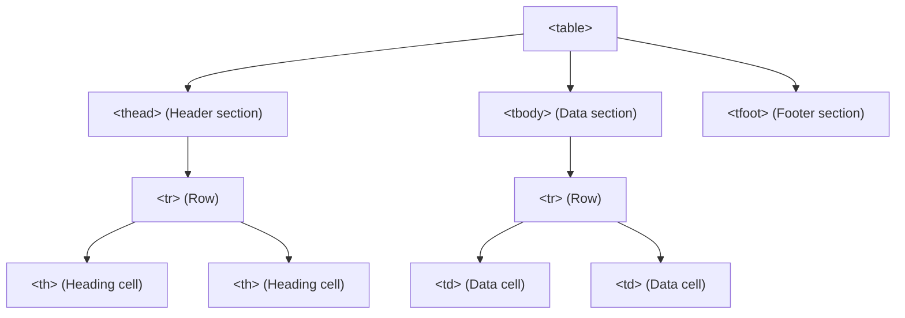

# Lecture 02 — HTML5 Forms, Tables & Multimedia

**Course:** Full-Stack Web Development
**Instructor:** Kyrillos Medhat
**Duration:** 3 hours (Theory + Lab)

---

## 📋 Prerequisites

> Before starting this lecture, make sure you have:
> - ✅ Completed Lecture 01
> - ✅ A strong grasp of the basic HTML5 boilerplate and semantic elements
> - ✅ Familiarity with absolute vs relative file paths
> - ✅ VS Code with Live Server extension running

---

## 🎯 Learning Objectives

By the end of this lecture, you will be able to:
- Understand what HTML forms are and why they exist
- Build forms with a variety of modern input types and validation
- Connect labels to inputs correctly for accessibility
- Use `<datalist>`, `<dialog>`, and the `popover` attribute
- Structure tabular data correctly using semantic HTML tables
- Embed audio, video, and external content in web pages

---

## 📋 Agenda

### Part 1 — Theory (~90 minutes)
1. What is a Form? Why Do We Need Them?
2. Form Architecture & Essential Elements
3. All Input Types Explained
4. Built-in Validation
5. Modern Interactive Elements (Dialog, Datalist, Popover)
6. Accessibility Best Practices
7. HTML Tables — Structure & Semantics
8. Audio, Video & Embedding

### Part 2 — Practice & Lab (~90–120 minutes)
1. Build a Job Application Form
2. Implement an Interactive Modal `<dialog>`
3. Portfolio Project Part 2: Contact Form & Projects Table

---

## 1. What is a Form? Why Do We Need Them?

### The Real-World Analogy
Think about filling out a paper form at a doctor's office. You write your name, date of birth, and symptoms in the provided blanks. Then you hand it to the receptionist, who passes the information to the doctor.

An **HTML form** works exactly the same way:
- The **form fields** (text boxes, checkboxes, dropdowns) = the blanks on the paper
- The **user** = the person filling it out
- The **server** = the receptionist/doctor who receives and processes the data

### Why Are Forms Critical?
Without forms, websites could only **show** information — they couldn't **receive** it. Forms enable:
- User login and registration
- Search bars (Google, YouTube)
- Online shopping checkout
- Contact pages
- Survey and quiz apps
- Any feature requiring user input

### How a Form Submission Works (Step by Step)

1. User fills in the form fields
2. User clicks the Submit button
3. The browser packages all the field values into a "request"
4. The browser sends the request to a URL (defined in the form's `action` attribute)
5. The server receives the data, processes it, and sends back a response
6. The browser displays the response to the user

Visually:



---

## 2. Form Architecture & Essential Elements

### The `<form>` Element

The `<form>` element is the **container** that wraps all your form controls. Everything the user fills in must go inside it.

```html
<form action="/submit" method="post">
  <!-- All form controls go inside here -->
</form>
```

Let's break down the two most important attributes:

| Attribute | What It Does | When to Use |
|-----------|-------------|-------------|
| `action` | The URL where the form data is sent when submitted | Always set this to your server endpoint, e.g. `action="/api/contact"` |
| `method` | How data is sent: `GET` or `POST` | Use `GET` for searches (data appears in URL), `POST` for everything else (data hidden in request body) |

> [!NOTE]
> **GET vs POST in plain English:**
> - `GET` is like shouting your order across a restaurant — everyone can hear it (data visible in URL bar)
> - `POST` is like passing a private note to the waiter — only the waiter sees it (data hidden in request body)
> - **Never use GET for passwords, credit card numbers, or private data**

### The Core Form Elements

Here is a quick overview of every element you'll use inside a form:

| Element | Purpose | Real-World Equivalent |
|---------|---------|-----------------------|
| `<label>` | A text caption that describes an input | The label on a form field: "First Name:" |
| `<input>` | Collects a single line of data | A text box or checkbox |
| `<select>` | A dropdown list | A drop-down menu |
| `<textarea>` | A multi-line text area | A large comment box |
| `<button>` | A clickable button | The "Submit" button |
| `<fieldset>` | Groups related fields together | A box around a group of fields |
| `<legend>` | A title for a `<fieldset>` | The title printed inside the box border |

### A Complete Basic Form

```html
<!-- The form sends data to /submit using the POST method -->
<form action="/submit" method="post">

  <!-- Fieldset groups related fields with a visual border and title -->
  <fieldset>
    <legend>Personal Information</legend>

    <!-- Label is linked to input via matching for="" and id="" -->
    <label for="fullname">Full Name:</label>
    <input type="text" id="fullname" name="fullname" placeholder="e.g. Alice Smith">

    <label for="email">Email Address:</label>
    <input type="email" id="email" name="email" placeholder="alice@example.com">
  </fieldset>

  <!-- The submit button sends the form data -->
  <button type="submit">Send My Information</button>

</form>
```

---

## 3. Connecting Labels to Inputs (Critical!)

This is one of the most important and most commonly missed concepts in HTML forms.

### Why Labels Matter
Imagine a form with five blank boxes and no labels. How would you know what to type in each one? Labels tell users (and screen readers for visually impaired people) what each field is asking for.

### The Correct Way: `for` and `id`

Every `<label>` should be linked to its `<input>` using two matching attributes:
- The `<label>` gets `for="someId"`
- The `<input>` gets `id="someId"`

```html
<!-- The for attribute value MUST match the input's id value exactly -->
<label for="username">Username:</label>
<input type="text" id="username" name="username">
```

**Two benefits of this connection:**
1. **Accessibility:** Screen readers announce "Username text field" when the user focuses it
2. **Usability:** Clicking the *label text* automatically focuses the input — larger click target!

> [!WARNING]
> **This is a critical accessibility failure.** If a form has inputs without associated labels, it fails WCAG accessibility standards and is unusable for people with visual impairments. Always link labels to inputs.

### The `name` Attribute — What Gets Sent to the Server

The `id` attribute is for *CSS and JavaScript* (used in the browser only).
The `name` attribute is what the *server* receives when the form is submitted.

```html
<input type="text" id="username" name="username" value="Alice">
<!-- Server receives: username=Alice -->

<input type="text" id="username" name="user_name" value="Alice">
<!-- Server receives: user_name=Alice -->
```

> [!TIP]
> Think of `id` as the field's name on your side (the browser), and `name` as the field's name on the server's side. They can be different, but it's clearest to keep them the same.

---

## 4. All Input Types Explained

The `type` attribute on `<input>` completely changes its behaviour. Here is every type you'll regularly use:

### Text & Basic Input Types

```html
<!-- Basic single-line text -->
<input type="text" id="name" name="name" placeholder="Your name">

<!-- Email — validates format (must contain @ and .) -->
<input type="email" id="email" name="email" placeholder="you@example.com">

<!-- Password — hides characters as dots/asterisks -->
<input type="password" id="pwd" name="pwd" placeholder="Min 8 characters">

<!-- Multi-line text box -->
<textarea id="message" name="message" rows="5" cols="40"
          placeholder="Type your message here..."></textarea>
```

### Numeric & Date Input Types

```html
<!-- Number — shows up/down arrows, validates numeric input -->
<input type="number" id="age" name="age" min="0" max="120" step="1">

<!-- Range — a draggable slider -->
<input type="range" id="volume" name="volume" min="0" max="100" value="50">

<!-- Date picker — shows a calendar popup -->
<input type="date" id="birthday" name="birthday">

<!-- Time picker -->
<input type="time" id="appt" name="appt">

<!-- Month picker -->
<input type="month" id="month" name="month">
```

### Selection Input Types

```html
<!-- Checkbox — can be checked or unchecked -->
<input type="checkbox" id="newsletter" name="newsletter" value="yes">
<label for="newsletter">Subscribe to newsletter</label>

<!-- Radio buttons — only ONE in the group can be selected at a time -->
<!-- Group them by giving them the same name attribute -->
<input type="radio" id="male" name="gender" value="male">
<label for="male">Male</label>

<input type="radio" id="female" name="gender" value="female">
<label for="female">Female</label>

<!-- Dropdown select -->
<select id="country" name="country">
  <option value="">-- Select your country --</option>
  <option value="eg">Egypt</option>
  <option value="us">United States</option>
  <option value="uk">United Kingdom</option>
</select>
```

### Special Input Types

```html
<!-- Phone number (shows dial pad on mobile) -->
<input type="tel" id="phone" name="phone" placeholder="+20 123 456 7890">

<!-- URL (validates web address format) -->
<input type="url" id="website" name="website" placeholder="https://example.com">

<!-- Color picker -->
<input type="color" id="fav-color" name="fav-color" value="#ff6b6b">

<!-- File upload -->
<input type="file" id="resume" name="resume" accept=".pdf,.doc">

<!-- Hidden field (sent to server but not shown to user) -->
<input type="hidden" name="form-source" value="contact-page">
```

### Mobile Keyboard Benefits

Different input types show different keyboards on smartphones:

```
type="email"   → Shows keyboard with @ key prominently
type="number"  → Shows numeric keypad
type="tel"     → Shows phone dial pad
type="url"     → Shows keyboard with .com key
type="text"    → Shows regular keyboard
```

> [!TIP]
> Always use the correct `type` — it dramatically improves the mobile user experience and provides free validation.

---

## 5. Built-in Validation

HTML5 lets you add validation rules directly in your HTML — the browser checks them automatically before the form is submitted. No JavaScript required!

### Validation Attributes

```html
<!-- required: field cannot be empty -->
<input type="text" name="name" required>

<!-- minlength / maxlength: text length constraints -->
<input type="text" name="username" minlength="3" maxlength="20" required>

<!-- min / max: numeric range constraints -->
<input type="number" name="age" min="18" max="65" required>

<!-- pattern: must match a Regular Expression pattern -->
<!-- This pattern requires exactly 3 uppercase letters -->
<input type="text" name="code" pattern="[A-Z]{3}" title="Enter 3 uppercase letters">

<!-- multiple: allow multiple email addresses separated by commas -->
<input type="email" name="emails" multiple>
```

### A Full Validated Form Example

```html
<form action="/register" method="post">
  <fieldset>
    <legend>Create Your Account</legend>

    <!-- Name: required, 2–50 characters -->
    <label for="reg-name">Full Name:</label>
    <input type="text"
           id="reg-name"
           name="name"
           required
           minlength="2"
           maxlength="50"
           placeholder="Alice Smith">

    <!-- Email: required, must be valid email format -->
    <label for="reg-email">Email:</label>
    <input type="email"
           id="reg-email"
           name="email"
           required
           placeholder="alice@example.com">

    <!-- Password: required, minimum 8 characters -->
    <label for="reg-password">Password:</label>
    <input type="password"
           id="reg-password"
           name="password"
           required
           minlength="8"
           placeholder="At least 8 characters">

    <!-- Age: required, between 18 and 100 -->
    <label for="reg-age">Age:</label>
    <input type="number"
           id="reg-age"
           name="age"
           required
           min="18"
           max="100">
  </fieldset>

  <button type="submit">Create Account</button>

  <!-- Reset clears all fields back to their default values -->
  <button type="reset">Clear Form</button>
</form>
```

> [!WARNING]
> **Front-end validation is a convenience, not security.** A malicious user can bypass HTML validation using browser developer tools or sending requests directly. Always validate data on the server as well.

---

## 6. Modern Interactive Elements

Modern HTML provides powerful UI components natively — no JavaScript libraries needed!

### `<datalist>` — Autocomplete Suggestions

`<datalist>` adds a suggestion dropdown to a text input. Unlike `<select>`, the user can also type any custom value not in the list.

```html
<!-- The input's list="" must match the datalist's id="" -->
<label for="tech">Favourite Technology:</label>
<input type="text" id="tech" name="tech" list="tech-options"
       placeholder="Start typing...">

<datalist id="tech-options">
  <option value="HTML">
  <option value="CSS">
  <option value="JavaScript">
  <option value="TypeScript">
  <option value="Angular">
  <option value="React">
  <option value="ASP.NET Core">
</datalist>
```

**How it works:** As the user types, the browser filters and shows matching options. They can pick one or type something completely different.

> [!NOTE]
> `<datalist>` vs `<select>`:
> - `<select>` = user *must* pick from the list (strict)
> - `<datalist>` = user *can* pick from the list or type their own (flexible)

### `<dialog>` — Native Modal Windows

A modal is a popup window that appears on top of the page content. Before HTML's `<dialog>`, modals required complex JavaScript and CSS. Now they're built in!

```html
<!-- The dialog is hidden by default — display:none -->
<dialog id="terms-modal">
  <h2>Terms of Service</h2>
  <p>By using this service, you agree to our terms...</p>
  <p>We may collect usage data to improve your experience.</p>

  <!-- A form with method="dialog" closes the modal when submitted -->
  <form method="dialog">
    <button value="agreed">I Agree</button>
    <button value="declined">Decline</button>
  </form>
</dialog>

<!-- This button opens the modal -->
<button onclick="document.getElementById('terms-modal').showModal()">
  View Terms of Service
</button>

<!-- Optional: Handle the user's choice with JavaScript -->
<script>
  const dialog = document.getElementById('terms-modal');
  dialog.addEventListener('close', () => {
    // dialog.returnValue is the value of the button that was clicked
    if (dialog.returnValue === 'agreed') {
      console.log('User agreed to terms');
    } else {
      console.log('User declined');
    }
  });
</script>
```

**Key `<dialog>` methods:**
- `dialog.show()` — Opens as a regular (non-blocking) dialog
- `dialog.showModal()` — Opens as a modal (blocks everything behind it, adds backdrop)
- `dialog.close()` — Closes the dialog

### The `popover` Attribute — Zero-JavaScript Tooltips & Menus

The Popover API lets you create toggleable overlays without writing any JavaScript at all!

```html
<!-- Step 1: Add popovertarget to the button, pointing to the popover's id -->
<button popovertarget="help-info">
  ❓ What is this?
</button>

<!-- Step 2: Add popover attribute to the element you want to show/hide -->
<div id="help-info" popover>
  <h3>About This Field</h3>
  <p>Enter your government-issued ID number.</p>
  <p>This is used to verify your identity only.</p>
</div>
```

**How it works automatically:**
- Clicking the button shows the popover
- Clicking outside the popover or pressing Escape closes it
- No JavaScript required!

> [!TIP]
> Use `popover` for tooltips, "help" text overlays, notification panels, and simple menus. Use `<dialog>` for anything that requires a formal user decision (confirm/cancel).

---

## 7. Accessibility Best Practices

Accessibility means making your web pages usable by **everyone**, including people who use screen readers, keyboard navigation, or other assistive technologies.

### Grouping Fields with `<fieldset>` and `<legend>`

```html
<form action="/apply" method="post">

  <!-- Group 1: Personal Information -->
  <fieldset>
    <legend>Personal Information</legend>

    <label for="first-name">First Name:</label>
    <input type="text" id="first-name" name="first_name" required>

    <label for="last-name">Last Name:</label>
    <input type="text" id="last-name" name="last_name" required>

    <label for="dob">Date of Birth:</label>
    <input type="date" id="dob" name="dob" required>
  </fieldset>

  <!-- Group 2: Contact Details -->
  <fieldset>
    <legend>Contact Details</legend>

    <label for="email">Email:</label>
    <input type="email" id="email" name="email" required>

    <label for="phone">Phone Number:</label>
    <input type="tel" id="phone" name="phone">
  </fieldset>

  <button type="submit">Submit Application</button>
</form>
```

A `<fieldset>` draws a visible border around related inputs. The `<legend>` is the title printed in that border. Screen readers announce the legend when the user enters the fieldset.

### ARIA Attributes

ARIA (Accessible Rich Internet Applications) attributes add extra accessibility information that HTML alone can't express.

```html
<!-- aria-describedby links an input to a help text element -->
<label for="pwd">Password:</label>
<input type="password"
       id="pwd"
       name="password"
       aria-describedby="pwd-requirements"
       required>
<!-- Screen readers will read this text when the input is focused -->
<p id="pwd-requirements" class="help-text">
  Must be at least 8 characters, include a number and a symbol.
</p>

<!-- aria-label provides an invisible label (use when a visible label isn't possible) -->
<button aria-label="Close the navigation menu">✕</button>

<!-- aria-required is the ARIA version of the HTML required attribute -->
<input type="text" aria-required="true">

<!-- aria-invalid marks a field as having an invalid value -->
<input type="email" aria-invalid="true">
```

### Accessible Error Messages

```html
<form>
  <label for="user-email">Email:</label>
  <input type="email"
         id="user-email"
         name="email"
         aria-describedby="email-error"
         required>

  <!-- This error message is linked to the input via aria-describedby -->
  <span id="email-error" role="alert" style="color: red; display: none;">
    Please enter a valid email address.
  </span>
</form>
```

> [!TIP]
> **WCAG Quick Checklist:**
> - ✅ Every input has a `<label>` linked via `for`/`id`
> - ✅ Error messages are programmatically linked with `aria-describedby`
> - ✅ Required fields are marked with `required` (or `aria-required`)
> - ✅ Colour is not the *only* way to convey information (e.g., don't only turn a border red — also show text)

---

## 8. HTML Tables

### What Are Tables For?

Tables display **tabular data** — information that naturally belongs in rows and columns, like a spreadsheet.

**Correct uses of tables:**
- Product comparison charts
- Schedule/timetable grids
- Financial data
- Sports standings

**Incorrect uses (never do this):**
- Creating a two-column page layout → Use CSS Flexbox or Grid instead
- Placing an image next to text → Use CSS

> [!WARNING]
> Using tables for layout was common in the 1990s but is now considered bad practice. It breaks accessibility, responsive design, and maintainability. Tables are only for data.

### The Complete Table Structure



### Full Table Example

```html
<table>
  <!-- thead: The header row — use <th> not <td> for column headings -->
  <thead>
    <tr>
      <!-- scope="col" tells screen readers this header is for a column -->
      <th scope="col">Name</th>
      <th scope="col">Role</th>
      <th scope="col">Department</th>
      <th scope="col">Salary</th>
    </tr>
  </thead>

  <!-- tbody: The main data rows -->
  <tbody>
    <tr>
      <td>Alice Johnson</td>
      <td>Senior Developer</td>
      <td>Engineering</td>
      <td>$95,000</td>
    </tr>
    <tr>
      <td>Bob Smith</td>
      <td>UX Designer</td>
      <td>Design</td>
      <td>$80,000</td>
    </tr>
    <tr>
      <td>Carol White</td>
      <td>Project Manager</td>
      <td>Operations</td>
      <td>$88,000</td>
    </tr>
  </tbody>

  <!-- tfoot: Summary or totals row -->
  <tfoot>
    <tr>
      <!-- colspan merges cells across multiple columns -->
      <td colspan="3">Total Employees: 3</td>
      <td>$263,000</td>
    </tr>
  </tfoot>
</table>
```

### Merging Cells: `colspan` and `rowspan`

```html
<table border="1">
  <thead>
    <tr>
      <th>Product</th>
      <!-- colspan="2" makes this header span 2 columns -->
      <th colspan="2">Sales (Units)</th>
    </tr>
    <tr>
      <th></th>
      <th>Q1</th>
      <th>Q2</th>
    </tr>
  </thead>
  <tbody>
    <tr>
      <!-- rowspan="2" makes this cell span 2 rows -->
      <td rowspan="2">Widget A</td>
      <td>150</td>
      <td>200</td>
    </tr>
    <tr>
      <td>180</td>
      <td>220</td>
    </tr>
  </tbody>
</table>
```

### The `scope` Attribute for Accessible Tables

```html
<table>
  <thead>
    <tr>
      <!-- scope="col" = this header describes a column -->
      <th scope="col">Month</th>
      <th scope="col">Revenue</th>
    </tr>
  </thead>
  <tbody>
    <tr>
      <!-- scope="row" = this header describes a row -->
      <th scope="row">January</th>
      <td>$50,000</td>
    </tr>
    <tr>
      <th scope="row">February</th>
      <td>$62,000</td>
    </tr>
  </tbody>
</table>
```

---

## 9. Multimedia — Audio, Video & Embedding

### The `<video>` Element

The `<video>` element embeds a native video player directly in your page. No plugin or third-party software required.

```html
<video
  controls          <!-- Shows play/pause/volume controls -->
  width="800"       <!-- Set the width in pixels -->
  poster="thumb.jpg"  <!-- Image shown before the video plays -->
  preload="metadata"  <!-- Loads only metadata (duration, dimensions) on page load -->
>

  <!-- Provide multiple formats for browser compatibility -->
  <!-- Browsers will use the first format they support -->
  <source src="lecture.mp4" type="video/mp4">
  <source src="lecture.webm" type="video/webm">

  <!-- Subtitles/captions track (REQUIRED for accessibility) -->
  <track
    src="captions-en.vtt"
    kind="subtitles"
    srclang="en"
    label="English"
    default
  >

  <!-- Fallback text for browsers that don't support <video> -->
  Your browser doesn't support HTML5 video.
</video>
```

**`<video>` attribute summary:**

| Attribute | What it does |
|-----------|-------------|
| `controls` | Shows the built-in player controls |
| `autoplay` | Starts playing automatically (avoid — annoying to users) |
| `muted` | Mutes audio (required for autoplay to work in most browsers) |
| `loop` | Repeats the video endlessly |
| `poster` | Thumbnail image shown before playing |
| `preload` | `"none"`, `"metadata"`, or `"auto"` — controls how much is pre-downloaded |

> [!IMPORTANT]
> Captions via `<track>` are **not optional** for public-facing content — they are required by accessibility laws (like ADA in the US and similar legislation elsewhere). Always provide subtitles.

### The `<audio>` Element

Works almost identically to `<video>`:

```html
<audio controls preload="none">
  <source src="podcast-episode.mp3" type="audio/mpeg">
  <source src="podcast-episode.ogg" type="audio/ogg">
  Your browser doesn't support HTML5 audio.
</audio>
```

### The `<figure>` and `<figcaption>` Elements

Use these to add a caption to any media:

```html
<figure>
  <video controls width="800">
    <source src="demo.mp4" type="video/mp4">
  </video>
  <figcaption>
    Figure 1: Demonstration of the completed project from Lecture 02.
  </figcaption>
</figure>

<figure>
  
  <figcaption>Figure 2: How the client and server communicate.</figcaption>
</figure>
```

### Embedding with `<iframe>`

`<iframe>` (inline frame) embeds another web page or external content inside your page. Common uses include YouTube videos, Google Maps, and social media posts.

```html
<!-- Embedding a YouTube Video -->
<iframe
  width="800"
  height="450"
  src="https://www.youtube.com/embed/VIDEO_ID_HERE"
  title="HTML5 Forms Tutorial"
  frameborder="0"
  allow="accelerometer; autoplay; clipboard-write; encrypted-media; gyroscope; picture-in-picture"
  allowfullscreen
  loading="lazy"
></iframe>

<!-- Embedding Google Maps -->
<iframe
  src="https://www.google.com/maps/embed?pb=..."
  width="600"
  height="450"
  style="border:0"
  allowfullscreen
  loading="lazy"
  referrerpolicy="no-referrer-when-downgrade"
></iframe>
```

> [!TIP]
> Always add `loading="lazy"` to iframes. Without it, the browser downloads the iframe content immediately, even if the user never scrolls to it — slowing down your page significantly.

---

## 🧠 Think Like a Developer

### Scenario 1: Structuring a Complex Form
> You need to build a massive checkout form that collects shipping, billing, and payment details.

**Decision:** Don't just dump 30 inputs into a single `<form>` block. Use `<fieldset>` to group them logically (Shipping, Billing, Payment). Use `<legend>` to title each group. This makes the code readable and ensures screen readers announce the form sections clearly.

### Scenario 2: Selecting the Correct Input Type
> You need to ask the user for their age. Should you use `<input type="text">` or `<input type="number">`?

**Decision:** Always use the most specific type available. `<input type="number">` prevents the user from typing "Twenty", automatically provides up/down arrows in the browser, brings up the numeric keypad on mobile devices, and allows you to use `min` and `max` attributes for validation.

### Scenario 3: To AutoPlay or Not to AutoPlay?
> Your client wants a promotional video to play immediately when the user lands on the site.

**Decision:** Explain to the client that autoplaying video with sound is a terrible user experience and is often blocked by browsers natively. Suggest autoplaying *muted* video as a background element, or better yet, using a compelling `poster` image and letting the user press play.

---

## ❌→✅ Before vs After

### 1. Form Labels
```html
<!-- ❌ Before: Unlinked text next to input -->
<span>Email: </span> <input type="email" name="userEmail">

<!-- ✅ After: Properly linked label for accessibility -->
<label for="userEmail">Email: </label>
<input type="email" id="userEmail" name="userEmail">
```

### 2. Table Data Flow
```html
<!-- ❌ Before: Using tables for layout -->
<table>
  <tr>
    <td></td>
    <td>Welcome to our site!</td>
  </tr>
</table>

<!-- ✅ After: Using tables only for tabular data -->
<table>
  <thead>
    <tr>
      <th scope="col">Item</th>
      <th scope="col">Price</th>
    </tr>
  </thead>
  <tbody>
    <tr>
      <td>Apples</td>
      <td>$2.00</td>
    </tr>
  </tbody>
</table>
```

---

## ⚠️ Common Mistakes & How to Avoid Them

| ❌ Mistake | ✅ Fix |
|-----------|--------|
| Inputs without `<label>` tags | Every input must have a paired `<label>` using `for`/`id` |
| Using `<table>` for page layout | Use CSS Flexbox or Grid for layout; tables only for data |
| Forgetting the `name` attribute on inputs | The server only sees fields with a `name` attribute — without it, the data isn't sent |
| Using `GET` method for sensitive data | Always use `POST` for passwords, personal info, payment data |
| Not adding `alt` to images | Every `` must have a meaningful `alt` attribute |
| Not adding captions (`<track>`) to videos | Required for accessibility compliance |
| Embedding large iframes without `loading="lazy"` | Always add `loading="lazy"` to iframes and below-the-fold images |
| Radio buttons without the same `name` attribute | Radio buttons in the same group MUST share the same `name` — otherwise multiple can be selected |

---

## 🧪 Practice Labs

### Lab 1: Job Application Form (45 min)

Build a complete job application form using modern input types and validation.

**Requirements:**
1. Create a new file: `labs/job-application.html`
2. Add a `<form action="/apply" method="post">`
3. Use `<fieldset>` to group:
   - **Personal Info:** Full Name (`text`), Email (`email`), Phone (`tel`), Date of Birth (`date`)
   - **Job Preferences:** Desired Role (`<datalist>` with options), Available Start Date (`date`), Salary Expectation (`number`, min="0")
   - **Experience:** Years of experience (`<select>` with options: 0-1, 1-3, 3-5, 5+), Short bio (`<textarea>`)
4. Add `required` to all critical fields
5. Add a Submit button and a Reset button

### Lab 2: Interactive Modal Dialog (20 min)

1. Create `labs/modal-demo.html`
2. Add a `<dialog id="terms">` containing Terms of Service text (3–4 paragraphs)
3. Add a "View Terms" button that opens the modal with `.showModal()`
4. Inside the dialog, add a `<form method="dialog">` with "I Agree" and "Decline" buttons
5. Use JavaScript to detect which button was pressed and show an alert

---

## 📝 Assignment: Portfolio Project — Part 2

Continue building your Developer Portfolio from Lecture 01.

### Requirements

1. **Contact Form** — Add to `<section id="contact">`:
   ```html
   <form action="#" method="post">
     <!-- Your name, email, message textarea -->
     <!-- Use required on all fields -->
     <!-- Use proper labels -->
   </form>
   ```
   - Fields: Full Name (`text`), Email (`email`), Subject (`text`), Message (`textarea`)
   - All fields must be `required`
   - Use proper `<label>` tags with `for`/`id` connections
   - Add a `<button type="submit">Send Message</button>`

2. **Projects Table** — Add to `<section id="projects">`:
   - Use `<thead>`, `<tbody>`, `<th scope="col">`, `<td>`
   - Columns: Project Name | Technologies | Status | Link
   - Add at least 3 projects (they can be planned, not built yet)

3. **Hire Me Popover** — Add in the footer:
   ```html
   <button popovertarget="hire-me-info">💼 Hire Me</button>
   <div id="hire-me-info" popover>
     <h3>Let's Work Together</h3>
     <p>Email: yourname@example.com</p>
     <p>Phone: +20 XXX XXX XXXX</p>
   </div>
   ```

### Optional Bonus
- Embed a YouTube video in a new `<section id="about-video">`
- Add a Google Map to your contact section using `<iframe>`
- Add form validation feedback with JavaScript (we'll learn this in Lecture 11)

---

## 💼 Interview Prep

**Q1: What is the difference between the GET and POST methods in an HTML form?**
> GET sends the form data by appending it to the URL, making it visible and bookmarkable. It should only be used for non-sensitive data, like search queries. POST sends the form data inside the HTTP request body, keeping it hidden from the URL. It is used for submitting sensitive data like passwords or when uploading files.

**Q2: How do you make an HTML form accessible?**
> Forms are made accessible primarily by pairing every `<input>` with a descriptive `<label>` using the `for` and `id` attributes. Additionally, using `<fieldset>` and `<legend>` groups related inputs logically, and using ARIA attributes like `aria-describedby` links error messages directly to the fields they describe.

**Q3: When should you use an HTML table?**
> HTML tables should be used strictly for presenting tabular data—data that inherently belongs in rows and columns, such as financial reports or schedules. Tables should *never* be used for page layout, as this breaks accessibility and responsive design.

**Q4: What is the difference between `<select>` and `<datalist>`?**
> A `<select>` element restricts the user to choosing only from the predefined options in the dropdown. A `<datalist>` provides autocomplete suggestions as the user types, but still allows the user to input a custom value that isn't on the list.

**Q5: Why is `loading="lazy"` important for `<iframe>` elements?**
> `loading="lazy"` defers the loading of the iframe (such as a heavy YouTube video or Google Map) until the user scrolls near it. Without it, the browser downloads all the iframe content immediately on page load, which drastically hurts performance and increases load times.

---

## 📄 Cheat Sheet

### Form Inputs
| Type | Use |
|------|-----|
| `<input type="text">` | Standard single-line text |
| `<input type="email">` | Email validation |
| `<input type="password">`| Obscured text |
| `<input type="number">`| Numeric input with arrows |
| `<input type="date">` | Calendar picker |
| `<input type="checkbox">`| Multi-select options |
| `<input type="radio">` | Single-select options (group by `name`) |
| `<input type="file">` | File upload |

### Table Elements
| Tag | Purpose |
|-----|---------|
| `<table>` | Container for the entire table |
| `<thead>` | Container for the header row(s) |
| `<tbody>` | Container for the main data rows |
| `<tr>` | A single table row |
| `<th>` | A header cell |
| `<td>` | A data cell |

### Multimedia
| Tag | Purpose |
|-----|---------|
| `<video controls>` | Embeds native video player |
| `<audio controls>` | Embeds native audio player |
| `<track>` | Subtitles/captions for video |
| `<iframe src="...">` | Embeds external content |

---

## 🔗 Resources

| Resource | Link |
|----------|------|
| MDN — Forms Guide | https://developer.mozilla.org/en-US/docs/Learn/Forms |
| MDN — `<input>` types | https://developer.mozilla.org/en-US/docs/Web/HTML/Element/input |
| MDN — `<dialog>` element | https://developer.mozilla.org/en-US/docs/Web/HTML/Element/dialog |
| MDN — Popover API | https://developer.mozilla.org/en-US/docs/Web/API/Popover_API |
| WebAIM — Accessible Forms | https://webaim.org/techniques/forms/ |

---

## 📌 Key Takeaways

- **Forms are the backbone of user interaction** — login, search, checkout, contact — all use forms
- **Always pair `<label>` with inputs** using matching `for` and `id` attributes — required for accessibility
- **`name` attribute** determines what gets sent to the server; `id` is for browser-side use
- **Use the right input `type`** — `email`, `tel`, `date`, `number` etc. give you free validation and better mobile keyboards
- **HTML5 validation** (`required`, `min`, `max`, `pattern`) runs before the form is submitted — but always validate on the server too
- **Modern HTML provides `<datalist>`, `<dialog>`, and `popover`** natively — no need for JavaScript libraries for common UI patterns
- **Tables are for tabular data only** — use `<thead>`, `<tbody>`, `<tfoot>`, and `scope` attributes for accessibility
- **`<video>` and `<audio>`** need a `<track>` for captions/subtitles — required for accessibility compliance
- **`loading="lazy"` on `<iframe>`** is critical for page performance

---

**Next Lecture:** [Lecture 03 — CSS3 Fundamentals & Selectors →](./03%20-%20CSS3%20Fundamentals%20%26%20Selectors.md)