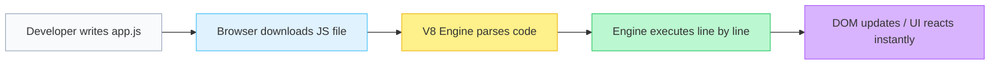

# Lecture 09 — JavaScript Basics: Syntax, Types & Control Flow

**Course:** Full-Stack Web Development  
**Instructor:** Kyrillos Medhat  
**Duration:** 3 hours (Theory + Lab)

---

## 📋 Prerequisites

> Before starting this lecture, make sure you can:
> - ✅ Create an HTML file with proper boilerplate — [Lecture 01](./01%20-%20Introduction%20to%20Web%20Development%20%26%20HTML5%20Basics.md)
> - ✅ Link external files (CSS, JS) from HTML — [Lecture 01](./01%20-%20Introduction%20to%20Web%20Development%20%26%20HTML5%20Basics.md)
> - ✅ Open browser DevTools (F12) and navigate to the Console tab — [Lecture 00](./00%20-%20Introduction%20to%20Computers%20%26%20Web%20Development.md)
> - ✅ Use VS Code and Live Server — [Lecture 00](./00%20-%20Introduction%20to%20Computers%20%26%20Web%20Development.md)

---

## 🎯 Learning Objectives

By the end of this lecture, you will be able to:
- Explain what JavaScript is, how the browser executes it, and why it is the language of the web
- Use the browser console and `console.log()` to output data and debug code
- Declare variables with `let` and `const`, and clearly explain why `var` is avoided in modern code
- Identify and work with all 7 primitive data types (string, number, boolean, null, undefined, bigint, symbol)
- Construct complex strings using modern template literals
- Predict the outcome of type coercion and evaluate truthy/falsy values
- Write solid conditional logic with `if/else`, ternary operators, and `switch` statements
- Control application flow using iterative loops: `for`, `while`, `for...of`, and `for...in`

---

## 📋 Agenda

### Part 1 — Theory (~90 minutes)
1. What is JavaScript? Adding JS to HTML
2. Variables: `let`, `const`, and the legacy of `var`
3. Primitive Data Types & The `typeof` Operator
4. Template Literals for String Building
5. Type Coercion & Truthy/Falsy Rules
6. Operators (Arithmetic, Assignment, Logical)
7. Conditionals: `if/else`, ternary, `switch`
8. Loops: `for`, `while`, `for...of`, `for...in`

### Part 2 — Practice & Lab (~90–120 minutes)
1. Think Like a Developer + Before vs After Scenarios
2. Lab 1: Console Calculator
3. Lab 2: Number Guessing Game
4. TaskFlow Project Introduction

---

## 1. What is JavaScript?

JavaScript is unequivocally the **programming language of the web**. If HTML is the skeleton that provides structure, and CSS is the skin and clothing that provides appearance, then JavaScript is the muscles and brain — it makes things move, react, calculate, and think.

JavaScript historically ran only **in the browser** (frontend) to create interactive webpages. Today, thanks to environments like Node.js, it also runs on **servers** (backend), allowing developers to build full-stack applications with a single language. In this course, we will heavily utilize both.

### How JavaScript Executes



Unlike compiled languages (like C++ or Java) where code is converted to machine code before you ship it, JavaScript is historically an interpreted language. The browser's JS engine (like Chrome's V8) reads the text, compiles it on the fly (JIT compilation), and executes it immediately in the user's browser.

### Adding JavaScript to HTML

There are two primary ways to run JS in the browser.

```html
<!-- Method 1: Inline (Avoid in real projects) -->
<!-- Problem: Mixes structure and logic, hard to cache, terrible for maintenance -->
<script>
  console.log("Hello, World!");
</script>

<!-- Method 2: External file (Highly Recommended) -->
<!-- The browser downloads app.js separately, caching it for faster page loads -->
<script src="app.js" defer></script>
```

> [!IMPORTANT]
> **Always use the `defer` attribute** when linking scripts in the `<head>`. Without it, when the browser sees a `<script>` tag, it completely stops rendering the HTML until the script is downloaded and executed (Render Blocking). `defer` tells the browser: "Download this in the background, but wait to execute it until the HTML is fully parsed and the DOM is ready."

### The Console: Your Best Friend

The browser console (`F12` → Console tab) is your primary debugging environment. It allows you to output data to yourself without showing it to the user.

```js
console.log("Regular message — great for checking variable values.");
console.warn("Warning message — highlights in yellow, draws attention.");
console.error("Error message — highlights in red, prints a stack trace.");

// Pro tip: Use console.table for arrays and objects
const users = [{id: 1, name: "Alice"}, {id: 2, name: "Bob"}];
console.table(users); // Renders a beautiful visual table in the DevTools
```

---

## 2. Variables: `let`, `const`, and `var`

A variable is a **named container** for storing data in the computer's memory. Think of it like a labeled box where you can keep a value and look it up later.

Modern JavaScript (ES6, released in 2015) introduced `let` and `const`.

```js
// const = CONSTANT. The binding cannot be reassigned.
const API_URL = "https://api.example.com"; 

// let = Variable that can be reassigned later.
let score = 0;                              
score = 10;                                 // ✅ This perfectly fine

API_URL = "https://hacked.com";             // ❌ TypeError: Assignment to constant variable.
```

> [!WARNING]
> **Never use `var`.** Before 2015, `var` was the only way to declare variables. However, `var` is function-scoped (not block-scoped) and gets "hoisted" in confusing ways, which leads to unpredictable bugs where variables bleed out of `if` blocks or loops. Always use `const` by default, and `let` only when you explicitly know the value will change.

| Keyword | Reassignable? | Scope | Use when... |
|---------|:------------:|-------|-------------|
| `const` | ❌ No | Block | Default choice. When the value won't change. |
| `let` | ✅ Yes | Block | Value will change (e.g., counters, state flags). |
| `var` | ✅ Yes | Function | Never. Exists only for legacy browser support. |

---

## 3. Primitive Data Types

JavaScript is a dynamically typed language, meaning you don't explicitly say "this is a string". The engine figures it out. JavaScript has **7 primitive types**. Primitives are immutable (they cannot be fundamentally altered, only reassigned).

```js
const name = "Kyrillos";       // 1. String (Text data)
const age = 25;                // 2. Number (Integers and floats are the same type)
const isAdmin = true;          // 3. Boolean (Logical true or false)

let x;                         // 4. undefined (Variable created, but has no value yet)
const empty = null;            // 5. null (Explicitly intentionally empty/void)

const huge = 9007199254740991n; // 6. BigInt (For numbers larger than the Number max safe integer)
const id = Symbol("id");       // 7. Symbol (Guaranteed unique identifier, used in complex library dev)
```

### The `typeof` Operator

You can check the type of any variable using the `typeof` operator:

```js
typeof "hello"     // "string"
typeof 42          // "number"
typeof true        // "boolean"
typeof undefined   // "undefined"
typeof 10n         // "bigint"
typeof Symbol()    // "symbol"

// The famous JS Bug:
typeof null        // "object"  ← Wait, what? 
// null is a primitive, but due to a bug in the very first version of JavaScript 
// from 1995, typeof null returns "object". It cannot be fixed without breaking old websites.

// Arrays and Objects
typeof []          // "object"  ← Arrays are structurally objects under the hood.
```

> [!TIP]
> Because `typeof []` returns `"object"`, you cannot use it to verify an array. Instead, use the built-in method: `Array.isArray([]) === true`.

---

## 4. Template Literals

Before ES6, combining variables and text (concatenation) was a painful process of adding plus signs and manual spaces. Today, we use **Template Literals**, denoted by backticks (`` ` ``).

They allow you to embed JavaScript expressions directly inside the string using `${ }`, and they natively support multi-line strings without needing `\n`.

```js
const user = "Alex";
const itemsInCart = 3;
const price = 29.99;

// Old way (Concatenation)
const oldMsg = "Hello " + user + ".\nYou have " + itemsInCart + " items total: $" + (itemsInCart * price);

// Modern way (Template Literal)
const newMsg = `Hello ${user}.
You have ${itemsInCart} items total: $${itemsInCart * price}`;

console.log(newMsg);
```

Template literals are especially critical when generating HTML fragments dynamically from JavaScript.

---

## 5. Type Coercion & Truthy/Falsy

### Type Coercion

Because JavaScript is dynamically typed, it tries to be "helpful" by automatically converting (coercing) types when you perform operations on mismatched types. This causes immense confusion.

```js
"5" + 3    // "53"  (The + operator sees a string, converts the 3 to a string, and concatenates)
"5" - 3    // 2     (The - operator only works on numbers, so it converts the "5" to a number)
"5" * 2    // 10    (String to Number coercion)
"hello" - 2 // NaN   (Not a Number. You can't subtract from letters)
```

### The Equality Trap (`==` vs `===`)

```js
"5" == 5   // true  (Loose Equality: JS coerces the string to a number, then compares)
"5" === 5  // false (Strict Equality: Checks type AND value. String !== Number)
```

> [!IMPORTANT]
> **Always use `===`** (strict equality) and `!==` (strict inequality). Never use `==`. Relying on loose equality makes your code unpredictable.

### Truthy and Falsy

In a boolean context (like an `if` statement or a `while` loop condition), JavaScript will evaluate **any** value and decide if it acts like `true` (truthy) or `false` (falsy).

**The 8 falsy values** (memorize these — everything else in the entire language is truthy):

```js
false
0
-0
0n (BigInt zero)
"" (Empty string)
null
undefined
NaN (Not a Number)
```

Everything else is Truthy. Including surprising things like `"0"` (a string containing zero), `" "` (a string containing a space), `[]` (an empty array), and `{}` (an empty object).

```js
let username = "";
if (username) {
  // Won't run, empty string is falsy.
}

let balance = 0;
if (balance) {
  // Won't run, 0 is falsy.
}
```

---

## 6. Operators

### Arithmetic & Assignment

```js
10 + 3   // 13
10 - 3   // 7
10 * 3   // 30
10 / 3   // 3.3333333333333335
10 % 3   // 1 (Modulo/Remainder. Excellent for finding even/odd numbers)
10 ** 3  // 1000 (Exponentiation. 10 to the power of 3)

let x = 10;
x += 5;  // 15 (Shorthand for x = x + 5)
x++;     // 16 (Increment by 1)
x--;     // 15 (Decrement by 1)
```

### Comparison & Logical

```js
5 === 5     // true (Strict Equal)
5 !== "5"   // true (Strict Not Equal)
5 > 3       // true

// AND (&&) - Both sides must be truthy
true && true   // true
true && false  // false

// OR (||) - At least one side must be truthy
true || false  // true
false || false // false

// NOT (!) - Flips truthiness
!true          // false
!!""           // false (Double-bang trick to explicitly convert to a boolean primitive)
```

### Nullish Coalescing (`??`)

A modern operator that provides a fallback value *only* if the left side is `null` or `undefined`. It differs from `||` which falls back on *any* falsy value (like `0` or `""`).

```js
const score = 0;

const display1 = score || 10;  // Returns 10. Because 0 is falsy. (Often a bug!)
const display2 = score ?? 10;  // Returns 0. Because 0 is NOT null or undefined.
```

---

## 7. Conditionals

### `if / else if / else`

The backbone of logic. Code branches based on truthy/falsy evaluation.

```js
const score = 85;

if (score >= 90) {
  console.log("Grade: A");
} else if (score >= 80) {
  console.log("Grade: B"); // ← This block runs, and the statement exits.
} else if (score >= 70) {
  console.log("Grade: C"); // Skipped.
} else {
  console.log("Grade: F");
}
```

### Ternary Operator (Inline If/Else)

Perfect for one-line assignment based on a condition.
Syntax: `condition ? valueIfTrue : valueIfFalse`

```js
const age = 20;

// Verbose if/else
let status;
if (age >= 18) {
  status = "Adult";
} else {
  status = "Minor";
}

// Clean Ternary
const modernStatus = age >= 18 ? "Adult" : "Minor";
```

### The `switch` Statement

When comparing a single variable against many specific absolute values, `switch` is cleaner than deeply chained `if/else if` statements.

```js
const day = "Tuesday";

switch (day) {
  case "Monday": 
  case "Tuesday": 
  case "Wednesday":
  case "Thursday":
  case "Friday":
    console.log("It's a Weekday."); 
    break; // Without break, it falls through to the next case!
    
  case "Saturday": 
  case "Sunday":
    console.log("It's the Weekend!"); 
    break;
    
  default: // Like the 'else' block
    console.log("Invalid day string.");
}
```

---

## 8. Loops

Loops run a block of code multiple times.

### `for` Loop (Count-based)

Use when you know exactly how many times the loop should run.

```js
// 1. Initialize (let i = 0)
// 2. Condition (i < 5)
// 3. Increment after each run (i++)
for (let i = 0; i < 5; i++) {
  console.log(`Iteration number ${i}`); 
  // Prints 0, 1, 2, 3, 4
}
```

### `while` Loop (Condition-based)

Use when you don't know the exact count, but you know when it should stop (e.g., waiting for user input, or processing until a database queue is empty).

```js
let ammo = 3;
while (ammo > 0) {
  console.log("Bang!");
  ammo--;
}
// Loop exits when ammo reaches 0
```

### `for...of` (Iterating Values)

The modern, clean way to loop over iterables like Arrays and Strings.

```js
const colors = ["red", "green", "blue"];

for (const color of colors) {
  console.log(color); // Prints "red", then "green", then "blue"
}
```

### `for...in` (Iterating Object Keys)

Used exclusively for enumerating properties (keys) of an Object.

```js
const user = { name: "Alex", age: 25, role: "Admin" };

for (const key in user) {
  console.log(`${key}: ${user[key]}`);
  // name: Alex
  // age: 25
  // role: Admin
}
```

### `break` and `continue`

- `break`: Completely destroys and exits the loop immediately.
- `continue`: Skips the rest of the current iteration and jumps immediately to the next loop cycle.

```js
for (let i = 0; i < 10; i++) {
  if (i === 5) break;        // Kills the loop entirely when i reaches 5
  if (i % 2 === 0) continue; // Skips even numbers
  console.log(i);            // Only prints 1, 3
}
```

---

## 🧠 Think Like a Developer

### Scenario 1: User Input Validation
> Your form collects a user's age. They type `"25"` (a string from the HTML input field). You need to check if they're 18 or older.

**Decision:** Convert the string to a number first with `Number(age)` or `parseInt(age, 10)`, then compare with `>=`. Do not use loose equality `==` to shortcut checks. While a `"25" >= 18` comparison technically works in JS due to implicit coercion, relying on implicit coercion is dangerous. Explicit conversion is clearer, safer, and shows professional intent.

### Scenario 2: Default Values and Zero
> Your function receives a `userScore` parameter that might be `null`, `undefined`, or an actual `0`. You want to default to `100` if no data is provided.

**Decision:** You use `??` (nullish coalescing). If you use `||` (logical OR), then `0 || 100` will return `100` because `0` is falsy, destroying the user's legitimate score of zero. `0 ?? 100` correctly evaluates to `0` because `0` is not null or undefined.

### Scenario 3: Choosing a Loop
> You have an array of 1000 products and need to find the first one priced over $500, then stop searching to save CPU cycles.

**Decision:** You use a `for...of` loop combined with `break`. You do not use modern array methods like `.forEach()` because you physically cannot `break` out of a `forEach` loop early; it will stubbornly iterate all 1000 items even if it finds the answer on item 2.

---

## ❌→✅ Before vs After

### 1. Variable Declarations
```js
// ❌ Before: Using var everywhere (Hoisting risks, global scope pollution)
var name = "Alex";
var age = 25;
var isAdmin = true;

// ✅ After: const by default, let when mutation is strictly required
const name = "Alex";
const isAdmin = true;
let age = 25; // Only 'let' because age might increment later
```

### 2. String Building
```js
// ❌ Before: Manual concatenation (Quote escaping nightmares)
var msg = "Hello, " + name + "! You have " + count + " new messages in your inbox.";

// ✅ After: Template literals
const msg = `Hello, ${name}! You have ${count} new messages in your inbox.`;
```

### 3. Equality Checks
```js
// ❌ Before: Loose equality (Hidden type coercion)
if (userInput == 5) { ... }       // "5" == 5 is true — this is a bug waiting to happen.

// ✅ After: Strict equality (Explicit and highly predictable)
if (Number(userInput) === 5) { ... }  // Explicitly convert, strictly compare.
```

---

## ⚠️ Common Mistakes & How to Avoid Them

| ❌ Mistake | ✅ Fix |
|-----------|--------|
| Using `var` for variables | Always use `const`. Use `let` if the value must be reassigned. |
| Using `==` instead of `===` | Strict equality `===` avoids coercion bugs completely. Make it a muscle memory. |
| Forgetting `break` in `switch` | Execution "falls through" to the next case without it, causing multiple cases to fire. |
| Thinking `typeof null === "null"` | It's a known JS bug. It evaluates to `"object"`. Check `value === null` explicitly. |
| Assuming `const arr = []` means immutable array | `const` blocks *reassignment* (`arr = [1]`), not mutation (`arr.push(1)` works fine). |
| Infinite loops | Always ensure your `while` loop exit condition is reachable (e.g. don't forget `i++`). |
| `for...in` on arrays | Use `for...of` for arrays. `for...in` gives you index strings (`"0"`, `"1"`), not the values. |
| Confusing `||` and `??` | `||` catches ALL falsy values (including `""` and `0`). `??` only catches `null` and `undefined`. |

---

## 🧪 Practice Labs

### Lab 1 — Console Calculator (45 min)

1. Create a folder `labs/lab1-calculator` and make an `app.js` file, linked to an `index.html`.
2. Declare `const num1 = 10`, `const num2 = 3`, `const operator = "+"`.
3. Use a `switch` statement to evaluate the `operator` and perform the mathematical calculation, then `console.log` the result.
4. Handle division by zero: inside the `/` case, if `num2 === 0`, print a red console error.
5. Handle invalid operators in the `default` case of the switch.
6. Test your code by manually changing the variables and reloading the browser.

### Lab 2 — Number Guessing Game (45 min)

1. Create a folder `labs/lab2-guess` and link an `app.js`.
2. Generate a random secret number: `const secret = Math.floor(Math.random() * 100) + 1;`
3. Use a `while` loop combined with the browser's `prompt()` function to ask the user to guess.
4. The loop should run continuously until they guess correctly.
5. Inside the loop, compare their guess. Remember: `prompt` returns a String, so you must convert it with `Number(guess)`.
6. Print (using `alert()` or `console.log()`) "Too high!", "Too low!", or "🎉 Correct!".
7. **Bonus:** Add an `attempts` counter. If they exceed 10 attempts, `break` the loop and alert "Game Over".

---

## 📝 Assignment: TaskFlow Project — Part 1

Begin building **TaskFlow**, a task management application that we will progressively develop across the next 6 JavaScript lectures.

### Requirements

1. Create a new project directory `taskflow` with an `index.html` and `app.js`.
2. Create an array named `tasks` containing 3 starter objects. Example: `{ id: 1, title: "Learn HTML", completed: false }`
3. Use a `for...of` loop to iterate through the array and print every task's `title` to the console.
4. Write a function stub (we will cover functions deep in Lecture 10, but try writing a basic one) called `addTask(title)` that pushes a new task object into the array, auto-incrementing the `id`.
5. Call your function to add "Learn JavaScript", then log the entire `tasks` array using `console.table(tasks)`.

---

## 💼 Interview Prep

**Q1: What's the difference between `let`, `const`, and `var`?**  
> `const` is block-scoped and cannot be reassigned (the binding is immutable). `let` is block-scoped and allows reassignment. `var` is function-scoped, gets "hoisted" (moved to the top of its scope) in a way that allows it to be used before declaration (resulting in `undefined`), and can leak out of `if` blocks. Avoid `var` in modern JS.

**Q2: What is type coercion in JavaScript? Give an example.**  
> Type coercion is JavaScript's automatic or implicit conversion of values from one data type to another. For example, `"5" + 3` produces the string `"53"` (number coerced to string for concatenation) while `"5" - 3` produces the number `2` (string coerced to number because subtraction requires numbers).

**Q3: What's the difference between `==` and `===`?**  
> `==` (loose equality) performs type coercion before comparing. It will evaluate `"5" == 5` as `true`. `===` (strict equality) compares both type and value simultaneously without any coercion. It evaluates `"5" === 5` as `false`. You should always use `===`.

**Q4: Name all falsy values in JavaScript.**  
> `false`, `0`, `-0`, `0n` (BigInt zero), `""` (empty string), `null`, `undefined`, and `NaN` (Not a Number). Everything else is truthy.

**Q5: What's the difference between `null` and `undefined`?**  
> `undefined` means a variable was declared by the engine but never formally assigned a value. `null` is an explicit, intentional assignment by the developer indicating "no value" or "void."

**Q6: What does the `??` operator do compared to `||`?**  
> `??` (Nullish Coalescing) returns the right-hand operand ONLY if the left-hand operand is strictly `null` or `undefined`. `||` (Logical OR) returns the right-hand operand if the left-hand is ANY falsy value (like `0` or `""`), which can accidentally overwrite valid inputs.

**Q7: What's the difference between `for...of` and `for...in`?**  
> `for...of` iterates over iterable **values** (like the items in an Array or characters in a String). `for...in` iterates over enumerable **keys** (property names of an Object). Using `for...in` on an array is an anti-pattern as it iterates over the index strings (`"0"`, `"1"`), not the items.

---

## 📄 Cheat Sheet

### Variables
```js
const x = 5;       // Block-scoped, Immutable binding
let y = 10;        // Block-scoped, Mutable binding
var z = 15;        // Function-scoped, Avoid using
```

### The 7 Primitive Types
```js
string    "hello"  'world'  `template ${var}`
number    42  3.14  NaN  Infinity
boolean   true  false
null      null (intentionally empty)
undefined undefined (declared, not assigned)
bigint    9007199254740991n
symbol    Symbol("id")
```

### Operators
```js
+  -  *  /  %  **          Arithmetic
=  +=  -=  *=  ++  --      Assignment
===  !==  >  <  >=  <=     Comparison (Always use strict ===)
&&  ||  !                  Logical
??                         Nullish coalescing
?.                         Optional chaining (user?.address?.zip)
```

### Conditionals
```js
if (x === 1) { 
  // block 
} else if (x === 2) { 
  // block 
} else { 
  // fallback 
}

const status = age >= 18 ? "Adult" : "Minor"; // Ternary

switch(val) { 
  case "a": doSomething(); break; 
  default: doFallback(); 
}
```

### Loops
```js
for (let i = 0; i < n; i++) { }      // Count-based iteration
while (condition) { }                 // Condition-based iteration
for (const val of array) { }         // Array values (Modern)
for (const key in object) { }        // Object keys
// break = immediately kill loop    continue = skip to next iteration
```

### Falsy Values
```js
false, 0, -0, 0n, "", null, undefined, NaN
```

---

## 🔗 Resources

| Resource | Link |
|----------|------|
| MDN: JavaScript Guide | https://developer.mozilla.org/en-US/docs/Web/JavaScript/Guide |
| JavaScript.info | https://javascript.info/ |
| Eloquent JavaScript (Free Book) | https://eloquentjavascript.net/ |
| MDN: Equality comparisons and sameness | https://developer.mozilla.org/en-US/docs/Web/JavaScript/Equality_comparisons_and_sameness |

---

## 📌 Key Takeaways

- **JavaScript** is the only programming language browsers run natively — it powers all web interactivity.
- Use **`const`** by default, **`let`** when you need reassignment, **never** `var`.
- JavaScript has **7 primitives**: string, number, boolean, null, undefined, bigint, symbol.
- **Always use `===`** (strict equality) — `==` silently coerces types and introduces insidious bugs.
- **Template literals** (backticks) are the modern way to build strings with embedded expressions and multi-line support.
- **`for...of`** iterates values (arrays); **`for...in`** iterates keys (objects) — do not mix them up.
- Every single value in JavaScript evaluates to either **truthy or falsy** in a boolean context — memorize the 8 falsy values.
- **`??`** catches only `null`/`undefined`; **`||`** catches all falsy values — choose deliberately based on whether `0` or `""` are valid inputs for your logic.

---

**Next Lecture:** [Lecture 10 — Functions, Arrays & Objects](./10%20-%20Functions,%20Arrays%20%26%20Objects.md)
