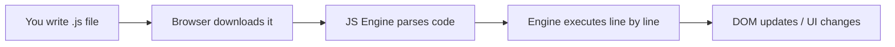
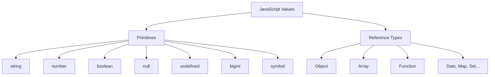
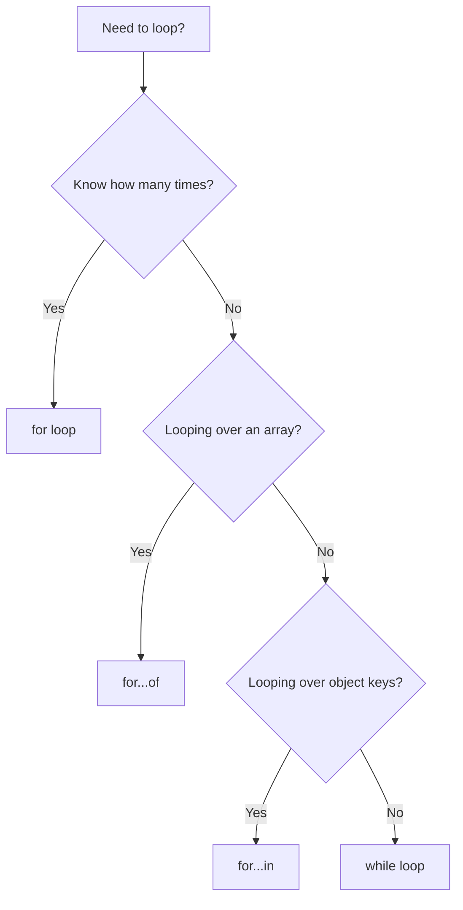

# Lecture 09 — JavaScript Basics: Syntax, Types & Control Flow

**Course:** Full-Stack Web Development  
**Instructor:** Kyrillos Medhat  
**Duration:** 3 hours (Theory + Lab)

---

## 📋 Prerequisites

> Before starting this lecture, make sure you can:
> - ✅ Create an HTML file with proper boilerplate — [Lecture 01](./01%20-%20Introduction%20to%20Web%20Development%20%26%20HTML5%20Basics.md)
> - ✅ Link external files (CSS, JS) from HTML — [Lecture 01](./01%20-%20Introduction%20to%20Web%20Development%20%26%20HTML5%20Basics.md)
> - ✅ Open browser DevTools (F12) and navigate to the Console tab — [Lecture 00](./00%20-%20Introduction%20to%20Computers%20%26%20Web%20Development.md)
> - ✅ Use VS Code and Live Server — [Lecture 00](./00%20-%20Introduction%20to%20Computers%20%26%20Web%20Development.md)

---

## 🎯 Learning Objectives

By the end of this lecture, you will be able to:
- Explain what JavaScript is and how the browser executes it
- Use the browser console and `console.log()` for debugging
- Declare variables with `let`, `const`, and understand why `var` is avoided
- Identify and work with all 7 primitive data types
- Use template literals, operators, and type coercion
- Write conditional logic with `if/else`, ternary, and `switch`
- Build loops with `for`, `while`, `for...of`, and `for...in`

---

## 📋 Agenda

| Time | Topic |
|------|-------|
| 0:00 – 0:15 | What is JavaScript? Adding JS to HTML |
| 0:15 – 0:40 | Variables: `let`, `const`, `var` |
| 0:40 – 1:05 | Primitive Data Types & `typeof` |
| 1:05 – 1:25 | Type Coercion, Truthy/Falsy & Operators |
| 1:25 – 1:30 | Break |
| 1:30 – 1:55 | Conditionals: `if/else`, ternary, `switch` |
| 1:55 – 2:15 | Loops: `for`, `while`, `for...of`, `for...in` |
| 2:15 – 2:30 | Think Like a Developer + Before vs After |
| 2:30 – 3:15 | Lab 1: Console Calculator |
| 3:15 – 4:00 | Lab 2: Number Guessing Game |

---

## 1. What is JavaScript?

JavaScript is the **programming language of the web**. HTML is the skeleton, CSS is the clothing, and JavaScript is the muscles and brain — it makes things move, react, and think.

JavaScript runs **in the browser** (frontend) and on **servers** via Node.js (backend). In this course, we use both.

### How JavaScript Executes



### Adding JavaScript to HTML

```html
<!-- Method 1: Inline (avoid in real projects) -->
<script>
  console.log("Hello, World!");
</script>

<!-- Method 2: External file (recommended) -->
<script src="app.js" defer></script>
```

> [!IMPORTANT]
> Always use the `defer` attribute when linking scripts in `<head>`. Without it, the script **blocks** HTML parsing. `defer` says: "Download in parallel, execute after HTML is fully parsed."

### The Console

The browser console (`F12` → Console tab) is your primary debugging tool:

```js
console.log("Regular message");       // General output
console.warn("Warning message");      // Yellow warning
console.error("Error message");       // Red error
console.table([1, 2, 3]);             // Display data as a table
```

---

## 2. Variables: `let`, `const`, and `var`

A variable is a **named container** for storing data — like a labeled box.

```js
const API_URL = "https://api.example.com"; // Cannot be reassigned
let score = 0;                              // Can be reassigned
score = 10;                                 // ✅ Works
API_URL = "x";                              // ❌ TypeError
```

> [!WARNING]
> **Never use `var`.** It's function-scoped (not block-scoped), which causes subtle bugs. Always use `const` by default, `let` only when you need reassignment.

| Keyword | Reassignable? | Scope | Use when... |
|---------|:------------:|-------|-------------|
| `const` | ❌ | Block | Default. Value won't change. |
| `let` | ✅ | Block | Value will change (counters, flags). |
| `var` | ✅ | Function | Never. Legacy only. |

---

## 3. Primitive Data Types

JavaScript has **7 primitive types**. Primitives are immutable.

```js
const name = "Kyrillos";       // 1. String
const age = 25;                // 2. Number (no separate int/float)
const isAdmin = true;          // 3. Boolean
let x;                         // 4. undefined (declared, not assigned)
const nothing = null;          // 5. null (intentionally empty)
const huge = 9007199254740991n; // 6. BigInt
const id = Symbol("id");       // 7. Symbol (unique identifier)
```

### The `typeof` Operator

```js
typeof "hello"     // "string"
typeof 42          // "number"
typeof true        // "boolean"
typeof undefined   // "undefined"
typeof null        // "object"  ← Famous JS bug! null is NOT an object.
typeof []          // "object"  ← Arrays are objects. Use Array.isArray([]).
```

### JavaScript Type System



---

## 4. Template Literals

Use backticks (`` ` ``) to embed expressions and write multi-line strings:

```js
const name = "Alex";
const age = 25;

// Template literal (modern)
const intro = `My name is ${name} and I am ${age} years old.`;

// Multi-line HTML
const html = `
  <div class="card">
    <h2>${name}</h2>
    <p>Age: ${age}</p>
  </div>
`;
```

---

## 5. Type Coercion & Truthy/Falsy

### Type Coercion

JavaScript silently converts types, causing surprises:

```js
"5" + 3    // "53"  (number → string, then concatenated)
"5" - 3    // 2     (string → number, then subtracted)
"5" == 5   // true  (== coerces types!)
"5" === 5  // false (=== checks type AND value)
```

> [!IMPORTANT]
> **Always use `===`** (strict equality). Never `==`.

### Truthy and Falsy

In a boolean context (`if`, `while`, `? :`), every value is either truthy or falsy.

**The 8 falsy values** (memorize these — everything else is truthy):

```js
false, 0, -0, 0n, "", null, undefined, NaN
```

Surprisingly truthy: `"0"`, `" "`, `[]`, `{}`

```js
if ("") console.log("truthy");    // Won't run — empty string is falsy
if ("0") console.log("truthy");   // WILL run — non-empty string is truthy!
```

---

## 6. Operators

### Arithmetic & Assignment

```js
10 + 3   // 13    10 % 3   // 1 (remainder)
10 - 3   // 7     10 ** 3  // 1000 (exponentiation)
10 * 3   // 30

let x = 10;
x += 5;  // 15    x++;  // 16    x--;  // 15
```

### Comparison & Logical

```js
5 === 5     // true     true && false  // false (AND)
5 !== "5"   // true     true || false  // true  (OR)
5 > 3       // true     !true          // false (NOT)
```

### Nullish Coalescing & Optional Chaining

```js
const display = username ?? "Guest";     // "Guest" if username is null/undefined
const city = user.address?.city;          // undefined (not an error!) if address is null
```

---

## 7. Conditionals

### `if / else if / else`

```js
const score = 85;

if (score >= 90) {
  console.log("A");
} else if (score >= 80) {
  console.log("B"); // ← Runs
} else {
  console.log("F");
}
```

### Ternary (inline if/else)

```js
const status = age >= 18 ? "Adult" : "Minor";
```

### `switch`

```js
switch (day) {
  case "Monday": case "Tuesday": case "Wednesday":
    console.log("Weekday"); break;
  case "Saturday": case "Sunday":
    console.log("Weekend"); break;
  default:
    console.log("Invalid");
}
```

---

## 8. Loops

```js
// for — when you know the count
for (let i = 0; i < 5; i++) {
  console.log(i); // 0, 1, 2, 3, 4
}

// while — when you don't know the count
let count = 0;
while (count < 3) {
  console.log(count++); // 0, 1, 2
}

// for...of — iterate VALUES (arrays, strings)
for (const color of ["red", "green", "blue"]) {
  console.log(color);
}

// for...in — iterate KEYS (objects)
const user = { name: "Alex", age: 25 };
for (const key in user) {
  console.log(`${key}: ${user[key]}`);
}
```

### `break` and `continue`

```js
for (let i = 0; i < 10; i++) {
  if (i === 5) break;       // Stop entirely
  if (i % 2 === 0) continue; // Skip even numbers
  console.log(i);            // 1, 3
}
```

### Which Loop to Use?



---

## 🧠 Think Like a Developer

### Scenario 1: User Input Validation
> Your form collects a user's age. They type `"25"` (a string from the input field). You need to check if they're 18 or older.

**Decision:** Convert the string to a number first with `Number(age)` or `parseInt(age)`, then compare with `>=`. Don't use `==` — explicitly convert. A `"25" >= 18` comparison works due to coercion, but explicit conversion is clearer and safer.

### Scenario 2: Default Values
> Your function receives a `username` parameter that might be `null`, `undefined`, or an empty string.

**Decision:** Use `??` (nullish coalescing) if you only want to fall back when `null`/`undefined`. Use `||` (logical OR) if you also want to catch empty strings and `0`. Know the difference — `"" ?? "Guest"` returns `""`, but `"" || "Guest"` returns `"Guest"`.

### Scenario 3: Choosing a Loop
> You have an array of 100 products and need to find the first one priced over $50, then stop.

**Decision:** Use a `for...of` loop with `break`, or better yet, use `array.find()` (covered in Lecture 10). Don't use `.forEach()` because you can't `break` out of it.

---

## ❌→✅ Before vs After

### Variable Declarations

```js
// ❌ Before: Using var everywhere
var name = "Alex";
var age = 25;
var isAdmin = true;

// ✅ After: const by default, let when needed
const name = "Alex";
const isAdmin = true;
let age = 25; // Only let because age might change
```

### String Building

```js
// ❌ Before: String concatenation
var msg = "Hello, " + name + "! You are " + age + " years old.";

// ✅ After: Template literals
const msg = `Hello, ${name}! You are ${age} years old.`;
```

### Equality Checks

```js
// ❌ Before: Loose equality (hidden type coercion)
if (userInput == 5) { ... }       // "5" == 5 is true — bug waiting to happen
if (value == null) { ... }        // Catches both null and undefined (intentional?)

// ✅ After: Strict equality (explicit and predictable)
if (Number(userInput) === 5) { ... }  // Explicit conversion
if (value === null || value === undefined) { ... } // Or use: value == null (the ONE exception)
```

---

## Common Mistakes & How to Avoid Them

| ❌ Mistake | ✅ Fix |
|-----------|--------|
| Using `var` | Always `const`, `let` when needed |
| Using `==` instead of `===` | Strict equality avoids coercion bugs |
| Forgetting `break` in `switch` | Execution falls through without it |
| `typeof null === "object"` | Known JS bug — check `value === null` explicitly |
| `const arr = []; arr.push(1)` working | `const` blocks reassignment, not mutation |
| Infinite loop from missing `i++` | Ensure exit condition is always reachable |
| `for...in` on arrays | Use `for...of` for arrays; `for...in` is for objects |
| `"" || "default"` vs `"" ?? "default"` | `\|\|` catches all falsy; `??` only catches null/undefined |

---

## 🧪 Practice Labs

### Lab 1 — Console Calculator (45 min)
1. Create `labs/lab1-calculator/app.js`
2. Declare `const num1 = 10`, `const num2 = 3`, `const operator = "+"`
3. Use a `switch` statement to perform the calculation and `console.log` the result
4. Handle division by zero: `if (num2 === 0)` print an error
5. Handle invalid operators in the `default` case
6. Test with all 4 operators

### Lab 2 — Number Guessing Game (45 min)
1. Create `labs/lab2-guess/app.js`
2. Generate: `const secret = Math.floor(Math.random() * 100) + 1;`
3. Use a `while` loop and `prompt()` to ask the user to guess
4. Compare with `===` after converting: `Number(guess)`
5. Print "Too high!", "Too low!", or "🎉 Correct!"
6. Track attempts and display the count when they win
7. Bonus: Limit to 10 attempts, print "Game Over" if exceeded

---

## 📝 Assignment: TaskFlow Project — Part 1

Begin building **TaskFlow**, a task management app developed across 6 JavaScript lectures.

### Requirements
1. Create `taskflow/app.js`
2. Create an array `tasks` with 3 starter objects: `{ id: 1, title: "Learn HTML", completed: false }`
3. Use `for...of` to print all task titles to the console
4. Write `addTask(title)` — pushes a new task with auto-incremented `id`
5. Write `completeTask(id)` — finds the task by `id`, sets `completed = true`
6. Call `addTask("Learn JavaScript")` and `completeTask(1)`, log the `tasks` array

---

## 💼 Interview Prep

**Q1: What's the difference between `let`, `const`, and `var`?**  
`const` is block-scoped and can't be reassigned. `let` is block-scoped and can be reassigned. `var` is function-scoped, gets hoisted, and should be avoided in modern code.

**Q2: What is type coercion in JavaScript?**  
JavaScript automatically converts values between types during operations. For example, `"5" + 3` produces `"53"` (number coerced to string) while `"5" - 3` produces `2` (string coerced to number).

**Q3: What's the difference between `==` and `===`?**  
`==` performs type coercion before comparing (so `"5" == 5` is `true`). `===` compares both type and value without coercion (`"5" === 5` is `false`). Always use `===`.

**Q4: Name all falsy values in JavaScript.**  
`false`, `0`, `-0`, `0n` (BigInt zero), `""` (empty string), `null`, `undefined`, `NaN`.

**Q5: What's the difference between `null` and `undefined`?**  
`undefined` means a variable was declared but never assigned a value. `null` is an intentional assignment meaning "no value." Both are falsy.

**Q6: What does the `??` operator do?**  
The nullish coalescing operator returns the right operand only if the left is `null` or `undefined`. Unlike `||`, it doesn't trigger on falsy values like `0` or `""`.

**Q7: What's the difference between `for...of` and `for...in`?**  
`for...of` iterates over **values** (use with arrays and strings). `for...in` iterates over **keys** (use with objects). Using `for...in` on arrays gives you index strings, not values.

---

## 📄 Cheat Sheet

### Variables
```
const x = 5;       // Cannot reassign
let y = 10;         // Can reassign
```

### Types
```
string    "hello"  'world'  `template ${var}`
number    42  3.14  NaN  Infinity
boolean   true  false
null      null (intentionally empty)
undefined (declared, not assigned)
```

### Operators
```
+  -  *  /  %  **          Arithmetic
=  +=  -=  *=  ++  --      Assignment
===  !==  >  <  >=  <=     Comparison (use ===)
&&  ||  !                  Logical
??                         Nullish coalescing
?.                         Optional chaining
```

### Conditionals
```js
if (x) { } else if (y) { } else { }
const r = cond ? "yes" : "no";       // Ternary
switch(v) { case "a": ...; break; }
```

### Loops
```js
for (let i = 0; i < n; i++) { }      // Count-based
while (condition) { }                 // Condition-based
for (const val of array) { }         // Array values
for (const key in object) { }        // Object keys
// break = stop loop    continue = skip iteration
```

### Console
```js
console.log()  .warn()  .error()  .table()  .clear()
```

### Falsy Values
```
false  0  -0  0n  ""  null  undefined  NaN
```

---

## 🔗 Resources

| Resource | Link |
|----------|------|
| MDN: JavaScript Guide | https://developer.mozilla.org/en-US/docs/Web/JavaScript/Guide |
| JavaScript.info | https://javascript.info/ |
| Eloquent JavaScript (Free Book) | https://eloquentjavascript.net/ |

---

## 📌 Key Takeaways
- **JavaScript** is the only programming language browsers run natively — it powers all web interactivity
- Use **`const`** by default, **`let`** when you need reassignment, **never** `var`
- JavaScript has **7 primitives**: string, number, boolean, null, undefined, bigint, symbol
- **Always use `===`** (strict equality) — `==` silently coerces types and causes bugs
- **Template literals** (backticks) are the modern way to build strings with embedded expressions
- **`for...of`** iterates values (arrays); **`for...in`** iterates keys (objects) — don't mix them up
- Every value is either **truthy or falsy** — memorize the 8 falsy values
- **`??`** catches only null/undefined; **`||`** catches all falsy values — choose deliberately

---

**Next Lecture:** [Lecture 10 — Functions, Arrays & Objects](./10%20-%20Functions,%20Arrays%20%26%20Objects.md)
