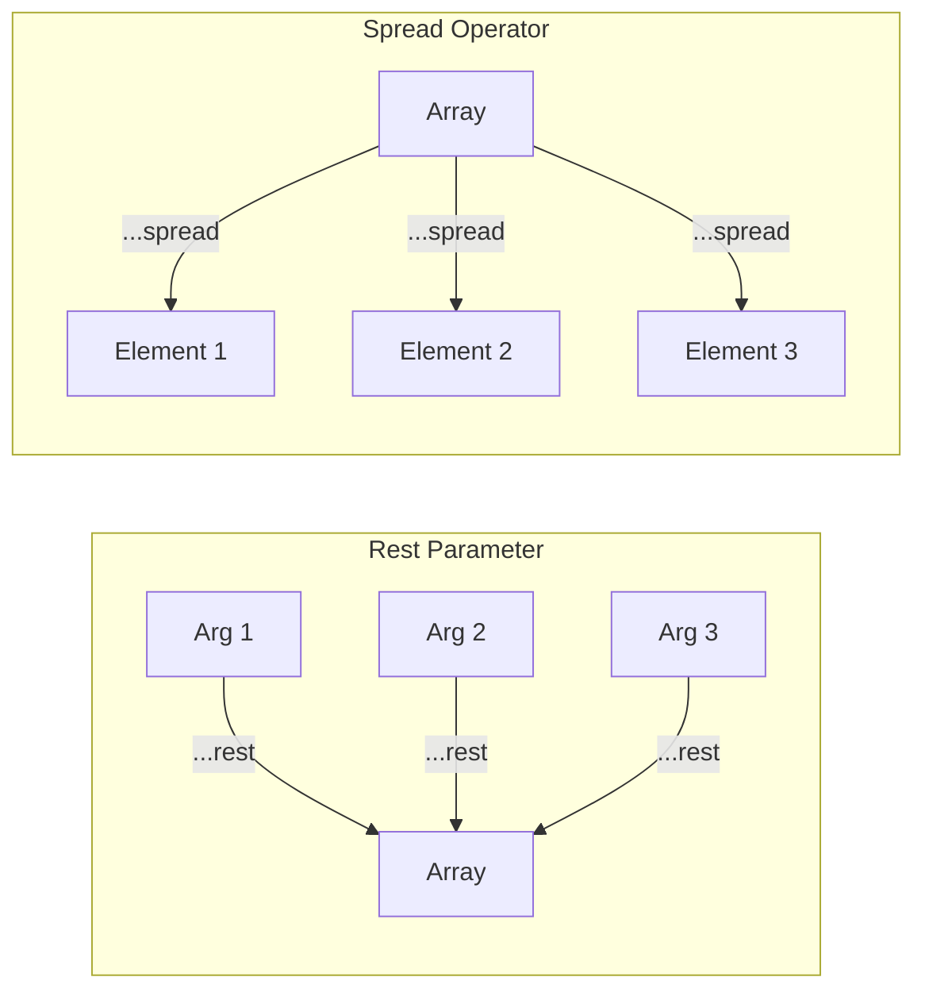
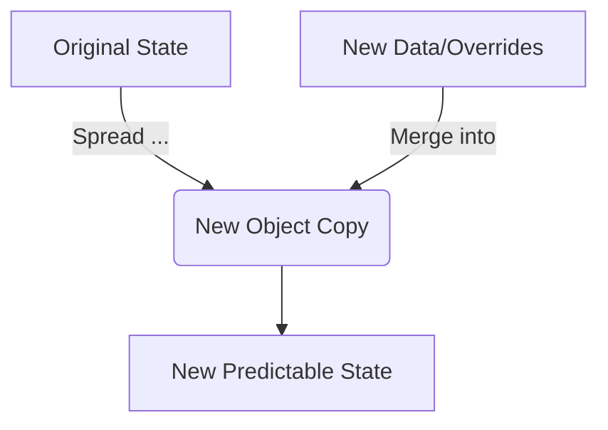

# Lecture 10 — Functions, Arrays & Objects

**Course:** Full-Stack Web Development  
**Instructor:** Kyrillos Medhat  
**Duration:** 3 hours (Theory + Lab)

---

## 🛠 Prerequisites: What to Know Before Starting

Before diving into this comprehensive guide on Functions, Arrays, and Objects, ensure you have a firm grasp on the following concepts:
1. **Basic JavaScript Syntax & Execution Context:** You should understand how the JavaScript engine reads files top-to-bottom, how the event loop works at a high level, and how scripts are loaded into the browser.
2. **Variables and Data Types:** Familiarity with `let` vs `const`, and the difference between primitives (strings, numbers, booleans) and references (objects, arrays). Understanding that primitives are passed by value while objects are passed by reference is absolutely critical for this lecture.
3. **Control Flow:** Mastery over `if/else` statements, `switch` cases, and basic loops (`for`, `while`).
4. **Environment Setup:** A working installation of Node.js (for running scripts locally) or familiarity with the browser Developer Tools Console.

---

## 🎯 Objectives & Agenda

**Learning Objectives:**
By the conclusion of this deep-dive module, you will be empowered to:
- **Architect Functions:** Write and optimize functions using declarations, expressions, and the modern arrow syntax, understanding the exact memory and scoping implications of each.
- **Master Data Flow:** Manage function inputs like a pro with default parameters, rest parameters, and the spread operator to build flexible, error-resistant APIs.
- **Implement Functional Programming Patterns:** Leverage higher-order functions and callbacks to write generic, highly reusable code that abstracts away repetitive logic.
- **Safely Manipulate Data Structures:** Manipulate arrays safely using modern ES2023 non-mutating methods (`toSpliced`, `toSorted`, `toReversed`, `with`) to prevent catastrophic state mutation bugs.
- **Process Data Pipelines:** Chain array iteration methods like `map()`, `filter()`, and `reduce()` to transform raw data into UI-ready structures without using traditional imperative loops.
- **Model Real-World Entities:** Design objects, utilize ES6 shorthand syntax, and seamlessly extract data via deep destructuring.
- **Enforce State Predictability:** Apply immutable update patterns—a critical, non-negotiable skill for modern front-end frameworks like React, Vue, and Angular.

**Agenda:**
1. **Deep Dive into Functions:** Declarations, Expressions, Arrow Syntax, Hoisting, and Scope.
2. **Parameters & Arguments:** Defaults, the Rest parameter (`...`), and the Spread operator (`...`).
3. **Higher-Order Functions:** Callbacks, function factories, and the foundation of functional JS.
4. **Arrays & Modern ES2023 Methods:** Safely navigating and modifying lists without mutation.
5. **Array Iteration Methods:** The heavy lifters of data transformation (`map`, `filter`, `reduce`, `find`, `some`, `every`).
6. **Objects & Advanced Destructuring:** Building entities and extracting data elegantly.
7. **Immutable Update Patterns:** The react-way of handling state.
8. **Interview Prep:** Real-world interview questions and answers.
9. **Labs & Assignments:** Practical, hands-on challenges to cement your knowledge.
10. **Cheat Sheet & Key Takeaways:** Quick reference for your daily development.

---

## 1. Functions: The Core Building Blocks of JavaScript

Functions are the fundamental units of execution in JavaScript. They are reusable, modular blocks of code designed to perform specific tasks. In modern JavaScript, understanding the nuances of how functions are declared, how they behave with the `this` keyword, and how they interact with the engine's compilation phase is what separates a junior developer from a mid-level engineer.

### The DRY Principle (Don't Repeat Yourself)

Imagine you are building an e-commerce platform. You need to calculate the final price of an item including tax. If you write the math formula explicitly every time a user adds an item to the cart, proceeds to checkout, or views their receipt, you are creating technical debt. When the tax rate changes from 15% to 18%, you will have to hunt down every instance of that calculation. 

A function centralizes this logic. You fix it in one place, and the entire application instantly reflects the correct behavior.

### 🔄 Before vs After: Function Evolution

Let's look at how function syntax has evolved and why modern code looks the way it does.

**Legacy/Verbose (The "Before" Code):**
```javascript
// Repeated, fragile logic
var price1 = 100;
var total1 = price1 + (price1 * 0.15);
console.log("Total: " + total1);

var price2 = 250;
var total2 = price2 + (price2 * 0.15);
console.log("Total: " + total2);

// Verbose function expression with 'var'
var calculateTotal = function(price) {
  var tax = 0.15;
  return price + (price * tax);
};
```

**Modern/Concise (The "After" Code):**
```javascript
// Clean, reusable arrow function with implicit return and template literals
const TAX_RATE = 0.15;
const calcTotal = (price) => price + (price * TAX_RATE);

const prices = [100, 250, 899];
prices.forEach(price => console.log(`Total: $${calcTotal(price)}`));
```

### The Three Function Syntaxes: A Deep Dive

JavaScript provides three primary ways to define a function. Knowing when to use which is critical for writing clean, bug-free code.

#### 1. Function Declaration (Hoisted)
A function declaration is the classic syntax. Its defining feature is **hoisting**. During the compilation phase (before the code is executed), the JavaScript engine moves function declarations to the top of their enclosing scope in memory. This means you can call the function on line 1, even if it is defined on line 100.

```javascript
// This works perfectly because generateReport is hoisted!
const report = generateReport("Q3 Financials"); 
console.log(report); // "Report generated for: Q3 Financials"

function generateReport(title) {
  // Complex logic here...
  return `Report generated for: ${title}`;
}
```
*Use case:* Top-level utility functions in a file, making the file highly readable because you can put execution logic at the top and implementation details at the bottom.

#### 2. Function Expression (Not Hoisted)
A function expression involves creating an anonymous function and assigning it to a variable (`const` or `let`). Because variables declared with `const` and `let` are not fully hoisted (they reside in the Temporal Dead Zone), you **cannot** call a function expression before it is initialized.

```javascript
// ❌ This will throw a ReferenceError: Cannot access 'processPayment' before initialization
// processPayment(100); 

const processPayment = function(amount) {
  return `Processing $${amount}...`;
};

// ✅ This works
processPayment(100); 
```
*Use case:* When you want strict top-to-bottom execution flow and want to explicitly prevent a function from being used before it's clearly defined in the source code.

#### 3. Arrow Functions (Concise & Lexical `this`)
Introduced in ES6 (2015), arrow functions revolutionized JavaScript syntax. They offer extreme conciseness:
- If there is only one parameter, parentheses can be omitted.
- If the body is a single expression, curly braces `{}` and the `return` keyword can be omitted (Implicit Return).

More importantly, arrow functions do **not** have their own `this` binding. They inherit `this` from the surrounding lexical scope. We will explore `this` deeply in Lecture 12, but know that arrow functions are the safest choice for callbacks.

```javascript
// Full syntax
const multiply = (a, b) => {
  return a * b;
};

// Ultra-concise implicit return syntax
const square = x => x * x; 
```

### 🧠 Think Like a Developer: Choosing the Right Syntax

**Scenario:** You are building a React component and need to pass a click handler to a button. The click handler needs access to the component's internal state.
**The Novice Approach:** Uses a traditional function expression and struggles with the fact that `this.setState` is undefined because `this` inside the standard function points to the button, not the component. They resort to hacking it with `.bind(this)`.
**The Expert Decision:** Uses an **arrow function** for the click handler. The expert knows that arrow functions do not create their own `this` context; they inherit it transparently from the component class/scope. 

**Scenario:** You are writing a utility file `math-helpers.js` containing 20 different math formulas.
**The Expert Decision:** Uses **function declarations**. By doing this, the functions are hoisted. A developer opening the file can see `export { add, subtract, multiply }` at the very top, instantly understanding what the module provides, while the implementation details are safely tucked at the bottom.

---

## 2. Parameters: Defaults, Rest, and Spread

Robust functions handle varying inputs gracefully. ES6 gave us powerful syntax to manage function arguments, allowing us to ditch legacy hacks involving `arguments.length` and manual `undefined` checks.

### Default Parameters: Safe Fallbacks

When a caller omits an argument, its value inside the function is `undefined`. Default parameters allow you to specify a fallback value right in the function signature. 

> [!WARNING]
> Default parameters *only* trigger when the passed value is strictly `undefined` (or entirely omitted). Passing `null`, `false`, `0`, or `""` will **not** trigger the default fallback.

```javascript
// Robust function with defaults
const initializeUser = (username, role = "Subscriber", theme = "Light") => {
  return {
    user: username,
    permissions: role,
    uiTheme: theme
  };
};

console.log(initializeUser("Alice")); 
// { user: "Alice", permissions: "Subscriber", uiTheme: "Light" }

console.log(initializeUser("Bob", "Admin")); 
// { user: "Bob", permissions: "Admin", uiTheme: "Light" }

// Edge case: passing undefined manually triggers the default!
console.log(initializeUser("Carol", undefined, "Dark"));
// { user: "Carol", permissions: "Subscriber", uiTheme: "Dark" }

// Edge case: passing null does NOT trigger the default!
console.log(initializeUser("Dave", null, "Dark"));
// { user: "Dave", permissions: null, uiTheme: "Dark" }
```

### Rest Parameter (`...args`): Infinite Inputs

Sometimes you don't know how many arguments a function will receive. The **rest parameter** acts as a net, catching all remaining arguments and bundling them into a standard JavaScript array. 

It completely replaces the legacy `arguments` object, which was an array-like object (but lacked actual array methods like `.map()` or `.reduce()`).

```javascript
// The rest parameter (...tags) MUST be the last parameter in the list.
function createBlogPost(title, author, ...tags) {
  console.log(`Title: ${title}`);
  console.log(`Author: ${author}`);
  // tags is a true Array containing everything else
  console.log(`Tags: ${tags.map(t => `#${t}`).join(' ')}`);
}

createBlogPost("JS Tips", "Kyrillos", "javascript", "coding", "webdev");
// Title: JS Tips
// Author: Kyrillos
// Tags: #javascript #coding #webdev
```

### Spread Operator (`...`): Unpacking Data

The spread operator uses the exact same `...` syntax as the rest parameter, but it does the exact **opposite**. While Rest gathers multiple elements into an array, Spread takes an array (or any iterable) and expands it out into individual elements.



**Common Use Cases for Spread:**

1. **Passing array elements as function arguments:**
```javascript
const temperatures = [72, 85, 99, 64];
// Math.max expects individual arguments: Math.max(72, 85, 99, 64)
// It returns NaN if you pass an array. Spread fixes this!
const hottest = Math.max(...temperatures); 
console.log(hottest); // 99
```

2. **Combining Arrays:**
```javascript
const frontend = ["React", "Vue", "Angular"];
const backend = ["Node", "Python", "Go"];

// The old way (mutates or uses verbose .concat):
// const fullstack = frontend.concat(backend);

// The modern, readable way:
const fullstack = [...frontend, "SQL", ...backend];
console.log(fullstack); // ["React", "Vue", "Angular", "SQL", "Node", "Python", "Go"]
```

3. **Shallow Copying Arrays:**
```javascript
const original = ["A", "B", "C"];
const copy = [...original]; // Creates a brand new array in memory
copy.push("D");

console.log(original); // ["A", "B", "C"] (Untouched)
console.log(copy);     // ["A", "B", "C", "D"]
```

---

## 3. Higher-Order Functions & Callbacks

Understanding higher-order functions is the gateway to mastering modern JavaScript and functional programming. 

A **higher-order function** is any function that does at least one of the following:
1. Takes one or more functions as arguments (known as **callbacks**).
2. Returns a function as its result.

### The Callback Pattern
Callbacks allow you to write generic, boilerplate code and inject specific behavior at runtime. 

Imagine a function that processes payments. The core logic of establishing a secure connection and logging the transaction is always the same, but the specific payment gateway (Stripe, PayPal, Crypto) changes.

```javascript
// Higher-Order Function
function executeTransaction(amount, paymentGatewayCallback) {
  console.log("Establishing secure connection...");
  console.log("Verifying credentials...");
  
  // Execute the injected behavior
  const success = paymentGatewayCallback(amount);
  
  if (success) {
    console.log(`Transaction of $${amount} recorded in ledger.`);
  } else {
    console.log("Transaction failed. Reverting...");
  }
}

// Callbacks (Specific behaviors)
const processStripe = (amt) => {
  console.log(`Charging $${amt} via Stripe API.`);
  return true; // Simulate success
};

const processCrypto = (amt) => {
  console.log(`Sending $${amt} worth of BTC to wallet address.`);
  return false; // Simulate failure
};

// Usage
executeTransaction(50, processStripe);
// Output:
// Establishing secure connection...
// Verifying credentials...
// Charging $50 via Stripe API.
// Transaction of $50 recorded in ledger.

executeTransaction(1000, processCrypto);
```

### Returning Functions (Function Factories & Closures)
Higher-order functions can also manufacture and return customized functions. This is incredibly powerful for configuring behaviors dynamically.

```javascript
function createValidator(minLength) {
  // Returns a new customized function
  // It "remembers" the minLength variable due to Closures (Lecture 12)
  return function(inputString) {
    return inputString.length >= minLength;
  };
}

const isPasswordValid = createValidator(8);
const isUsernameValid = createValidator(3);

console.log(isPasswordValid("admin")); // false (length 5 < 8)
console.log(isPasswordValid("supersecret123")); // true
console.log(isUsernameValid("yo")); // false
```

---

## 4. Arrays & Modern ES2023 Methods

An array is an ordered, zero-indexed collection of data. While JavaScript arrays have always been versatile, they suffered from a massive design flaw for years: many of their core methods **mutated** (permanently altered) the original array.

In modern application development, state mutation is the enemy. It leads to side effects where changing an array in one part of the app inexplicably breaks the UI in another part.

### The ES2023 Immutable Revolution
To solve this, ES2023 introduced non-mutating versions of common array operations. These methods perform the action and return a **brand new array**, leaving the original array completely untouched.

| Legacy Method (Danger: Mutates) | ES2023 Method (Safe: Returns Copy) | Description |
|---------------------------------|------------------------------------|-------------|
| `splice(start, count, ...items)` | `toSpliced(start, count, ...items)` | Adds/removes items at a specific index. |
| `sort(compareFn)`               | `toSorted(compareFn)`              | Sorts the array. |
| `reverse()`                     | `toReversed()`                     | Reverses the array elements. |
| `array[index] = value`          | `array.with(index, value)`         | Replaces an item at a specific index. |

**Deep Dive Example: Sorting and Replacing safely**

```javascript
const highScores = [45, 99, 12, 78];

// ❌ The Old Way (Bugs waiting to happen)
// const sortedScores = highScores.sort((a, b) => b - a);
// console.log(highScores); // [99, 78, 45, 12] - The original is DESTROYED!

// ✅ The Modern ES2023 Way
const sortedScores = highScores.toSorted((a, b) => b - a);

console.log("Sorted:", sortedScores); // [99, 78, 45, 12]
console.log("Original:", highScores); // [45, 99, 12, 78] - Safely preserved!

// Replacing an item at index 2 (the value 12) with 150 safely:
const updatedScores = highScores.with(2, 150);
console.log("Updated:", updatedScores); // [45, 99, 150, 78]
console.log("Original:", highScores);   // [45, 99, 12, 78] - Still intact!
```

> [!IMPORTANT]
> The `compareFn` in sorting is crucial for numbers. By default, JavaScript converts everything to strings and sorts alphabetically. `[10, 2, 100]` sorts to `[10, 100, 2]` alphabetically. Passing `(a, b) => a - b` forces mathematical ascending sort.

### Navigating Arrays

**Finding Data:**
- `indexOf(value)`: Returns the index of a primitive value, or `-1` if missing.
- `includes(value)`: Returns `true`/`false`. Extremely useful in `if` statements.

```javascript
const allowedRoles = ["admin", "editor", "moderator"];

// Clean permissions check
if (allowedRoles.includes(user.role)) {
  grantAccess();
}
```

**Slicing Data (Non-mutating):**
`slice(startIndex, endIndex)` returns a shallow copy of a portion of an array. The `endIndex` is exclusive.

```javascript
const rainbow = ["Red", "Orange", "Yellow", "Green", "Blue", "Indigo", "Violet"];
const warmColors = rainbow.slice(0, 3); // Gets indices 0, 1, 2
console.log(warmColors); // ["Red", "Orange", "Yellow"]
```
## 5. Array Iteration Methods (The Data Pipeline)

Array iteration methods are higher-order functions built directly into the JavaScript Array prototype. They loop over the array for you, applying a callback function to each element. 

Mastering these methods is arguably the most important skill in modern JavaScript UI development. When you see a list of products on an e-commerce site, or a feed of posts on social media, those UI elements were almost certainly generated using these methods.

### The Core Trinity: `map`, `filter`, and `reduce`

#### 1. `map()`: Transform Data
- **Purpose:** Takes an array, applies a transformation to *every* item, and returns a **new array of the exact same length**.
- **Analogy:** A factory assembly line that takes raw steel blocks (input array) and paints them red (output array).

```javascript
const cartPrices = [10, 20, 50, 100];
const taxRate = 1.08;

// Transform raw prices into formatted price strings with tax
const displayPrices = cartPrices.map(price => {
  const withTax = price * taxRate;
  return `$${withTax.toFixed(2)}`;
});

console.log(displayPrices); // ["$10.80", "$21.60", "$54.00", "$108.00"]
console.log(cartPrices);    // [10, 20, 50, 100] (Original unchanged)
```

**Common use case in React:** Mapping over an array of object data to return an array of UI components (like `<li>` tags).

#### 2. `filter()`: Extract Data
- **Purpose:** Returns a **new array** containing *only* the elements that pass a logical test (where the callback returns `true`). The resulting array will be the same length or shorter.
- **Analogy:** A sieve that lets fine sand through but catches large rocks.

```javascript
const users = [
  { id: 1, name: "Alice", active: true },
  { id: 2, name: "Bob", active: false },
  { id: 3, name: "Carol", active: true }
];

// Extract only active users using implicit return
const activeUsers = users.filter(user => user.active === true);

console.log(activeUsers); 
// [{ id: 1, name: "Alice", active: true }, { id: 3, name: "Carol", active: true }]
```

#### 3. `reduce()`: Accumulate Data
- **Purpose:** Processes every item to calculate a **single output value**. That output can be a number (like a sum), a string, a new object, or even a new array.
- **Analogy:** A snowball rolling down a hill, accumulating more snow (data) with every rotation.

The callback for `reduce` takes two main arguments: the **accumulator** (the running total/state) and the **current value** (the item currently being iterated). You *must* also provide an initial value for the accumulator as the second argument to `reduce()`.

```javascript
const expenses = [
  { category: "Food", amount: 45 },
  { category: "Transport", amount: 20 },
  { category: "Food", amount: 15 },
  { category: "Entertainment", amount: 100 }
];

// 1. Accumulating into a number (Total cost)
const totalSpent = expenses.reduce((acc, currentExpense) => {
  return acc + currentExpense.amount;
}, 0); // 0 is the starting point for 'acc'
console.log(totalSpent); // 180

// 2. Accumulating into an object (Grouping by category)
const groupedExpenses = expenses.reduce((acc, curr) => {
  // If the category doesn't exist in our object yet, create it
  if (!acc[curr.category]) {
    acc[curr.category] = 0;
  }
  // Add the amount to the correct category
  acc[curr.category] += curr.amount;
  
  return acc; // CRITICAL: Always return the accumulator!
}, {}); // {} is the starting point for 'acc'

console.log(groupedExpenses); 
// { Food: 60, Transport: 20, Entertainment: 100 }
```

### Searching and Validating

- **`find()`:** Returns the **first element** that matches the condition. Returns `undefined` if nothing matches. Stop iterating once found.
- **`findIndex()`:** Returns the **index** of the first matching element. Returns `-1` if nothing matches.
- **`some()`:** Returns `true` if **at least one** element passes the test.
- **`every()`:** Returns `true` only if **all** elements pass the test.

```javascript
const inventory = [
  { name: "Laptop", qty: 0 },
  { name: "Mouse", qty: 5 },
  { name: "Keyboard", qty: 2 }
];

// Find a specific item
const mouse = inventory.find(item => item.name === "Mouse");
console.log(mouse); // { name: "Mouse", qty: 5 }

// Validate stock levels
const isAnythingOutOfStock = inventory.some(item => item.qty === 0);
console.log(isAnythingOutOfStock); // true (Laptop is 0)

const isEverythingInStock = inventory.every(item => item.qty > 0);
console.log(isEverythingInStock); // false
```

### Method Chaining (Data Pipelines)
Because methods like `map` and `filter` return new arrays, you can chain them together to create elegant, readable data processing pipelines. Read them top-to-bottom.

```javascript
const rawData = [
  { user: "dev_alice", role: "admin", posts: 42 },
  { user: "noob_bob", role: "subscriber", posts: 1 },
  { user: "pro_carol", role: "admin", posts: 150 }
];

// Pipeline: Get the usernames of highly active admins
const powerUsers = rawData
  .filter(u => u.role === "admin")         // Step 1: Only admins
  .filter(u => u.posts > 20)               // Step 2: High activity
  .map(u => u.user.toUpperCase());         // Step 3: Extract and format username

console.log(powerUsers); // ["DEV_ALICE", "PRO_CAROL"]
```

---

## 6. Objects & Destructuring

While arrays are ordered lists, **Objects** are unordered collections of key-value pairs. They are perfect for modeling complex real-world entities (like a User, a Product, or a configuration setting).

### Object Creation and Access

Keys are always strings (or Symbols, rarely used). Values can be anything: primitives, arrays, other objects, or functions (methods).

```javascript
const serverConfig = {
  host: "api.myapp.com",
  port: 443,
  secure: true,
  // Method shorthand (ES6)
  connect() {
    console.log(`Connecting to ${this.host}:${this.port}...`);
  }
};

// Dot Notation (Standard, preferred when key is known)
console.log(serverConfig.host); // "api.myapp.com"

// Bracket Notation (Dynamic, used when key is stored in a variable)
const metricToCheck = "port";
console.log(serverConfig[metricToCheck]); // 443
console.log(serverConfig["host"]); // "api.myapp.com"
```

### ES6 Object Enhancements

**Shorthand Property Names:** If you have a variable with the exact same name as the object key you want to create, you can omit the value.

```javascript
const username = "john_doe";
const age = 30;

// Old way
// const user = { username: username, age: age };

// Modern ES6 way
const user = { username, age };
console.log(user); // { username: "john_doe", age: 30 }
```

**Computed Property Names:** Evaluate a variable inside square brackets `[]` to dynamically generate a key name during object creation.

```javascript
const dynamicPrefix = "user_";
const status = {
  [dynamicPrefix + "id"]: 101,
  [dynamicPrefix + "role"]: "admin"
};
console.log(status); // { user_id: 101, user_role: "admin" }
```

### Destructuring: Unpacking Data Elegantly

Destructuring allows you to rapidly extract values from objects and arrays into distinct variables in a single line of code.

**Object Destructuring:**
The variable names must match the object keys (unless you use aliases).

```javascript
const employee = {
  empName: "Sarah",
  department: "Engineering",
  contact: { email: "sarah@company.com", slack: "@sarah_eng" }
};

// 1. Basic Destructuring
const { empName, department } = employee;
console.log(empName); // "Sarah"

// 2. Aliasing (Renaming variables during extraction)
// "Extract empName, but call the local variable 'fullName'"
const { empName: fullName } = employee;
console.log(fullName); // "Sarah"

// 3. Deep Destructuring (Nested objects)
const { contact: { email } } = employee;
console.log(email); // "sarah@company.com"

// 4. Default Values (If property doesn't exist)
const { salary = 50000, office = "Remote" } = employee;
console.log(salary, office); // 50000, "Remote"
```

**Array Destructuring:**
Unlike object destructuring which matches by key, array destructuring matches purely by **position/index**.

```javascript
const rgb = [255, 128, 0];

// Extract by position
const [red, green, blue] = rgb;
console.log(red, green, blue); // 255 128 0

// Skip elements using commas
const [, , justBlue] = rgb;
console.log(justBlue); // 0

// Use rest operator to gather the remainder
const [primary, ...others] = rgb;
console.log(primary); // 255
console.log(others);  // [128, 0]
```

### 🧠 Think Like a Developer: Destructuring in Parameters
**Scenario:** A function takes a massive configuration object. You only need `theme` and `language`.
**Expert Decision:** Destructure directly in the parameter list. It acts as instant documentation for exactly what the function requires.
```javascript
// Instead of: function initApp(config) { console.log(config.theme); }
function initApp({ theme = "light", language }) {
  console.log(`Setting UI to ${theme} for locale ${language}`);
}

initApp({ language: "en-US", version: "1.0" }); 
// "Setting UI to light for locale en-US"
```

---

## 7. Immutable Updates: The React Way

In modern application architecture, **state** is the single source of truth. If state mutates unpredictably, the UI will behave unpredictably. 
Immutability means you **never** modify an existing object or array. Instead, you create a complete copy, integrate your changes into the copy, and replace the old state with the new state.

The **Spread Operator (`...`)** is the primary tool for immutable updates.



### Updating Objects Immutably

When you spread an object into a new object literal, any properties declared *after* the spread will overwrite the copied properties.

```javascript
const userState = { id: 1, name: "Kyrillos", loggedIn: false };

// ❌ BAD: Mutation
// userState.loggedIn = true; 

// ✅ GOOD: Immutable Update
const updatedUserState = {
  ...userState,      // 1. Copy everything (id, name, loggedIn)
  loggedIn: true,    // 2. Overwrite 'loggedIn' specifically
  lastSeen: "Today"  // 3. Add new properties
};

console.log(userState.loggedIn); // false (Original intact)
console.log(updatedUserState.loggedIn); // true
```

### Deep Immutable Updates (The Danger Zone)
The spread operator only creates a **shallow copy**. If your object contains nested objects or arrays, those nested references are shared. To update a deeply nested property immutably, you must spread at *every single level*.

```javascript
const complexState = {
  theme: "dark",
  user: {
    details: { name: "Alice", age: 30 },
    preferences: { notifications: true }
  }
};

// Goal: Change the user's name to "Alicia" without touching anything else.
const nextState = {
  ...complexState,                      // Spread root level
  user: {
    ...complexState.user,               // Spread user level
    details: {
      ...complexState.user.details,     // Spread details level
      name: "Alicia"                    // Finally apply the change
    }
  }
};
```

---

## ⚠️ Common Mistakes & How to Avoid Them

| The Mistake | Why it Happens | The Fix |
|-------------|----------------|---------|
| **Forgetting `return` in arrow functions** | Using curly braces `{}` but expecting implicit return. | If you use `{}`, you *must* use `return`. `const add = (a,b) => { return a+b; }` |
| **`return` inside `forEach`** | Trying to break out of a loop or return a modified array. | `forEach` always returns `undefined` and ignores internal returns. Use `map()`, `filter()`, or a standard `for` loop. |
| **Forgetting the accumulator return in `reduce`** | The next iteration gets `undefined` as the accumulator, causing `NaN` or crashes. | Ensure `return acc;` is always executed at the end of the `reduce` callback. |
| **Destructuring `null` or `undefined`** | API responses fail, resulting in `const { data } = null`, throwing a TypeError. | Use optional chaining or default fallbacks: `const { data } = response ?? {};` |
| **Deep Object Mutation** | Spreading only the top level of a nested object and mutating inner arrays/objects. | Spread at *every* level of nesting, or use libraries like `immer` for deeply nested state. |

---

## 🎤 Interview Prep

**Q1: What is the difference between a Function Declaration and a Function Expression?**
*Answer:* Function declarations are hoisted to the top of their scope during compilation, allowing them to be called before they are defined in the code. Function expressions are assigned to variables and are subject to the Temporal Dead Zone (if using `let`/`const`), meaning they cannot be invoked before initialization.

**Q2: What is a Higher-Order Function? Can you give an example?**
*Answer:* A higher-order function is a function that either accepts another function as an argument (a callback) or returns a function. Examples include array methods like `map()`, `filter()`, and `reduce()`, or a function factory that generates customized configuration functions.

**Q3: How does the Spread Operator differ from the Rest Parameter?**
*Answer:* They share the same syntax (`...`), but Rest is used in function parameters (or destructuring assignments) to collect multiple individual elements into a single array. Spread is used in function calls or array/object literals to expand an iterable into individual, separate elements.

**Q4: Explain how you would safely update a deeply nested property in a React state object.**
*Answer:* Because state in React must be immutable, I cannot directly mutate the nested property. I must use the spread operator to create shallow copies at every level of the object hierarchy down to the property I want to change, ensuring the original references remain completely untouched. Alternatively, I might use a utility library like `immer` to simplify the boilerplate.

---

## 🧪 Labs & Assignments

### Lab 1: Data Transformation Mastery
**Scenario:** You are building an admin dashboard for an e-commerce system. You are provided an array of order objects.
**Task:** 
1. Use `filter()` to extract only the "Delivered" orders.
2. Use `map()` to extract the `totalAmount` of those orders.
3. Use `reduce()` to calculate the grand total revenue of all delivered orders.
*Bonus:* Chain all three methods together into a single data pipeline.

### Lab 2: Immutable Inventory Manager
**Scenario:** A React application passes down a `products` array as props.
**Task:** Write three pure functions:
1. `addProduct(products, newProduct)`: Returns a new array with the product appended.
2. `removeProduct(products, productId)`: Returns a new array without the specified product.
3. `updatePrice(products, productId, newPrice)`: Returns a new array where the specific product has an updated price, utilizing object spreading.

---

## 📜 Cheat Sheet: Quick Syntax Reference

```javascript
// Arrows & Implicit Return
const add = (a, b) => a + b;
const getObj = (id) => ({ id: id }); // Wrap objects in () for implicit return

// Array Iteration Quick Ref
arr.map(x => transform(x))      // Transform all
arr.filter(x => condition(x))   // Keep if true
arr.reduce((acc, x) => acc+x, 0)// Combine to one value
arr.find(x => condition(x))     // Get first match or undefined
arr.some(x => condition(x))     // Boolean: At least one matches?
arr.every(x => condition(x))    // Boolean: ALL match?

// Immutable Methods
arr.toSorted()                  // Safe Sort
arr.toSpliced(idx, 1)           // Safe Remove
arr.with(idx, newValue)         // Safe Replace

// Destructuring & Spread
const { name: fullName, age = 18 } = userObj;
const [first, ...rest] = arrayData;
const clonedArray = [...originalArray];
const mergedObject = { ...obj1, ...obj2 };
```

---

## 📚 Key Takeaways & Resources

**Key Takeaways:**
- Embrace the declarative nature of modern JavaScript. Tell the code *what* to do (via `map`, `filter`) rather than *how* to do it (via `for` loops).
- Functions are first-class citizens. Passing them around as callbacks unlocks immense architectural flexibility.
- Guard your state. Assume all data structures are immutable unless you have a specific, isolated reason to mutate them. 

**Recommended Resources:**
- [MDN Web Docs: Array Methods](https://developer.mozilla.org/en-US/docs/Web/JavaScript/Reference/Global_Objects/Array)
- [MDN Web Docs: Destructuring Assignment](https://developer.mozilla.org/en-US/docs/Web/JavaScript/Reference/Operators/Destructuring_assignment)
- *JavaScript: The Good Parts* by Douglas Crockford (For historical context on JS quirks).
- React Documentation on Updating Objects in State (Highly relevant for immutable pattern practice).

**Next Lecture:** [Lecture 11 — DOM Manipulation & Events](./11%20-%20DOM%20Manipulation%20%26%20Events.md)
