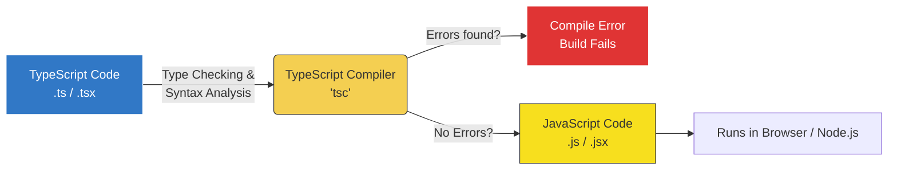

# Lecture 19 — TypeScript Fundamentals: Types, Interfaces & Compilation

**Course:** Full-Stack Web Development  
**Instructor:** Kyrillos Medhat  
**Duration:** 3 hours (Theory + Lab)

---

## 🛠️ Prerequisites

Before embarking on this TypeScript journey, you must have a solid foundation in the following areas:
- **JavaScript ES6+:** Deep understanding of variables (`let`, `const`), arrow functions, destructuring, spread/rest operators, and promises.
- **Node.js & NPM:** Familiarity with initializing a project (`npm init`), installing packages locally and globally, and running scripts from `package.json`.
- **Runtime vs. Parsing:** Understanding the difference between when code is parsed (read by the engine) and when it is executed (run by the engine). TypeScript fundamentally changes this paradigm.
- **Object-Oriented Programming (Basic):** Familiarity with classes, objects, and properties in JavaScript.

> [!IMPORTANT]
> If you find yourself struggling with array methods (like `.map()`, `.filter()`, `.reduce()`) or object destructuring, it is highly recommended to review those topics before diving deep into TypeScript, as TS relies heavily on modern JS syntax.

---

## 🎯 Learning Objectives

By the end of this intensive lecture, you will be able to:
1. **Articulate the "Why":** Explain exactly why TypeScript exists, what problems it solves in large-scale applications, and its relationship with JavaScript.
2. **Master the Compiler:** Install, configure, and customize the TypeScript compiler via `tsconfig.json` to suit both legacy migrations and modern strict codebases.
3. **Annotate with Precision:** Apply explicit type annotations to variables, functions, and complex data structures while knowing exactly when to rely on TypeScript's powerful Type Inference.
4. **Navigate Special Types:** Distinguish between `any`, `unknown`, `never`, and `void`, employing them correctly to ensure type safety without hampering development speed.
5. **Architect Data Structures:** Construct robust custom types using `interface` and `type` aliases, utilizing union types, intersection types, and literal types.
6. **Implement Type Control Flow:** Master type narrowing and type guards to confidently manipulate union types in runtime logic.
7. **Optimize Collections:** Use Arrays, Tuples, and Enums effectively to represent complex, domain-specific state.
8. **Differentiate Type Systems:** Understand Structural vs Nominal typing and how TypeScript evaluates compatibility.
9. **Handle Dynamic Data:** Use Index Signatures to type objects with unknown keys safely.

---

## 📋 Agenda

### Part 1 — Theory & Architecture (~120 min)
1. **What is TypeScript? The Philosophy & Architecture** (15 min)
2. **The Compiler Pipeline & `tsconfig.json` Mastery** (20 min)
3. **Type Annotations vs. Type Inference** (15 min)
4. **The Special Types: `any`, `unknown`, `void`, `never`** (15 min)
5. **Union Types, Literal Types & Control Flow Narrowing** (20 min)
6. **Arrays, Tuples & the Enum Debate** (15 min)
7. **Object Modeling: `interface` vs. `type`** (20 min)

### Part 2 — Real-World Application & Labs (~60 min)
1. **Advanced Structural Typing & Immutability** (10 min)
2. **Handling 3rd-Party Untyped Libraries** (10 min)
3. **Before vs. After: Legacy JS to Strict TS Showcase** (5 min)
4. **Lab 1: Converting a Utility Library** (15 min)
5. **Capstone Assignment: DataForge Analytics** (20 min)

---

## 1. What is TypeScript? The Philosophy & Architecture

### The Problem with JavaScript
JavaScript was originally designed in 10 days to add simple interactivity to web pages. It is a **dynamically typed** language. This means variables don't have types; only the values do. You don't know if a function expects a string, an object, or a number until you pass the wrong thing, run the code, and watch it crash in the browser.

```javascript
// A classic JavaScript silent failure
function calculateTotal(price, taxRate) {
  return price + (price * taxRate);
}

// Imagine this comes from an HTML input, so it's a string!
const userPrice = "100";
const tax = 0.2;

const total = calculateTotal(userPrice, tax);
console.log(total); 
// Output: "10020" -> String concatenation instead of math! 
// This is a logic bug that JS won't warn you about.
```

### The TypeScript Solution
TypeScript, developed by Microsoft, is a **superset of JavaScript**. It adds **static typing** to the language. Static typing means that variables, function parameters, and return values have declared types that are checked *before* the code runs (at compile time).

TypeScript is not a new language that runs in the browser. Browsers only understand JavaScript. TypeScript is a **development tool**. You write `.ts` files, run them through the TypeScript Compiler (`tsc`), and it outputs standard `.js` files.

### The Compilation Pipeline



> [!NOTE]
> Every valid JavaScript file is a valid TypeScript file. TypeScript simply adds an invisible "layer" of type safety on top. Once the code is compiled, all TypeScript-specific syntax (the types, interfaces, etc.) is completely erased. This process is called **Type Erasure**.

---

## 2. Setting Up the Compiler & `tsconfig.json` Mastery

To use TypeScript, you need the compiler installed on your machine.

### Installation

```bash
# Initialize a new Node.js project
npm init -y

# Install TypeScript locally as a dev dependency (Best Practice!)
npm install typescript --save-dev

# Verify the installation using npx (Node Package eXecute)
npx tsc --version

# Generate a default tsconfig.json file
npx tsc --init
```

### Demystifying `tsconfig.json`
The `tsconfig.json` file is the brain of your TypeScript project. It tells the compiler exactly how strict to be, what version of JavaScript to output, and where to put the files.

Here is a masterclass configuration for a modern Node.js or React backend:

```json
{
  "compilerOptions": {
    /* Basic Options */
    "target": "ES2022",                /* Target ECMAScript version. Modern browsers/Node support ES2022. */
    "module": "CommonJS",              /* Module system for Node. Use "ESNext" for frontend/Vite. */
    "lib": ["ES2022", "DOM"],          /* Which built-in types to include. Add DOM if running in browser. */
    
    /* Directory Management */
    "rootDir": "./src",                /* Where to find your .ts source files. */
    "outDir": "./dist",                /* Where to output the compiled .js files. */
    
    /* Strict Type-Checking Options */
    "strict": true,                    /* Enable ALL strict type-checking options. Non-negotiable! */
    "noImplicitAny": true,             /* Raise error on expressions and declarations with an implied 'any' type. */
    "strictNullChecks": true,          /* Prevent null/undefined from being assigned to other types blindly. */
    
    /* Module Resolution Options */
    "esModuleInterop": true,           /* Enables default imports from CommonJS modules (e.g., import express from 'express'). */
    "forceConsistentCasingInFileNames": true, /* Disallow inconsistently-cased references to the same file. */
    "skipLibCheck": true               /* Skip type checking of declaration files (speeds up compilation). */
  },
  "include": ["src/**/*"],             /* Compile everything in the src folder */
  "exclude": ["node_modules", "**/*.spec.ts"] /* Ignore test files and node modules */
}
```

### 🧠 Think Like a Developer: The `strict: true` Dilemma
**Scenario:** You are hired to migrate a massive, 5-year-old JavaScript legacy application to TypeScript. Do you turn on `"strict": true` immediately?

**Expert Decision:** *No.* If you enable `strict` on a massive legacy codebase, you will get 10,000 errors and block all development. Instead, you adopt a progressive migration strategy:
1. Rename `.js` to `.ts`.
2. Set `"strict": false` and `"allowJs": true`. Fix the few critical errors.
3. Incrementally enable flags: first `"noImplicitAny": true`. Fix those errors over a sprint.
4. Then enable `"strictNullChecks": true`. Fix those.
5. Finally, turn on `"strict": true` for the holy grail of type safety.

---

## 3. Type Annotations vs. Type Inference

TypeScript has two ways of assigning types: Explicitly (you tell it) and Implicitly (it figures it out).

### Explicit Type Annotations
You declare the type using a colon `:` after the variable or parameter name.

```typescript
// Explicit variable types
let username: string = "kierl123";
let isVerified: boolean = true;
let totalPurchases: number = 42;

// Function parameters and return types MUST generally be explicit
function generateInvoice(userId: string, amount: number): string {
  return `Invoice for ${userId}: $${amount.toFixed(2)}`;
}
```

### Type Inference: TypeScript's Superpower
TypeScript has a highly advanced type inference engine. If you initialize a variable with a value immediately, TypeScript automatically knows its type. You do *not* need to explicitly annotate it.

```typescript
// BAD: Redundant typing
let city: string = "New York"; 

// GOOD: Let TypeScript infer it
let country = "USA"; // TypeScript knows this is a string
country = 45; // ❌ Error: Type 'number' is not assignable to type 'string'

// Inference works in maps/filters too!
const numbers = [1, 2, 3, 4];
const doubled = numbers.map(n => n * 2); 
// TypeScript knows 'n' is a number, and 'doubled' is an array of numbers!
```

> [!TIP]
> **Best Practice:** Let TypeScript infer the types of variables whenever possible. Explicitly annotate function parameters, function return types, and complex object shapes. This keeps your code clean while maintaining 100% type safety.

---

## 4. The Special Types: `any`, `unknown`, `void`, `never`

Understanding these four special types is what separates beginners from senior TypeScript developers.

### The Virus: `any`
`any` completely disables type checking for a variable. It tells the compiler, "Trust me, I know what I'm doing, ignore this."

```typescript
let mysteryBox: any = "Hello";
mysteryBox = 42; // Fine
mysteryBox.fakeMethod(); // Fine at compile time... CRASHES at runtime!
```
> [!CAUTION]
> Using `any` defeats the entire purpose of TypeScript. It is a "virus" because passing an `any` variable into a strictly typed function compromises the type safety of that function. Only use `any` as an absolute last resort when migrating legacy JS or dealing with exceptionally poor third-party libraries.

### The Safe Sibling: `unknown`
`unknown` is exactly like `any` in that it can accept *any* value, but with one critical difference: **You cannot use an `unknown` value until you prove what type it is.**

```typescript
let userInput: unknown = retrieveDataFromApi();

// userInput.toUpperCase(); // ❌ ERROR: Object is of type 'unknown'

// We must "Narrow" the type first using a Type Guard
if (typeof userInput === "string") {
  console.log(userInput.toUpperCase()); // ✅ Safe! TS knows it's a string here.
}
```
Use `unknown` when fetching raw JSON from an API where you aren't sure of the exact shape yet.

### The Action: `void`
Used exclusively for functions that do not return a value. 

```typescript
function logWarning(message: string): void {
  console.warn(`[WARNING]: ${message}`);
  // No return statement, or `return;`
}
```

### The Impossible: `never`
`never` represents a state that *should not happen*. It is the return type of a function that never finishes executing (e.g., throws an error, or has an infinite loop).

```typescript
function crashApp(reason: string): never {
  throw new Error(reason);
  // Code here is unreachable
}

function infiniteLoop(): never {
  while(true) {
    // doing something forever
  }
}
```

---

## 5. Union Types, Literal Types & Control Flow Narrowing

### Union Types ("This OR That")
Often, a variable might be more than one type. For example, an ID from an API might come as a string or a number.

```typescript
let productId: string | number;

productId = 1052;       // ✅ Valid
productId = "PROD-99";  // ✅ Valid
productId = true;       // ❌ Error
```

### Literal Types
A literal type is a type that represents a *specific value*, rather than a broad category like `string`.

```typescript
let status: "pending" | "approved" | "rejected";

status = "approved"; // ✅ Valid
status = "in-progress"; // ❌ Error: Type '"in-progress"' is not assignable.
```

### Control Flow Narrowing (Type Guards)
When you have a union type, you can only access properties that are common to *all* types in the union. To do specific things, you must "narrow" the type using standard JavaScript control flow (if/else, switch).

```typescript
function processId(id: string | number) {
  // id.toUpperCase(); // ❌ Error: Property 'toUpperCase' does not exist on type 'number'

  if (typeof id === "string") {
    // Inside this block, TypeScript automatically "narrows" `id` to just `string`
    console.log(id.toUpperCase()); // ✅
  } else {
    // Because it wasn't a string, TS deduces it MUST be a number here!
    console.log(id.toFixed(2)); // ✅
  }
}
```

### 🧠 Think Like a Developer: Exhaustive Checking with `never`
**Scenario:** You have a literal union type for User Roles. You write a switch statement to handle routing. Six months later, a junior dev adds a new role to the union type but forgets to update your switch statement. How do you force a compile error so the junior dev catches it?

**Expert Decision:** Use `never` in the default case!

```typescript
type UserRole = "admin" | "editor" | "viewer"; // Imagine someone adds | "guest" later

function getPermissions(role: UserRole) {
  switch(role) {
    case "admin": return ["all"];
    case "editor": return ["read", "write"];
    case "viewer": return ["read"];
    default:
      // If all cases are handled, 'role' is narrowed to type 'never'.
      // If a new role is added above, 'role' becomes that new type here,
      // and assigning it to 'never' causes a loud COMPILER ERROR!
      const exhaustiveCheck: never = role; 
      return exhaustiveCheck;
  }
}
```
This pattern makes your codebase incredibly resilient to change.

---

## 6. Arrays, Tuples & the Enum Debate

### Arrays
You can define arrays using two syntaxes. Both do the exact same thing.

```typescript
// Syntax 1: Square Brackets (Preferred for simplicity)
const names: string[] = ["Alice", "Bob", "Charlie"];

// Syntax 2: Generic Array interface
const scores: Array<number> = [95, 82, 100];

// Array of union types
const mixedData: (string | number)[] = ["Test", 42, "Data"];
```

### Tuples
Tuples are arrays with a **fixed length** and **fixed types** at specific indices. They are excellent for representing data records or specialized return values (like React hooks).

```typescript
// A tuple representing an HTTP response: [statusCode, statusMessage]
let httpResponse: [number, string] = [200, "OK"];

httpResponse = [404, "Not Found"]; // ✅
httpResponse = ["OK", 200]; // ❌ Error: Types in wrong order
httpResponse = [500, "Server Error", "Extra"]; // ❌ Error: Tuple allows exactly 2 elements
```

### Enums vs. Union Literals
Enums allow you to define a set of named constants.

```typescript
enum Direction {
  Up = 1,
  Down = 2,
  Left = 3,
  Right = 4
}

let movement: Direction = Direction.Up;
```

**The Controversy:** Unlike interfaces or types, Enums actually generate bulky JavaScript code when compiled. Because of this, many senior developers and modern TS style guides prefer **String Literal Unions** over Enums.

```typescript
// Better alternative to Enums! No extra JS generated.
type DirectionAlias = "Up" | "Down" | "Left" | "Right";
let move: DirectionAlias = "Up";
```

---

## 7. Object Modeling: `interface` vs. `type`

To type objects in TypeScript, you have two primary tools: `interface` and `type` aliases.

### Using `interface`
Interfaces are exclusively used to declare the shape of an object.

```typescript
interface UserProfile {
  id: string;
  username: string;
  email: string;
  avatarUrl?: string; // Optional property (?)
  readonly createdAt: Date; // Cannot be modified after creation
}

const user: UserProfile = {
  id: "USR-1",
  username: "kierl",
  email: "kierl@example.com",
  createdAt: new Date()
};

// user.createdAt = new Date(); // ❌ Error: Cannot assign to 'createdAt' because it is a read-only property.
```

#### Extending Interfaces
Interfaces are highly object-oriented. They can `extend` other interfaces to inherit properties.

```typescript
interface AdminProfile extends UserProfile {
  adminLevel: number;
  permissions: string[];
}
```

### Using `type` Aliases
Type aliases are more versatile. They can represent object shapes, but they can also represent primitives, unions, and tuples.

```typescript
// Object shape
type Product = {
  id: number;
  price: number;
};

// Primitive alias
type ID = string | number; // Interface CANNOT do this

// Intersection (combining types)
type DiscountedProduct = Product & { discountPercentage: number }; // Equivalent to 'extends'
```

### Index Signatures (Dynamic Keys)
Sometimes you don't know the exact keys of an object in advance, but you know their type. Use an index signature.

```typescript
interface TranslationDictionary {
  [languageCode: string]: string; // Key is a string, value is a string
}

const helloTranslations: TranslationDictionary = {
  en: "Hello",
  es: "Hola",
  fr: "Bonjour"
};
```

### Which one should you use?
| Feature | `interface` | `type` Alias |
|---------|------------|--------------|
| **Can describe Objects?** | ✅ Yes | ✅ Yes |
| **Can describe Primitives/Unions?**| ❌ No | ✅ Yes |
| **Inheritance Method** | `extends` | `&` (Intersection) |
| **Declaration Merging** | ✅ Yes (Auto-merges if declared twice) | ❌ No (Throws error) |
| **Best Use Case** | Public APIs, Class implementation | Complex unions, Tuples, Component Props |

> [!TIP]
> **Industry Standard Approach:** Use `interface` for all your standard object shapes, database models, and class structures. Use `type` for everything else (unions, primitives, specific functional signatures).

---

## 8. Deep Dive: Structural Typing vs Nominal Typing

One of the most misunderstood aspects of TypeScript is its type system paradigm. Many developers come from languages like Java or C# which use **Nominal Typing**. TypeScript uses **Structural Typing** (often called "Duck Typing").

### What is Nominal Typing? (Java/C#)
In a nominal type system, two types are only equal if they have the exact same *name*, even if their structure is identical.

### What is Structural Typing? (TypeScript)
In TypeScript, if it walks like a duck and quacks like a duck, it's a duck! Two types are considered compatible if their *internal structure* is compatible, regardless of what they are named.

```typescript
interface Ball {
  diameter: number;
}

interface Sphere {
  diameter: number;
}

let myBall: Ball = { diameter: 10 };
let mySphere: Sphere = { diameter: 20 };

// This is perfectly valid in TypeScript because both have exactly the same shape!
myBall = mySphere; 
```

---

## 9. Handling Untyped 3rd-Party Libraries

### 🧠 Think Like a Developer: Missing Types
**Scenario:** You install a niche JavaScript graphing library (`npm install super-graph-js`). When you try to `import { draw } from "super-graph-js"`, TypeScript throws an error: `Could not find a declaration file for module 'super-graph-js'`.

**Expert Decision:** First, try to install community types: `npm install @types/super-graph-js`. If they don't exist, you must create a **Declaration File** (`.d.ts`) yourself to calm the compiler down.

Create a file named `globals.d.ts` in your `src` folder:
```typescript
// globals.d.ts
// This tells TypeScript "Trust me, this module exists, treat everything in it as 'any' for now"
declare module 'super-graph-js';
```
This unblocks you immediately while you progressively define the strict types for the library functions you use.

---

## 10. Before vs. After: Legacy JS to Strict TS Showcase

### 🔴 Before: Legacy JavaScript (Vulnerable)
```javascript
// user.js
function greetUser(user) {
  // Silent failure if user or user.name is undefined
  const upperName = user.name.toUpperCase(); 
  
  // What if age is a string? "25" >= 18 is true, but "five" >= 18 is false!
  const isAdult = user.age >= 18; 
  
  return `Hello ${upperName}, adult status: ${isAdult}`;
}

greetUser({ name: "Alice" }); // Crash! (age is missing)
greetUser("Alice"); // Crash! (Not an object)
```

### 🟢 After: Modern Strict TypeScript (Resilient)
```typescript
// user.ts
interface User {
  name: string;
  age: number;
}

function greetUser(user: User): string {
  const upperName = user.name.toUpperCase(); // 100% safe
  const isAdult = user.age >= 18; // 100% safe
  
  return `Hello ${upperName}, adult status: ${isAdult}`;
}

// greetUser("Alice"); // ❌ Compile Error!
// greetUser({ name: "Bob", age: "25" }); // ❌ Compile Error!
```

---

## 11. Common Mistakes & How to Avoid Them

| ❌ Mistake | 🐛 Why it's bad | ✅ How to Avoid it (The Fix) |
|-----------|----------------|------------------------------|
| Blindly using `any` | Defeats the entire purpose of using TypeScript. It allows bugs to slip into production. | Use `unknown` and implement type guards (`typeof`, `instanceof`) before manipulating the data. |
| Over-annotating variables | `let x: number = 5;` adds visual clutter. TS already knows it's a number. | Rely on Type Inference for initialized variables. Only annotate function params and complex object returns. |
| Forgetting `strict: true` | Without strict mode, `null` and `undefined` can be assigned to anything, causing runtime crashes. | Always generate `tsconfig.json` with strict mode enabled from day one of a project. |
| Misusing the `!` Operator | The Non-Null Assertion (`user!.name`) tells TS "I swear this isn't null". If you lie, the app crashes. | Use optional chaining (`user?.name`) or write proper `if (user)` checks instead of forcing it. |
| Using Numeric Enums | Numeric enums output raw numbers. If a database saves `0`, `1`, `2`, it's hard to read in a raw SQL query. | Use String Enums or String Literal Unions (`"admin" \| "user"`) so database records are human-readable. |

---

## 12. 📝 Interview Prep

These are the most commonly asked TypeScript questions in Mid-to-Senior level frontend and backend interviews.

**Q1: What is the exact difference between `any` and `unknown`?**
> **A:** Both accept any value. However, `any` opts out of type checking entirely, allowing you to access non-existent properties which causes runtime errors. `unknown` is type-safe; TypeScript forces you to write code to check what type the value is (Type Narrowing) before you can interact with it.

**Q2: Explain Type Erasure.**
> **A:** TypeScript is a static analysis tool. During compilation to JavaScript, all interfaces, type aliases, and type annotations are completely removed (erased). The resulting JavaScript file has absolutely zero trace of TypeScript syntax, meaning types have no impact on runtime performance.

**Q3: When would you use a Tuple instead of an Array?**
> **A:** An array is best when you have an unknown or variable number of elements of the same type (e.g., `string[]`). A tuple is used when you know exactly how many elements there will be, and you know the specific type of each position (e.g., `[number, string]` for an HTTP response status and message). React's `useState` hook returns a tuple.

**Q4: What is an Intersection Type?**
> **A:** It is a way to combine multiple types into one using the `&` operator. For example, `type Admin = User & { role: "admin" }`. The resulting type contains all the properties of `User` plus the specific `role` property. It is the `type` alias equivalent of `interface extends`.

**Q5: How do you achieve "Exhaustive Checking" in a switch statement?**
> **A:** By creating a `default` case and assigning the switch variable to a variable of type `never`. Because `never` cannot hold any value, if a new type is added to the union and isn't handled by a `case`, TypeScript will try to pass that unhandled type into the `never` variable, throwing a compile-time error.

**Q6: What is a Declaration File (`.d.ts`)?**
> **A:** A declaration file acts as a manual for TypeScript. It doesn't contain implementation logic, only type signatures. They are used to describe the shape of existing JavaScript libraries so TypeScript can type-check code that uses them.

---

## 13. 🚀 TypeScript Cheat Sheet

Save this quick reference for your daily development:

```typescript
// Variables & Inference
let implicitStr = "hello"; // Inferred as string
let explicitStr: string = "hello";

// Arrays
let arr: number[] = [1, 2, 3];
let genericArr: Array<string> = ["a", "b", "c"];

// Tuples
let myTuple: [string, number] = ["ID", 101];

// Union Types
let mixed: string | number = "test";

// Literal Types
let state: "loading" | "success" | "error" = "loading";

// Interfaces vs Types
interface Animal { species: string; }
interface Dog extends Animal { barkVolume: number; }

type Point = { x: number; y: number; };
type Point3D = Point & { z: number }; // Intersection

// Dynamic Keys
interface EnvVariables {
  [key: string]: string | undefined;
}

// Functions
const multiply = (a: number, b: number): number => {
  return a * b;
};

// Optional properties & Void
interface Config { timeout?: number; }
function setup(c: Config): void { /* ... */ }

// Type Assertion (Casting)
const domElement = document.getElementById("my-btn") as HTMLButtonElement;
```

---

## 14. 🧪 Practice Labs

### Lab 1: Converting a JavaScript Utility Library
**Objective:** Take a dynamically typed, bug-prone JS file and lock it down with TypeScript interfaces and strict types.

1. Create a new folder, run `npm init -y`, `npm i -D typescript`, and `npx tsc --init`.
2. Create a file `utils.js` with the following:
   ```javascript
   function calculateOrderTotal(order) {
     let total = 0;
     for(let item of order.items) {
       total += item.price * item.quantity;
     }
     if (order.discountCode) total = total * 0.9;
     return total;
   }
   ```
3. Rename it to `utils.ts`. Observe the implicit `any` errors.
4. Create an `interface OrderItem` (price, quantity as numbers).
5. Create an `interface Order` (items as `OrderItem[]`, discountCode as optional string).
6. Apply the types to the function parameter and define the return type as `number`.
7. Compile the file using `npx tsc`. Ensure no errors exist.

---

## 15. 🏗️ Capstone Assignment: "DataForge" Typed Analytics

This assignment will challenge you to bring together Interfaces, Union Types, Type Guards, and structural modeling.

### Scenario
You are building an analytics dashboard for an e-commerce platform. The backend sends a mix of events in a single array. Your job is to strictly type these events and build an aggregator function.

### Requirements

**Step 1: Define the Event Types**
Create the following interfaces:
- `PageLoadEvent`: has properties `type: "page_load"`, `url: string`, `timestamp: number`
- `ClickEvent`: has properties `type: "click"`, `elementId: string`, `timestamp: number`
- `PurchaseEvent`: has properties `type: "purchase"`, `amount: number`, `currency: string`, `timestamp: number`

**Step 2: Create a Union Type**
Create a type alias `AnalyticsEvent` that is a union of the three interfaces above.

**Step 3: Implement the Aggregator function**
Create a function `processEvents(events: AnalyticsEvent[]): void`. 
The function should loop over the array and calculate:
1. Total number of page loads.
2. An array of all clicked `elementId`s.
3. Total revenue generated (sum of all `amount` in `PurchaseEvent`s).

**Hint on Type Guards:** Use a `switch` statement on `event.type`. TypeScript will automatically narrow the union type based on this discriminant property!

### Example Input
```typescript
const batch: AnalyticsEvent[] = [
  { type: "page_load", url: "/home", timestamp: 1000 },
  { type: "click", elementId: "buy-btn", timestamp: 1050 },
  { type: "purchase", amount: 49.99, currency: "USD", timestamp: 1100 }
];

processEvents(batch);
```

---

## 16. 🧭 Appendix A: The Complete Compiler Options Masterclass

For senior engineers, mastering `tsconfig.json` is a rite of passage. Let's break down the most critical options you'll encounter in enterprise applications.

### `target`
- **What it does:** Specifies the JavaScript version emitted by the compiler.
- **Example:** `"target": "ES6"` will turn your arrow functions into `function()` if you set it to `"ES5"`.
- **Best Practice:** `"ES2022"` for modern Node.js and modern browsers. `"ES5"` is almost completely obsolete unless supporting ancient browsers (IE11).

### `module`
- **What it does:** Defines how modules are imported/exported in the compiled JavaScript.
- **Example:** `"module": "CommonJS"` outputs `require()` and `module.exports`. `"module": "ESNext"` outputs `import` and `export`.
- **Best Practice:** Use `"CommonJS"` for standard Node.js scripts. Use `"ESNext"` or `"NodeNext"` when using Vite, Webpack, or building modern libraries.

### `lib`
- **What it does:** Tells TypeScript which environment APIs to assume exist. 
- **Example:** If you don't include `"DOM"`, TypeScript will throw an error if you try to use `document.getElementById` or `window.localStorage`.
- **Best Practice:** For front-end, `["DOM", "DOM.Iterable", "ESNext"]`. For back-end Node.js, strictly `["ESNext"]`.

### `moduleResolution`
- **What it does:** Explains how TypeScript should go about finding a file from an `import` statement.
- **Example:** `"Node"` tells it to look inside `node_modules` like Node.js does.
- **Best Practice:** `"Node"` (or `"Bundler"` if using Vite).

### `allowJs` & `checkJs`
- **What it does:** `"allowJs"` lets you import `.js` files into `.ts` files. `"checkJs"` tells TypeScript to type-check those `.js` files using JSDoc comments.
- **Best Practice:** Extremely useful when migrating a legacy app to TypeScript. Turn them off once the migration is complete.

### `sourceMap`
- **What it does:** Creates `.js.map` files alongside the compiled `.js`.
- **Why it matters:** When an error crashes in production Node.js, the stack trace will point to a line in the `.js` file. A source map allows your debugger (or tools like Sentry) to map that error back to the exact line in your original `.ts` source code.

### `outDir` vs `rootDir`
- **`rootDir`:** Ensures the directory structure inside `src` is replicated exactly in the output folder.
- **`outDir`:** The folder (usually `dist` or `build`) where all `.js` files are saved. Never check `outDir` into Git!

### Advanced Strict Checks

#### `noUnusedLocals` & `noUnusedParameters`
Throw an error if you declare a variable or function parameter but never use it. Cleans up dead code!

#### `noImplicitReturns`
If a function sometimes returns a string, but an `if` path forgets to return anything, this throws an error. Extremely helpful to prevent returning `undefined` by accident.

#### `noFallthroughCasesInSwitch`
Prevents you from accidentally skipping a `break` in a `switch` statement (unless the case is entirely empty).

---

## 17. 🧭 Appendix B: Complex Generics Sneak Peek

*Generics will be covered deeply in Lecture 20, but here is a primer to whet your appetite.*

Generics allow you to create reusable components that can work over a variety of types rather than a single one. Think of them as **"Variables for Types"**.

```typescript
// A function that wraps any value in an object
function wrapValue<T>(value: T) {
  return {
    data: value,
    timestamp: Date.now()
  };
}

// T becomes 'string'
const stringWrapper = wrapValue("Hello"); 

// T becomes 'number'
const numberWrapper = wrapValue(100);

// T becomes an array of booleans
const booleanArrayWrapper = wrapValue([true, false]);
```

By using `<T>`, the function remains strictly typed. TypeScript knows that `stringWrapper.data` is exactly a `string`, not `any`. This is how functions like `useState<T>()` in React are built!

---

## 18. 📌 Key Takeaways & Resources

### Key Takeaways
- **TypeScript does not run in the browser.** It compiles away to pure JavaScript, catching developer errors before they reach production.
- **`strict: true` is your best friend.** Always enable it for new projects.
- **Prefer Type Inference** for variables, but **force Explicit Types** for function inputs/outputs and object definitions.
- **Interfaces represent Shapes, Types represent Sets.** Use `interface` for classes and objects; use `type` for unions, intersections, and primitives.
- **`unknown` > `any`.** Always force yourself to prove what a value is before using it.
- **Control Flow Analysis** is TS's smartest feature. It dynamically narrows union types based on standard JS `if/else` logic.

### Essential Resources
- [TypeScript Official Documentation](https://www.typescriptlang.org/docs/handbook/intro.html) - The ultimate source of truth.
- [TypeScript Playground](https://www.typescriptlang.org/play) - Test code without installing anything locally. Perfect for sharing snippets.
- [Total TypeScript by Matt Pocock](https://www.totaltypescript.com/) - Excellent advanced tutorials and visual guides for mastering generics and complex types.

---

**Next Lecture:** [Lecture 20 — TypeScript Advanced: Functions, Classes & Generics](./20%20-%20TypeScript%20Advanced%20-%20Functions,%20Classes%20%26%20Generics.md)
