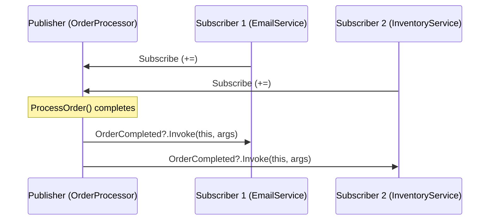
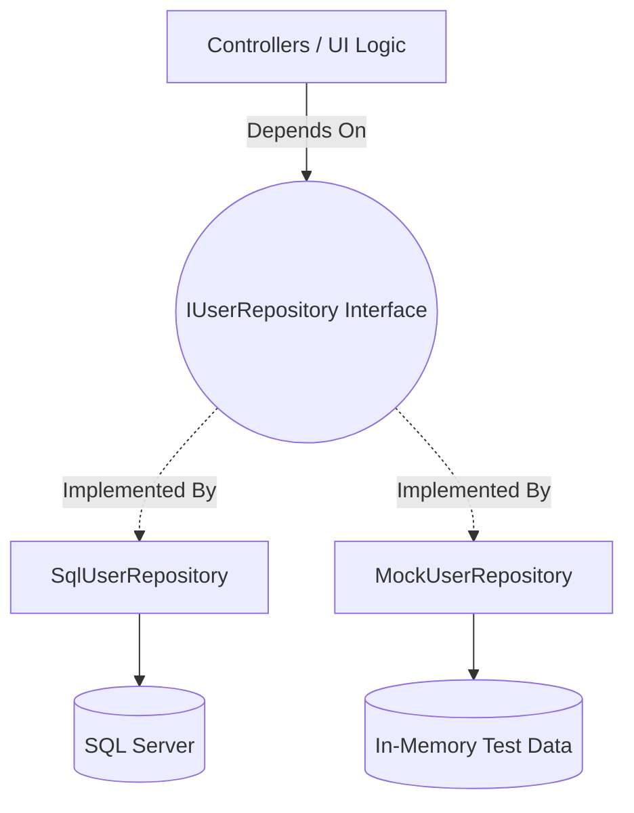

# Lecture 38 — Advanced C#: Delegates, Events, Reflection & Patterns

**Course:** Full-Stack Web Development  
**Instructor:** Kyrillos Medhat  
**Duration:** 3 hours (Theory + Lab)

---

## 🚦 Prerequisites

Before diving into this advanced module, ensure you are deeply comfortable with the following concepts. If any of these feel shaky, take a moment to review them in previous lectures:

- **C# Object-Oriented Programming (OOP):** You must understand Classes, Interfaces, Abstract Classes, Inheritance, and Polymorphism.
- **Generics:** Mastery of the `<T>` syntax (e.g., `List<T>`, `Dictionary<TKey, TValue>`) is non-negotiable for understanding delegates and extension methods.
- **Memory Management Basics:** Understanding reference types (which live on the heap) versus value types (which live on the stack) is crucial for understanding how `record` and Reflection operate.
- **Basic LINQ:** Having used `.Where()`, `.Select()`, or `.OrderBy()` will make understanding lambda expressions and extension methods significantly easier.

---

## 🎯 Learning Objectives

By the end of this comprehensive deep-dive lecture, you will be well-equipped to:
1. **Master Delegates & Lambdas:** Understand how to treat functions as first-class citizens, pass them as parameters, and chain them using Multicast Delegates.
2. **Implement Event-Driven Architectures:** Build decoupled, scalable systems using the Publisher-Subscriber pattern and custom `EventArgs`, while avoiding notorious memory leaks.
3. **Extend Existing Types Elegantly:** Use Extension Methods to gracefully add functionality to sealed classes, third-party libraries, or interfaces without altering their source code.
4. **Leverage Immutable Data:** Model robust domain objects using C# 9+ `record` types, ensuring thread-safety, predictable state changes, and value-based equality out of the box.
5. **Inspect Metadata with Reflection:** Dynamically inspect object types, invoke methods at runtime, instantiate objects dynamically, and read custom attributes to build highly generic code.
6. **Apply Core Architectural Design Patterns:** Structure your code professionally using Singleton, Repository, Factory Method, Strategy, and Observer patterns to solve common software design problems.

---

## 📋 Agenda

### Part 1 — Theory & Deep Dives (~120 min)
1. **Delegates & Lambdas:** `Func<T>`, `Action<T>`, `Predicate<T>`, Anonymous Methods, and Multicasting.
2. **Events:** The Publisher-Subscriber Pattern, Memory Leaks (`IDisposable`), and `EventHandler<T>`.
3. **Extension Methods:** Upgrading Built-In Types, Interface Extensions, and the Magic of LINQ.
4. **Records (`record`):** Immutability, Positional Syntax, `with` expressions, and Value Equality vs Reference Equality.
5. **Reflection:** Inspecting Types, Late Binding, Dynamic Instantiation, and Reading Custom Attributes.
6. **Design Patterns:** Singleton, Factory Method, Strategy, Observer, and Repository.

### Part 2 — Practice / Lab (~60–90 min)
1. **Lab 1:** Building a Custom LINQ-like Extension Method.
2. **Lab 2:** Creating an Event-Driven Notification System with Multicast Delegates.
3. **Lab 3:** Using Reflection to build a miniature Object-Relational Mapper (ORM).
4. **Assignment:** FinanceTracker Project Part 6 — Refactoring to the Repository Pattern.

---

## 1. Delegates and Lambdas: Functions as Data

### What Exactly is a Delegate?

In traditional procedural programming, variables hold data. You have integers, strings, arrays, and objects. But what if you need a variable to hold *behavior*? What if you want to pass a specific algorithm into another method?

A **delegate** in C# is a type-safe function pointer. It defines a rigid method signature (a specific return type and specific parameters) and can hold a reference to *any* method that perfectly matches that signature. This allows methods to be passed as arguments to other methods, stored in variables, returned from functions, and even invoked dynamically.

> [!NOTE]
> Under the hood, every delegate is an object derived from the `System.MulticastDelegate` base class. It internally holds two things: a reference to the target object (if the method is an instance method) and a pointer to the method to execute.

### Custom Delegates vs. Built-in Delegates

Historically (in C# 1.0 and 2.0), developers had to define their own delegate types constantly.

```csharp
// 1. Defining a custom delegate type
public delegate int MathOperation(int a, int b);

public class Calculator
{
    public int Add(int x, int y) => x + y;
    public int Multiply(int x, int y) => x * y;
    
    // This method accepts BEHAVIOR as a parameter
    public void ExecuteOperation(MathOperation operation, int a, int b)
    {
        Console.WriteLine($"Executing... Result: {operation(a, b)}");
    }
}

// Usage:
var calc = new Calculator();
MathOperation addPointer = calc.Add;
calc.ExecuteOperation(addPointer, 10, 5); // Output: Executing... Result: 15
```

While defining custom delegates is still possible, modern C# provides three generic delegate families in the `System` namespace that cover 99% of all use cases:

1. **`Action<T...>`**: Takes 0 to 16 parameters, always returns `void`. Used for performing an action where you don't need a result back.
2. **`Func<T..., TResult>`**: Takes 0 to 16 parameters, always returns `TResult` (the last generic parameter is always the return type). Used for calculations, transformations, or data retrieval.
3. **`Predicate<T>`**: Takes exactly 1 parameter, always returns `bool`. Used specifically for testing conditions (e.g., checking if an item meets a certain criteria). *Note: `Func<T, bool>` is often used interchangeably.*

### Lambda Expressions: The Shorthand

A lambda expression is an anonymous function—a function without a name—used to create delegates or expression tree types instantly. The `=>` operator is read as "goes to" or "becomes".

Lambdas revolutionized C# by removing the boilerplate of creating tiny, one-off methods.

```csharp
// 1. Using Func (Takes two ints, returns an int)
// (x, y) are the inputs. Everything to the right of => is returned.
Func<int, int, int> multiply = (x, y) => x * y;
Console.WriteLine(multiply(5, 4)); // Output: 20

// 2. Using Action (Takes a string, returns void)
// Because it's an Action, the body can be a statement block {}
Action<string> logInfo = message => 
{
    Console.ForegroundColor = ConsoleColor.Green;
    Console.WriteLine($"[INFO] {DateTime.Now}: {message}");
    Console.ResetColor();
};
logInfo("System initialized successfully.");

// 3. Using Predicate (Takes an int, returns bool)
Predicate<int> isEven = number => number % 2 == 0;
Console.WriteLine(isEven(10)); // Output: True
```

### Multicast Delegates: Chaining Behaviors

A tremendously powerful feature of C# delegates is **multicasting**. A single delegate variable doesn't just hold one method; it holds an *invocation list*. When the delegate is invoked, it calls all methods in its list sequentially.

You add methods using the `+=` operator and remove them using the `-=` operator.

```csharp
Action<string> loggingPipeline = null;

// Method 1
loggingPipeline += msg => Console.WriteLine($"[Console]: {msg}");

// Method 2
loggingPipeline += msg => File.AppendAllText("app.log", $"[File]: {msg}\n");

// Invokes BOTH methods sequentially, in the exact order they were added!
loggingPipeline?.Invoke("Critical database failure!");

// You can also remove a method (though lambdas are tricky to remove unless stored in a variable)
```

> [!WARNING]
> **The Return Value Trap:** If a multicast delegate returns a value (e.g., `Func<int, string>`), only the return value of the **very last** method in the invocation list is captured and returned. The return values of all previous methods in the chain are silently discarded.

---

## 2. Events: The Publisher-Subscriber Pattern

### The Problem with Callbacks and Raw Delegates

Imagine you are building a UI framework. You expose a public delegate for a button click: `public Action OnClick;`.
A developer using your framework writes:
```csharp
myButton.OnClick += PlaySound;
myButton.OnClick += SubmitForm;
```
This is fine. But what if a junior developer accidentally types:
```csharp
myButton.OnClick = null; // Disasters! 
```
By directly accessing the delegate, they wiped out the entire invocation list. No sounds will play, no forms will submit. We need encapsulation.

### The Event Keyword

The `event` keyword adds a layer of protection over a delegate. Think of an event as a "property" for a delegate:
- From **inside** the class defining the event, you can invoke it, clear it, or modify it freely.
- From **outside** the class, you can *only* subscribe (`+=`) or unsubscribe (`-=`). You cannot invoke it, and you cannot overwrite it with `=`.

### Implementing the Standard .NET Event Pattern

Microsoft provides a highly standardized pattern for events using the `EventHandler` and `EventHandler<TEventArgs>` delegates.



#### Step 1: Define Custom EventArgs (The Data Packet)
Always inherit from `EventArgs`. This class carries the contextual data about what just happened.

```csharp
public class OrderEventArgs : EventArgs
{
    public int OrderId { get; }
    public decimal TotalAmount { get; }
    public DateTime ProcessedAt { get; }

    public OrderEventArgs(int orderId, decimal amount)
    {
        OrderId = orderId;
        TotalAmount = amount;
        ProcessedAt = DateTime.UtcNow;
    }
}
```

#### Step 2: The Publisher (The Broadcaster)
The publisher defines the event and the logic to trigger it.

```csharp
public class OrderProcessor
{
    // 1. Declare the event using EventHandler<T>
    public event EventHandler<OrderEventArgs>? OrderProcessed;

    public void ProcessOrder(int orderId, decimal amount)
    {
        Console.WriteLine($"Processing order {orderId}...");
        Thread.Sleep(1000); // Simulate work
        
        // 2. Raise the event safely
        // 'this' refers to the OrderProcessor instance sending the event
        OrderProcessed?.Invoke(this, new OrderEventArgs(orderId, amount));
    }
}
```

#### Step 3: The Subscriber (The Listener)
The subscriber listens for the event and reacts.

```csharp
public class EmailService
{
    public void Subscribe(OrderProcessor processor)
    {
        // 3. Attach the event handler
        processor.OrderProcessed += SendConfirmationEmail;
    }

    // The method signature MUST match EventHandler<OrderEventArgs>
    private void SendConfirmationEmail(object? sender, OrderEventArgs e)
    {
        Console.WriteLine($"[Email] Order {e.OrderId} confirmed for {e.TotalAmount:C} at {e.ProcessedAt}.");
    }
}

// Execution:
var processor = new OrderProcessor();
var emailService = new EmailService();

emailService.Subscribe(processor);
processor.ProcessOrder(101, 250.50m);
```

> [!CAUTION]
> **The Memory Leak Trap (Lapsed Listener Problem):** 
> If a long-lived publisher (like a static system timer or a main application window) holds a reference to a short-lived subscriber via an event subscription, the .NET Garbage Collector cannot clean up the subscriber. The publisher is keeping the subscriber alive! 
> **Always implement `IDisposable` on your subscribers and unsubscribe (`-=`) when the subscriber is being destroyed!**

---

## 3. Extension Methods: Upgrading Built-In Types

### The 'Why' of Extension Methods

Often, you are working with classes that you do not own and cannot modify. 
- It might be a class built by Microsoft (like `string`, `int`, or `DateTime`).
- It might be a class from a third-party NuGet package.
- It might be an interface where adding a new method would break 100 existing implementations.

**Extension Methods** allow you to "bolt on" new methods to existing types gracefully. To the developer calling the code, it looks exactly like the method was part of the original class.

### Strict Rules for Extension Methods
1. They must be defined in a **static, non-generic class**.
2. They must be **static methods**.
3. The first parameter specifies the type being extended, preceded by the `this` modifier.

### Example: String and DateTime Extensions

```csharp
public static class CommonExtensions
{
    // Extends string
    public static string Truncate(this string text, int maxLength)
    {
        if (string.IsNullOrEmpty(text)) return text;
        return text.Length <= maxLength ? text : text.Substring(0, maxLength) + "...";
    }

    // Extends DateTime
    public static bool IsWeekend(this DateTime date)
    {
        return date.DayOfWeek == DayOfWeek.Saturday || date.DayOfWeek == DayOfWeek.Sunday;
    }
}
```

Usage is completely seamless:
```csharp
string description = "This is a very long product description that needs shortening.";
Console.WriteLine(description.Truncate(15)); // Output: This is a very ...

DateTime today = DateTime.Now;
if (today.IsWeekend()) 
{
    Console.WriteLine("Take a break!");
}
```

### Generic Extension Methods (The Magic Behind LINQ)

The entirety of Language Integrated Query (LINQ) is built on extension methods that extend the `IEnumerable<T>` interface. You can build highly reusable, generic tools this way.

```csharp
public static class EnumerableExtensions
{
    // A custom extension method extending ANY collection
    public static bool IsEmpty<T>(this IEnumerable<T> collection)
    {
        // Avoids counting the entire collection, just checks if first item exists
        return !collection.Any(); 
    }
    
    // A classic ForEach extension (normally only available on List<T>)
    public static void ForEach<T>(this IEnumerable<T> collection, Action<T> action)
    {
        foreach (var item in collection)
        {
            action(item);
        }
    }
}

// Usage:
string[] names = { "Alice", "Bob", "Charlie" };
if (!names.IsEmpty()) 
{
    names.ForEach(n => Console.WriteLine(n.ToUpper()));
}
```

---

## 4. Records (`record`): Immutable Data Structures

### The Need for Immutability

In concurrent programming (multithreading), complex domain-driven design, or functional paradigms, **mutable state** (data that can change) is the root cause of many elusive bugs. If Thread A modifies a User object while Thread B is reading it, the application enters an invalid state.

Historically, making a C# class truly immutable required a lot of boilerplate code: private setters, massive constructors, and overriding `Equals()` and `GetHashCode()`.

C# 9 introduced `record` types to solve this by making immutability easy, concise, and default.

### Value Equality vs. Reference Equality

This is a fundamental concept in C#:
- **Classes** use **Reference Equality**. If you compare two class instances, C# asks: *"Are these the exact same object residing at the exact same memory address on the heap?"*
- **Structs** use **Value Equality**. C# asks: *"Do all the fields inside these objects contain the exact same data?"* However, structs are value types, which can cause performance issues if they are large and constantly copied.

**Records are reference types (they live on the heap, like classes) but they automatically provide Value Equality.**

```csharp
// Positional Record Syntax - incredibly concise!
// The compiler auto-generates the constructor, properties, Equals, GetHashCode, and ToString!
public record Employee(int Id, string FirstName, string LastName, string Department);

var emp1 = new Employee(1, "John", "Doe", "Engineering");
var emp2 = new Employee(1, "John", "Doe", "Engineering");

// If Employee was a class, this would be FALSE.
// Because it is a record, it compares the values. This is TRUE.
Console.WriteLine(emp1 == emp2); 
```

### Non-Destructive Mutation (The `with` Expression)

Because standard positional records are immutable, you cannot alter their properties after creation.
```csharp
// emp1.Department = "HR"; // ❌ COMPILER ERROR: Init-only property!
```

If an employee changes departments, you don't mutate the existing object. You create a brand new copy of the object with specific modifications using the `with` keyword.

```csharp
// ✅ GOOD: Create a new copy with one specific change
var transferredEmp = emp1 with { Department = "Human Resources" };

Console.WriteLine(emp1.Department);          // Engineering (Original is untouched!)
Console.WriteLine(transferredEmp.Department);// Human Resources
Console.WriteLine(transferredEmp.FirstName); // John (Copied safely from emp1)
```

> [!TIP]
> Records are the absolute perfect tool for creating Data Transfer Objects (DTOs), API Responses, CQRS Commands/Queries, and Configuration settings. Anywhere data is passed around and should not change, use a `record`.

---

## 5. Reflection: Inspecting Metadata at Runtime

### What is Reflection?

Reflection is the powerful ability of a program to inspect its own metadata, types, and structures while the program is actually running. Using the `System.Reflection` namespace, you can discover classes, read custom attributes, instantiate objects dynamically, and even invoke methods without knowing about them when you compiled the code.

It is the "magic" behind Dependency Injection containers, Object-Relational Mappers (like Entity Framework), and serializers (like JSON.NET).

### The `Type` Object: The Gateway to Reflection

Every object in C# has metadata attached to it. You access this via the `Type` class.
You can get a `Type` from an instance using `.GetType()`, or from a class definition using `typeof()`.

```csharp
Type stringType = typeof(string);
Console.WriteLine($"Name: {stringType.Name}");             // String
Console.WriteLine($"Namespace: {stringType.Namespace}");   // System
Console.WriteLine($"Is Class? {stringType.IsClass}");      // True
Console.WriteLine($"Base Type: {stringType.BaseType}");    // System.Object

// Inspecting methods
Console.WriteLine("Methods in String class:");
foreach (MethodInfo method in stringType.GetMethods().Take(5)) // Just looking at 5
{
    Console.WriteLine($" - {method.ReturnType.Name} {method.Name}()");
}
```

### Dynamic Instantiation and Late Binding

Imagine you are building a plugin architecture. Users drop `.dll` files into a "Plugins" folder. Your application doesn't know what classes are inside those DLLs at compile time.

Reflection allows you to load the assembly, find the classes, create instances, and run them!

```csharp
public class SecretService
{
    // A totally private method!
    private void TopSecretProtocol(string passcode)
    {
        Console.WriteLine($"Access Granted. Passcode accepted: {passcode}");
    }
}

// 1. Get the type
Type t = typeof(SecretService);

// 2. Create an instance dynamically (requires a parameterless constructor)
object instance = Activator.CreateInstance(t);

// 3. Find the PRIVATE method using BindingFlags
MethodInfo secretMethod = t.GetMethod("TopSecretProtocol", 
    BindingFlags.NonPublic | BindingFlags.Instance);

// 4. Invoke it! (Bypassing C# access modifiers entirely!)
// We pass the instance, and an array of parameters.
secretMethod.Invoke(instance, new object[] { "Alpha-Tango-99" });
```

### Reading Custom Attributes

Attributes are metadata tags you place on classes or properties. They don't do anything by themselves. Reflection is what reads them and acts upon them. This is exactly how `[Required]` works in ASP.NET Core!

```csharp
// 1. Define a custom attribute
[AttributeUsage(AttributeTargets.Property)]
public class ValidateLengthAttribute : Attribute
{
    public int MaxLength { get; }
    public ValidateLengthAttribute(int max) => MaxLength = max;
}

// 2. Apply it to a model
public class UserModel
{
    [ValidateLength(10)]
    public string Username { get; set; }
}

// 3. The Validation Engine (Using Reflection)
public static class CustomValidator
{
    public static bool Validate(object obj)
    {
        Type type = obj.GetType();
        
        // Loop through all properties of the object
        foreach (PropertyInfo prop in type.GetProperties())
        {
            // Check if this property has our custom attribute
            var attr = prop.GetCustomAttribute<ValidateLengthAttribute>();
            if (attr != null)
            {
                // Extract the actual value of the property from the object instance
                string value = prop.GetValue(obj) as string;
                
                if (value != null && value.Length > attr.MaxLength)
                {
                    Console.WriteLine($"Validation Failed: {prop.Name} exceeds max length of {attr.MaxLength}.");
                    return false;
                }
            }
        }
        return true;
    }
}
```

> [!WARNING]
> Reflection is extraordinarily powerful, but it comes with severe costs. It bypasses compile-time type safety (you won't know you made a mistake until runtime) and it is significantly slower than direct execution because it has to read metadata dynamically. Use it for framework-level infrastructure, not inside tight loops or hot-path business logic.

---

## 6. Common Architectural Design Patterns

Design patterns are standardized, proven solutions to recurring software engineering problems.

### 6.1 The Singleton Pattern
**Problem:** You have a class (like a global Configuration Manager, or a Database Connection Pool) and you must guarantee that absolutely only **one** instance of this class is ever created across the entire application lifecycle.
**Solution:** Hide the constructor, and provide a static property that manages the single instance.

```csharp
public sealed class ConfigurationManager
{
    // Lazy<T> ensures thread-safe, deferred initialization.
    // The object is only created the first time someone asks for it.
    private static readonly Lazy<ConfigurationManager> _lazy = 
        new Lazy<ConfigurationManager>(() => new ConfigurationManager());

    public static ConfigurationManager Instance => _lazy.Value;

    // The constructor MUST be private!
    private ConfigurationManager()
    {
        Console.WriteLine("Loading configuration from disk... (This happens exactly once)");
    }
    
    public string GetSetting(string key) => $"Value_for_{key}";
}

// Usage:
// ConfigurationManager config = new ConfigurationManager(); // ❌ ERROR
var config = ConfigurationManager.Instance; // ✅ SUCCESS
```

### 6.2 The Factory Method Pattern
**Problem:** Your code contains complex `if/else` or `switch` statements scattered everywhere determining which object to instantiate based on user input.
**Solution:** Abstract the creation of objects into a centralized "Factory" class.

```csharp
public interface INotificationSender { void Send(string msg); }
public class SmsSender : INotificationSender { public void Send(string msg) => Console.WriteLine($"SMS: {msg}"); }
public class EmailSender : INotificationSender { public void Send(string msg) => Console.WriteLine($"Email: {msg}"); }

// The Factory
public static class NotificationFactory
{
    public static INotificationSender CreateSender(string type)
    {
        return type.ToLower() switch
        {
            "sms" => new SmsSender(),
            "email" => new EmailSender(),
            _ => throw new ArgumentException("Unknown notification type")
        };
    }
}

// Client code knows NOTHING about SmsSender or EmailSender classes!
INotificationSender sender = NotificationFactory.CreateSender("sms");
sender.Send("Your OTP is 1234");
```

### 6.3 The Strategy Pattern
**Problem:** You have multiple algorithms for a specific task (e.g., calculating taxes for different countries, or sorting algorithms). Using inheritance creates a bloated base class.
**Solution:** Encapsulate each algorithm inside its own class implementing a common interface. Inject the specific strategy into the context.

```csharp
// The Strategy Interface
public interface IDiscountStrategy { decimal Calculate(decimal amount); }

// Concrete Strategies
public class NoDiscount : IDiscountStrategy { public decimal Calculate(decimal amount) => amount; }
public class BlackFridayDiscount : IDiscountStrategy { public decimal Calculate(decimal amount) => amount * 0.5m; }

// The Context
public class CheckoutService
{
    private readonly IDiscountStrategy _discountStrategy;
    
    // Strategy is injected dynamically
    public CheckoutService(IDiscountStrategy discountStrategy)
    {
        _discountStrategy = discountStrategy; 
    }
    
    public void ProcessPayment(decimal amount)
    {
        decimal finalAmount = _discountStrategy.Calculate(amount);
        Console.WriteLine($"Final charge: {finalAmount:C}");
    }
}
```

### 6.4 The Repository Pattern
**Problem:** Your UI or Business Logic layer directly writes Entity Framework queries. If the database schema changes, or if you want to switch from SQL Server to MongoDB, you have to rewrite your entire application. Furthermore, unit testing business logic is impossible because it requires a real database connection.
**Solution:** Create an interface that acts as a collection of domain objects in memory. The UI talks to the interface. The Repository implementation talks to the database.



```csharp
// 1. The Contract (Core Layer)
public interface IUserRepository
{
    Task<User> GetByIdAsync(int id);
    Task AddAsync(User user);
}

// 2. The Implementation (Infrastructure Layer)
public class SqlUserRepository : IUserRepository
{
    private readonly AppDbContext _context;
    public SqlUserRepository(AppDbContext context) => _context = context;
    
    public async Task<User> GetByIdAsync(int id) => await _context.Users.FindAsync(id);
    public async Task AddAsync(User user) 
    { 
        _context.Users.Add(user); 
        await _context.SaveChangesAsync(); 
    }
}
```

---

## 🧠 Think Like a Developer: Expert Scenarios

### Scenario 1: Avoiding the God Class with Events
**Context:** You are building an E-Commerce system. When an order is placed, you need to save it to the DB, send a confirmation email, update the inventory count, notify the shipping department, and update the analytics dashboard.
**The Junior Approach:** You write a massive 500-line `Checkout()` method that takes `EmailService`, `InventoryService`, `ShippingService`, and `AnalyticsService` as constructor dependencies and calls them all sequentially. The `OrderService` is now a monolithic "God Class".
**The Expert Approach:** You apply the Publisher-Subscriber pattern (often via a mediator library like MediatR, or raw C# Events). The `OrderService` simply saves the DB and raises an `OrderPlaced` event. The Email, Inventory, and Shipping services independently subscribe to that event. The `OrderService` is now beautifully decoupled and only has one dependency: the database.

### Scenario 2: Dynamic Validations with Reflection
**Context:** You have an enterprise application with 50 different DTO classes. Security requires that all `string` properties must be stripped of HTML tags to prevent XSS attacks before saving to the database.
**The Junior Approach:** You manually write sanitization logic in the `set { }` block of every single string property across all 50 classes. It takes days, and you forget half of them.
**The Expert Approach:** You write a single Reflection-based middleware/interceptor. When any object arrives at the API, the interceptor iterates over `typeof(T).GetProperties()`, checks if `prop.PropertyType == typeof(string)`, reads the current value, strips the HTML, and uses `prop.SetValue()` to write the safe string back. You write 15 lines of code, apply it globally, and fix the security flaw for the entire application instantly.

---

## 🔄 Before vs After: Modernizing C# Code

### Example 1: DTO Creation

```csharp
// BEFORE (C# 7): Boilerplate madness for a simple data carrier
public class CustomerDto
{
    public int Id { get; }
    public string Name { get; }
    
    public CustomerDto(int id, string name)
    {
        Id = id;
        Name = name;
    }
    
    // Must manually override Equals and GetHashCode for value equality
    public override bool Equals(object obj) { ... }
    public override int GetHashCode() { ... }
}
```

```csharp
// AFTER (C# 9+): Beautiful, concise, immutable Records
public record CustomerDto(int Id, string Name);
```

### Example 2: Checking Nulls and Invoking Delegates

```csharp
// BEFORE: Verbose null checking
if (OnDataReceived != null)
{
    OnDataReceived(this, new DataEventArgs(data));
}
```

```csharp
// AFTER: The Null-Conditional Operator
OnDataReceived?.Invoke(this, new DataEventArgs(data));
```

---

## ⚠️ Common Mistakes & How to Avoid Them

| ❌ The Mistake | 💥 The Impact | ✅ The Expert Fix |
|--------------|-------------|-----------------|
| **Forgetting to Unsubscribe (`-=`)** | **Severe Memory Leaks.** The publisher keeps subscribers alive in memory forever, eventually crashing the app with OutOfMemoryExceptions. | If a short-lived component subscribes to a long-lived global event, it must implement `IDisposable` and unsubscribe in the `Dispose()` method. |
| **Excessive use of Reflection in Loops** | High CPU overhead, extremely slow application performance. | Cache `PropertyInfo` or `MethodInfo` objects in static dictionaries if you need them repeatedly. In .NET 6+, prefer Source Generators over Reflection when possible. |
| **Complex Logic inside Lambdas** | Hard to read, impossible to unit test directly, breaks stack traces on exceptions. | Extract complex lambda logic into separate private methods with descriptive names, and pass the method group instead: `list.Where(IsEligibleForDiscount)` |
| **Extending `object` globally** | Pollutes IntelliSense. If you write `public static void DoThing(this object obj)`, every single variable in the app will now have `.DoThing()`. | Scope extension methods strictly to specific interfaces (`IEnumerable<T>`) or sealed domain classes. |

---

## 🎤 Interview Prep: Top 5 Advanced Questions

**1. What is the fundamental difference between a Delegate and an Event?**
*Answer:* A delegate is a type that holds a reference to a method. An event is a syntax wrapper around a delegate that provides encapsulation; it restricts external classes so they can *only* subscribe (`+=`) or unsubscribe (`-=`), preventing them from invoking the delegate directly or clearing the invocation list with `= null`.

**2. Explain the purpose of the `record` keyword. How does it differ from a `class`?**
*Answer:* Introduced in C# 9, `record` simplifies creating immutable data models. While both are reference types allocated on the heap, classes use reference equality (memory address), whereas records automatically generate value-based equality (`Equals`, `GetHashCode`), a formatted `ToString()`, and support non-destructive mutation via the `with` keyword.

**3. What is Late Binding in the context of Reflection?**
*Answer:* Late binding allows a program to instantiate objects and invoke their methods at runtime without knowing their types at compile time. It heavily relies on `Activator.CreateInstance` and `MethodInfo.Invoke`. It provides immense flexibility (like loading plugins dynamically) but sacrifices compile-time safety and execution speed.

**4. When would you choose to use the Strategy Pattern over simple IF/ELSE statements?**
*Answer:* When you have multiple distinct algorithms or variations of a business rule (like different payment gateways, discount calculators, or sorting algorithms) that are likely to change or expand. The Strategy pattern extracts these into separate classes implementing a common interface, strictly adhering to the Open-Closed Principle (OCP) of SOLID.

**5. What is a Multicast Delegate and what happens to the return values?**
*Answer:* A multicast delegate holds an invocation list of multiple methods. When invoked, it calls them all synchronously in order. If the delegate has a non-void return type (like `Func`), only the result of the *last* method executed in the list is returned; previous results are discarded.

---

## ⚡ Quick Cheat Sheet

```csharp
// --- DELEGATES ---
Action<string> log = msg => Console.WriteLine(msg); // 0-16 inputs, returns void
Func<int, int, int> add = (a, b) => a + b; // 0-16 inputs, returns the LAST type (int)
Predicate<int> isEven = n => n % 2 == 0; // 1 input, ALWAYS returns bool

// --- EVENTS ---
public event EventHandler<MyEventArgs>? OnAction; // Declaration
OnAction?.Invoke(this, new MyEventArgs(data)); // Publisher invoking
publisher.OnAction += (sender, args) => Console.WriteLine(args.Data); // Subscriber
publisher.OnAction -= (sender, args) => Console.WriteLine(args.Data); // Unsubscribing

// --- EXTENSION METHODS ---
public static class StringExt {
    public static bool IsCool(this string s) => s.Contains("Cool");
}
// Usage: "Very Cool".IsCool();

// --- RECORDS ---
public record Car(string Make, string Model);
var c1 = new Car("Ford", "Mustang");
var c2 = c1 with { Model = "Fiesta" }; // Non-destructive clone (c1 is untouched)

// --- REFLECTION ---
Type t = typeof(MyClass);
object instance = Activator.CreateInstance(t); // Dynamic creation
MethodInfo m = t.GetMethod("MyMethod", BindingFlags.NonPublic | BindingFlags.Instance);
m.Invoke(instance, new object[] { "param1" }); // Dynamic invocation
```

---

## 🧪 Practice Labs

### Lab 1 — Event-Driven Sensor Network
1. Create a `TemperatureSensor` class. It has a `Location` property and a method `ReadTemperature()`.
2. Define a custom `TemperatureEventArgs` holding the temperature value and the sensor location.
3. Define an event `CriticalTemperatureReached` using `EventHandler<TemperatureEventArgs>`.
4. Inside `ReadTemperature()`, generate a random number between 0 and 100. If it exceeds 85, fire the event safely.
5. In `Program.cs`, create 3 sensors. Subscribe an `AlarmSystem` class to all three sensors. When the event fires, print a red warning to the console identifying which location overheated.

### Lab 2 — The Reflection Inspector
1. Create a class `ConfidentialData` with several private fields (e.g., `_socialSecurityNumber`, `_encryptionKey`) and private methods.
2. In `Program.cs`, without ever modifying `ConfidentialData`, use Reflection to instantiate it.
3. Use `GetFields(BindingFlags.NonPublic | BindingFlags.Instance)` to iterate through and print out all private field names and their default values to the console.
4. *Bonus:* Use `.SetValue()` via Reflection to forcefully change the private `_encryptionKey` at runtime.

---

## 📝 Assignment: FinanceTracker Project — Part 6

We are going to drastically clean up our FinanceTracker architecture using the advanced concepts from this lecture.

### Step 1: Implement the Repository Pattern
Define an `ITransactionRepository` interface in your Core layer:
```csharp
public interface ITransactionRepository
{
    Task<IEnumerable<Transaction>> GetAllAsync();
    Task AddAsync(Transaction transaction);
    Task DeleteAsync(int id);
}
```
Create an `EfTransactionRepository` class implementing this interface using Entity Framework Core. Update your UI/Console logic to *only* talk to the interface. You should inject the repository into your main application class via the constructor. 

### Step 2: Extension Methods for Financial Math
Create a `public static class FinanceExtensions`.
Write a generic extension method:
`public static decimal CalculateNetBalance(this IEnumerable<Transaction> transactions)`
This method should loop through the collection, sum all transactions where `Type == Income`, and subtract where `Type == Expense`. Use this extension cleanly in your report generator.

### Step 3: Immutability via Records
Convert your `TransactionDTO` (Data Transfer Object) from a standard `class` to a `record`. Ensure that when your Repository passes data back up to the UI layer, it maps the database entities to these immutable records. This prevents junior developers from accidentally modifying data in the UI layer and expecting it to save to the database magically.

---

## 🔗 Resources & Further Reading

- [Delegates & Events in C# (Microsoft Learn)](https://learn.microsoft.com/en-us/dotnet/csharp/programming-guide/delegates/)
- [Deep Dive into C# Reflection](https://learn.microsoft.com/en-us/dotnet/framework/reflection-and-codedom/reflection)
- [Records in C# 9 and 10](https://learn.microsoft.com/en-us/dotnet/csharp/fundamentals/types/records)
- [Design Patterns in C# (.NET Architecture)](https://learn.microsoft.com/en-us/dotnet/architecture/microservices/microservice-ddd-cqrs-patterns/)
- [Refactoring to Patterns (Martin Fowler) - Highly Recommended](https://martinfowler.com/books/eaa.html)

---

## 📌 Key Takeaways
- Treat functions like data using **Delegates** (`Func`, `Action`, `Predicate`), enabling highly dynamic functional programming inside C#.
- Decouple your system architecture using **Events** (Publisher-Subscriber), but always remember to unsubscribe (`-=`) to avoid memory leaks.
- Keep your utility classes clean by using **Extension Methods** to extend existing types naturally, which is the foundational secret behind LINQ.
- Use **Records** for robust, immutable data models and DTOs that compare by value natively, ensuring thread safety.
- Use **Reflection** to build dynamic, flexible systems (like plugin architectures, serializers, or custom ORMs), but beware of the massive performance costs and loss of compile-time safety.
- Structural code is just as important as functional code; use **Design Patterns** (Singleton, Factory, Strategy, Repository) to ensure your enterprise applications remain maintainable, testable, and scalable.

🎉 **Congratulations!** You've successfully navigated the most advanced C# topics. You are now reading and writing code like a senior .NET developer.

**Next Module:** [Lecture 39 — ASP.NET Core Fundamentals & Middleware](./39%20-%20ASP.NET%20Core%20Fundamentals%20%26%20Middleware.md)
