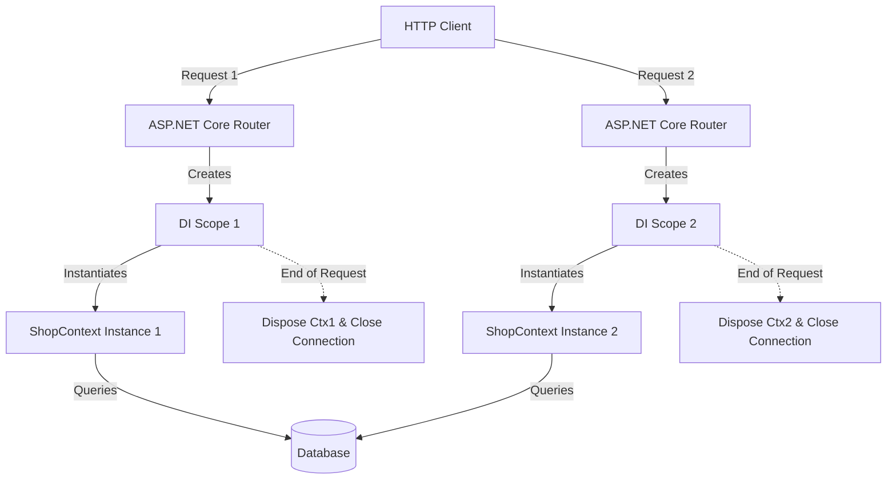
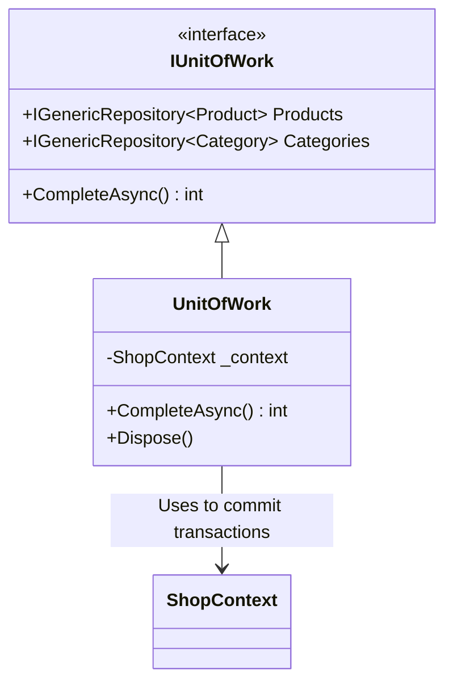

# Lecture 41 — Entity Framework Core with Web API

**Course:** Full-Stack Web Development  
**Instructor:** Kyrillos Medhat  
**Duration:** 3 hours (Theory + Lab)

---

## 🛑 1. Prerequisites (What to know before starting)

Before diving into this lecture, you should have a solid grasp of the following concepts:
- **C# & .NET Basics:** Familiarity with classes, interfaces, generic types (`<T>`), and asynchronous programming (`async`/`await` and `Task`).
- **Entity Framework Core (EF Core) Fundamentals:** You should know how to define Entity classes, configure them using Data Annotations or the Fluent API, and create/apply database migrations.
- **ASP.NET Core Web API:** Understanding of Controllers, routing attributes (`[HttpGet]`, `[HttpPost]`, etc.), and HTTP status codes (`200 OK`, `404 Not Found`, etc.).
- **Dependency Injection (DI):** A fundamental understanding of inversion of control and registering services in the .NET DI container (Transient, Scoped, Singleton).
- **LINQ (Language Integrated Query):** Basic querying capabilities, including `.Where()`, `.Select()`, and lambda expressions.

> [!IMPORTANT]
> If you are rusty on the fundamentals of EF Core or Dependency Injection, please revisit Lectures 35 through 38. We will be building heavily on the concepts of Scoped lifetimes and `DbContext` configurations today.

---

## 🎯 2. Objectives & Agenda

### Learning Objectives

By the end of this extensive lecture and lab session, you will be able to:
1. **Integrate EF Core securely** into an ASP.NET Core Web API using the built-in Dependency Injection container.
2. **Abstract data access logic** by implementing the Generic Repository and Unit of Work patterns.
3. **Design Data Transfer Objects (DTOs)** to enforce security, prevent over-posting, and avoid infinite JSON serialization loops.
4. **Automate complex object mapping** from database Entities to DTOs (and vice-versa) using the AutoMapper library.
5. **Implement highly efficient database pagination** leveraging deferred execution with `.Skip()` and `.Take()` in LINQ.
6. **Structure a Web API** for maintainability, testability, and enterprise-level scalability.

### Course Agenda

**Part 1 — Deep Dive Theory (~90 min)**
- 1. Integrating `DbContext` in ASP.NET Core (Configuration, DI, Lifetimes)
- 2. The Repository & Unit of Work Patterns (Why abstract? How to implement?)
- 3. DTOs (Data Transfer Objects): The Plated Meal Analogy & Security Implications
- 4. AutoMapper: Eliminating Boilerplate Mapping Code
- 5. Efficient Pagination (Offset vs. Keyset, Metadata handling)

**Part 2 — Advanced Scenarios & Developer Mindset (~45 min)**
- Think Like a Developer: Real-world architectural decisions
- Before vs After: Refactoring a "Fat Controller"
- Common Mistakes & How to Avoid Them

**Part 3 — Practice / Lab & Interview Prep (~45 min)**
- Lab 1: Generic Repositories in Action
- Lab 2: AutoMapper and DTOs
- Lab 3: Paged APIs
- Technical Interview Preparation

---

## 📖 3. Deep Numbered Sections

### 3.1. Integrating `DbContext` in ASP.NET Core

In a previous lecture, we built a simple console application where we hardcoded the SQLite or SQL Server connection string directly inside the `OnConfiguring` method of our `DbContext`. While this works for tiny scripts, it is **completely unacceptable** for a production Web API. 

In a modern ASP.NET Core application, we must configure the database centrally in `Program.cs`. This allows us to securely pull configuration data (like connection strings) from environment variables, secure secret managers, or `appsettings.json`, and it enables the Dependency Injection (DI) container to manage the lifetime of our database connection.

#### Step 1: Secure Configuration with `appsettings.json`

The `appsettings.json` file is the central nervous system for your app's configuration. We store the connection string here.

```json
{
  "Logging": {
    "LogLevel": {
      "Default": "Information",
      "Microsoft.AspNetCore": "Warning"
    }
  },
  "ConnectionStrings": {
    "DefaultConnection": "Data Source=shop.db",
    "ProductionConnection": "Server=tcp:myserver.database.windows.net,1433;Initial Catalog=shop_prod;Persist Security Info=False;User ID=admin;Password=SuperSecret123!;MultipleActiveResultSets=False;Encrypt=True;TrustServerCertificate=False;Connection Timeout=30;"
  },
  "AllowedHosts": "*"
}
```

> [!CAUTION]
> **Never hardcode production passwords** in `appsettings.json` if the file is committed to source control! Use the .NET Secret Manager for local development, and environment variables or Azure Key Vault / AWS Secrets Manager in production.

#### Step 2: Registering with the DI Container in `Program.cs`

When the application starts, we use the `WebApplicationBuilder` to read the configuration and register the `DbContext`.

```csharp
using Microsoft.EntityFrameworkCore;
using ShopAPI.Data;

var builder = WebApplication.CreateBuilder(args);

// 1. Fetch the connection string securely
var connectionString = builder.Configuration.GetConnectionString("DefaultConnection");

// 2. Register the DbContext with the DI Container
builder.Services.AddDbContext<ShopContext>(options =>
{
    // Use SQL Server, PostgreSQL, SQLite, etc. depending on your provider
    options.UseSqlite(connectionString)
           // Enable detailed errors for debugging (disable in production)
           .EnableDetailedErrors() 
           .EnableSensitiveDataLogging(); 
});

var app = builder.Build();
```

#### The Architecture of Dependency Injection and DbContext

Why do we use `AddDbContext`? Because of **Lifetimes**.



> [!IMPORTANT]
> `AddDbContext` registers your context as **Scoped** by default. A scoped service is created once per HTTP request. This is the perfect pattern for web applications. It opens a database connection when the request starts, uses the same instance of `DbContext` across all services injected during that request, and cleanly disposes of the connection when the HTTP response is sent back to the user. **Never register a `DbContext` as a Singleton**, as it is not thread-safe and will cause concurrent connection errors!

---

### 3.2. The Repository & Unit of Work Patterns

While you *can* inject `ShopContext` directly into your API Controllers, this tightly couples your Web API layer directly to Entity Framework Core. If your application grows complex, if you need to perform unit testing without hitting a real database, or if you want to centralize complex queries, abstracting data access behind a Repository is highly recommended.

#### The 'Why' Behind the Abstraction
1. **Separation of Concerns:** Controllers should handle HTTP routing and validation, not database queries.
2. **Testability:** You can easily mock an `IRepository` using libraries like Moq, whereas mocking a `DbContext` and `DbSet` is notoriously difficult.
3. **DRY (Don't Repeat Yourself):** Standard operations (Get by ID, Get All, Add, Delete) are written exactly once.

#### The Generic Repository Interface

Instead of writing `IProductRepository`, `ICategoryRepository`, `IOrderRepository`, we write one Generic Repository using C# generics (`<T>`).

```csharp
// IGenericRepository.cs
public interface IGenericRepository<T> where T : class
{
    // Read Operations
    Task<T?> GetByIdAsync(int id);
    Task<IReadOnlyList<T>> GetAllAsync();
    
    // Write Operations (Synchronous because they only modify local memory tracker)
    void Add(T entity);
    void Update(T entity);
    void Remove(T entity);
}
```

#### Implementing the Generic Repository

```csharp
// GenericRepository.cs
public class GenericRepository<T> : IGenericRepository<T> where T : class
{
    private readonly ShopContext _context;
    private readonly DbSet<T> _dbSet;

    public GenericRepository(ShopContext context)
    {
        _context = context;
        _dbSet = context.Set<T>();
    }

    public async Task<T?> GetByIdAsync(int id)
    {
        // Finds an entity with the given primary key values
        return await _dbSet.FindAsync(id);
    }

    public async Task<IReadOnlyList<T>> GetAllAsync()
    {
        return await _dbSet.ToListAsync();
    }

    public void Add(T entity)
    {
        // Does not hit the database! Just marks the entity state as Added.
        _dbSet.Add(entity);
    }

    public void Update(T entity)
    {
        // Marks the entity state as Modified.
        _dbSet.Attach(entity);
        _context.Entry(entity).State = EntityState.Modified;
    }

    public void Remove(T entity)
    {
        // Marks the entity state as Deleted.
        _dbSet.Remove(entity);
    }
}
```

#### The Unit of Work (The Conductor)

If we have multiple repositories, we need a way to ensure that if we add an Order and update a Product, both changes are saved to the database simultaneously in a **single transaction**. If saving the Order succeeds but updating the Product fails, the database should roll back both changes to maintain data integrity.

The **Unit of Work** holds all the repositories and provides a single method to save changes.



```csharp
// IUnitOfWork.cs
public interface IUnitOfWork : IDisposable
{
    IGenericRepository<Product> Products { get; }
    IGenericRepository<Category> Categories { get; }
    
    // The only place where we actually call _context.SaveChangesAsync()
    Task<int> CompleteAsync(); 
}

// UnitOfWork.cs
public class UnitOfWork : IUnitOfWork
{
    private readonly ShopContext _context;

    // Repositories are lazily instantiated or injected
    public IGenericRepository<Product> Products { get; private set; }
    public IGenericRepository<Category> Categories { get; private set; }

    public UnitOfWork(ShopContext context)
    {
        _context = context;
        Products = new GenericRepository<Product>(_context);
        Categories = new GenericRepository<Category>(_context);
    }

    public async Task<int> CompleteAsync()
    {
        // Commits all tracked changes to the database in one atomic transaction
        return await _context.SaveChangesAsync();
    }

    public void Dispose()
    {
        _context.Dispose();
    }
}
```

> [!TIP]
> Don't forget to register these in `Program.cs`!
> `builder.Services.AddScoped(typeof(IGenericRepository<>), typeof(GenericRepository<>));`
> `builder.Services.AddScoped<IUnitOfWork, UnitOfWork>();`

---

### 3.3. DTOs (Data Transfer Objects): The Plated Meal Analogy

#### The Real-World Analogy

Imagine you order a steak at a high-end restaurant. 
- The **Entity** is the raw slab of meat, the unwashed bag of potatoes, and the carton of butter sitting in the kitchen fridge.
- The **DTO (Data Transfer Object)** is the beautifully plated, cooked steak with mashed potatoes placed delicately on your table.

You should **never** send raw database Entities directly to the user (the dining room), and you should never accept raw Entities directly from the user's HTTP request (letting the customer walk into the kitchen and put raw meat on the stove).

#### Problem 1: Over-posting (Mass Assignment Security Flaw)

Imagine we have a `User` entity:
```csharp
public class User 
{
    public int Id { get; set; }
    public string Username { get; set; }
    public string PasswordHash { get; set; }
    public bool IsAdmin { get; set; } // DANGER!
}
```
If your controller method accepts this entity directly:
```csharp
[HttpPost]
public async Task<IActionResult> Register(User user) { ... }
```
A malicious user can send this JSON payload:
```json
{
  "username": "Hacker",
  "passwordHash": "hashed_pass",
  "isAdmin": true
}
```
Because the Model Binder maps JSON directly to the Entity properties, **you just granted the hacker admin rights!**

**The Solution:** Create a `RegisterUserDto` that only contains safe fields.
```csharp
public record RegisterUserDto(string Username, string Password);
```
By mapping the DTO to the Entity manually inside the controller, you strictly control exactly what data is modified.

#### Problem 2: Circular References (Infinite JSON Loops)

Entities often have navigation properties linking back and forth.

```csharp
public class Category 
{ 
    public int Id { get; set; }
    public string Name { get; set; }
    public List<Product> Products { get; set; } 
}

public class Product 
{ 
    public int Id { get; set; }
    public string Name { get; set; }
    public Category Category { get; set; } 
}
```

If you try to return a `Product` from your API, the JSON serializer attempts to serialize the object. 
1. It serializes `Product.Id` and `Product.Name`.
2. It hits `Product.Category` and starts serializing the Category.
3. Inside `Category`, it finds a list of `Products`.
4. Inside the `Products` list, it serializes the `Product` again.
5. It hits `Product.Category` again... 

**Result:** A `JsonException: A possible object cycle was detected.` and your API crashes.

**The Solution:** Map the data to a clean DTO that flattens the hierarchy.
```csharp
// The API Contract (What the frontend sees)
public class ProductDto
{
    public int Id { get; set; }
    public string Name { get; set; }
    public string CategoryName { get; set; } // Flattened property! No cycles.
}
```

---

### 3.4. AutoMapper: Eliminating Boilerplate

Manual mapping between Entities and DTOs is tedious and error-prone.

```csharp
// Imagine doing this for 30 properties!
var dto = new ProductDto 
{
    Id = product.Id,
    Name = product.Name,
    Price = product.Price,
    Description = product.Description,
    StockQuantity = product.StockQuantity,
    // ...
    CategoryName = product.Category.Name
};
```

**AutoMapper** is an incredibly popular library that automates this using Reflection and expression trees. It operates on convention-based configuration.

#### Step 1: Installation
```bash
dotnet add package AutoMapper
dotnet add package AutoMapper.Extensions.Microsoft.DependencyInjection
```

#### Step 2: Create a Mapping Profile
Create a class inheriting from `Profile`. AutoMapper automatically maps properties with identical names. 

It also has a superpower called **"Flattening"**. If your source Entity has an object `Category` which has a property `Name` (`Category.Name`), and your destination DTO has a property called `CategoryName`, AutoMapper automatically maps them!

```csharp
using AutoMapper;
using ShopAPI.Entities;
using ShopAPI.DTOs;

public class MappingProfile : Profile
{
    public MappingProfile()
    {
        // CreateMap<Source, Destination>();
        
        // Entity to DTO (Read operations)
        CreateMap<Product, ProductDto>()
            // Advanced configuration: Mapping a specific field that doesn't follow conventions
            .ForMember(dest => dest.CustomPrice, opt => opt.MapFrom(src => src.Price * 1.2m));
            
        // DTO to Entity (Write operations)
        CreateMap<CreateProductDto, Product>(); 
    }
}
```

#### Step 3: Register and Use in the API

```csharp
// Program.cs
// Tells AutoMapper to scan the current assembly for any classes inheriting from 'Profile'
builder.Services.AddAutoMapper(AppDomain.CurrentDomain.GetAssemblies());
```

```csharp
// ProductsController.cs
[ApiController]
[Route("api/[controller]")]
public class ProductsController : ControllerBase
{
    private readonly IUnitOfWork _unitOfWork;
    private readonly IMapper _mapper;

    public ProductsController(IUnitOfWork unitOfWork, IMapper mapper) 
    { 
        _unitOfWork = unitOfWork;
        _mapper = mapper; 
    }

    [HttpGet]
    public async Task<IActionResult> GetProducts()
    {
        var products = await _unitOfWork.Products.GetAllAsync();
        
        // One line of code transforms the entire list of Entities into DTOs!
        var data = _mapper.Map<IReadOnlyList<ProductDto>>(products);
        
        return Ok(data);
    }
}
```

---

### 3.5. Efficient Pagination

If your database has 1,000,000 products, you cannot return them all in a single `GET /api/products` request.
- The SQL query will take seconds to run.
- The Web API server memory will spike and potentially crash (Out of Memory exception).
- The JSON payload will be massive (hundreds of MBs).
- The user's browser or mobile app will freeze trying to render it.

We solve this using **Offset-based Pagination** utilizing LINQ's `.Skip()` and `.Take()` methods.

#### The Math Behind Pagination

To fetch a specific page of data, we need to know:
1. `PageNumber` (Which page the user wants)
2. `PageSize` (How many items per page)

If we want **Page 3**, and the **PageSize is 10**:
- Page 1: Items 1 to 10
- Page 2: Items 11 to 20
- Page 3: Items 21 to 30

To get items 21 through 30, we must **Skip** the first 20 items, and **Take** the next 10.
Formula for Skip: `(PageNumber - 1) * PageSize` = `(3 - 1) * 10` = `20`.

#### The Implementation

Let's upgrade our Repository to handle pagination natively.

```csharp
// IGenericRepository.cs Additions:
Task<IReadOnlyList<T>> GetPagedAsync(int pageNumber, int pageSize);
Task<int> CountAsync();
```

```csharp
// GenericRepository.cs Implementation:
public async Task<IReadOnlyList<T>> GetPagedAsync(int pageNumber, int pageSize)
{
    return await _dbSet
        .Skip((pageNumber - 1) * pageSize)
        .Take(pageSize)
        .ToListAsync();
}

public async Task<int> CountAsync()
{
    return await _dbSet.CountAsync();
}
```

#### Creating a Metadata DTO Wrapper

The frontend needs to know how many total items exist so it can render the `[1] [2] [3] ... [Last]` pagination UI. We create a generic wrapper class.

```csharp
public class Pagination<T> where T : class
{
    public int PageIndex { get; set; }
    public int PageSize { get; set; }
    public int TotalCount { get; set; }
    public IReadOnlyList<T> Data { get; set; }

    public Pagination(int pageIndex, int pageSize, int totalCount, IReadOnlyList<T> data)
    {
        PageIndex = pageIndex;
        PageSize = pageSize;
        TotalCount = totalCount;
        Data = data;
    }
}
```

#### Final Controller Endpoint

```csharp
[HttpGet]
public async Task<IActionResult> GetPagedProducts([FromQuery] int page = 1, [FromQuery] int pageSize = 10)
{
    // 1. Guard clauses to prevent API abuse (e.g., user requests 1,000,000 items per page)
    if (pageSize > 50) pageSize = 50;
    if (page < 1) page = 1;

    // 2. Fetch the metadata count
    var totalItems = await _unitOfWork.Products.CountAsync();

    // 3. Fetch only the data needed for the current page
    var products = await _unitOfWork.Products.GetPagedAsync(page, pageSize);
    
    // 4. Map to DTOs
    var data = _mapper.Map<IReadOnlyList<ProductDto>>(products);
    
    // 5. Wrap in the Pagination response
    var pagedResponse = new Pagination<ProductDto>(page, pageSize, totalItems, data);
        
    return Ok(pagedResponse);
}
```

---

## 🧠 4. Think Like a Developer

Real-world scenarios where architectural decisions matter:

### Scenario 1: The Multi-Step Checkout Process
**Context:** A user submits an order. You need to deduct stock from the `Product` table, create a new `Order` record, and insert a new `PaymentTransaction` record.
**The Problem:** If you deduct the stock, create the order, and then the payment API fails... your database is now in an inconsistent state. The stock is gone, the order exists, but no money was paid.
**Developer Mindset:** "I need atomicity." By using the Unit of Work pattern, we mark all these entity changes in memory (`.Add()`, `.Update()`). We only call `_unitOfWork.CompleteAsync()` at the very end. EF Core wraps this in an implicit SQL Transaction. If the database crashes or an exception is thrown mid-process, nothing is committed to the database. Data integrity is preserved!

### Scenario 2: The "Fat Payload" Mobile App Crash
**Context:** The frontend mobile team complains that the `/api/catalog` endpoint takes 6 seconds to load and is crashing the app on older smartphones.
**The Problem:** The API is returning an array of 5,000 product entities, complete with all relationships (Categories, Reviews). It's a 15MB JSON file.
**Developer Mindset:** "I need to reduce bandwidth and memory footprint." Two steps: First, introduce **Pagination** (`Skip/Take`) so only 20 items load at a time, implementing an infinite scroll on the mobile app. Second, introduce a strictly defined `ProductSummaryDto` that excludes large text fields (like `DetailedDescription`) and complex nested objects, reducing the payload size by 90%.

### Scenario 3: The Ghost Update (Over-posting)
**Context:** During an audit, you discover that regular users have somehow elevated their privileges to `Admin`.
**The Problem:** The `/api/users/update-profile` endpoint takes a raw `User` entity from the HTTP request body and calls `_context.Update(user)`. Hackers injected `"Role": "Admin"` into the JSON.
**Developer Mindset:** "Never trust client input." You immediately create an `UpdateProfileDto` containing only `FirstName`, `LastName`, and `AvatarUrl`. You map these specific fields over to the loaded Entity. The `Role` property is physically impossible to bind from the HTTP request because it doesn't exist in the DTO contract.

---

## 🔄 5. Before vs After: Refactoring for Clean Architecture

Let's look at how code evolves from a beginner's implementation to a professional standard.

### ❌ BEFORE (Bad Practice: Fat Controller, Direct DB Access, No DTOs)
```csharp
[ApiController]
[Route("api/[controller]")]
public class ProductsController : ControllerBase
{
    private readonly ShopContext _context;

    public ProductsController(ShopContext context)
    {
        _context = context;
    }

    [HttpPost]
    public async Task<IActionResult> CreateProduct(Product product) // DANGER: Accepting Entity
    {
        // Direct DB access. Hard to test. Hard to change logic later.
        _context.Products.Add(product);
        await _context.SaveChangesAsync(); // Multiple SaveChanges if we do more things!
        
        return Ok(product); // DANGER: Returning Entity (Circular reference risk!)
    }
}
```

### ✅ AFTER (Best Practice: Repository, Unit of Work, AutoMapper, DTOs)
```csharp
[ApiController]
[Route("api/[controller]")]
public class ProductsController : ControllerBase
{
    private readonly IUnitOfWork _unitOfWork;
    private readonly IMapper _mapper;

    public ProductsController(IUnitOfWork unitOfWork, IMapper mapper)
    {
        _unitOfWork = unitOfWork;
        _mapper = mapper;
    }

    [HttpPost]
    public async Task<IActionResult> CreateProduct(CreateProductDto productDto) // Safe DTO
    {
        // 1. Map DTO to Entity
        var productEntity = _mapper.Map<Product>(productDto);
        
        // 2. Add to Repository (In Memory)
        _unitOfWork.Products.Add(productEntity);
        
        // 3. Commit Transaction
        await _unitOfWork.CompleteAsync(); 
        
        // 4. Map saved Entity back to read-friendly DTO
        var returnDto = _mapper.Map<ProductDto>(productEntity);
        
        return CreatedAtAction(nameof(GetProduct), new { id = returnDto.Id }, returnDto);
    }
}
```

---

## ❌ 6. Common Mistakes & How to Avoid Them

| ❌ Mistake | ⚠️ The Impact | ✅ How to Avoid It |
|-----------|--------------|-------------------|
| **Returning raw database Entities from an API** | Leads to `JsonException` (circular references), exposes sensitive database schemas, and causes massive payload sizes. | **Always map to DTOs** before returning data to the client. Treat Entities as strictly internal backend data structures. |
| **Awaiting `.AddAsync()` in EF Core** | EF Core's `.AddAsync()` is meant for very specific edge cases (like generating a HiLo sequence). In 99% of cases, adding an entity just marks its state in memory. Awaiting it adds unnecessary overhead. | Use the synchronous `.Add(entity)` method. Only `SaveChangesAsync()` requires an `await`. |
| **Calling `SaveChanges` inside a Repository loop** | Committing to the database 1,000 times in a `foreach` loop will cripple your database performance and create 1,000 separate SQL transactions. | Use the **Unit of Work pattern**. Call `_unitOfWork.CompleteAsync()` exactly once at the end of the HTTP request to perform a bulk SQL insert in a single transaction. |
| **Registering DbContext as Singleton** | `DbContext` is not thread-safe. A Singleton context will cause concurrent queries from different users to collide, throwing exceptions and crashing the app. | Always use `AddDbContext`, which uses the **Scoped** lifetime by default (one instance per HTTP request). |
| **Writing 100 lines of manual mapping code** | Your controllers become bloated, hard to read, and missing a single property mapping causes frustrating bugs. | Install and configure **AutoMapper** profiles to handle property mapping automatically based on naming conventions. |

---

## 🧪 7. Labs & Assignments

### Lab 1 — The AutoMapper Sandbox (45 min)
**Objective:** Master DTO mapping and flattening.
1. Create a new Web API project: `dotnet new webapi -n AutoMapperLab`
2. Install the AutoMapper DI package.
3. Create an `Employee` entity with properties: `Id`, `FullName`, `Salary`, `HireDate`, and a nested object `Department` (which has a `Name` property).
4. Create an `EmployeeDto` with properties: `Id`, `FullName`, `YearsEmployed`, and `DepartmentName`.
5. **The Challenge:** Configure a `MappingProfile`.
   - Ensure `Salary` is completely hidden (it shouldn't exist in the DTO).
   - AutoMapper should automatically map `Department.Name` to `DepartmentName` (Flattening).
   - Use `ForMember` to map `YearsEmployed` by calculating the difference between `DateTime.Now` and `HireDate`.
6. Expose a `GET` endpoint, manually create a list of 3 Employees in memory, map them to DTOs using `IMapper`, and return them. Test via Swagger.

### Lab 2 — Implementing Pagination (45 min)
**Objective:** Create a resilient, paginated API endpoint.
1. In the same project, seed a database (or use an in-memory list) of 150 `Product` records.
2. Create an endpoint `GET /api/products`.
3. Accept query parameters `int pageIndex = 1`, `int pageSize = 10`.
4. Implement server-side validation: If `pageSize` is > 50, force it to 50. If `pageIndex` is < 1, force it to 1.
5. Use `.Skip()` and `.Take()` to slice the data.
6. Create a generic `Pagination<T>` class and wrap your response in it, ensuring you return the `TotalCount` of 150.
7. Hit the API via Postman or Swagger: `GET /api/products?pageIndex=3&pageSize=20`. Verify you get items 41 through 60.

### 📝 Capstone Assignment: ShopAPI Architecture Refactor
Integrate everything we've learned into our ongoing E-Commerce backend project!
1. Install EF Core (SQLite/SQLServer) and AutoMapper into the ShopAPI project.
2. Build the `ShopContext` and wire up the connection string from `appsettings.json`.
3. Create the `IGenericRepository<T>` and the `IUnitOfWork` interfaces. Implement them.
4. Register them in `Program.cs` as **Scoped** services.
5. Create comprehensive DTOs for `Product` and `Category`.
6. Refactor your `ProductsController`:
   - Strip out any direct `ShopContext` usage.
   - Inject `IUnitOfWork` and `IMapper`.
   - Update `GetAll` to implement Pagination (`Skip`/`Take`) and return wrapped `Pagination<ProductDto>`.
   - Update `Create` to accept a `CreateProductDto`, map it to an Entity, add it to the repo, call `CompleteAsync`, and return the mapped DTO.

---

## 💼 8. Interview Prep

If you are interviewing for a .NET Backend Developer role, you **will** be asked these questions. Study the answers!

**Q1: What is the difference between AddTransient, AddScoped, and AddSingleton in .NET Dependency Injection?**
*Answer:* Transient creates a new instance every time a service is requested. Scoped creates a new instance once per HTTP request (shared across all injections within that request). Singleton creates a single instance for the entire lifetime of the application. `DbContext` should always be Scoped.

**Q2: Explain the Repository Pattern and why we use it.**
*Answer:* The Repository Pattern mediates between the domain/business logic and the data mapping layers, acting like an in-memory collection of domain objects. We use it to decouple our controllers from EF Core, centralize common query logic, and make our application heavily unit-testable by allowing us to mock the data access layer.

**Q3: What is the Unit of Work pattern?**
*Answer:* The Unit of Work pattern coordinates the work of multiple repositories by creating a single shared database context. This allows us to group multiple inserts/updates/deletes into a single atomic database transaction. If one operation fails, nothing is committed.

**Q4: Why shouldn't you return EF Core Entities directly from a Web API?**
*Answer:* It creates three major issues: 1) Over-posting/Under-posting vulnerabilities exposing raw database schemas. 2) Infinite JSON serialization loops due to navigational properties (circular references). 3) Bloated payload sizes returning unnecessary columns to the client. We solve this using DTOs.

**Q5: How does Deferred Execution work in LINQ, and how does it relate to Pagination?**
*Answer:* LINQ queries against an `IQueryable` (like a `DbSet`) do not execute against the database until they are materialized (e.g., by calling `.ToList()` or iterating in a loop). This allows us to chain `.Skip(20).Take(10)` onto the query *before* it executes. EF Core translates this directly into highly optimized SQL (like `OFFSET 20 ROWS FETCH NEXT 10 ROWS ONLY`), ensuring only 10 rows are pulled from the database into server memory.

---

## ⚡ 9. Cheat Sheet

### DI Registration (`Program.cs`)
```csharp
// 1. DbContext
builder.Services.AddDbContext<AppDbContext>(opt => 
    opt.UseSqlServer(builder.Configuration.GetConnectionString("DefaultConnection")));

// 2. Repositories & UoW
builder.Services.AddScoped(typeof(IGenericRepository<>), typeof(GenericRepository<>));
builder.Services.AddScoped<IUnitOfWork, UnitOfWork>();

// 3. AutoMapper
builder.Services.AddAutoMapper(AppDomain.CurrentDomain.GetAssemblies());
```

### Generic Repository Boilerplate
```csharp
public async Task<T?> GetByIdAsync(int id) => await _dbSet.FindAsync(id);
public async Task<IReadOnlyList<T>> GetAllAsync() => await _dbSet.ToListAsync();
public void Add(T entity) => _dbSet.Add(entity);
public void Update(T entity) => _context.Entry(entity).State = EntityState.Modified;
public void Remove(T entity) => _dbSet.Remove(entity);
```

### AutoMapper Profile Boilerplate
```csharp
public class MappingProfile : Profile
{
    public MappingProfile()
    {
        CreateMap<SourceEntity, DestinationDto>()
            .ForMember(d => d.CustomProp, o => o.MapFrom(s => s.NavProp.Name));
    }
}
```

### Pagination Formula
```csharp
var pagedData = await query.Skip((pageNumber - 1) * pageSize).Take(pageSize).ToListAsync();
```

---

## 🔬 Deep Dive Addendum: `IQueryable<T>` vs `IEnumerable<T>`

Understanding the difference between `IQueryable` and `IEnumerable` is the key to mastering Entity Framework Core performance, especially when building scalable Web APIs.

### The Problem

Many junior developers make the mistake of retrieving all records from the database into server memory before filtering them. This often happens because they inadvertently cast an `IQueryable` into an `IEnumerable`.

### What is `IEnumerable<T>`?

`IEnumerable<T>` is an interface available in the `System.Collections.Generic` namespace. It is used to query data from in-memory collections (like List, Array, Dictionary).
- **Execution:** It executes queries in the server's memory.
- **When used with EF Core:** If you query an `IEnumerable`, EF Core will execute a `SELECT * FROM Table` command, pull **all** rows into your API's memory, and then apply the `.Where()` or `.Take()` filters locally.
- **Best Use Case:** Querying data that is already loaded in memory (LINQ to Objects).

### What is `IQueryable<T>`?

`IQueryable<T>` inherits from `IEnumerable<T>` but sits in the `System.Linq` namespace. It is designed for querying out-of-memory data stores, like SQL databases.
- **Execution:** It creates an Expression Tree and translates your LINQ query into raw SQL.
- **When used with EF Core:** If you query an `IQueryable`, the filtering (`.Where()`), sorting (`.OrderBy()`), and pagination (`.Skip().Take()`) are translated directly into the SQL query. The database does the heavy lifting, and only the required rows are transmitted over the network.
- **Best Use Case:** Querying relational databases (LINQ to SQL / LINQ to Entities).

### Code Comparison

#### ❌ The `IEnumerable` Mistake (Memory Leak Risk)

```csharp
// Returns IEnumerable<T>
public IEnumerable<Product> GetAllProducts()
{
    // Executes SELECT * FROM Products immediately!
    return _context.Products.ToList(); 
}

public void ProcessData()
{
    var products = GetAllProducts();
    
    // This filtering happens in RAM, not in the Database!
    // If the table has 10 million rows, your server just crashed.
    var activeProducts = products.Where(p => p.IsActive).Take(10); 
}
```

#### ✅ The `IQueryable` Solution (Highly Optimized)

```csharp
// Returns IQueryable<T> (Deferred Execution)
public IQueryable<Product> GetProductsQueryable()
{
    // Does NOT execute SQL yet. Just builds an expression tree.
    return _context.Products.AsQueryable(); 
}

public async Task ProcessDataAsync()
{
    var query = GetProductsQueryable();
    
    // Modifies the expression tree. Still no SQL executed.
    var activeProductsQuery = query.Where(p => p.IsActive).Take(10); 
    
    // .ToListAsync() materializes the query. 
    // Executes: SELECT TOP 10 * FROM Products WHERE IsActive = 1
    var results = await activeProductsQuery.ToListAsync(); 
}
```

### How This Applies to the Repository Pattern

When designing your `IGenericRepository`, you have a choice. 
Some architects prefer returning `IReadOnlyList<T>` (which materializes data inside the repository). 
Other architects prefer returning `IQueryable<T>` from the repository so the Controller or Service layer can chain additional `.Where()` clauses before materializing. 

Returning `IQueryable` leaks data access logic into the higher layers (violating strict separation of concerns), but it offers maximum flexibility and performance. Returning `IReadOnlyList` is strictly isolated but means you must write a specific repository method for every possible query (e.g., `GetActiveProductsAsync`, `GetProductsByCategoryAsync`).

In modern ASP.NET Core applications, a hybrid approach called the **Specification Pattern** is often used to balance these trade-offs, encapsulating `IQueryable` query logic into isolated "Specification" classes.

---

## 📌 10. Key Takeaways & Resources

### Key Takeaways
- **`AddDbContext`** centrally configures EF Core via Dependency Injection (Scoped lifetime).
- **The Generic Repository** abstracts duplicate EF Core code (`GetAll`, `GetById`, `Add`, `Remove`).
- **The Unit of Work** ensures multiple database changes across different repositories happen in a single, safe transaction.
- **DTOs** are mandatory! Never return or accept your internal database entities to/from the public internet. Use them to decouple your API contract from your database schema.
- **AutoMapper** replaces tedious manual mapping (`dto.Name = entity.Name`) with clean, convention-based profiles.
- **Pagination** uses `.Skip()` and `.Take()` to fetch data in small chunks. Always apply these *before* materializing the query to leverage SQL-level optimization.

### Official Resources
| Resource | Link |
|----------|------|
| **EF Core DbContext Docs** | [Microsoft Docs: DbContext Configuration](https://learn.microsoft.com/en-us/ef/core/dbcontext-configuration/) |
| **AutoMapper Documentation** | [AutoMapper Getting Started](https://docs.automapper.org/en/stable/) |
| **Repository Pattern in .NET** | [Microsoft Architecture: Repository Pattern](https://learn.microsoft.com/en-us/dotnet/architecture/microservices/microservice-ddd-cqrs-patterns/infrastructure-persistence-layer-design) |
| **Pagination in EF Core** | [Microsoft Docs: EF Core Pagination](https://learn.microsoft.com/en-us/ef/core/querying/pagination) |

---

**Next Lecture:** [Lecture 42 — Authentication & Authorization in ASP.NET Core 10](./42%20-%20Authentication%20%26%20Authorization%20in%20ASP.NET%20Core%2010.md)