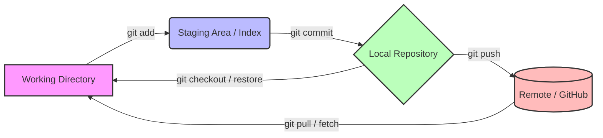
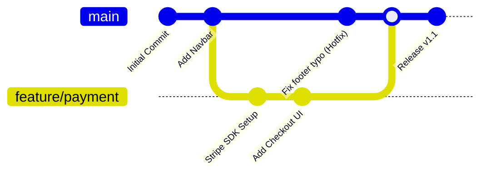
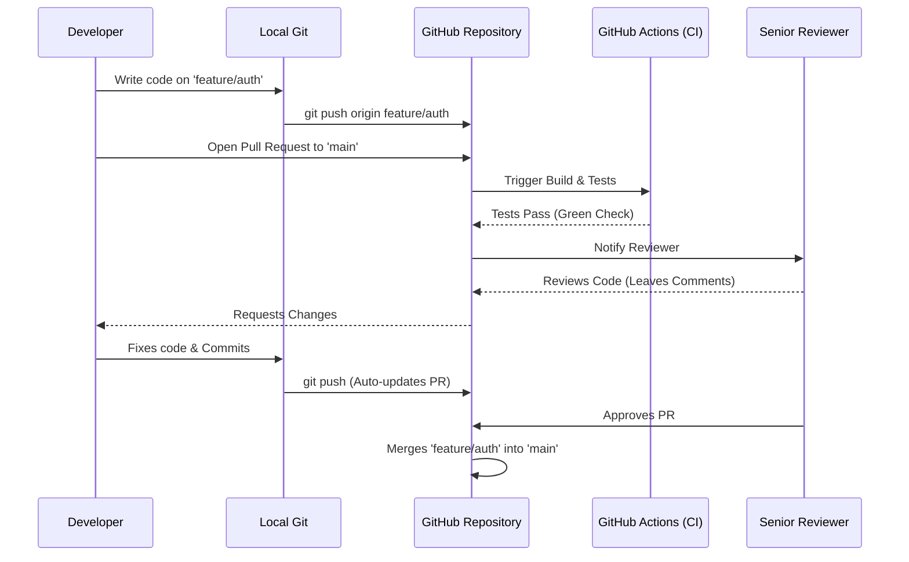

# Lecture 49 — Miscellaneous Topics: Git, GitHub, AI & Developer Productivity

**Course:** Full-Stack Web Development  
**Instructor:** Kyrillos Medhat  
**Duration:** 3 hours (Theory + Lab)

---

## 🧱 Prerequisites (What to know before starting)

Before diving into this final, overarching module, you should have the following foundational knowledge and tools ready:
- **A Functioning Development Environment:** Node.js installed, .NET SDK installed (if following the backend track), and a reliable code editor like Visual Studio Code (VS Code).
- **Command Line Basics:** Familiarity with opening a terminal (PowerShell on Windows, or Bash/Zsh on Mac/Linux) and executing basic text commands. You shouldn't be afraid of the blinking cursor.
- **A GitHub Account:** Created at github.com. Optionally configured with SSH keys for secure, password-less code pushes.
- **A Codebase to Track:** A basic HTML/CSS/JS project, or the Angular/.NET enterprise project from previous lectures, that you can use as a sandbox for Git experiments.
- **An AI Assistant Account:** Access to ChatGPT (OpenAI), Claude (Anthropic), or an IDE extension like GitHub Copilot to actively participate in the AI productivity labs.

---

## 🎯 Objectives & Agenda

### 🎯 Learning Objectives
By the end of this intensive session, you will be able to:
- **Master Version Control Internals:** Understand exactly how Git tracks changes via SHA-1 hashes, blobs, and trees to confidently manipulate history.
- **Collaborate Flawlessly:** Implement professional GitHub workflows, including Branching strategies, Pull Requests (PRs), code reviews, and issue tracking.
- **Automate with CI/CD & Hooks:** Set up GitHub Actions for continuous integration and Husky for pre-commit hooks.
- **Navigate Advanced Scenarios:** Confidently handle complex Git operations like merge conflicts, interactive rebasing, cherry-picking, stashing, and using `git bisect` to hunt down bugs.
- **Leverage AI Effectively:** Use tools like Copilot and Claude to write boilerplate, refactor legacy code, and debug esoteric errors using the Context-Task-Format prompt engineering framework.
- **Accelerate Your Workflow:** Optimize your daily productivity with terminal command mastery, modern CLI tools, and indispensable IDE keyboard shortcuts.
- **Prepare for the Future:** Understand the continuous learning path necessary to thrive as a senior software engineer in a rapidly evolving landscape.

### 📋 Agenda

**Part 1 — Version Control & Collaboration Theory (~90 minutes)**
1. Git Fundamentals: The Developer's Time Machine & Under the Hood
2. Branching & Merging: Navigating the Multiverse
3. Professional GitHub Workflows, Code Reviews & CI/CD Basics
4. Advanced Git: Rebase, Cherry-Pick, Stash, and Bisect

**Part 2 — AI & Productivity Theory (~45 minutes)**
5. AI-Assisted Development & Advanced Prompt Engineering
6. Terminal Mastery, Modern Tools & IDE Productivity

**Part 3 — Hands-On Practice (~45 minutes)**
7. Common Mistakes & How to Avoid Them
8. Developer Scenarios: Think Like an Engineer
9. Comprehensive Labs & Assignments
10. Interview Preparation, Cheat Sheet & Key Takeaways

---

## 1. Git Fundamentals: The Time Machine

Version control is the bedrock of modern software engineering. It is absolutely non-negotiable for a professional developer. Before Git, developers would zip files (`project_final`, `project_final_v2`, `project_final_FINAL_FOR_REAL.zip`). This is a nightmare for collaboration, tracking bugs, and scaling software.

Git is a **Distributed Version Control System (DVCS)** created by Linus Torvalds (the creator of Linux). It is essentially a time machine for your code. It allows you to take discrete snapshots of your project, meaning you can always travel back in time if a new feature breaks the application.

### Under the Hood: Blobs, Trees, and Commits
Git does not store files as "differences" or "deltas" like older systems (SVN). Git thinks of its data more like a mini file system of snapshots. Every time you commit, Git takes a picture of what all your files look like at that moment and stores a reference to that snapshot.

To be highly efficient, if files have not changed, Git doesn't store the file again, just a link to the previous identical file it has already stored.

- **Blobs:** Represent the content of your files.
- **Trees:** Represent directories (folders). A tree object contains pointers to blobs and other trees.
- **Commits:** A commit object points to the top-level tree object of your project. It also contains metadata: the author, a timestamp, a commit message, and a pointer to the parent commit(s).

Everything in Git is checksummed before it is stored and is then referred to by that checksum. Git uses a **SHA-1 hash** (a 40-character hex string, e.g., `24b9da6552252987aa493b52f8696cd6d3b00373`). This means it's impossible to change the contents of any file without Git knowing about it.

### The Three States of Git
Git tracks files across three primary states. Understanding this workflow is the key to mastering Git.



1. **Modified (Working Directory):** You have changed a file on your hard drive, but Git has not yet recorded the changes in its database. It's in an untracked or modified state.
2. **Staged (Staging Area / Index):** You have selected specific modified files and told Git, "Get these ready for the next snapshot." The staging area allows you to group related changes together.
3. **Committed (Repository):** The snapshot is officially sealed, hashed, and stored safely in your local Git database (the `.git` hidden folder).

### Before vs After: Commit Messages

A common hallmark of a junior developer is terrible commit messages. When working on a team, the Git history is documentation. It tells the story of how the application evolved.

**Before (Amateur Commits):**
```text
- fixed stuff
- updated
- oops forgot a semicolon
- IT WORKS FINALLY
- asdfghjkl
```

**After (Professional Conventional Commits):**
Professional teams use a standard format (Conventional Commits) to generate automatic changelogs, trigger CI/CD pipelines, and convey immediate meaning.

```text
- feat(auth): add JWT-based user login
- fix(cart): resolve negative total price calculation on checkout
- docs(readme): update environment variable setup instructions
- refactor(api): simplify database connection logic using Singleton pattern
- style(ui): format CSS to match new brand guidelines
- test(user): add unit tests for user registration flow
```

> [!TIP]
> **Why Staging Matters**  
> Why not just commit everything at once? Imagine you spent 4 hours fixing a bug in `auth.js` AND writing a completely unrelated new feature in `navbar.js`. You shouldn't commit them together. You should `git add auth.js`, commit it with a `fix:` message, and then `git add navbar.js`, committing it with a `feat:` message. Staging lets you craft precise, atomic, logical commits.

---

## 2. Branching & Merging: The Multiverse

### The Multiverse Analogy
Imagine the `main` (or `master`) branch is the official, stable timeline of your application—the one deployed to production. If you want to build an experimental, dangerous new feature (like swapping out your entire payment gateway) without risking the official timeline, you create a parallel universe called a **Branch**. 

In this branch, you can write code, make mistakes, and test freely. 
- If the experiment succeeds, you **merge** your universe back into the main timeline. 
- If it fails miserably, you simply delete the branch, and the `main` branch remains untouched and perfectly safe.



### Basic Branching Workflow
Modern Git uses `git switch` (a safer, more intuitive alternative to the older, overloaded `git checkout` command).

```bash
# Create a new branch and switch to it immediately
git switch -c feature/shopping-cart

# ... write code, git add, git commit ...

# Travel back to the main timeline
git switch main

# Bring the changes from the feature branch into main
git merge feature/shopping-cart
```

### Fast-Forward vs 3-Way Merge
- **Fast-Forward Merge:** If `main` has not had any new commits since you created your feature branch, Git simply moves the `main` pointer forward to match your feature branch. It's a straight line.
- **3-Way (Recursive) Merge:** If `main` has moved forward (someone else merged their PR while you were working), Git must create a new "Merge Commit" that ties the two diverging histories together based on three points: the two branch tips, and their common ancestor.

### The Inevitable Merge Conflict
If Developer A edits line 10 of `index.html` on `main`, and Developer B edits line 10 of `index.html` on their branch, Git doesn't know who is right when they try to merge. Git will not guess. This is a **Merge Conflict**.

**How to Resolve a Conflict:**
1. Git halts the merge process and tells you which files have conflicts. If you run `git status`, it will list them in red.
2. When you open the conflicting file in VS Code, Git has injected textual markers:
   ```html
   <<<<<<< HEAD (Current Change - main)
   <button class="btn btn-primary" onclick="submit()">Submit Order</button>
   =======
   <button class="btn btn-success" disabled>Complete Checkout</button>
   >>>>>>> feature/shopping-cart (Incoming Change)
   ```
3. You must act as the judge. VS Code provides convenient overlay buttons ("Accept Current Change", "Accept Incoming Change", "Accept Both"). Click the appropriate one, or manually edit the code to combine the logic perfectly.
4. Save the file, run `git add <file>`, and run `git commit` (without typing a message, Git will auto-generate a merge message) to seal the resolution.

---

## 3. Professional GitHub Workflows & CI/CD

Git is the local software running on your computer. **GitHub** is the cloud platform (owned by Microsoft) where you host, share, and collaborate on Git repositories.

### The Pull Request (PR) Lifecycle

In a professional enterprise environment, you **never** run `git merge feature_branch` into `main` locally and push it. `main` is heavily protected by server rules. Instead, you use a **Pull Request (PR)**.



1. **Push:** You finish your feature locally and push the branch to the cloud: `git push origin feature/login`
2. **Open PR:** On GitHub, you open a Pull Request. This is a formal request saying, "Please pull my code into the main codebase."
3. **Automated Checks (CI):** A CI server runs your unit tests and linters. If they fail, the PR is blocked from merging.
4. **Code Review:** Your teammates analyze your code line-by-line. They look for bugs, performance issues, and architectural flaws.
5. **Iterate:** If they request changes, you make them locally, commit, and push again. The PR updates automatically.
6. **Merge:** Once you receive an Approval and the CI is green, a maintainer clicks the "Squash and Merge" button.

> [!IMPORTANT]
> **Code Review Etiquette**  
> When reviewing someone else's code, be kind but uncompromising on quality. Attack the code, not the coder. Instead of saying *"This loop is stupid"*, say *"I noticed this loop has O(N^2) complexity. Could we optimize this using a Map to achieve O(N) performance?"* Provide actionable feedback.

### CI/CD Basics: GitHub Actions
Continuous Integration (CI) is the practice of automatically building and testing your code every time you push. Continuous Deployment (CD) automatically pushes merged code to production servers (like AWS or Azure).

Here is what a basic GitHub Actions YAML file (`.github/workflows/ci.yml`) looks like for a Node.js project:

```yaml
name: Node.js CI

on:
  push:
    branches: [ "main" ]
  pull_request:
    branches: [ "main" ]

jobs:
  build:
    runs-on: ubuntu-latest

    steps:
    - uses: actions/checkout@v4
    - name: Use Node.js 20.x
      uses: actions/setup-node@v4
      with:
        node-version: '20.x'
        cache: 'npm'
    - run: npm ci
    - run: npm run build --if-present
    - run: npm test
```
If `npm test` fails, GitHub blocks the PR. This guarantees that broken code never reaches `main`.

### Git Hooks & Husky
You can intercept Git commands before they execute. For example, a `pre-commit` hook runs a script right before Git finalizes a commit. 

Modern JavaScript projects use a tool called **Husky** to enforce rules. You can configure Husky to run `npm run lint` and `npm test`. If your code has syntax errors or failing tests, Husky will abort the commit. This prevents bad code from ever being saved to your local history, let alone pushed to GitHub.

---

## 4. Advanced Git: Rebase, Cherry-Pick, Stash, and Bisect

Once you master branching and committing, you must level up to advanced repository manipulation.

### Rebase vs Merge
When integrating a feature branch into `main`, you have two choices:

- **Merging:** Takes the two branches and creates a brand new "Merge Commit" tying them together. It preserves the exact history of what happened and when, but in a highly active repository, it creates a messy, spider-web history known as "Merge Hell."
- **Rebasing:** Takes your feature branch, temporarily sets it aside, downloads the latest `main`, and then *replays* your feature commits one-by-one on top of the new `main`. It rewrites history to look like you wrote your feature today, on top of the freshest code.

**Before vs After: Branch History**

*Using Merge:*
```text
*   e4r5t6 (main) Merge branch 'feature'
|\  
| * a1b2c3 (feature) Add API
* | 9x8y7z (main) Update docs
| * 4d5e6f (feature) Setup DB
|/  
*   1a2b3c Initial Commit
```

*Using Rebase (Linear History):*
```text
* a1b2c3 (feature) Add API (Rebased)
* 4d5e6f (feature) Setup DB (Rebased)
* 9x8y7z (main) Update docs
* 1a2b3c Initial Commit
```

> [!CAUTION]  
> **The Golden Rule of Rebasing**  
> *Never* rebase commits that have already been pushed to GitHub and shared with other developers. Only rebase your local, private, un-pushed branches. Rebasing changes cryptographic hashes. If you rewrite history that a coworker has already downloaded, you will violently break their local repository!

### Git Stash: Quick Context Switching
Scenario: You are halfway through writing a complex feature, and your boss tells you there is a critical bug on `main` that needs an immediate hotfix. You can't commit your half-broken code, but you need to switch branches.

**Solution:** `git stash`
```bash
git stash             # Takes all uncommitted changes and saves them in a hidden clipboard
git switch main       # Safely switch branches
# ... fix the bug, commit, push ...
git switch feature-branch
git stash pop         # Pastes the uncommitted changes back into your working directory
```

### Git Cherry-Pick
Imagine Developer A wrote a branch with 10 commits. You don't want the whole branch, but Commit #4 contains a brilliant CSS animation you need right now on your branch.
```bash
git cherry-pick <commit-hash>
```
This copies that exact commit and applies it as a new commit on your current branch.

### Git Bisect: The Bug Hunter
You discover a bug on `main`, but it wasn't there last week. 50 commits have happened since then. You don't know which commit introduced the bug. You can use binary search to find it!

```bash
git bisect start
git bisect bad          # Tell Git the current commit is broken
git bisect good a1b2c3  # Tell Git a past commit hash where things worked
```
Git will checkout a commit exactly halfway between. You test the app.
If it's broken, type `git bisect bad`. If it works, type `git bisect good`. Git halves the commits again. In exactly 5 or 6 steps, Git will point directly to the exact commit that caused the bug, allowing you to instantly find the offending code and author.

---

## 5. AI-Assisted Development & Advanced Prompt Engineering

Artificial Intelligence (GitHub Copilot, ChatGPT, Claude 3.5 Sonnet, GPT-4o) has fundamentally altered software development. 

**Will AI replace you?** No. AI will replace developers who *don't* use AI. As a developer, your job is not to type code; your job is to solve business problems. AI types the code. You architect the solution, review the output, and ensure it fits the enterprise ecosystem safely.

### How AI Changes the Daily Workflow
- **Less Boilerplate:** AI generates the tedious setup (e.g., creating a 10-field HTML form with corresponding CSS classes and state management).
- **Rapid Unblocking:** Paste an obscure 50-line C# stack trace into AI instead of scouring Stack Overflow for hours.
- **Automated Unit Testing:** Provide a function to an AI and ask it to write edge-case unit tests. It is phenomenally good at finding null-reference exceptions you forgot to handle.
- **Explaining Legacy Code:** Paste a 500-line spaghetti JavaScript file written by an employee who left 5 years ago, and ask the AI to summarize its purpose and identify anti-patterns.

### Advanced Prompt Engineering (The CTF Framework)
Getting production-ready code requires writing highly specific prompts. The best framework is **Context, Task, Format (CTF)**.

#### Scenario 1: Generating Business Logic
**Before (Lazy Prompt):**
> *"Write a shopping cart function."*
*(Result: The AI gives you a random Python script using outdated paradigms, completely ignoring your tech stack).*

**After (Professional CTF Prompt):**
> **Context:** *"I am building a scalable e-commerce application using Angular 18 and NgRx SignalStore. I have a TypeScript interface `Product { id: string, name: string, price: number, stock: number }`."*
> **Task:** *"Write a standalone CartService that handles adding items, removing items, and calculating the total price including a dynamic 8% tax rate. Ensure it handles the edge case where an item's stock is 0, throwing a custom error."*
> **Format:** *"Provide only the strict TypeScript code using the modern `inject()` syntax. Include JSDoc comments for the public methods. Do not include HTML. Output as a single markdown code block."*

#### Scenario 2: Refactoring Legacy Code
**Prompt:**
> *"Here is a massive, nested callback function (Callback Hell) written in ES5 JavaScript. Convert it to modern ES2022 syntax using `async/await`. Use `Promise.all()` where network requests are independent to optimize speed. Add a `try/catch` block that logs errors to a hypothetical `LoggerService`."*

#### Scenario 3: The Regex Nightmare
Regular Expressions are notoriously hard to read. AI makes them trivial.
**Prompt:**
> *"I need a Regular Expression in JavaScript to validate an Egyptian phone number. It must start with '+20' or '0', followed by '10', '11', '12', or '15', and exactly 8 digits after that. Do not match if there are trailing characters. Explain the regex breakdown step-by-step."*

### Security and Hallucinations
> [!WARNING]  
> **When NOT to trust AI blindly:**
> 1. **Security & Cryptography:** AI will confidently generate obsolete hashing algorithms (like MD5 or SHA-1) or insecure JWT implementations. Always rely on official, modern documentation (like OWASP) for security.
> 2. **Enterprise Business Rules:** AI doesn't know how your specific company calculates shipping discounts or handles legacy database migrations. It will guess, and it will be wrong.
> 3. **Library Versions:** AI is trained on older data. It might suggest a React or Angular library that was deprecated two years ago.
> 
> **The Ultimate Rule:** If you do not understand the generated code well enough to fix it when it inevitably breaks in production on a Friday night at 2 AM, **do not commit it to your project.**

---

## 6. Developer Productivity & Terminal Mastery

A professional developer's speed is heavily bottlenecked by their reliance on the mouse. Moving your hand from the keyboard to the mouse, dragging, clicking, and moving back takes seconds. Seconds compound into hours over a year. Keeping your hands on the keyboard makes you significantly faster.

### Terminal Mastery (CLI)
You should be able to navigate your entire computer, manipulate files, and run scripts without ever opening File Explorer or Finder.

| Action | Command (Mac/Linux/Bash) | Command (Windows PowerShell) |
|--------|--------------------------|------------------------------|
| Print Current Path | `pwd` | `pwd` (or `Get-Location`) |
| List Directory Contents | `ls -la` (shows hidden) | `ls -Force` |
| Change Directory | `cd folder_name` | `cd folder_name` |
| Go Up One Level | `cd ..` | `cd ..` |
| Make a Directory | `mkdir new_folder` | `mkdir new_folder` |
| Create a File | `touch file.txt` | `ni file.txt` (New-Item) |
| Print File Content | `cat file.txt` | `cat file.txt` |
| Delete a File | `rm file.txt` | `rm file.txt` |
| Delete Folder (Recursive)| `rm -rf folder_name` | `rm -r -Force folder_name` |
| Find Text in Files | `grep -r "search" .` | `Select-String -Path .\* -Pattern "search"` |

> [!TIP]
> **Modern CLI Upgrades**  
> Senior developers often replace standard terminal commands with modern, Rust-based alternatives for speed and better visuals:
> - Replace `cat` with `bat` (adds syntax highlighting).
> - Replace `cd` with `zoxide` (smart, fast directory jumping).
> - Replace `grep` with `rg` (Ripgrep, insanely fast searching).
> - Replace `ls` with `eza` (adds icons and better colors).

### VS Code Essential Keyboard Shortcuts
Memorize these to fly through your codebase. Force yourself to use them until it becomes muscle memory.

- **Quick Open File:** `Ctrl + P` (Windows) / `Cmd + P` (Mac) -> Type part of the file name and hit enter. Never use the file tree again.
- **Global Search:** `Ctrl + Shift + F` / `Cmd + Shift + F` -> Search for a variable, class, or text string across the entire project instantly.
- **Command Palette:** `Ctrl + Shift + P` / `Cmd + Shift + P` -> Access every VS Code feature, setting, and extension command.
- **Multiple Cursors (Magic!):** Highlight a word, press `Ctrl + D` / `Cmd + D`. It will select the next identical word. You now have multiple cursors, allowing you to edit 5 variables at exactly the same time.
- **Move Line:** `Alt + Up/Down Arrow` -> Moves the current line of code (or highlighted block) up or down without needing to cut and paste.
- **Duplicate Line:** `Shift + Alt + Down Arrow` -> Instantly copies the line downwards.
- **Go to Definition:** `F12` -> Jumps to where a function or class is defined.

---

## 7. ⚠️ Common Mistakes & How to Avoid Them

| Category | Common Mistake | The Consequence | How to Avoid It (Best Practice) |
|----------|----------------|-----------------|---------------------------------|
| **Git** | Committing directly to `main` without branching. | Code breaks in production; impossible to isolate the faulty feature; bypasses code review. | Always create a `feature/` or `bugfix/` branch. Use PRs to merge into `main`. |
| **Git** | Forgetting to add `.gitignore`. | Committing `node_modules` (500MB) or `.env` files with live database passwords to GitHub. | Always generate a standard `.gitignore` for your tech stack before your first commit. If a secret is leaked, rotate the key on the server immediately. |
| **Git** | Running `git rebase` on a shared branch. | Modifies commit hashes, breaking the local repositories of every other developer on the team causing massive chaos. | **Golden Rule:** Never rebase a branch that exists on the remote (GitHub). Only rebase local, unpushed work. |
| **Git** | "Commit all" without reviewing. | Accidentally committing console.logs, debugger statements, or experimental hacks. | Use `git diff` before adding, or use VS Code's Source Control tab to review exactly which lines you are staging. |
| **AI** | Copy-pasting AI code without reading it. | Introducing subtle logic bugs, security vulnerabilities, or deprecated library calls. | Read line-by-line. Ask the AI to explain parts you don't understand. Write unit tests to verify behavior. |
| **Terminal**| Typing out long paths manually. | Typos, wasted time, frustration. | Use the **TAB** key! Terminal auto-completion is your best friend. Type `cd Do` and press `TAB` to get `cd Documents/`. |

---

## 8. 🧠 Think Like a Developer (Real-World Scenarios)

### Scenario 1: The "Detached HEAD" Panic
**The Situation:** You wanted to look at an old version of your code, so you ran `git checkout a1b2c3` (an old commit hash). Git gave you a scary warning about a "Detached HEAD". You made some code changes to fix a bug, ran commit, and then switched back to `main`. Your new commits completely disappeared!
**The Developer Thought Process:** "Detached HEAD simply means my Git pointer is looking at a specific snapshot in time in the past, not at a branch tip. I cannot permanently save changes to the past unless I create an alternate timeline (a branch) diverging from that point. When I switched back to `main`, those floating commits were orphaned."
**The Fix:** If you want to make changes from that past state, run `git switch -c new-branch-from-past`. If you already orphaned commits, check `git reflog` (the ultimate safety net that tracks every movement of HEAD) to find the lost commit hash and cherry-pick it.

### Scenario 2: The Massive Merge Conflict
**The Situation:** You've been working on a massive UI overhaul branch for 3 weeks without updating it from `main`. You finally run `git merge main` and get merge conflicts in 45 different files. Your heart sinks.
**The Developer Thought Process:** "I made a critical workflow error. Branches should be short-lived. By letting this age for 3 weeks, `main` evolved drastically without me. Resolving this manually will take hours and I will likely break core logic."
**The Fix (and Prevention):** For now, sit down with the developers who wrote the incoming changes and resolve them together carefully. For the future: **Pull frequently.** Every morning, run `git fetch` and merge/rebase `main` into your feature branch. Handle 1 small conflict daily instead of 45 massive conflicts at the end of the month.

### Scenario 3: Accidental Secret Leak
**The Situation:** You committed a file called `aws-keys.json` to GitHub. You quickly make a new commit deleting the file and push it. 
**The Developer Thought Process:** "Deleting the file in a new commit does not remove it from the Git history! Anyone can look at the previous commit and extract the keys. Bots scrape GitHub 24/7 for exposed keys."
**The Fix:** 
1. **Invalidate the keys immediately.** Go to AWS and delete the leaked keys. Consider them compromised.
2. If you absolutely must remove them from history, use a tool like `git filter-repo` or BFG Repo-Cleaner to rewrite history, and then `git push --force`. But remember, invalidating the key is the only true fix.

---

## 9. 🔬 Comprehensive Labs & Assignments

### Lab 1: Local Git Mastery & Stashing (45 Mins)
1. Open your terminal, create a new directory `git-lab`, and run `git init`.
2. Create an `index.html` with basic boilerplate. Commit it with the message `feat: initial html layout`.
3. Create a branch named `feature/hero-section` and switch to it.
4. Add a `<div class="hero">Hello World</div>` to the HTML, save, but **DO NOT COMMIT**.
5. Simulate an emergency: Your boss tells you `main` is broken. 
6. Run `git stash` to hide your hero section work.
7. Switch back to `main`. Create a `bugfix/hotfix` branch.
8. Add a `<script>` tag to the `<head>`, save, commit, and merge it into `main`.
9. Switch back to `feature/hero-section`.
10. Run `git stash pop` to bring your half-finished work back. Finish it, commit, and merge it into `main`. 

### Lab 2: Collaborative PR Simulation (60 Mins)
*(Grab a partner for this, or use two different GitHub accounts/browsers).*
1. Developer A: Create a public GitHub repository. Add Developer B as a collaborator in the repository settings.
2. Developer B: Clone the repo to your local machine.
3. Developer B: Create a branch `feat/styling`. Add a CSS file, commit, and push the branch to GitHub.
4. Developer B: Go to GitHub and open a Pull Request against `main`.
5. Developer A: Review the PR. Add a line comment requesting a change (e.g., "Make the background blue instead of red"). Do not approve.
6. Developer B: Make the change locally, commit, and run `git push`. Observe the PR update automatically without opening a new one.
7. Developer A: Approve the PR and click "Squash and Merge".
8. Both Developers: Run `git pull` on `main` to synchronize local environments.

### Lab 3: AI Pair Programming & Refactoring (30 Mins)
1. Create a JavaScript file containing a slow, nested `for-loop` that searches for duplicate numbers in a massive array (O(N^2) complexity).
2. Open ChatGPT or Claude.
3. Use the CTF Prompting Strategy: *"I am building a high-performance Node.js data processing script. The following function is too slow because of its O(N^2) time complexity. Refactor this to be O(N) using modern ES6+ features like the `Set` object or `Map`. Maintain the exact same input/output signature. Add JSDoc comments explaining the optimization."*
4. Evaluate the response. Did it correctly implement a `Set`? Copy the code back into your editor and write a quick test to prove it works.

### Lab 4: Setting up a Linter Hook (Optional/Advanced)
1. In a Node project, run `npm install husky --save-dev`.
2. Run `npx husky init`. This creates a `.husky` folder.
3. Edit the `pre-commit` file in that folder to run `npm run lint`.
4. Intentionally write badly formatted code, stage it, and try to commit. Watch Husky block the commit! Fix the code, and try again.

---

## 10. 💼 Interview Preparation

If you are interviewing for a software engineering role, version control is guaranteed to come up. Memorize these concepts.

**Q1: What is the difference between `git pull` and `git fetch`?**
> **Answer:** `git fetch` reaches out to the remote server (GitHub) and downloads the latest metadata and commit history, but it *does not* touch your working directory files. It is perfectly safe. `git pull` is a combination command: it runs `git fetch` followed immediately by `git merge`. It downloads the data and attempts to automatically merge it into your current working files, which might cause immediate merge conflicts.

**Q2: How do you fix a commit if you forgot to include a file, but haven't pushed yet?**
> **Answer:** I would stage the forgotten file using `git add missed-file.js` and then run `git commit --amend --no-edit`. This opens the previous commit, injects the new file into it, and seals it again without changing the commit message.

**Q3: Describe a situation where you would use `git rebase` instead of `git merge`.**
> **Answer:** I use `git merge` when bringing a completed feature into the main branch, as it preserves historical context and shows exactly when branches diverged and joined. I use `git rebase` when I am working on my private feature branch and need to sync up with the latest changes from `main`. Rebasing my feature branch on top of `main` keeps my history strictly linear and avoids cluttering the graph with meaningless "merge main into feature" commits. However, I never rebase a branch that has already been shared publicly.

**Q4: How do you leverage AI tools like Copilot in your workflow while ensuring code quality?**
> **Answer:** I treat AI as a junior pair programmer. I use it to generate boilerplate, write complex Regular Expressions, and draft edge-case unit tests to increase my velocity. However, I never commit code generated by AI that I don't fully understand. I always manually review its suggestions for security vulnerabilities and ensure it aligns with the broader architecture and design patterns of our enterprise system.

**Q5: What is a detached HEAD state and how do you escape it?**
> **Answer:** HEAD is a pointer that usually points to the name of the branch you are on. When you checkout a specific commit hash (e.g., `git checkout a1b2c3`) instead of a branch name, HEAD detaches from the branch and points directly to the commit. You are now in a detached HEAD state. To escape, you simply switch back to a branch using `git switch main`, or if you want to keep the changes made in that state, create a new branch from there using `git switch -c new-branch`.

---

## 11. 📜 Ultimate Cheat Sheet

### Git CLI Essentials
| Command | Action |
|---------|--------|
| `git clone <url>` | Download a repository from GitHub to your machine |
| `git init` | Initialize a new local repository |
| `git status` | Check current branch, modified files, and staged files |
| `git add .` | Stage ALL modified and new files in the directory |
| `git commit -m "msg"`| Snapshot staged changes with a message |
| `git commit --amend` | Edit the last un-pushed commit |
| `git log --oneline` | View compact commit history |
| `git restore <file>` | Discard uncommitted changes in a specific file |
| `git branch -d <name>`| Delete a branch locally (fails if unmerged) |
| `git branch -D <name>`| Force delete a branch |
| `git switch <name>` | Move to an existing branch |
| `git switch -c <name>`| Create and move to a new branch |
| `git reset --soft HEAD~1`| Undo the last commit, but keep the files staged |
| `git reset --hard` | **DANGER:** Wipe out all uncommitted changes entirely |
| `git clean -fd` | Remove completely untracked files and folders |
| `git reflog` | View the hidden history of all HEAD movements (the ultimate undo) |

### GitHub CLI (Optional but powerful)
| Command | Action |
|---------|--------|
| `gh pr create` | Open a Pull Request straight from the terminal without using the browser |
| `gh pr checkout <id>`| Checkout another developer's PR branch locally to test it |
| `gh repo view --web` | Instantly open the current repo in your default web browser |
| `gh issue list` | View open issues assigned to you |

---

## 📌 Key Takeaways & Resources

### Key Takeaways
- **Git is your safety net.** Commit often, commit atomic logical changes, and write meaningful conventional commit messages.
- **Branches are cheap and disposable.** Use them for every new task to isolate experimental code from the stable `main` codebase.
- **GitHub PRs are for quality control.** They enforce code reviews, trigger automated tests (CI/CD), and distribute knowledge across the engineering team.
- **Rebase locally, Merge remotely.** Maintain a clean history for yourself, but never rewrite public history that others rely on.
- **AI is an exoskeleton, not an autopilot.** It amplifies your abilities but requires your strict architectural direction and critical oversight. Never trust it blindly.
- **The keyboard is faster than the mouse.** Invest time in learning terminal commands and IDE shortcuts; it will pay massive dividends over your career.

### Recommended Resources
- [Pro Git Book (Free, The Ultimate Authority)](https://git-scm.com/book/en/v2)
- [Learn Git Branching (Interactive Visualizer Game)](https://learngitbranching.js.org/)
- [Conventional Commits Specification](https://www.conventionalcommits.org/)
- [Anthropic Prompt Engineering Interactive Tutorial](https://github.com/anthropics/courses)
- [Husky Documentation (Git Hooks)](https://typicode.github.io/husky/)
- [GitHub Actions Documentation](https://docs.github.com/en/actions)

---

## 🎉 The End of the Journey

**You have officially reached the end of the Full-Stack Web Development Course!**

Take a moment to reflect on the monumental mountain you just climbed. You started by writing raw HTML tags and fighting with CSS flexbox. You advanced through the DOM with vanilla JavaScript, grasped the complexities of C# Object-Oriented Programming, modeled complex relational databases with Entity Framework Core, constructed robust enterprise-grade ASP.NET Web APIs utilizing CQRS and MediatR, and finally tied it all together with a massive, reactive, component-driven Angular frontend. 

You haven't just passively attended lectures—you have **built** real software. You now understand the full lifecycle of a web request: from a user clicking a button in the browser, down through the internet, into a reverse proxy, through your API controllers, into your business logic service layer, and finally persisting safely in a SQL database.

### Where Do You Go From Here?
The specific technology stack you learned will inevitably change over time. Frameworks die, and new ones are born. React might be replaced, .NET will release new versions, and CSS will get new layout engines. 

However, the fundamental concepts you have mastered here—**computational problem-solving, architectural design patterns, state management, HTTP communication, API design, debugging, and version control**—will never expire. 

Your next steps to solidify your career:
1. **Build a Portfolio:** Stop following tutorials. Tutorial hell is real. Build 2 or 3 massive, original projects that solve real problems. Deploy them.
2. **Learn System Design & Cloud Architecture:** Explore AWS (Amazon Web Services) or Azure. Learn how to deploy your APIs to the cloud using Docker containers and Kubernetes.
3. **Explore CI/CD:** Automate your testing and deployment pipelines using GitHub Actions so you can deploy with a single click.
4. **Contribute to Open Source:** Find a library you use, check the "Good First Issue" tags on GitHub, and open your first PR.

Keep building, keep breaking things (on your own isolated branches!), stay curious, and welcome to the software engineering industry. You are ready.
