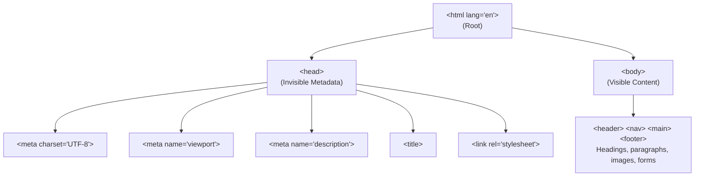
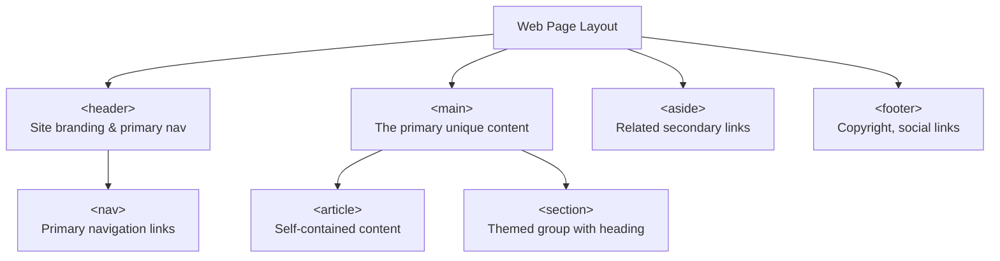

# Lecture 02 — Introduction to Web Development & HTML5 Basics

**Course:** Full-Stack Web Development  
**Instructor:** Kyrillos Medhat  
**Duration:** 3 hours (Theory + Lab)

---

## 📋 Prerequisites

> Before starting this lecture, make sure you have:
> - ✅ Completed Lecture 01
> - ✅ VS Code installed with the **Live Server**, **Prettier**, and **Material Icon Theme** extensions
> - ✅ A dedicated course folder on your computer to save your HTML files
> - ✅ A modern web browser (Google Chrome or Microsoft Edge recommended)

---

## 🎯 Learning Objectives

By the end of this lecture, you will be able to:
- Understand what HTML is and why it exists
- Write a complete, valid HTML5 document from scratch
- Use semantic elements to give meaning and structure to your content
- Apply the most common HTML tags: headings, paragraphs, lists, links, images
- Understand the difference between block and inline elements
- Use VS Code with Emmet to write HTML quickly
- Begin building your personal developer portfolio

---

## 📋 Agenda

### Part 1 — Theory (~90 minutes)
1. What is HTML? Why does it exist?
2. The HTML5 Document Structure (Boilerplate)
3. Semantic Elements — the HTML5 Revolution
4. The Most Important HTML Tags
5. Block vs Inline Elements
6. Links, Images & File Paths

### Part 2 — Practice & Lab (~90–120 minutes)
1. Personal Profile Page (semantic HTML5)
2. Inspect and Modify DOM with DevTools
3. Multi-section Resume Page
4. Portfolio Project Part 1

---

## 1. What is HTML? Why Does It Exist?

### Plain-English Introduction

Imagine you've written a book and you want to tell the printer:
- "This line is the title — make it big"
- "These three sentences form a paragraph"
- "This is a bullet-point list"
- "This word is a link to another page"

In print, you'd use formatting marks or instructions. On the web, we use **HTML (HyperText Markup Language)** — a system of text labels called **tags** that tell the browser what each piece of content *is*.

HTML is **not** a programming language — it doesn't do calculations or make decisions. It simply **describes the structure and content** of a document. Think of it as the **architect's blueprint**: it defines what rooms exist and what goes in them, but doesn't decide the paint colour (CSS) or the lighting automation (JavaScript).

**Analogy:** A house blueprint shows where walls, doors, and windows go — it doesn't choose the wallpaper or install smart lights. HTML is the blueprint.

### Why "HyperText"?

The "Hyper" in HyperText refers to **links** — the ability to click a word on one document and instantly jump to another document anywhere in the world. This was revolutionary in 1991 and remains the core feature of the web today.

### A Brief History

| Year | Milestone |
|------|-----------|
| 1991 | Tim Berners-Lee invents HTML to share scientific documents |
| 1999 | HTML 4 standardises the web |
| 2008–2014 | HTML5 developed — adds video, audio, forms, semantic elements |
| Today | HTML5 is the living standard, continuously updated |

### 📌 Section Recap
- HTML = HyperText Markup Language — describes structure and content, not appearance
- Tags are labels telling the browser what each piece of content is
- HTML is the blueprint; CSS is the interior design; JavaScript is the automation
- "HyperText" = the ability to link documents together

---

## 2. The HTML5 Document Structure (Boilerplate)

### Plain-English Introduction

Every single HTML page on the web follows the same basic skeleton. It's like a legal document — it must follow a specific format to be valid. Once you understand this structure, it becomes second nature.

Here is the complete HTML5 boilerplate with a comment explaining every single line:

```html
<!DOCTYPE html>
<!-- This MUST be the very first line of every HTML file.                      -->
<!-- It tells the browser: "Render this page using modern HTML5 standards."    -->
<!-- Without it, browsers enter "quirks mode" — inconsistent, buggy rendering. -->

<html lang="en">
<!-- The ROOT element — everything else in the page lives inside here.         -->
<!-- lang="en" declares the page language as English.                          -->
<!--   Why this matters:                                                       -->
<!--   • Screen readers choose the correct text-to-speech voice                -->
<!--   • Search engines serve results in the right language                    -->

  <head>
    <!-- The <head> contains METADATA — information ABOUT the page.            -->
    <!-- Nothing inside <head> is VISIBLE to the user on screen.               -->

    <meta charset="UTF-8">
    <!-- Defines the character encoding — how the browser interprets text.     -->
    <!-- UTF-8 is universal and supports EVERY human writing system:           -->
    <!-- Without this, special characters appear as garbled symbols: ’       -->

    <meta name="viewport" content="width=device-width, initial-scale=1.0">
    <!-- CRITICAL for mobile devices.                                           -->
    <!-- "width=device-width" = use the device's actual screen width           -->
    <!-- "initial-scale=1.0" = don't zoom in or out on page load               -->
    <!-- Without this: mobile browsers zoom way out, text becomes microscopic. -->

    <meta name="description" content="A page describing web development basics.">
    <!-- The SEO description — shown under the page title in Google results.   -->

    <title>My Portfolio | Alex Chen</title>
    <!-- Text shown in the browser tab.                                        -->

    <link rel="stylesheet" href="css/style.css">
    <!-- Links to an external CSS stylesheet.                                  -->

  </head>

  <body>
    <!-- Everything the user SEES on screen goes inside <body>.                -->
    <!-- All visible content lives here: text, images, forms, buttons, etc.   -->
    
    <!-- Your visible content goes here -->

  </body>
</html>
```

### The Head vs Body — Visual Summary



### The Emmet Shortcut

Instead of typing the entire boilerplate manually, use **Emmet** in VS Code:
1. Create a new `.html` file
2. Type `!` (just the exclamation mark)
3. Press `Tab`

VS Code generates the full HTML5 boilerplate instantly. Always use this shortcut!

### 📌 Section Recap
- Every HTML page starts with `<!DOCTYPE html>` — mandatory, always first
- `<html lang="en">` wraps everything — one per page
- `<head>` = invisible metadata; `<body>` = visible content
- The viewport meta tag is essential for mobile devices
- Use Emmet (`!` + Tab in VS Code) to generate the boilerplate instantly

---

## 3. Semantic Elements — The HTML5 Revolution

### Plain-English Introduction

Before HTML5, most web pages used `<div>` for everything:

```html
<div id="header">Logo & Nav</div>
<div id="content">Main stuff</div>
<div id="sidebar">Related links</div>
<div id="footer">Copyright</div>
```

A `<div>` is a generic, meaningless container. Labelling every box in your house "Box" is technically correct — but completely useless for finding anything.

HTML5 introduced **semantic elements**: tags with meaningful names that describe *what the content actually is*:

```html
<header>Logo & Nav</header>
<main>Main stuff</main>
<aside>Related links</aside>
<footer>Copyright</footer>
```

Now the structure **communicates its own meaning** — to browsers, screen readers, search engines, and other developers.

### Why Semantics Matter — 3 Big Reasons

**Reason 1 — Accessibility:**
Screen readers (used by visually impaired users) use semantic elements to navigate pages. A screen reader can announce "Navigation region" for `<nav>`, letting users skip straight to the menu. With `<div id="nav">`, it has no idea what anything means.

**Reason 2 — SEO:**
Google's crawlers read semantic HTML to understand your page's structure. Content inside `<article>` or `<main>` is weighted more heavily than content inside generic `<div>` tags.

**Reason 3 — Maintainability:**
Code is read far more often than it's written. `<article>` is instantly recognisable as a blog post or content card. `<aside>` is obviously a sidebar. `<section>` is clearly a themed group of content. Self-documenting code = less confusion.

### The Core Semantic Layout Elements



### Full Semantic Page Example with Comments

```html
<!DOCTYPE html>
<html lang="en">
<head>
  <meta charset="UTF-8">
  <meta name="viewport" content="width=device-width, initial-scale=1.0">
  <title>Alex Chen | Full-Stack Developer</title>
</head>
<body>

  <header>
    <!-- Site-wide header — appears on every page -->
    <h1>Alex Chen</h1>
    <nav>
      <!-- Primary navigation — the main menu of the site -->
      <ul>
        <li><a href="#about">About</a></li>
        <li><a href="#projects">Projects</a></li>
      </ul>
    </nav>
  </header>

  <main>
    <!-- The main content — unique to THIS page -->

    <section id="about">
      <!-- A themed section — always has a heading inside it -->
      <h2>About Me</h2>
      <p>I'm a full-stack developer passionate about building things for the web.</p>
    </section>

    <section id="projects">
      <h2>Projects</h2>

      <article>
        <!-- An <article> is self-contained — it makes sense on its own -->
        <h3>TaskFlow Dashboard</h3>
        <p>A dynamic task management app built with JavaScript.</p>
        <a href="https://github.com/alexchen/taskflow">View on GitHub</a>
      </article>

    </section>
  </main>

  <aside>
    <!-- Related but secondary content — sidebar, quick links -->
    <h2>Quick Links</h2>
    <ul>
      <li><a href="https://github.com/alexchen">GitHub</a></li>
    </ul>
  </aside>

  <footer>
    <!-- Site-wide footer -->
    <p>&copy; 2026 Alex Chen. All rights reserved.</p>
  </footer>

</body>
</html>
```

### 📌 Section Recap
- Semantic HTML describes *what* content is — for accessibility, SEO, and maintainability
- Core elements: `<header>`, `<nav>`, `<main>`, `<article>`, `<section>`, `<aside>`, `<footer>`
- Only ONE `<main>` per page; only ONE `<h1>` per page
- `<article>` = standalone content; `<section>` = themed group needing page context
- `<div>` = generic block container (no semantic meaning) — use as last resort

---

## 4. The Most Important HTML Tags

### Headings — The Page's Outline

```html
<h1>Main Page Title</h1>
<!-- Largest heading. ONE per page. Defines the page's main topic. -->

<h2>Major Section Heading</h2>
<!-- Direct children of h1 — the main sections of your page        -->

<h3>Subsection Heading</h3>
<!-- Sub-topics within a major section                             -->
```

> [!WARNING]
> **Never skip heading levels for visual styling purposes.** Don't jump from `<h1>` to `<h4>` just because you want a smaller font — that breaks screen reader navigation. Use CSS to control size. Always maintain the logical hierarchy: h1 → h2 → h3.

### Paragraphs and Text Emphasis

```html
<p>This is a paragraph. Each <p> tag automatically gets spacing above and below.</p>

<!-- strong = important text — semantic meaning: "this is critical!" -->
<p>Always use <strong>semantic HTML</strong> — it matters for accessibility.</p>

<!-- em = emphasised text — semantic meaning: "stress on this word" -->
<p>The function runs <em>asynchronously</em>, not synchronously.</p>

<!-- code = inline code snippet — monospace font -->
<p>Use the <code>console.log()</code> function to debug JavaScript.</p>
```

### Lists — Ordered and Unordered

```html
<!-- ul = unordered list (bullets) — use when ORDER doesn't matter -->
<ul>
  <li>HTML</li>       <!-- li = list item -->
  <li>CSS</li>
  <li>JavaScript</li>
</ul>

<!-- ol = ordered list (numbers) — use when ORDER matters -->
<ol>
  <li>Download VS Code</li>
  <li>Install the Live Server extension</li>
</ol>
```

### Links — The Core of the Web

```html
<!-- Basic link to an external website -->
<a href="https://developer.mozilla.org">MDN Web Docs</a>

<!-- External link opening in a new tab -->
<a href="https://github.com" target="_blank" rel="noopener noreferrer">
  My GitHub Profile
</a>
<!-- target="_blank" = open in a new browser tab                         -->
<!-- rel="noopener noreferrer" = security protection against tabnapping  -->
<!-- ALWAYS use rel="noopener noreferrer" with target="_blank"           -->

<!-- Anchor link — scrolls to a section on the SAME page -->
<a href="#projects">Jump to Projects</a>
<!-- The target: <section id="projects">...</section>                    -->
```

### Images

```html
<!-- Basic image -->

<!-- src = the path to the image file                                     -->
<!-- alt = alternative text — REQUIRED for every meaningful image        -->

<!-- Image with explicit dimensions (prevents layout shift) -->

<!-- Setting width and height reserves space before the image loads      -->
<!-- Prevents "Cumulative Layout Shift" (CLS) — a Google SEO ranking signal -->
```

> [!WARNING]
> **Never omit the `alt` attribute.** Missing `alt` is an accessibility failure — and potentially illegal in many countries for public-facing websites. If an image is decorative, use `alt=""` (empty string). Never just leave it out entirely.

### Generic Containers

```html
<!-- div = Division — BLOCK-level generic container -->
<!-- Use when no semantic element fits and you need to group block content -->
<div class="project-card">
  <h3>Project Title</h3>
  <p>Project description goes here.</p>
</div>

<!-- span = INLINE generic container -->
<!-- Use when no semantic element fits and you need to style inline text -->
<p>The error code is <span class="error-code">404</span> — not found.</p>
```

### HTML Entities — Special Characters

| Entity | Renders As | When to Use |
|--------|-----------|-------------|
| `&lt;` | `<` | Less-than sign in text |
| `&gt;` | `>` | Greater-than sign in text |
| `&amp;` | `&` | Ampersand in text |
| `&copy;` | © | Copyright symbol |
| `&nbsp;` | (non-breaking space) | Space that won't wrap |

### 📌 Section Recap
- Headings h1–h6 define the content outline — never skip levels
- `<strong>` (important) and `<em>` (emphasis) have semantic meaning
- Links need `href`; external links need `target="_blank" rel="noopener noreferrer"`
- Images need `alt` — always; empty `alt=""` only for purely decorative images

---

## 5. Block vs Inline Elements

### Plain-English Introduction

Every HTML element behaves as either **block-level** or **inline-level** by default. This determines how elements arrange themselves on the page — completely independently of any CSS.

**Block elements** are like paragraphs in a book: each one starts on a new line and takes up the full width of the page.
**Inline elements** are like words within a paragraph: they flow alongside the surrounding text without breaking to a new line.

### Examples

**Block elements** (new line, full width):
`<div>`, `<p>`, `<h1>`–`<h6>`, `<ul>`, `<ol>`, `<li>`, `<header>`, `<main>`, `<section>`

**Inline elements** (flow within text):
`<span>`, `<a>`, `<strong>`, `<em>`, ``, `<button>`

### Why This Matters

```html
<!-- Block elements stack vertically -->
<p>First paragraph</p>
<p>Second paragraph</p>

<!-- Inline elements flow within their container -->
<p>
  I know <strong>HTML</strong>, <em>CSS</em>, and
  <a href="#">JavaScript</a>.
</p>

<!-- ✅ VALID: inline elements inside block elements -->
<p>
  <strong>Important:</strong> Always use semantic HTML.
</p>

<!-- ❌ INVALID: block elements inside inline elements -->
<span>
  <p>This is wrong!</p>   <!-- Block inside inline — invalid -->
</span>
```

### 📌 Section Recap
- Block elements: start on new line, fill full width (`<div>`, `<p>`, `<h1>`–`<h6>`)
- Inline elements: flow within text, take only the space they need (`<span>`, `<a>`, `<strong>`)
- Inline elements **cannot** contain block elements

---

## 6. Links, Images & File Paths

### Understanding File Paths

When linking to a file or image within your own project, you use a **relative path** — the path relative to *where the current file lives*.

Think of it like giving directions:
- "It's in *this same folder*" → `filename.html`
- "It's in a *subfolder*" → `subfolder/filename.html`
- "It's *one level up*" → `../filename.html`
- "It's *two levels up*" → `../../filename.html`

```
Example project structure:
my-portfolio/
├── index.html            ← You are working in this file
├── css/
│   └── style.css
├── images/
│   └── avatar.jpg
└── pages/
    └── contact.html
```

```html
<!-- From index.html — paths to different locations: -->
<!-- File in a SUBFOLDER -->
<a href="pages/contact.html">Contact</a>

<link rel="stylesheet" href="css/style.css">

<!-- From pages/contact.html — going UP to parent folder: -->
<a href="../index.html">Back to Home</a>

```

> [!TIP]
> Use **relative paths** for files within your own project — they work no matter where you deploy the site. Use **absolute URLs** (`https://...`) only for resources hosted on external servers.

---

## 🧠 Think Like a Developer

### Scenario 1: Structuring a Blog Post
> You're writing the HTML for a blog post. It has a title, author details, the main text, and a sidebar with related posts.

**Decision:** Don't just use `<div>` tags (div soup). Think *semantically*. The entire post should be wrapped in an `<article>` tag because it's self-contained content. The title is the `<h1>`. The main text goes in `<p>` tags. The related posts sidebar belongs in an `<aside>`.

### Scenario 2: Debugging a Broken Image
> You added an image `` but the browser shows a broken image icon.

**Decision:** You don't rewrite the code immediately. First, check the path. Is the image actually inside an `images` folder? Did you spell `logo.png` correctly, with the exact casing? Are you running Live Server from the correct root folder? Finally, check the Network tab in DevTools to see the 404 error path.

### Scenario 3: Deciding Between a Button and a Link
> You need a clickable element that submits a form or performs an action (like "Add to Cart"), and another clickable element that takes the user to a new page (like "View Products").

**Decision:** If it goes to a new URL, use an anchor tag `<a>`. If it performs an action on the current page or submits a form, use a `<button>`. Never use an `<a>` tag for an action, and never use a `<button>` tag just to navigate. This is crucial for screen readers.

---

## ❌→✅ Before vs After

### 1. Page Layout
```html
<!-- ❌ Before: Meaningless divs (Div Soup) -->
<div class="header">
  <div class="nav">
    <a href="/">Home</a>
  </div>
</div>
<div class="main">
  <div class="post">
    <div class="title">My Blog Post</div>
  </div>
</div>

<!-- ✅ After: Semantic HTML5 -->
<header>
  <nav>
    <a href="/">Home</a>
  </nav>
</header>
<main>
  <article>
    <h1>My Blog Post</h1>
  </article>
</main>
```

### 2. Formatting Text
```html
<!-- ❌ Before: Using visual tags instead of semantic tags -->
<p>Please <b>read this carefully</b>.</p>

<!-- ✅ After: Using semantic tags for importance -->
<p>Please <strong>read this carefully</strong>.</p>
```

---

## ⚠️ Common Mistakes & How to Avoid Them

| ❌ Mistake | ✅ Fix |
|-----------|--------|
| Multiple `<main>` elements on one page | Only ONE `<main>` per page — it must be unique |
| Using `<section>` for every container | `<section>` is for themed groups with headings. Generic grouping? Use `<div>`. |
| Missing headings inside `<section>` | Every `<section>` should have a heading (`<h2>`, `<h3>`, etc.) |
| Using `<b>` for important text | Use `<strong>` — has semantic meaning (important) not just visual bold |
| Using `<i>` for emphasis | Use `<em>` — conveys stress emphasis to screen readers |
| Wrapping block elements in inline elements | Never put `<div>` or `<p>` inside `<span>` or `<a>` |
| Using `<br><br>` for vertical spacing | Use CSS `margin` or `padding` — `<br>` is only for meaningful line breaks |
| Missing quotes around attribute values | Always quote attributes: `href="..."` not `href=...` |
| `` | Never use system-absolute paths — use relative paths |

---

## 🧪 Practice Labs

### Lab 1: Personal Profile Page (30 min)

Build a personal profile page using semantic HTML5.

**Steps:**
1. Create `labs/lab1-profile.html`
2. Generate the boilerplate with Emmet (`!` + Tab)
3. Build this structure:
   - `<header>` with your name in `<h1>` and `<nav>` with anchor links
   - `<main>` containing:
     - `<section id="about">` with `<h2>` and a bio paragraph
     - `<section id="skills">` with `<h2>` and a `<ul>` of 5 skills
   - `<footer>` with copyright notice using `&copy;`
4. Add a placeholder image: ``
5. Open with Live Server and verify the structure looks correct

### Lab 2: Explore Browser DevTools (20 min)

**Steps:**
1. Open your Lab 1 page in Chrome/Edge
2. Press `F12` → go to the **Elements** tab
3. Find your `<h1>` element and double-click its text — change it live
4. Find your `<body>` tag → right-click → "Edit attribute" → add: `style="background-color: lightyellow;"`
5. Refresh the page — notice it resets (DevTools changes are temporary)
6. Go to the **Console** tab and type: `document.title = "I changed the title!"`
7. Notice the browser tab text changes

### Lab 3: Multi-Section Resume Page (40 min)

**Steps:**
1. Create `labs/lab3-resume.html`
2. Add the HTML5 boilerplate
3. Build sections with semantic HTML:
   - `<header>` with name, job title, and contact links
   - `<main>` with:
     - `<section id="education">` — `<ol>` of your education
     - `<section id="experience">` — `<article>` elements for each role
     - `<section id="skills">` — `<ul>` of skills
4. Add `<nav>` with anchor links pointing to each section's `id` (e.g. `<a href="#skills">`)
5. Test clicking the nav links — they should scroll to each section

---

## 📝 Assignment: Portfolio Project — Part 1

### Overview

We are building a complete professional developer portfolio over 8 lectures. Today: the **semantic HTML skeleton** — structure only, no CSS.

### Requirements

1. Create the folder structure:
   ```
   portfolio/
   └── index.html
   ```

2. Add the full HTML5 boilerplate.

3. Inside `<body>`, build this structure:

   **`<header>`**:
   - Your name in `<h1>`
   - `<nav>` with anchor links to: `#about`, `#skills`, `#projects`, `#contact`

   **`<main>`**:
   - `<section id="home">` — Hero section with `<h2>` catchy headline + short paragraph
   - `<section id="about">` — `<h2>` + 2–3 paragraphs about yourself
   - `<section id="skills">` — `<h2>` + `<ul>` of technologies you'll learn
   - `<section id="projects">` — `<h2>` + placeholder paragraph
   - `<section id="contact">` — `<h2>` + `mailto:` link and GitHub link

   **`<footer>`**:
   - `<p>&copy; 2026 Your Name</p>`

4. ✅ **No CSS at all** — pure semantic skeleton only
5. ✅ Validate at [validator.w3.org](https://validator.w3.org/) — fix every error before submitting

### Optional Bonus

1. Add `target="_blank" rel="noopener noreferrer"` to all external links
2. Use the `<time>` element for the year:
   ```html
   <p>&copy; <time datetime="2026">2026</time> Your Name</p>
   ```
3. Add a headshot: ``

---

## 💼 Interview Prep

**Q1: What is semantic HTML and why is it important?**
> Semantic HTML refers to tags that convey meaning about the content they enclose, rather than just presentation (e.g. `<article>`, `<header>` instead of `<div>`). It is crucial for three reasons: Accessibility (screen readers rely on it), SEO (search engines use it to understand page structure), and Maintainability (makes code easier for humans to read).

**Q2: What is the purpose of the `alt` attribute on an `` tag?**
> The `alt` attribute provides alternative text if the image fails to load, and it is read aloud by screen readers for visually impaired users. It is essential for accessibility. If an image is purely decorative, you must still include the attribute, but leave it empty: `alt=""`.

**Q3: Explain the difference between block and inline elements.**
> A block element (like `<div>` or `<p>`) starts on a new line and takes up the full width available to it. An inline element (like `<span>` or `<a>`) flows within the text content and only takes up as much width as necessary, without breaking to a new line. Block elements can contain inline elements, but inline elements cannot contain block elements.

**Q4: Why should you use `rel="noopener noreferrer"` with `target="_blank"`?**
> When you open an external link in a new tab using `target="_blank"`, the new page potentially gets access to the `window.opener` object, which is a security risk known as tabnapping. `rel="noopener noreferrer"` prevents the new page from accessing the original window.

**Q5: What is the purpose of the `<!DOCTYPE html>` declaration?**
> It tells the browser to render the page using modern HTML5 standards. Without it, browsers fall back into "quirks mode" to support very old web pages, which leads to inconsistent and buggy rendering across different browsers.

---

## 📄 Cheat Sheet

### Essential Tags
| Tag | Purpose | Example |
|-----|---------|---------|
| `<a>` | Hyperlink | `<a href="page.html">Link</a>` |
| `` | Image | `` |
| `<h1>` | Main heading | `<h1>Page Title</h1>` |
| `<p>` | Paragraph | `<p>Body text here.</p>` |
| `<ul>` | Unordered List | `<ul><li>Item</li></ul>` |
| `<strong>`| Important text | `<strong>Bold</strong>` |

### Semantic Elements
| Element | Use Case |
|---------|----------|
| `<header>` | Top of page/article (logo, nav) |
| `<nav>` | Main navigation links |
| `<main>` | Unique core content of the page |
| `<section>`| A themed group of content |
| `<article>`| Self-contained, independent content |
| `<aside>` | Secondary/related content |
| `<footer>` | Bottom of page/article (copyright) |

---

## 🔗 Resources

| Resource | Link |
|----------|------|
| MDN Web Docs — HTML | https://developer.mozilla.org/en-US/docs/Web/HTML |
| W3C Markup Validation Service | https://validator.w3.org/ |
| MDN — HTML Elements Reference | https://developer.mozilla.org/en-US/docs/Web/HTML/Element |
| HTML Entity Reference | https://html.spec.whatwg.org/multipage/named-characters.html |
| Emmet Documentation | https://emmet.io/ |

---

## 📌 Key Takeaways

- **HTML describes structure and content** — it's the blueprint, not the painting
- Every HTML page has the same skeleton: `<!DOCTYPE html>` → `<html lang="en">` → `<head>` + `<body>`
- The **viewport meta tag** is mandatory for mobile-friendly pages — never delete it
- **Semantic elements** (`<header>`, `<nav>`, `<main>`, `<article>`, `<section>`, `<aside>`, `<footer>`) communicate meaning to browsers, screen readers, and search engines
- **Only one `<h1>`** per page — maintain a logical heading hierarchy (never skip levels)
- **Always include `alt` text** on every `` — use empty `alt=""` only for decorative images
- **Always use `rel="noopener noreferrer"`** with `target="_blank"` on external links
- **Block elements** stack vertically; **inline elements** flow within text

---

**Next Lecture:** [Lecture 03 — HTML5 Forms, Tables & Multimedia →](./03%20-%20HTML5%20Forms%2C%20Tables%20%26%20Multimedia.md)
### 📚 Extensive Tutorials & Resources
- **FreeCodeCamp:** [Responsive Web Design Certification](https://www.freecodecamp.org/learn/responsive-web-design/)
- **MDN Web Docs:** [HTML Structuring the Web](https://developer.mozilla.org/en-US/docs/Learn/HTML)
- **Web.dev:** [Learn HTML](https://web.dev/learn/html/)
