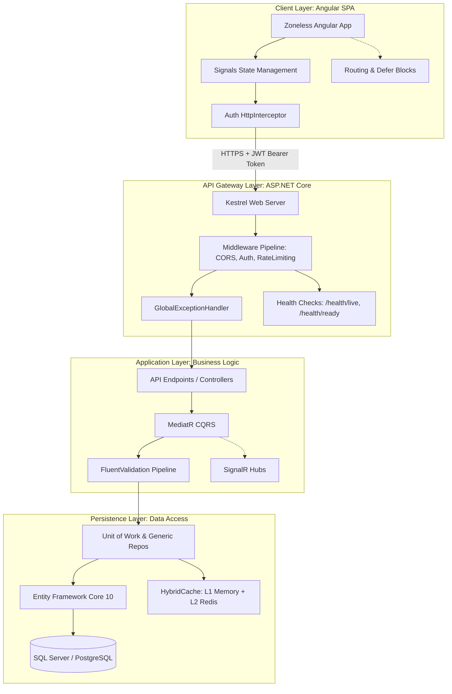

# Lecture 54 — Capstone Project, DevOps & Career Preparation

**Course:** Full-Stack Web Development  
**Instructor:** Kyrillos Medhat  
**Duration:** 3 hours (Theory + Lab)

---

## 🚦 Prerequisites

Before beginning this culminating lecture and the final phases of your capstone project, you must ensure you have a solid foundation in the following areas. This capstone will test everything you have learned over the past 47 lectures.

- **Completion of Lectures 1-47**: You should have completed all prior modules in this masterclass. Skipping sections will leave critical knowledge gaps in your architecture.
- **Angular 21 Mastery**: Deep understanding of standalone components, the new control flow syntax (`@if`, `@for`, `@switch`), dependency injection, Signals for reactive state management, and `HttpClient` for API communication. You must understand how to share state across deeply nested components.
- **ASP.NET Core 10 Proficiency**: Ability to build RESTful APIs using Minimal APIs or Controllers. You must be comfortable configuring the dependency injection container, building custom middleware, and implementing JWT-based authentication and Role-Based authorization policies.
- **Entity Framework Core 10**: Proficiency in Code-First migrations, fluent API configuration, setting up relationships, implementing generic repositories, the Unit of Work pattern, and writing optimized, scalable LINQ queries.
- **Architectural Patterns**: Deep understanding of Clean Architecture principles, CQRS (Command Query Responsibility Segregation) utilizing MediatR, and creating robust validation pipelines using FluentValidation and Pipeline Behaviors.
- **Cloud & Tooling Infrastructure**: Basic familiarity with Docker containerization, Redis (for distributed caching), real-time web sockets using SignalR, version control with Git, and collaborative development using GitHub.

> [!IMPORTANT]
> The capstone project is not just another step-by-step tutorial; it is an independent, end-to-end implementation of a complex enterprise system. You will be expected to debug your own issues, read official documentation, and make architectural decisions independently.

---

## 🎯 Objectives & Agenda

### Learning Objectives

By the end of this comprehensive capstone and career preparation lecture, you will be fully equipped to transition from a student into a highly employable full-stack software engineer. You will be able to:

1. **Architect** a scalable, maintainable full-stack application with a strict separation of concerns spanning the presentation, API Gateway, application logic, and persistence data layers.
2. **Optimize** modern Angular 21 applications for production environments by employing Zoneless execution, intelligent lazy loading, deferrable views (`@defer`), and aggressive bundle tree-shaking.
3. **Harden** ASP.NET Core 10 backends for enterprise deployment by implementing robust Health Checks, structured application logging, optimized static asset delivery via `MapStaticAssets`, and advanced caching strategies.
4. **Implement** professional DevOps workflows utilizing GitHub Actions for Continuous Integration and Continuous Deployment (CI/CD), alongside disciplined branching and PR review strategies.
5. **Craft** a standout, recruiter-friendly GitHub portfolio featuring exceptional `README` documentation, pinned repositories, system design diagrams, and live application demos.
6. **Master** technical and behavioral software engineering interviews by structuring your responses using the STAR method and demonstrating deep conceptual system design knowledge.

### Agenda

#### Part 1: Theory & Production Architecture (~90 min)
1. **The Capstone Architecture (Deep Dive)**: Connecting the front-end and back-end in a cohesive, deployable package.
2. **Front-End Production Readiness**: Preparing Angular for the real world.
3. **Back-End Production Readiness**: Preparing ASP.NET Core 10 for high traffic.
4. **DevOps, CI/CD & Version Control Strategies**: Branching, PRs, and pipelines.
5. **The Perfect Portfolio & Interviewing**: Transitioning from code to career.

#### Part 2: Practice & Career Preparation (~120 min)
6. **Think Like a Developer**: Navigating real-world technical dilemmas.
7. **Before vs After**: Refactoring code for production.
8. **Common Mistakes & How to Avoid Them**: The pitfalls of junior developers.
9. **Interview Prep**: The most common full-stack interview questions.
10. **Cheat Sheet**: Quick references for deployment and DevOps.
11. **Labs & Assignments**: The final Capstone delivery!
12. **Key Takeaways & Resources**

---

## 1. The Capstone Architecture (Deep Dive)

The capstone project is the ultimate test of your skills. It is where isolated concepts—components, controllers, database queries, styling—fuse into a single, cohesive, living system. When you speak with technical recruiters or senior engineers, your ability to describe this architecture top-to-bottom is critical. 

### Why Architecture Matters

In enterprise software development, we don't just write code that "works"; we write code that is maintainable, testable, and scalable. A tightly coupled application (where UI logic talks directly to the database) might be fast to build initially, but it becomes an absolute nightmare to update. By carefully layering our application, we ensure that a change in the UI styling doesn't break the database schema, and a change in the database engine doesn't crash the client-side UI. 

### The Full-Stack Architecture Diagram



### Deconstructing the Layers

1. **Client Layer (Angular SPA):** The user's entry point. It is completely decoupled from the backend. It only knows about REST API endpoints. It manages local state via Signals and automatically attaches JWT tokens to outgoing requests via an `HttpInterceptor`.
2. **API Gateway Layer (ASP.NET Core):** The front door to your backend. Hosted on Kestrel, it handles cross-cutting concerns like CORS, Rate Limiting (preventing DDoS), and Authentication before the request ever reaches your business logic.
3. **Application Layer (Business Logic):** The brain of the system. Controllers receive the request and immediately delegate it to MediatR. MediatR separates Read operations from Write operations using CQRS. FluentValidation ensures no bad data ever reaches the database.
4. **Persistence Layer (Data Access):** The system's memory. The Unit of Work pattern ensures that multiple database changes succeed or fail together as a single transaction. EF Core translates C# LINQ into optimized SQL. `HybridCache` sits in front of the database to serve frequently accessed data instantly.

### Explaining the Architecture in an Interview

When an interviewer asks, *"Describe the architecture of the most complex system you've built,"* you should mentally trace the path of a single request through the diagram above. Do not jump around; tell a logical story.

**Example Answer:**
> *"I built a scalable eCommerce platform using Angular 21 and ASP.NET Core 10. On the frontend, I utilized a Zoneless Angular architecture relying purely on Signals for reactive state management. When a user adds an item to their cart, an Angular Service dispatches an HTTP POST request. An `HttpInterceptor` automatically intercepts this request to attach a JWT bearer token for authorization.*
>
> *The request travels securely over HTTPS to my ASP.NET Core API, hosted on the Kestrel web server. It passes through the middleware pipeline, where CORS policies, rate limiting, and JWT authentication are validated. If the request fails or throws an error, a custom `GlobalExceptionHandler` ensures a standardized RFC 7807 Problem Details response is safely returned to the client without exposing stack traces.*
>
> *Once it reaches the API Controller, the payload is mapped to a Command object and dispatched using MediatR, strictly following the CQRS pattern. Before the Command Handler executes, a MediatR Pipeline Behavior intercepts it to run FluentValidation rules. Inside the Handler, a Unit of Work pattern coordinates with EF Core 10 to persist the order to SQL Server, invalidates the relevant `HybridCache` entries in Redis, and finally triggers a SignalR notification to update the user's UI in real-time."*

---

## 2. Front-End Production Readiness (Angular)

Developing on `localhost:4200` on a high-end laptop is very different from serving users on mobile networks. Before deploying to production, apply aggressive optimization techniques to minimize bundle size and maximize rendering speed.

### 2.1 Lazy Loading & Code Splitting
Never send the entire application bundle to the user on their first visit. By using the modern `loadComponent` or `loadChildren` syntax in your Angular Router definitions, Angular automatically splits your application into smaller chunks.

```typescript
export const routes: Routes = [
  { path: 'home', component: HomeComponent },
  // The admin bundle is ONLY downloaded if the user navigates here
  { 
    path: 'admin', 
    loadComponent: () => import('./admin/admin.component').then(m => m.AdminComponent),
    canActivate: [AdminGuard] 
  }
];
```

### 2.2 Deferrable Views (`@defer`)
Angular 17+ introduced `@defer`, a revolutionary way to declaratively lazy-load specific UI components based on conditions, interactions, or viewport visibility. This drastically improves the Initial Load Time.

```html
<!-- The heavy chart component won't load until the placeholder enters the browser viewport -->
@defer (on viewport) {
  <app-heavy-sales-chart [data]="salesData" />
} @placeholder {
  <div class="skeleton-chart">Loading chart...</div>
} @loading (minimum 1s) {
  <div class="spinner">Fetching data...</div>
} @error {
  <div class="error-banner">Failed to load chart module. Please refresh.</div>
}
```

### 2.3 Zoneless Applications & Signals
Historically, Angular relied on `zone.js` to monkey-patch all asynchronous browser APIs to trigger change detection. This added massive overhead.

In modern Angular 21, you can remove `zone.js` completely. Provide `provideExperimentalZonelessChangeDetection()` in your `app.config.ts`, and use Signals (`signal()`, `computed()`, `effect()`) for all state management. Angular will now only update the exact text nodes in the DOM that depend on a changed Signal, resulting in blazingly fast rendering.

### 2.4 The Production Build Command
Always run `ng build --configuration production`. Never deploy without the production flag. The production flag triggers:
- **AOT (Ahead-of-Time) Compilation**: Compiles HTML templates into highly optimized JavaScript during the build phase.
- **Tree-Shaking**: Analyzes your code and removes unused libraries, functions, or CSS rules.
- **Minification**: Uses `esbuild` to aggressively shrink file sizes.
- **Cache Busting**: Appends unique cryptographic hashes to file names (e.g., `main-a3f2b.js`) preventing stale browser caches.

> [!TIP]
> Run `npx source-map-explorer dist/**/*.js` to generate a visual treemap showing exactly which third-party libraries are taking up the most space in your application bundle.

---

## 3. Back-End Production Readiness (ASP.NET Core)

Just as the frontend requires optimization, the backend must be hardened for reliability, observability, and performance. A production API must survive thousands of concurrent requests, random database disconnects, and malicious payloads.

### 3.1 Advanced Caching with HybridCache
Database queries are the biggest bottleneck in web applications. While In-Memory Caching is fast, it's wiped out instantly if the server restarts. Redis is persistent and distributed, but involves network calls which add latency.

ASP.NET Core 10's `HybridCache` solves this elegantly by giving you an L1 (In-Memory) and L2 (Distributed/Redis) cache simultaneously.

```csharp
app.MapGet("/api/products/featured", async (HybridCache cache, AppDbContext db) => 
{
    // 1. Checks L1 (Fastest Memory)
    // 2. If miss, checks L2 (Redis)
    // 3. If miss, executes the DB query and populates both L1 and L2!
    return await cache.GetOrCreateAsync(
        "featured_products", 
        async token => await db.Products.Where(p => p.IsFeatured).AsNoTracking().ToListAsync(token),
        new HybridCacheEntryOptions { Expiration = TimeSpan.FromHours(1) }
    );
});
```

### 3.2 Health Checks for Kubernetes and Cloud Platforms
Cloud providers like Azure App Service and orchestrators like Kubernetes need to know if your application has crashed, or if it has lost connection to its database. 

Implement Health Checks to expose `/health/live` (is the app running?) and `/health/ready` (is the app connected to the DB/Redis?).

```csharp
builder.Services.AddHealthChecks()
    .AddSqlServer(builder.Configuration.GetConnectionString("DefaultConnection"))
    .AddRedis(builder.Configuration.GetConnectionString("RedisConnection"));

app.MapHealthChecks("/health/ready", new HealthCheckOptions
{
    Predicate = check => check.Tags.Contains("ready"),
    ResponseWriter = UIResponseWriter.WriteHealthCheckUIResponse
});
app.MapHealthChecks("/health/live", new HealthCheckOptions { Predicate = _ => false });
```

### 3.3 AsNoTracking() for Read-Only Queries
When EF Core retrieves entities, it sets up "change trackers" in memory. It takes a snapshot of the data so it knows what to update when you call `SaveChanges()`. This consumes significant memory and CPU cycles.

If you are querying data simply to map it to a DTO and send it to the client, ALWAYS use `.AsNoTracking()`. This stops EF Core from setting up change trackers, increasing query performance by up to 50% and drastically reducing server RAM usage.

### 3.4 Optimized Static Assets (`MapStaticAssets`)
If you are hosting your Angular app's build files directly from within your ASP.NET Core backend, avoid the legacy `UseStaticFiles()` middleware. Instead, use `MapStaticAssets()`. It pre-compresses your CSS/JS files using Brotli and Gzip during compilation, and generates perfect ETags for aggressive browser caching.

---

## 4. DevOps, CI/CD & Version Control Strategies

A professional full-stack developer ships code securely, automatically, and collaboratively to the cloud. 

### 4.1 Branching Strategies
**GitHub Flow (The Modern Agile Standard):**
1. The `main` branch is **always deployable** and strictly represents production.
2. When starting a task, branch off `main` to a feature branch (e.g., `feature/user-auth`).
3. Commit your work locally and push the branch to GitHub.
4. Open a **Pull Request (PR)** against `main`.
5. Automated CI/CD pipelines run Unit Tests, Linters, and Security Scanners.
6. A senior developer reviews and approves the code.
7. The PR is merged into `main`, triggering a deployment.

### 4.2 CI/CD Pipelines with GitHub Actions
Continuous Integration (CI) and Continuous Deployment (CD) automate the tedious tasks of testing and deployment. Here is a comprehensive GitHub Actions workflow for an ASP.NET Core API.

```yaml
# .github/workflows/dotnet-ci.yml
name: .NET Enterprise CI/CD

on:
  push:
    branches: [ "main" ]
  pull_request:
    branches: [ "main" ]

jobs:
  build-and-test:
    runs-on: ubuntu-latest
    steps:
    - name: Checkout Code
      uses: actions/checkout@v4
      
    - name: Setup .NET 10 SDK
      uses: actions/setup-dotnet@v4
      with:
        dotnet-version: '10.0.x'
        
    - name: Restore NuGet Dependencies
      run: dotnet restore
      
    - name: Build Solution (Release)
      run: dotnet build --no-restore --configuration Release
      
    - name: Run Automated Tests
      run: dotnet test --no-build --verbosity normal
```

> [!WARNING]
> Never hardcode secrets (like database connection strings or JWT secret keys) into your source code. Use GitHub Secrets to inject these into your CI pipeline safely.

### 4.3 Code Review Etiquette
- **For the Author:** Keep Pull Requests small! A PR with 150 lines of code will get an exhaustive review. A massive PR with 3,000 lines will get a superficial "Looks Good To Me" because the reviewer is overwhelmed. 
- **For the Reviewer:** Attack the code, not the person. Suggest alternatives gracefully.

### 4.4 Docker Containerization
Docker allows you to package your application and its entire environment into a single container, eliminating the "It works on my machine" problem.

```dockerfile
# Stage 1: Build the application using the SDK image
FROM mcr.microsoft.com/dotnet/sdk:10.0 AS build
WORKDIR /src
COPY ["ShopAPI/ShopAPI.csproj", "ShopAPI/"]
RUN dotnet restore "ShopAPI/ShopAPI.csproj"
COPY . .
WORKDIR "/src/ShopAPI"
RUN dotnet build "ShopAPI.csproj" -c Release -o /app/build
RUN dotnet publish "ShopAPI.csproj" -c Release -o /app/publish

# Stage 2: Run the application using the lightweight Runtime image
FROM mcr.microsoft.com/dotnet/aspnet:10.0 AS final
WORKDIR /app
COPY --from=build /app/publish .
ENTRYPOINT ["dotnet", "ShopAPI.dll"]
```

---

## 5. The Perfect Portfolio & Interviewing

Recruiters spend an average of 6 to 10 seconds looking at a resume. You must market yourself effectively.

### 5.1 The Perfect `README.md`
If an engineering manager clicks on your Capstone project repository, they will read your `README.md` first. An exceptional README proves that you understand documentation and professional communication.

Your repository's README must include:
1. **Title & Elevator Pitch:** Clear statement of what the app does.
2. **Hero Image/GIF:** High-quality screenshot showing the UI in action.
3. **Live Demo Link:** Host the frontend on Vercel/Netlify, and the API on Azure/Railway.
4. **Tech Stack Badges:** Visual representations of your stack (Angular, .NET, SQL Server).
5. **Architecture Diagram:** Embed a Mermaid diagram detailing your data flow.
6. **Features List:** Bullet points of the most impressive technical feats.
7. **Local Setup Instructions:** Step-by-step instructions on how to clone and run your project locally.

### 5.2 The STAR Method for Behavioral Interviews
When asked behavioral questions (e.g., *"Tell me about a complex bug you solved"*), use the **STAR** framework:
- **Situation:** Set the scene. *"I was building the shopping cart feature for my capstone eCommerce platform."*
- **Task:** Describe the problem. *"I noticed that when a user refreshed the page, their shopping cart items disappeared."*
- **Action:** Explain exactly what YOU did. *"I implemented an Angular Signals state store that persisted to `localStorage` for immediate UI rendering, and created an `HttpInterceptor` to sync this state with my backend Redis cache."*
- **Result:** Quantify the success. *"The bug was resolved, and offloading cart reads to Redis reduced SQL database queries, improving overall API response times by 20%."*

---

## 🧠 Think Like a Developer

To transition from a junior developer to a mid-level engineer, you must deeply understand *why* we make technical decisions. 

### Scenario 1: The Heavy Payload Problem
**The Problem:** Your application is requesting a list of 10,000 products from the API. The JSON payload is 8MB. The browser freezes for 5 seconds while Angular tries to parse the JSON and render DOM elements.
**The Expert Developer Approach:** Recognize this is a systemic architectural failure. 
1. **Backend Fix:** Implement pagination (`Skip()`, `Take()`) on the EF Core query. Only return 50 items per page. 
2. **Frontend Fix:** Implement Virtual Scrolling (`@angular/cdk/scrolling`). Even if 10,000 items are in memory, Virtual Scrolling ensures the browser only renders the 20 items currently visible on the screen, dynamically recycling DOM elements as the user scrolls.

### Scenario 2: The Silent Database Killer
**The Problem:** The website works perfectly on your local machine, but in production, it becomes slow and crashes with a `TimeoutException`.
**The Expert Developer Approach:** Identify the dreaded **N+1 Query Problem**. You are querying a list of `Orders`, and inside a loop, you access `Order.Customer.Name`. EF Core executes 1 query for the list of orders, and then N additional queries for every single customer! Fix this by eagerly loading the relationship using `.Include(o => o.Customer)` on the backend, reducing the database calls to a single SQL `JOIN`.

---

## 🔄 Before vs After: Refactoring for Production

### 1. Front-End: Change Detection (Zone.js vs Zoneless)

**Before (Legacy Zone.js Approach):**
```typescript
@Component({
  selector: 'app-counter',
  template: `
    <h1>{{ count }}</h1>
    <button (click)="increment()">Add</button>
  `
})
export class CounterComponent {
  count = 0;
  increment() {
    this.count++;
    // Zone.js intercepts this click event and triggers change 
    // detection across the ENTIRE application tree! Extremely inefficient.
  }
}
```

**After (Modern Zoneless Signals Approach):**
```typescript
@Component({
  selector: 'app-counter',
  template: `
    <h1>{{ count() }}</h1>
    <button (click)="increment()">Add</button>
  `,
  changeDetection: ChangeDetectionStrategy.OnPush
})
export class CounterComponent {
  // State is localized and strictly reactive
  count = signal(0);
  
  increment() {
    this.count.update(c => c + 1);
    // In a zoneless app, Angular knows exactly where `count()` is used.
    // ONLY the specific text node for `count()` is updated in the DOM. 
  }
}
```

### 2. Back-End: Querying Data (Tracking vs No-Tracking)

**Before (Memory Heavy & Slow):**
```csharp
[HttpGet("products")]
public async Task<IActionResult> GetProducts() 
{
    // EF Core allocates memory for change trackers, and takes deep snapshots 
    // of every entity, just in case you call SaveChanges().
    var products = await _context.Products.ToListAsync();
    return Ok(products); 
}
```

**After (Optimized for Read-Only APIs):**
```csharp
[HttpGet("products")]
public async Task<IActionResult> GetProducts() 
{
    // EF Core acts as a simple, fast object mapper. No tracking overhead.
    // Memory usage is drastically lower; execution speed is much faster.
    var products = await _context.Products
        .AsNoTracking()
        .Select(p => new ProductDto(p.Id, p.Name, p.Price)) 
        .ToListAsync();
        
    return Ok(products); 
}
```

---

## ❌ Common Mistakes & How to Avoid Them

| Common Mistake | Impact & Symptoms | How to Avoid It (Best Practice) |
|----------------|-------------------|---------------------------------|
| **Committing Secrets to Git** | Hackers scrape GitHub and steal cloud resources. | Add `appsettings.json`, `.env` to `.gitignore`. Use GitHub Secrets/Azure KeyVault. |
| **Fat Controllers** | Impossible to unit test. Logic is tightly coupled with routing. | Move business logic to MediatR Handlers, Application Services, or Domain Entities. |
| **Missing Database Indexes** | Queries take seconds instead of milliseconds as data grows. | Analyze SQL queries. Add `[Index(nameof(Email))]` to your EF Core entity. |
| **Over-fetching API Data** | Slow mobile performance. Wasted bandwidth. App sluggishness. | Use REST DTOs (Data Transfer Objects) to return strictly the fields the UI needs. |
| **Ignoring RxJS Memory Leaks** | Angular app slows down over time and crashes the browser tab. | Use `takeUntilDestroyed()`, the async pipe (`\| async`), or Signals to auto-unsubscribe. |
| **Exposing Stack Traces** | Security vulnerability. Attackers learn your DB schema. | Use a `GlobalExceptionHandler` middleware to return a generic `ProblemDetails` response. |

---

## 💼 Interview Prep: Top Full-Stack Questions

**1. "What is Dependency Injection, and why do we use it in both Angular and .NET?"**
> **Answer:** "Dependency Injection (DI) is a design pattern used to implement Inversion of Control. Instead of a class directly instantiating its own dependencies, the framework injects them via the constructor. This promotes loose coupling, makes code highly testable, and allows the framework to manage object lifecycles."

**2. "Explain the difference between `AddTransient`, `AddScoped`, and `AddSingleton` in ASP.NET Core."**
> **Answer:** "`AddTransient` creates a brand new instance of the service every time it is requested. `AddScoped` creates a single instance per HTTP request. `AddSingleton` creates exactly one instance when the application starts, sharing it globally across all requests."

**3. "How does change detection work in Angular, and how do Signals improve it?"**
> **Answer:** "Historically, Angular used Zone.js to monkey-patch async events. When an event fired, Angular traversed the entire component tree checking for changes. Signals introduce fine-grained reactivity. With Signals, Angular updates the exact DOM node that depends on that specific Signal without checking the rest of the application."

**4. "What is the N+1 query problem in Entity Framework, and how do you solve it?"**
> **Answer:** "The N+1 problem occurs when a framework executes one query to retrieve a list of records, and then executes an additional 'N' queries to load related data inside a loop. It is solved by using eager loading with `.Include()` in EF Core, which fetches the primary and related data in a single optimized SQL JOIN."

**5. "How would you secure a RESTful API?"**
> **Answer:** "I implement defense-in-depth: Enforce HTTPS, implement stateless authentication using JWTs, apply Role-Based Access Control, validate incoming data using FluentValidation, and implement Rate Limiting middleware to prevent DDoS attacks."

**6. "Explain the Repository Pattern and Unit of Work. Why use them?"**
> **Answer:** "The Repository Pattern acts as an in-memory collection abstraction over the database, hiding data access details from business logic. The Unit of Work pattern coordinates multiple repositories by maintaining a single database transaction, ensuring data integrity."

---

## 📄 Cheat Sheet: Full-Stack CLI Commands

### Angular CLI (`npm run ...`)
```bash
# Generate a new standalone component
ng generate component components/header --standalone

# Build the application for production with strict optimization
ng build --configuration production

# Analyze the bundle size to find heavy libraries
npx source-map-explorer dist/**/*.js
```

### .NET CLI & EF Core
```bash
# Create a new Web API project
dotnet new webapi -n ShopAPI

# Add a new EF Core migration
dotnet ef migrations add "InitialCreate" --project Infrastructure --startup-project ShopAPI

# Apply migrations to the database
dotnet ef database update

# Build the project in Release mode for deployment
dotnet build --configuration Release
```

### Git & Version Control
```bash
# Create and switch to a new feature branch
git checkout -b feature/shopping-cart

# Stage all changes and commit with a descriptive message
git add .
git commit -m "feat: implement shopping cart state with Signals"

# Fetch latest changes and rebase to prevent conflicts
git fetch origin
git rebase origin/main
```

### Docker (Containerization)
```bash
# Build a Docker image from a Dockerfile
docker build -t shopapi:latest .

# Run the container, mapping host port 8080 to container port 80
docker run -d -p 8080:80 --name myapi shopapi:latest
```

---

## 🧪 Labs & Assignments

### Lab 1 — Portfolio Audit & GitHub Grooming (45 min)
Your first task is to ensure you look highly employable to a recruiter right now.
1. Edit your GitHub profile README to include a professional bio and technical stack.
2. Pin your 4 best repositories to the top of your profile.
3. Open your `ShopAPI` capstone repository and delete the default README.
4. Write a professional `README.md` following the exact template discussed in Section 5.1.
5. Take a high-resolution screenshot of your Angular app and embed it into the README.

### Lab 2 — Preparing the Angular App for Production (60 min)
1. Open your `ShopApp` frontend workspace.
2. Navigate to `app.config.ts`. Remove `zone.js` imports and add `provideExperimentalZonelessChangeDetection()`.
3. Wrap at least one heavy component (e.g., a modal, a chart) in an `@defer (on viewport)` block.
4. Run `ng build --configuration production`. Inspect the `/dist` folder.

### Lab 3 — Hardening the .NET API (60 min)
1. Open your `ShopAPI` backend solution.
2. Install the `AspNetCore.HealthChecks.SqlServer` and `AspNetCore.HealthChecks.Redis` NuGet packages.
3. In `Program.cs`, configure Health Checks for SQL database and Redis cache. Map the `/health/live` and `/health/ready` endpoints.
4. Global search for `.ToListAsync()` and append `.AsNoTracking()` before the list materialization for read-only queries.

---

## 📝 Final Assignment: The Capstone Delivery

This is it! Deliver your final capstone project to the public internet.

### Requirements for Passing
1. **Completion:** Ensure all previous 9 parts of the `ShopAPI` and `ShopApp` are fully functional (Auth, Catalog, Cart, Checkout, Admin).
2. **Production Polish:** Both the frontend and backend must strictly pass the production readiness checklists from Labs 2 and 3.
3. **Documentation:** An exceptional, recruiter-ready `README.md` with an architecture diagram and live screenshots must be present.
4. **Cloud Deployment:** 
   - Deploy your Angular application to **Vercel**, **Netlify**, or **Firebase Hosting**. 
   - Deploy your ASP.NET Core API to **Azure App Service**, **Railway**, or **Render**.
   - Deploy your SQL database and Redis instance to managed cloud providers.
5. **End-to-End Validation:** The live public URLs must communicate successfully over HTTPS. You must be able to create an account, browse products, add items to the cart, and place an order.

Submit your GitHub repository link and Live Demo URLs to the course portal for final grading and certification!

---

## 📌 Key Takeaways & Resources

### Key Takeaways
- **The Capstone is your ultimate proof of competence.** It proves to employers that you can architect, deploy, and document a real system independently.
- **Frontend Optimization:** Modern Angular is built on Signals, Zoneless architecture, and deferrable views. Master these to build lightning-fast SPAs.
- **Backend Hardening:** ASP.NET Core requires proper caching strategies (`HybridCache`), zero-tracking queries (`AsNoTracking`), and robust observability (`HealthChecks`) to survive real-world production loads.
- **Portfolio Power:** Your GitHub profile is your modern resume. Detailed READMEs, architecture diagrams, and clean commit histories get you interviews.
- **Interviewing:** Always use the STAR method to answer behavioral questions, and deeply understand the "Why" behind architectural decisions.

### Essential Resources

| Resource | Description | Link |
|----------|-------------|------|
| **Angular Deployment Guide** | Official docs on optimizing and hosting Angular. | [angular.dev/guide/deployment](https://angular.dev/guide/deployment) |
| **ASP.NET Core Health Checks** | Deep dive into monitoring app health. | [learn.microsoft.com/health-checks](https://learn.microsoft.com/en-us/aspnet/core/host-and-deploy/health-checks) |
| **The STAR Method** | Mastering behavioral interviews. | [The Balance Careers: STAR Method](https://www.thebalancecareers.com/what-is-the-star-interview-response-technique-2061629) |
| **GitHub Flow** | Understanding modern branching strategies. | [docs.github.com/github-flow](https://docs.github.com/en/get-started/quickstart/github-flow) |
| **Awesome README** | A curated list of awesome README templates. | [github.com/matiassingers/awesome-readme](https://github.com/matiassingers/awesome-readme) |

---

## 🎉 Congratulations!

**You have officially completed the Full-Stack Web Development Master Course.**

> [!NOTE]
> **48 Lectures · 144 Hours · Theory + Practice + Projects**

You haven't just attended lectures and copied code—you have **built**. You constructed the complex `ShopAPI`, the scalable `FinanceTracker`, and completed countless rigorous labs. 

Walk into your next interview not as a student, but with the confidence of a builder. You have mastered the stack. You are a full-stack software engineer.

*Now go build something extraordinary.*

### 📚 Extensive Tutorials & Resources
- **Source:** [Microsoft Learn: Monitor the Health of your ASP.NET Core applications](https://learn.microsoft.com/en-us/aspnet/core/host-and-deploy/health-checks)
- **Source:** [Angular University: Angular Deferrable Views - The Complete Guide](https://blog.angular-university.io/angular-defer/)
- **Source:** [Code Maze: HybridCache in ASP.NET Core](https://code-maze.com/hybridcache-aspnet-core/)
- **Source:** [Microsoft Learn: Containerize a .NET App with Docker](https://learn.microsoft.com/en-us/dotnet/core/docker/build-container)
- **Source:** [FreeCodeCamp: CI/CD Pipeline Tutorial using GitHub Actions for .NET](https://www.freecodecamp.org/news/how-to-build-a-ci-cd-pipeline-using-github-actions/)
- **Source:** [GitHub Docs: Managing Your Profile README on GitHub](https://docs.github.com/en/account-and-profile/setting-up-and-managing-your-github-profile/customizing-your-profile/managing-your-profile-readme)
