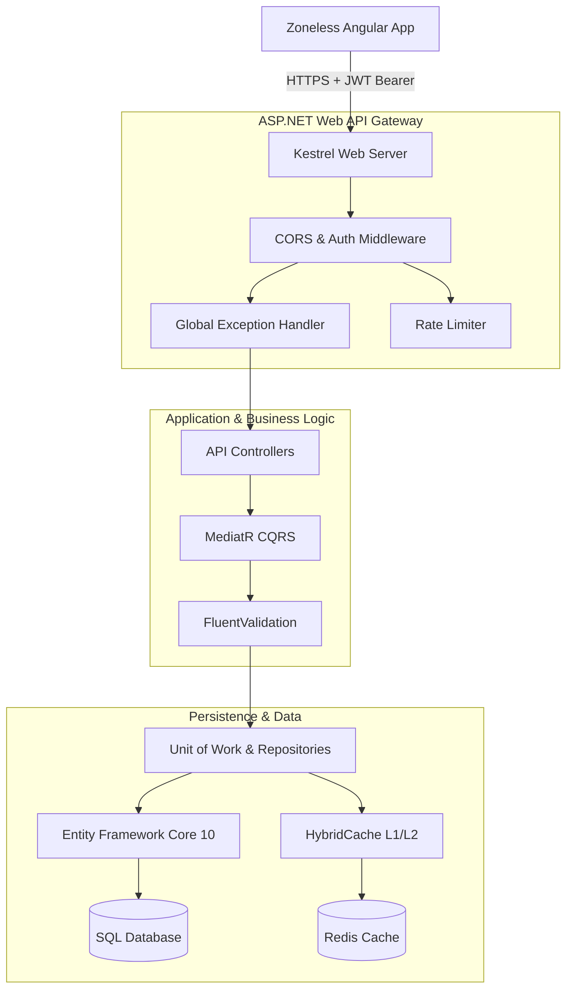

# 🛍️ ShopApp & ShopAPI: Enterprise Full-Stack E-Commerce Platform

<!-- TODO: Replace the placeholder image below with an actual screenshot or GIF of your running application -->


## 🚀 Overview
Provide a concise 2-3 sentence elevator pitch describing the application. Highlight that it is a production-hardened, zoneless Angular application communicating with a layered ASP.NET Core 10 Web API.

---

## 🛠️ Tech Stack & Architecture

### Frontend
- **Framework:** Angular 21 (Zoneless, Signals Reactivity)
- **State Management:** Angular Signals & Services
- **Styling:** CSS Grid/Flexbox (or Bootstrap/Tailwind if you used them)
- **Tooling:** esbuild, ESLint

### Backend
- **Framework:** ASP.NET Core 10 (Web API controllers, CQRS via MediatR)
- **Database:** MS SQL Server / PostgreSQL (via Entity Framework Core 10)
- **Caching:** Distributed HybridCache (L1 Memory + L2 Redis)
- **Validation:** FluentValidation Pipeline Behaviors
- **Real-Time:** SignalR Web Sockets

---

## 📐 System Architecture Diagram



---

## ✨ Features Checklist
- [ ] **Stateless Authentication:** Secure JWT-based registration, login, and authorization.
- [ ] **Catalog Browsing:** Category filtering, full-text product search, and server-side pagination.
- [ ] **Interactive Cart:** Real-time client-side calculations synced to backend session stores.
- [ ] **Secure Checkout:** Order generation and transactional balance modifications.
- [ ] **Administrative Controls:** Dedicated role guards blocking product creations/deletions.
- [ ] **Observability:** Health check diagnostics endpoint for deployment infrastructure.

---

## ⚙️ Local Setup Instructions

### Backend Setup
1. Navigate to the backend directory:
   ```bash
   cd ShopAPI
   ```
2. Restore NuGet dependencies:
   ```bash
   dotnet restore
   ```
3. Update connection strings in `appsettings.json`.
4. Apply Entity Framework migrations:
   ```bash
   dotnet ef database update
   ```
5. Run the application:
   ```bash
   dotnet run
   ```

### Frontend Setup
1. Navigate to the frontend directory:
   ```bash
   cd ShopApp
   ```
2. Install npm dependencies:
   ```bash
   npm install
   ```
3. Run the development server (configured to proxy `/api` requests):
   ```bash
   npm start
   ```
4. Access the application at `http://localhost:4200`.
