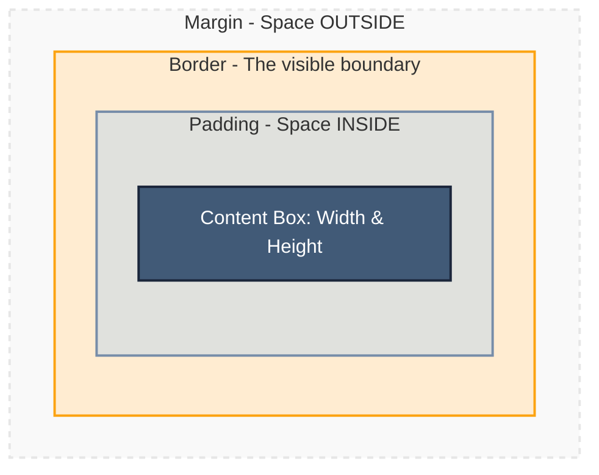

# Lecture 04 — CSS3 Fundamentals & Selectors

**Course:** Full-Stack Web Development  
**Instructor:** Kyrillos Medhat  
**Duration:** 3 hours (Theory + Lab)

---

## 📋 Prerequisites

> Before starting this lecture, make sure you have:
> - ✅ Completed Lecture 03 (HTML5 Forms, Tables & Multimedia)
> - ✅ Basic understanding of HTML tags, elements, attributes, and nesting
> - ✅ A code editor (like VS Code) installed and running
> - ✅ The **Live Server** extension installed for automatic reloading

---

## 🎯 Learning Objectives

By the end of this lecture, you will be able to:
- Understand what CSS is and why it exists
- Apply CSS to HTML using all three methods
- Use every common selector type to target specific elements
- Calculate and understand specificity and the cascade
- Apply the CSS box model to control spacing and sizing
- Define and use CSS custom properties (variables) for consistent theming
- Set up typography using system fonts and Google Fonts
- Write modern CSS using Native Nesting and `oklch()` colours

---

## 📋 Agenda

### Part 1 — Theory (~90 minutes)
1. What is CSS? The Big Picture
2. Three Ways to Include CSS
3. CSS Syntax — Rules, Properties & Values
4. Selector Types & Native Nesting
5. Specificity, the Cascade, and `@layer`
6. The Box Model & `box-sizing`
7. Colours & Modern `oklch()`
8. Custom Properties (Variables)
9. Typography & Web Fonts

### Part 2 — Practice & Lab (~90–120 minutes)
1. Style your Lecture 1 Profile Page
2. Specificity & Layer Wars
3. Portfolio Project Part 3: Global Styling & Design Tokens

---

## 1. What is CSS? The Big Picture

### The Real-World Analogy

Imagine a skeleton (your bones = HTML). On its own, a skeleton tells you the *structure* of a person — where the head is, how many fingers there are. But it tells you nothing about how the person *looks*.

**CSS is everything that makes the skeleton look like a person:** skin colour, hair, clothes, height proportions, the way the arms are positioned. Without CSS, every website would just be plain black text on a white background.

### What Does CSS Stand For?

**CSS = Cascading Style Sheets**

- **Cascading** → Styles from multiple sources combine and override each other in a predictable way (more on this soon)
- **Style** → Controls appearance: colours, fonts, spacing, layout
- **Sheets** → Written in separate files (`.css`) or inside `<style>` tags

### What Can CSS Control?

| Without CSS | With CSS |
|-------------|----------|
| Plain black text | Coloured, styled fonts |
| White background | Custom background colours, gradients, images |
| No spacing | Precise padding, margins, gutters |
| Stacked elements only | Complex multi-column layouts |
| No hover effects | Smooth hover animations |
| No dark mode | System-aware dark/light themes |

### CSS is a Separate Language from HTML

HTML = the *what* (structure, content)  
CSS = the *how it looks* (presentation)

They are always separate concerns. You write HTML for content, CSS for appearance. This separation makes both easier to maintain and understand.

---

## 2. Three Ways to Include CSS

### Method 1: Inline Styles (Avoid in Production)

```html
<!-- Styles go directly inside the HTML element's style attribute -->
<p style="color: red; font-size: 18px;">This text is red.</p>
<h1 style="background-color: navy; color: white; padding: 10px;">
  Hello World
</h1>
```

**Problems with inline styles:**
- Mixes content (HTML) with presentation (CSS) — harder to maintain
- Can't be reused — you'd need to copy the style to every element
- Hard to override later — they have extremely high specificity
- Makes your HTML messy and long

✅ **Only use inline styles for quick testing or dynamic styles applied by JavaScript.**

### Method 2: Internal Styles (Fine for Small Single Pages)

```html
<!DOCTYPE html>
<html>
<head>
  <!-- Styles live in a <style> block inside the <head> -->
  <style>
    /* This affects ALL <p> tags on this page */
    p {
      color: darkblue;
      font-size: 16px;
      line-height: 1.5;
    }

    /* This affects the element with id="main-heading" */
    #main-heading {
      font-size: 2rem;
      color: navy;
    }
  </style>
</head>
<body>
  <h1 id="main-heading">Hello World</h1>
  <p>This paragraph is dark blue.</p>
  <p>This one too, because the style applies to all p tags.</p>
</body>
</html>
```

**When to use:** Single-page projects, email templates, quick prototypes.  
**Limitation:** Styles don't apply to other pages.

### Method 3: External Stylesheets (Always Use This for Real Projects)

**`index.html`:**
```html
<!DOCTYPE html>
<html>
<head>
  <!-- Link to an external CSS file -->
  <!-- rel="stylesheet" tells the browser what kind of file this is -->
  <!-- href="styles.css" is the path to the CSS file -->
  <link rel="stylesheet" href="styles.css">
</head>
<body>
  <h1>Hello World</h1>
  <p>This text is styled by styles.css</p>
</body>
</html>
```

**`styles.css`** (a completely separate file):
```css
/* This file only contains CSS — no HTML here */

p {
  color: darkblue;
  font-size: 16px;
}

h1 {
  color: navy;
  font-size: 2rem;
}
```

**Why external stylesheets are best:**
- One stylesheet can style dozens of HTML pages
- Change one file → all pages update instantly
- Browser can cache the CSS file (faster repeat visits)
- Clean separation of content and presentation
- Easier team collaboration (designer edits CSS, developer edits HTML)

> [!TIP]
> **Always use external stylesheets for real projects.** The other two methods are for quick experiments only.

---

## 3. CSS Syntax — Rules, Properties & Values

### Anatomy of a CSS Rule

```css
/*
   selector  {  property : value  ;  }
      ↑            ↑          ↑
  Which HTML    What to    What the
  element(s)   change     value is
  to target
*/

p {
  color: navy;
  font-size: 16px;
  line-height: 1.6;
}
```

Let's break this down:

| Part | Meaning | Example |
|------|---------|---------|
| **Selector** | Targets which HTML elements to style | `p` (all paragraphs), `.card` (all elements with class="card") |
| **Declaration block** | Everything inside `{ }` | `{ color: navy; font-size: 16px; }` |
| **Property** | What aspect of the element you want to change | `color`, `font-size`, `background`, `margin` |
| **Value** | The specific value for that property | `navy`, `16px`, `#ff0000`, `1rem` |
| **Semicolon** | Separates multiple declarations | Required after every value |

### Multiple Rules and Properties

```css
/* You can style multiple different elements */

/* All headings get a deep blue colour */
h1 {
  color: #1a1a2e;      /* very dark blue */
  font-size: 2.5rem;   /* 2.5 × 16px = 40px */
  font-weight: 700;    /* bold */
  margin-bottom: 1rem; /* space below the heading */
}

/* All paragraphs get a readable dark grey */
p {
  color: #333333;      /* dark grey */
  font-size: 1rem;     /* 16px */
  line-height: 1.6;    /* 160% of font size — good readability */
  margin-bottom: 1rem;
}

/* Links are styled differently */
a {
  color: #0077cc;       /* bright blue */
  text-decoration: none; /* remove the default underline */
}

/* Links get underline and colour change when hovered */
a:hover {
  color: #005599;
  text-decoration: underline;
}
```

> [!NOTE]
> CSS is case-insensitive for property names and most values, but it's best practice to use lowercase consistently.

---

## 4. Selector Types & Native Nesting

Selectors are how you tell CSS *which* HTML elements to style. There are many types.

### Type (Element) Selector

Targets every instance of an HTML tag:

```css
/* Styles ALL <p> elements on the page */
p {
  color: #333;
}

/* Styles ALL <h2> elements */
h2 {
  font-size: 1.5rem;
  font-weight: 600;
}

/* Styles ALL <a> elements */
a {
  color: blue;
}
```

### Class Selector (`.`)

Targets elements with a specific `class` attribute. **This is the most common selector you'll use.**

```html
<!-- HTML -->
<p class="highlight">This paragraph is highlighted.</p>
<p>This paragraph is not highlighted.</p>
<span class="highlight">This span is also highlighted.</span>
```

```css
/* CSS: the dot (.) means "class" */
.highlight {
  background-color: yellow;
  font-weight: bold;
}
```

**Key point:** Multiple elements can share the same class. An element can also have multiple classes:

```html
<!-- This element has TWO classes: btn AND btn-primary -->
<button class="btn btn-primary">Click Me</button>
```

```css
.btn {
  padding: 0.5rem 1rem;
  border: none;
  border-radius: 4px;
  cursor: pointer;
}

.btn-primary {
  background-color: #007bff;
  color: white;
}
```

### ID Selector (`#`)

Targets the single element with a specific `id` attribute:

```html
<!-- HTML -->
<header id="main-header">This is the header</header>
<nav id="main-nav">Navigation</nav>
```

```css
/* CSS: the hash (#) means "id" */
#main-header {
  background-color: #1a1a2e;
  color: white;
  padding: 1rem 2rem;
}

#main-nav {
  display: flex;
  gap: 1rem;
}
```

> [!WARNING]
> IDs must be **unique** — only one element per page should have a given `id`. If you need to style multiple elements the same way, use a class instead.

### Grouping Selector (`,`)

Apply the same styles to multiple selectors:

```css
/* Instead of repeating styles for each one: */
h1 {
  font-family: Georgia, serif;
}
h2 {
  font-family: Georgia, serif;
}
h3 {
  font-family: Georgia, serif;
}

/* Use grouping — much cleaner: */
h1, h2, h3 {
  font-family: Georgia, serif;
}
```

### Descendant Selector (` ` space)

Targets elements that are *inside* another element (at any depth):

```html
<nav>
  <ul>
    <li><a href="/">Home</a></li>
    <li><a href="/about">About</a></li>
  </ul>
</nav>
<p>
  This is a <a href="#">regular link</a> in a paragraph.
</p>
```

```css
/* Only targets <a> tags that are inside a <nav> */
/* The regular link in the <p> is NOT affected */
nav a {
  color: white;
  text-decoration: none;
  font-weight: 500;
}

/* Only targets <li> inside <ul> inside <nav> */
nav ul li {
  display: inline-block;
  margin-right: 1rem;
}
```

### Child Selector (`>`)

Targets *direct children* only (not grandchildren):

```html
<div class="menu">
  <p>Direct child paragraph — STYLED</p>
  <div>
    <p>Nested paragraph — NOT styled</p>
  </div>
</div>
```

```css
/* Only direct children — not nested descendants */
.menu > p {
  color: red;
}
```

### Attribute Selector

Targets elements based on their HTML attributes:

```css
/* All <input> elements with type="text" */
input[type="text"] {
  border: 1px solid #ccc;
  padding: 0.5rem;
}

/* All <input> elements with type="email" */
input[type="email"] {
  border: 1px solid #007bff;
}

/* All links that open in a new tab (target="_blank") */
a[target="_blank"] {
  color: purple;
}

/* All elements with a disabled attribute */
input[disabled] {
  opacity: 0.5;
  cursor: not-allowed;
}
```

### Pseudo-Class Selectors (`:`)

Target elements in a specific **state**:

```css
/* When the user hovers over a link */
a:hover {
  color: red;
  text-decoration: underline;
}

/* When a button is being clicked */
button:active {
  transform: scale(0.98); /* slightly smaller while pressed */
}

/* When an input is focused (clicked into) */
input:focus {
  outline: 2px solid #007bff;
  border-color: #007bff;
}

/* The first child element of its parent */
li:first-child {
  font-weight: bold;
}

/* The last child element */
li:last-child {
  margin-bottom: 0;
}

/* Every even-numbered list item */
li:nth-child(even) {
  background-color: #f5f5f5;
}

/* Elements that do NOT have class "active" */
.tab:not(.active) {
  opacity: 0.7;
}

/* A checkbox or radio button that's checked */
input:checked + label {
  color: green;
}
```

### Pseudo-Element Selectors (`::`)

Target a specific **part** of an element that doesn't exist as a real HTML element:

```css
/* The very first letter of a paragraph */
p::first-letter {
  font-size: 3rem;
  float: left;
  line-height: 1;
  margin-right: 0.1em;
  color: #007bff;
}

/* Generated content before an element */
.warning::before {
  content: "⚠️ ";  /* Insert this text before the element's content */
}

/* Generated content after an element */
.price::after {
  content: " USD";  /* Insert "USD" after every price */
}

/* The selected text (when user highlights with mouse) */
::selection {
  background-color: #007bff;
  color: white;
}
```

### CSS Native Nesting (Modern — No Preprocessor Needed)

In modern CSS (2023+), you can nest rules inside each other, just like in Sass:

```css
/* OLD WAY — repeating the parent selector */
.card {
  background: white;
  padding: 1rem;
  border-radius: 8px;
}
.card h2 {
  color: #1a1a2e;
  margin-bottom: 0.5rem;
}
.card p {
  color: #555;
}
.card:hover {
  box-shadow: 0 4px 12px rgba(0,0,0,0.1);
}

/* MODERN WAY — native CSS nesting */
.card {
  background: white;
  padding: 1rem;
  border-radius: 8px;

  /* h2 inside .card */
  h2 {
    color: #1a1a2e;
    margin-bottom: 0.5rem;
  }

  /* p inside .card */
  p {
    color: #555;
  }

  /* & refers to the parent (.card itself) */
  &:hover {
    box-shadow: 0 4px 12px rgba(0,0,0,0.1);
  }

  /* .card.active — the card with class "active" */
  &.active {
    border: 2px solid #007bff;
  }
}
```

> [!NOTE]
> Native CSS nesting is supported in all modern browsers (Chrome, Firefox, Safari, Edge). You no longer need Sass or Less just for nesting.

---

## 5. Specificity, the Cascade, and `@layer`

### What is Specificity?

When multiple CSS rules target the same element, the browser needs to decide which one wins. **Specificity** is the scoring system it uses.

```css
p { color: blue; }          /* Who wins? */
.text { color: red; }       /* Who wins? */
#main-text { color: green; } /* Who wins? */
```

**Specificity score: (IDs, Classes, Elements)**

| Selector | Score | Wins? |
|---------|-------|-------|
| `p` | (0, 0, 1) | Lowest |
| `.text` | (0, 1, 0) | Middle |
| `#main-text` | (1, 0, 0) | Highest — **this wins** |

Think of it like comparing version numbers: 1.0.0 beats 0.9.9 regardless of individual digits.

```css
/* More specific selectors "beat" less specific ones */

/* Score: (0,0,1) */
p { color: blue; }

/* Score: (0,1,0) → wins over element selector */
.intro { color: red; }

/* Score: (0,2,0) → even more specific */
.article .intro { color: purple; }

/* Score: (1,0,0) → wins over any class combinator */
#hero { color: orange; }

/* Score: (1,1,0) → very high */
#hero .title { color: pink; }

/* !important → NUCLEAR OPTION — overrides everything */
/* Avoid using this — it makes debugging a nightmare */
p { color: green !important; }
```

> [!WARNING]
> **Avoid `!important` in production code.** Once you use it, you create a "specificity arms race" where everything needs `!important` to override it. Use proper cascade layers instead.

### The Cascade — What Happens When Rules Have Equal Specificity?

The **cascade** is the process of combining styles from multiple sources. When specificity is equal, the **last rule wins** (order matters):

```css
/* Both have the same specificity: (0,0,1) */
p { color: blue; }
p { color: red; }   /* ← This wins because it comes last */
```

The cascade also considers the **source** of the styles:
1. User-agent stylesheet (browser defaults)
2. Author stylesheet (your CSS)
3. User stylesheet (user's personal styles)

### Cascade Layers (`@layer`) — Modern CSS

`@layer` lets you explicitly define which groups of styles have priority — completely bypassing specificity wars:

```css
/* Define the order of layers — higher in the list = LOWER priority */
@layer reset, base, components, utilities;

/* Styles in 'utilities' layer WIN over all others */
@layer utilities {
  .text-red { color: red; }
}

/* Even though this uses a high-specificity ID selector,
   it's in a lower-priority layer and LOSES to utilities */
@layer components {
  #nav-title { color: blue; }
}

/* Reset layer has the LOWEST priority */
@layer reset {
  * {
    margin: 0;
    padding: 0;
    box-sizing: border-box;
  }
}
```

```
Layer Priority (highest to lowest):
utilities > components > base > reset
```

> [!TIP]
> `@layer` is perfect for design systems. Put your CSS framework (e.g., Bootstrap) in a low-priority layer, and your custom styles in a higher-priority layer. Your styles will always win, regardless of specificity.

---

## 6. The CSS Box Model

### Every Element is a Box

Every single HTML element — whether it's a paragraph, a button, a heading, or an image — is rendered as a rectangular box. Understanding this is fundamental to understanding layout.



### Box Model Properties

```css
.box {
  /* CONTENT SIZE */
  width: 300px;
  height: 200px;

  /* PADDING (space inside the border) */
  padding: 20px;              /* all 4 sides */
  padding: 10px 20px;         /* top/bottom: 10px, left/right: 20px */
  padding: 10px 20px 15px 5px; /* top right bottom left (clockwise) */
  padding-top: 10px;          /* individual sides */
  padding-right: 20px;
  padding-bottom: 10px;
  padding-left: 20px;

  /* BORDER */
  border: 2px solid #333;     /* width style colour */
  border-radius: 8px;         /* rounds the corners */
  border-top: 3px solid blue; /* individual sides */

  /* MARGIN (space outside the border) */
  margin: 20px;               /* all 4 sides */
  margin: 0 auto;             /* top/bottom: 0, left/right: auto (centres block elements) */
  margin-bottom: 1rem;        /* individual sides */
}
```

### The `box-sizing` Problem and Fix

By default (`box-sizing: content-box`), `width` only controls the content box. Padding and border are added on top, making elements wider than you expect:

```css
/* DEFAULT behaviour (box-sizing: content-box) */
.box {
  width: 300px;
  padding: 20px;
  border: 2px solid black;
}
/* ACTUAL rendered width = 300 + 20 + 20 + 2 + 2 = 344px! */
/* That's confusing and causes layout headaches */
```

**The fix — always add this at the top of your CSS:**

```css
/* border-box: width INCLUDES padding and border */
/* Now width: 300px means the element is exactly 300px total */
*, *::before, *::after {
  box-sizing: border-box;
}

.box {
  width: 300px;   /* Now exactly 300px total, including padding and border */
  padding: 20px;
  border: 2px solid black;
}
/* Actual width = exactly 300px — padding fits INSIDE */
```

> [!IMPORTANT]
> Always include `box-sizing: border-box` in every project. It makes CSS layout predictable and is how most developers expect it to work.

### Margin Collapse

Adjacent **vertical** margins collapse into a single margin (the larger one wins):

```css
h1 {
  margin-bottom: 30px; /* 30px */
}

p {
  margin-top: 20px; /* 20px */
}

/* Gap between h1 and p = 30px (NOT 50px) — the larger margin wins */
```

This only happens with vertical margins and not inside flex or grid containers.

---

## 7. Colours & Modern `oklch()`

### Colour Formats in CSS

```css
/* 1. Named colours — 147 predefined names */
p { color: red; }
p { color: coral; }
p { color: steelblue; }

/* 2. Hex — 6 (or 3) hexadecimal digits: #RRGGBB */
p { color: #ff0000; }     /* pure red */
p { color: #0077cc; }     /* a nice blue */
p { color: #f0f; }        /* shorthand for #ff00ff (magenta) */
p { color: #0077ccaa; }   /* 8 digits = includes alpha/opacity */

/* 3. RGB — Red, Green, Blue (0–255 each) */
p { color: rgb(255, 0, 0); }           /* pure red */
p { color: rgba(0, 119, 204, 0.5); }   /* blue at 50% opacity */

/* 4. HSL — Hue (0-360°), Saturation (0-100%), Lightness (0-100%) */
p { color: hsl(210, 100%, 40%); }      /* blue */
p { color: hsla(210, 100%, 40%, 0.8); } /* blue at 80% opacity */

/* 5. oklch — Modern standard (best for design systems) */
p { color: oklch(60% 0.15 250); }      /* a perceptually uniform blue */
```

### Why `oklch()` is Superior

`oklch()` stands for **OK** + **L**ightness + **C**hroma + **H**ue.

The key advantage: when you change the lightness value, the colour changes in a way that **matches human perception**. In regular HSL, some hues look brighter than others at the same lightness value. In `oklch()`, equal lightness values look equally bright.

```css
/* oklch(lightness chroma hue / alpha) */
/* lightness: 0% = black, 100% = white */
/* chroma: 0 = grey/muted, 0.37 = maximum colour */
/* hue: 0–360 degrees on the colour wheel */

:root {
  /* A balanced blue */
  --color-primary: oklch(55% 0.18 250);

  /* Hover: just lower the lightness — stays same hue and saturation */
  --color-primary-hover: oklch(45% 0.18 250);

  /* Disabled: lower chroma to grey it out */
  --color-primary-disabled: oklch(55% 0.04 250);

  /* Light version for backgrounds */
  --color-primary-light: oklch(95% 0.04 250);
}
```

> [!TIP]
> Use the interactive OKLCH colour picker at https://oklch.com/ to visually choose and generate `oklch()` colour values.

---

## 8. CSS Custom Properties (Variables)

### What Are CSS Variables?

CSS variables (officially called **custom properties**) let you define a value once and reuse it throughout your stylesheet. When you need to change a colour or spacing value, you change it in one place and it updates everywhere.

### Syntax

```css
/* Define variables inside :root (makes them available globally) */
:root {
  --variable-name: value;
}

/* Use them with var() */
element {
  property: var(--variable-name);
}
```

### Practical Example

```css
/* ============================
   Design Tokens — Define once
   ============================ */
:root {
  /* Colours */
  --color-bg: #ffffff;
  --color-text: #1a1a2e;
  --color-primary: oklch(55% 0.18 250);
  --color-primary-hover: oklch(45% 0.18 250);
  --color-secondary: oklch(65% 0.15 160);  /* a green */
  --color-danger: oklch(55% 0.22 30);      /* a red */
  --color-muted: #666666;
  --color-border: #e0e0e0;

  /* Spacing */
  --space-xs: 0.25rem;  /* 4px */
  --space-sm: 0.5rem;   /* 8px */
  --space-md: 1rem;     /* 16px */
  --space-lg: 1.5rem;   /* 24px */
  --space-xl: 2rem;     /* 32px */
  --space-2xl: 3rem;    /* 48px */

  /* Typography */
  --font-body: system-ui, -apple-system, sans-serif;
  --font-heading: Georgia, 'Times New Roman', serif;
  --font-mono: 'Courier New', monospace;
  --font-size-sm: 0.875rem;  /* 14px */
  --font-size-md: 1rem;      /* 16px */
  --font-size-lg: 1.25rem;   /* 20px */
  --font-size-xl: 1.5rem;    /* 24px */
  --font-size-2xl: 2rem;     /* 32px */

  /* Borders */
  --radius-sm: 4px;
  --radius-md: 8px;
  --radius-lg: 16px;
  --radius-full: 9999px;  /* Makes elements pill-shaped */

  /* Shadows */
  --shadow-sm: 0 1px 3px rgba(0,0,0,0.1);
  --shadow-md: 0 4px 12px rgba(0,0,0,0.1);
  --shadow-lg: 0 10px 30px rgba(0,0,0,0.15);
}

/* ============================
   Use variables everywhere
   ============================ */
body {
  background-color: var(--color-bg);
  color: var(--color-text);
  font-family: var(--font-body);
  font-size: var(--font-size-md);
  line-height: 1.6;
}

.btn {
  background-color: var(--color-primary);
  color: white;
  padding: var(--space-sm) var(--space-md);
  border: none;
  border-radius: var(--radius-md);
  cursor: pointer;
  transition: background-color 0.2s;
}

.btn:hover {
  background-color: var(--color-primary-hover);
}

.card {
  background: var(--color-bg);
  border: 1px solid var(--color-border);
  border-radius: var(--radius-lg);
  padding: var(--space-lg);
  box-shadow: var(--shadow-md);
}
```

### Dark Mode with CSS Variables

CSS variables make implementing dark mode trivial:

```css
:root {
  --bg: #ffffff;
  --text: #1a1a2e;
  --card-bg: #f5f5f5;
}

/* Override variables for dark mode */
@media (prefers-color-scheme: dark) {
  :root {
    --bg: #1a1a2e;
    --text: #e0e0e0;
    --card-bg: #2a2a3e;
  }
}

/* The rest of your CSS stays EXACTLY the same */
body {
  background-color: var(--bg);
  color: var(--text);
}

.card {
  background-color: var(--card-bg);
}
```

---

## 9. Typography

### Font Families

```css
body {
  /* System fonts: uses the OS's native font — no download needed, fastest option */
  font-family: system-ui, -apple-system, BlinkMacSystemFont, 'Segoe UI', sans-serif;

  /* Or specify a font stack with fallbacks */
  font-family: 'Roboto', 'Helvetica Neue', Arial, sans-serif;
}
```

### Google Fonts (Free Web Fonts)

```html
<!-- Add this in your HTML <head> before your stylesheet -->
<link rel="preconnect" href="https://fonts.googleapis.com">
<link rel="preconnect" href="https://fonts.gstatic.com" crossorigin>
<link href="https://fonts.googleapis.com/css2?family=Inter:wght@400;500;600;700&display=swap"
      rel="stylesheet">
```

```css
body {
  /* Now you can use Inter */
  font-family: 'Inter', system-ui, sans-serif;
}
```

### Font Size Units

```css
/* px — absolute pixels, doesn't respect user browser font size settings */
p { font-size: 16px; }   /* Always 16px, even if user set browser to larger */

/* rem — relative to ROOT element font size (usually 16px by default) */
/* This RESPECTS user accessibility settings */
p { font-size: 1rem; }    /* 1 × 16 = 16px */
p { font-size: 1.25rem; } /* 1.25 × 16 = 20px */
p { font-size: 0.875rem;} /* 0.875 × 16 = 14px */

/* em — relative to PARENT element's font size */
/* Careful: these can compound and become confusing */
.parent { font-size: 20px; }
.child  { font-size: 0.8em; }  /* 0.8 × 20px = 16px */
```

> [!IMPORTANT]
> **Always use `rem` for font sizes** (not `px`). Users can set their browser's default font size for accessibility reasons. `px` ignores that setting; `rem` respects it.

### Font Properties

```css
h1 {
  font-size: 2.5rem;          /* Size */
  font-weight: 700;           /* Boldness: 100 (thin) to 900 (extra bold) */
  font-style: italic;         /* normal | italic | oblique */
  text-transform: uppercase;  /* uppercase | lowercase | capitalize | none */
  letter-spacing: 0.05em;     /* Space between letters */
  line-height: 1.2;           /* Space between lines (unitless = relative to font-size) */
}

p {
  font-size: 1rem;
  line-height: 1.6;           /* 1.6 × 1rem = comfortable reading spacing */
  text-align: left;           /* left | right | center | justify */
  text-decoration: none;      /* none | underline | line-through | overline */
  color: #333;
}
```

---

## 🧠 Think Like a Developer

### Scenario 1: Avoiding "Magic Numbers"
> You're styling a dashboard and you find yourself typing `margin: 14px;` in one place, `margin: 16px;` in another, and `padding: 15px;` somewhere else. 

**Decision:** Establish a design system. A developer doesn't guess spacing values. You define a set of custom properties (`--space-sm: 8px;`, `--space-md: 16px;`, `--space-lg: 24px;`) and strictly stick to them. This ensures the entire application looks mathematically consistent. 

### Scenario 2: Overriding Vendor Styles
> You installed a third-party datepicker library, but its default blue colour clashes with your brand's orange theme. You try `.datepicker { background: orange; }` but it doesn't work because the library uses `#calendar .datepicker`.

**Decision:** You don't immediately reach for `!important`. You understand **specificity**. The library's selector `(1, 1, 0)` beats your `(0, 1, 0)`. You win the specificity war cleanly by matching or exceeding it: `#calendar .datepicker.brand-theme { background: orange; }`. Alternatively, in modern CSS, you wrap the library in a lower-priority `@layer`.

---

## ❌→✅ Before vs After

### 1. Specificity Management
```css
/* ❌ Before: A specificity nightmare */
div#header ul.nav li a.active {
  color: blue;
}

/* ✅ After: Flat, simple class selectors */
.nav-link.is-active {
  color: blue;
}
```

### 2. Repeated Values vs Variables
```css
/* ❌ Before: Hardcoded values everywhere */
.btn { background: #007bff; color: white; border-radius: 4px; }
.card { border-top: 4px solid #007bff; border-radius: 4px; }
.alert { color: #007bff; }

/* ✅ After: Single source of truth */
:root {
  --brand: #007bff;
  --radius: 4px;
}
.btn { background: var(--brand); color: white; border-radius: var(--radius); }
.card { border-top: 4px solid var(--brand); border-radius: var(--radius); }
.alert { color: var(--brand); }
```

---

## ⚠️ Common Mistakes & How to Avoid Them

| ❌ Mistake | ✅ Fix |
|-----------|--------|
| Using `px` for font sizes | Use `rem` to respect user accessibility settings |
| Forgetting `box-sizing: border-box` | Add `*, *::before, *::after { box-sizing: border-box; }` at the top of every stylesheet |
| Using IDs for styling (`#hero {}`) | Use classes instead; IDs create specificity problems |
| Using `!important` everywhere | Use proper cascade layers or increase specificity correctly |
| Inline styles in HTML | Move all styles to external `.css` files |
| Over-qualifying selectors (`div p.intro a`) | Keep selectors simple — `.intro a` is usually enough |
| Not using CSS variables for repeated values | Define colours and spacing as `--variables` in `:root` |
| Using `<br>` tags for spacing | Use CSS `margin` and `padding` instead |

---

## 🧪 Practice Labs

### Lab 1: Style Your Profile Page (30 min)

1. Open your portfolio `index.html` from Lecture 02
2. Create `styles.css` in the same folder and link it
3. Add a CSS reset at the top:
   ```css
   *, *::before, *::after {
     box-sizing: border-box;
     margin: 0;
     padding: 0;
   }
   ```
4. Use CSS variables for at least 4 colours and 3 spacing values
5. Style the body: font-family, background colour, text colour, line-height
6. Use native CSS nesting to style the `<nav>` and its links

### Lab 2: Specificity & Layer Wars (20 min)

1. Create a new `lab2-layers.html` and `lab2-layers.css`
2. Create a `<p id="special" class="highlight">Test</p>`
3. Use `@layer` to prove that a low-specificity selector in a high-priority layer beats a high-specificity selector in a low-priority layer
4. Write down the layer declaration order and screenshot your result

---

## 📝 Assignment: Portfolio Project — Part 3

Add global design tokens and base styles to your Developer Portfolio.

### Requirements

1. Open your portfolio folder from Lecture 03
2. Create `styles.css` and link it in `<head>`
3. Add the universal `box-sizing: border-box` reset
4. Define in `:root` at minimum:
   - 5 colour variables using `oklch()`: background, text, primary, secondary, muted
   - 5 spacing variables: xs, sm, md, lg, xl
   - 2 font-family variables: heading font, body font
   - 2 border-radius variables: small and large
5. Apply these variables to:
   - `body` (background, text colour, font family, line-height)
   - `nav` and its links (using CSS nesting)
   - All `section` elements (padding using spacing variables)
   - Your `<button>` elements

### Optional Bonus

- Set up cascade layers: `@layer reset, base, layout, components, utilities;`
- Implement basic dark mode with `@media (prefers-color-scheme: dark)`
- Add Google Fonts (Inter or Roboto) for typography

---

## 💼 Interview Prep

**Q1: What does `box-sizing: border-box` do and why should you use it?**
> By default, a browser calculates an element's total width by adding padding and borders to the declared `width` (content-box). This breaks layouts when you add padding. `box-sizing: border-box` forces the browser to include padding and borders *inside* the declared width, making layout math predictable and preventing elements from expanding unexpectedly.

**Q2: Explain CSS Specificity and how it is calculated.**
> Specificity determines which CSS rule is applied when multiple rules target the same element. It's calculated based on a weighted scoring system: `(IDs, Classes/Attributes/Pseudo-classes, Elements/Pseudo-elements)`. An ID `(1,0,0)` beats any number of classes `(0,x,0)`. Inline styles beat all external rules, and `!important` beats everything.

**Q3: What are CSS Custom Properties (variables) and how are they useful?**
> Custom properties allow you to store values (like colours or spacing) in a central place, usually the `:root` pseudo-class. You recall them using `var(--name)`. They are incredibly useful for maintaining design consistency (Design Tokens), avoiding "magic numbers" in code, and making features like dark mode extremely easy to implement by simply re-declaring the variables inside a media query.

**Q4: Why should you use `rem` over `px` for font sizing?**
> `px` is an absolute unit. If a user changes their browser's default font size for accessibility reasons (e.g., they have poor vision and need larger text), `px` values will ignore this setting. `rem` (root em) scales relative to the browser's root font size, ensuring the layout remains perfectly accessible and scales up proportionally.

---

## 📄 Cheat Sheet

### Essential Selectors
| Selector | Syntax | Example |
|----------|--------|---------|
| Element | `tag` | `p { }` |
| Class | `.class` | `.card { }` |
| ID | `#id` | `#header { }` |
| Universal | `*` | `* { }` |
| Descendant | `A B` | `nav a { }` |
| Direct Child | `A > B` | `ul > li { }` |
| Hover State | `:hover` | `a:hover { }` |

### The CSS Box Model Reset
```css
/* Include this at the top of every CSS file */
*, *::before, *::after {
  box-sizing: border-box;
}
```

### Font Units
| Unit | Relative To | Use Case |
|------|-------------|----------|
| `px` | Absolute pixels | Small borders, shadows |
| `rem`| Root font size | Typography, layout spacing |
| `em` | Parent font size | Component-specific scaling |

---

## 🔗 Resources

| Resource | Link |
|----------|------|
| MDN — CSS Reference | https://developer.mozilla.org/en-US/docs/Web/CSS/Reference |
| MDN — Specificity | https://developer.mozilla.org/en-US/docs/Web/CSS/Specificity |
| MDN — Cascade Layers | https://developer.mozilla.org/en-US/docs/Web/CSS/@layer |
| OKLCH Color Picker | https://oklch.com/ |
| CSS Box Model — MDN | https://developer.mozilla.org/en-US/docs/Learn/CSS/Building_blocks/The_box_model |
| Google Fonts | https://fonts.google.com/ |
| CSS Custom Properties — MDN | https://developer.mozilla.org/en-US/docs/Web/CSS/Using_CSS_custom_properties |

---

## 📌 Key Takeaways

- **CSS controls presentation** — colours, fonts, spacing, layout, animations
- **External stylesheets** are always the right choice for real projects
- **Selectors target elements** — element, class (`.`), ID (`#`), attribute, pseudo-class, pseudo-element
- **Class selectors** are the workhorse of CSS — use them most often
- **Specificity** determines which rule wins when multiple rules target the same element
- **`@layer`** lets you control priority without fighting specificity
- **The box model** (content → padding → border → margin) is how every element is sized
- **Always add `box-sizing: border-box`** — it makes width behave predictably
- **`oklch()`** is the modern colour standard — perceptually uniform and great for design systems
- **CSS variables** in `:root` create a design token system — change one value, update everywhere
- **Always use `rem` for font sizes**, never `px`

---

**Next Lecture:** [Lecture 05 — CSS Layout: Positioning, Floats & Display →](./05%20-%20CSS%20Layout%20-%20Positioning%2C%20Floats%20%26%20Display.md)
### 📚 Extensive Tutorials & Resources
- **CSS-Tricks:** [A Complete Guide to CSS](https://css-tricks.com/)
- **FreeCodeCamp:** [Advanced CSS Course](https://www.freecodecamp.org/news/advanced-css-course/)
- **Web.dev:** [Learn CSS](https://web.dev/learn/css/)
