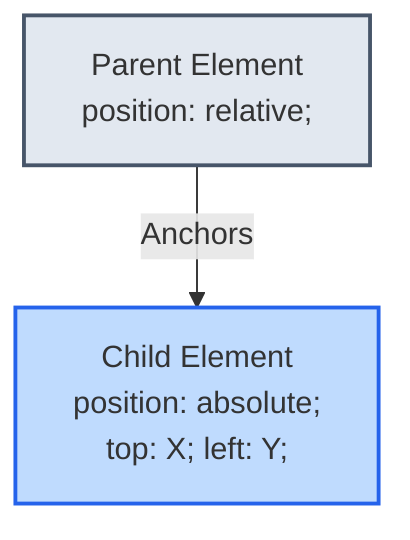
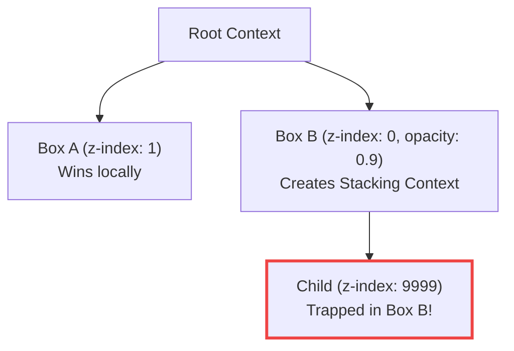
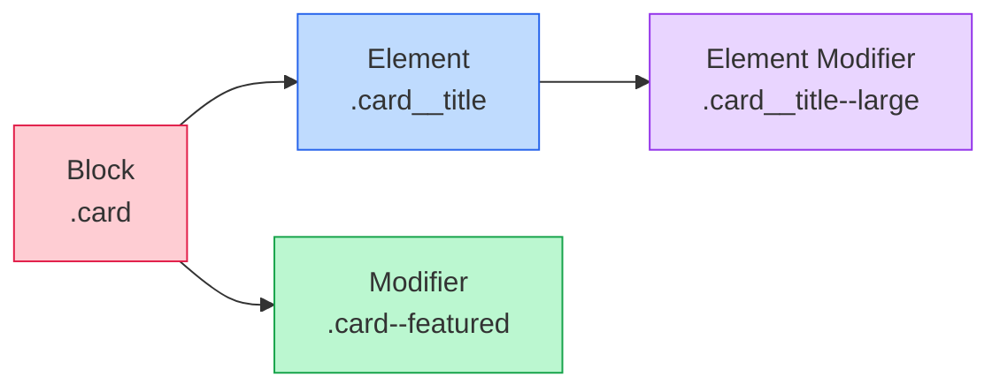

# Lecture 05 — CSS Layout: Positioning, Floats & Display

**Course:** Full-Stack Web Development  
**Instructor:** Kyrillos Medhat  
**Duration:** 3 hours (Theory + Lab)

---

## 📋 Prerequisites

> Before starting this lecture, make sure you have:
> - ✅ Completed Lecture 04 (CSS3 Fundamentals & Selectors)
> - ✅ A solid understanding of the CSS Box Model (margin, border, padding)
> - ✅ Familiarity with CSS specificity and cascade rules
> - ✅ A code editor (like VS Code) installed and running

---

## 🎯 Learning Objectives

By the end of this lecture, you will be able to:
- Explain the `display` property and name at least six of its values
- Differentiate between `display: none` and `visibility: hidden`
- Identify the five CSS positioning schemes and when to use each
- Build components using the **positioned ancestor** pattern (relative parent + absolute child)
- Use `z-index` correctly and understand stacking contexts
- Clear a float-collapsed container with `display: flow-root`
- Choose the right `overflow` value for a given layout problem
- Build a modal overlay using both the legacy approach and native `<dialog>`
- Apply the **BEM** naming convention to real HTML components

---

## 📋 Agenda

### Part 1 — Theory (~90 minutes)
1. The `display` property
2. `display: none` vs `visibility: hidden`
3. CSS Positioning (static → sticky)
4. The Positioned Ancestor Concept
5. Z-Index & Stacking Contexts
6. Legacy Floats & Clearing
7. The `overflow` Property
8. Overlays: Old Way vs Native `<dialog>`
9. BEM Naming Convention

### Part 2 — Practice & Lab (~90–120 minutes)
1. Lab 1: Sticky Nav with Dropdown
2. Lab 2: CSS-Only Modal using `:target`
3. Portfolio Project Part 4

---

## 1. The `display` Property

Every HTML element is a **box**. The `display` property controls two things: how the box behaves **externally** (own line or inline?) and how its **children** are laid out internally.

> 🛋️ **Block** elements are like sofas — wall-to-wall, nothing beside them. **Inline** elements are like throw pillows — side-by-side, only as wide as needed.

### `display: block`

- Takes full width of its parent, starts on a new line
- Accepts `width`, `height`, `margin`, `padding`
- Default for: `<div>`, `<p>`, `<h1>`–`<h6>`, `<section>`, `<article>`, `<header>`, `<footer>`, `<nav>`

```css
.card {
  display: block;       /* Default for <div> — listed for clarity */
  width: 300px;
  margin: 0 auto;       /* auto margins centre a block element */
}
```

### `display: inline`

- Only as wide as its content, flows alongside other inline elements
- **Ignores** `width` and `height` — setting them has no effect
- Default for: `<span>`, `<a>`, `<strong>`, `<em>`, `<label>`

```css
span {
  width: 200px;     /* ❌ IGNORED on inline elements */
  height: 100px;    /* ❌ IGNORED */
  background: gold; /* ✅ This works — colours the content area */
}
```

### `display: inline-block`

A **hybrid**: flows inline like `<span>`, but respects `width`, `height`, `margin`, and `padding` like a block. Great for nav items and buttons.

```css
.box {
  display: inline-block;
  width: 120px;
  height: 80px;          /* ✅ Now this works */
  margin-right: 8px;
}
```

> [!NOTE]
> `inline-block` elements with whitespace in HTML render a ~4px gap between them. Fix by removing whitespace in HTML or switching to Flexbox.

### `display: none`

Completely removes the element from the page — no space reserved. Covered in detail in the next section.

### `display: flex` / `display: grid`

Turn the element into a **flex** or **grid** container. Children become flex/grid items with powerful alignment controls. Covered in depth in Lectures 05 and 06.

```css
.navbar { display: flex; justify-content: space-between; align-items: center; gap: 16px; }
.gallery { display: grid; grid-template-columns: repeat(3, 1fr); gap: 24px; }
```

### Quick Reference

| Value | New line? | Accepts width/height? | Children layout |
|-------|:---------:|:---------------------:|-----------------|
| `block` | ✅ | ✅ | Normal flow |
| `inline` | ❌ | ❌ | Normal flow |
| `inline-block` | ❌ | ✅ | Normal flow |
| `none` | — | — | — |
| `flex` | ✅ | ✅ | Flexbox |
| `grid` | ✅ | ✅ | Grid |

---

## 2. `display: none` vs `visibility: hidden`

Both hide elements, but they behave **very differently** — a classic interview question.

> Think of cinema seats: `display: none` = you left, your seat collapses. `visibility: hidden` = you're hiding under a coat, your seat is still reserved.

```css
.gone    { display: none; }       /* Removed from flow — Box 3 slides up */
.hidden  { visibility: hidden; }  /* Invisible but space is preserved */
```

| Technique | Removed from flow? | Screen reader? | Focusable? |
|-----------|:------------------:|:--------------:|:----------:|
| `display: none` | ✅ Yes | ❌ No | ❌ No |
| `visibility: hidden` | ❌ No | ❌ No | ❌ No |
| `opacity: 0` | ❌ No | ✅ Yes | ✅ Yes |

| Use case | Best choice |
|----------|-------------|
| Toggle element in/out (dropdown, tab) | `display: none` ↔ `display: block` |
| Hide but preserve layout | `visibility: hidden` |
| Fade in/out with CSS transition | `opacity: 0` ↔ `opacity: 1` |
| Hide visually, keep for screen readers | `.visually-hidden` utility class |

> [!IMPORTANT]
> The `.visually-hidden` pattern (`position: absolute; width: 1px; height: 1px; overflow: hidden; clip: rect(0,0,0,0);`) hides content visually while keeping it accessible to screen readers.

---

## 3. CSS Positioning

By default every element sits in the **normal document flow**. The `position` property lets you break elements out and place them precisely. The offset properties `top`, `right`, `bottom`, `left` control placement.

### `position: static` (default)

Normal flow — offset properties and `z-index` have **no effect**. You rarely write this explicitly.

### `position: relative`

Moves the element from its natural position but **keeps its original space** reserved. Two purposes: fine-tuning position, and **establishing a positioning context** for absolute children.

```css
.shifted {
  position: relative;
  top: 20px;    /* Moves DOWN 20px from natural position */
  left: 30px;   /* Moves RIGHT 30px — original space still reserved */
}
```

### `position: absolute`

**Removed from flow** — other elements ignore it. Positioned relative to the **nearest positioned ancestor** (any ancestor with `position` other than `static`). If none exists, it anchors to the `<html>` element.

```css
.card         { position: relative; }  /* The anchor */
.card__badge  {
  position: absolute;
  top: 12px; right: 12px;             /* 12px from card's top-right corner */
}
```

> [!IMPORTANT]
> **Golden rule**: Always set `position: relative` on the parent before using `absolute` on a child. Without it, the child escapes to the nearest positioned ancestor — often the entire page.

### `position: fixed`

Locked to the **viewport** — never scrolls away. Common for navbars, FABs, and cookie banners.

```css
.navbar {
  position: fixed;
  top: 0; left: 0; right: 0;
  height: 60px;
  z-index: 1000;
}
body { padding-top: 60px; }  /* Compensate for fixed nav */
```

### `position: sticky`

Flows normally until a scroll threshold is hit, then **sticks** like `fixed` until its parent scrolls out of view.

```css
.section-header {
  position: sticky;
  top: 60px;       /* Sticks 60px from viewport top */
  z-index: 10;
  background: white;
}
```

> [!TIP]
> Sticky silently **fails** if any ancestor has `overflow: hidden`, `scroll`, or `auto`. This is the #1 sticky bug.

### Positioning Cheatsheet

| Value | In flow? | Reference point | Offsets work? |
|-------|:--------:|-----------------|:-------------:|
| `static` | ✅ | — | ❌ |
| `relative` | ✅ (space kept) | Own natural position | ✅ |
| `absolute` | ❌ | Nearest positioned ancestor | ✅ |
| `fixed` | ❌ | Viewport | ✅ |
| `sticky` | ✅ (until threshold) | Viewport after threshold | ✅ |

---

## 4. The Positioned Ancestor Concept

This is the most misunderstood CSS concept. The pattern is simple:



The child's offsets are measured from the **padding edge** of the nearest non-static ancestor.

```css
/* Tooltip example */
.btn-with-tooltip { position: relative; }
.tooltip {
  position: absolute;
  bottom: calc(100% + 8px);   /* Above the button + 8px gap */
  left: 50%;
  transform: translateX(-50%); /* Centre horizontally */
  opacity: 0; visibility: hidden;
  transition: opacity 0.2s, visibility 0.2s;
}
.btn-with-tooltip:hover .tooltip { opacity: 1; visibility: visible; }
```

---

## 5. Z-Index & Stacking Contexts

`z-index` controls which element appears **on top** when elements overlap. Higher number = on top.

> [!NOTE]
> `z-index` **only works on positioned elements** (anything except `position: static`).

**Use a z-index scale** instead of magic numbers:

```css
:root {
  --z-base:     1;
  --z-dropdown: 100;
  --z-sticky:   200;
  --z-fixed:    300;
  --z-modal:    400;
  --z-toast:    500;
}
```

### Stacking Contexts

A **stacking context** is an isolated "sub-stack." Children's `z-index` values only compete **within their parent's context** — they can't escape it.

**What creates a new stacking context?**
- `position` (non-static) + `z-index` (non-auto)
- `opacity` less than 1
- `transform`, `filter`, or `will-change` with non-default values



```css
.box-a { position: relative; z-index: 1; }   /* Above box-b globally */
.box-b { position: relative; z-index: 0; opacity: 0.99; } /* Creates stacking context */
.child  { position: relative; z-index: 9999; }
/* .child CANNOT appear above .box-a — it's trapped inside .box-b's context */
```

> [!WARNING]
> If your `z-index: 9999` isn't working, check if a parent has `opacity < 1`, `transform`, or `filter` — any of these trap the element in a stacking context.

---

## 6. Legacy Floats & Clearing

Floats were the layout tool before Flexbox/Grid. Today they're mainly used for **wrapping text around images**.

```css
img.article-image {
  float: left;
  margin-right: 16px;
  margin-bottom: 8px;
}
```

### The Float Collapse Problem

If a parent contains **only** floated children, it collapses to **zero height**.

```css
/* ❌ Problem: .container height = 0 */
.container { background: #dbeafe; border: 2px solid #3b82f6; }
.floated   { float: left; width: 100px; height: 100px; }

/* ✅ Fix: display: flow-root creates a Block Formatting Context */
.container { display: flow-root; }
```

| Fix Method | Recommended? |
|-----------|:------------:|
| `display: flow-root` | ✅ Modern & clean |
| `clearfix::after { clear: both }` | ⚠️ Legacy hack |
| `overflow: hidden` | ⚠️ Has side effects (clips content) |

> [!TIP]
> In new code, prefer Flexbox or Grid over floats entirely. Use floats only for text-wrapping around images.

---

## 7. The `overflow` Property

Controls what happens when content is **larger than its container**.

| Value | Behaviour |
|-------|-----------|
| `visible` (default) | Content spills outside the box |
| `hidden` | Content is clipped at the edge |
| `scroll` | Always shows scrollbars |
| `auto` | Scrollbars only when needed — **use this most often** |

```css
.chat-window { height: 400px; overflow-y: auto; overflow-x: hidden; }
.card        { border-radius: 12px; overflow: hidden; } /* Clips image corners */
```

> [!WARNING]
> `overflow: hidden` on a parent clips absolutely positioned children and **prevents `position: sticky` from working** on any descendants.

---

## 8. Overlays: Old Way vs Native `<dialog>`

### Old Way: Manual overlay with `z-index`

```css
.overlay {
  position: fixed; inset: 0;
  background: rgba(0,0,0,0.5);
  display: flex; align-items: center; justify-content: center;
  z-index: 9999;
  opacity: 0; visibility: hidden;
}
.overlay.is-active { opacity: 1; visibility: visible; }
```

Problems: no focus trapping, no Escape key, manual scroll lock, can be beaten by stacking contexts.

### Modern Way: Native `<dialog>`

```html
<dialog id="confirm-dialog" class="modal-dialog">
  <h2>Confirm Delete</h2>
  <p>Are you sure? This cannot be undone.</p>
  <form method="dialog">
    <button value="cancel">Cancel</button>
    <button value="confirm">Delete</button>
  </form>
</dialog>
```

```css
dialog.modal-dialog { border: none; border-radius: 12px; padding: 32px; max-width: 480px; }
dialog.modal-dialog::backdrop { background: rgba(0,0,0,0.5); backdrop-filter: blur(4px); }
```

```js
const dialog = document.getElementById('confirm-dialog');
document.getElementById('open-btn').addEventListener('click', () => dialog.showModal());
dialog.addEventListener('close', () => console.log(dialog.returnValue));
```

### Comparison

| Feature | Old `z-index` overlay | Native `<dialog>` |
|---------|:---------------------:|:------------------:|
| Focus trapping | ❌ Manual | ✅ Built-in |
| Escape to close | ❌ Manual | ✅ Built-in |
| Scroll lock | ❌ Manual | ✅ Built-in |
| Above stacking contexts | ❌ Can be beaten | ✅ Top Layer |
| Backdrop styling | ❌ Manual div | ✅ `::backdrop` |
| Accessibility | ❌ Manual ARIA | ✅ Native |

> [!TIP]
> Use `dialog.showModal()` (not `dialog.show()`) for true modal behaviour with focus trapping and backdrop.

---

## 9. BEM Naming Convention

**BEM** = **Block** / **Element** / **Modifier** — a naming convention that makes CSS self-documenting.



```
.block                    →  standalone component
.block__element           →  part of the block (double underscore)
.block--modifier          →  variation/state (double hyphen)
.block__element--modifier →  variation of an element
```

```html
<!-- ✅ BEM: self-documenting -->
<article class="card card--featured">
  <div class="card__body">
    <h2 class="card__title card__title--large">...</h2>
    <span class="card__badge card__badge--new">NEW</span>
  </div>
</article>
```

**Key rules:**
1. Elements belong to blocks — `.card__title`, not `.card .title`
2. No nested elements — no `.card__body__title` (make `body` its own block instead)
3. Modifiers are **additions**, not replacements — `class="card card--featured"`, never just `class="card--featured"`
4. Keep CSS selectors **flat** — avoid `.card .card__title {}` nesting

---

## 🧠 Think Like a Developer

### Scenario 1: A Button with an Icon and Notification Dot
> You need a notification bell icon with a small red dot badge overlapping the top right corner.

**Decision:** You use the **positioned ancestor** pattern. The `<button>` gets `position: relative`. The `<span class="badge">` gets `position: absolute; top: 0; right: 0;`. Then, you refine the positioning with negative margins or `transform: translate(50%, -50%)` to make it perfectly overlap the corner.

### Scenario 2: Unclickable Elements Below a Modal
> You built a custom modal (without `<dialog>`), but you notice that even when the modal is closed, the buttons directly underneath it can't be clicked.

**Decision:** This happens because you used `opacity: 0` without hiding the overlay properly. The overlay is invisible, but physically covering the page. You fix it by adding `visibility: hidden;` to the closed state, which ignores mouse events, or by switching to a proper `<dialog>` element.

---

## ❌→✅ Before vs After

### 1. The Positioned Ancestor
```css
/* ❌ Before: The tooltip escapes to the body */
.card-button {
  display: block;
}
.tooltip {
  position: absolute;
  top: 100%;
}

/* ✅ After: The parent anchors the tooltip */
.card-button {
  display: block;
  position: relative;
}
.tooltip {
  position: absolute;
  top: 100%;
}
```

### 2. BEM Classes
```html
<!-- ❌ Before: Messy and collision-prone classes -->
<div class="profile-card active">
  <div class="user-details">
    <span class="large name">John</span>
  </div>
</div>

<!-- ✅ After: BEM format -->
<div class="profile-card profile-card--active">
  <div class="profile-card__details">
    <span class="profile-card__name profile-card__name--large">John</span>
  </div>
</div>
```

---

## ⚠️ Common Mistakes & How to Avoid Them

| ❌ Mistake | ✅ Fix |
|-----------|--------|
| Setting `width`/`height` on an `inline` element | Switch to `inline-block` or `block` |
| Absolutely positioned element flies to wrong place | Add `position: relative` to the intended parent |
| `z-index: 9999` still appears below another element | Check if a parent has `opacity < 1`, `transform`, or `filter` (stacking context trap) |
| Content hidden behind fixed navbar | Add `padding-top` to `<body>` equal to nav height |
| `position: sticky` not working | Remove `overflow: hidden/auto/scroll` from ancestor elements |
| Float-collapsed container (0 height) | Add `display: flow-root` to the parent |
| Unexpected horizontal scrollbar | Debug with `* { outline: 1px solid red }` to find the overflowing element |
| Using only the modifier class in BEM | Always include both: `class="card card--featured"` |
| Using `display: none` but needing screen reader access | Use the `.visually-hidden` CSS pattern instead |
| Dropdown closes when moving mouse diagonally to it | Add padding buffer on the dropdown to bridge the gap |
| Building a `div`-based modal | Use native `<dialog>` — 97%+ browser support |

---

## 🧪 Practice Labs

### Lab 1: Sticky Nav with Dropdown (40 min)

**Goal:** Build a fixed navigation bar with a CSS-only hover dropdown using BEM.

**Key concepts applied:** `position: fixed`, `position: absolute`, `z-index`, BEM, `:hover` reveal.

1. **HTML Structure:**
```html
<header class="site-header">
  <nav class="nav">
    <a href="/" class="nav__brand">🌐 MyBrand</a>
    <ul class="nav__list">
      <li class="nav__item"><a href="#home" class="nav__link">Home</a></li>
      <li class="nav__item nav__item--has-dropdown">
        <a href="#about" class="nav__link">About ▾</a>
        <ul class="nav__dropdown">
          <li><a href="#team" class="nav__dropdown-link">Our Team</a></li>
          <li><a href="#process" class="nav__dropdown-link">Our Process</a></li>
          <li><a href="#awards" class="nav__dropdown-link">Awards</a></li>
        </ul>
      </li>
      <li class="nav__item"><a href="#work" class="nav__link">Work</a></li>
      <li class="nav__item"><a href="#contact" class="nav__link nav__link--cta">Contact</a></li>
    </ul>
  </nav>
</header>
```

2. **Core CSS:**
```css
:root { --nav-height: 64px; --nav-bg: #0f172a; }
body  { padding-top: var(--nav-height); }

.site-header {
  position: fixed; top: 0; left: 0; right: 0;
  height: var(--nav-height); background: var(--nav-bg); z-index: 1000;
}
.nav { display: flex; align-items: center; justify-content: space-between; height: 100%; max-width: 1200px; margin: 0 auto; padding: 0 24px; }
.nav__list { display: flex; align-items: center; gap: 4px; list-style: none; }
.nav__item { position: relative; }  /* Anchor for dropdown */
.nav__link { display: block; padding: 10px 14px; color: #e2e8f0; text-decoration: none; border-radius: 6px; }
.nav__link:hover { color: white; background: rgba(255,255,255,0.06); }
.nav__link--cta { background: #6366f1; color: white; }

/* Dropdown */
.nav__dropdown {
  position: absolute; top: calc(100% + 8px); left: 0; min-width: 200px;
  background: #1e293b; border-radius: 8px; list-style: none; padding: 6px;
  opacity: 0; visibility: hidden; transform: translateY(-8px);
  transition: opacity 0.2s, visibility 0.2s, transform 0.2s;
}
.nav__item--has-dropdown:hover .nav__dropdown {
  opacity: 1; visibility: visible; transform: translateY(0);
}
.nav__dropdown-link { display: block; padding: 10px 14px; color: #cbd5e1; text-decoration: none; border-radius: 6px; }
.nav__dropdown-link:hover { background: rgba(255,255,255,0.08); color: white; }
```

### Lab 2: CSS-Only Modal using `:target` (20 min)

**Goal:** Build a functional modal using only HTML + CSS — no JavaScript — by leveraging the `:target` pseudo-class.

1. **HTML Structure:**
```html
<main class="page">
  <h1>CSS-Only Modal Demo</h1>
  <a href="#contact-modal" class="btn btn--primary">Open Modal</a>
</main>

<div class="modal" id="contact-modal">
  <a href="#" class="modal__backdrop" aria-label="Close modal"></a>
  <div class="modal__panel">
    <a href="#" class="modal__close" aria-label="Close">&times;</a>
    <h2 class="modal__title">Get in Touch</h2>
    <form class="modal__form">
      <input type="text" placeholder="Your Name" required>
      <input type="email" placeholder="Email" required>
      <textarea rows="4" placeholder="Message..." required></textarea>
      <button type="submit" class="btn btn--primary">Send</button>
    </form>
  </div>
</div>
```

2. **Core CSS:**
```css
.modal {
  position: fixed; inset: 0; display: flex; align-items: center; justify-content: center;
  z-index: 1000; opacity: 0; visibility: hidden; transition: opacity 0.25s, visibility 0.25s;
}
.modal:target { opacity: 1; visibility: visible; }
.modal__backdrop { position: absolute; inset: 0; background: rgba(0,0,0,0.5); }
.modal__panel {
  position: relative; background: white; border-radius: 12px; padding: 40px;
  max-width: 500px; width: 100%; transform: translateY(20px); transition: transform 0.25s;
}
.modal:target .modal__panel { transform: translateY(0); }
.modal__close { position: absolute; top: 16px; right: 16px; text-decoration: none; font-size: 1.25rem; }
```

---

## 📝 Assignment: Portfolio Project Part 4

**Due:** Next class session

### Requirements

1. **Fixed Navigation Bar** — `position: fixed`, proper `z-index`, `padding-top` on body, at least 3 links
2. **Hero Section with Absolute Positioning** — `100vh` tall, at least one absolutely positioned decorative element inside a `position: relative` parent
3. **Project Cards with Hover Overlay** — Grid of cards, each with `position: absolute; inset: 0` overlay that fades in on hover
4. **Skills Section with Sticky Heading** — `position: sticky` heading with `top` offset accounting for nav height
5. **Contact Modal** — Uses native `<dialog>` with `.showModal()`, styled `::backdrop`, at least 3 form fields
6. **BEM Throughout** — All class names follow Block__Element--Modifier convention

### Submission Checklist

- [ ] Fixed nav stays visible on scroll; body has matching `padding-top`
- [ ] Hero has absolutely positioned child in a relative parent
- [ ] Project cards have hover overlays using `position: absolute; inset: 0`
- [ ] Skills heading is sticky with correct `top` offset
- [ ] Contact modal uses `<dialog>` + `.showModal()`; `::backdrop` styled
- [ ] All CSS classes follow BEM
- [ ] Z-index uses CSS variables (no magic numbers)
- [ ] Page is responsive (375px, 768px, 1280px)

---

## 💼 Interview Prep

**Q1: What is the difference between `display: none` and `visibility: hidden`?**
> `display: none` completely removes the element from the document flow, meaning other elements will shift to take its place. `visibility: hidden` hides the element visually, but its physical space remains reserved in the layout. Both methods hide the element from screen readers.

**Q2: How does `position: absolute` calculate its placement?**
> An absolutely positioned element is removed from the normal document flow. Its top, bottom, left, and right properties are calculated relative to the padding edge of its **nearest positioned ancestor** (any ancestor with a `position` value other than `static`). If no such ancestor exists, it is positioned relative to the initial containing block (the document).

**Q3: What causes a `z-index` rule to fail, even if you set it to `9999`?**
> `z-index` only works on elements that are positioned (non-static). Even if positioned, an element with `z-index: 9999` can fail to appear on top if one of its parent elements forms a new **stacking context** (via opacity, transform, filter, etc.) and has a lower z-index than the element it is competing against globally. The child is trapped inside its parent's stacking context.

**Q4: What is the BEM methodology?**
> BEM stands for Block, Element, Modifier. It is a CSS class naming convention that makes CSS modular and self-documenting. A `Block` is a standalone entity (e.g., `.card`), an `Element` is a part of the block (`.card__title`), and a `Modifier` represents a state or variation (`.card--featured`). It keeps CSS specificity flat and manageable.

---

## 📄 Cheat Sheet

### Display Types
| Property | Line Break | Respects Width/Height |
|----------|------------|------------------------|
| `display: block` | Yes | Yes |
| `display: inline` | No | No |
| `display: inline-block` | No | Yes |

### Positioning Schemas
| `position` | Document Flow | Offsets relative to... |
|------------|---------------|-------------------------|
| `static` | In flow | N/A (Offsets ignored) |
| `relative` | In flow | Its normal position |
| `absolute` | Removed | Nearest positioned ancestor |
| `fixed` | Removed | The viewport |
| `sticky` | In flow | The viewport (upon scroll) |

### Overflow Values
| `overflow` | Behaviour |
|------------|-----------|
| `visible` | Content spills out |
| `hidden` | Content is clipped |
| `scroll` | Scrollbars always shown |
| `auto` | Scrollbars shown only if needed |

---

## 🔗 Resources

- [MDN — display](https://developer.mozilla.org/en-US/docs/Web/CSS/display) · [MDN — position](https://developer.mozilla.org/en-US/docs/Web/CSS/position) · [MDN — z-index](https://developer.mozilla.org/en-US/docs/Web/CSS/z-index)
- [MDN — `<dialog>`](https://developer.mozilla.org/en-US/docs/Web/HTML/Element/dialog) · [MDN — overflow](https://developer.mozilla.org/en-US/docs/Web/CSS/overflow) · [MDN — float](https://developer.mozilla.org/en-US/docs/Web/CSS/float)
- [What No One Told You About z-index — Philip Walton](https://philipwalton.com/articles/what-no-one-told-you-about-z-index/)
- [BEM Official Methodology](https://getbem.com/) · [BEM Cheat Sheet](https://9elements.com/bem-cheat-sheet/)

---

## 📌 Key Takeaways

1. **`display` is the foundation** — block, inline, inline-block are building blocks; flex/grid are power tools.
2. **`display: none`** removes from flow; **`visibility: hidden`** hides but preserves space.
3. **Positioning is a 5-value system**: static → relative → absolute → fixed → sticky.
4. **Positioned ancestor pattern** is everywhere: parent `relative` + child `absolute`.
5. **`z-index`** only works on positioned elements and is trapped inside stacking contexts.
6. **Float collapse** → fix with `display: flow-root`; prefer Flexbox/Grid for new layouts.
7. **`overflow: auto`** is almost always what you want for scrollable containers.
8. **`<dialog>`** is the modern, accessible way to build modals — use `showModal()`.
9. **BEM** = Block `__` Element `--` Modifier — prevents specificity wars.
10. **Use CSS variables for z-index** — a scale prevents z-index wars.

---

**Next Lecture:** [Lecture 06 — Modern Layout: Flexbox →](../06%20-%20Modern%20Layout%20-%20Flexbox/06%20-%20Modern%20Layout%20-%20Flexbox.md)

### 📚 Extensive Tutorials & Resources
- **MDN Web Docs:** [CSS Positioning](https://developer.mozilla.org/en-US/docs/Learn/CSS/CSS_layout/Positioning)
- **CSS-Tricks:** [How CSS Position Works](https://css-tricks.com/almanac/properties/p/position/)
- **MDN Web Docs:** [Understanding CSS z-index](https://developer.mozilla.org/en-US/docs/Web/CSS/CSS_positioned_layout/Understanding_z-index)
- **CSS-Tricks:** [All About Floats](https://css-tricks.com/all-about-floats/)
- **MDN Web Docs:** [The HTML Dialog Element](https://developer.mozilla.org/en-US/docs/Web/HTML/Element/dialog)
- **FreeCodeCamp:** [BEM Style Naming Convention for CSS](https://www.freecodecamp.org/news/bem-style-naming-convention-for-css/)
