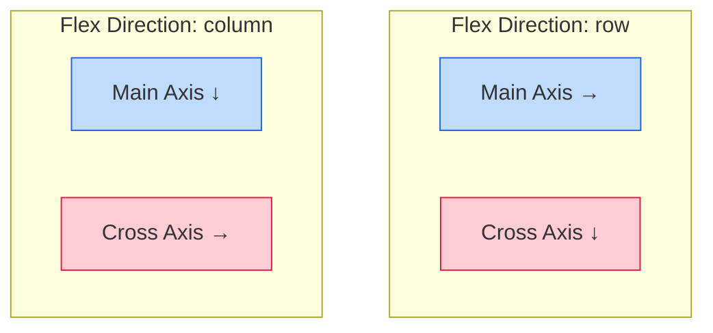

# Lecture 06 — Modern Layout: Flexbox

**Course:** Full-Stack Web Development  
**Instructor:** Kyrillos Medhat  
**Duration:** 3 hours (Theory + Lab)

---

## 📋 Prerequisites

> Before starting this lecture, make sure you have:
> - ✅ Completed Lecture 05 (CSS Layout: Positioning, Floats & Display)
> - ✅ A strong understanding of the CSS Box Model
> - ✅ Familiarity with Block vs Inline element behaviour
> - ✅ A code editor (like VS Code) installed and running

---

## 🎯 Learning Objectives

By the end of this lecture you will be able to:
- Explain what Flexbox is and the specific layout problems it solves
- Identify the **flex container** and **flex items** in any layout
- Understand and manipulate the **main axis** and **cross axis**
- Use `flex-direction`, `justify-content`, `align-items`, `align-content`, and `flex-wrap`
- Control individual items with `flex-grow`, `flex-shrink`, `flex-basis`, `order`, and `align-self`
- Use the `flex` shorthand confidently to divide space
- Build real-world patterns: navbar, card grid, sidebar layout, and sticky footer

---

## 📋 Agenda

### Part 1 — Theory (~90 minutes)
1. Why Old CSS Layout Was Hard
2. What is Flexbox?
3. Flex Container vs. Flex Items
4. The Two Axes (Main & Cross)
5. `flex-direction`
6. `justify-content`
7. `align-items`
8. `flex-wrap` & `align-content`
9. `gap`
10. `flex-grow`, `flex-shrink`, `flex-basis`
11. The `flex` Shorthand
12. `order` & `align-self`
13. Real-World Patterns

### Part 2 — Practice & Lab (~90–120 minutes)
1. Lab 1: Holy Grail Layout
2. Lab 2: Pricing Card Grid
3. Portfolio Project Part 5

---

## 1. Why Old CSS Layout Was Hard

Before Flexbox, developers relied on **floats** (designed for wrapping text around images, not page layout) and **absolute positioning** (fragile for responsive designs). These hacks meant:

- Manually clearing floats to prevent parent containers from collapsing to zero height
- Vertical centering required absurd workarounds (like `display: table-cell` or `transform: translate(-50%, -50%)`)
- Equal-height columns required JavaScript, fake background image columns, or complex table hacks
- Distributing remaining space proportionally was mathematically painful or impossible with CSS alone

CSS desperately needed a **first-class layout system** designed specifically for application interfaces. That system is **Flexbox**.

> [!NOTE]
> Floats still work for wrapping text around images. They're just the wrong tool for page layout.

---

## 2. What is Flexbox?

**Flexbox** (Flexible Box Layout) is a CSS layout mode that arranges child elements in a row or column and distributes space between them dynamically. It is supported in **all modern browsers**.

> [!IMPORTANT]
> Flexbox is **one-dimensional** — it works in a row OR a column, not both simultaneously. For true two-dimensional layout (rows and columns at the same time), use **CSS Grid** (covered in the next lecture).

---

## 3. Flex Container vs. Flex Items

Flexbox has two distinct levels of control — imagine a **train and its cars**: 
The train (container) controls the overall direction and spacing, while each car (item) controls how much of the track it occupies.

- **Flex Container** — the parent element, activated with `display: flex` or `display: inline-flex`
- **Flex Items** — the **direct children** only. Grandchildren and deeper descendants are NOT flex items; they just follow normal flow unless their parent is also made a flex container.

```css
.container {
  display: flex; /* This turns the container into a flex context */
  /* All direct children automatically become flex items */
}
```

### Property Ownership

Flexbox properties are strictly divided between the container and the items. A common beginner mistake is applying an item property to a container, or vice versa.

| Container Properties (The Track) | Item Properties (The Cars) |
|-----------------------------------|----------------------------|
| `display: flex` | `flex-grow` |
| `flex-direction` | `flex-shrink` |
| `justify-content` | `flex-basis` |
| `align-items` | `flex` (shorthand) |
| `align-content` | `align-self` |
| `flex-wrap` | `order` |
| `gap` | |

> [!TIP]
> Ask yourself: "Am I arranging the **whole group**? → Use a Container property. Am I controlling **one specific item**? → Use an Item property."

---

## 4. The Two Axes

Every Flexbox layout is governed by two perpendicular axes:



- **Main Axis** — the direction items are placed (controlled by `flex-direction`)
- **Cross Axis** — perpendicular to the main axis

| Property | Controls Alignment Along... |
|----------|-----------------------------|
| `justify-content` | **Main** axis |
| `align-items` | **Cross** axis |
| `align-content` | **Cross** axis (multi-line only) |

> [!WARNING]
> The axes **rotate** when you change `flex-direction`. In `column` mode, the main axis goes top-to-bottom. Therefore, `justify-content` controls vertical spacing and `align-items` controls horizontal alignment. This is the #1 source of beginner confusion.

---

## 5. `flex-direction`

Sets the direction of the main axis, defining how items are laid out in the container.

| Value | Items Travel |
|-------|-------------|
| `row` (default) | Left → Right |
| `row-reverse` | Right → Left |
| `column` | Top → Bottom |
| `column-reverse` | Bottom → Top |

```css
.container { 
  display: flex; 
  flex-direction: column; 
}
```

**When to use each:** 
- `row` for navbars, toolbars, and horizontal card lists.
- `column` for vertical stacks, mobile layouts, and form fields.
- `row-reverse` for RTL languages or flipping visual order without changing HTML.
- `column-reverse` for chat UIs (newest message at the bottom).

---

## 6. `justify-content`

Distributes **free space along the main axis**. It dictates how items are packed and spaced.

| Value | Behavior |
|-------|----------|
| `flex-start` (default) | Items packed tightly at the start of the axis |
| `flex-end` | Items packed tightly at the end of the axis |
| `center` | Items centered tightly together |
| `space-between` | First/last items touch the edges, equal gaps between items |
| `space-around` | Equal space around each item (edges get half-sized gaps) |
| `space-evenly` | Perfectly equal gaps everywhere, including the edges |

```css
/* Navbar: logo firmly on the left, links firmly on the right */
.navbar {
  display: flex;
  justify-content: space-between;
  align-items: center;
  padding: 0 20px;
  height: 60px;
}
```

> [!TIP]
> `space-between` is the most commonly used value in real projects — perfect for navbars, split headers, and card rows.

---

## 7. `align-items`

Aligns items along the **cross axis** (vertical alignment when the direction is `row`).

| Value | Behavior |
|-------|----------|
| `stretch` (default) | Items stretch to fill the entire cross-axis height/width |
| `flex-start` | Items snap to the top/start |
| `flex-end` | Items snap to the bottom/end |
| `center` | Items perfectly vertically centered |
| `baseline` | Items aligned by their text baseline (great for mixed font sizes) |

### ✨ Perfect Centering (2 lines!)

```css
.center-me {
  display: flex;
  justify-content: center; /* Centers horizontally (in row mode) */
  align-items: center;     /* Centers vertically */
  min-height: 100vh;       /* Container NEEDS height! */
}
```

> [!IMPORTANT]
> The container must have an explicit height for vertical centering to be visible. If it naturally shrinks to fit its content, there is no free space to center within.

---

## 8. `flex-wrap` & `align-content`

### `flex-wrap`

By default (`nowrap`), flexbox forces all items onto one line, squishing them to fit if necessary. Use `wrap` to let them flow onto new lines naturally.

| Value | Behavior |
|-------|----------|
| `nowrap` (default) | All items forced on one line, may shrink below their base size |
| `wrap` | Items wrap to new lines downward |
| `wrap-reverse` | Items wrap upward |

```css
.container {
  display: flex;
  flex-wrap: wrap;
  gap: 10px;
}

.item {
  flex: 0 0 200px; /* Wants to be 200px; will wrap when container < 200px */
}
```

### `align-content`

Controls how **multiple lines** are spaced along the cross axis. It takes the same values as `justify-content`, plus `stretch`. **It ONLY works when items wrap to multiple lines.**

| `align-items` vs | `align-content` |
|------------------|-----------------|
| Aligns individual items within each specific line | Distributes the entire blocks of lines within the container |
| Works with single or multi-line containers | Only works with multiple lines (`flex-wrap: wrap`) |

---

## 9. `gap`

Adds space specifically **between** items — never at the outer edges. It completely replaces the old, messy margin hack.

```css
/* ❌ Old way — messy and error-prone */
.item { margin-right: 15px; }
.item:last-child { margin-right: 0; }

/* ✅ New way — clean and foolproof */
.container {
  display: flex;
  gap: 15px;            /* Equal 15px gap everywhere */
  /* OR */ gap: 10px 20px; /* row-gap (10px) | column-gap (20px) */
}
```

---

## 10. `flex-grow`, `flex-shrink`, `flex-basis`

These three item properties answer one core question: **How big should this specific item be?**

| Property | Question It Answers | Default |
|----------|-------------------|---------|
| `flex-basis` | "What is my ideal starting size?" | `auto` |
| `flex-grow` | "Should I grow to absorb extra space?" (It's a ratio) | `0` |
| `flex-shrink` | "Should I shrink when space is tight?" (It's a ratio) | `1` |

### `flex-grow` Example

Think of `flex-grow` like splitting leftover pizza. Items with a higher `flex-grow` get proportionally more slices of the *remaining* space.

```css
.container { display: flex; width: 800px; }

/* The basis total is 300px. Leftover space is 500px. */
/* Total grow factors: 1 + 2 + 0 = 3 shares. */
/* 500px / 3 = 166.6px per share. */

.item-a { flex-basis: 100px; flex-grow: 1; } /* Gets 1 share: 100 + 166 = 266px */
.item-b { flex-basis: 100px; flex-grow: 2; } /* Gets 2 shares: 100 + 333 = 433px */
.item-c { flex-basis: 100px; flex-grow: 0; } /* Gets 0 shares: Stays at 100px */
```

### `flex-shrink` Example

Determines how space is subtracted when items overflow the container.

```css
.container { display: flex; width: 400px; }

/* Total basis is 600px. Deficit is 200px. */
.item-a { flex-basis: 300px; flex-shrink: 1; } /* Will shrink to absorb deficit */
.item-b { flex-basis: 300px; flex-shrink: 0; } /* Refuses to shrink — causes overflow! */
```

> [!WARNING]
> `flex-shrink: 0` means the item will **never** shrink below its `flex-basis`. This is a common cause of unexpected horizontal scrollbars.

---

## 11. The `flex` Shorthand

You should rarely write `grow`, `shrink`, and `basis` individually. The `flex` shorthand combines all three in that exact order (`grow | shrink | basis`).

| Shorthand | grow | shrink | basis | Best Use Case |
|-----------|------|--------|-------|---------------|
| `flex: 1` | 1 | 1 | 0% | Create perfectly equal columns |
| `flex: auto` | 1 | 1 | auto | Grow/shrink smoothly from their natural content size |
| `flex: none` | 0 | 0 | auto | Completely rigid, size based purely on content |
| `flex: 0 0 250px` | 0 | 0 | 250px | A fixed-width sidebar that never changes |
| `flex: 2` | 2 | 1 | 0% | Consume double the share of space as `flex: 1` items |

```css
/* Classic Sidebar + Main Content Layout */
.sidebar      { flex: 0 0 250px; } /* Fixed 250px width, absolutely rigid */
.main-content { flex: 1; }         /* Fills all remaining fluid space */
```

> [!TIP]
> `flex: 1` and `flex: 0 0 Xpx` will cover 80% of your real-world Flexbox use cases.

---

## 12. `order` & `align-self`

### `order`

Changes the **visual layout order** of items without changing the underlying HTML. The default order is `0`. Lower numbers appear first.

```css
/* HTML DOM order: A, B, C */
/* Displayed order: C, A, B */
.item-a { order: 1; }
.item-b { order: 2; }
.item-c { order: 0; }

/* Mobile reordering (Stacking a right sidebar below main content) */
@media (max-width: 768px) {
  .sidebar      { order: 2; }
  .main-content { order: 1; }
}
```

> [!WARNING]
> `order` only changes the visual layer. Screen readers, keyboard tabbing, and copy/paste operations will still follow the original HTML DOM order. Do not use `order` to fix fundamental logical grouping issues.

### `align-self`

Overrides the container's `align-items` rule for **one specific item**.

```css
.container   { display: flex; align-items: center; height: 200px; }
.special     { align-self: flex-end; } /* This specific item drops to the bottom */
```

Values: `auto` | `flex-start` | `flex-end` | `center` | `stretch` | `baseline`

---

## 13. Real-World Patterns

### Pattern 1: Navbar
A classic split navbar with a logo on the left and a list of links on the right.

```css
.navbar {
  display: flex;
  justify-content: space-between; /* Pushes outer items to edges */
  align-items: center;            /* Vertically centers text/logo */
  padding: 0 2rem;
  height: 64px;
}
.nav-links { 
  display: flex; 
  gap: 2rem; 
  list-style: none; 
}
```

### Pattern 2: Card Grid with Bottom-Aligned Buttons
A common problem: You have cards of varying heights based on text length, but you want all "Read More" buttons perfectly aligned at the bottom.

```css
.card-grid {
  display: flex;
  flex-wrap: wrap;         /* Allow multi-line grids */
  gap: 1.5rem;
}
.card {
  display: flex;
  flex-direction: column;  /* The card itself is a vertical flex container */
  flex: 1 1 280px;         /* Fluid width, 280px ideal base */
}
.card p { 
  flex-grow: 1;            /* Paragraph grows to fill empty vertical space */
}     
.card button { 
  margin-top: auto;        /* Auto margin pushes it down, or rely on the growing p */
}
```

### Pattern 3: Sticky Footer
The content is too short, so the footer awkwardly floats in the middle of the screen. Fix it with a flex column wrapper.

```css
.wrapper { 
  display: flex; 
  flex-direction: column; 
  min-height: 100vh;       /* Container must be at least screen height */
}
.header  { /* natural height */ }
.main    { flex: 1; }      /* Main grows to absorb all empty space, pushing footer down */
.footer  { /* natural height */ }
```

---

## 🧠 Think Like a Developer

### Scenario 1: The Overflowing Sidebar
> You build a dashboard with a sidebar and a main data table. When the table gets too wide with data, it pushes the sidebar entirely off the screen.

**Decision:** You don't try to constrain the table with fixed widths. Instead, you realize the sidebar needs to be rigid and the main content needs to be allowed to scroll.
You set `.sidebar { flex: 0 0 250px; }` to make it completely rigid (no grow, no shrink). You set `.main { flex: 1; min-width: 0; overflow-x: auto; }`. The `min-width: 0` is a crucial flexbox hack that allows the flex item to shrink smaller than its content, enabling internal scrolling.

### Scenario 2: The "Just Use Flexbox for Everything" Trap
> You are building a complex photo gallery with different sized images spanning multiple rows and columns in a masonry-style or strict grid pattern. You try to use `flex-wrap: wrap` and carefully calculated `flex-basis` percentages, but gaps keep misaligning.

**Decision:** You recognize you're using the wrong tool. Flexbox is 1-dimensional. It evaluates each wrapped row independently, which is why items won't vertically align with items in the row above them. You stop fighting Flexbox and switch to CSS Grid, which is explicitly designed for 2-dimensional layouts.

---

## ❌→✅ Before vs After

### 1. Perfect Centering
```css
/* ❌ Before: The hacky absolute positioning way */
.modal {
  position: absolute;
  top: 50%;
  left: 50%;
  transform: translate(-50%, -50%);
}

/* ✅ After: The clean flexbox way */
.overlay {
  display: flex;
  justify-content: center;
  align-items: center;
  min-height: 100vh;
}
```

### 2. Equal Spacing Between Items
```css
/* ❌ Before: Margins with pseudo-class cleanup */
.nav-item {
  margin-right: 20px;
}
.nav-item:last-child {
  margin-right: 0;
}

/* ✅ After: Modern Gap property */
.nav-list {
  display: flex;
  gap: 20px;
}
```

---

## ⚠️ Common Mistakes & How to Avoid Them

| ❌ Mistake | ✅ Fix |
|-----------|--------|
| `justify-content` on items instead of container | It's a **container** property — always goes on the parent |
| `align-content` has no effect | It only works with `flex-wrap: wrap` and multiple lines of wrapped content |
| `align-items: center` doesn't work vertically | The container needs an explicit `height` or `min-height` to have free space to center within |
| Using `width` instead of `flex-basis` | `flex-basis` correctly overrides `width` in a flex context and respects the flex algorithm — prefer it |
| `flex-shrink: 0` causes overflow | The item refuses to shrink. Add `overflow: auto` or remove the `0` |
| `order` breaks keyboard navigation | `order` only changes visual order — DOM order stays the same. Do not use for logical layout shifts |
| Axes swapped after `flex-direction: column` | Remember `justify-content` is now vertical, `align-items` is horizontal |
| Button not at bottom of a card | Make the card `flex-direction: column`, give the content above the button `flex-grow: 1` |
| Items overflow horizontally instead of wrapping | The default is `nowrap` — explicitly add `flex-wrap: wrap` to the container |

---

## 🧪 Practice Labs

### Lab 1: Holy Grail Layout (45 min)

Build the classic 5-region layout: **header → [left sidebar | main | right sidebar] → footer**.

1. **HTML Structure:**
```html
<div class="page-wrapper">
  <header class="site-header">Header</header>
  <div class="middle-row">
    <aside class="sidebar sidebar--left">Left Nav</aside>
    <main class="main-content">Main Content</main>
    <aside class="sidebar sidebar--right">Widgets</aside>
  </div>
  <footer class="site-footer">Footer</footer>
</div>
```

2. **Key CSS:**
```css
.page-wrapper {
  display: flex;
  flex-direction: column;
  min-height: 100vh;
}
.middle-row {
  display: flex;
  flex: 1;              /* Grow to fill space between header/footer */
}
.sidebar     { flex: 0 0 220px; }
.main-content { flex: 1; }

/* Responsive: stack on mobile */
@media (max-width: 768px) {
  .middle-row    { flex-direction: column; }
  .sidebar       { flex: none; width: 100%; }
  .main-content  { order: -1; } /* Main content first on mobile */
}
```

**Checklist:**
- [ ] Outer wrapper is a column flex container with `min-height: 100vh`
- [ ] Middle row is a row flex container with `flex: 1`
- [ ] Sidebars are fixed width (`flex: 0 0 220px`)
- [ ] Main content fills remaining space (`flex: 1`)
- [ ] Footer sticks to bottom even with little content
- [ ] Responsive breakpoint stacks layout vertically

### Lab 2: Pricing Card Grid (30 min)

Build 3 pricing cards (Starter, Pro, Enterprise) with different feature counts but **equal height** and **bottom-aligned buttons**.

1. **Key CSS:**
```css
.card-grid {
  display: flex;
  flex-wrap: wrap;
  gap: 1.5rem;
  justify-content: center;
}

.pricing-card {
  display: flex;
  flex-direction: column;
  flex: 1 1 280px;
  max-width: 360px;
  padding: 2rem;
}

.feature-list {
  flex-grow: 1;  /* KEY: pushes button to bottom of every card */
}

.cta-button {
  display: block;
  padding: 0.875rem;
  text-align: center;
}
```

**Checklist:**
- [ ] Card grid uses `display: flex` with `flex-wrap: wrap`
- [ ] Each card is a column flex container
- [ ] `flex-grow: 1` on feature list pushes buttons to bottom
- [ ] All cards are equal height regardless of content
- [ ] Featured card is visually distinct
- [ ] Layout is responsive on mobile

---

## 📝 Assignment: Portfolio Project Part 5

Rebuild your Portfolio Project layout using **Flexbox exclusively** — no floats, no absolute positioning for primary layout structural elements.

| Requirement | Points | Hint |
|-------------|--------|------|
| **Navbar** — logo left, links right | 10 | `justify-content: space-between` |
| **Hero** — text left, image right, vertically centered | 15 | `align-items: center`, text `flex: 1`, image `flex: 0 0 400px` |
| **Skills/Services cards** — 3–6 cards, equal height, wrapped | 20 | `flex-wrap: wrap`, `flex: 1 1 240px`, button pinned to bottom |
| **About section** — photo + bio side-by-side | 15 | `display: flex`, `gap: 3rem`, column on mobile |
| **Footer** — 3 columns + copyright bar | 10 | Each column `flex: 1` |
| **Responsive** — at least one breakpoint | 15 | `flex-direction: column` in `@media` query |
| **Perfect centering** — full-viewport CTA section | 15 | `justify-content: center` + `align-items: center` + `min-height: 100vh` |
| **Total** | **100** | |

---

## 💼 Interview Prep

**Q1: What is the difference between `align-items` and `align-content` in Flexbox?**
> `align-items` determines the alignment of individual flex items along the cross axis within a single line. `align-content` only takes effect when a flex container has multiple lines (`flex-wrap: wrap`); it aligns and spaces the entire blocks of lines within the container's available cross-axis space.

**Q2: How do you perfectly center an element both horizontally and vertically using Flexbox?**
> Add `display: flex;` to the parent container. Then add `justify-content: center;` to center along the main axis, and `align-items: center;` to center along the cross axis. Crucially, you must also ensure the parent has an explicit height (like `min-height: 100vh`) otherwise there is no vertical space for it to center within.

**Q3: Explain the `flex: 1` shorthand. What does it actually expand to?**
> `flex: 1` is shorthand for `flex-grow: 1`, `flex-shrink: 1`, and `flex-basis: 0%`. It tells the item to grow to consume all available space, shrink if necessary, and treat its initial starting width as 0, ensuring that multiple items with `flex: 1` will be mathematically perfectly equal in width regardless of their content.

**Q4: A flex item contains a very wide table, and it is stretching the parent flex container, causing the whole page to scroll horizontally. How do you fix it?**
> Flex items have an implicit `min-width: auto`, meaning they won't shrink smaller than their content. To fix this, apply `min-width: 0;` (or `overflow: hidden/auto`) to the flex item. This allows it to shrink below its content size, containing the overflow internally.

---

## 📄 Cheat Sheet

### The Parent (Flex Container)
```css
.container {
  display: flex;
  
  /* Direction of travel */
  flex-direction: row | row-reverse | column | column-reverse;
  
  /* Wrapping behavior */
  flex-wrap: nowrap | wrap | wrap-reverse;
  
  /* Alignment on MAIN axis */
  justify-content: flex-start | flex-end | center | space-between | space-around | space-evenly;
  
  /* Alignment on CROSS axis (single line) */
  align-items: stretch | flex-start | flex-end | center | baseline;
  
  /* Alignment of lines on CROSS axis (multi-line only) */
  align-content: flex-start | flex-end | center | space-between | space-around | stretch;
  
  /* Spacing between items */
  gap: 10px; /* row-gap column-gap */
}
```

### The Children (Flex Items)
```css
.item {
  /* order visually (default 0) */
  order: 1;
  
  /* Grow factor (default 0) */
  flex-grow: 1;
  
  /* Shrink factor (default 1) */
  flex-shrink: 0;
  
  /* Initial size (default auto) */
  flex-basis: 200px;
  
  /* Shorthand: grow shrink basis */
  flex: 1 0 200px;
  
  /* Override align-items for this specific item */
  align-self: auto | flex-start | flex-end | center | baseline | stretch;
}
```

---

## 🔗 Resources

- [MDN — Flexbox Concepts](https://developer.mozilla.org/en-US/docs/Web/CSS/CSS_flexible_box_layout/Basic_concepts_of_flexbox)
- [CSS-Tricks — Complete Guide to Flexbox](https://css-tricks.com/snippets/css/a-guide-to-flexbox/)
- [Flexbox Froggy](https://flexboxfroggy.com/) — Interactive game to learn Flexbox
- [Flexbox Defense](http://www.flexboxdefense.com/) — Tower defense game for Flexbox
- [Flexbox Playground](https://flexbox.netlify.app/) — Visual property explorer

---

## 📌 Key Takeaways

- `display: flex` on the parent activates Flexbox — direct children become flex items
- **Main axis** = direction of travel; **Cross axis** = perpendicular. `justify-content` → main, `align-items` → cross
- `flex-direction` rotates both axes — this changes what `justify-content` and `align-items` do
- **Perfect centering** = `justify-content: center` + `align-items: center` + explicit height
- `flex-wrap: wrap` allows multi-line layouts; `align-content` distributes those lines
- `gap` adds space between items without edge bleeding — replaces margin hacks
- **`flex` shorthand** = `grow | shrink | basis`. Use `flex: 1` for equal columns, `flex: 0 0 Xpx` for fixed sizes
- `order` reorders visually; `align-self` overrides one item's cross-axis alignment
- **Card bottom-align trick**: card as column flex container + `flex-grow: 1` on content above button

---

**Next Lecture:** [Lecture 07 — Modern Layout: CSS Grid →](./07%20-%20Modern%20Layout%20-%20CSS%20Grid.md)

### 📚 Extensive Tutorials & Resources
- **FreeCodeCamp:** [Responsive Web Design Certification](https://www.freecodecamp.org/learn/responsive-web-design/)
- **MDN Web Docs:** [HTML Structuring the Web](https://developer.mozilla.org/en-US/docs/Learn/HTML)
- **Web.dev:** [Learn HTML](https://web.dev/learn/html/)
