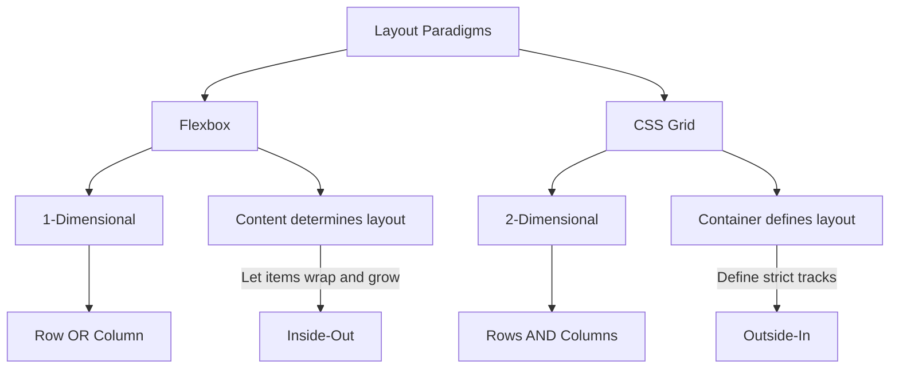
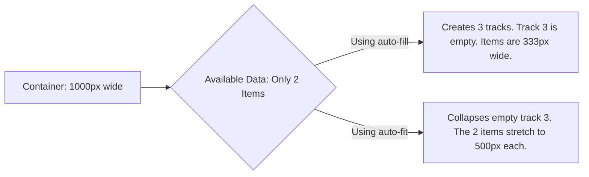

# Lecture 07 — Modern Layout: CSS Grid

**Course:** Full-Stack Web Development  
**Instructor:** Kyrillos Medhat  
**Duration:** 3 hours (Theory + Lab)

---

## 🛑 Prerequisites
Before diving into this lecture, you should:
- Understand the **CSS Box Model** (margin, border, padding, content). If you don't understand how padding affects width, Grid calculations will confuse you.
- Be familiar with basic CSS selectors, combinators, and properties.
- Know the basics of **Flexbox** (as a 1-dimensional layout model) to understand the comparison.
- Understand basic document flow (block vs inline elements, static positioning).
- Have a code editor (like VS Code) and a modern browser (Chrome/Firefox/Edge) to test Grid layouts using DevTools.

---

## 🎯 Learning Objectives & Agenda

### Objectives
By the end of this incredibly detailed and comprehensive guide, you will be able to:
1. **Understand the Evolution:** Trace the history of web layout and articulate exactly why CSS Grid is a revolutionary paradigm shift.
2. **Differentiate Tooling:** Understand the fundamental differences between Flexbox (1D) and CSS Grid (2D) and know exactly when to use each (and how to combine them).
3. **Master the Grid Dictionary:** Define a Grid Formatting Context, establish grid tracks (rows and columns), and control track sizing with pinpoint precision.
4. **Leverage Modern CSS Math:** Utilize flexible units (`fr`), responsive functions (`repeat()`, `minmax()`, `clamp()`), and dynamic keywords (`auto-fit`, `auto-fill`, `min-content`, `max-content`).
5. **Control Placement:** Master explicit and implicit grid placement using numbered grid lines, negative lines, the `span` keyword, and named template areas.
6. **Achieve Perfect Alignment:** Align items perfectly at both the macro grid level and the micro individual cell level.
7. **Build Advanced Architectures:** Build complex, overlapping layouts natively without relying on fragile absolute positioning.
8. **Adopt Modern Features:** Implement bleeding-edge features like CSS Subgrid for multi-level DOM alignment.

### Agenda
**Part 1: The Context & Foundations of Grid Layout**
- 1. The Dark Ages: A Brief History of CSS Layouts
- 2. The Paradigm Shift: Flexbox vs. CSS Grid
- 3. Grid Terminology & The Grid Container
- 4. Defining Tracks: Columns, Rows, and Implicit Grids

**Part 2: Advanced Sizing & Responsiveness**
- 5. The Magic of the Fractional Unit (`fr`)
- 6. Functions for Scale: `repeat()`, `minmax()`, and intrinsic sizing
- 7. Responsive Grids without Media Queries (`auto-fit` vs `auto-fill`)

**Part 3: Placement, Alignment, and Architecture**
- 8. Placing Items: Grid Lines and the `span` Keyword
- 9. Overlapping Content Without Absolute Positioning
- 10. Visual Layouts: Named Template Areas
- 11. Mastering Alignment & Spacing
- 12. The Next Level: CSS Subgrid

**Part 4: Practical Application & Assessment**
- Think Like a Developer (Real-world scenarios)
- Before vs. After (Legacy code vs Modern code)
- Accessibility in CSS Grid
- Common Mistakes & How to Avoid Them
- Labs & Assignments
- Interview Prep & Cheat Sheet

---

## 1. The Dark Ages: A Brief History of CSS Layouts

To truly appreciate CSS Grid, you must understand the pain developers endured before it existed. Web layout has always been a series of hacks, because HTML was designed for documents, not applications.

1. **The HTML Table Era (1995-2000):** We used `<table>` tags for everything. Sidebars, headers, footers. It destroyed semantic HTML, made sites completely inaccessible to screen readers, and created "tag soup" (deeply nested tables).
2. **The Float Era (2000-2010):** We realized `float: left` and `float: right` (originally designed just to make text wrap around an image) could be used for layout. This required "clearfix" hacks, caused parent containers to collapse, and made vertical centering mathematically impossible without magic numbers.
3. **The Framework Era (2010-2015):** Libraries like Bootstrap abstracted the float hacks into class systems like `.col-md-4`. This brought sanity, but littered our HTML with non-semantic presentation classes.
4. **The Flexbox Era (2015-Present):** Flexbox solved 1-dimensional layouts beautifully. But developers immediately abused it to build 2D page layouts, requiring heavy math and nested wrapper divs.
5. **The Grid Era (2017-Present):** The W3C finally gave us a native, 2D layout system designed specifically for the complex interfaces we build today.

---

## 2. The Paradigm Shift: Flexbox vs. CSS Grid

CSS Grid is not a replacement for Flexbox. They are complementary technologies. You will use both on almost every modern project.

### The Core Difference: 1D vs 2D

- **Flexbox is One-Dimensional:** It controls layout in a single direction (either a row OR a column). When items wrap to a new line in Flexbox, that new line is independent of the previous line.
- **CSS Grid is Two-Dimensional:** It controls layout in both directions (rows AND columns) simultaneously. A cell in row 2 is perfectly aligned with the cell in row 1 directly above it.

### Content-Out vs Layout-In

- **Flexbox works from the inside out (Content-Out).** You define a flex container, and the items inside it dictate the layout based on their intrinsic content size. You wrap them, grow them, shrink them. The layout is derived from the items.
- **CSS Grid works from the outside in (Layout-In).** You define the grid structure on the parent container (the skeleton), and then place the items into that pre-defined structure. The layout exists independently of the items.



> [!TIP]
> **The Golden Rule of Layout:** 
> Use **CSS Grid** for the macro-layout of your page (the skeleton: header, sidebar, main content, footer, card grids). 
> Use **Flexbox** for the micro-layout (aligning icons inside a button, nav links inside a header, avatar next to a username).

---

## 3. Grid Terminology & The Grid Container

To master CSS Grid, you must first master the vocabulary. Misunderstanding these terms leads to immense confusion when reading documentation.

### The Grid Dictionary

1. **Grid Container:** The HTML element on which `display: grid` is applied. It becomes the parent of the grid.
2. **Grid Item:** The *direct* children of the grid container. Grandchildren are NOT grid items (unless you use Subgrid).
3. **Grid Line:** The invisible dividing lines that make up the structure of the grid. They can be vertical or horizontal. They are numbered.
4. **Grid Track:** The space between two adjacent grid lines. You can think of them as the complete columns or rows of the grid.
5. **Grid Cell:** The space between two adjacent row lines and two adjacent column lines. It's a single "unit" of the grid, much like a single cell in Excel.
6. **Grid Area:** The total space surrounded by four grid lines. A grid area may be composed of any number of grid cells. It forms a rectangle.

### Initializing the Grid

You turn an element into a grid container by changing its display property.

```css
.app-container {
  display: grid; 
}
```

Just applying `display: grid` makes all direct children grid items. However, by default, it behaves like a block-level element with a single column. The magic only starts when you define the grid's anatomy.

There is also `display: inline-grid`, which behaves like an inline element (only taking up as much width as its content) but allows internal grid formatting.

---

## 4. Defining Tracks: Columns, Rows, and Implicit Grids

A grid is useless without defining its dimensions. We use `grid-template-columns` and `grid-template-rows`.

### Explicit Grids

When you specifically define the size of your rows and columns, you are creating an **explicit grid**. You are telling the browser exactly what the layout should be.

```css
.dashboard-layout {
  display: grid;
  /* 3 columns: 
     1. Exactly 250px (Sidebar)
     2. Dynamic middle taking remaining space (Main content)
     3. Exactly 300px (Ad panel) */
  grid-template-columns: 250px 1fr 300px;
  
  /* 2 rows: 
     1. Exactly 100px (Header)
     2. At least 500px, but can grow (Body) */
  grid-template-rows: 100px minmax(500px, auto);
}
```

### Implicit Grids

What happens if you define a 3x2 grid (which can hold exactly 6 items), but you put 15 items inside the container? CSS Grid doesn't break; it automatically generates **implicit tracks** to hold the extra items.

By default, implicit tracks are sized `auto` (they shrink-wrap their content). You can control the size of these auto-generated tracks using `grid-auto-rows` and `grid-auto-columns`.

```css
.photo-gallery {
  display: grid;
  /* We only define columns. We have no idea how many rows we need! */
  grid-template-columns: 200px 200px 200px; 
  
  /* The browser will auto-generate as many rows as needed.
     We tell the browser: "Make every auto-generated row exactly 150px tall" */
  grid-auto-rows: 150px; 
}
```

> [!IMPORTANT]
> The explicit grid is what you plan for. The implicit grid is how CSS Grid gracefully handles dynamic, unexpected content coming from a database.

---

## 5. The Magic of the Fractional Unit (`fr`)

CSS Grid introduces a new, incredibly powerful CSS length unit specifically for Grid: the `fr` unit. It stands for "fraction of available space."

### How `fr` Works Mathematically

Unlike percentages (`%`), which calculate based on the total width of the container, the `fr` unit calculates space *after* all fixed-width tracks, minimum content limits, and `gap` spacings have been subtracted.

```css
.layout {
  display: grid;
  gap: 20px;
  grid-template-columns: 200px 1fr 2fr;
}
```

If the container is `1020px` wide, here is exactly what the browser's rendering engine does:
1. **Subtract fixed columns:** `1020px - 200px = 820px`.
2. **Subtract gaps:** There are 3 columns, which means 2 gaps. `2 * 20px = 40px`. `820px - 40px = 780px`.
3. **Count total `fr` units:** `1fr + 2fr = 3fr`.
4. **Calculate value of `1fr`:** `780px / 3 = 260px`.

So, the final layout mathematically becomes:
- Column 1: `200px`
- Gap: `20px`
- Column 2: `260px` (which is 1fr)
- Gap: `20px`
- Column 3: `520px` (which is 2fr)
- Total: 200 + 20 + 260 + 20 + 520 = `1020px`. Perfect fit.

> [!WARNING]
> Never mix `%` and `gap`. Percentages are blind to `gap`. If you do `grid-template-columns: 50% 50%` with a `gap: 20px`, the total width becomes `100% + 20px`, which blows out your container and causes horizontal scrolling. Always use `fr` for flexible grid tracks.

---

## 6. Functions for Scale: `repeat()`, `minmax()`, and Intrinsic Sizing

Writing out complex grids manually is tedious. CSS provides powerful functional notations to keep our code DRY (Don't Repeat Yourself) and highly responsive.

### The `repeat()` Function

Instead of writing `1fr 1fr 1fr 1fr 1fr 1fr 1fr 1fr 1fr 1fr 1fr 1fr`, use `repeat()`.

```css
/* 12 equal columns */
.grid-12 {
  grid-template-columns: repeat(12, 1fr);
}

/* Repeating a complex pattern */
.pattern-grid {
  /* Creates: 100px 1fr 100px 1fr 100px 1fr */
  grid-template-columns: repeat(3, 100px 1fr);
}
```

### The `minmax()` Function

This function defines a size range greater than or equal to `min` and less than or equal to `max`. This is the absolute secret to responsive design within Grid.

```css
.sidebar-layout {
  /* The sidebar will be at least 250px, but never more than 30% of the screen.
     The main content takes up the rest of the space. */
  grid-template-columns: minmax(250px, 30%) 1fr;
}
```

### The "Grid Blowout" and `minmax(0, 1fr)`

A very common issue with `1fr` is that its default minimum size is `auto`. This means a `1fr` track will *never* shrink smaller than its content. If you have a long unbroken URL, a `<pre>` code block, or a large `` inside a grid item, the `1fr` track will expand to fit it, completely breaking your grid proportions.

> [!TIP]
> **The Fix for Blowouts:** Use `minmax(0, 1fr)` instead of just `1fr`. This explicitly tells the browser that the track is allowed to shrink all the way to 0 width. This forces the problematic content inside to wrap, shrink, or trigger an internal overflow scrollbar, rather than breaking the macro layout.

### Intrinsic Sizing Keywords
- `min-content`: Shrinks the track to fit the longest single unbroken word.
- `max-content`: Expands the track to fit the entire content on one line without wrapping.
- `fit-content(value)`: Behaves like `max-content` but will cap out at the provided `value`.

---

## 7. Responsive Grids without Media Queries (`auto-fit` vs `auto-fill`)

This is arguably the single most powerful pattern in modern CSS. We can combine `repeat()`, `minmax()`, and dynamic repeating keywords to create highly complex, card-based layouts that respond flawlessly to the viewport without writing a single `@media` query.

```css
.responsive-card-grid {
  display: grid;
  gap: 1.5rem;
  /* THE MAGIC FORMULA */
  grid-template-columns: repeat(auto-fit, minmax(300px, 1fr));
}
```

### Decoding the Magic Formula
1. Create as many columns as will possibly fit in the container.
2. Each column must be *strictly at least* `300px` wide.
3. If there is leftover space (e.g., container is 1000px, fitting three 300px columns = 900px, with 100px left over), distribute that leftover 100px evenly among the columns because of the `1fr` max value.

### The Crucial Difference: `auto-fit` vs. `auto-fill`

They act exactly the same *until* you have fewer items than the maximum possible columns.

- **`auto-fill`**: "Fill" the container with tracks. Even if there are no DOM items to put in them, it will create empty, phantom 300px columns. The existing items will stay locked at their minimum required size.
- **`auto-fit`**: "Fit" the items into the container. It will look at empty tracks and collapse them down to 0px. This allows the existing items to stretch (`1fr`) and occupy the remaining space elegantly.



For 95% of use cases, **`auto-fit` is what you want**. It prevents awkward empty spaces when your database returns fewer results than expected.

---

## 8. Placing Items: Grid Lines and the `span` Keyword

By default, CSS Grid uses an auto-placement algorithm. It takes your DOM elements in order and places them cell by cell, row by row, left to right. But you have total explicit control over placement.

### The Numbered Line System

A grid with 3 columns actually has **4 column lines**.
Line 1 is the far left edge. Line 4 is the far right edge.
Grid also supports negative lines! Line -1 is the absolute far right edge. Line -4 is the far left edge.

```text
  Line 1      Line 2      Line 3      Line 4
  Line -4     Line -3     Line -2     Line -1
    |           |           |           |
    |   Col 1   |   Col 2   |   Col 3   |
    |           |           |           |
```

```css
.hero-banner {
  grid-column-start: 1;
  grid-column-end: 4;
  
  /* Shorthand: start / end */
  grid-column: 1 / 4; 
  
  /* Master technique: span to the absolute end, regardless of track count: */
  grid-column: 1 / -1; 
}
```

### The `span` Keyword

If you don't care exactly *where* an item starts (you want auto-placement to handle that), but you know *how big* it should be, use the `span` keyword.

```css
.featured-article {
  /* Start wherever the auto-placement naturally puts you, but take up 2 columns */
  grid-column: span 2;
  grid-row: span 3;
}
```

---

## 9. Overlapping Content Without Absolute Positioning

Before Grid, overlapping elements (like text floating over an image) required `position: absolute`. This took elements completely out of the document flow, making responsive design a nightmare because the parent container no longer knew the height of its children.

With Grid, multiple items can occupy the exact same cell or area natively.

```html
<div class="card-hero">
  
  <h2 class="card-title">Explore the Alps</h2>
</div>
```

```css
.card-hero {
  display: grid;
  /* Define a 1x1 grid */
  grid-template-columns: 1fr;
  grid-template-rows: 400px;
}

.card-bg, .card-title {
  /* Force both items into the exact same single cell */
  grid-column: 1 / -1;
  grid-row: 1 / -1;
}

.card-bg {
  width: 100%;
  height: 100%;
  object-fit: cover;
}

.card-title {
  /* Grid items respect Z-index! Text on top. */
  z-index: 10;
  
  /* We can use alignment to push the text to the bottom right */
  align-self: end;
  justify-self: end;
  padding: 2rem;
}
```

This is incredibly robust. The parent `.card-hero` perfectly respects the 400px height, and the children overlap beautifully.

---

## 10. Visual Layouts: Named Template Areas

If numbered lines feel too mathematical and difficult to read, `grid-template-areas` is your salvation. It allows you to literally visually "draw" your layout using ASCII art within your CSS. This is the ultimate tool for page-level architectures.

### Step 1: Assign Names to Your Items

First, use `grid-area` to give your HTML elements a reference name. (No quotes).

```css
.site-header { grid-area: hd; }
.site-sidebar { grid-area: sd; }
.site-content { grid-area: main; }
.site-footer { grid-area: ft; }
```

### Step 2: Draw the Layout on the Container

Next, go to the parent grid container and map out the layout using strings. Each string represents a row. Each word represents a column track.

```css
.app-layout {
  display: grid;
  height: 100vh;
  grid-template-columns: 250px 1fr;
  grid-template-rows: 80px 1fr 60px;
  
  /* The ASCII Art Layout */
  grid-template-areas: 
    "hd hd"    /* Row 1: Header spans both columns */
    "sd main"  /* Row 2: Sidebar on left, main on right */
    "ft ft";   /* Row 3: Footer spans both columns */
}
```

### Leaving Empty Space

If you want an empty space in your layout, use a period (`.`) or multiple contiguous periods (`...`).

```css
  grid-template-areas: 
    "hd hd hd"
    "sd main ."  /* Third column is left completely blank */
    "ft ft ft";
```

> [!CAUTION]
> **Strict Rule:** Areas must form continuous rectangles. You cannot create an 'L' shaped or 'T' shaped area. If you try to map `sd` to look like an L-shape, the entire `grid-template-areas` property is immediately considered invalid and will silently fail in the browser.

---

## 11. Mastering Alignment & Spacing

CSS Grid deeply integrates with the Box Alignment Module, giving us immense, granular power over spacing at both the macro (grid) and micro (item) levels.

### The `gap` Property

The `gap` property (formerly `grid-gap`) handles the "gutters" strictly *between* tracks. It does NOT add space around the outside edges of the grid; for that, you still use standard `padding` on the container element.

```css
.grid {
  row-gap: 20px;
  column-gap: 40px;
  
  /* Shorthand: row-gap column-gap */
  gap: 20px 40px; 
  
  /* Single value sets both */
  gap: 1.5rem; 
}
```

### Macro Alignment: The Grid Inside the Container

If your defined grid is physically smaller than its container (e.g., fixed px columns inside a 100% width container), you can align the *entire grid block*.
- `justify-content`: Aligns the entire grid block on the horizontal axis.
- `align-content`: Aligns the entire grid block on the vertical axis.
- **Values:** `start`, `end`, `center`, `stretch`, `space-around`, `space-between`, `space-evenly`.

### Micro Alignment: Items Inside Their Cells

If your grid tracks are larger than the intrinsic content inside them, you can align the *items within their individual cells*.
- `justify-items`: Aligns items horizontally within cells.
- `align-items`: Aligns items vertically within cells.
- **Values:** `start`, `end`, `center`, `stretch` (this is the default, which is why grid items fill the cell height!).

```css
.centering-container {
  display: grid;
  /* The ultimate centering trick. Shorthand for align-items + justify-items */
  place-items: center; 
}
```

If you need a specific item to break the general alignment rules of the container, use `justify-self` and `align-self` on that specific child item.

---

## 12. The Next Level: CSS Subgrid

For years, a massive limitation of CSS Grid was that grid tracks only applied to **direct children**. 

Imagine a grid of product cards. Inside each card, you have an `h3` (title), an `img`, and a `button` (footer). 
The internal elements of Card A have no relationship to the internal elements of Card B. If Card A has a very long title that wraps to 3 lines, its image gets pushed down. Now, the image in Card A doesn't align horizontally with the image in Card B. It looks messy.

**CSS Subgrid** is the solution. It allows grandchildren to participate in the grandparent's grid track definitions.

```css
.card-grid {
  display: grid;
  grid-template-columns: repeat(auto-fit, minmax(300px, 1fr));
  gap: 20px;
}

.card {
  /* 1. Make the card itself a grid */
  display: grid;
  
  /* 2. Make the card span 3 implicit rows of the parent */
  grid-row: span 3; 
  
  /* 3. Tell the card to NOT define its own rows, but inherit the 3 parent rows! */
  grid-template-rows: subgrid; 
  
  gap: 10px; /* Gap is inherited, but can be overridden */
}
```

With `subgrid`, the browser calculates the height of the "title" row based on the tallest title across ALL cards in that row. Every single card's image and button will be locked in perfect horizontal alignment.

---

## 🧠 Think Like a Developer

Let's look at how a senior engineer approaches complex layout problems in the real world.

### Scenario 1: The Dense Masonry-style Photo Gallery
**The Problem:** You have a photo gallery with varying image aspect ratios. Some are portrait, some landscape, some are 2x2 large blocks. Using standard grid flow, you get massive, ugly empty spaces when a large image is forced to the next row because it doesn't fit the remaining cells in the current one.
**The Thought Process:** "I need the grid to pack items tightly, regardless of DOM order. I am okay with the visual order changing slightly from the HTML order because it's just photos, not a logical, sequential reading sequence like an article."
**The Solution:** `grid-auto-flow: dense`. This tells the grid algorithm: "If you see a gap, look ahead in the DOM for a smaller item that fits, and pull it backwards to fill the gap."
```css
.gallery {
  display: grid;
  grid-template-columns: repeat(auto-fill, minmax(150px, 1fr));
  grid-auto-flow: dense; /* The magic packing algorithm */
}
.img-featured { grid-column: span 2; grid-row: span 2; }
.img-landscape { grid-column: span 2; }
.img-portrait { grid-row: span 2; }
```

### Scenario 2: The Complex Settings Form
**The Problem:** You have a complex settings form. Labels on the left, inputs on the right, some inputs span full width, some helper text sits below inputs. In Flexbox, you're constantly wrapping items in `div.form-group` and struggling to make all labels exactly the same width so the inputs align.
**The Thought Process:** "This is fundamentally a 2-dimensional relationship. The label and input are a row, and all labels should form a unified column, and all inputs should form a unified column."
**The Solution:** Apply CSS Grid directly on the `<form>` element itself. No extra wrapper divs needed!
```css
form.settings {
  display: grid;
  /* Column 1 hugs content, Column 2 takes the rest */
  grid-template-columns: max-content 1fr;
  gap: 1rem 2rem;
  align-items: center;
}
/* By default, labels go to Col 1, inputs to Col 2. */
.full-width-input {
  grid-column: 1 / -1; /* Spans both columns */
}
```

---

## 🔄 Before vs After

Seeing the legacy way vs the modern way highlights why CSS Grid is so powerful. Look at how much markup we delete.

### Legacy Way (Bootstrap / Floats / Margin Math)
This relies on deep nesting, non-semantic classes, and requires heavy CSS framework payloads.
```html
<!-- Ugly wrapper divs, hardcoded mathematical classes -->
<div class="row">
  <div class="col-lg-4 col-md-6 col-sm-12">
    <div class="card">
      <div class="card-inner">...</div>
    </div>
  </div>
  <div class="col-lg-4 col-md-6 col-sm-12">
    <div class="card">
      <div class="card-inner">...</div>
    </div>
  </div>
</div>
```

### Modern Way (Vanilla CSS Grid)
Semantic, perfectly clean HTML. The layout logic is entirely contained within the CSS where it belongs.
```html
<!-- Semantic HTML. No layout classes in the markup. -->
<div class="card-container">
  <article class="card">...</article>
  <article class="card">...</article>
  <article class="card">...</article>
</div>
```
```css
.card-container {
  display: grid;
  gap: 2rem;
  grid-template-columns: repeat(auto-fit, minmax(320px, 1fr));
}
```

---

## ♿ Accessibility in CSS Grid

CSS Grid has one major accessibility pitfall that you must be aware of: **Visual Order vs DOM Order.**

Screen readers and keyboard navigation (using the `Tab` key) strictly follow the order of elements in the HTML Document Object Model (DOM).

Because Grid makes it so easy to move an element anywhere visually (`grid-row: 1`, `grid-column: 5`), you can easily create a situation where a button is visually at the top right of the screen, but is the last element in the DOM.
A keyboard user will see the button, hit `Tab` expecting to focus it, but their focus will jump wildly around the screen following the hidden DOM order.

> [!WARNING]
> **A11y Rule:** Never use CSS Grid to drastically re-order logical content. The visual presentation must generally match the DOM order. Use Grid's placement features for aesthetic shifts, not for structural document flow changes. `grid-auto-flow: dense` should only be used for non-sequential content like image galleries.

---

## ⚠️ Common Mistakes & How to Avoid Them

| ❌ The Mistake | 💥 The Consequence | ✅ The Fix |
|---|---|---|
| Forgetting `display: grid` on parent | None of your grid properties do anything. Elements stack like normal blocks. | Always verify the parent container has `display: grid` applied. Use browser DevTools to inspect. |
| Using `%` instead of `fr` for columns | Using `width: 33.3%` with `gap: 20px` results in `100% + 40px`, blowing out the container and causing horizontal scrolling. | Use `1fr`. It calculates space *after* `gap` is mathematically applied. |
| The `1fr` Minimum Blowout | An item with a huge image or code block forces the `1fr` track to expand wildly, breaking the entire layout structure. | Use `minmax(0, 1fr)` to allow tracks to shrink below their intrinsic content size, forcing the content to wrap or scroll. |
| Grid for Micro-Layouts | Over-engineering. Using a 3x3 grid just to align an SVG icon next to text inside a small button. | Use Flexbox for 1D micro-layouts. Flexbox is better at content-wrapping. |
| Non-rectangular Areas | Trying to make an "L-shaped" sidebar in `grid-template-areas`. | It will break the CSS parser. Areas MUST be exact rectangles. |
| Over-using Media Queries | Writing 5 media queries to change `grid-template-columns: 1fr` to `1fr 1fr` to `1fr 1fr 1fr`. | Use `repeat(auto-fit, minmax(X, 1fr))` to let the browser do the math for you. |

---

## 🧪 Labs & Assignments

### Lab 1: The Holy Grail Layout (45 mins)
**Objective:** Build the classic application layout (Header, Sidebar, Main, Right Aside, Footer) using the power of `grid-template-areas`.
1. Create semantic HTML: `<header>`, `<nav class="sidebar">`, `<main>`, `<aside>`, `<footer>` inside a `.app-wrapper`.
2. Apply `display: grid` to the `.app-wrapper`. Set `min-height: 100vh`.
3. Draw the ASCII layout using `grid-template-areas`.
   - Header spans full top. Footer spans full bottom.
   - Middle row has sidebar (250px), main (1fr), aside (200px).
4. **The Challenge:** Add a `@media` query for screens under `768px`. Redefine ONLY `grid-template-areas` and `grid-template-columns` to stack everything into a single column layout: `"hd" "nv" "mn" "as" "ft"`.

### Lab 2: The E-Commerce Product Grid (45 mins)
**Objective:** Create a highly responsive product grid that handles promotional banners interrupting the flow.
1. Create a `.product-grid` with 12 `.product-card` articles.
2. Make item #4 and #9 have a class of `.promo-banner`.
3. Use the magic responsive formula: `repeat(auto-fit, minmax(280px, 1fr))` for the columns.
4. Set `.promo-banner` to `grid-column: 1 / -1;` to force it to span the entire row, breaking the card pattern.
5. Notice how the grid algorithm seamlessly implicitly handles pushing items down and wrapping them around your massive banners!

### Assignment: Portfolio Layout Refactor
**Task:** Strip out all legacy layout code (floats, excessive flexbox wrapper divs) from your portfolio project and replace it with modern CSS Grid.
- The outer page wrapper must use `grid-template-areas` to handle your nav, main content, and footer.
- Your "Projects" portfolio section MUST use the `auto-fit` responsive pattern. No media queries allowed for the grid layout itself!
- Ensure all spacing uses `gap` rather than `margin` on individual items.
- Run an accessibility check. Ensure tab order logically follows visual order.

---

## 🎤 Interview Prep

If you are interviewing for a Frontend Engineering role, you *will* be asked about Grid. Master these answers.

**Q1: What is the primary difference between CSS Grid and Flexbox?**
> *Answer:* Flexbox is a 1-dimensional layout system designed for laying out items in a single row OR a single column, prioritizing content-based sizing (inside-out). CSS Grid is a 2-dimensional system designed for laying out items in rows AND columns simultaneously, prioritizing container-based sizing (outside-in). They are complementary; use Grid for macro-layout and Flexbox for micro-components.

**Q2: Explain the difference between `auto-fit` and `auto-fill`.**
> *Answer:* Both functions dynamically generate as many grid tracks as will mathematically fit in a container based on a `minmax()` size. The difference appears when there is extra space and fewer items than tracks. `auto-fill` maintains empty phantom tracks, keeping existing items at their specified width. `auto-fit` collapses those empty tracks to zero, allowing the existing items to stretch and fill the available container space.

**Q3: How do you perfectly center a div both vertically and horizontally using Grid?**
> *Answer:* Apply `display: grid;` and `place-items: center;` to the parent container. `place-items` is shorthand for `align-items: center` and `justify-items: center`. It's a two-line solution.

**Q4: What is CSS Subgrid and what specific problem does it solve?**
> *Answer:* Historically, grid track sizing only applied to direct children. Subgrid allows a grid item (a child) to act as a grid container while inheriting the track lines of its parent (the grandparent). It is specifically used for keeping deeply nested elements aligned across multiple components—for example, ensuring all card headers, bodies, and footers align perfectly across a row, even if the content inside them varies drastically in height.

**Q5: Why might `1fr` cause horizontal scrolling, and how do you fix it?**
> *Answer:* The `fr` unit has an implicit minimum size of `auto`, meaning it won't shrink below the minimum intrinsic size of its content. If a grid item contains a huge `<pre>` block or a non-wrapping URL, the `1fr` track expands, blowing out the grid. The fix is to use `minmax(0, 1fr)`, explicitly allowing the track to shrink to zero, forcing the content to wrap or overflow.

---

## 📜 Cheat Sheet & Syntax Reference

```css
/* =========================================
   THE GRID CONTAINER (Parent)
   ========================================= */
.grid {
  display: grid; /* or inline-grid */
  
  /* --- Explicit Sizing --- */
  grid-template-columns: 200px 1fr 1fr;
  grid-template-rows: auto 1fr auto;
  
  /* --- Functions --- */
  grid-template-columns: repeat(4, 1fr);
  grid-template-columns: repeat(auto-fit, minmax(250px, 1fr));
  
  /* --- Implicit Sizing --- */
  grid-auto-columns: 200px;
  grid-auto-rows: minmax(100px, auto);
  grid-auto-flow: row | column | dense | row dense;
  
  /* --- Spacing --- */
  gap: 20px; /* shorthand for row-gap column-gap */
  
  /* --- Macro Alignment (The Grid Block) --- */
  justify-content: start | end | center | stretch | space-between;
  align-content: start | end | center | stretch | space-between;
  place-content: center center; /* align justify */
  
  /* --- Micro Alignment (Items in Cells) --- */
  justify-items: start | end | center | stretch; /* Horizontal */
  align-items: start | end | center | stretch;   /* Vertical */
  place-items: center center; /* align justify */
  
  /* --- Template Areas --- */
  grid-template-areas: 
    "header header header"
    "sidebar main promo"
    "footer footer footer";
}

/* =========================================
   THE GRID ITEM (Child)
   ========================================= */
.item {
  /* --- Line Placement --- */
  grid-column-start: 1;
  grid-column-end: -1;
  grid-column: 1 / -1; /* Start line / End line */
  grid-row: 2 / span 3; /* Start at line 2, span 3 tracks */
  
  /* --- Area Placement --- */
  grid-area: header; /* Maps to grid-template-areas name */
  /* Or shorthand for: row-start / col-start / row-end / col-end */
  
  /* --- Item-specific Alignment Overrides --- */
  justify-self: start | end | center | stretch;
  align-self: start | end | center | stretch;
  place-self: center center;
}
```

---

## 📌 Key Takeaways & Resources

1. **Think 2D:** Grid is the ultimate tool for macro-layout. If you need rows and columns concurrently, use Grid. Do not hack Flexbox to do a Grid's job.
2. **Embrace the Math:** Never use percentages for track sizing; the `fr` unit mathematically accounts for your `gap` and padding natively.
3. **Delete Your Media Queries:** `repeat(auto-fit, minmax(X, 1fr))` is the holy grail of responsive card layouts. Let the browser calculate the wrap points.
4. **Draw Your UI:** `grid-template-areas` makes maintaining complex page layouts incredibly visual, intuitive, and easy to update.
5. **Native Overlaps:** Grid allows multiple elements to occupy the exact same cell, completely replacing the need for complex, fragile absolute positioning for overlay UI.

### 🔗 Recommended Resources
- [A Complete Guide to Grid (CSS-Tricks)](https://css-tricks.com/snippets/css/complete-guide-grid/) - The ultimate desktop reference. Bookmark this immediately.
- [Grid by Example](https://gridbyexample.com/) - Patterns and layouts created by Rachel Andrew (the pioneer of CSS Grid).
- [CSS Grid Garden](https://cssgridgarden.com/) - A fun, interactive game to learn Grid placement.
- [MDN Web Docs: CSS Grid Layout](https://developer.mozilla.org/en-US/docs/Web/CSS/CSS_Grid_Layout) - The official technical documentation.
- [Learn CSS Grid (Josh W. Comeau)](https://www.joshwcomeau.com/css/interactive-guide-to-grid/) - An incredible interactive, deep dive into the underlying mechanics.
- [Can I Use: CSS Grid](https://caniuse.com/css-grid) - Browser support metrics (it's supported everywhere).

---

**Next Lecture:** [Lecture 08 — Responsive Web Design & Media Queries](../08%20-%20Responsive%20Web%20Design%20%26%20Media%20Queries/08%20-%20Responsive%20Web%20Design%20%26%20Media%20Queries.md)

### 📚 Extensive Tutorials & Resources
- **CSS-Tricks:** [A Complete Guide to Grid](https://css-tricks.com/snippets/css/complete-guide-grid/)
- **MDN Web Docs:** [CSS Grid Layout](https://developer.mozilla.org/en-US/docs/Web/CSS/CSS_Grid_Layout)
- **FreeCodeCamp:** [How to Use CSS Grid – A Complete Tutorial](https://www.freecodecamp.org/news/css-grid-tutorial-with-code-examples/)
- **MDN Web Docs:** [CSS Subgrid](https://developer.mozilla.org/en-US/docs/Web/CSS/CSS_Grid_Layout/Subgrid)
- **Web.dev:** [Learn Grid](https://web.dev/learn/css/grid)
- **Fireship (YouTube):** [CSS Grid in 100 Seconds](https://www.youtube.com/watch?v=jV8B24rSN5o)
