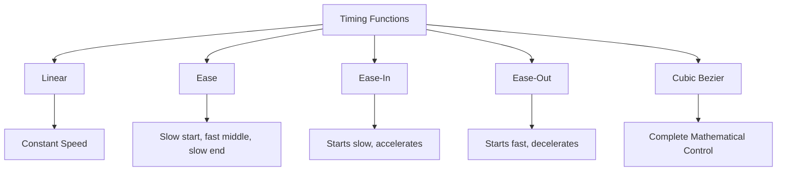
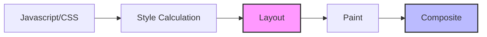

# Lecture 09 — CSS Animations, Transitions & Advanced Effects

**Course:** Full-Stack Web Development  
**Instructor:** Kyrillos Medhat  
**Duration:** 3 hours (Theory + Lab)

---

## 🛠️ Prerequisites (What to know before starting)

Before diving into CSS animations and advanced effects, you should have a solid foundation in the following areas:
- **CSS Box Model:** Deep understanding of padding, border, margin, and how elements calculate their total width and height.
- **CSS Selectors & Specificity:** Knowing how to target pseudo-classes like `:hover`, `:focus`, `:focus-within`, and `:active`.
- **Positioning Contexts:** Mastery of `position: relative`, `absolute`, `fixed`, and `sticky`. Many animations require moving elements out of normal document flow.
- **Flexbox & CSS Grid:** Understanding modern layout systems. Often, animating items requires them to be arranged predictably in a grid or flex container.
- **Z-Index and Stacking Contexts:** Crucial for 3D transforms and complex layered animations.

## 🎯 Objectives & Agenda

### Learning Objectives
By the end of this rigorous lecture, you will be able to:
1. Explain the philosophical and technical difference between CSS transitions and keyframe animations, knowing exactly when to use each.
2. Create smooth, multi-step CSS transitions triggered by pseudo-classes.
3. Build complex, multi-stage animations using `@keyframes` and orchestrate them chronologically.
4. Manipulate DOM elements in 2D and 3D space using CSS transforms (`translate`, `rotate`, `scale`, `skew`, `perspective`).
5. Apply advanced visual effects including complex layered `box-shadow`, `text-shadow`, gradients, and CSS filters.
6. Implement native, JavaScript-free scroll-driven animations using the modern Scroll Timeline API.
7. Optimize animation performance natively using the `will-change` property and hardware-accelerated (GPU-composited) properties to guarantee jank-free 60fps rendering.
8. Ensure strict compliance with accessibility standards by integrating `prefers-reduced-motion` to respect users with vestibular disorders.

### 📋 Agenda

**Part 1 — Theory & Deep Dives (~90 min)**
1. CSS Transitions: The Fundamentals of State Changes
2. CSS Keyframe Animations: Orchestrating Complex Motion
3. CSS Transforms (2D): Manipulating Space
4. CSS Transforms (3D): The Third Dimension
5. Shadows, Gradients & Blend Modes: Creating Depth
6. Scroll-Driven Animations: The Modern API
7. Performance & Optimization: Achieving 60fps
8. Accessibility: Designing for All Users

**Part 2 — Practice / Lab (~90 min)**
1. Lab 1: Building a 3D Flip Card Component
2. Lab 2: Developing a Scroll-Driven Reading Progress Bar
3. Lab 3: Advanced Multi-step Keyframe Loader

---

## 1. CSS Transitions: The Fundamentals of State Changes

Transitions in CSS provide a way to control animation speed when changing CSS properties. Instead of having property changes take effect immediately, you can cause the changes in a property to take place over a specific duration.

### The "Why" Behind Transitions
In the early days of the web, interactive elements like buttons either had a static state or snapped instantaneously to a new state on hover. This jarring behavior lacks physical realism. In the real world, physical objects do not instantly teleport or instantly change color; they transition. Transitions allow developers to map digital interfaces to physical expectations. When you push a physical button, it depresses over a fraction of a second. Transitions emulate this behavior, providing crucial micro-feedback to the user that their interaction was registered.

### The 4 Core Transition Properties

To fully define a transition, we rely on four distinct properties, though they are usually combined into a shorthand.

```css
.button {
  background-color: #6366f1;
  color: white;
  padding: 12px 24px;
  border-radius: 8px;
  
  /* WHAT to animate */
  transition-property: background-color, transform, box-shadow;  
  
  /* HOW LONG it takes */
  transition-duration: 0.3s;                   
  
  /* SPEED CURVE (The "feel") */
  transition-timing-function: cubic-bezier(0.4, 0, 0.2, 1);            
  
  /* WAIT before starting */
  transition-delay: 0s;                        
}

.button:hover {
  background-color: #4f46e5;
  transform: translateY(-2px);
  box-shadow: 0 10px 15px -3px rgba(0, 0, 0, 0.1);
}
```

### Deep Dive: The Mathematics of Cubic Bezier
When we use `cubic-bezier(x1, y1, x2, y2)`, we are defining a mathematical curve on a 2D graph. The X-axis represents time, and the Y-axis represents the progress of the animation. The points (0,0) and (1,1) are fixed. The values you provide are the coordinates of the two control points that pull the curve.
- `x1` and `x2` must be between 0 and 1, as time cannot go backwards.
- `y1` and `y2` can be outside the 0 to 1 range! If you set `y` to 1.2, the animation will overshoot its target value and bounce back. This is how you create elastic or spring-like effects entirely in CSS without relying on complex physics libraries.

This level of control is what separates standard web pages from premium, app-like experiences. Consider Apple's marketing pages—they rarely use linear or standard ease functions. They mathematically fine-tune cubic-bezier curves to match physical mass and momentum.

### The Transition Shorthand

Writing out four properties is verbose. We almost always use the shorthand:
```css
/* Syntax: property | duration | timing-function | delay */
transition: all 0.3s ease 0s;

/* Pro-tip: Comma-separate specific properties for better performance than 'all' */
transition: background-color 0.2s ease-in-out, 
            transform 0.3s cubic-bezier(0.175, 0.885, 0.32, 1.275);
```

### Timing Functions: The Soul of Animation



The `transition-timing-function` determines how intermediate values are calculated. It dictates the "personality" of the animation.

| Function | Behavior | Best Used For |
|----------|----------|---------------|
| `ease` | Slow start, fast middle, slow end (default). | General hover states. |
| `linear` | Constant speed from start to finish. | Continuous rotations, loading bars. |
| `ease-in` | Starts slow, accelerates, ends fast. | Elements exiting the screen (gravity). |
| `ease-out` | Starts fast, decelerates, ends slow. | Elements entering the screen (friction). |
| `ease-in-out` | Slow at both ends, fast in the middle. | Elements moving across the screen. |
| `cubic-bezier` | Custom mathematical curve. | Bouncy, spring-like, or highly custom effects. |

> [!TIP]
> **What properties can be transitioned?**
> You can transition anything that has a calculable numerical intermediate value. This includes `color`, `opacity`, `transform`, `width`, `height`, `margin`, and `padding`. 
> You **cannot** transition `display: none` to `display: block`, or `font-family`. For elements entering/leaving the DOM, consider animating `opacity` and `visibility` instead.

---

## 2. CSS Keyframe Animations: Orchestrating Complex Motion

While transitions only animate between two distinct states (State A to State B), keyframe animations allow you to choreograph complex, multi-step sequences that can loop infinitely, reverse direction, and run autonomously upon page load.

### Defining Keyframes with `@keyframes`

The `@keyframes` at-rule defines the stages of the animation. You specify percentages to indicate how far along the animation sequence the styles should be applied.

```css
@keyframes bounceAndFade {
  0% {
    opacity: 0;
    transform: translateY(-100px) scale(0.9);
  }
  50% {
    opacity: 1;
    transform: translateY(10px) scale(1.05); /* Overshoot for a bounce effect */
  }
  80% {
    transform: translateY(-5px) scale(0.98);
  }
  100% {
    opacity: 1;
    transform: translateY(0) scale(1);
  }
}
```

### Applying the Animation to an Element

Once defined, the animation must be bound to a selector.

```css
.alert-banner {
  animation-name: bounceAndFade;
  animation-duration: 0.8s;
  animation-timing-function: cubic-bezier(0.25, 0.46, 0.45, 0.94);
  animation-delay: 0.5s;
  animation-fill-mode: forwards;    
  animation-iteration-count: 1;     
  animation-direction: normal;
}
```

### The `animation-fill-mode` Dilemma

One of the most common points of confusion in CSS animations is what happens *before* the animation starts (during the delay) and *after* it finishes. 

| Value | Behavior Before Animation | Behavior After Animation |
|-------|---------------------------|--------------------------|
| `none` | Element retains standard CSS styles. | Element abruptly snaps back to standard CSS styles. |
| `forwards` | Element retains standard CSS styles. | Element **keeps the styles** defined in the final keyframe (`100%`). |
| `backwards`| Element immediately takes on the styles of the first keyframe (`0%`) during the delay. | Element abruptly snaps back to standard CSS styles. |
| `both` | Takes on `0%` styles during delay. | Keeps `100%` styles after completion. |

> [!IMPORTANT]
> If you are animating an element appearing on screen (e.g., from `opacity: 0` to `opacity: 1`), you almost always want `animation-fill-mode: both;` or `forwards`. Without it, the element will mysteriously vanish or snap back to its original un-animated state as soon as the animation completes!

---

## The Philosophical Shift in Modern Web Design
The introduction of CSS animations marked a profound philosophical shift in web development. Before CSS animations, developers were forced to use JavaScript for everything. Libraries like jQuery offered `.animate()`, which fired a `setInterval` or `requestAnimationFrame` loop to slowly modify inline styles over time. This was incredibly inefficient, battery-draining, and prone to breaking when scrolling.

Moving animation logic to CSS meant that the browser's rendering engine could optimize the motion at a lower system level. It democratized motion design, allowing developers to create engaging interfaces declaratively rather than imperatively.

Furthermore, it reinforced the core separation of concerns:
- **HTML** handles Structure and Semantics.
- **CSS** handles Presentation, Layout, and Motion.
- **JavaScript** handles Business Logic, Data Fetching, and Complex State.

When you use CSS for animations instead of JS, you are adhering strictly to this philosophical divide, resulting in cleaner, more maintainable codebases.

## 3. CSS Transforms (2D): Manipulating Space

CSS Transforms allow you to visually manipulate elements. Crucially, transforms happen **after** the browser has calculated the layout. This means moving an element with `transform: translate()` does **not** push other elements out of the way. It operates in its own visual layer.

### The 4 Core 2D Transforms

1. **`translate(x, y)`:** Moves the element horizontally and/or vertically.
2. **`scale(x, y)`:** Resizes the element. Values > 1 enlarge it; values < 1 shrink it.
3. **`rotate(angle)`:** Rotates the element clockwise or counter-clockwise (e.g., `45deg`, `1turn`).
4. **`skew(x-angle, y-angle)`:** Tilts or slants the element along the X and/or Y axis.

### Transform Origin

By default, elements transform around their direct center (`50% 50%`). You can change this anchor point using `transform-origin`.

```css
.pendulum {
  /* Animate from the top-center instead of the middle */
  transform-origin: top center; 
  animation: swing 2s ease-in-out infinite alternate;
}

@keyframes swing {
  from { transform: rotate(-30deg); }
  to { transform: rotate(30deg); }
}
```

### Chaining Transforms & The Importance of Order

You can apply multiple transforms simultaneously by space-separating them. **Order matters heavily.** Transforms are applied from left to right (conceptually, they mutate the coordinate system of the element).

```css
/* Translates first, then rotates in the new position */
.box-a {
  transform: translateX(100px) rotate(45deg);
}

/* Rotates first, then translates ALONG THE ROTATED AXIS */
.box-b {
  transform: rotate(45deg) translateX(100px); 
}
```

---

## 4. CSS Transforms (3D): The Third Dimension

To unlock the Z-axis (depth) in CSS, you must establish a 3D formatting context. This involves two critical properties: `perspective` and `transform-style`.

### The `perspective` Property

Perspective dictates how intense the 3D effect is. Think of it as the distance between the user's eye and the screen. 
- A **low value** (e.g., `200px`) creates an extreme, dramatic fisheye effect.
- A **high value** (e.g., `1000px` or `2000px`) creates a subtle, realistic depth.

`perspective` is usually applied to the **parent container**, not the element being transformed.

```css
.scene {
  perspective: 800px; /* Establishes the 3D space */
}

.cube {
  /* Tells children to exist in the same 3D space, not flatten out */
  transform-style: preserve-3d;
  transform: rotateY(45deg);
}
```

### The Anatomy of the 3D Coordinate System
In a standard 2D web page, you have an X-axis (horizontal) and a Y-axis (vertical). The origin (0,0) is at the top-left of the document.
When you activate a 3D context, you introduce the Z-axis. This axis shoots directly out of the screen towards the user's eyes.
- Moving an element positively along the Z-axis (`translateZ(50px)`) makes it appear larger because it is physically closer to the viewer in the 3D space.
- Moving it negatively (`translateZ(-50px)`) pushes it back into the monitor, making it smaller.

This mathematical coordinate system is identical to how 3D engines like Unity or Unreal Engine operate, albeit highly simplified for the Document Object Model. 

### Why Z-Index is NOT the Z-Axis
A common pitfall is confusing `z-index` with `translateZ`. 
- `z-index` determines stacking order in a flat, 2D plane. If Element A has a higher `z-index` than Element B, it paints on top. 
- `translateZ` physically moves the element in 3D space. While it does affect stacking order (an element closer to you will cover one further away), it also dynamically scales the element visually due to perspective. Mixing the two without understanding their distinct roles leads to confusing z-fighting and unexpected clipping.

### 3D Transform Functions
- `translateZ(z)`: Moves the element closer to or further from the viewer.
- `rotateX(angle)`: Flips the element vertically (like nodding your head).
- `rotateY(angle)`: Flips the element horizontally (like shaking your head).
- `rotateZ(angle)`: Exact same as 2D `rotate()`.

### The Backface Visibility Trick

When you rotate an element 180 degrees, by default, you see its mirrored backside. Often, we want to hide this to create "flip cards" where a different element serves as the back.

```css
.card-face {
  /* Crucial for flip effects */
  backface-visibility: hidden; 
}
```

---

## 5. Shadows, Gradients & Blend Modes: Creating Depth

Animations feel much richer when combined with lighting, shadows, and color interpolation.

### Layering Multiple Box Shadows

A single `box-shadow` is often flat. Modern UI design relies on layering multiple shadows to create realistic, diffuse light spread.

```css
.modern-card {
  /* offset-x | offset-y | blur-radius | spread-radius | color */
  box-shadow: 
    0 1px 2px rgba(0,0,0,0.07), 
    0 2px 4px rgba(0,0,0,0.07), 
    0 4px 8px rgba(0,0,0,0.07), 
    0 8px 16px rgba(0,0,0,0.07),
    0 16px 32px rgba(0,0,0,0.07);
  transition: transform 0.3s ease, box-shadow 0.3s ease;
}

.modern-card:hover {
  transform: translateY(-5px);
  /* Make the shadow deeper and more diffuse on hover */
  box-shadow: 
    0 1px 2px rgba(0,0,0,0.07), 
    0 2px 4px rgba(0,0,0,0.07), 
    0 4px 8px rgba(0,0,0,0.07), 
    0 16px 32px rgba(0,0,0,0.07),
    0 32px 64px rgba(0,0,0,0.07);
}
```

### Gradients and Text Shadows

```css
.gradient-text {
  /* Using gradients for text color */
  background: linear-gradient(135deg, #FF6B6B 0%, #4ECDC4 100%);
  -webkit-background-clip: text;
  -webkit-text-fill-color: transparent;
  background-clip: text;
  color: transparent; /* Fallback */
}

/* Glowing text effect */
.neon-glow {
  color: #fff;
  text-shadow: 
    0 0 5px #fff,
    0 0 10px #fff,
    0 0 20px #0fa,
    0 0 40px #0fa,
    0 0 80px #0fa;
}
```

---

## 6. Scroll-Driven Animations: The Modern API

For years, animating elements based on the user's scroll position required heavy JavaScript libraries (like GSAP or ScrollMagic) or complex `IntersectionObserver` setups. 

The new CSS **Scroll Timeline API** allows you to bind CSS animations directly to the scrollbar natively, without a single line of JavaScript.

### `animation-timeline: view()`

This ties an animation to the element's visibility within the viewport. As it enters the viewport, the animation progresses.

```css
@keyframes slideUpFade {
  from {
    opacity: 0;
    transform: translateY(100px);
  }
  to {
    opacity: 1;
    transform: translateY(0);
  }
}

.animate-on-scroll {
  /* Set the animation normally */
  animation: slideUpFade linear both;
  
  /* Bind it to the viewport intersection */
  animation-timeline: view();
  
  /* Define when the animation starts and ends relative to the viewport */
  /* Starts when the element enters, ends when it's 20% into the viewport */
  animation-range: entry 0% cover 20%; 
}
```

### `animation-timeline: scroll()`

This ties an animation to the scroll position of a specific container or the entire document. Perfect for reading progress bars.

```css
.reading-progress-bar {
  position: fixed;
  top: 0; left: 0; right: 0;
  height: 5px;
  background: linear-gradient(to right, #ff00cc, #333399);
  
  /* Start collapsed at the left */
  transform-origin: 0% 50%;
  animation: expandProgressBar linear both;
  
  /* Tie directly to the root document scroll */
  animation-timeline: scroll(root);
}

@keyframes expandProgressBar {
  from { transform: scaleX(0); }
  to { transform: scaleX(1); }
}
```

> [!WARNING]
> The Scroll-Driven Animations API is incredibly powerful but still relatively new. While supported in modern Chromium browsers (Chrome, Edge), check CanIUse.com for Safari and Firefox support, and provide graceful fallbacks.

---

## 7. Performance & Optimization: Achieving 60fps

A janky, stuttering animation is worse than no animation at all. To achieve a buttery smooth 60 frames per second (fps), you must understand how the browser renders the page.

### The Browser Rendering Pipeline



1. **Recalculate Style:** Figuring out which CSS rules apply to which elements.
2. **Layout (Reflow):** Calculating the exact geometry and position of every element.
3. **Paint:** Filling in pixels (colors, borders, shadows, text).
4. **Composite:** Drawing the painted layers to the screen in the correct order.

### The "Cheap" Properties vs. The "Expensive" Properties

If you animate a property that triggers **Layout** (like `width`, `height`, `margin`, `padding`, `top`, `left`), the browser must recalculate the geometry of the entire page on *every single frame*. This destroys performance and causes layout thrashing.

If you animate a property that only triggers **Composite**, the browser can hand off the animation to the GPU (Graphics Processing Unit), bypassing the main CPU thread entirely.

**✅ THE HOLY TRINITY OF SAFE ANIMATIONS:**
To guarantee 60fps, restrict your animations to these three properties:
1. `transform` (translate, scale, rotate)
2. `opacity`
3. `filter` (blur, drop-shadow, etc.)

```css
/* ❌ BAD: Animating layout properties (Jank City) */
.bad-button {
  width: 100px;
  transition: width 0.3s ease;
}
.bad-button:hover {
  width: 120px;
}

/* ✅ GOOD: Animating composite properties (Silky Smooth) */
.good-button {
  transform: scale(1);
  transition: transform 0.3s ease;
}
.good-button:hover {
  transform: scale(1.2);
}
```

### Understanding Layout Thrashing
Layout thrashing occurs when JavaScript reads and writes layout properties synchronously, but the same principle applies to CSS animations. When you animate a property like `width`, the browser must calculate the width of the element, then the width of its parent, then the position of all its siblings. It must do this 60 times a second. 
If your DOM tree is complex, this calculation might take 25ms. However, to achieve 60fps, the browser only has 16.6ms per frame. If the calculation takes 25ms, the browser drops frames, resulting in visual "jank" or stuttering.

By animating only `transform`, the browser skips the Layout and Paint steps entirely. It takes a snapshot of the element (a bitmap), uploads it to the GPU, and simply moves that picture around. The GPU is incredibly efficient at translating and rotating matrices, meaning the main CPU thread is completely free to handle JavaScript and other tasks.

### The `will-change` Property

`will-change` is a hint to the browser that an element is *about* to be animated. The browser will pre-optimize by allocating a dedicated GPU layer for the element before the animation even starts.

```css
.heavy-element {
  will-change: transform, opacity;
}
```

> [!CAUTION]
> **Do not overuse `will-change`!** 
> Setting `will-change: all` or applying it to hundreds of elements will exhaust the device's VRAM (Video RAM) and actually *worsen* performance or crash the tab. Only use it as a last resort on elements that are complex to paint and stutter during animation.

---

## 8. Accessibility: Designing for All Users

Motion on the web can be visually stunning, but for users with vestibular disorders, ADHD, or visual impairments, excessive motion can cause severe nausea, dizziness, or profound distraction.

### The `prefers-reduced-motion` Media Query

Operating systems allow users to explicitly state that they prefer reduced motion. As developers, it is an ethical and often legal obligation to respect this setting.

You should always include a global reset at the end of your CSS to kill or significantly slow down all non-essential animations if the user requests it.

```css
@media (prefers-reduced-motion: reduce) {
  /* Target all elements and pseudo-elements */
  *,
  *::before,
  *::after {
    /* Set durations to near-zero instead of exactly zero to prevent breaking JavaScript events relying on transitionend/animationend */
    animation-duration: 0.01ms !important;
    animation-iteration-count: 1 !important;
    transition-duration: 0.01ms !important;
    scroll-behavior: auto !important;
  }
}
```

By setting the duration to `0.01ms` rather than `none`, any JavaScript logic relying on the `transitionend` event will still fire safely.

---

## 🧠 Think Like a Developer

Let's look at a few scenarios where understanding the *why* helps you make better decisions.

### Scenario 1: The Disappearing Dropdown
**The Problem:** You want a dropdown menu to smoothly fade in and slide down when hovered. You set `display: none` to `display: block`, `opacity: 0` to `1`, and add a transition. But the dropdown just instantly appears. The fade doesn't work.
**The Developer Thought Process:** "Ah, I can't transition the `display` property. When `display` changes from `none`, the browser doesn't have intermediate states for it, so it instantly renders it, bypassing the opacity transition."
**The Solution:** Leave it as `display: block`, but set `visibility: hidden`, `opacity: 0`, and `pointer-events: none`. Transition `opacity` and `visibility`. When hovered, change to `visibility: visible`, `opacity: 1`, and `pointer-events: auto`.

### Scenario 2: The Stuttering Parallax
**The Problem:** You built a parallax scrolling effect by changing the `top` property inside a scroll event listener. It looks terribly jerky, especially on mobile.
**The Developer Thought Process:** "Scroll events fire hundreds of times a second. Changing `top` forces a layout recalculation on the main CPU thread, which is overwhelmed by the scroll events."
**The Solution:** Refactor the parallax to use `transform: translateY()` instead of `top`, and potentially move to the new CSS `animation-timeline: scroll()` to completely eliminate JavaScript from the equation.

---

## 🆚 Before vs After

### Bad Practice vs. Modern Practice: Button Hover

**Before (Legacy / Bad Practice):**
```css
/* Modifies layout properties, causing surrounding text to jitter */
.btn-legacy {
  padding: 10px 20px;
  background: blue;
}
.btn-legacy:hover {
  padding: 12px 24px; /* Triggers Layout! */
  margin-left: -2px;  /* Triggers Layout! */
}
```

**After (Modern / Good Practice):**
```css
/* Modifies only composited properties, utilizing the GPU */
.btn-modern {
  padding: 10px 20px;
  background: blue;
  transition: transform 0.2s cubic-bezier(0.175, 0.885, 0.32, 1.275);
}
.btn-modern:hover {
  transform: scale(1.1); /* Hardware accelerated! */
}
```

---

## 🚨 Common Mistakes & How to Avoid Them

| ❌ The Mistake | 🐛 The Symptom | ✅ The Fix |
|----------------|----------------|------------|
| Using `transition: all` indiscriminately | Unexpected properties animate (like text color flashing) and poor performance. | Explicitly name the properties: `transition: opacity 0.3s, transform 0.3s;` |
| Forgetting `animation-fill-mode: forwards` | Element finishes its grand entrance animation, then instantly vanishes. | Always add `forwards` or `both` if the end state differs from the initial CSS. |
| Animating `height: 0` to `height: auto` | The transition snaps instantly; CSS cannot interpolate to the keyword `auto`. | Use CSS Grid: transition `grid-template-rows` from `0fr` to `1fr`. |
| Missing `backface-visibility: hidden` | During a 3D flip, the text on the back of the card appears backwards overlaid on the front. | Apply `backface-visibility: hidden` to both the `.front` and `.back` faces. |
| Applying `perspective` to the child | The 3D effect looks warped or doesn't work at all. | `perspective` goes on the **parent container**; `transform` goes on the child. |
| Ignoring Accessibility | Users with vestibular issues experience motion sickness using your site. | Implement the global `@media (prefers-reduced-motion: reduce)` block. |

---

## 🧪 Practice Labs

### Lab 1 — 3D Flip Cards (45 min)
Create an interactive staff directory using 3D flip cards.

**Step-by-Step Requirements:**
1. Create a `div.card-container` acting as the 3D scene. Apply `perspective: 1000px`.
2. Inside, create `div.card`. Apply `transform-style: preserve-3d` and a `transition` of `0.6s`.
3. Inside `.card`, create two absolute-positioned siblings: `div.card-front` and `div.card-back`. Make sure they stack exactly on top of each other using `inset: 0`.
4. Apply `backface-visibility: hidden` to both faces.
5. Pre-rotate the back face: `transform: rotateY(180deg)`.
6. Add the hover state: `.card-container:hover .card { transform: rotateY(180deg); }`.
7. **Challenge:** Add a slight box-shadow that intensifies when hovered.

### Lab 2 — Scroll-Driven Reading Progress Bar (45 min)
Implement a progress bar that tracks how far a user has read down an article, using zero JavaScript.

**Step-by-Step Requirements:**
1. Create a long HTML document with several paragraphs of dummy text to ensure scrolling is possible.
2. Create a `div.progress-bar` just inside the `<body>`.
3. Fix it to the top: `position: fixed; top: 0; left: 0; right: 0; height: 6px; z-index: 100;`.
4. Give it a gradient background.
5. Set `transform-origin: left;` so it grows from the left edge.
6. Create an `@keyframes` rule moving from `transform: scaleX(0)` to `transform: scaleX(1)`.
7. Apply `animation-timeline: scroll(root);` to the progress bar.
8. **Challenge:** Make the color of the progress bar transition from red to green as it reaches the end using keyframes.

### Lab 3 — Multi-Step Keyframe Loader (30 min)
Create a custom loading spinner using only CSS.

**Step-by-Step Requirements:**
1. Create a layout with 3 small circle `div`s horizontally aligned.
2. Write a `@keyframes bounce` that alters `transform: translateY()` and `opacity`.
3. Apply the animation to all three circles to run infinitely.
4. Use `animation-delay` staggered (e.g., `0s`, `0.2s`, `0.4s`) on the 2nd and 3rd circles to create a wave effect.

---

## 📝 Assignment: Portfolio Project — Part 8

Time to add professional polish to your ongoing Portfolio Project. 

**Tasks:**
1. **Micro-interactions:** Add sophisticated hover transitions to all buttons, navigation links, and project cards. Use cubic-bezier curves for a "snappy" feel.
2. **Hero Entrance:** When the page loads, use an `@keyframes` animation to stagger the entrance of your Name, Tagline, and CTA button. They should fade in and slide up from the bottom.
3. **Card Lift:** Modify your Project Grid. When a user hovers over a project card, it should smoothly lift up (`translateY`) and cast a larger, softer `box-shadow`.
4. **Scroll Reveal:** Implement the modern CSS Scroll Timeline API to make elements in your "About Me" and "Skills" sections fade in dynamically as the user scrolls down to them.
5. **Accessibility Pass:** Wrap all your new animations inside an `@supports` query or ensure your `prefers-reduced-motion` reset is active at the bottom of your stylesheet.

---

## 🎤 Interview Prep

Expect these questions when applying for Front-End or UI Engineering roles:

**Q1: What is the difference between a CSS Transition and a CSS Animation?**
*Answer:* A transition is purely for animating a property between two distinct states (State A to State B), usually triggered by a state change like `:hover` or adding a class via JS. An animation (using `@keyframes`) is timeline-based, can have multiple intermediate steps (percentages), can loop infinitely, reverse direction, and start automatically upon page load.

**Q2: How do you optimize CSS animations for 60fps performance?**
*Answer:* I avoid animating properties that trigger layout recalculations (reflows) like `width`, `height`, `margin`, or `top`. Instead, I stick to hardware-accelerated (composited) properties: `transform` (scale, translate, rotate) and `opacity`. If an element is still struggling, I might hint to the browser using `will-change: transform` to promote it to its own GPU layer.

**Q3: Explain what `animation-fill-mode: forwards` does.**
*Answer:* By default, when a CSS keyframe animation completes, the element snaps back to whatever styles it had before the animation started. `animation-fill-mode: forwards` prevents this by forcing the element to retain the computed values from the final keyframe (the `100%` or `to` block).

**Q4: How do you make an animation accessible for users with vestibular motion disorders?**
*Answer:* I use the `@media (prefers-reduced-motion: reduce)` media query. Inside it, I target `*`, `*::before`, and `*::after` and override all `animation-duration` and `transition-duration` properties to `0.01ms`. This effectively instantly completes animations while preventing JavaScript `transitionend` bugs.

---

## 📜 Cheat Sheet: Quick Syntax Reference

```css
/* TRANSITION SHORTHAND */
/* property | duration | timing-function | delay */
transition: transform 0.3s ease-in-out 0.1s;

/* MULTIPLE TRANSITIONS */
transition: background 0.2s linear, opacity 0.5s ease;

/* KEYFRAME SYNTAX */
@keyframes myAnim {
  0%   { opacity: 0; transform: scale(0.5); }
  50%  { opacity: 1; transform: scale(1.2); }
  100% { transform: scale(1); }
}

/* ANIMATION SHORTHAND */
/* name | duration | timing | delay | count | direction | fill-mode */
animation: myAnim 2s ease-in 0.5s infinite alternate forwards;

/* HARDWARE ACCELERATED TRANSFORMS */
transform: translateX(50px);
transform: translateY(-20px) scale(1.1);
transform: translate3d(x, y, z); /* Forces GPU hardware acceleration */

/* 3D CONTEXT (Applied to parent) */
perspective: 1000px;
/* Applied to children to keep 3D depth */
transform-style: preserve-3d;
/* Hide back of flipped cards */
backface-visibility: hidden;

/* SCROLL TIMELINE (Modern CSS) */
animation: fadeSlideIn linear both;
animation-timeline: view(); /* Relative to viewport entry */
/* OR */
animation-timeline: scroll(root); /* Relative to document scroll */
```

---

## 📌 Key Takeaways & Resources

### Key Takeaways
- **Transitions** are your go-to for simple hover/focus micro-interactions.
- **Keyframes** are for complex, multi-step, or autonomous choreographies.
- **Performance is paramount.** Memorize the safe properties: `transform` and `opacity`. Animating width or margins is a cardinal sin of UI development.
- **3D space** in CSS requires establishing a scene with `perspective` on a parent element.
- The **Scroll Timeline API** is revolutionizing front-end development, allowing complex scroll interactions without the heavy performance penalty of JavaScript scroll listeners.
- **Accessibility is non-negotiable.** Always include `prefers-reduced-motion`.

### 🔗 Resources

| Resource | Link | Description |
|----------|------|-------------|
| MDN: CSS Transitions | [MDN Docs](https://developer.mozilla.org/en-US/docs/Web/CSS/CSS_transitions) | Official Mozilla reference. |
| MDN: CSS Animations | [MDN Docs](https://developer.mozilla.org/en-US/docs/Web/CSS/CSS_animations) | Deep dive into `@keyframes`. |
| MDN: Scroll-Driven Animations | [MDN Docs](https://developer.mozilla.org/en-US/docs/Web/CSS/animation-timeline) | The future of scroll effects. |
| Cubic Bezier Generator | [cubic-bezier.com](https://cubic-bezier.com/) | Visually generate custom timing curves. |
| CSS Triggers | [csstriggers.com](https://csstriggers.com/) | Look up which CSS properties trigger Layout vs Paint. Essential for optimization. |
| A11y Project | [a11yproject.com](https://www.a11yproject.com/) | Accessibility best practices for motion. |

---

**Next Lecture:** [Lecture 10 — JavaScript Basics: Syntax, Types & Control Flow](../../Module%203%20-%20JavaScript%20Programming/10%20-%20JavaScript%20Basics%20-%20Syntax%2C%20Types%20%26%20Control%20Flow/10%20-%20JavaScript%20Basics%20-%20Syntax%2C%20Types%20%26%20Control%20Flow.md)

### 📚 Extensive Tutorials & Resources
- **CSS-Tricks:** [A Complete Guide to CSS Transitions](https://css-tricks.com/almanac/properties/t/transition/)
- **MDN Web Docs:** [Using CSS Animations](https://developer.mozilla.org/en-US/docs/Web/CSS/CSS_animations/Using_CSS_animations)
- **Web.dev:** [Scroll-Driven Animations](https://developer.chrome.com/docs/css-ui/scroll-driven-animations/)
- **MDN Web Docs:** [Using CSS Transforms](https://developer.mozilla.org/en-US/docs/Web/CSS/CSS_transforms/Using_CSS_transforms)
- **FreeCodeCamp:** [CSS Keyframe Animations Explained with Examples](https://www.freecodecamp.org/news/css-keyframe-animations-explained-with-examples/)
- **Fireship (YouTube):** [CSS Animations in 100 Seconds](https://www.youtube.com/watch?v=s5t2Wj3Vj64)
