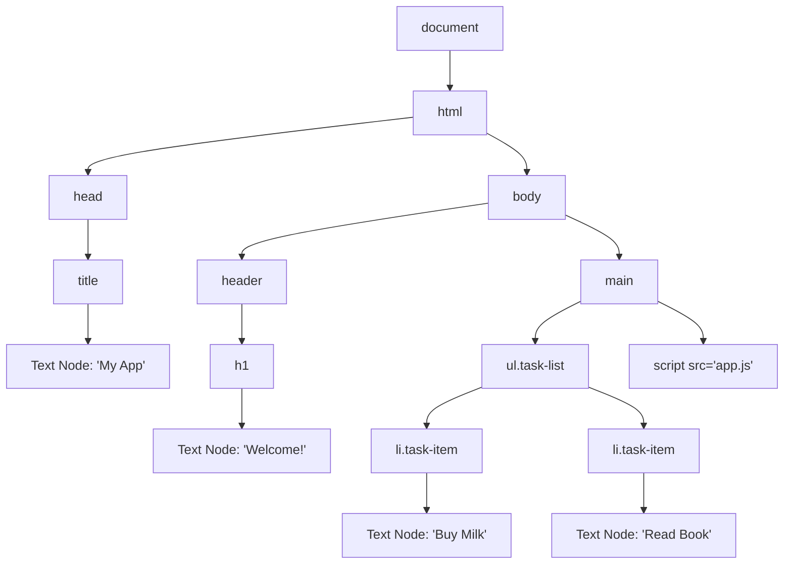
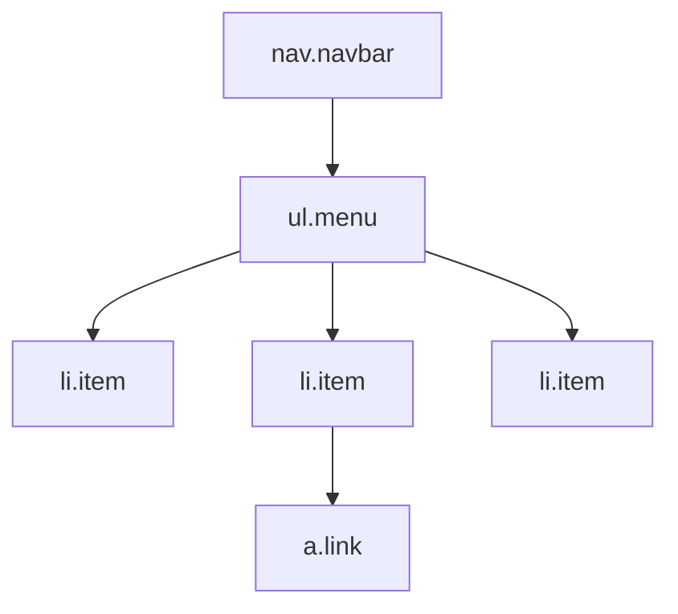

# Lecture 12 — DOM Manipulation & Events

**Course:** Full-Stack Web Development  
**Instructor:** Kyrillos Medhat  
**Duration:** 3 hours (Theory + Lab)

---

## 1. Prerequisites (What to know before starting)

Before diving into the complexities of DOM manipulation, you need to be deeply comfortable with several foundational concepts. The DOM is the bridge between static HTML and dynamic JavaScript, so weakness in either area will make this lecture difficult. Ensure you have a solid grasp of the following:

- **HTML Structure & Semantic Tags:** Understanding of tags (`div`, `span`, `article`, `section`), attributes (`id`, `class`, `href`, `src`), and the parent-child-sibling hierarchy of an HTML document. You should know how nesting works and how the browser interprets a standard HTML5 document.
- **CSS Selectors & Combinators:** Familiarity with selecting elements using class (`.class`), ID (`#id`), attribute selectors (`[type="text"]`), descendant combinators (space), and direct child combinators (`>`). JavaScript uses the exact same CSS selector engine to find elements on the page.
- **JavaScript Fundamentals:** You must be absolutely comfortable with variable declarations (`let`, `const`), function declarations, anonymous arrow functions, objects, arrays, and standard control flow (loops, `if/else`).
- **Browser DevTools:** Basic ability to open the developer tools (F12 or Ctrl+Shift+I), inspect HTML elements in the "Elements" tab, and read/execute basic commands in the "Console" tab. We will be spending a lot of time debugging in the console.
- **Basic Scope Knowledge:** A rough understanding of block scope and function scope will help when we attach event listeners inside loops or functions.

---

## 2. Objectives & Agenda

### 🎯 Learning Objectives
By the end of this intensive 3-hour session, you will be able to:
- **Conceptualize the DOM:** Understand the Document Object Model (DOM) not as text, but as a live, in-memory object tree.
- **Master Selection:** Select single or multiple elements efficiently using `querySelector` and `querySelectorAll`.
- **Navigate the Tree:** Traverse the DOM tree upward (`parentElement`, `closest`), downward (`children`), and sideways (`nextElementSibling`).
- **Manipulate Structure:** Create, modify, and remove elements dynamically.
- **Prioritize Security:** Differentiate between safe text insertion (`textContent`) and dangerous HTML injection (`innerHTML`), effectively mitigating XSS vulnerabilities.
- **Manage State & Styling:** Dynamically toggle CSS classes using `classList` and store application state directly on elements using the `dataset` API.
- **Handle Interactivity:** Listen to complex user interactions with `addEventListener`, control default browser behaviors, and intercept event propagation.
- **Clean Up Memory:** Safely remove event listeners using modern, memory-efficient patterns like `AbortController`.
- **Optimize Performance:** Implement event delegation for dynamic, high-performance interfaces that scale to thousands of elements without lagging.

### 📋 Agenda
1. **The DOM tree:** What happens between the server response and the pixels on screen. Nodes, elements, text, and browser parsing phases.
2. **Selectors:** The critical bridge connecting CSS query syntax to JavaScript object references.
3. **Traversing:** Navigating the DOM programmatically without relying on hardcoded IDs.
4. **Modifying content:** Building elements from scratch, efficiently clearing containers, and understanding security implications.
5. **Attributes & State:** Dynamically manipulating classes for UI state, and mapping JavaScript data to HTML via data attributes.
6. **Event handling:** The heartbeat of modern web apps. Listening to the user, the event object, and managing event propagation.
7. **Clean-up & Delegation:** Advanced patterns for enterprise-grade applications. Memory management and delegated listeners.
8. **Labs & Interactive Practice:** Applying the theory to build a real-time character counter and an interactive task list.

---

## 3. Deep Numbered Sections

### 3.1 The Document Object Model (DOM) In Depth

#### What Is the DOM? (Plain English)
When a browser downloads an HTML file from a web server, it doesn't simply render it as a static text file. Instead, the browser's HTML parser reads the file character by character, translating the markup into a live, interactive model of the page in the computer's memory. This model is called the **Document Object Model (DOM)**.

Think of your HTML file as an architectural **blueprint** for a house. The DOM is the actual physical house that gets built from that blueprint. Once the house exists, you don't go back and redraw the blueprint to change the color of a wall. You just paint the wall. Similarly, in web development, once the DOM exists, JavaScript can rearrange the furniture (elements), repaint the walls (change styles), or add completely new rooms (create new elements) — all in real-time, without refreshing the page or fetching a new HTML file from the server.

**The critical insight:** The DOM is *not* your HTML file. It is a live JavaScript object tree that the browser creates *from* your HTML file. JavaScript interacts exclusively with this tree. When JS updates the tree, the browser detects the change and automatically repaints the screen.

#### Why Does This Matter?
Without the DOM API provided by the browser, JavaScript would have absolutely no way to interact with the webpage. The DOM is the bridge between your logic and the user interface. Every interactive feature you will ever build — dropdown menus, live search suggestions, form validation, dragging and dropping items, or adding an item to a shopping cart — works by reading or mutating the DOM tree.

#### What is an API? (A Quick Primer)
Before we go further, you'll often hear the term **API (Application Programming Interface)**. In web development, an API acts as a messenger between your front-end code and a server. It allows you to request data (like user profiles, weather info, or random images) without needing to know how the server works. When the API responds with data, you use DOM manipulation to display it dynamically on the screen. We will use a simple `fetch()` later to get real data!

#### The DOM as a Tree Structure
Every HTML tag becomes a **node** in this tree. The `document` object is the root entry point. The `<html>` tag represents the trunk, and every nested element is a branch or leaf.



#### The Three Primary Node Types
While the DOM specifies many node types, you will spend 99% of your career dealing with just three:
1. **Element Nodes (Type 1):** HTML tags like `<div>`, `<p>`, `<h1>`. These are the structural blocks of your layout.
2. **Text Nodes (Type 3):** The actual text content sitting inside the elements. Notice in the diagram that text is a *child* of the element, not the element itself. Even whitespace and line breaks in your HTML file become text nodes!
3. **Attribute Nodes (Type 2):** The attributes applied to elements (e.g., `class="container"`, `id="main"`, `href="https..."`).

#### Step-by-Step: The Browser's Parsing Pipeline
To truly think like a developer, you need to understand the browser's lifecycle:
1. **Fetch:** The browser downloads the HTML file over the network.
2. **Parse & Build DOM:** The parser reads the HTML. When it encounters tags, it instantiates DOM Node objects in memory.
3. **Parse CSS & Build CSSOM:** Simultaneously, it parses CSS and builds the CSS Object Model (CSSOM).
4. **Render Tree:** It combines the DOM and CSSOM to figure out exactly what is visible.
5. **Layout & Paint:** It calculates exact pixel coordinates for every element and paints the pixels to the screen.

When your JavaScript modifies the DOM, you force the browser to recalculate the Render Tree and perform Layout/Paint operations. Doing this efficiently is the core of high-performance web development.

---

### 3.2 Selecting Elements: Bridging CSS and JS

Before you can change an element's text, hide it, or attach a click listener to it, you must first **find** it in the DOM tree. Modern JavaScript provides two incredibly powerful methods that leverage the exact same CSS selector syntax you already use for styling.

#### `querySelector`: Finding the First Match
`document.querySelector(selector)` traverses the DOM and returns the **very first** Element node that matches the provided CSS selector. If no element matches, it returns `null`.

```js
// Select by Tag Name
const mainTitle  = document.querySelector('h1');

// Select by ID (extremely fast, requires a #)
const submitBtn  = document.querySelector('#submit-btn');

// Select by Class (requires a .)
const firstCard  = document.querySelector('.card');

// Complex CSS Selectors (descendants, attributes, pseudo-classes)
const firstInput = document.querySelector('form .input-group input');
const activeNav  = document.querySelector('.nav-item.active'); 
const emailInput = document.querySelector('input[type="email"]');
```

> [!IMPORTANT]
> The single biggest cause of errors for junior developers is failing to account for `null`. `querySelector` will return `null` if the element doesn't exist on the current page. If you try to do `document.querySelector('#missing').textContent = 'Hi'`, your application will fatally crash with a `TypeError: Cannot read properties of null`. Always guard your selections!

#### Defensive Programming with `querySelector`
How do you safely handle potential `null` returns?

```js
const modalBtn = document.querySelector('#open-modal');

// Approach 1: Classic 'if' statement
if (modalBtn) {
  modalBtn.addEventListener('click', openModal);
}

// Approach 2: Modern Optional Chaining (?.)
// If modalBtn is null, execution stops gracefully. No crash.
modalBtn?.addEventListener('click', openModal);

// Approach 3: Fail Fast (Assertion)
// Use this if the element MUST exist for the app to function
const criticalForm = document.querySelector('#checkout-form');
if (!criticalForm) throw new Error('Critical checkout form missing from DOM!');
```

#### `querySelectorAll`: Finding All Matches
`document.querySelectorAll(selector)` returns a **NodeList** containing *all* elements in the document that match the selector. If no elements match, it returns an empty NodeList (not `null`).

```js
const allCards    = document.querySelectorAll('.card');
const allInputs   = document.querySelectorAll('input');
const allButtons  = document.querySelectorAll('button[type="submit"]');
const navLinks    = document.querySelectorAll('.navbar a');
```

**The NodeList Trap:**
A NodeList looks like an array and acts like an array, but it is *not* a true JavaScript Array. It possesses a `.forEach()` method and a `.length` property, but it entirely lacks functional array methods like `.map()`, `.filter()`, and `.reduce()`. 

To unlock the full power of JavaScript arrays, you must convert the NodeList. The modern, elegant way to do this is using the spread operator (`...`):

```js
// Select all elements
const cardsNodeList = document.querySelectorAll('.card');

// Convert to a real array instantly
const cardsArray = [...cardsNodeList];

// Now you can chain complex array methods!
const longCards = cardsArray
  .filter(card => card.textContent.length > 100)
  .map(card => card.dataset.id);
```

#### Scoping Queries to a Parent Element
You do not have to search the entire `document`. You can call `querySelector` on *any specific element* to restrict the search exclusively to its descendants. This is vital for performance and component isolation.

```js
const modal = document.querySelector('#login-modal');

// This will ONLY find the email input inside the login modal,
// completely ignoring any other email inputs on the page.
const emailInput = modal.querySelector('input[type="email"]');
```

---

### 3.3 Traversing the DOM Programmatically

Sometimes you cannot rely on selecting an element directly via a specific ID or class. Instead, you select an initial element (perhaps the one a user just clicked) and navigate to its relatives. This is called **DOM Traversal**.



Assume we have selected `li2` as our starting point: `const currentItem = document.querySelector('.item:nth-child(2)');`

#### Navigating Upward (Ancestors)
1. **`parentElement`**: Retrieves the immediate parent element.
   ```js
   const menuList = currentItem.parentElement; // Returns the <ul>
   ```

2. **`closest(selector)`**: This is arguably the most powerful traversal method. It begins at the current element and walks *up* the DOM tree, checking each ancestor against the provided CSS selector. It returns the first ancestor that matches, or `null` if it reaches the top without a match.
   ```js
   // From the inner link, walk up to find the closest navbar container
   const link = document.querySelector('.link');
   const navbar = link.closest('.navbar'); 
   ```

#### Navigating Downward (Descendants)
1. **`children`**: Returns an `HTMLCollection` (similar to a NodeList) of all immediate child *elements*.
   ```js
   const menuList = document.querySelector('.menu');
   const listItems = [...menuList.children]; // Converts HTMLCollection to Array
   ```

2. **`firstElementChild` / `lastElementChild`**: Quick access to the bookends of a container.
   ```js
   const firstLi = menuList.firstElementChild;
   ```

#### Navigating Sideways (Siblings)
Elements that share the exact same parent are siblings.
```js
const previousLi = currentItem.previousElementSibling; // li1
const nextLi = currentItem.nextElementSibling; // li3
```

> [!WARNING]
> You will sometimes see older tutorials use `parentNode`, `childNodes`, `firstChild`, or `nextSibling` (without the word "Element"). **Avoid these.** These properties return *all* node types, including invisible text nodes representing the whitespace and carriage returns in your HTML file. Trying to style a whitespace text node will crash your app. Always stick to the `*Element*` variations which safely ignore text nodes.

---

### 3.4 Modifying Content & Structure

Once you have selected an element, you usually want to change what it displays or structural build new elements to append to the page.

#### Security First: `textContent` vs `innerHTML`
There are two primary properties used to read or update the contents of an HTML element. Choosing the wrong one introduces a critical security vulnerability known as **Cross-Site Scripting (XSS)**.

1. **`textContent` (Safe):** Reads or sets the text inside an element. If you pass HTML tags into `textContent`, the browser escapes them and renders them as literal strings. The code will *never* be executed.
   ```js
   const commentBox = document.querySelector('.comment');
   
   // A malicious user submits a script tag as their comment
   const userInput = '<script>alert("Hacked! Stealing cookies...")</script>';
   
   // SAFE: The browser displays the raw string `<script>...` on the screen.
   commentBox.textContent = userInput;
   ```

2. **`innerHTML` (Dangerous):** Parses the provided string through the browser's HTML parser and renders actual DOM nodes.
   ```js
   // DANGEROUS: The browser executes the script, and the user is hacked.
   commentBox.innerHTML = userInput; 
   ```
   **Rule of Thumb:** Never, under any circumstances, pass user-generated data into `innerHTML` unless it has been aggressively sanitized using a library like DOMPurify. Use `innerHTML` only for hardcoded HTML templates written by you.

#### Creating Elements Programmatically
The safest and most performant way to build complex UI structures is to use the `document.createElement()` API. 

```js
// 1. Create the element in memory (it is not on the page yet)
const newBadge = document.createElement('span');

// 2. Configure its properties, classes, and text
newBadge.textContent = 'New!';
newBadge.classList.add('badge', 'badge-primary');
newBadge.setAttribute('aria-label', 'New item indicator');

// 3. Find the container on the page
const title = document.querySelector('.product-title');

// 4. Append the newly created element into the live DOM
title.append(newBadge); // Adds it to the end of the title
```
*Note: You can use `append()` to insert at the end, `prepend()` to insert at the beginning, `before()` to insert immediately prior to the container, and `after()` to insert immediately following the container.*

#### Emptying a Container Efficiently
If you need to clear out a list before re-rendering it, you might be tempted to do `list.innerHTML = ''`. This is slow and forces the HTML parser to run.

The modern, blazing-fast standard is `replaceChildren()`.
```js
const todoList = document.querySelector('.todo-list');

// Clears all child nodes instantly and safely
todoList.replaceChildren(); 
```

---

### 3.5 Managing CSS Classes and Data Attributes

JavaScript should rarely manipulate inline CSS styles directly (`element.style.color = 'red'`). Inline styles are hard to override and separate logic from design. Instead, JavaScript should toggle CSS classes, allowing the CSS file to handle the actual visual changes.

#### The `classList` API
Every element has a `classList` property, which provides an elegant API for managing its classes.

```js
const sidebar = document.querySelector('.sidebar');

// Add classes
sidebar.classList.add('active', 'shadow-lg');

// Remove classes
sidebar.classList.remove('collapsed');

// Check if a class exists (returns boolean)
if (sidebar.classList.contains('active')) {
  console.log('Sidebar is open');
}

// Toggle a class (adds it if missing, removes it if present)
// Toggle returns true if the class was added, false if it was removed
const isNowOpen = sidebar.classList.toggle('open');
```

#### Storing State with Data Attributes (`dataset`)
Often, you need to tie specific pieces of data to an HTML element (e.g., tying a database ID to a "Delete" button). You can invent your own HTML attributes using the `data-*` prefix. These are called **Data Attributes**.

```html
<!-- We store the product ID and its category directly on the list item -->
<li class="product-item" data-product-id="9942" data-category="electronics">
  Super Fast Laptop
  <button class="buy-btn">Buy</button>
</li>
```

JavaScript exposes all `data-*` attributes through the `dataset` object.
**Crucial formatting rule:** Kebab-case attributes in HTML (`data-product-id`) are automatically converted to camelCase properties in JavaScript (`productId`).

```js
const item = document.querySelector('.product-item');

// Reading data attributes
console.log(item.dataset.category); // "electronics"
console.log(item.dataset.productId); // "9942"

// Writing to data attributes
item.dataset.inCart = 'true'; // Adds data-in-cart="true" to the HTML

// ⚠️ BEWARE THE TYPE TRAP
// ALL dataset values are stored as STRINGS. 
// "0" is a truthy value in JS. You must explicitly cast numerical/boolean data.
const id = Number(item.dataset.productId); // Properly cast to number 9942
```

---

### 3.6 Event Handling: Bringing the Page to Life

An **Event** is a signal from the browser that something has happened. The user clicked a mouse, pressed a key, scrolled the page, or submitted a form. JavaScript can "listen" for these events and execute a callback function in response.

#### Adding Event Listeners
The standard method is `addEventListener(eventType, callbackFunction)`.

```js
const btn = document.querySelector('#checkout');

btn.addEventListener('click', function(event) {
  // The 'event' object is automatically passed into the callback
  console.log('Checkout initiated!');
  
  // Useful properties on the event object:
  console.log(event.target); // The exact element that was clicked
  console.log(event.type); // "click"
  console.log(event.clientX); // Mouse X coordinate relative to viewport
});
```

#### Stopping Default Browser Behaviors
Many HTML elements have built-in behaviors. Clicking an `<a>` tag navigates to a URL. Submitting a `<form>` refreshes the entire page to send an HTTP request. In modern Single Page Applications (SPAs), we usually want to stop these defaults and handle the logic purely in JavaScript.

We use `event.preventDefault()`.

```js
const form = document.querySelector('#registration-form');

form.addEventListener('submit', (e) => {
  // STOP the page from refreshing!
  e.preventDefault();
  
  // Now we safely extract data and send an AJAX request instead
  const email = document.querySelector('#email').value;
  console.log('Registering:', email);
});
```

#### Understanding Event Bubbling and `stopPropagation`
When an event happens on an element, it first runs the handlers on that element, then on its parent, then all the way up to the document root. This is called **Event Bubbling**.

```html
<div class="card" onclick="console.log('Card clicked')">
  <h3>User Profile</h3>
  <button class="delete-user" onclick="console.log('Button clicked')">Delete</button>
</div>
```
If a user clicks the button, the console will log "Button clicked", and immediately after log "Card clicked". Sometimes this is highly undesirable (e.g., clicking the delete button shouldn't also trigger the card's expansion logic).

Use `event.stopPropagation()` to kill the bubbling process immediately.

```js
const deleteBtn = document.querySelector('.delete-user');

deleteBtn.addEventListener('click', (e) => {
  e.stopPropagation(); // The event stops here. The parent card will never know a click happened.
  deleteUser();
});
```

---

### 3.7 Removing Event Listeners (The Modern Way)

A massive source of memory leaks in long-running web applications comes from failing to remove event listeners when elements are destroyed or modals are closed. 

Historically, removing an event listener was painful because `removeEventListener` requires the exact memory reference to the original function. You couldn't use anonymous arrow functions easily.

**The modern, elegant solution is the `AbortController`.**
You create a controller, extract its signal, and pass that signal as an options object when attaching the listener. When you are ready to clean up, you call `abort()` on the controller.

```js
// 1. Instantiate a new controller
const modalController = new AbortController();

const closeModalBtn = document.querySelector('#close-modal');

// 2. Attach listeners, passing the signal in the options object
closeModalBtn.addEventListener('click', () => {
  hideModal();
}, { signal: modalController.signal });

// You can attach the SAME signal to multiple different listeners
document.addEventListener('keydown', (e) => {
  if (e.key === 'Escape') hideModal();
}, { signal: modalController.signal });

function hideModal() {
  document.querySelector('.modal').classList.remove('show');
  
  // 3. Flip the switch! 
  // Instantly unbinds ALL event listeners tied to this signal.
  // Perfect, leak-free memory management in one line of code.
  modalController.abort();
}
```

---

### 3.8 Masterclass: Event Delegation

Imagine you are building a Todo list. Users can add tasks dynamically. Each task has a "Delete" button. 

**The Naive Approach (The Trap):**
You select all `.delete-btn` elements on page load and attach an event listener to each. 
*The problem:* When the user types a new task and adds it to the DOM *after* the page has loaded, that new delete button won't have an event listener attached to it. It will be dead. You'd have to write complex logic to re-bind listeners every time a task is added. Additionally, if the list grows to 10,000 items, you now have 10,000 separate event listener functions sitting in memory. This is catastrophic for performance.

**The Expert Approach: Event Delegation**
Instead of attaching listeners to every single child element, we attach **exactly one** event listener to the static parent container (`<ul>`). We rely on the fact that events bubble up. When any delete button is clicked, the click bubbles up to the `<ul>`, where our single listener catches it.

```js
// HTML structure:
// <ul id="task-list">
//   <li class="task-item"><button class="btn-delete"><i class="icon-trash"></i></button></li>
// </ul>

const taskList = document.querySelector('#task-list');

// ONE listener for the entire list, present and future.
taskList.addEventListener('click', (e) => {
  
  // Step 1: Did the click happen on or inside a delete button?
  // We use closest() instead of checking e.target directly, because if the user
  // clicked the <i> icon inside the button, e.target is the <i>. closest() walks up
  // to ensure we grab the actual button element regardless of exactly what was clicked.
  const deleteBtn = e.target.closest('.btn-delete');
  
  // If closest() returns null, they clicked somewhere else in the list. Ignore it.
  if (!deleteBtn) return;
  
  // Step 2: Traverse up from the button to find the parent <li> container
  const taskItem = deleteBtn.closest('.task-item');
  
  // Step 3: Remove the item from the DOM
  taskItem.remove();
});
```

Event Delegation gives you three massive benefits:
1. **Bulletproof dynamic content:** It automatically works for elements added to the DOM at any point in the future.
2. **Massive memory savings:** Only 1 listener in memory instead of 10,000.
3. **Cleaner code:** Centralized logic instead of distributed spaghetti callbacks.

---

## 4. Think Like a Developer: Handling Scale

**Scenario:** You have fetched an array of 5,000 complex data objects from a backend API. You need to render them into a table.

**The Novice Process:** 
You write a `forEach` loop. Inside the loop, you use `tableBody.innerHTML += ...` to inject an HTML string for each row. 
*What actually happens:* 
1. `innerHTML +=` reads the current DOM, converts it to a string, appends the new string, and then forces the browser to re-parse the massive new string back into DOM nodes.
2. The browser is forced to perform 5,000 full layout recalculations and repaints. 
3. Any event listeners attached to existing rows are destroyed and recreated 5,000 times.
4. Result: The browser tab freezes entirely, the UI stutters, and the fan on the user's laptop spins up.

**The Expert Process:**
You recognize that touching the live DOM inside a loop is the cardinal sin of web performance. You decouple the creation phase from the insertion phase.

1. You use `tableBody.replaceChildren()` to empty the container instantly.
2. You map over the 5,000 items, using `document.createElement()` to construct the DOM nodes purely in JavaScript memory, completely disconnected from the live page.
3. You use the spread operator to append the entire array of nodes to the table body in exactly one operation: `tableBody.append(...allNewRows)`.
*What actually happens:*
1. The DOM elements are created instantly in fast V8 memory.
2. The live DOM is modified exactly *once*.
3. The browser performs exactly *one* reflow and repaint.
4. Result: The table renders instantly with buttery smooth 60fps performance.

---

## 5. Before vs After: Legacy vs Modern Patterns

To truly appreciate modern DOM APIs, look at how things used to be done, and the equivalent modern best practice.

### Example: Building and Injecting a List

**Before (Legacy / Anti-Pattern):**
```js
// Why this is bad: 
// 1. Vulnerable to XSS via innerHTML.
// 2. Re-parses the DOM length times.
// 3. Relies on dangerous inline 'onclick' handlers attached to global scope.

const list = document.getElementById('user-list');
list.innerHTML = ''; 

for (let i = 0; i < users.length; i++) {
  list.innerHTML += '<li class="user-item" onclick="deleteUser(' + users[i].id + ')">' 
                  + users[i].name 
                  + '</li>';
}
```

**After (Modern / Enterprise Best Practice):**
```js
// Why this is good:
// 1. Immune to XSS (textContent).
// 2. High performance (DOM touched only once).
// 3. Clean event delegation, separating logic from markup.

const list = document.querySelector('#user-list');
list.replaceChildren(); // Efficiently clear container

const userElements = users.map(user => {
  const li = document.createElement('li');
  li.className = 'user-item';
  li.dataset.userId = user.id; // Store state cleanly
  li.textContent = user.name;  // Safe from XSS
  return li;
});

list.append(...userElements); // Inject all elements at once

// Attach ONE delegated event listener
list.addEventListener('click', e => {
  const item = e.target.closest('.user-item');
  if (item) {
    const userId = Number(item.dataset.userId);
    console.log('Deleting user ID:', userId);
    item.remove();
  }
});
```

---

## 6. Common Mistakes & How to Avoid Them

| Mistake | Impact | How to Avoid It |
|---------|--------|-----------------|
| **Querying the DOM before the page loads** | Your script runs, hits `querySelector`, finds nothing, returns `null`, and throws an Uncaught `TypeError`. | Place your `<script defer src="app.js"></script>` tag in the `<head>` of your HTML document. The `defer` attribute ensures JS executes only after HTML is fully parsed. |
| **Injecting user strings with `innerHTML`** | A user inputs `<script src="malicious.js"></script>` as their username. `innerHTML` executes it. You have just caused a Cross-Site Scripting (XSS) vulnerability. | Always use `textContent` for rendering any string that came from a user or an external database. It escapes HTML tags safely. |
| **Treating dataset values as Booleans/Numbers** | `dataset.active = false` sets the attribute to the string `"false"`. Later, `if (dataset.active)` evaluates to true because `"false"` is a non-empty string! Logic bugs ensue. | Be explicit. Always cast dataset values. `const isActive = el.dataset.active === 'true';` or `const id = Number(el.dataset.id);`. |
| **Modifying the DOM inside a loop** | Heavy UI freezing. You trigger `N` repaints where `N` is the loop length. | Build elements in an array or a `DocumentFragment` first. Append them to the live DOM in one single `append()` operation outside the loop. |
| **Attaching listeners in a loop** | Causes memory bloat and dynamically added elements will silently fail to respond to clicks. | Master **Event Delegation**. Attach a single listener to the parent container and use `e.target.closest()` to handle the interaction. |
| **Clearing lists with `innerHTML = ""`** | Older, slower, and can result in memory leaks if child elements had heavy event listeners attached. | Always use the modern, optimized `container.replaceChildren()` method which handles garbage collection safely. |

---

## 7. Labs & Assignments

### Lab 1: Real-Time Character Counter (Warm-up)
**Goal:** Build a Twitter-style character counter that updates in real-time as the user types, and warns them when they approach the limit.

**Step-by-Step Instructions:**
1. In your HTML, create a `<textarea id="message" maxlength="250"></textarea>`.
2. Below it, create a `<span id="counter">0 / 250 characters</span>`.
3. In your JS, select both elements.
4. Attach an `input` event listener to the textarea. (The `input` event fires on every single keystroke or paste action).
5. Inside the callback, calculate the current length of the textarea's value.
6. Update the `textContent` of the span to reflect the current count.
7. If the remaining characters drop below 20, use `classList.add('text-danger')` to turn the counter text red. If they delete characters and go back above 20, remove the class.

### Lab 2: Dynamic Dog Gallery (Fetching from an API)
**Goal:** Fetch data from a live API and use DOM manipulation to build a gallery, avoiding hardcoded arrays.

**Step-by-Step Instructions:**
1. Build an HTML structure featuring a `<button id="fetch-btn">Get Dog</button>` and a `<div id="gallery"></div>`.
2. In your JS, select both elements and attach a `click` event listener to the button.
3. Inside the listener, use `fetch` to request data from the Random Dog API. We'll use `.then()` (no need for Async/Await yet):
   ```js
   fetch('https://dog.ceo/api/breeds/image/random')
     .then(res => res.json())
     .then(data => {
       // data.message holds the image URL
       // Build DOM elements here!
     });
   ```
4. Inside the second `.then()`, use `document.createElement('img')` to construct an image element.
5. Set the `src` attribute of your new image to the `data.message` URL.
6. Append (or prepend) the newly constructed image to the `#gallery` container.

---

## 8. Interview Prep

If you are interviewing for a Frontend or Full-Stack position, you are guaranteed to face questions regarding the DOM. Prepare detailed answers for these common questions:

**Q1: Can you explain Event Bubbling and how Event Delegation takes advantage of it?**
**A:** Event bubbling is the propagation mechanism where an event triggered on a specific child node "bubbles" up through all of its ancestors in the DOM tree, all the way to the `document` object. Event delegation leverages this behavior by placing a single, overarching event listener on a parent container rather than attaching individual listeners to every child node. When a child is interacted with, the event bubbles to the parent listener. Inside the parent listener, we inspect the `event.target` (often combined with `.closest()`) to determine precisely which child originated the event. This pattern is essential because it drastically reduces memory consumption and automatically handles events for child nodes that are injected dynamically into the DOM after the page has loaded.

**Q2: What is the fundamental difference between `textContent` and `innerHTML`? Why does it matter?**
**A:** `innerHTML` takes a string and passes it through the browser's HTML parser, physically constructing new DOM nodes. If an attacker injects a string like ``, `innerHTML` will execute that JavaScript, creating a critical Cross-Site Scripting (XSS) vulnerability. `textContent`, on the other hand, sets the raw textual content of a node. Any HTML tags within the string are automatically escaped and rendered safely as literal text. You must always use `textContent` when handling any data originating from a user or external database to guarantee security.

**Q3: How do you gracefully remove an anonymous event listener to prevent memory leaks?**
**A:** In legacy JavaScript, removing an event listener via `removeEventListener` required passing the exact memory reference of the original function, which made it impossible to remove anonymous or arrow functions gracefully. The modern standard utilizes the `AbortController` API. By instantiating an `AbortController`, you can pass its `signal` property as an options object during the `addEventListener` call. When you need to tear down the component or close a modal, executing `controller.abort()` will instantly and cleanly unbind every event listener associated with that signal, ensuring perfect memory garbage collection.

---

## 9. Cheat Sheet: DOM API Quick Reference

```js
// ---------------------------------------------------------
// 1. SELECTION
// ---------------------------------------------------------
const el = document.querySelector('.my-class'); // Returns First Element or null
const els = document.querySelectorAll('div');   // Returns NodeList
const elsArr = [...document.querySelectorAll('div')]; // Convert to Array

// ---------------------------------------------------------
// 2. TRAVERSAL
// ---------------------------------------------------------
const parent = el.parentElement; // Immediate parent
const ancestor = el.closest('.container'); // Walks UP to find nearest match
const firstChild = el.firstElementChild; // First child element
const nextSibling = el.nextElementSibling; // Sibling element

// ---------------------------------------------------------
// 3. MANIPULATION & SECURITY
// ---------------------------------------------------------
el.textContent = 'Safe Text'; // Escapes HTML. Use for user data!
el.innerHTML = '<b>Bold</b>'; // Parses HTML. DANGEROUS!
el.replaceChildren(); // Safely and instantly empties the element

const newEl = document.createElement('span');
newEl.textContent = 'Badge';
el.append(newEl); // Insert at end of 'el'
el.prepend(newEl); // Insert at beginning of 'el'

// ---------------------------------------------------------
// 4. CLASSES & DATA ATTRIBUTES
// ---------------------------------------------------------
el.classList.add('active', 'visible');
el.classList.remove('hidden');
el.classList.toggle('dark-mode'); // Returns boolean

// HTML: <div data-user-id="123" data-is-admin="false">
const id = Number(el.dataset.userId); // "123" -> 123
const isAdmin = el.dataset.isAdmin === 'true'; // "false" -> false

// ---------------------------------------------------------
// 5. EVENTS & CLEANUP (AbortController)
// ---------------------------------------------------------
const controller = new AbortController();

el.addEventListener('click', (e) => {
  e.preventDefault();  // Stop form submission / link navigation
  e.stopPropagation(); // Stop event bubbling to parent elements
  console.log('Target clicked:', e.target);
}, { signal: controller.signal });

// Later, instantly remove all listeners tied to the signal:
controller.abort(); 
```

---

## 10. Key Takeaways & Resources

### 🔑 Key Takeaways
- **The DOM is a Living Interface:** The HTML file is just the starting blueprint. The DOM is the live memory model. Treat elements as JavaScript objects, not strings of markup.
- **Security is Non-Negotiable:** Never trust input. Default to `textContent`. Use `innerHTML` strictly for application-controlled, hardcoded templates.
- **Master the Triad of Traversal:** Combining `querySelector`, `closest()`, and `parentElement` allows you to build deeply robust, loosely coupled UI components that don't rely on brittle ID tags.
- **Delegate by Default:** Attaching listeners inside loops is an anti-pattern. Event delegation is mandatory for scalable, performant lists of dynamic data.
- **Batch Your Updates:** Touching the live DOM is the most computationally expensive thing JavaScript does. Build complex element structures in memory first, then append them to the page in a single operation.

### 📚 Essential Resources
- [MDN Web Docs: Introduction to the DOM](https://developer.mozilla.org/en-US/docs/Web/API/Document_Object_Model/Introduction) - The absolute gold standard reference.
- [MDN Web Docs: Event reference](https://developer.mozilla.org/en-US/docs/Web/Events) - Comprehensive list of every event you can listen for.
- [DOMPurify (GitHub)](https://github.com/cure53/DOMPurify) - If you ever *must* use `innerHTML` with user data, you must run it through this library first to sanitize it.
- [JavaScript.info: Document, Events, Interfaces](https://javascript.info/ui) - Exceptional deep dives into browser rendering mechanics and advanced event patterns.

---

**Next Lecture:** [Lecture 13 — Advanced JavaScript: Scope, Closures & this](../13%20-%20Advanced%20JavaScript%20%E2%80%94%20Scope%2C%20Closures%20%26%20this/13%20-%20Advanced%20JavaScript%20%E2%80%94%20Scope%2C%20Closures%20%26%20this.md)

### 📚 Extensive Tutorials & Resources
- **MDN Web Docs:** [Locating DOM elements using selectors](https://developer.mozilla.org/en-US/docs/Web/API/Document_object_model/Locating_DOM_elements_using_selectors)
- **Javascript.info:** [Searching: querySelector, querySelectorAll](https://javascript.info/searching-elements-dom)
- **MDN Web Docs:** [Introduction to Events](https://developer.mozilla.org/en-US/docs/Learn/JavaScript/Building_blocks/Events)
- **Javascript.info:** [Bubbling and Capturing](https://javascript.info/bubbling-and-capturing)
- **Javascript.info:** [Event Delegation Tutorial](https://javascript.info/event-delegation)
- **MDN Web Docs:** [Manipulating Documents Client-Side](https://developer.mozilla.org/en-US/docs/Learn/JavaScript/Client-side_web_APIs/Manipulating_documents)
- **Web.dev:** [DOM APIs - Accessing and manipulating the DOM](https://web.dev/dom-apis/)
