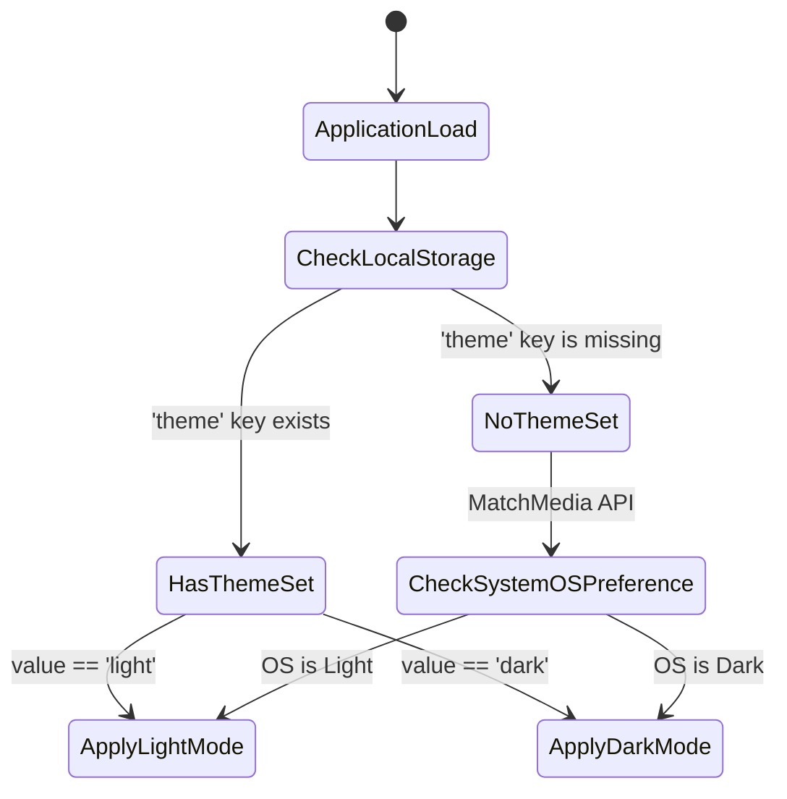
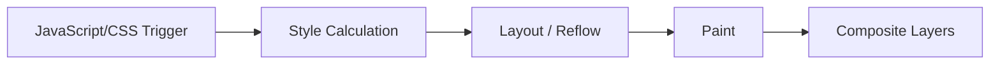

# Lecture 19 — Tailwind CSS: Advanced Patterns, Components & Plugins

**Course:** Full-Stack Web Development  
**Instructor:** Kyrillos Medhat  
**Duration:** 3 hours (Theory + Lab)

---

## 🚦 Prerequisites (What to know before starting)

Before diving into the advanced paradigms of Tailwind CSS, it is imperative that you possess a strong foundation in the following web development disciplines:

1. **Advanced CSS and the Box Model**: Tailwind does not replace CSS; it is a rapid-authoring syntax for CSS. You must intimately understand margins, paddings, borders, flexbox, CSS Grid, positioning contexts (`relative`, `absolute`, `fixed`), and stacking contexts (`z-index`). If you do not know how to build a layout in vanilla CSS, Tailwind will only amplify your confusion and lead to poorly architected DOM structures.
2. **Basic Tailwind Utilities**: You should already be comfortable building simple, static layouts using utility classes such as `flex`, `grid`, `text-center`, `p-4`, `m-2`, `bg-blue-500`, and `text-white`. You should understand responsive prefixes like `md:` and `lg:`.
3. **JavaScript DOM Fundamentals**: We will be implementing features like persistent Dark Mode, which requires manipulating the Document Object Model (`document.documentElement.classList`), handling events, and safely utilizing Browser Storage APIs like `localStorage` and `sessionStorage`.
4. **Modern Framework Awareness**: While Tailwind works beautifully with plain HTML, its true power is unlocked when paired with component-based UI frameworks (React, Vue, Svelte, or Angular). We will look at examples using React to demonstrate proper component abstraction and state management.

> [!NOTE]
> If you are still struggling to remember the exact names of basic utility classes (like whether to use `text-center` vs `align-middle`), keep the official Tailwind documentation or a Cheat Sheet open in another tab. The goal of this lecture is architecture, not memorization.

---

## 🎯 Objectives & Agenda

### Learning Objectives

By the end of this comprehensive lecture, you will be engineered to think like a senior UI developer. You will be able to:

1. **Architect Reusable Components:** Intelligently decide when to use the `@apply` directive in CSS, when to extract logic into a JS framework component, and when to keep utilities inline.
2. **Supercharge with Official Plugins:** Install, configure, and deeply customize plugins like Typography (`.prose`) and Forms to eliminate hundreds of lines of boilerplate CSS.
3. **Master Dark Mode Implementations:** Architect a bulletproof, production-ready dark mode system with state persistence (`localStorage`), operating system preference detection, and zero UI flicker.
4. **Build Complex UI Choreography:** Leverage Tailwind's transition engine, hardware-accelerated transforms, and custom v4 `@keyframes` in the `@theme` directive to create buttery-smooth interactions.
5. **Demystify the Compiler:** Understand exactly how Tailwind's JIT (Just-In-Time) compiler scans your code, extracts strings, and generates the final CSS bundle. You will learn to handle dynamic class names without falling into the "purged class" trap.
6. **Master Advanced State Modifiers:** Go far beyond `hover:` and `focus:` by utilizing `group`, `peer`, and the phenomenally powerful `has-[]` pseudo-selector to create JS-free interactions.
7. **Integrate Utility Functions:** Master the use of tools like `clsx` and `tailwind-merge` to conditionally apply classes without breaking specificity.

### 📋 Agenda

1. **The Component Architecture:** `@apply` vs Inline Utilities vs JS Components
2. **Managing Dynamic Classes:** `clsx` and `tailwind-merge`
3. **Tailwind Plugins Deep Dive:** Typography and Forms
4. **Bulletproof Dark Mode:** Architecture and Implementation Strategies
5. **Motion & Interaction:** The Rendering Pipeline, Transitions, and Animations
6. **Compiler Secrets:** JIT Content Detection, Purging, and Safelisting
7. **Advanced Responsive & State Patterns:** `group`, `peer`, and `:has()`
8. **Think Like a Developer:** Real-world Scenarios & Architectural Decisions
9. **Before vs After:** Legacy BEM vs Modern Utility Approaches
10. **Common Mistakes & How to Avoid Them**
11. **Labs & Assignments**
12. **Interview Preparation**
13. **Ultimate Cheat Sheet & Key Takeaways**

---

## 1. The Component Architecture: `@apply` vs Inline Utilities vs JS Components

One of the most heated debates in the styling ecosystem—and a major hurdle for developers migrating to Tailwind—is how to handle repetition. When you have a button with 20 utility classes, copying and pasting it 50 times across your project feels inherently wrong. It triggers your "Don't Repeat Yourself" (DRY) alarm. Let's explore the architectural solutions and why one is vastly superior.

### The Problem: Utility Bloat

Consider a standard, highly polished primary button. It has a gradient background, shadow, specific paddings, font weights, and complex hover/focus states:

```html
<!-- A standard primary button with 16 classes -->
<button class="px-6 py-3 bg-gradient-to-r from-blue-600 to-indigo-600 text-white font-semibold rounded-lg shadow-md hover:from-blue-700 hover:to-indigo-700 hover:shadow-lg focus:outline-none focus:ring-2 focus:ring-indigo-500 focus:ring-offset-2 transition-all duration-200 active:scale-95 disabled:opacity-50 disabled:cursor-not-allowed">
  Submit Action
</button>
```

Pasting this block 50 times is completely unmaintainable. If the marketing team decides to change the button's padding from `py-3` to `py-4`, doing a global search-and-replace is dangerous and error-prone.

### Approach A: The `@apply` Directive (The Traditional Instinct)

Tailwind provides the `@apply` directive to let you extract these utility classes into a single, custom CSS class within your stylesheets.

```css
/* main.css */
@layer components {
  .btn-primary {
    @apply px-6 py-3 bg-gradient-to-r from-blue-600 to-indigo-600 text-white font-semibold 
           rounded-lg shadow-md hover:from-blue-700 hover:to-indigo-700 hover:shadow-lg 
           focus:outline-none focus:ring-2 focus:ring-indigo-500 focus:ring-offset-2 
           transition-all duration-200 active:scale-95 disabled:opacity-50 
           disabled:cursor-not-allowed;
  }
}
```

```html
<!-- Much cleaner HTML! Right? -->
<button class="btn-primary">Submit Action</button>
```

> [!WARNING]
> **The `@apply` Anti-Pattern**  
> While `@apply` seems like the perfect solution to the DRY problem, overusing it completely destroys the primary benefits of Tailwind.
> 1. You lose the colocation of styles and markup (you have to context-switch between CSS and HTML files again).
> 2. You re-introduce naming fatigue (what do we call the secondary outlined button with an icon? `.btn-secondary-outlined-icon`?).
> 3. Your CSS bundle size grows linearly with every new class you invent, rather than staying perfectly flat.
> 
> If you extract everything into `.card`, `.header`, and `.footer`, you are simply writing legacy BEM (Block Element Modifier) CSS with Tailwind syntax.

### Approach B: Component Abstraction (The Senior Engineer's Choice)

Instead of abstracting the **CSS styles**, you should abstract the **HTML markup**. If you are using a framework like React, Vue, Angular, Svelte, or even a server-side templating engine like Blade, ERB, or EJS, you should put the long class string inside a reusable component.

This encapsulates not just the styling, but also the logic, accessibility attributes, and loading states.

**A Professional React Button Component Example:**

```tsx
// components/ui/Button.tsx
import React from 'react';

// Using TypeScript for strict variant enforcement
interface ButtonProps extends React.ButtonHTMLAttributes<HTMLButtonElement> {
  variant?: 'primary' | 'secondary' | 'danger' | 'ghost';
  size?: 'sm' | 'md' | 'lg';
  isLoading?: boolean;
}

export const Button: React.FC<ButtonProps> = ({ 
  children, 
  variant = 'primary', 
  size = 'md', 
  isLoading = false,
  className = '',
  ...props 
}) => {
  // 1. Base styles applied to ALL buttons
  const baseClasses = "inline-flex items-center justify-center font-semibold rounded-lg shadow-sm focus:outline-none focus:ring-2 focus:ring-offset-2 transition-all duration-200 active:scale-95 disabled:opacity-50 disabled:cursor-not-allowed disabled:active:scale-100";
  
  // 2. Variant dictionary
  const variants = {
    primary: "bg-blue-600 text-white hover:bg-blue-700 focus:ring-blue-500 border border-transparent",
    secondary: "bg-white text-gray-700 border border-gray-300 hover:bg-gray-50 focus:ring-gray-500 shadow-sm",
    danger: "bg-red-600 text-white hover:bg-red-700 focus:ring-red-500 border border-transparent",
    ghost: "bg-transparent text-gray-700 hover:bg-gray-100 focus:ring-gray-500 shadow-none"
  };

  // 3. Size dictionary
  const sizes = {
    sm: "px-3 py-1.5 text-sm",
    md: "px-5 py-2.5 text-base",
    lg: "px-8 py-4 text-lg"
  };

  // 4. Compose the final class string
  const finalClasses = `${baseClasses} ${variants[variant]} ${sizes[size]} ${className}`;

  return (
    <button className={finalClasses} disabled={isLoading || props.disabled} {...props}>
      {isLoading && (
        <svg className="animate-spin -ml-1 mr-2 h-4 w-4 text-current" fill="none" viewBox="0 0 24 24">
          <circle className="opacity-25" cx="12" cy="12" r="10" stroke="currentColor" strokeWidth="4" />
          <path className="opacity-75" fill="currentColor" d="M4 12a8 8 0 018-8V0C5.373 0 0 5.373 0 12h4z" />
        </svg>
      )}
      {children}
    </button>
  );
};
```

By abstracting at the component layer, the complex utility string only exists **once** in your source code, but you maintain all the speed and readability of Tailwind, plus you get behavior abstraction!

### When SHOULD You Use `@apply`?

If it's an anti-pattern, why does it exist? There are extremely valid use cases for `@apply`:

1. **Styling third-party HTML:** When you render Markdown to HTML via a CMS, or use a third-party library that spits out raw HTML components that you cannot wrap.
2. **Global Resets:** Setting universal typography or link styling in the `@layer base`.
3. **No JS Framework Environment:** If you are building plain static `.html` files with absolutely zero templating (no PHP, no React, just raw HTML), and you absolutely must avoid copying massive strings.

---

## 2. Managing Dynamic Classes: `clsx` and `tailwind-merge`

When you build UI components (like the Button above), you often need to conditionally apply classes based on component state (e.g., `isError`, `isActive`). Concatenating strings manually (`className={'btn ' + (isActive ? 'active' : '')}`) is ugly and error-prone.

Enter **`clsx`** and **`tailwind-merge`**. This combination is the industry standard for component class management.

```bash
npm install clsx tailwind-merge
```

### The Specificity Problem

Tailwind's CSS output has a specific order. If you try to merge two classes targeting the same property, the one that appears *later in the CSS stylesheet* wins, NOT the one that appears later in the HTML class string.

```jsx
// Problem:
<div className="bg-blue-500 bg-red-500"></div>
// Which color wins? It depends on Tailwind's internal generation order.
```

### The Solution: `cn()` utility function

We create a utility function that conditionally joins classes (`clsx`) and resolves Tailwind specificity conflicts (`twMerge`).

```ts
// lib/utils.ts
import { clsx, type ClassValue } from "clsx";
import { twMerge } from "tailwind-merge";

export function cn(...inputs: ClassValue[]) {
  return twMerge(clsx(inputs));
}
```

**Usage in a Component:**

```tsx
import { cn } from "@/lib/utils";

export function Alert({ type, message, className }) {
  return (
    <div className={cn(
      "p-4 rounded-md border text-sm font-medium", // Base styles
      type === "error" && "bg-red-50 border-red-500 text-red-900", // Conditional
      type === "success" && "bg-green-50 border-green-500 text-green-900", // Conditional
      className // Overrides passed from parent safely merge
    )}>
      {message}
    </div>
  );
}

// Parent rendering:
// The parent passes "bg-red-100", twMerge automatically removes "bg-red-50" to prevent conflict!
<Alert type="error" message="Failed!" className="bg-red-100 shadow-lg" />
```

---

## 3. Tailwind Plugins Deep Dive

Tailwind core focuses on generic utility classes. However, certain styling challenges are so ubiquitous and complex that solving them with inline utilities is either impossible or extremely painful. Tailwind offers official plugins to handle these scenarios.

### The Typography Plugin (`@tailwindcss/typography`)

**The Challenge:** Whenever your application renders user-generated content—like a blog post written in Markdown, or output from a WYSIWYG rich text editor—you do not control the resulting HTML. You receive raw tags like `<h1>`, `<h2>`, `<blockquote>`, `<ol>`, and `<code>`. You cannot attach `text-2xl font-bold mb-4` to every `<h1>` because the HTML is generated dynamically from a database.

The Typography plugin provides a single magical class, `.prose`, which acts as a massive contextual selector. It targets nested elements and styles them with beautiful, mathematically harmonious typography defaults.

**Installation:**
```bash
npm install @tailwindcss/typography
```

**Configuration (Tailwind v4):**
```css
/* Add this to your global app.css file */
@plugin "@tailwindcss/typography";
```

**Usage & Customization in HTML:**
```html
<!-- The wrapper class applies complex CSS to all children -->
<article class="prose prose-slate lg:prose-xl dark:prose-invert 
                prose-headings:font-serif prose-headings:tracking-tight 
                prose-a:text-blue-600 hover:prose-a:text-blue-500 
                prose-img:rounded-xl prose-img:shadow-lg">
                
  <h1>The Magic of Typography</h1>
  <p>This paragraph, generated from a CMS database, will have perfect line height, a comfortable reading max-width (usually around 65 characters), and proper vertical margins.</p>
  
  <blockquote>
    <p>Even blockquotes are automatically styled with a left border and italicized text.</p>
  </blockquote>
  
  <ul>
    <li>Nested list item 1</li>
    <li>Nested list item 2</li>
  </ul>
  
  <pre><code>console.log("Syntax highlighted code block!");</code></pre>
</article>
```

### The Forms Plugin (`@tailwindcss/forms`)

Browser default form elements are notoriously ugly and inconsistent. The Forms plugin applies an aggressive reset to inputs, selects, and checkboxes, making them inherit your site's typography and respond predictably to utilities.

**Installation:**
```bash
npm install @tailwindcss/forms
```

**Configuration:**
```css
@plugin "@tailwindcss/forms";
```

With the plugin, `<input type="text" class="rounded border-gray-300 focus:border-blue-500 focus:ring-blue-500">` results in a perfectly crisp, flat input field that looks identical across all devices.

---

## 4. Bulletproof Dark Mode Architecture

Modern web applications are expected to support dark mode. Tailwind makes styling dark mode incredibly easy with the `dark:` variant. However, architecting the state management—remembering the user's choice and avoiding screen flickering—is where junior developers fail.

### The Three-State Theme Logic

A robust application respects three distinct user states:
1. **Light Mode** (Explicitly chosen by the user in your app settings)
2. **Dark Mode** (Explicitly chosen by the user in your app settings)
3. **System** (No explicit choice made; the app inherits the OS preference)



### Implementation Steps

#### 1. Enable Custom Variant (Tailwind v4 native)

Tailwind v4 uses a CSS-native approach to define dark mode based on a class applied to a parent element (usually `<html>`).

```css
/* In your global CSS (app.css) */
@custom-variant dark (&:where(.dark, .dark *));
```

#### 2. Prevent the "Flash of Unstyled Content" (FOUC)

If you build a React/Vue SPA (Single Page Application), the JavaScript bundle might take 1 to 2 seconds to download. If your dark mode logic lives inside a React `useEffect`, users who prefer dark mode will be blinded by a bright white screen for 2 seconds before the app suddenly flashes black.

**The Solution:** You must place a tiny, blocking, immediate-execution inline script directly inside the `<head>` of your HTML document.

```html
<!-- index.html -->
<head>
  <meta charset="UTF-8">
  <title>My App</title>
  
  <!-- Critical Render-Blocking Script to prevent FOUC -->
  <script>
    try {
      if (localStorage.getItem('theme') === 'dark' || (!('theme' in localStorage) && window.matchMedia('(prefers-color-scheme: dark)').matches)) {
        document.documentElement.classList.add('dark');
      } else {
        document.documentElement.classList.remove('dark');
      }
    } catch (_) {}
  </script>
</head>
```

#### 3. Applying the Utilities Effectively

Once `.dark` is applied to the `<html>` root, prefix your UI utilities with `dark:`.

> [!TIP]
> Always add `transition-colors duration-300` to your primary layout containers like `<body class="bg-white text-black dark:bg-gray-900 dark:text-white transition-colors duration-300">`. When the user clicks the toggle, the entire background will smoothly fade to black rather than jarringly snapping, offering a highly premium, Apple-like user experience.

---

## 5. Motion & Interaction: The Rendering Pipeline, Transitions, and Animations

Web applications cross the threshold from "usable" to "premium" when they respond smoothly to user interactions.

### The Browser Rendering Pipeline (Why Performance Matters)

To understand Tailwind's animation architecture, you must understand how a browser draws pixels to the screen. 



- **Layout (Expensive):** If you animate `width`, `height`, `margin`, or `padding`, the browser must recalculate the dimensions of *every other element on the page* 60 times a second. This causes severe stuttering and low FPS on mobile devices.
- **Paint (Moderate):** Animating colors, shadows, or borders requires repainting pixels but doesn't shift geometry.
- **Composite (Cheap):** Animating `transform` (Translate, Scale, Rotate) and `opacity`. The browser hands this math directly to the device's GPU (Graphics Processing Unit). It runs at a locked, buttery-smooth 60 or 120 FPS.

### Hardware Accelerated Transforms in Tailwind

Because we want GPU acceleration, we almost exclusively use Tailwind's transform utilities combined with transitions.

```html
<!-- A sophisticated interactive card -->
<div class="p-6 bg-white rounded-xl shadow-sm border border-gray-100 
            hover:-translate-y-2 hover:shadow-2xl hover:border-blue-500
            transition-all duration-300 ease-out transform-gpu cursor-pointer">
  <h3 class="text-xl font-bold">Interactive Premium Card</h3>
  <p class="mt-2 text-gray-500">Hover me to see hardware-accelerated magic.</p>
</div>
```

### Custom Keyframe Animations (Tailwind v4)

Tailwind provides `animate-spin`, `animate-pulse`, `animate-bounce`, and `animate-ping` out of the box. But complex UIs require custom choreography.

In Tailwind v4, we define these in the `@theme` directive in your main CSS file.

```css
/* app.css */
@theme {
  --animate-slide-up-fade: slideUpFade 0.6s cubic-bezier(0.16, 1, 0.3, 1) forwards;
  --animate-shake-error: shake 0.5s cubic-bezier(0.36, 0.07, 0.19, 0.97) both;
  
  @keyframes slideUpFade {
    0% { 
      opacity: 0; 
      transform: translateY(40px) scale(0.95); 
    }
    100% { 
      opacity: 1; 
      transform: translateY(0) scale(1); 
    }
  }
  
  @keyframes shake {
    10%, 90% { transform: translate3d(-1px, 0, 0); }
    20%, 80% { transform: translate3d(2px, 0, 0); }
    30%, 50%, 70% { transform: translate3d(-4px, 0, 0); }
    40%, 60% { transform: translate3d(4px, 0, 0); }
  }
}
```

Now you can orchestrate complex UI state easily:
```html
<main class="animate-slide-up-fade">
  <h1>Welcome to the Dashboard</h1>
</main>
```

---

## 6. Compiler Secrets: JIT Content Detection, Purging, and Safelisting

To truly master Tailwind, you must stop thinking of it as a CSS framework and start thinking of it as a **build-time string parsing engine**. Tailwind scans your source code, finds the exact classes you used, and generates a minimal (usually <10KB) CSS file containing *only* those classes.

### The Dynamic String Trap (The Most Common Error)

Because the compiler runs at build-time using simple text extraction (regex), it does not execute JavaScript. It does not know what variables evaluate to.

```javascript
// ❌ THIS WILL FAIL IN PRODUCTION
function StatusBadge({ status }) {
  // If status is 'success', color resolves to 'green'
  const color = status === 'success' ? 'green' : 'red';
  
  // Tailwind's compiler looks for FULL strings. It sees `bg-${color}-500`.
  // It does NOT see "bg-green-500". The CSS rule is never generated.
  return <span className={`bg-${color}-500 text-white px-2 py-1`}>{status}</span>
}
```

### The Architecture Solution: Complete Strings

You must map variable states to complete, unbroken class name strings.

```javascript
// ✅ THIS WORKS PERFECTLY
function StatusBadge({ status }) {
  // The compiler scans this file, sees the literal string "bg-green-500",
  // and says, "Aha! I need to include that in the final CSS."
  const colorMap = {
    success: 'bg-green-500',
    error: 'bg-red-500',
    warning: 'bg-yellow-500',
    info: 'bg-blue-500'
  };
  
  return <span className={`${colorMap[status]} text-white px-2 py-1`}>{status}</span>
}
```

### Advanced Safelisting via `@source` (Tailwind v4)

Sometimes, class names are stored in a database and sent via an API response. In this scenario, the strings literally do not exist in your local source code. You must force the compiler to generate them.

```css
/* Force generation of a specific list of dynamic classes */
@source inline("bg-brand-500 text-brand-900 border-brand-500");

/* Point the compiler to look inside external template directories */
@source "../../backend-repo/templates/**/*.twig";
```

---

## 7. Advanced Responsive & State Patterns

Tailwind excels at removing the need to write complex pseudo-selector CSS rules.

### The `group` Modifier (Parent to Child State Inheritance)

**Scenario:** You want an icon inside a button to shift right when the *button itself* is hovered.
**Solution:** Mark the parent with `group`, and make the child react with `group-hover:`.

```html
<button class="group flex items-center justify-between w-64 px-4 py-3 bg-slate-800 rounded-xl hover:bg-slate-700 transition-colors">
  <span class="text-white font-medium">Proceed to Checkout</span>
  
  <!-- This SVG reacts to the parent's hover state! -->
  <svg class="w-5 h-5 text-slate-400 group-hover:text-white group-hover:translate-x-2 transition-all duration-300" fill="none" viewBox="0 0 24 24" stroke="currentColor">
    <path stroke-linecap="round" stroke-linejoin="round" stroke-width="2" d="M14 5l7 7m0 0l-7 7m7-7H3" />
  </svg>
</button>
```

### The `peer` Modifier (Sibling to Sibling Reaction)

**Scenario:** You want to show an error message paragraph *only* when the input above it fails HTML5 native validation.
**Solution:** Mark the input as `peer`, and make the sibling message react to `peer-invalid:`.

```html
<div class="flex flex-col space-y-1">
  <label class="text-sm font-medium text-gray-700">Email Address</label>
  
  <input type="email" required placeholder="john@example.com"
         class="peer border border-gray-300 rounded-md px-4 py-2 
                invalid:[&:not(:placeholder-shown)]:border-red-500 
                invalid:[&:not(:placeholder-shown)]:text-red-600" />
  
  <p class="hidden peer-invalid:[&:not(:placeholder-shown)]:block text-sm text-red-500 mt-1">
    Please enter a valid, properly formatted email address.
  </p>
</div>
```

### The `has-[]` Modifier (Parent Reacting to Child)

CSS `:has()` acts as a "parent selector." 
**Scenario:** Style an entire `<div>` card to look "selected" if the radio button deep *inside* of it is checked.

```html
<!-- The parent DIV detects if any child input is checked! -->
<label class="has-[:checked]:bg-blue-50 has-[:checked]:border-blue-600 has-[:checked]:ring-1 has-[:checked]:ring-blue-600 
              border border-gray-200 rounded-xl p-6 flex cursor-pointer transition-all">
              
  <div class="flex-1">
    <h4 class="text-lg font-bold text-gray-900">Professional Plan</h4>
    <p class="text-gray-500 mt-1">$49.99 / month</p>
  </div>
  
  <input type="radio" name="pricing_plan" value="pro" class="sr-only" />
</label>
```

---

## 🧠 Think Like a Developer (Real-World Scenarios)

To bridge the gap between knowing the syntax and engineering real applications, let's walk through a typical decision a senior developer makes during an enterprise project build.

### Scenario 1: The External Library Conundrum
**The Situation:** You are installing a third-party React package `react-day-picker` to handle complex calendar logic. The library renders a hardcoded HTML structure like `<table class="rdp-table"><tbody class="rdp-tbody">...`. You cannot inject Tailwind classes directly into the library's internal DOM.
**The Inner Monologue & Decision:** 
- *Option A: Ignore Tailwind and write standard CSS overrides.* (Bad idea: breaks my design system tokens and colors).
- *Option B: Use arbitrary selectors.* (Good idea).
- *The Senior Solution:* I will wrap the calendar component in a div and use Tailwind's arbitrary variants to pierce the shadow DOM / external component. 
```html
<div class="[&_.rdp-table]:w-full [&_.rdp-day_button]:rounded-full [&_.rdp-day_selected]:bg-blue-600 [&_.rdp-day_selected]:text-white">
  <DayPicker />
</div>
```
This keeps all styling collocated in the React component and strictly uses my Tailwind tokens!

---

## ⚖️ Before vs After: The Evolution of Styling Architecture

### Complex State Linkage (Legacy BEM vs Tailwind)

**Before (Legacy SCSS / BEM Architecture):**
We had to define distant relationships in detached files. Finding where a hover effect was originating required intense dev-tools debugging.

```scss
/* sidebar.scss */
.sidebar {
  padding: 1rem;
  background-color: #1f2937;
  
  &__item {
    display: flex;
    color: #9ca3af;
    
    .icon {
      fill: #4b5563;
      transition: transform 0.2s, fill 0.2s;
    }

    &:hover {
      color: #f9fafb;
      .icon { fill: #3b82f6; transform: scale(1.1); }
    }
  }
}
```

**After (Tailwind CSS):**
The relationship is strictly localized to the HTML structure.

```html
<!-- Inside Sidebar.tsx component -->
<nav class="p-4 bg-gray-800">
  <a href="#" class="group flex items-center text-gray-400 hover:text-gray-50 transition-colors duration-200">
    <svg class="mr-2 fill-gray-600 group-hover:fill-blue-500 group-hover:scale-110 transition-all duration-200">
      <!-- icon path -->
    </svg>
    Dashboard
  </a>
</nav>
```
*Why it's infinitely better:* No CSS specificity wars. No "leaking" styles. Perfect dead-code elimination if you delete the tag.

---

## ⚠️ Common Mistakes & How to Avoid Them

| ❌ The Junior Mistake | 💥 The Disastrous Consequence | ✅ The Senior Fix |
|---|---|---|
| **Dynamic String Concatenation** (`class="bg-${statusColor}-500"`) | The class is purged. It works locally while caching, but breaks completely when deployed to production. | Use full class names in maps: `status === 'success' ? 'bg-green-500' : 'bg-red-500'`. |
| **Animating `height`, `width`, or `margin`** | Causes layout thrashing. The UI feels incredibly cheap, jittery, and low-FPS on mobile devices. | Animate `transform` (`translate`, `scale`) and `opacity` instead, using `transform-gpu` to force hardware acceleration. |
| **Abusing `@apply` for component reuse** | Massive CSS bundle sizes. Naming fatigue. You end up recreating Bootstrap. | Abstract to framework components (React/Vue). Use `@apply` only for rich-text CMS overrides or global root variables. |
| **Forgetting Dark Mode edge-cases** | You apply `dark:bg-gray-900` but forget to override borders and shadows, resulting in ugly dark grey boxes. | Audit meticulously. Remember borders (`dark:border-gray-700`), shadows (`shadow-white/10`), and placeholder text. |
| **Missing FOUC Script** | Users who prefer dark mode are hit with a blinding white light flash on page load while React boots up. | Place the immediate-execution theme script natively in the `<head>` tag of the `index.html` file, blocking render. |

---

## 🧪 Labs & Assignments

### Lab 1 — Building an Advanced Multi-State Animated Modal
**Goal:** Create a highly accessible, beautifully choreographed Modal purely using Tailwind's state variants, hardware transforms, and custom keyframes.

**Step-by-Step Instructions:**
1. **Define the Animations**: Open your `app.css` file. In the `@theme` block, define `scale-up-fade` (scale 0.95 + opacity 0 to scale 1 + opacity 1). Set it to `0.2s ease-out forwards`.
2. **The Backdrop Setup**: Create a fixed, full-screen `div` (`inset-0 z-50 fixed`). Apply `bg-black/60` and `backdrop-blur-sm`.
3. **The Modal Box**: Inside the backdrop, use Flexbox to center content. Create the modal container: `bg-white dark:bg-slate-800 rounded-2xl shadow-2xl animate-scale-up-fade`.
4. **Interactive Close Button**: Create a close `X` button in the top right. Use the `group` modifier. Make the SVG inside rotate exactly 90 degrees on hover: `group-hover:rotate-90 transition-transform`.
5. **The Footer Actions**: Create 'Cancel' and 'Confirm' buttons. Ensure they are fully keyboard accessible by adding `focus:ring-2 focus:ring-blue-500`.
6. **Dark Mode Audit**: Ensure every piece of text, border separator, and background inside the modal has explicit `dark:` counterparts.

### Lab 2 — The Intelligent CSS-Only Toggle Switch
**Goal:** Recreate an iOS-style toggle switch that operates purely on HTML5/CSS, driving state changes without a single line of JavaScript.

**Step-by-Step Instructions:**
1. **The Architecture**: Use a parent `<label>` element holding a hidden checkbox `<input type="checkbox" class="peer sr-only" />`. (`sr-only` is critical—it hides it visually but screen-readers can still interact with it).
2. **The Track**: Create a `div` that represents the pill background: `w-14 h-8 bg-gray-200 rounded-full peer-checked:bg-blue-600 transition-colors`.
3. **The Knob (Thumb)**: Inside the track, place the white circle: `w-6 h-6 bg-white rounded-full absolute top-1 left-1 transition-transform peer-checked:translate-x-6 shadow-md`.
4. **The Reaction Logic**: Add sibling text elements that react to the `peer`.
   ```html
   <span class="block peer-checked:hidden text-gray-500">Monthly Billing</span>
   <span class="hidden peer-checked:block text-blue-600 font-bold">Annual Billing (Save 20%)</span>
   ```

---

## 📝 Capstone Assignment: "LaunchDeck" Admin Layout

**Project Scope:**
You are hired to build the foundational layout for a SaaS administrator dashboard utilizing everything learned in this module.

**Requirements Checklist:**
- [ ] **Persistent Dark Mode Engine**: Implement the robust `localStorage` architecture with the `<head>` FOUC prevention script.
- [ ] **Typography Integration**: Build a "Changelog" view route. Fetch a dummy Markdown string from an API, render it to HTML, and style it perfectly using `@tailwindcss/typography` (`.prose`). Ensure it supports `dark:prose-invert`.
- [ ] **Sophisticated Sidebar Navigation**: 
   - Utilize `group/navlink` on navigation anchors.
   - The icon should be `text-slate-500 group-hover/navlink:text-indigo-500`.
   - Implement an active state indicator (a left border) that slides in using `transform: translateX` and `opacity`.
- [ ] **Forms Plugin Configuration**: Build an "Account Settings" profile form utilizing `@tailwindcss/forms`. Implement native HTML5 validation UI using the `peer` and `invalid:` modifiers on the email and password fields.
- [ ] **Dynamic Component Logic**: Create a `<StatusBadge>` component that utilizes `clsx` and `tailwind-merge` to safely resolve conflicting utility classes passed from the parent layout.

---

## 💼 Technical Interview Preparation

These questions are frequently asked in Mid/Senior Frontend Engineering interviews involving Tailwind architecture.

**Q1: "What are the primary drawbacks of Tailwind CSS, and how do you architect your application to mitigate them?"**
> **Answer:** The main drawback is often cited as "HTML bloat"—incredibly long class strings that make the DOM difficult to parse visually. This is mitigated by strictly enforcing Component-Driven Development (abstracting logic and styles into reusable React/Vue components) rather than repeatedly writing inline utilities. Furthermore, naming collisions or specificity wars can occur if developers abuse `@apply` and mix it with BEM CSS.

**Q2: "Can you explain how Tailwind's JIT engine optimizes for production? Does it ship a massive CSS file?"**
> **Answer:** No, it ships an incredibly tiny file. Tailwind acts as a build-time compiler. It uses a RegEx-based text scanner to scan all files defined in your config. It extracts any string matching a Tailwind utility class format. It then generates a minified CSS file containing *only* the specific classes you actually wrote in your codebase.

**Q3: "How do you handle dynamic styling, such as applying a color class based on an API response?"**
> **Answer:** Because the compiler runs at build time and uses static text analysis, you cannot dynamically construct strings like `` class={`bg-${apiColor}-500`} ``. The compiler will not execute the JavaScript and the class will be purged. You must map API responses to complete, literal class name strings, or use inline styles (`style={{ backgroundColor: apiHex }}`) for entirely arbitrary, user-defined values.

**Q4: "What is the mechanical difference between `hover:` and `group-hover:`?"**
> **Answer:** `hover:` applies the CSS utility only when the specific element possessing the class is hovered. `group-hover:` applies the utility to a child element when its *parent* (which has been explicitly marked with the `group` class) is hovered. This is essential for coordinating synchronized animations across multiple nested DOM elements.

**Q5: "Why do we use `tailwind-merge` instead of just concatenating strings or using standard `clsx`?"**
> **Answer:** Because Tailwind's output CSS order dictates which class wins when there are conflicts (e.g., `px-4` vs `p-8`), not the order in the HTML string. Standard `clsx` will output `px-4 p-8`, but if `px-4` is compiled later in the CSS file, it overrides the horizontal padding of `p-8`. `tailwind-merge` understands Tailwind's internal rules and strips out `px-4`, outputting just `p-8`.

---

## ⚡ Ultimate Advanced Modifiers Cheat Sheet

Keep this reference handy when architecting complex UI state relationships.

| Feature / Modifier | Syntax Example | What it does / Primary Use Case |
| :--- | :--- | :--- |
| **Arbitrary Values (JIT)** | `w-[320px]`, `bg-[#1da1f2]`, `top-[117px]` | Break out of the design system for one-off pixel measurements or specific brand hex codes without altering the config file. |
| **Named Groups** | `group/card`, `group-hover/card:scale-105` | Prevents trigger conflicts when nesting multiple parent elements that all have separate hover states. |
| **Peers** | `peer`, `peer-checked:bg-blue-500` | Styles a sibling element based strictly on the state of a preceding sibling (essential for custom checkboxes/toggles). |
| **Parent Selector (`:has`)**| `has-[:invalid]:border-red-500` | Styles a parent `<div>` if ANY descendant child element meets a specific condition (e.g., has an invalid input or is checked). |
| **Space Between** | `space-x-4`, `space-y-6` | An elegant alternative to Flex/Grid `gap`. Automatically injects margin between all child elements *except* the first one. |
| **Divide** | `divide-y divide-gray-200` | Instantly applies a border between list items or table rows. Eliminates the need for complex `border-b last:border-0` logic. |
| **Line Clamping** | `truncate`, `line-clamp-3` | `truncate` adds `...` to a single overflowing line. `line-clamp-3` elegantly cuts off text block after exactly 3 lines. |
| **Backdrop Filters** | `backdrop-blur-md backdrop-saturate-150` | Applies "Apple-style" frosted glass effects. The element *must* possess a semi-transparent background (e.g., `bg-white/50`). |
| **Arbitrary Selectors** | `[&_p]:mt-4`, `[&>div]:p-4` | Writes raw CSS selectors directly inline to target deeply nested HTML you do not control (like third-party library outputs). |

---

## 📌 Key Takeaways & Resources

### Executive Summary
1. **Component Abstraction Trumps CSS Abstraction:** In the modern web development era, always prefer encapsulating complex Tailwind utility strings inside React/Vue components rather than stuffing them into `@apply` rules. Keep your CSS flat and your components smart.
2. **Resolve Conflicts with `tailwind-merge`:** When building reusable UI components that accept `className` props, always process them through `twMerge` to guarantee predictable rendering behavior.
3. **Plugins are Force Multipliers:** Never manually write CSS to style raw Markdown or baseline Form Inputs. Rely on `@tailwindcss/typography` and `@tailwindcss/forms` to save hours of edge-case cross-browser debugging.
4. **Dark Mode is Critical State:** Treat Dark Mode not just as a visual CSS trick, but as a critical piece of application state architecture that must be correctly persisted and protected against rendering lifecycle flaws.
5. **Performance via Hardware:** Always animate `transform` and `opacity`. Never animate `width`, `height`, or `margins`. Utilize custom `@keyframes` mapped in `@theme` for complex visual choreography.
6. **Respect the Compiler:** The Tailwind compiler is a static text scanner. Respect its mechanical limitations by always providing whole, uninterrupted class name strings in your code's logic branches.

### Essential Reading & Documentation
- [Official Tailwind CSS Documentation](https://tailwindcss.com/docs)
- [Tailwind Typography Plugin GitHub Repository](https://github.com/tailwindlabs/tailwindcss-typography)
- [Tailwind Forms Plugin Overview](https://github.com/tailwindlabs/tailwindcss-forms)
- [clsx and tailwind-merge (shadcn/ui setup)](https://ui.shadcn.com/docs/installation)
- [Headless UI (Unstyled Accessible UI Components for React/Vue)](https://headlessui.com/)

---

**Next Lecture:** [Lecture 20 — TypeScript Fundamentals: Types, Interfaces & Compilation](../Module%205%20-%20TypeScript/20%20-%20TypeScript%20Fundamentals%20-%20Types%2C%20Interfaces%20%26%20Compilation.md)

### 📚 Extensive Tutorials & Resources
- **CSS-Tricks:** [A Complete Guide to CSS](https://css-tricks.com/)
- **FreeCodeCamp:** [Advanced CSS Course](https://www.freecodecamp.org/news/advanced-css-course/)
- **Web.dev:** [Learn CSS](https://web.dev/learn/css/)
