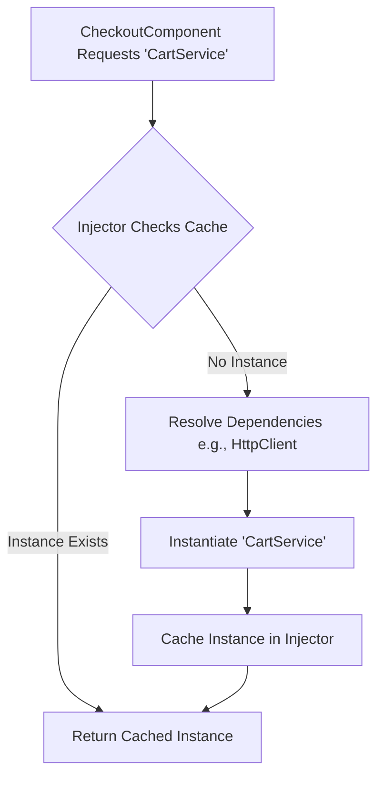

# Lecture 28 — Angular Services & Dependency Injection

**Course:** Full-Stack Web Development  
**Instructor:** Kyrillos Medhat  
**Duration:** 3 hours (Theory + Lab)

---

## 🛑 1. Prerequisites (What to know before starting)
Before diving into this comprehensive lecture, you should have a solid grasp of the following concepts:
- **TypeScript Fundamentals:** Deep understanding of Classes, interfaces, access modifiers (`private`, `public`, `readonly`), and decorators (the `@` syntax). You should be comfortable with generics (e.g., `Array<T>`).
- **Angular Basics:** Components, Templates, and Directives (like `*ngIf`, `*ngFor` or the modern control flow `@if`, `@for`).
- **Design Patterns:** A high-level understanding of the Singleton pattern (one instance shared everywhere) and Inversion of Control (IoC).
- **RxJS Introduction:** Basic awareness of Observables and Subscriptions. You should know what a data stream is conceptually.
- **Signals (Introductory):** A basic understanding of Angular Signals (`signal()`, `computed()`, `effect()`) will be highly beneficial as we transition reactive state into signals.

---

## 🎯 2. Objectives & Agenda

### Learning Objectives
By the end of this comprehensive session, you will be able to:
1. **Architect** Angular applications with a clear separation of concerns by extracting business logic, data access, and state into dedicated Services.
2. **Master Dependency Injection (DI):** Understand how the Angular DI engine instantiates, caches, and provides dependencies under the hood.
3. **Navigate the Injector Hierarchy:** Decide exactly when to use `providedIn: 'root'` versus component-level providers to manage instance lifecycles.
4. **Leverage Modern APIs:** Transition from legacy constructor injection to the modern, functional `inject()` function.
5. **Implement Custom Providers:** Use `InjectionToken`, `useValue`, `useClass`, `useExisting`, and `useFactory` to inject non-class dependencies and dynamically resolve services.
6. **Master Resolution Modifiers:** Utilize `@Optional()`, `@SkipSelf()`, `@Self()`, and `@Host()` (and their `inject()` equivalents) to finely tune how the DI tree searches for dependencies.
7. **Build State Containers:** Architect predictable state management using RxJS `BehaviorSubject` to share state across disjointed components.
8. **Bridge Paradigms:** Connect RxJS asynchronous data streams to the modern Angular Signals API using `toSignal()`.
9. **Prevent Memory Leaks:** Implement robust subscription cleanup strategies, including `takeUntilDestroyed` and `DestroyRef`.
10. **Test Robustly:** Write highly effective unit tests using `TestBed` and mock services.

### Agenda
**Part 1 — The Architecture of Services & Core DI (~60 min)**
- The Core Philosophy of Services & Separation of Concerns
- Creating Services & The `@Injectable` Decorator
- The Dependency Injection (DI) Engine: Inversion of Control
- The Injector Hierarchy: Element Injectors vs Environment Injectors

**Part 2 — Advanced Injection & Custom Providers (~60 min)**
- Modern DI: `inject()` vs Constructor Injection
- Deep Dive: `useClass`, `useValue`, `useFactory`, `useExisting`
- Providing Non-Class Dependencies: `InjectionToken`
- DI Resolution Modifiers: Controlling the Injector Search

**Part 3 — Reactivity, State, and Memory Management (~60 min)**
- State Management with RxJS `BehaviorSubject` (The State Container Pattern)
- Bridging RxJS to Signals with `toSignal()`
- The Memory Leak Killer: `takeUntilDestroyed` and `DestroyRef`
- Testing Services using `TestBed` and Mocks

---

## 🏗️ 3. Deep Numbered Sections

### 3.1. The Core Philosophy of Services
In any robust front-end framework, the UI layer (Components) should be as "dumb" as possible. Components should focus entirely on data binding, handling user events (clicks, typing), and rendering templates. 

A **Service** in Angular is a TypeScript class equipped with the `@Injectable()` decorator. It is the designated, centralized place for:
- **Data fetching:** Communicating with backend APIs via `HttpClient`.
- **State management:** Holding data that multiple components need to access (e.g., shopping cart contents, authenticated user details).
- **Cross-component communication:** Acting as a bridge between components that don't have a parent-child relationship.
- **Reusable business logic:** Complex calculations, data transformations, and validations.
- **Interacting with browser APIs:** Wrappers around `localStorage`, `sessionStorage`, `navigator.geolocation`, etc.

> [!IMPORTANT]  
> **The Single Responsibility Principle (SRP):** A component's responsibility is to present data. A service's responsibility is to procure and process that data. If your component is making HTTP calls directly, parsing JSON, and manipulating arrays, you are violating SRP.

### 3.2. Creating Services and the `@Injectable` Decorator
We use the Angular CLI to generate services. This ensures the correct scaffolding and creates an accompanying test file.

```bash
ng generate service core/services/product
# Creates: src/app/core/services/product.service.ts
# Creates: src/app/core/services/product.service.spec.ts
```

Let's examine the anatomy of a newly generated service:

```typescript
import { Injectable } from '@angular/core';

export interface Product {
  id: string;
  name: string;
  price: number;
}

@Injectable({
  providedIn: 'root'
})
export class ProductService {
  private products: Product[] = [];

  constructor() {
    console.log('ProductService Initialized - Only happens once!');
  }

  getAll(): Product[] {
    return this.products;
  }

  add(product: Product): void {
    this.products.push(product);
  }
}
```

**The `providedIn: 'root'` Paradigm**
The `@Injectable()` decorator metadata tells Angular that this class can both *be injected* and *have dependencies injected into it*. 

When you specify `providedIn: 'root'`, you are configuring two critical behaviors:
1. **Singleton Pattern:** Angular creates exactly **one instance** of `ProductService` for the entire application lifetime. Any component, pipe, directive, or other service that requests `ProductService` will receive a reference to this exact same instance in memory. This makes it perfect for sharing state.
2. **Tree-Shaking:** If you create a service with `providedIn: 'root'` but your code never actually injects or uses it, the Angular compiler and build tools (Webpack/Vite) will physically remove the service from the final production JavaScript bundle. This ensures your app stays small and performant.

### 3.3. The Dependency Injection (DI) Engine
Dependency Injection (DI) is a specific implementation of the **Inversion of Control (IoC)** design pattern. Instead of a class instantiating its own dependencies, the framework provides them.

**Why not just `new Service()`?**
Consider a scenario without DI:

```typescript
// ❌ BAD: Tight Coupling & Unmaintainable Code
export class CheckoutComponent {
  private cartService: CartService;
  
  constructor() {
    // We are tightly coupled to a specific implementation.
    // If CartService suddenly needs an HttpClient and a LoggerService,
    // we have to update this component (and every other component using it)
    // to instantiate those as well! It cascades into a nightmare.
    const http = new HttpClient(new HttpHandler( /* ... */ ));
    const logger = new LoggerService();
    this.cartService = new CartService(http, logger); 
  }
}
```

Angular's DI Engine solves this elegantly. You simply declare *what* you need (the token), and Angular's Injector looks at its registry, figures out *how* to instantiate it, resolves any nested dependencies automatically, and provides it to you.



### 3.4. The Injector Hierarchy: Environment vs Element Injectors
Angular applications don't just have one giant bucket of services. They have a hierarchical tree of injectors that maps closely to your component tree. This allows for incredibly powerful scope management.

There are two main injector trees:
1. **Environment Injector Hierarchy:** Configured via `providers` in `bootstrapApplication` (or `AppModule`), and router configurations. Services provided here (`providedIn: 'root'`) are globally available singletons.
2. **Element Injector Hierarchy:** Configured via the `providers` array directly on `@Component()` or `@Directive()` decorators. 

```mermaid
graph TD
    R[Environment Injector root]
    R --> |providedIn: 'root'| S1[Singleton: AuthService]
    R --> M[Environment Injector route]
    M --> C1[Element Injector: ParentComponent]
    C1 --> |providers: [TabStateService]| S2[Component-Scoped Instance 1]
    C1 --> C2[Element Injector: ChildComponent]
    C2 --> |Asks for TabStateService| S3[Gets Parent's Instance 1]
    C1 --> C3[Element Injector: SiblingComponent]
    C3 --> |providers: [TabStateService]| S4[Component-Scoped Instance 2]
```

**When to use Component-Level Providers:**
If you provide a service at the component level, **every time that component is rendered on the screen, a brand new instance of the service is created.** When the component is destroyed, the service is destroyed.
- **Use Case:** You are building an `AccordionComponent`. You want an `AccordionStateService` to manage which panel is open. If you used `providedIn: 'root'`, opening one accordion would open ALL accordions across the entire app because they share the singleton! By putting it in the component's `providers`, every `<app-accordion>` gets its own private, isolated state service.

### 3.5. Modern DI: `inject()` vs Constructor Injection
For years, Angular relied entirely on Constructor Injection. Starting in Angular 14, the framework introduced the functional `inject()` API, which has rapidly become the community standard.

**Legacy Constructor Injection:**
```typescript
@Component({ ... })
export class EmployeeListComponent extends BaseComponent {
  // Requires the 'private' or 'public' shorthand.
  // If this component extends a BaseComponent, we must call super() 
  // and pass its dependencies too, causing "constructor parameter hell".
  constructor(
    private employeeService: EmployeeService,
    private router: Router,
    logger: LoggerService // Not saved as a class property, just a local variable
  ) {
    super(logger); // Painful inheritance
  }
}
```

**Modern `inject()` API:**
```typescript
@Component({ ... })
export class EmployeeListComponent extends BaseComponent {
  // Properties are initialized clearly. No super() hell.
  // Type inference handles the rest.
  private employeeService = inject(EmployeeService);
  private router = inject(Router);
  
  // You can even use inject() inline for property initialization!
  employees = this.employeeService.getEmployees();
}
```

> [!TIP]  
> **Always use `inject()`** for new Angular projects. It makes component inheritance trivial, allows the creation of highly reusable functional code (like interceptors, route guards, and custom inject functions), and eliminates constructor clutter. Note: `inject()` must be called synchronously during the **injection context** (during class instantiation, not inside `ngOnInit` or async callbacks).

### 3.6. Advanced Provider Configurations (`useClass`, `useValue`, `useFactory`, `useExisting`)
The simple `providers: [LoggerService]` is actually syntactic sugar for `{ provide: LoggerService, useClass: LoggerService }`. You can override this behavior powerfully.

1. **`useClass` (Overriding Implementations):**
   Useful for testing or replacing standard behavior.
   ```typescript
   providers: [
     // Whenever someone asks for LoggerService, give them DevLoggerService instead
     { provide: LoggerService, useClass: DevLoggerService }
   ]
   ```

2. **`useValue` (Providing Primitives/Objects):**
   Useful for static configuration.
   ```typescript
   providers: [
     { provide: APP_TITLE, useValue: 'My Awesome App Dashboard' }
   ]
   ```

3. **`useFactory` (Dynamic Instantiation):**
   When the service creation depends on complex logic or other dependencies.
   ```typescript
   providers: [
     {
       provide: AnalyticsService,
       useFactory: () => {
         const env = inject(ENVIRONMENT_CONFIG);
         const http = inject(HttpClient);
         return env.production 
           ? new ProdAnalyticsService(http) 
           : new DummyAnalyticsService();
       }
     }
   ]
   ```

4. **`useExisting` (Aliasing):**
   Prevents duplicate instances. If `NewService` and `OldService` need to be the same exact instance in memory.
   ```typescript
   providers: [
     { provide: OldService, useExisting: NewService }
   ]
   ```

### 3.7. Providing Non-Class Dependencies: `InjectionToken`
In TypeScript, interfaces and types are erased at runtime. They do not exist in the final JavaScript. Therefore, Angular cannot use an interface as a token for dependency injection. 
If we want to inject a configuration object, we must create a runtime representation: an `InjectionToken`.

```typescript
import { InjectionToken, inject, Component } from '@angular/core';

// 1. Define the TypeScript Interface (compile-time)
export interface AppConfig {
  apiEndpoint: string;
  maxRetries: number;
}

// 2. Create the InjectionToken (runtime)
export const APP_CONFIG = new InjectionToken<AppConfig>('app.config.token');

// 3. Provide it at the application root (e.g., app.config.ts)
providers: [
  { 
    provide: APP_CONFIG, 
    useValue: { apiEndpoint: 'https://api.v2.ecommerce.com', maxRetries: 3 } 
  }
]

// 4. Inject it seamlessly anywhere
@Injectable({ providedIn: 'root' })
export class PaymentService {
  private config = inject(APP_CONFIG);

  process() {
    console.log(`Connecting to ${this.config.apiEndpoint}...`);
  }
}
```

### 3.8. DI Resolution Modifiers
When you `inject(SomeService)`, Angular starts at the current Element Injector and bubbles up the tree until it finds a provider. You can restrict this search using modifiers.

- **`@Optional()` / `{ optional: true }`**: If the service isn't found, return `null` instead of throwing a massive error.
- **`@Self()` / `{ self: true }`**: Only look at the *current component's* providers array. Do not look at the parent, do not look at root.
- **`@SkipSelf()` / `{ skipSelf: true }`**: Start the search at the *parent* component. Ignore the current component's providers.
- **`@Host()` / `{ host: true }`**: Stop searching when you reach the host element of the current component (useful in content projection and directives).

```typescript
@Component({ ... })
export class AdvancedWidgetComponent {
  // Try to find the service only on this specific component. 
  // If it's not here, give me null. Don't crash.
  private localLogger = inject(WidgetLogger, { self: true, optional: true });

  constructor() {
    if (this.localLogger) {
      this.localLogger.log('Widget initialized with local logger');
    }
  }
}
```

### 3.9. State Management with RxJS `BehaviorSubject` (The State Container Pattern)
Angular applications are heavily reactive. If a user adds an item to their cart on the `/product/1` page, the cart icon in the `NavbarComponent` needs to update instantly. They share no direct parent-child relationship.

To solve this, we use the **State Container Pattern** using RxJS `BehaviorSubject`.

**What is a BehaviorSubject?**
Unlike a standard `Subject` (which just emits events and forgets them), a `BehaviorSubject`:
1. Requires an initial default value.
2. Always remembers the *most recent* value.
3. Immediately emits that recent value to any new component that subscribes to it.

```typescript
import { Injectable } from '@angular/core';
import { BehaviorSubject, map, Observable } from 'rxjs';

export interface UserTask { 
  id: number; 
  title: string; 
  completed: boolean; 
}

@Injectable({ providedIn: 'root' })
export class TaskStateService {
  // 1. PRIVATE mutable BehaviorSubject. 
  // Private so components cannot arbitrarily call .next() and corrupt data.
  private stateSubject = new BehaviorSubject<UserTask[]>([]);

  // 2. PUBLIC read-only Observable.
  // Components subscribe to this stream. They can look, but they can't touch.
  public readonly tasks$: Observable<UserTask[]> = this.stateSubject.asObservable();

  // 3. Derived/Computed state using RxJS operators
  public readonly completedTasksCount$: Observable<number> = this.tasks$.pipe(
    map(tasks => tasks.filter(t => t.completed).length)
  );

  // 4. Public API Methods (The only way to mutate state)
  addTask(title: string): void {
    // Get the current snapshot of the data
    const currentState = this.stateSubject.getValue();
    const newTask: UserTask = { id: Date.now(), title, completed: false };
    
    // Push a brand new immutable array. 
    // This triggers the observable to emit to all subscribers!
    this.stateSubject.next([...currentState, newTask]);
  }

  toggleTask(id: number): void {
    const currentState = this.stateSubject.getValue();
    const updatedState = currentState.map(task => 
      task.id === id ? { ...task, completed: !task.completed } : task
    );
    this.stateSubject.next(updatedState);
  }
}
```

> [!WARNING]  
> **Never expose your Subject directly!** If you make `stateSubject` public, a junior developer on your team could write `this.taskService.stateSubject.next([])` inside a component, instantly wiping out the entire application's data unpredictably. Always expose it securely via `asObservable()`.

### 3.10. Bridging to Signals with `toSignal()`
Observables are incredibly powerful, but using them in templates has historically been tedious. You have to use the `| async` pipe everywhere, or manually subscribe in TypeScript.

Angular Signals provide a synchronous, glitch-free reactive primitive. Using the `@angular/core/rxjs-interop` package, we can effortlessly convert our RxJS data streams into Signals.

```typescript
import { Component, inject } from '@angular/core';
import { toSignal } from '@angular/core/rxjs-interop';
import { TaskStateService } from './task-state.service';

@Component({
  selector: 'app-task-board',
  template: `
    <!-- We read the signal cleanly with parentheses () -->
    <header>
      <h2>Total Completed: {{ completedCount() }}</h2>
    </header>

    <div class="task-list">
      @for (task of tasks(); track task.id) {
        <div class="task-card" [class.done]="task.completed">
          <input type="checkbox" 
                 [checked]="task.completed" 
                 (change)="toggle(task.id)">
          <span>{{ task.title }}</span>
        </div>
      }
      @empty {
        <p>No tasks yet! You're all caught up.</p>
      }
    </div>
  `
})
export class TaskBoardComponent {
  private taskService = inject(TaskStateService);

  // Convert Observable streams directly to Signals.
  // 'initialValue' is required because Observables might emit asynchronously,
  // but Signals MUST always have a synchronous value.
  tasks = toSignal(this.taskService.tasks$, { initialValue: [] });
  completedCount = toSignal(this.taskService.completedTasksCount$, { initialValue: 0 });

  toggle(id: number) {
    this.taskService.toggleTask(id);
  }
}
```

**The Massive Benefits of `toSignal()`:**
1. **No `| async` pipe syntax clutter:** Templates become vastly easier to read.
2. **Synchronous TypeScript Reads:** You can write `console.log(this.tasks())` anywhere in your code. With observables, you'd have to subscribe to read the value.
3. **Automatic Unsubscription:** `toSignal()` automatically ties the background RxJS subscription to the current injection context (the component). When the component is destroyed, the subscription is instantly terminated. Zero memory leaks.

### 3.11. Subscription Management & Memory Leaks
The silent killer of Single Page Applications (SPAs) is the memory leak. 
If you manually call `.subscribe()` on a long-lived stream (like router events or a root service) inside a component, that subscription **stays alive** even after the user navigates away and the component is destroyed. If the user navigates back and forth 10 times, you now have 10 duplicate subscriptions running simultaneously in the background, executing code 10 times per event and crashing the browser.

**The Fix: Modern Cleanup with `takeUntilDestroyed`**
If you absolutely must use manual `.subscribe()` (e.g., to trigger an error toast notification rather than displaying data), use the `DestroyRef` and `takeUntilDestroyed` RxJS operator.

```typescript
import { Component, inject, OnInit, DestroyRef } from '@angular/core';
import { takeUntilDestroyed } from '@angular/core/rxjs-interop';
import { NotificationService } from './notification.service';

@Component({ ... })
export class ToastManagerComponent implements OnInit {
  private notificationService = inject(NotificationService);
  // Inject the reference to the component's destruction lifecycle
  private destroyRef = inject(DestroyRef); 

  ngOnInit() {
    this.notificationService.alerts$
      .pipe(
        // This magic operator listens to destroyRef. 
        // When the component dies, it automatically unsubscribes.
        takeUntilDestroyed(this.destroyRef) 
      )
      .subscribe(alert => {
        console.log('New system alert:', alert);
        this.showToastUI(alert);
      });
  }
  
  showToastUI(alert: any) { /* Implementation */ }
}
```

---

## 🧠 4. Think Like a Developer (Real-World Scenarios)

### Scenario 1: Refactoring the Monolithic "God Component"
**The Situation:** You are hired to rescue a legacy Angular app. The `DashboardComponent` is 1,500 lines long. It imports `HttpClient`, manually builds URL strings, fetches user data, filters active users, sorts them by date, handles HTTP error retries, saves filters to `localStorage`, and renders a massive table.
**The Dev Thought Process:** "This violates the Single Responsibility Principle. I cannot unit test the sorting logic without rendering the entire DOM. If the `UserSidebarComponent` needs the same data, I have to copy-paste the HTTP code."
**The Action:** 
1. Create `UserService`. Move all `HttpClient` calls there. 
2. Create methods like `getSortedActiveUsers()`.
3. Create `StorageService` to handle all `localStorage` reads/writes safely.
4. Refactor `DashboardComponent` to simply inject `UserService` and `StorageService`. The component shrinks from 1,500 lines to 80 lines. It becomes highly testable and instantly maintainable.

### Scenario 2: The Multi-Tenant Enterprise Architecture
**The Situation:** Your company sells a white-label CRM to three different clients (Client A, Client B, Client C). Same exact codebase, but each client needs a different theme color, different API base URL, and specific feature flags turned on or off.
**The Dev Thought Process:** "I can't hardcode these URLs in my services. I also don't want a massive `if(client === 'A')` statement polluting every component. I need a DI-based configuration."
**The Action:** Create an `InjectionToken<TenantConfig>`. At application boot (in `main.ts` or `app.config.ts`), inspect the browser's current `window.location.hostname`. Based on the subdomain, use a `useFactory` provider to inject the specific `TenantConfig` object. Every service and component in the app simply uses `inject(TENANT_CONFIG)` and behaves dynamically, entirely agnostic to the tenant resolution logic.

### Scenario 3: The Persistent UI State Problem
**The Situation:** You have a massive `DataGridComponent` with complex filtering, pagination, and sorting. When the user clicks a row, they navigate to a `DetailsComponent`. When they hit the "Back" button to return to the grid, the grid has completely reset to page 1 with no filters. The user is furious.
**The Dev Thought Process:** "The component's local state is being destroyed by the Router. I need to lift this state up, so it outlives the component lifecycle."
**The Action:** Create a `GridStateService` with `providedIn: 'root'`. Store the pagination index, sort column, and active filters in a `BehaviorSubject`. When the `DataGridComponent` initializes, it immediately reads from `GridStateService`. Now, state persists seamlessly across routing!

---

## 🔄 5. Before vs After: The Evolution of Code

### The Constructor Inheritance Hell vs Modern Functional DI

**Before (Legacy Angular < 14)**
Look at how much boilerplate is required just to pass dependencies to a base class.

```typescript
// BAD: Legacy Constructor Injection
export abstract class BaseWidget {
  constructor(protected logger: LoggerService, protected router: Router) {}
  
  protected logAndNavigate(url: string) {
    this.logger.info(`Navigating to ${url}`);
    this.router.navigate([url]);
  }
}

@Component({ ... })
export class UserWidgetComponent extends BaseWidget {
  // We don't even need Logger and Router for this component specifically, 
  // but we MUST inject them just to pass them to super()! This is awful.
  constructor(
    private userService: UserService,
    logger: LoggerService, 
    router: Router 
  ) {
    super(logger, router); 
  }

  load() {
    this.userService.fetch();
    this.logAndNavigate('/dashboard');
  }
}
```

**After (Modern Angular 14+)**
Using `inject()`, inheritance becomes decoupled and beautiful.

```typescript
// GOOD: Modern inject() API
export abstract class BaseWidget {
  // The base class grabs its own dependencies!
  protected logger = inject(LoggerService);
  protected router = inject(Router);
  
  protected logAndNavigate(url: string) {
    this.logger.info(`Navigating to ${url}`);
    this.router.navigate([url]);
  }
}

@Component({ ... })
export class UserWidgetComponent extends BaseWidget {
  // The child class only cares about its own dependencies. No super() needed.
  private userService = inject(UserService);

  load() {
    this.userService.fetch();
    this.logAndNavigate('/dashboard');
  }
}
```

---

## 🚫 6. Common Mistakes & How to Avoid Them

| ❌ The Mistake | 🧠 The Symptoms & Danger | ✅ The Architect's Fix |
|---|---|---|
| **Using `new` Keyword**<br>`const s = new DataService()` | The service circumvents the DI container. Dependencies aren't resolved, it breaks mocking in unit tests, and creates duplicate detached instances. | Always use the DI framework. Retrieve instances exclusively via `inject(DataService)` or constructor injection. |
| **Exposing Mutable Subjects**<br>`public data = new BehaviorSubject()` | Components can arbitrarily overwrite data using `service.data.next(null)`. This violates unidirectional data flow and creates impossible-to-trace bugs. | Keep Subjects `private`. Expose them strictly as read-only streams using `public data$ = this.subject.asObservable()`. |
| **Orphaned Subscriptions**<br>`this.srv.data$.subscribe()` | If executed inside a component, the subscription lives forever, firing side-effects every time data changes, even if the user navigated to another page. Memory leak! | Chain `.pipe(takeUntilDestroyed(this.destroyRef))` before subscribing, or convert the stream to a template signal via `toSignal()`. |
| **Component Providers Misuse**<br>`providers: [AuthService]` on a Component | Shadows the global singleton. The component gets a completely isolated, blank `AuthService`. It won't see the logged-in user state from the rest of the app. | Only use component `providers` if you explicitly want localized, ephemeral state that dies with the component. Use `providedIn: 'root'` for global state. |
| **Fat Components**<br>Parsing JSON and handling HTTP directly in components. | Component files exceed 500 lines. Testing requires massive DOM setup. Code reuse drops to zero. | Abstract ALL HTTP requests, complex data mapping, and caching into dedicated `@Injectable` services. |

---

## 🧪 7. Practice Labs & Assignments

### Lab 1: Environment-Aware Architecture & Injection Tokens (45 min)
**Objective:** Build a logging system that dynamically changes behavior based on the environment using DI.
1. Create a TypeScript interface `LoggerConfig` with methods `log(msg: string)` and `error(msg: string)`.
2. Generate two services implementing this interface: `ConsoleLoggerService` (logs to the browser console) and `ServerLoggerService` (simulates sending logs to an HTTP endpoint).
3. Create an `InjectionToken<LoggerConfig>('APP_LOGGER')`.
4. In your `app.config.ts`, use a `useFactory` provider for the token. If `environment.production` is true, return an instance of `ServerLoggerService`. If false, return `ConsoleLoggerService`.
5. Inject the token into your `AppComponent` and `DashboardComponent` and log messages. Observe how the underlying implementation swaps seamlessly without touching component code.

### Lab 2: Generic Reactive State Container (60 min)
**Objective:** Build a robust, highly reusable abstract state store.
1. Create an abstract class `BaseStateStore<T>` that encapsulates a private `BehaviorSubject<T>`.
2. Implement core methods: `getState(): T`, `setState(partialState: Partial<T>)`, and expose an observable `state$: Observable<T>`.
3. Create a concrete `ThemeService` that extends `BaseStateStore<{ mode: 'light'|'dark', primaryColor: string }>`. Initialize it with default values.
4. Build a `SettingsComponent` UI to allow users to toggle dark mode and pick a primary color.
5. In your `AppComponent`, use `toSignal(this.themeService.state$)` to dynamically apply CSS classes to the `<body>` tag based on the state.

### 🏆 Capstone Assignment: The E-Commerce Cart Engine
Integrate this into your ongoing course project.

**Requirements:**
1. **Architecture:** Create a `CartService` provided at the root level.
2. **State Container:** Utilize a private `BehaviorSubject<CartItem[]>`.
3. **Core Mutations:** Implement `addToCart(product, quantity)`, `removeFromCart(productId)`, `updateQuantity(productId, quantity)`, and `clearCart()`. Ensure state updates are immutable (`[...currentItems, newItem]`).
4. **Reactive Computations:** Expose public observables for `cartItems$`, `totalItemCount$` (sum of all quantities), and `cartTotalValue$` (sum of quantity * price). Use RxJS `map` operators.
5. **Modern View Integration:** In your `NavbarComponent` (for the badge) and `CartPageComponent` (for the breakdown), exclusively use `toSignal()` to read these observables synchronously. Do not use the `| async` pipe.
6. **Data Persistence (Bonus):** Modify the service so that whenever the subject emits a new state (use a `.subscribe` inside the service constructor), it serializes the cart and saves it to `localStorage`. Upon service initialization, try to parse the cart from `localStorage` to survive page reloads.

---

## 🎤 8. Interview Prep: Think Like a Senior

Mastering DI is a primary indicator of a mid-to-senior Angular developer. Prepare for these real-world questions:

**Q1: What is the exact difference between providing a service via `providedIn: 'root'` versus placing it in a component's `providers` array?**
> **Answer:** Providing a service in `root` registers it with the global Environment Injector. It creates a single instance (Singleton) that is shared across the entire application and enables tree-shaking. Placing a service in a component's `providers` array ties it to that specific Element Injector. This creates a brand new, isolated instance of the service every time that component is rendered, and destroys the service when the component is destroyed.

**Q2: How do you prevent a manual RxJS subscription inside a component from causing a memory leak?**
> **Answer:** The modern and preferred approach is to inject `DestroyRef` and use the `takeUntilDestroyed(this.destroyRef)` RxJS operator at the end of the `pipe()` chain, right before `.subscribe()`. This automatically tears down the subscription when the component is destroyed. Alternatively, you can avoid manual subscriptions entirely by converting the stream to a signal using `toSignal()` or using the `| async` pipe in the template.

**Q3: Explain the difference between `useClass` and `useExisting` in provider configurations.**
> **Answer:** `useClass` instructs the DI container to instantiate a *brand new instance* of the provided class. If you map `Logger` to `BetterLogger` via `useClass`, Angular creates a new `BetterLogger`. `useExisting`, however, acts as an alias. It tells the DI container, "Do not create a new instance; instead, go find the existing instance of this other token and use that." It ensures two different injection tokens resolve to the exact same object in memory.

**Q4: Can we inject an interface into an Angular constructor? Why or why not?**
> **Answer:** No, we cannot. Angular relies on TypeScript design-time metadata emitted to JavaScript to resolve dependencies at runtime. Interfaces are exclusively a compile-time TypeScript construct and are completely erased from the final JavaScript output. Therefore, Angular has no runtime token to look up. To solve this, we must create an `InjectionToken` which provides a physical JavaScript object representation at runtime.

**Q5: Why does a `BehaviorSubject` require an initial value, and when would you use it over a regular `Subject`?**
> **Answer:** A `BehaviorSubject` represents a value that changes over time (state), whereas a regular `Subject` represents an event that happens at a point in time. It requires an initial value because it must always be able to provide the "current state" synchronously. You use it for state management because any new subscriber immediately receives the latest emitted value, whereas with a standard `Subject`, a late subscriber will miss any events that were emitted prior to its subscription.

---

## 📄 9. Cheat Sheet

**1. Creating a Root Singleton Service:**
```typescript
@Injectable({ providedIn: 'root' })
export class GlobalDataService {}
```

**2. Modern Dependency Injection (`inject()`):**
```typescript
// Look mom, no constructor!
private http = inject(HttpClient);
private router = inject(Router);
```

**3. Custom Injection Token (Non-Class Dependencies):**
```typescript
export const API_URL = new InjectionToken<string>('API_URL');
// In app.config.ts providers:
{ provide: API_URL, useValue: 'https://api.production.com' }
// Injecting it:
private baseUrl = inject(API_URL);
```

**4. The Complete RxJS State Container Pattern:**
```typescript
private stateSubject = new BehaviorSubject<string>('Loading');
public state$ = this.stateSubject.asObservable();

// Derived State
public isReady$ = this.state$.pipe(map(state => state !== 'Loading'));

// Mutator API
updateState(newState: string) { this.stateSubject.next(newState); }
```

**5. Bridging to Signals (`toSignal`):**
```typescript
// Requires initialValue because Signals must be synchronous
userState = toSignal(this.userService.user$, { initialValue: null });
```

**6. Bulletproof Subscription Cleanup:**
```typescript
private destroyRef = inject(DestroyRef);

ngOnInit() {
  this.router.events.pipe(
    filter(e => e instanceof NavigationEnd),
    takeUntilDestroyed(this.destroyRef) // Placed immediately before subscribe
  ).subscribe(val => console.log('Navigation happened'));
}
```

---

## 🔗 10. Key Takeaways & Resources

### 📌 Core Takeaways
- **Decoupling is King:** Services keep components ultra-lightweight. The UI layer should focus exclusively on presentation. Business logic, data access, and state belong in services.
- **Singletons by Default:** Rely on `providedIn: 'root'` to share state globally, ensure a single source of truth, and enable aggressive tree-shaking for smaller bundles.
- **Embrace Modern Syntax:** Transition entirely to the `inject()` function to simplify dependency injection, eliminate constructor bloat, and easily share logic via functional composition.
- **Protect Your State Containers:** Always use the `BehaviorSubject` pattern for state, but **never** expose mutable subjects directly. Expose read-only streams.
- **Bridge the Gap:** Use `toSignal()` to seamlessly bring complex asynchronous RxJS state into synchronous, glitch-free Angular templates without the boilerplate of the `async` pipe.
- **Clean Up Your Mess:** Memory leaks degrade performance drastically. Always ensure your manual streams are automatically cleaned up using `DestroyRef`.

### 📚 Further Reading & Resources

| Resource | Link | Description |
|----------|------|-------------|
| Angular DI Guide | [angular.dev/guide/di](https://angular.dev/guide/di) | The official, highly detailed deep dive into hierarchical injectors. |
| RxJS Official Docs | [rxjs.dev](https://rxjs.dev/) | Comprehensive guide on Observables, Subjects, and advanced Operators. |
| Angular Signals | [angular.dev/guide/signals](https://angular.dev/guide/signals) | Mastering the new reactive primitive and `toSignal()`. |
| Dependency Providers | [angular.dev/guide/di/dependency-injection-providers](https://angular.dev/guide/di/dependency-injection-providers) | Deep dive into `useClass`, `useFactory`, etc. |

---

**Next Lecture:** [Lecture 29 — Angular Forms: Template-Driven & Reactive](../29%20-%20Angular%20Forms%20-%20Template-Driven%20%26%20Reactive/29%20-%20Angular%20Forms%20-%20Template-Driven%20%26%20Reactive.md)

### 📚 Extensive Tutorials & Resources
- **Angular.dev:** [Dependency Injection in Angular Overview](https://angular.dev/guide/di)
- **Angular University:** [Angular Dependency Injection: The Complete Guide](https://blog.angular-university.io/angular-dependency-injection/)
- **Angular.dev:** [Configuring Dependency Providers](https://angular.dev/guide/di/dependency-injection-providers)
- **Angular University:** [Angular inject() Function: Why, When, and How to Use It](https://blog.angular-university.io/angular-inject/)
- **FreeCodeCamp:** [How to Use Dependency Injection in Angular](https://www.freecodecamp.org/news/dependency-injection-in-angular-explained/)
- **Angular University:** [Angular RxJS to Signals: toSignal and toObservable](https://blog.angular-university.io/angular-signals-rxjs-to-signal/)
- **Angular University:** [Angular DestroyRef: A New Way to Clean Up Resources](https://blog.angular-university.io/angular-destroyref/)
