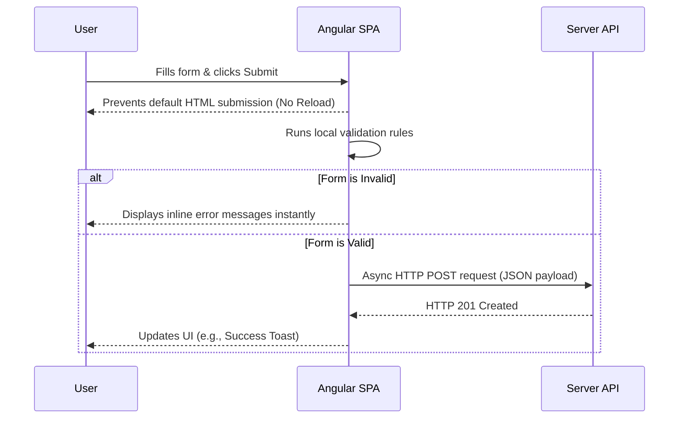

# Lecture 29 — Angular Forms: Template-Driven & Reactive

**Course:** Full-Stack Web Development  
**Instructor:** Kyrillos Medhat  
**Duration:** 3 hours (Theory + Lab)

---

## 🛑 Prerequisites
Before starting this lecture, you should be comfortable with:
- **Angular Components & Templates:** Data binding (`[]`, `()`, `[()]`), structural directives (`*ngIf`, `*ngFor` or new `@if`/`@for` control flow).
- **TypeScript Fundamentals:** Classes, interfaces, types, and decorators.
- **RxJS Basics:** Understanding `Observable`, `subscribe`, and operators like `map`, `debounceTime`, `switchMap` (crucial for reactive form value changes and async validators).
- **Basic HTML Forms:** `<form>`, `<input>`, `<select>`, `<button type="submit">`, and native HTML5 validation attributes (`required`, `pattern`).

---

## 🎯 Learning Objectives
By the end of this lecture, you will be able to:
- Explain why Angular provides special form handling compared to native HTML form submission.
- Build robust forms using the **Template-Driven** approach for simple use cases.
- Architect complex, highly dynamic forms using the **Reactive** approach.
- Implement strictly typed forms (introduced in Angular 14).
- Create custom synchronous and asynchronous validators to enforce business rules.
- Validate multiple fields simultaneously using cross-field validators.
- Track fine-grained form state (dirty, touched, valid, pristine) to improve User Experience (UX).
- Build dynamic forms that scale infinitely using `FormArray`.
- Choose the correct form paradigm based on project requirements.

---

## 📋 Agenda

### Part 1 — Theory (~90 min)
1. **The 'Why':** Why Forms Need Special Handling in SPAs.
2. **The Paradigm Shift:** Template-Driven vs. Reactive Forms.
3. **Deep Dive:** Template-Driven Forms.
4. **Deep Dive:** Reactive Forms & Strictly Typed Forms.
5. **Understanding State:** Form State Properties & Observables.
6. **Advanced Validation:** Custom Sync, Async, and Cross-Field Validators.
7. **Dynamic Forms:** Mastering `FormArray`.
8. **UX Best Practices:** Error Message Display Patterns.

### Part 2 — Practice / Lab (~90 min)
1. **Lab 1:** The Login Form (Template vs Reactive).
2. **Lab 2:** Dynamic Survey Builder with `FormArray`.
3. **Assignment:** Advanced Checkout Form.

---

## 1. Why Forms Need Special Handling

In traditional multi-page web applications (like PHP or Django), submitting an HTML `<form>` triggers an HTTP POST request to the server, and the server responds by completely reloading the page. 

In a Single Page Application (SPA) built with Angular, **page reloads are the enemy**. We want to intercept the form submission, extract the data, validate it locally on the client-side for immediate feedback, and then send the data via an asynchronous API call (AJAX/Fetch) without ever leaving the page.



Beyond preventing page reloads, Angular Forms provide a unified API to handle:
- **Two-way Data Binding:** Keeping the view (HTML) and the model (TypeScript) in sync.
- **Change Tracking:** Knowing exactly when a user has clicked into a field (`touched`) or typed in it (`dirty`).
- **Validation Engine:** A robust system for checking rules (e.g., "Password must contain a number") and grouping errors.

---

## 2. Template-Driven vs Reactive — The Paradigm Shift

Angular gives us two completely different ways to build forms. Understanding *when* to use each is a hallmark of a Senior Angular Developer.

| Feature | Template-Driven Forms | Reactive Forms |
|---------|:--------------|:--------|
| **Source of Truth** | The DOM (HTML Template) | The Component (TypeScript Model) |
| **Setup Module** | `FormsModule` | `ReactiveFormsModule` |
| **Data Binding** | Two-way data binding (`[(ngModel)]`) | Sync via form control directives (`formControlName`) |
| **Validation** | HTML Attributes (e.g., `required`, `pattern`) | TypeScript Functions (`Validators.required`) |
| **Testing** | Hard (Requires DOM instantiation) | Easy (Can test purely in TypeScript) |
| **Dynamic Fields** | Very difficult & messy | Built-in via `FormArray` & `FormRecord` |
| **Value Changes** | `(ngModelChange)` event | RxJS `valueChanges` Observable |
| **Best For** | Simple forms (Login, Contact Us) | Complex forms (Checkout, Wizards, Dynamic configurations) |

> [!NOTE]
> Under the hood, both approaches share the same building blocks: `FormControl`, `FormGroup`, and `FormArray`. The difference is how they are created. In Template-Driven forms, Angular creates these objects for you implicitly based on your HTML tags. In Reactive forms, you create them explicitly in TypeScript.

### 🧠 Think Like a Developer: Choosing the Right Form

**Scenario 1:** You are building a "Contact Us" page with just Name, Email, and Message.
*Decision:* **Template-Driven.** It's lightweight, requires very little boilerplate in the component, and standard HTML validation attributes handle everything we need.

**Scenario 2:** You are building a "Tax Return Questionnaire" where questions appear and disappear based on previous answers, and custom validation requires checking an external API.
*Decision:* **Reactive.** Managing complex conditional logic and async validation in an HTML template would be a nightmare. Reactive forms allow you to use RxJS to watch for changes and dynamically add/remove controls programmatically in TypeScript.

---

## 3. Deep Dive: Template-Driven Forms

Template-Driven forms rely heavily on directives in the HTML template. You map HTML form elements to data models in your component using `ngModel`.

### The Setup

First, import `FormsModule` into your component (or NgModule).

```ts
import { Component } from '@angular/core';
import { FormsModule, NgForm } from '@angular/forms';
import { CommonModule } from '@angular/common';

@Component({
  selector: 'app-login',
  standalone: true,
  imports: [FormsModule, CommonModule],
  templateUrl: './login.component.html'
})
export class LoginComponent {
  // Our data model
  user = {
    email: '',
    password: '',
    rememberMe: false
  };

  onSubmit(form: NgForm): void {
    if (form.valid) {
      console.log('Submitting data:', this.user);
      // OR console.log('Submitting data:', form.value);
    } else {
      console.error('Form is invalid!');
    }
  }
}
```

### The Template

Notice how we use template reference variables (`#loginForm="ngForm"`) to gain access to Angular's implicit form instance.

```html
<!-- #loginForm exports the NgForm directive to a local variable -->
<!-- (ngSubmit) is an Angular event that prevents the default page reload -->
<form #loginForm="ngForm" (ngSubmit)="onSubmit(loginForm)" novalidate>
  
  <div class="form-group">
    <label for="email">Email Address</label>
    <input 
      type="email" 
      id="email" 
      name="email" 
      [(ngModel)]="user.email" 
      required 
      email
      #emailField="ngModel" 
      class="form-control"
    >
    <!-- #emailField="ngModel" gives us access to this specific control's state -->
    <div *ngIf="emailField.invalid && (emailField.dirty || emailField.touched)" class="error-text">
      <small *ngIf="emailField.errors?.['required']">Email is required.</small>
      <small *ngIf="emailField.errors?.['email']">Please enter a valid email.</small>
    </div>
  </div>

  <div class="form-group">
    <label for="password">Password</label>
    <input 
      type="password" 
      id="password" 
      name="password" 
      [(ngModel)]="user.password" 
      required 
      minlength="8"
      #passwordField="ngModel"
      class="form-control"
    >
    <div *ngIf="passwordField.invalid && passwordField.touched" class="error-text">
      <small *ngIf="passwordField.errors?.['required']">Password is required.</small>
      <small *ngIf="passwordField.errors?.['minlength']">
        Password must be at least {{ passwordField.errors?.['minlength'].requiredLength }} characters.
      </small>
    </div>
  </div>

  <button type="submit" [disabled]="loginForm.invalid" class="btn btn-primary">
    Log In
  </button>
</form>
```

> [!WARNING]
> In Template-Driven forms, the `name` attribute is **mandatory** when using `ngModel`. Angular uses the `name` attribute to register the control with the parent `NgForm`. If you forget it, the field won't be tracked! Furthermore, it is best practice to add `novalidate` to the `<form>` tag to disable the browser's native (and often ugly) tooltip validations, allowing Angular to handle it seamlessly.

---

## 4. Deep Dive: Reactive Forms & Strongly Typed Forms

Reactive forms move the logic into the component class. You programmatically construct the form using `FormControl`, `FormGroup`, and `FormArray`.

Starting with **Angular 14**, Reactive Forms are **Strictly Typed** by default. This is a massive improvement, as TypeScript now knows exactly what data is in your form, preventing runtime errors if you misspell a field name.

### The Building Blocks

- **`FormControl`**: Tracks the value and validation status of a *single* form field (e.g., an input box).
- **`FormGroup`**: Tracks the value and validity state of a *group* of `FormControl` instances. (e.g., an entire form, or an address sub-section).
- **`FormArray`**: An array of `FormControl`, `FormGroup`, or even other `FormArray` instances. Size can grow/shrink dynamically.
- **`FormRecord`**: Introduced in Angular 14, similar to `FormGroup` but allows dynamic keys where all controls have the same type.

### The Setup

Import `ReactiveFormsModule`. Use the `FormBuilder` service (`NonNullableFormBuilder` is great for ensuring form resets don't inject `null` values unexpectedly).

```ts
import { Component, inject } from '@angular/core';
import { 
  ReactiveFormsModule, 
  NonNullableFormBuilder, 
  Validators 
} from '@angular/forms';

@Component({
  selector: 'app-register',
  standalone: true,
  imports: [ReactiveFormsModule],
  templateUrl: './register.component.html'
})
export class RegisterComponent {
  // NonNullableFormBuilder ensures that calling reset() reverts to initial values, not 'null'
  private fb = inject(NonNullableFormBuilder);

  // Thanks to Angular 14+ Typed Forms, the type of registerForm is inferred automatically!
  registerForm = this.fb.group({
    username: ['', [Validators.required, Validators.minLength(4)]],
    email:    ['', [Validators.required, Validators.email]],
    address: this.fb.group({
      street: ['', Validators.required],
      city:   ['', Validators.required],
      zip:    ['', [Validators.required, Validators.pattern(/^\d{5}$/)]]
    })
  });

  onSubmit() {
    if (this.registerForm.valid) {
      // TypeScript knows exactly that this is an object with username, email, and address!
      const formData = this.registerForm.getRawValue(); 
      console.log('Registration data:', formData);
    } else {
      // Mark all fields as touched to immediately show all validation errors
      this.registerForm.markAllAsTouched();
    }
  }

  // Helper getters for cleaner templates
  get f() { return this.registerForm.controls; }
  get address() { return this.registerForm.controls.address.controls; }
}
```

### The Template

Notice how much cleaner the HTML is compared to the Template-Driven approach. There are no `ngModel` directives and no local template variables.

```html
<form [formGroup]="registerForm" (ngSubmit)="onSubmit()">
  
  <div>
    <label>Username</label>
    <input formControlName="username" type="text">
    @if (f.username.invalid && f.username.touched) {
      <div class="error">
        @if (f.username.hasError('required')) { <span>Required</span> }
        @if (f.username.hasError('minlength')) { <span>Minimum 4 characters</span> }
      </div>
    }
  </div>

  <div>
    <label>Email</label>
    <input formControlName="email" type="email">
    <!-- Similar error handling -->
  </div>

  <!-- Nested Form Group -->
  <fieldset formGroupName="address">
    <legend>Address Information</legend>
    
    <div>
      <label>Street</label>
      <input formControlName="street" type="text">
    </div>
    
    <div>
      <label>City</label>
      <input formControlName="city" type="text">
    </div>
    
    <div>
      <label>Zip Code</label>
      <input formControlName="zip" type="text">
      @if (address.zip.invalid && address.zip.touched) {
        <div class="error">Invalid Zip Code (Must be 5 digits)</div>
      }
    </div>
  </fieldset>

  <button type="submit">Register</button>
</form>
```

> [!TIP]
> Use `.getRawValue()` instead of `.value` on Reactive Forms. If you use `FormGroup.value`, any controls that are explicitly *disabled* will be omitted from the output object. `.getRawValue()` returns everything, disabled or not, which is usually what you want when submitting to a backend.

---

## 5. Understanding State: Form Properties & Observables

Every `FormControl`, `FormGroup`, and `FormArray` inherits from the base `AbstractControl` class, giving them powerful state-tracking properties and RxJS Observables.

### State Properties Matrix

| Property | Definition | Opposite |
|----------|------------|----------|
| `valid` | Passes all validation rules | `invalid` |
| `pristine` | Value has **not** been changed by the user | `dirty` (User modified value) |
| `untouched` | User has **not** blurred (navigated away from) the field | `touched` (User clicked in, then clicked out) |
| `pending` | An async validator is currently running | N/A |
| `disabled` | Control is disabled and won't be included in `.value` | `enabled` |

### RxJS Observables

Reactive forms are truly *reactive* because you can subscribe to changes in real-time.

```ts
ngOnInit() {
  // Watch value changes in real-time
  this.registerForm.get('email')?.valueChanges
    .pipe(
      debounceTime(500), // Wait for user to stop typing for 500ms
      distinctUntilChanged() // Only emit if the value actually changed
    )
    .subscribe(newEmail => {
      console.log(`User is typing email: ${newEmail}`);
      // E.g., send telemetry data, or auto-save draft
    });

  // Watch status changes (VALID, INVALID, PENDING, DISABLED)
  this.registerForm.statusChanges.subscribe(status => {
    console.log(`Entire form status is now: ${status}`);
  });
}
```

---

## 6. Advanced Validation: Custom Sync, Async, and Cross-Field

While built-in validators (`Validators.required`, `Validators.pattern`) cover 80% of use cases, complex business logic requires custom validators.

### Synchronous Validator

A sync validator is a simple function that takes an `AbstractControl` and returns an error object if invalid, or `null` if valid.

```ts
import { AbstractControl, ValidationErrors, ValidatorFn } from '@angular/forms';

// Custom Validator: No Whitespace allowed
export function noWhitespaceValidator(): ValidatorFn {
  return (control: AbstractControl): ValidationErrors | null => {
    // If empty, let the 'required' validator handle it
    if (!control.value) {
      return null;
    }
    
    const hasWhitespace = /\s/.test(control.value);
    
    // Return an error object if invalid
    return hasWhitespace ? { noWhitespace: true } : null;
  };
}

// Usage in Component:
// username: ['', [Validators.required, noWhitespaceValidator()]]
```

### Cross-Field Validator (e.g., Password Match)

Cross-field validation happens at the `FormGroup` level, because a single `FormControl` doesn't know about its siblings.

```ts
export function passwordMatchValidator(): ValidatorFn {
  return (group: AbstractControl): ValidationErrors | null => {
    const password = group.get('password')?.value;
    const confirmPassword = group.get('confirmPassword')?.value;

    if (!password || !confirmPassword) {
      return null;
    }

    if (password !== confirmPassword) {
      // Set the error on the specific control, OR return it for the group
      group.get('confirmPassword')?.setErrors({ passwordMismatch: true });
      return { passwordMismatch: true }; 
    }

    // Clear error if they match
    if (group.get('confirmPassword')?.hasError('passwordMismatch')) {
      group.get('confirmPassword')?.setErrors(null);
    }
    return null;
  };
}

// Usage:
// this.fb.group({
//   password: ['', Validators.required],
//   confirmPassword: ['', Validators.required]
// }, { validators: passwordMatchValidator() }); // Apply to the GROUP!
```

### Asynchronous Validator

Async validators return a Promise or an Observable. They are typically used for server-side checks, like verifying if a username is already taken in the database.

```ts
import { Injectable } from '@angular/core';
import { AbstractControl, AsyncValidatorFn, ValidationErrors } from '@angular/forms';
import { HttpClient } from '@angular/common/http';
import { Observable, of, timer } from 'rxjs';
import { map, switchMap, catchError } from 'rxjs/operators';

export function usernameAvailableValidator(http: HttpClient): AsyncValidatorFn {
  return (control: AbstractControl): Observable<ValidationErrors | null> => {
    if (!control.value) {
      return of(null);
    }

    // Use timer to debounce the request (don't hit API on every keystroke)
    return timer(500).pipe(
      switchMap(() => http.get<boolean>(`/api/users/check?username=${control.value}`)),
      map(isAvailable => (isAvailable ? null : { usernameTaken: true })),
      catchError(() => of(null)) // Handle API errors gracefully
    );
  };
}

// Usage in component (Requires passing the injected HttpClient):
// username: ['', [Validators.required], [usernameAvailableValidator(this.http)]]
```

> [!IMPORTANT]
> The order of array arguments in `FormControl` matters! 
> `['initialValue', [SyncValidators], [AsyncValidators]]`
> Angular runs Sync validators first. Async validators will **only** run if all Sync validators pass. This saves bandwidth by not hitting the server if the field is already invalid (e.g., empty).

---

## 7. Dynamic Forms: Mastering FormArray

`FormArray` is the secret weapon for building dynamic, infinitely repeating UI sections (e.g., "Add another skill", "Add multiple phone numbers").

### Component Logic

```ts
import { Component, inject } from '@angular/core';
import { ReactiveFormsModule, FormBuilder, FormArray, Validators } from '@angular/forms';
import { CommonModule } from '@angular/common';

@Component({
  selector: 'app-skills',
  standalone: true,
  imports: [ReactiveFormsModule, CommonModule],
  template: `...see html below...`
})
export class SkillsComponent {
  private fb = inject(FormBuilder);

  profileForm = this.fb.group({
    fullName: ['', Validators.required],
    skills: this.fb.array([]) // Initialize as empty array
  });

  // Getter for easy access in the template
  get skillsArray(): FormArray {
    return this.profileForm.get('skills') as FormArray;
  }

  // Method to push a new FormControl into the array
  addSkill() {
    this.skillsArray.push(
      this.fb.group({
        skillName: ['', Validators.required],
        proficiency: ['Beginner', Validators.required]
      })
    );
  }

  // Method to remove at specific index
  removeSkill(index: number) {
    this.skillsArray.removeAt(index);
  }

  onSubmit() {
    console.log(this.profileForm.value);
  }
}
```

### Template Logic

```html
<form [formGroup]="profileForm" (ngSubmit)="onSubmit()">
  
  <label>Full Name</label>
  <input formControlName="fullName" type="text">

  <hr>
  <h3>Skills</h3>
  
  <!-- formArrayName binds the wrapper div to the array -->
  <div formArrayName="skills">
    
    <!-- Iterate over the controls array -->
    <div *ngFor="let skill of skillsArray.controls; let i=index" [formGroupName]="i" class="skill-row">
      
      <h4>Skill #{{ i + 1 }}</h4>
      
      <label>Name</label>
      <input formControlName="skillName" type="text">
      
      <label>Level</label>
      <select formControlName="proficiency">
        <option value="Beginner">Beginner</option>
        <option value="Intermediate">Intermediate</option>
        <option value="Advanced">Advanced</option>
      </select>
      
      <!-- Remove button passing the index -->
      <button type="button" (click)="removeSkill(i)" class="btn-danger">
        Delete Skill
      </button>
      
    </div>
  </div>

  <button type="button" (click)="addSkill()" class="btn-secondary">
    + Add Another Skill
  </button>

  <hr>
  <button type="submit" [disabled]="profileForm.invalid">Save Profile</button>
</form>
```

---

## 8. Before vs After (Code Modernization)

Let's look at how we handle displaying error messages. 

### ❌ Before (The Bad Way - Boilerplate Overload)
Copy-pasting error logic for every single input field results in huge HTML files.

```html
<div class="form-group">
  <input formControlName="firstName">
  <div *ngIf="form.get('firstName')?.invalid && form.get('firstName')?.touched">
    <small *ngIf="form.get('firstName')?.hasError('required')">First Name is required.</small>
    <small *ngIf="form.get('firstName')?.hasError('minlength')">Must be at least 2 chars.</small>
  </div>
</div>

<div class="form-group">
  <input formControlName="lastName">
  <div *ngIf="form.get('lastName')?.invalid && form.get('lastName')?.touched">
    <small *ngIf="form.get('lastName')?.hasError('required')">Last Name is required.</small>
    <small *ngIf="form.get('lastName')?.hasError('minlength')">Must be at least 2 chars.</small>
  </div>
</div>
```

### ✅ After (The Modern Way - Reusable Component)
Create a standalone `FieldErrorComponent` to encapsulate the logic.

```ts
// field-error.component.ts
import { Component, Input } from '@angular/core';
import { AbstractControl } from '@angular/forms';

@Component({
  selector: 'app-field-error',
  standalone: true,
  template: `
    @if (control && control.invalid && (control.dirty || control.touched)) {
      <div class="error-msg">
        @if (control.hasError('required')) { <span>This field is required.</span> }
        @if (control.hasError('email')) { <span>Invalid email format.</span> }
        @if (control.hasError('minlength')) { 
          <span>Minimum length is {{ control.errors?.['minlength'].requiredLength }}.</span> 
        }
      </div>
    }
  `,
  styles: [`.error-msg { color: red; font-size: 0.8em; margin-top: 4px; }`]
})
export class FieldErrorComponent {
  @Input() control!: AbstractControl | null;
}
```

Now the template becomes incredibly clean:

```html
<div class="form-group">
  <input formControlName="firstName">
  <app-field-error [control]="form.get('firstName')"></app-field-error>
</div>

<div class="form-group">
  <input formControlName="lastName">
  <app-field-error [control]="form.get('lastName')"></app-field-error>
</div>
```

---

## 9. Common Mistakes & How to Avoid Them

| ❌ The Mistake | 🚨 Why It's Bad | ✅ The Solution |
|--------------|---------------|--------------|
| **Forgetting `name` in Template-Driven** | If you omit the `name` attribute on an `<input>` with `ngModel`, Angular will quietly ignore it. No data will bind, no validation will run. | Always verify: `<input name="email" [(ngModel)]="user.email">` |
| **Mixing `ngModel` and `formControlName`** | Angular deprecated mixing Reactive and Template forms in version 6. It causes chaotic state conflicts and race conditions. | Pick one paradigm per form. If you imported `ReactiveFormsModule`, delete all `ngModel` directives. |
| **Pestering the User Too Early** | Showing validation errors the *millisecond* the user types their first letter (or before they even start) is terrible UX. | Always guard your error messages with `if (control.touched && control.invalid)`. Let them finish typing and blur the field first. |
| **Memory Leaks with `.valueChanges`** | Subscribing to `valueChanges` inside a component without unsubscribing causes memory leaks when the component is destroyed. | Use the `takeUntilDestroyed()` operator (Angular 16+) or the `AsyncPipe` in the template to auto-unsubscribe. |
| **Hardcoding Error Text Everywhere** | Duplicating error strings makes translating your app (i18n) nearly impossible later. | Build a centralized error mapping service or a reusable `<app-error-display>` component. |

---

## 10. 🧪 Practice Labs

### Lab 1: The Ultimate Login Refactor (45 min)
**Objective:** Experience the transition from Template-Driven to Reactive.
1. Create a `LoginComponent`.
2. Build a login form using the **Template-Driven** approach. Include:
   - Email (required, valid email).
   - Password (required, min length 8).
   - Remember Me (checkbox).
3. Ensure the Submit button is disabled if the form is invalid.
4. **The Refactor:** Once working, completely delete the HTML template and Component logic.
5. Rebuild the exact same functionality using the **Reactive Forms** approach.
6. **Bonus:** Subscribe to the `valueChanges` of the email field. If the user types "@gmail.com", show a friendly toast message: *"Ah, a Google user!"*

### Lab 2: Dynamic Survey Builder (60 min)
**Objective:** Master `FormArray` and conditional validation.
1. Create a Reactive form representing a generic Survey.
2. The form should have a static `title` (required).
3. Implement a `questions` `FormArray`.
4. Allow the user to add an infinite number of questions. Each question `FormGroup` needs:
   - `questionText` (required string).
   - `answerType` (dropdown: Text, Number, or Boolean).
   - `isRequired` (checkbox).
5. Allow the user to remove a question via a "Delete" button next to each row.
6. Add conditional logic using `valueChanges`: If the user selects "Number" as the `answerType`, dynamically add a new form control to that row for `maxValue`. If they switch back to "Text", remove the `maxValue` control. (Hint: Use `addControl()` and `removeControl()` on the specific `FormGroup`).

---

## 11. 📝 Assignment: ShopAngular Project — The Checkout Flow

Integrate what you've learned into our ongoing e-commerce project.

**Requirements:**
1. Create a multi-section checkout wizard using Reactive Forms.
2. Group the form logically:
   - **Customer Info FormGroup**: FirstName, LastName, Email, Phone.
   - **Shipping Address FormGroup**: Street, City, State, Zip, Country.
   - **Payment Info FormGroup**: CardNumber, Expiry, CVV.
3. Apply Strict Typing to ensure your data model is safe.
4. Implement the following custom validators:
   - `creditCardValidator`: A Sync validator that uses Regex to ensure the card number is 16 digits, ignoring spaces.
   - `zipCodeValidator`: A Cross-Field Sync validator applied to the Address FormGroup. If the Country is "USA", the Zip must be exactly 5 digits. If "Canada", it must match the alpha-numeric format (A1A 1A1).
5. Prevent submission until all sections are valid.
6. Display a JSON `pre` tag at the bottom of the page that binds to `checkoutForm.value` so you can watch the state update in real-time as you test.

---

## 12. 🎤 Interview Prep

**Q1: What is the core difference between Template-Driven and Reactive Forms?**
*Answer:* Template-driven forms are asynchronous and declarative; the source of truth is the HTML template, and Angular implicitly creates the form model behind the scenes. Reactive forms are synchronous and programmatic; the source of truth is the TypeScript component where you explicitly construct the `FormGroup` and `FormControl` objects, making them much easier to unit test.

**Q2: How do you implement cross-field validation (like matching passwords)?**
*Answer:* Cross-field validation must be applied to the parent `FormGroup` that wraps both controls, rather than on the individual `FormControl`. The validator function takes the `AbstractControl` (which is the group), extracts the values of both child controls, compares them, and returns an error object if they don't match.

**Q3: Explain the difference between `FormGroup.value` and `FormGroup.getRawValue()`.**
*Answer:* `FormGroup.value` returns an object containing only the values of *enabled* form controls. If a control is marked as disabled (e.g., `control.disable()`), it is entirely omitted from the `.value` output. `FormGroup.getRawValue()` returns the values of *all* controls in the group, regardless of their disabled status.

**Q4: When would you use an Async Validator? Can you give an example?**
*Answer:* Async validators are used when validation logic depends on external resources, such as querying a database or an API. A classic example is a "Username already taken" check during registration. The validator makes an HTTP call and returns an Observable that resolves to null (valid) or an error object (invalid). 

**Q5: How do you prevent memory leaks when subscribing to `valueChanges`?**
*Answer:* Because `valueChanges` is an RxJS Observable that lives for the lifetime of the form control, you must manage its subscription. You can do this by using the `takeUntilDestroyed()` RxJS operator (in Angular 16+), by utilizing the `async` pipe in the template, or by manually calling `.unsubscribe()` in the `ngOnDestroy` lifecycle hook.

---

## 13. ⚡ Quick Reference Cheat Sheet

```ts
// 1. Setup FormBuilder
private fb = inject(FormBuilder);

// 2. Create FormGroup with Typed Definitions
myForm = this.fb.group({
  name: ['', [Validators.required, Validators.minLength(3)]],
  items: this.fb.array([])
});

// 3. Getters
get nameCtrl() { return this.myForm.get('name'); }
get itemsArray() { return this.myForm.get('items') as FormArray; }

// 4. Update Values Programmatically
// patchValue updates specific fields (ignores missing ones)
this.myForm.patchValue({ name: 'John' }); 
// setValue requires ALL fields to be provided precisely
this.myForm.setValue({ name: 'John', items: [] }); 

// 5. Reset State (Clears values AND resets pristine/touched states)
this.myForm.reset();

// 6. Enable / Disable
this.nameCtrl?.disable();
this.nameCtrl?.enable();

// 7. Dynamic Arrays
this.itemsArray.push(this.fb.control(''));
this.itemsArray.removeAt(0);
this.itemsArray.clear();
```

---

## 🔗 Resources

| Resource | Link |
|----------|------|
| Official Reactive Forms Guide | [angular.dev/guide/forms/reactive-forms](https://angular.dev/guide/forms/reactive-forms) |
| Strictly Typed Forms RFC | [github.com/angular/angular/issues/43866](https://github.com/angular/angular/issues/43866) |
| RxJS Operators for Forms | [rxjs.dev/guide/operators](https://rxjs.dev/guide/operators) |

---

## 📌 Key Takeaways
- **Pick your paradigm wisely:** Use Template-Driven for trivial forms (login, contact). Default to **Reactive Forms** for professional, enterprise-grade applications.
- **Typed Forms (Angular 14+)** eliminate a huge class of runtime bugs by catching misspellings and incorrect types at compile-time.
- **Form state is incredibly granular.** Utilize `touched`, `dirty`, `valid`, and `pristine` to craft exceptional user experiences (like not yelling at a user before they finish typing).
- **Custom Validators** are powerful. Keep your components clean by abstracting validation logic into standalone reusable functions.
- **FormArray** unlocks dynamic UI complexity, allowing you to build highly interactive configurations and repeating input sections.

---

**Next Lecture:** [Lecture 30 — HTTP Client & API Integration](../30%20-%20HTTP%20Client%20%26%20API%20Integration/30%20-%20HTTP%20Client%20%26%20API%20Integration.md)

### 📚 Extensive Tutorials & Resources
- **Source:** [Angular University - Angular Forms: Template-Driven vs. Reactive](https://blog.angular-university.io/introduction-to-angular-2-forms-template-driven-vs-model-driven/)
- **Source:** [Angular University - Angular Reactive Forms: The Complete Guide](https://blog.angular-university.io/angular-reactive-forms/)
- **Source:** [Angular.dev - Reactive Forms Guide](https://angular.dev/guide/forms/reactive-forms)
- **Source:** [Angular.dev - Template-driven Forms Guide](https://angular.dev/guide/forms/template-driven-forms)
- **Source:** [Angular.dev - Form Validation Guide](https://angular.dev/guide/forms/form-validation)
- **Source:** [Angular University - Angular FormArray: Complete Guide](https://blog.angular-university.io/angular-formarray/)
- **Source:** [FreeCodeCamp - How to Use Reactive Forms in Angular](https://www.freecodecamp.org/news/reactive-forms-in-angular/)
