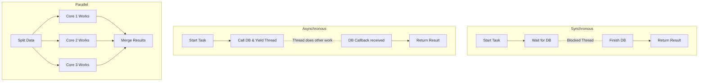

# Lecture 42 — Error Handling, File I/O & Asynchronous C#

**Course:** Full-Stack Web Development  
**Instructor:** Kyrillos Medhat  
**Duration:** 3 hours (Theory + Lab)

---

## 🛑 Prerequisites

Before beginning this module, you should be comfortable with:
- C# Class structures, interfaces, properties, and methods.
- Value types vs. Reference types and how they behave in memory.
- Basic understanding of memory architecture (the Stack and the Heap).
- Application flow control (control structures like `if`, `switch`, `while`, `for`, `foreach`).
- Basic Object-Oriented Programming principles (inheritance, polymorphism).

---

## 🎯 Learning Objectives

By the end of this lecture, you will be able to:
- Handle exceptions gracefully with `try/catch/finally` blocks to prevent application crashes and ensure robust error logging.
- Utilize advanced exception features like Exception Filters (`when`) and `AggregateException`.
- Create, throw, and document your own custom business-logic exceptions.
- Read from and write to the file system using `System.IO` (Files, Directories, Paths, Streams, Binary Streams).
- Automatically and safely manage unmanaged resources using the `using` statement and `IDisposable` pattern.
- Convert complex C# objects to JSON strings and back using the high-performance `System.Text.Json` library, including custom converters and attributes.
- Grasp the magic of asynchronous programming with `async/await` and understand compiler-generated state machines.
- Safely cancel asynchronous operations using `CancellationToken`.
- Differentiate and confidently choose between Asynchronous (I/O) and Parallel (CPU) programming paradigms.

---

## 📋 Agenda

### Part 1 — Theory (~90 min)
1. Exception Handling: Anticipating the Unexpected & Advanced Techniques
2. File I/O: Reading and Writing Files Deep Dive (Text & Binary)
3. The `using` Statement & Resource Management Architecture
4. JSON Serialization, Deserialization, & Customization
5. Asynchronous C#: The Waiter Analogy, State Machines, & Cancellation
6. Async vs. Parallel Programming: Architecting for Performance

### Part 2 — Practice / Lab (~90–120 min)
1. Build a File Logger with Exception Handling & Rolling Logs
2. JSON Serialization & Deserialization Mastery
3. FinanceTracker Project Part 4: File I/O & JSON State Persistence
4. Interview Prep & Cheat Sheet

---

## 1. Exception Handling: Anticipating the Unexpected & Advanced Techniques

### What is an Exception?

In the real world, an exception is an anomaly—something completely out of the ordinary. In C#, an **Exception** is a class that encapsulates a runtime error. Whenever your program encounters a situation it doesn't know how to handle natively (e.g., trying to open a file that doesn't exist, dividing by zero, or connecting to a database that is suddenly offline), the .NET runtime **throws** an Exception object.

If you don't "catch" the exception, the error propagates up the call stack until it hits the application boundary, causing your program to crash immediately. In a web server context, an unhandled exception results in an HTTP 500 Internal Server Error returned to the client, while the server process itself might terminate if not properly configured.

### The Mechanics of `try`, `catch`, and `finally`

```csharp
// We wrap risky code in a "try" block
try
{
    Console.Write("Enter a number to divide 100 by: ");
    string input = Console.ReadLine();
    int divisor = int.Parse(input); // Can throw FormatException or ArgumentNullException
    int result = 100 / divisor;     // Can throw DivideByZeroException
    
    Console.WriteLine($"Result: {result}");
}
catch (DivideByZeroException ex)
{
    // Specific catch block for a specific known edge case
    Console.WriteLine($"Math error: You cannot divide by zero! Details: {ex.Message}");
}
catch (FormatException ex)
{
    // Another specific catch block
    Console.WriteLine("Format error: Please enter a valid numerical digit!");
}
catch (Exception ex)
{
    // The generalized fallback. 'Exception' is the base class for all exceptions.
    Console.WriteLine($"An unexpected error occurred: {ex.Message}");
    
    // Sometimes you want the program to crash anyway after logging the error
    throw; // Rethrows the exact same exception, preserving the original stack trace!
}
finally
{
    // This ALWAYS executes, whether an error happened or not, or even if we returned early!
    // Perfect for manual cleanup (though 'using' is preferred for IDisposable objects).
    Console.WriteLine("Execution attempt completed.");
}
```

> [!NOTE]
> **Why `throw;` and not `throw ex;`?**
> When you use `throw ex;`, C# resets the "Stack Trace" (the history of exactly which line of code caused the error and how it got there) to the current `catch` block. Using `throw;` preserves the original history, making debugging much easier!

### Advanced Concept: Exception Filters (C# 6+)

Sometimes you only want to catch an exception if a specific condition is met. Instead of catching it and rethrowing it (which is expensive), you can use an Exception Filter using the `when` keyword.

```csharp
try
{
    ProcessApiRequest();
}
catch (HttpRequestException ex) when (ex.StatusCode == System.Net.HttpStatusCode.Unauthorized)
{
    // Only catches if the specific status code is 401 Unauthorized
    Console.WriteLine("You need to log in first!");
}
catch (HttpRequestException ex) when (ex.StatusCode == System.Net.HttpStatusCode.NotFound)
{
    // Only catches if the specific status code is 404 Not Found
    Console.WriteLine("The requested resource does not exist.");
}
```

### Custom Exceptions: The "Why"

Sometimes the built-in exceptions (`ArgumentNullException`, `InvalidOperationException`, etc.) do not accurately convey the business logic error in your domain. Creating custom exceptions adds immense clarity to your Domain-Driven Design.

```csharp
public class InsufficientFundsException : Exception
{
    public decimal CurrentBalance { get; }
    public decimal AttemptedWithdrawal { get; }

    public InsufficientFundsException(decimal balance, decimal withdrawal) 
        : base($"Attempted to withdraw {withdrawal:C} but balance is only {balance:C}.")
    {
        CurrentBalance = balance;
        AttemptedWithdrawal = withdrawal;
    }
}

// Usage in a BankAccount domain class
public void Withdraw(decimal amount)
{
    if (amount > Balance)
    {
        throw new InsufficientFundsException(Balance, amount);
    }
    Balance -= amount;
}
```

By defining `InsufficientFundsException`, a calling method (like a Web API controller) can write a `catch (InsufficientFundsException ex)` block specifically to handle overdrawn accounts and return an HTTP 400 Bad Request, rather than trying to parse the string message of a generic `Exception`.

### Inner Exceptions and AggregateException

When an exception is caused by another exception, the original exception is stored in the `InnerException` property. This is vital for tracing the root cause.
When dealing with Tasks (Asynchronous or Parallel programming), multiple exceptions can be thrown simultaneously. .NET wraps these in an `AggregateException`.

```csharp
try
{
    Task.WaitAll(task1, task2); // If both fail, an AggregateException is thrown
}
catch (AggregateException ex)
{
    foreach (var innerEx in ex.InnerExceptions)
    {
        Console.WriteLine($"One of the tasks failed: {innerEx.Message}");
    }
}
```

---

## 2. File I/O: Reading and Writing Files Deep Dive (Text & Binary)

The `System.IO` namespace provides all the tools you need to interact with the file system. It bridges the gap between your C# memory space and the physical hard drive.

### The `File` Class — Quick and Easy

If you need to read or write an entire file at once, the `File` static class provides utility methods. Be cautious: these load the *entire* file into memory.

```csharp
using System.IO;

string path = "data.txt";

// 1. Write text to a file (overwrites the file if it exists)
File.WriteAllText(path, "Hello, World!");

// 2. Append text to a file (creates if it doesn't exist)
File.AppendAllText(path, "\nWelcome to C#!");

// 3. Read all text from a file into a single string
string content = File.ReadAllText(path);
Console.WriteLine(content);

// 4. Check if a file exists
if (File.Exists(path))
{
    // 5. Delete a file
    File.Delete(path);
}
```

### Streams and Large Files

When dealing with massive files (e.g., a 5GB server log), using `File.ReadAllText()` will cause an `OutOfMemoryException` because it attempts to place a 5GB string on the Heap. Instead, we use `Streams`. A stream is an abstraction of a sequence of bytes. Using `StreamReader`, we can read a file line-by-line, keeping only a small string in memory at any given time.

```csharp
using System.IO;

string massiveFilePath = "server_logs.txt";

// Using StreamReader allows us to read line by line
using (StreamReader reader = new StreamReader(massiveFilePath))
{
    string line;
    while ((line = reader.ReadLine()) != null)
    {
        if (line.Contains("ERROR"))
        {
            Console.WriteLine($"Found an error: {line}");
        }
    }
}
```

### Binary Files: `FileStream`, `BinaryReader`, and `BinaryWriter`

Not all files are text files. Images, executables, and compressed archives are binary. To manipulate them, we use `BinaryReader` and `BinaryWriter` wrapped around a `FileStream`.

```csharp
string binPath = "data.bin";

// Writing binary data
using (FileStream fs = new FileStream(binPath, FileMode.Create))
using (BinaryWriter writer = new BinaryWriter(fs))
{
    writer.Write(1.25);   // Writes a double
    writer.Write("Test"); // Writes a string
    writer.Write(true);   // Writes a boolean
}

// Reading binary data
using (FileStream fs = new FileStream(binPath, FileMode.Open))
using (BinaryReader reader = new BinaryReader(fs))
{
    double d = reader.ReadDouble();
    string s = reader.ReadString();
    bool b = reader.ReadBoolean();
    
    Console.WriteLine($"Read: {d}, {s}, {b}");
}
```

### `File` vs `FileInfo` and `Directory` vs `DirectoryInfo`

- **`File` and `Directory`**: Static classes. Best for one-off operations. They perform security checks every single time you call a method.
- **`FileInfo` and `DirectoryInfo`**: Instance classes. Best when you are doing multiple operations on the same file/directory. They cache state and perform security checks once upon instantiation.

```csharp
// Static (Security check 3 times)
File.Exists("log.txt");
File.GetCreationTime("log.txt");
File.Delete("log.txt");

// Instance (Security check 1 time)
FileInfo info = new FileInfo("log.txt");
if (info.Exists)
{
    Console.WriteLine(info.CreationTime);
    info.Delete();
}
```

### The `Path` Class

When building file paths, **never use hardcoded slashes** like `"folder\\file.txt"`, because Windows uses `\` and Mac/Linux use `/`.

```csharp
// ✅ GOOD: Safely combines paths based on the operating system
string fullPath = Path.Combine("folder", "subfolder", "file.txt");

// Get the extension of a file
string ext = Path.GetExtension(fullPath); // Returns ".txt"
```

---

## 3. The `using` Statement & Resource Management Architecture

### The Problem: Leaking Resources

The .NET Garbage Collector automatically manages memory for your C# objects (managed resources). However, it does not understand **unmanaged resources**—things the operating system controls, such as file handles, database connections, and network sockets.

When you open a file, the OS locks that resource. When you are done, you **must** explicitly release it. If you forget, other programs won't be able to access the file, and your app will run out of available handles!

```csharp
// ❌ DANGEROUS WAY
StreamWriter writer = new StreamWriter("log.txt");
writer.WriteLine("Starting process...");
// If an exception happens here, the file stays locked forever!
writer.Close(); 
```

### The Solution: `IDisposable` and `using`

Any class that holds external resources implements the `IDisposable` interface, which mandates a single method: `Dispose()`. The `using` statement is syntactical sugar that guarantees `.Dispose()` is called—**even if an exception occurs** inside the block.

Behind the scenes, a `using` block is compiled into a `try/finally` block where the `finally` calls `Dispose()`.

```csharp
// The classic 'using' block
using (StreamWriter writer = new StreamWriter("log.txt", append: true))
{
    writer.WriteLine("Log entry");
} // writer.Dispose() is implicitly called right here

// ✅ THE MODERN WAY (C# 8+ using declarations)
using var modernWriter = new StreamWriter("log.txt", append: true);
modernWriter.WriteLine("Modern log entry");
// As soon as the current scope/method ends, 'modernWriter' is automatically disposed.
```

---

## 4. JSON Serialization, Deserialization, & Customization

JSON (JavaScript Object Notation) is the universal standard language of the internet. It is how data is transmitted between frontend applications (Angular/React), backend servers (C# API), and sometimes even used as lightweight configuration files.

- **Serialization:** Converting a C# Object into a JSON string.
- **Deserialization:** Converting a JSON string back into a C# Object.

Historically, .NET developers relied on a 3rd party library called `Newtonsoft.Json`. However, modern C# includes a blazing fast, memory-optimized built-in library for this: `System.Text.Json`.

### Step 1: Define a Class

```csharp
using System.Text.Json.Serialization;

public class Product
{
    public int Id { get; set; }
    
    // We can use attributes to change how the JSON looks
    [JsonPropertyName("productName")]
    public string Name { get; set; }
    
    public decimal Price { get; set; }
    
    // Ignore this property during serialization for security
    [JsonIgnore]
    public string InternalSecretCode { get; set; }
}
```

### Step 2: Serialize to JSON

```csharp
using System.Text.Json;

var laptop = new Product { 
    Id = 1, 
    Name = "Laptop", 
    Price = 1200.00m, 
    InternalSecretCode = "X-99" 
};

// Configure how the JSON is formatted
var options = new JsonSerializerOptions 
{ 
    WriteIndented = true,           // Makes it pretty and readable
    PropertyNamingPolicy = JsonNamingPolicy.CamelCase // Forces camelCase (standard for web)
};

string prettyJson = JsonSerializer.Serialize(laptop, options);
Console.WriteLine(prettyJson);
/* Output:
{
  "id": 1,
  "productName": "Laptop",
  "price": 1200.00
}
*/
```

### Step 3: Deserialize from JSON

```csharp
string jsonString = @"{""id"":2, ""productName"":""Mouse"", ""price"":25.50}";

// Convert the JSON string back into a C# object
Product? p = JsonSerializer.Deserialize<Product>(jsonString, options);

Console.WriteLine(p.Name); // Output: Mouse
```

### Deep Dive: Custom `JsonConverter`

Sometimes, you need total control over how a specific type is serialized. For example, maybe you want to serialize `DateTime` as a UNIX timestamp integer instead of an ISO string. You can achieve this by inheriting from `JsonConverter<T>`.

```csharp
public class UnixEpochDateTimeConverter : JsonConverter<DateTime>
{
    public override DateTime Read(ref Utf8JsonReader reader, Type typeToConvert, JsonSerializerOptions options)
    {
        long unixTime = reader.GetInt64();
        return DateTimeOffset.FromUnixTimeSeconds(unixTime).DateTime;
    }

    public override void Write(Utf8JsonWriter writer, DateTime value, JsonSerializerOptions options)
    {
        long unixTime = ((DateTimeOffset)value).ToUnixTimeSeconds();
        writer.WriteNumberValue(unixTime);
    }
}

// Add it to your options
options.Converters.Add(new UnixEpochDateTimeConverter());
```

---

## 5. Asynchronous C#: The Waiter Analogy, State Machines, & Cancellation

### The Real-World Analogy

Imagine you are a waiter in a busy restaurant. 

**Synchronous Waiter (Bad):**
You take Table 1's order and give it to the chef. You stand perfectly still in the kitchen, staring at the chef for 20 minutes until the food is ready. Meanwhile, Table 2 and Table 3 are angry because no one is taking their orders!

**Asynchronous Waiter (Good):**
You take Table 1's order and give it to the chef. While the chef is cooking, you **free yourself** to go take Table 2's order, and serve drinks to Table 3. When the chef rings the bell indicating Table 1's food is ready, you return to the kitchen, grab the food, and serve it.

### The Problem: Synchronous I/O Blocks Threads

In programming, your "Waiter" is a "Thread". When you read a massive file from a hard drive, or request data from an external API over the internet, it takes a long time relative to CPU speed (I/O bound work). 

If you do it synchronously, the thread freezes, and your entire application becomes unresponsive. In a web server, if all threads are frozen waiting for databases, new users get an "HTTP 503 Service Unavailable" error.

```csharp
// ❌ BAD: The thread freezes, staring at the hard drive until it finishes reading
string data = File.ReadAllText("massive_file.txt");
```

### The Solution: `async` and `await`

By using `async` and `await`, we tell the thread to go back to the Thread Pool and do other work while the hard drive or network card is fetching the data.

```csharp
// ✅ GOOD: The thread is freed while the hard drive works
string data = await File.ReadAllTextAsync("massive_file.txt");
```

### How to Write Async Methods

1. Add the `async` keyword to the method signature.
2. Return a `Task` (if void) or `Task<T>` (if returning a value).
3. Append `Async` to the method name (convention).
4. Use the `await` keyword before calling an asynchronous method.

```csharp
// Returns Task<string> instead of just string
public async Task<string> FetchDataAsync()
{
    Console.WriteLine("Starting to fetch data...");
    
    // The thread is suspended here. It goes back to the thread pool to help other users!
    // The compiler builds a complex State Machine behind the scenes.
    string result = await File.ReadAllTextAsync("massive_data.json");
    
    // When the file is ready, a thread (not necessarily the exact same one) resumes execution here
    Console.WriteLine("Data fetched!");
    
    return result;
}
```

> [!WARNING]
> **The Deadlock Trap!**
> Never, ever use `.Wait()` or `.Result` on an async Task. This forces a synchronous wait on an asynchronous operation. In UI applications (like WPF or MAUI) and older ASP.NET applications, this will cause your application to completely freeze (deadlock). Async code must be "async all the way down".

### Cancellation Tokens: Graceful Aborts

When downloading a huge file or processing a long-running database query, what if the user clicks "Cancel"? Or what if the web browser disconnects? You shouldn't waste server resources continuing the task. We use `CancellationToken`.

```csharp
public async Task DownloadFileAsync(CancellationToken cancellationToken)
{
    using var httpClient = new HttpClient();
    
    try
    {
        // Pass the token down to the async method
        var response = await httpClient.GetAsync("http://hugefile.com/data.iso", cancellationToken);
        Console.WriteLine("Download finished!");
    }
    catch (OperationCanceledException)
    {
        Console.WriteLine("The download was cancelled by the user!");
    }
}

// Usage:
var cts = new CancellationTokenSource();
cts.CancelAfter(TimeSpan.FromSeconds(5)); // Automatically cancel after 5 seconds
await DownloadFileAsync(cts.Token);
```

---

## 6. Async vs. Parallel Programming: Architecting for Performance

It's easy to confuse these two paradigms, but they solve completely different problems!

> **Async = I/O (Waiting). Parallel = CPU (Working).**

| Concept | The Analogy | The Problem it Solves | When to use it |
|---------|-------------|-----------------------|----------------|
| **Async / Await** | One chef cooking a pizza in an oven. They don't stare at the oven; they prep salad while waiting. | Unblocking threads during I/O operations (Files, Network, Databases) | Reading 10,000 files from disk. Calling an external Web API. |
| **Parallel** | 10 chefs chopping 10,000 onions at the exact same time. | Using all CPU cores simultaneously for heavy math. | Resizing 10,000 images. Encrypting data. Heavy mathematical modelling. |

### Visualizing the Difference



### Combining Tasks with `Task.WhenAll`

If you have multiple independent async operations, you can launch them concurrently and wait for all of them to finish using `Task.WhenAll`. This is incredibly powerful and fast.

```csharp
public async Task DownloadMultipleFilesAsync()
{
    // Launch tasks without awaiting them individually.
    // They are now all in-flight simultaneously.
    Task<string> task1 = File.ReadAllTextAsync("file1.json");
    Task<string> task2 = File.ReadAllTextAsync("file2.json");
    Task<string> task3 = File.ReadAllTextAsync("file3.json");

    // Await all of them at once! The thread yields until ALL are done.
    string[] results = await Task.WhenAll(task1, task2, task3);
    
    Console.WriteLine($"Total files read: {results.Length}");
}
```

---

## 🧠 Think Like a Developer

Here are 3 common scenarios you will face, and how an expert developer approaches them:

### Scenario 1: To Throw or Not to Throw?
**Context:** You are building a user registration system. A user inputs an email that is already in use. 
**Decision:** Do not throw an `EmailAlreadyExistsException`. Exceptions are structurally slow in .NET and should be reserved for *exceptional*, unexpected behavior. A user typing a duplicate email is expected behavior.
**Expert Solution:** Return a boolean or a result object (`Result<User>`) containing a failure state and a validation message. Reserve exceptions for things like `DatabaseConnectionFailedException`.

### Scenario 2: Handling Huge Files
**Context:** You need to process a 10 GB CSV file of stock market data.
**Decision:** Never use `File.ReadAllText()` or `File.ReadAllLines()`. This attempts to load all 10 GB into RAM, crashing the application with an `OutOfMemoryException`.
**Expert Solution:** Use a `StreamReader` wrapped in a `using` statement to process the file line-by-line using `ReadLineAsync()`. Only one line exists in memory at any given millisecond.

### Scenario 3: Mixed Workloads (Async + Parallel)
**Context:** You need to download 1000 high-res images from a server, and then resize them to thumbnails.
**Decision:** Downloading is I/O. Resizing is CPU-bound.
**Expert Solution:** Use `HttpClient` with `async/await` and `Task.WhenAll` to download the images concurrently without blocking threads. Once downloaded, use `Parallel.ForEach` across your CPU cores to crunch the pixels and resize them as fast as physically possible.

---

## 🔄 Before vs After: Evolution of C# Code

Let's look at how file handling and resource management has improved over time in C#.

### Legacy C# (Before C# 8)
Verbose, deeply nested, block-scoped, and synchronous.

```csharp
public string ReadFileLegacy(string path)
{
    StreamReader reader = null;
    try
    {
        reader = new StreamReader(path);
        return reader.ReadToEnd();
    }
    finally
    {
        if (reader != null)
        {
            reader.Dispose();
        }
    }
}
```

### Modern C# (C# 8+ and Async)
Clean, implicit disposal, flat scope, and non-blocking.

```csharp
public async Task<string> ReadFileModernAsync(string path)
{
    // 'using var' safely disposes at the end of the method scope
    using var reader = new StreamReader(path);
    return await reader.ReadToEndAsync();
}
```

---

## 🚫 Common Mistakes & How to Avoid Them

| ❌ Mistake | 💥 The Consequence | ✅ The Fix |
|-----------|--------------------|------------|
| Using `throw ex;` in a `catch` block | Wipes out the original stack trace, making bugs impossible to find. | Use `throw;` to preserve the full stack trace history. |
| Forgetting to `.Dispose()` or use `using` on a `StreamWriter` | The file stays locked. Other processes cannot read/write to it, and memory leaks occur. | Always wrap `IDisposable` objects in a `using` statement or declaration. |
| Using string concatenation for file paths (`folder + "\\" + file`) | Fails on Linux/Mac containers since they use `/`. | Always use `Path.Combine("folder", "file.txt")`. |
| Using `.Result` or `.Wait()` on Tasks | Causes thread deadlocks and freezes the entire application. | Always use `await`! "Async all the way down." |
| Empty `catch` blocks (`catch(Exception) { }`) | Errors are silently swallowed. The app appears to work, but data is corrupted or lost. | Log the error using a logger, or handle the specific exception properly. |
| Making `async void` methods | The calling method cannot track when the async void method finishes, and exceptions thrown inside it crash the app unconditionally. | Always use `async Task` instead of `async void` (except for UI event handlers). |
| Forgetting `CancellationToken` in async APIs | Long running DB queries continue consuming resources even if the user cancels or closes the browser. | Pass `CancellationToken` down the call stack to all async methods. |

---

## 🧪 Practice Labs

### Lab 1 — Safe File Logger with Rolling Logs (45 min)
**Objective:** Build a robust, thread-safe logger that handles its own exceptions and rolls over daily.

1. Create a `FileLogger` class implementing `IDisposable`.
2. The constructor should accept a `logDirectory`. Ensure the directory exists using `Directory.Exists` and `Directory.CreateDirectory`.
3. Open a `StreamWriter` as a class-level field. The file name should include today's date (e.g., `logs_2023-10-01.txt`). Make sure `append: true`.
4. Write a `public async Task LogAsync(string message)` method that writes the message with a precise timestamp (`DateTime.Now.ToString("O")`).
5. Wrap the actual writing logic in a `try/catch`. If an `IOException` occurs (e.g., file locked), write the error to `Console.WriteLine` instead.
6. Implement `Dispose()` to safely close and dispose the writer.
7. In `Program.cs`, wrap the logger instantiation in a `using var` statement and write multiple logs in a loop using `await logger.LogAsync()`.

### Lab 2 — JSON Serialization Deep Dive (45 min)
**Objective:** Master complex JSON mapping and edge cases.

1. Create a `Student` class with `Id`, `FullName`, `GPA`, and a `SecretPassword` property. Add an `EnrollmentDate` (DateTime).
2. Decorate `FullName` to map to a JSON property called `name`.
3. Decorate `SecretPassword` to be ignored completely during serialization using `[JsonIgnore]`.
4. Instantiate a list of 3 students.
5. Serialize the list to a JSON string using `JsonSerializer.Serialize`. Make the output formatted with `WriteIndented = true` and `CamelCase` naming policy.
6. Print the JSON to the console and verify the password is hidden, and notice how DateTime is formatted by default (ISO 8601).
7. Deserialize the JSON string back into a `List<Student>` and loop through it, printing their names and enrollment dates to prove it worked.

---

## 📝 Assignment: FinanceTracker Project — Part 4

Let's save our FinanceTracker transactions so they persist between program runs! We will use File I/O and JSON.

### Requirements
1. Create a `StorageService` class.
2. Add an async method: `public async Task SaveTransactionsAsync(List<Transaction> transactions)`. 
   - Inside, serialize the list to a JSON string using `System.Text.Json` with `WriteIndented = true`.
   - Write the JSON string to a file called `transactions.json` using `await File.WriteAllTextAsync(...)`.
3. Add an async method: `public async Task<List<Transaction>> LoadTransactionsAsync()`. 
   - Check if `transactions.json` exists using `File.Exists`.
   - If it does, read the JSON using `await File.ReadAllTextAsync(...)` and deserialize it back to a `List<Transaction>`.
   - If it does not exist, return a new empty list `new List<Transaction>()`.
4. Update `Program.cs`. 
   - Change your `Main` method to be async: `static async Task Main(string[] args)`.
   - At startup, **await** `LoadTransactionsAsync()` to populate your in-memory list. 
   - Whenever the user adds or removes a transaction, or chooses to exit the program, **await** `SaveTransactionsAsync()` to keep the disk synchronized with memory.

---

## 💼 Interview Prep

Here are 5 common interview questions on these topics, and exactly how to answer them:

**Q1: What is the difference between managed and unmanaged resources, and what is `IDisposable`?**
*Answer:* Managed resources are pure C# objects that live in memory; the .NET Garbage Collector cleans them up automatically. Unmanaged resources are OS-level constructs like file handles or database connections. The Garbage Collector doesn't know how to close them. We use `IDisposable` and its `Dispose()` method to explicitly release these unmanaged resources. The `using` statement is syntactic sugar to ensure `Dispose()` is called even if an exception occurs.

**Q2: What is the difference between `throw` and `throw ex` in a catch block?**
*Answer:* `throw ex` resets the stack trace to the line where the catch block resides, destroying the history of where the exception actually originated. `throw` (by itself) rethrows the exception while preserving the original stack trace, which is critical for debugging.

**Q3: Can you explain the difference between asynchronous programming and parallel programming?**
*Answer:* Asynchronous programming (`async/await`) is used for I/O-bound operations (network, disk, database). It frees up the current thread to do other work while waiting for a response, making the application scalable and responsive. Parallel programming (`Parallel.ForEach`) is used for CPU-bound operations (math, image processing) by splitting the work across multiple CPU cores to execute at the exact same time.

**Q4: Why should you avoid using `.Result` or `.Wait()` on an asynchronous Task?**
*Answer:* Calling `.Result` or `.Wait()` blocks the calling thread synchronously until the Task completes. In single-threaded synchronization contexts (like old ASP.NET or UI frameworks like WPF/WinForms), this can cause a deadlock. The UI thread waits for the background task to finish, but the background task needs the UI thread to resume and finish its work. The solution is to use "async all the way down" with `await`.

**Q5: What is a `CancellationToken` and why is it important in Async programming?**
*Answer:* A `CancellationToken` is a lightweight struct passed into async methods that allows the caller to request cancellation. It is critical because if a user navigates away from a page or clicks cancel during a long file download or database query, we can stop the processing, saving server CPU, memory, and bandwidth.

---

## 📜 Cheat Sheet

### Read/Write File (Async)
```csharp
// Read all at once
string content = await File.ReadAllTextAsync("data.txt");

// Write all at once
await File.WriteAllTextAsync("data.txt", "New Content");

// Stream processing (for large files)
using var reader = new StreamReader("huge.csv");
string line = await reader.ReadLineAsync();

// Safe paths
string p = Path.Combine(Directory.GetCurrentDirectory(), "data.txt");
```

### JSON Serialization
```csharp
var options = new JsonSerializerOptions 
{ 
    WriteIndented = true,
    PropertyNamingPolicy = JsonNamingPolicy.CamelCase
};

// Serialize (Object -> String)
string json = JsonSerializer.Serialize(myObj, options);

// Deserialize (String -> Object)
var myObj = JsonSerializer.Deserialize<MyClass>(json, options);
```

### Async / Await / Task.WhenAll
```csharp
public async Task<int> DoWorkAsync(CancellationToken token = default)
{
    // Simulate work that checks for cancellation
    await Task.Delay(1000, token); 
    return 42;
}

// Running tasks concurrently
var task1 = DoWorkAsync();
var task2 = DoWorkAsync();

// Await all of them simultaneously
int[] results = await Task.WhenAll(task1, task2);
```

---

## 🔗 Resources

| Resource | Link |
|----------|------|
| Microsoft Docs - Exceptions | [Exception Handling in C#](https://learn.microsoft.com/en-us/dotnet/csharp/fundamentals/exceptions/) |
| Microsoft Docs - System.IO | [File and Stream I/O](https://learn.microsoft.com/en-us/dotnet/standard/io/) |
| Microsoft Docs - JSON | [System.Text.Json Overview](https://learn.microsoft.com/en-us/dotnet/standard/serialization/system-text-json-overview) |
| Microsoft Docs - Async/Await | [Asynchronous Programming](https://learn.microsoft.com/en-us/dotnet/csharp/asynchronous-programming/) |
| Deep Dive - ConfigureAwait | [Understanding ConfigureAwait(false)](https://devblogs.microsoft.com/dotnet/configureawait-faq/) |

---

## 📌 Key Takeaways
- **`try/catch/finally`** handles runtime errors cleanly. The `finally` block ALWAYS runs. Use `throw;` to keep stack traces intact.
- **Exception Filters (`when`)** allow for more precise error catching without the overhead of rethrowing.
- **`using` declarations** ensure `IDisposable` resources (like files, streams, and network clients) are closed safely and efficiently.
- **`System.Text.Json`** is the modern, highly performant library for serializing C# objects to JSON and deserializing them back. Use attributes like `[JsonIgnore]` for fine-grained control.
- **`async/await`** is an absolute necessity in modern C#. It prevents your application from freezing during I/O operations by yielding threads back to the thread pool. It relies on compiler-generated state machines, NOT creating new threads.
- **`Task.WhenAll`** allows you to await multiple asynchronous operations concurrently, massively speeding up network or disk workflows.
- Always implement **`CancellationToken`** for long-running processes to prevent resource exhaustion.
- Never mix synchronous waits (`.Result` or `.Wait()`) with async code, and avoid `async void` unless it is a UI event handler.

---

**Next Lecture:** [Lecture 43 — Entity Framework Core — Database Access](../43%20-%20Entity%20Framework%20Core%20-%20Database%20Access/43%20-%20Entity%20Framework%20Core%20-%20Database%20Access.md)
### 📚 Extensive Tutorials & Resources
- **CodeMaze:** [Asynchronous Programming with Async and Await in ASP.NET Core](https://code-maze.com/asynchronous-programming-aspnetcore/)
- **CodeMaze:** [Global Error Handling in ASP.NET Core Web API](https://code-maze.com/global-error-handling-aspnetcore/)
- **CodeMaze:** [How to Deserialize JSON Into Dynamic Object in C#](https://code-maze.com/csharp-deserialize-json-into-dynamic-object/)
- **C# Corner:** [File Handling in C# with Examples](https://www.c-sharpcorner.com/article/file-handling-in-c-sharp-with-examples/)
- **Microsoft Learn:** [Asynchronous programming with async and await](https://learn.microsoft.com/en-us/dotnet/csharp/asynchronous-programming/)
- **Microsoft Learn:** [Exception Handling in C#](https://learn.microsoft.com/en-us/dotnet/csharp/fundamentals/exceptions/)
- **FreeCodeCamp:** [Asynchronous Programming in C# - How to use Async and Await](https://www.freecodecamp.org/news/asynchronous-programming-in-c/)
