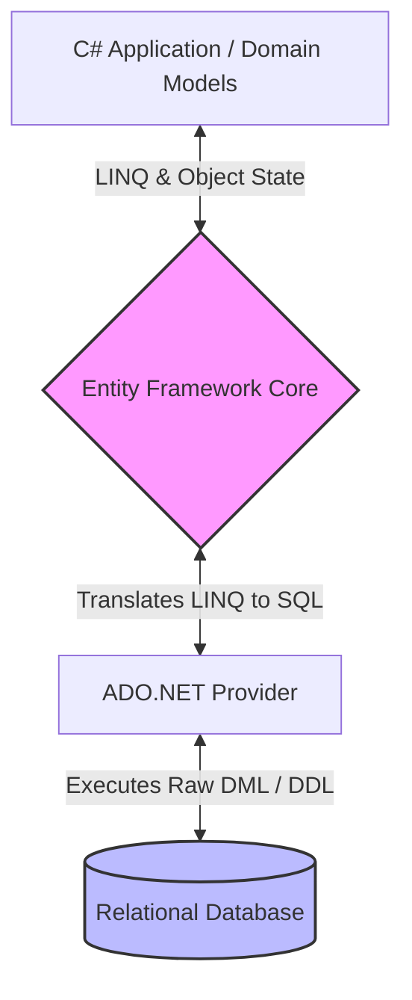
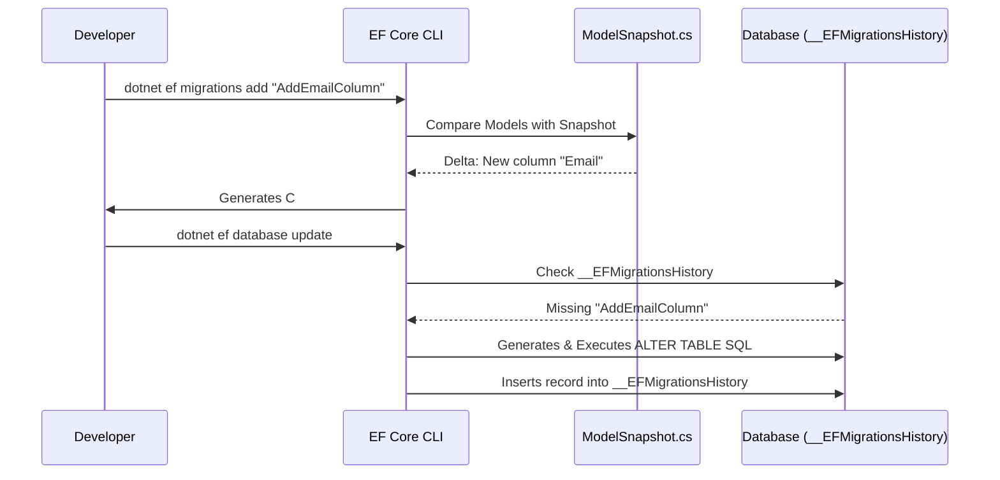

# Lecture 43 — Entity Framework Core: Database Access

**Course:** Full-Stack Web Development  
**Instructor:** Kyrillos Medhat  
**Duration:** 3 hours (Theory + Lab)

---

## 🛑 Prerequisites
Before diving into this lecture, you should be comfortable with:
- **C# Fundamentals:** Classes, properties, interfaces, inheritance, generics, and basic LINQ extensions (like `Where`, `Select`, `Any`).
- **Asynchronous Programming:** Deep understanding of the `async`, `await` keywords, `Task`, and why avoiding thread-blocking in web applications is critical.
- **SQL Basics:** Relational modeling (Tables, Primary Keys, Foreign Keys, Indexes) and fundamental Data Manipulation Language (DML) queries (`SELECT`, `INSERT`, `UPDATE`, `DELETE`).
- **Dependency Injection:** Understanding the inversion of control container in modern .NET applications and the differences between Transient, Scoped, and Singleton service lifecycles.

---

## 🎯 Objectives & Agenda

### Learning Objectives
By the end of this intensive session, you will be able to:
1. Explain the "Object-Relational Impedance Mismatch" and articulate how Entity Framework Core bridges this paradigm gap.
2. Compare and contrast EF Core with micro-ORMs like Dapper, understanding when to use each.
3. Architect and configure a robust `DbContext` and define `DbSet<T>` properties mapped accurately to relational tables.
4. Master the Code-First Migrations workflow to predictably and safely evolve your database schema across environments.
5. Apply Fluent API configuration to enforce database constraints, create shadow properties, apply value converters, and set up global query filters.
6. Execute deep CRUD operations leveraging `async`/`await` patterns for maximum thread efficiency.
7. Understand and trace Entity Framework Core's Change Tracking State Machine.
8. Resolve the notorious "N+1 Query Problem" using Eager Loading, Explicit Loading, and Split Queries.
9. Implement enterprise-level performance optimizations including `AsNoTracking`, DbContext Pooling, and Bulk operations.
10. Implement robust error handling strategies, focusing on Optimistic Concurrency Control and execution strategies for transient faults.

### Agenda
1. **The ORM Philosophy & The Micro-ORM Debate**
2. **Core Components: Entities, DbSets, and the DbContext Lifecycle**
3. **The Migrations Lifecycle: From Code to Relational Schema**
4. **Advanced Model Configuration: Fluent API Mastery & Global Filters**
5. **The Change Tracking State Machine & Advanced CRUD Operations**
6. **Querying Related Data: Escaping the Lazy Loading Trap**
7. **Performance Mastery: Pooling, Tracking, and Evaluation Contexts**
8. **Enterprise Scenarios: Concurrency, Transactions, and Resilience**
9. **Think Like a Developer: Architectural Decision Making**
10. **Common Pitfalls & The "Wall of Shame"**
11. **Labs & Detailed Assignments**
12. **Senior-Level Interview Preparation**
13. **Comprehensive Cheat Sheet**

---

## 1. The ORM Philosophy & The Micro-ORM Debate

### The Object-Relational Impedance Mismatch
In object-oriented programming (OOP), you model systems using interconnected classes that heavily utilize concepts like Inheritance, Polymorphism, and Collections. In relational databases (RDBMS), you model systems using Tables, Rows, Columns, and Foreign Keys. 
Translating seamlessly between these two paradigms is mathematically and logically difficult. This inherent friction is known in computer science as the **Object-Relational Impedance Mismatch**.

An **ORM (Object-Relational Mapper)** serves as an intelligent bridge between these two distinct worlds. **Entity Framework Core (EF Core)** is Microsoft's flagship, fully supported ORM for modern .NET applications.



### Before vs After: Why We Need EF Core

> [!WARNING]
> The legacy ADO.NET approach involved writing raw SQL strings, manually opening TCP connections, reading data cell-by-cell, and meticulously casting types. It was incredibly verbose, brittle, highly vulnerable to SQL injection (if parameters were mismanaged), and completely violated the Don't Repeat Yourself (DRY) principle.

**❌ Before (ADO.NET - The Legacy Way):**
```csharp
public async Task<List<Product>> GetActivePremiumProductsAsync(string category)
{
    var products = new List<Product>();
    string connectionString = "Server=myServer;Database=myDB;Trusted_Connection=True;";
    
    using (var connection = new SqlConnection(connectionString))
    {
        // Magic strings everywhere. Vulnerable to typos.
        string sql = "SELECT Id, Name, Price, Category, IsActive FROM Products WHERE Price > 100 AND Category = @cat AND IsActive = 1";
        
        using (var command = new SqlCommand(sql, connection))
        {
            command.Parameters.AddWithValue("@cat", category);
            await connection.OpenAsync();
            
            using (var reader = await command.ExecuteReaderAsync())
            {
                while (await reader.ReadAsync())
                {
                    // Tedious manual mapping, prone to InvalidCastExceptions
                    var product = new Product
                    {
                        Id = reader.GetInt32(reader.GetOrdinal("Id")),
                        Name = reader.GetString(reader.GetOrdinal("Name")),
                        Price = reader.GetDecimal(reader.GetOrdinal("Price")),
                        Category = reader.GetString(reader.GetOrdinal("Category")),
                        IsActive = reader.GetBoolean(reader.GetOrdinal("IsActive"))
                    };
                    products.Add(product);
                }
            }
        }
    }
    return products;
}
```

**✅ After (EF Core - The Modern Way):**
```csharp
public async Task<List<Product>> GetActivePremiumProductsAsync(string category)
{
    // The developer focuses purely on business logic.
    // EF Core handles SQL generation, connection pooling, parameterization, and object materialization.
    return await _context.Products
        .Where(p => p.Price > 100 && p.Category == category && p.IsActive)
        .ToListAsync();
}
```

### EF Core vs. Dapper (The Micro-ORM)
A common senior-level discussion revolves around EF Core vs. Dapper. 
- **EF Core (Full ORM):** Heavyweight, tracks state, automatically generates SQL, supports complex migrations. Incredible developer productivity. Slightly more overhead.
- **Dapper (Micro-ORM):** Extremely lightweight, zero state tracking, requires writing raw SQL, incredibly fast. Optimized for raw read performance.
**Verdict:** Most modern enterprise applications use EF Core for 95% of database interactions (CRUD, complex business logic) and occasionally drop down to Dapper for the 5% of hyper-performance-critical, read-only analytical queries.

---

## 2. Core Components: Entities, DbSets, and the DbContext Lifecycle

### Entities
Entities are plain old CLR objects (POCOs) that map to database tables. EF Core heavily relies on conventions to infer the schema.

```csharp
public class Department
{
    public int Id { get; set; } // By convention, 'Id' or 'DepartmentId' becomes the Primary Key
    public string Name { get; set; } = string.Empty;
    
    // Collection Navigation Property - A Department has many Employees
    public ICollection<Employee> Employees { get; set; } = new List<Employee>();
}

public class Employee
{
    public int Id { get; set; }
    public string FullName { get; set; } = string.Empty;
    public decimal Salary { get; set; }
    
    // Foreign Key explicitly named
    public int DepartmentId { get; set; }
    
    // Reference Navigation Property - Back reference to the Department
    public Department Department { get; set; } = null!;
}
```

### The `DbContext` and Its Lifecycle
The `DbContext` represents a **Unit of Work** and an active session with the database.

```csharp
using Microsoft.EntityFrameworkCore;

public class CompanyDbContext : DbContext
{
    // The constructor accepts options passed in from the Dependency Injection container
    public CompanyDbContext(DbContextOptions<CompanyDbContext> options) 
        : base(options)
    {
    }

    // DbSets represent the tables you can query and update
    public DbSet<Department> Departments { get; set; }
    public DbSet<Employee> Employees { get; set; }
}
```

> [!IMPORTANT]  
> **The DbContext Lifecycle:** In ASP.NET Core applications, the `DbContext` should **always** be registered as a **Scoped** service. 
> ```csharp
> // Inside Program.cs
> builder.Services.AddDbContext<CompanyDbContext>(options =>
>     options.UseSqlServer(builder.Configuration.GetConnectionString("DefaultConnection")));
> ```
> Being Scoped means a single `DbContext` instance is created per HTTP request. All database operations during that request share the same context (and thus the same state tracker and transaction). When the HTTP request finishes, the `DbContext` is safely disposed, and the underlying database connection is returned to the connection pool. Never register a `DbContext` as a Singleton!

---

## 3. The Migrations Lifecycle: From Code to Relational Schema

**Code-First Migrations** are an evolutionary database design pattern. Instead of writing Data Definition Language (DDL) manually, EF Core analyzes your C# models and generates it.

### How Migrations Work Internally
1. When `add migration` is invoked, EF Core analyzes the current C# models and compares them against the internal snapshot (`ModelSnapshot.cs`) of the previous migration.
2. It calculates the delta (e.g., "The Employee class now has a new string property called Email").
3. It scaffolds a C# migration file containing `Up()` (apply changes) and `Down()` (revert changes) methods.
4. When `database update` is called, EF Core queries a special database table named `__EFMigrationsHistory` to determine which migrations have not been applied yet.
5. It translates the pending `Up()` methods into SQL scripts and executes them inside a transaction.



### Essential CLI Commands
To execute these commands, you must install the global CLI tools: `dotnet tool install --global dotnet-ef`

| Action | .NET Core CLI Command | Powershell Equivalent |
|--------|-----------------------|-----------------------|
| Add Migration | `dotnet ef migrations add <Name>` | `Add-Migration <Name>` |
| Apply to DB | `dotnet ef database update` | `Update-Database` |
| Revert DB | `dotnet ef database update <TargetMigration>` | `Update-Database <TargetMigration>` |
| Remove Last | `dotnet ef migrations remove` | `Remove-Migration` |
| Generate SQL | `dotnet ef migrations script` | `Script-Migration` |

> [!CAUTION]
> If a migration is flawed, **never** manually delete the migration file from the Solution Explorer. Doing so breaks the `ModelSnapshot`. Always run `dotnet ef migrations remove` in the terminal to safely roll back the snapshot and delete the generated files.

---

## 4. Advanced Model Configuration: Fluent API Mastery & Global Filters

While EF Core's conventions and Data Annotations (`[Key]`, `[Required]`) work for basic apps, professional applications exclusively use the **Fluent API** within `OnModelCreating`.

### Why the Fluent API?
1. **Clean Architecture:** It keeps domain models pure and completely oblivious to database infrastructure concerns.
2. **Advanced Capabilities:** Many configurations (composite keys, shadow properties, value converters, table splitting) are completely impossible using Data Annotations.

### Extensive Fluent API Example
```csharp
public class ApplicationDbContext : DbContext
{
    public DbSet<Order> Orders { get; set; }
    public DbSet<Customer> Customers { get; set; }
    
    protected override void OnModelCreating(ModelBuilder modelBuilder)
    {
        base.OnModelCreating(modelBuilder);
        
        // 1. Table Mapping & Primary Keys
        modelBuilder.Entity<Order>().ToTable("Purchases");
        modelBuilder.Entity<Order>().HasKey(o => o.OrderNumber);
        
        // 2. Property Constraints & Types
        modelBuilder.Entity<Order>()
            .Property(o => o.TrackingCode)
            .IsRequired()
            .HasMaxLength(50)
            .IsUnicode(false); // Forces VARCHAR instead of NVARCHAR
            
        // 3. Unique Indexes
        modelBuilder.Entity<Order>()
            .HasIndex(o => o.TrackingCode)
            .IsUnique();
            
        // 4. Value Conversions (Enum to String)
        // Stores an enum as a string in the DB, but reads it as an enum in C#
        modelBuilder.Entity<Order>()
            .Property(o => o.Status)
            .HasConversion<string>();
            
        // 5. Shadow Properties
        // A property that exists in the database but NOT in the C# class!
        modelBuilder.Entity<Order>()
            .Property<DateTime>("LastUpdated_Shadow")
            .HasDefaultValueSql("GETUTCDATE()");

        // 6. Explicit Relationship Mapping
        modelBuilder.Entity<Order>()
            .HasOne(o => o.Customer)
            .WithMany(c => c.Orders)
            .HasForeignKey(o => o.CustomerId)
            .OnDelete(DeleteBehavior.Restrict); // Prevents accidental cascading deletes
            
        // 7. Global Query Filters (Soft Deletes)
        // Every query against the Customer table will automatically append: WHERE IsDeleted = 0
        modelBuilder.Entity<Customer>()
            .HasQueryFilter(c => !c.IsDeleted);
    }
}
```

> [!TIP]
> **Global Query Filters** are the industry standard for implementing "Soft Deletes" (marking a record as deleted without actually erasing it from the DB) or implementing "Multi-Tenancy" (filtering all records by a specific `TenantId` automatically).

---

## 5. The Change Tracking State Machine & Advanced CRUD Operations

Entity Framework Core is fundamentally a **State Machine**. When an entity is queried from the database or added to the context, the `DbContext` tracks it. When `SaveChangesAsync()` is invoked, EF Core examines the state of every tracked object to generate the appropriate SQL commands.

### The 5 Entity States
1. **Detached:** The entity is completely ignored by the context.
2. **Unchanged:** The entity exists in the DB, is tracked, but has not been modified since loading.
3. **Added:** The entity does not exist in the DB. Generates an `INSERT`.
4. **Modified:** The entity exists in the DB, and one or more properties have changed. Generates an `UPDATE`.
5. **Deleted:** The entity exists in the DB but is marked for removal. Generates a `DELETE`.

### CRUD Lifecycle Deep Dive

**Create (State: Added)**
```csharp
var newCustomer = new Customer { Name = "Acme Corp", Email = "contact@acme.com" };
_context.Customers.Add(newCustomer); 
// State transitions from Detached -> Added

await _context.SaveChangesAsync(); 
// SQL: INSERT INTO Customers (Name, Email) VALUES ('Acme Corp', 'contact@acme.com');
// State transitions from Added -> Unchanged
```

**Read (State: Unchanged)**
```csharp
// FindAsync optimizes lookups. It checks the in-memory Change Tracker FIRST. 
// If the entity is already loaded, it avoids a database roundtrip entirely!
var customer = await _context.Customers.FindAsync(1);

// Standard LINQ querying translates Expression Trees into SQL WHERE clauses
var activeCustomers = await _context.Customers
    .Where(c => c.IsActive && c.CreditScore > 700)
    .ToListAsync();
```

**Update (State: Modified)**
```csharp
// 1. Fetch from DB. State becomes 'Unchanged'
var customer = await _context.Customers.FindAsync(1);

if (customer != null)
{
    // 2. Modify property. EF Core's change tracker detects the delta automatically!
    // State transitions from Unchanged -> Modified
    customer.Email = "new@acme.com"; 
    
    // 3. Save changes. 
    // SQL: UPDATE Customers SET Email = 'new@acme.com' WHERE Id = 1;
    await _context.SaveChangesAsync();
}
```

**Delete (State: Deleted)**
```csharp
var customer = await _context.Customers.FindAsync(1);
if (customer != null)
{
    _context.Customers.Remove(customer); // State transitions to Deleted
    await _context.SaveChangesAsync(); // SQL: DELETE FROM Customers WHERE Id = 1;
}
```

---

## 6. Querying Related Data: Escaping the Lazy Loading Trap

Relational databases inherently involve fetching related data (e.g., retrieving a `Blog` and its associated `Posts`). EF Core offers three primary loading strategies.

### 1. Eager Loading (The Industry Standard)
Eager loading fetches the related data simultaneously with the primary query using a SQL `JOIN` or split queries.

```csharp
// Fetches Blogs, their Posts, and the Comments for those Posts in ONE trip to the database
var blogs = await _context.Blogs
    .Include(b => b.Posts)                  // Load immediate child collection
        .ThenInclude(p => p.Comments)       // Load nested child collection
    .ToListAsync();
```

### 2. Explicit Loading (On-Demand Loading)
If you've already loaded a primary entity, you might conditionally decide later that you need its related data.

```csharp
var blog = await _context.Blogs.FindAsync(1);

if (userRequestedToSeePosts)
{
    // Explicitly command EF Core to load the collection for this specific tracked entity
    await _context.Entry(blog)
        .Collection(b => b.Posts)
        .LoadAsync();
}
```

### 3. Lazy Loading (The Performance Killer)
Lazy loading requires installing `Microsoft.EntityFrameworkCore.Proxies` and marking navigation properties as `virtual`. It automatically fetches related data the *exact moment* you access the navigation property in code.

**Why Lazy Loading is dangerous (The N+1 Problem):**
```csharp
// 1 Query is executed to get 100 authors
var authors = _context.Authors.ToList(); 

foreach (var author in authors)
{
    // LAZY LOADING TRIGGERS HERE silently!
    // This executes 1 additional query per author.
    // Result: 100 Authors = 1 initial query + 100 lazy queries = 101 total queries!
    Console.WriteLine($"Author: {author.Name}, Books: {author.Books.Count}");
}
```

> [!WARNING]
> Lazy loading is universally discouraged in modern REST APIs and web applications. It hides database calls inside C# loops, causing massive network latency and CPU bottlenecks. Stick exclusively to Eager Loading.

---

## 7. Performance Mastery: Pooling, Tracking, and Evaluation Contexts

### The Read-Only Optimization (`AsNoTracking`)
The Change Tracker consumes substantial memory to store snapshots of original data values. If you are reading data strictly for display purposes (e.g., returning a JSON array of products to a web client), change tracking is completely unnecessary overhead.

```csharp
// Heavy, slow, and tracks state. Only use if you intend to Update/Delete.
var editableProducts = await _context.Products.ToListAsync();

// Highly optimized, significantly faster, bypasses the state machine.
var readOnlyProducts = await _context.Products
    .AsNoTracking()
    .ToListAsync();
```

### Client vs. Server Evaluation (`IQueryable` vs `IEnumerable`)
This is the single most common cause of memory leaks and performance crashes in EF Core applications.

- **`IQueryable<T>`:** Represents an expression tree. The query has **not** hit the database yet. LINQ methods like `.Where()` are translated into native SQL.
- **`IEnumerable<T>` / `IList<T>`:** The query has executed. The data is now physically residing in application RAM. Further LINQ operations execute on the CPU, not the database.

**❌ The Disaster (Client-Side Evaluation):**
```csharp
// ToList() executes the query immediately! 
// This downloads 5 MILLION rows from the DB into the web server's RAM.
var allLogs = await _context.Logs.ToListAsync(); 

// Then it filters those 5,000,000 rows in memory down to just 10.
var recentErrors = allLogs.Where(l => l.Level == "Error").ToList(); 
```

**✅ The Solution (Server-Side Evaluation):**
```csharp
// Kept as IQueryable. Translates to: SELECT * FROM Logs WHERE Level = 'Error'
// Only 10 rows are sent across the network! Execution happens via ToListAsync().
var recentErrors = await _context.Logs
    .Where(l => l.Level == "Error")
    .ToListAsync(); 
```

### DbContext Pooling
In high-throughput applications, creating and destroying thousands of `DbContext` instances per second can cause garbage collection overhead.
You can pool contexts similar to how ADO.NET pools database connections.

```csharp
// In Program.cs
// Reuses DbContext instances instead of creating new ones
builder.Services.AddDbContextPool<ApplicationDbContext>(options =>
    options.UseSqlServer(connectionString), 
    poolSize: 1024);
```

### Pagination at the Database Level
Never return thousands of records to an API client. Use `.Skip()` and `.Take()` to perform SQL `OFFSET` operations.

```csharp
int pageNumber = 3;
int pageSize = 20;

// Emits: SELECT ... ORDER BY Name OFFSET 40 ROWS FETCH NEXT 20 ROWS ONLY
var paginatedResult = await _context.Products
    .OrderBy(p => p.Name) // Always order before pagination to guarantee predictability
    .Skip((pageNumber - 1) * pageSize)
    .Take(pageSize)
    .ToListAsync();
```

---

## 8. Enterprise Scenarios: Concurrency, Transactions, and Resilience

### Scenario A: Optimistic Concurrency Control
**The Problem:** Admin A and Admin B load the same `Product` entity at exactly 10:00 AM. Admin A changes the Price and saves at 10:01 AM. Admin B changes the Name and saves at 10:02 AM, unknowingly overwriting Admin A's Price change.
**The Solution:** Add a Concurrency Token (a `RowVersion` byte array). EF Core automatically appends this token to the `UPDATE` query's `WHERE` clause.

```csharp
// In the entity class
[Timestamp]
public byte[] RowVersion { get; set; }

// When saving:
try
{
    await _context.SaveChangesAsync();
}
catch (DbUpdateConcurrencyException ex)
{
    // The RowVersion in the DB no longer matches the RowVersion we loaded.
    // Someone else modified this record! Handle the conflict here.
    Console.WriteLine("Concurrency conflict detected!");
}
```

### Scenario B: Explicit Transactions
`SaveChangesAsync()` automatically wraps its operations in a transaction. But what if you need to coordinate multiple `SaveChanges` calls, or integrate EF Core with an external system?

```csharp
using var transaction = await _context.Database.BeginTransactionAsync();
try
{
    _context.Accounts.Update(sourceAccount);
    await _context.SaveChangesAsync();

    _context.Accounts.Update(destinationAccount);
    await _context.SaveChangesAsync();
    
    // Commits only if both operations succeeded
    await transaction.CommitAsync(); 
}
catch (Exception)
{
    // Rolls back the entire operation to prevent partial updates
    await transaction.RollbackAsync(); 
}
```

### Scenario C: Connection Resiliency (Transient Fault Handling)
Cloud databases (like Azure SQL or AWS RDS) sometimes drop connections temporarily due to load balancing. 

```csharp
// In Program.cs, configure EF Core to automatically retry failed operations
builder.Services.AddDbContext<AppDbContext>(options =>
    options.UseSqlServer(connectionString, sqlOptions =>
    {
        sqlOptions.EnableRetryOnFailure(
            maxRetryCount: 3,
            maxRetryDelay: TimeSpan.FromSeconds(5),
            errorNumbersToAdd: null);
    }));
```

---

## 9. Think Like a Developer: Architectural Decision Making

### Decision 1: The Mass Update / Mass Delete Dilemma
**The Requirement:** You need to delete 100,000 stale session tokens from the database.
**Novice Approach:** Fetch all 100k records via `.ToList()`, loop through them calling `.Remove()`, and invoke `SaveChangesAsync()`. This triggers 100,000 distinct SQL `DELETE` statements and consumes gigabytes of RAM.
**Expert Architecture:** Use EF Core 7.0+ Bulk Execution methods. These execute directly on the database without loading entities into memory.
```csharp
// Emits a single, highly optimized SQL statement: 
// DELETE FROM Sessions WHERE ExpiresAt < '2024-01-01'
await _context.Sessions
    .Where(s => s.ExpiresAt < DateTime.UtcNow)
    .ExecuteDeleteAsync();
```

### Decision 2: Combating Cartesian Explosion
**The Requirement:** You need to retrieve a complex object graph: `Order` -> `OrderItems` -> `Product` -> `Category`.
**The Issue:** Using chained `.Include()` statements generates a massive SQL `JOIN` that duplicates data across thousands of rows (Cartesian Explosion).
**Expert Architecture:** Utilize **Split Queries**. EF Core will issue multiple smaller queries and stitch the object graph together efficiently in C# memory.
```csharp
var complexOrder = await _context.Orders
    .Include(o => o.Items)
        .ThenInclude(i => i.Product)
            .ThenInclude(p => p.Category)
    .AsSplitQuery() // Transforms 1 massive slow query into 3 fast, small queries
    .FirstOrDefaultAsync(o => o.Id == 123);
```

---

## 10. Common Pitfalls & The "Wall of Shame"

| ❌ The Mistake | 💥 The Impact | ✅ The Solution |
|---------------|--------------|----------------|
| **Forgetting to `await SaveChangesAsync()`** | Entities are added/modified in memory, but the database remains entirely untouched. | Always ensure your transaction concludes with an awaited `SaveChangesAsync()`. |
| **Materializing too early** | Calling `.ToList()` or `.AsEnumerable()` before `.Where()`, causing massive RAM spikes and network saturation. | Chain `.Where()` directly to the `DbSet` (IQueryable) so filtering happens natively on the SQL Server. |
| **Ignoring the N+1 Query Problem** | A simple nested loop triggers hundreds of separate DB roundtrips, causing immense latency and throttling. | Use `.Include()` to fetch all required relational data upfront in a single SQL operation. |
| **Not using `AsNoTracking()` in APIs** | The Change Tracker needlessly consumes double the memory and CPU cycles when returning read-only JSON responses. | Habitually append `.AsNoTracking()` to all queries in `GET` endpoints. |
| **Modifying DB Schema via SSMS / raw SQL tools** | The C# Model and actual Database get irreparably out of sync, causing EF Core runtime crashes. | **Never** use raw SQL tools to alter schemas. Always utilize Code-First Migrations (`dotnet ef migrations add`). |

---

## 11. 🧪 Labs & Detailed Assignments

### Lab 1: EF Core Groundwork (45 mins)
**Goal:** Prove you can scaffold an EF Core system, configure it properly, and execute Code-First migrations.

**Step-by-Step:**
1. Initialize a .NET Console Application: `dotnet new console -n UniversityApp`
2. Install the necessary Nuget packages:
   ```bash
   dotnet add package Microsoft.EntityFrameworkCore.Sqlite
   dotnet add package Microsoft.EntityFrameworkCore.Design
   ```
3. Create your POCO Entities: `Student` (Id, Name, EnrollmentDate) and `Course` (Id, Title, Credits). Establish a Many-to-Many relationship using navigation properties.
4. Implement the `UniversityContext` (inheriting from `DbContext`). Override `OnConfiguring` to point to a local SQLite file: `optionsBuilder.UseSqlite("Data Source=university.db");`.
5. Execute the migrations: `dotnet ef migrations add InitialSetup` followed by `dotnet ef database update`.
6. **Verification:** Download DB Browser for SQLite. Open `university.db` and verify the automatic creation of three tables: `Students`, `Courses`, and the implicit junction table `CourseStudent`.

### Lab 2: The N+1 Profiler & Split Queries (45 mins)
**Goal:** Visually experience the devastating performance penalty of Lazy/Un-included data and learn to resolve it.

**Step-by-Step:**
1. In `Program.cs` of the `UniversityApp`, write a script to bulk-insert 1 `Course` containing 5,000 associated `Students`.
2. Configure logging in `OnConfiguring` to output SQL queries to the console:
   ```csharp
   optionsBuilder.LogTo(Console.WriteLine, LogLevel.Information);
   ```
3. Query the DB for the course, and loop through its `Students` collection, printing each name. Note the exception thrown (or the silent failure if lazy loading proxies were used).
4. Add `.Include(c => c.Students)` and observe the single, complex SQL `JOIN` printed to the console.
5. Modify the query to append `.AsSplitQuery()` and observe how EF Core now emits two highly optimized, distinct SQL commands instead of one massive JOIN.

### 📝 Major Assignment: FinanceTracker EF Core Integration
Refactor the `FinanceTracker` REST API to completely replace the legacy JSON file repository with a production-grade EF Core SQLite Database.

**Rigorous Requirements:**
- Model Configuration must use **Fluent API exclusively**. No Data Annotations allowed.
- The `Transactions` table must enforce a `MaxLength(100)` constraint on the Description property.
- Implement a Global Query Filter to automatically hide soft-deleted transactions (`IsDeleted == true`).
- All repository read operations (e.g., `GetAllTransactions`) must implement `.AsNoTracking()`.
- Add a new aggregate Endpoint: `GET /api/transactions/summary` that leverages EF Core to calculate the total Sum of all incomes vs expenses using `.SumAsync()` (ensuring the math is executed on the database server, not in C# memory).

---

## 12. 🎙️ Senior-Level Interview Preparation

If you are interviewing for a Mid/Senior .NET position, you must absolutely master these questions:

**Q1: Detail the exact sequence of events that occur when `SaveChanges` is called.**
> **Expert Answer:** When `SaveChanges` is invoked, EF Core traverses its Change Tracker to identify all tracked entities in the `Added`, `Modified`, or `Deleted` states. It opens a database connection (if one isn't open) and begins a database transaction. It then translates the tracked state changes into optimized, parameterized SQL statements (`INSERT`, `UPDATE`, `DELETE`) and executes them as a batch. If all commands succeed, it commits the transaction and updates the local state of entities to `Unchanged`. If any command fails (e.g., a constraint violation or concurrency conflict), it rolls back the entire transaction.

**Q2: What is the N+1 problem, why is it dangerous, and how does EF Core mitigate it?**
> **Expert Answer:** The N+1 problem occurs when an application executes one query to retrieve a list of N entities, and then subsequently executes N additional queries inside a loop to load related data for each entity. This results in massive network latency and database connection exhaustion. In EF Core, this is typically triggered by enabling Lazy Loading or forgetting to load navigation properties. It is permanently mitigated by utilizing Eager Loading via the `.Include()` method, which executes a single, optimized SQL JOIN query, returning the entire object graph simultaneously.

**Q3: Contrast and compare `IQueryable` vs `IEnumerable` in the context of Entity Framework.**
> **Expert Answer:** `IQueryable<T>` inherits from `IEnumerable<T>`, but functions completely differently. `IQueryable` represents a query backed by an expression tree that has *not yet executed*. Chaining LINQ methods like `.Where()` onto an `IQueryable` modifies the expression tree, which EF Core eventually translates into a native SQL query executed entirely on the database server. Conversely, `IEnumerable` represents data that has already been loaded into application memory. Filtering an `IEnumerable` pulls the data first, and filters it using the application's CPU, which can cause catastrophic out-of-memory exceptions if massive tables are pulled accidentally.

**Q4: Explain Optimistic Concurrency in EF Core. How is it implemented?**
> **Expert Answer:** Optimistic concurrency assumes conflicts are rare and doesn't lock database rows during reads. Instead, a Concurrency Token (often a timestamp or `RowVersion` column) is added to the entity. When EF Core issues an `UPDATE`, it appends `WHERE Id = @id AND RowVersion = @originalVersion`. If another user modified the row in the meantime, the database's `RowVersion` will have changed, meaning zero rows will be updated. EF Core detects this and throws a `DbUpdateConcurrencyException`, allowing the application to prompt the user to resolve the conflict.

**Q5: What are Shadow Properties, and what architectural problem do they solve?**
> **Expert Answer:** Shadow Properties are properties defined in the EF Core Model (via Fluent API) that exist as columns in the database but do not exist in the underlying C# entity class. They solve the architectural problem of domain model pollution. For example, auditing fields like `CreatedAt`, `LastModifiedBy`, or foreign keys that shouldn't clutter the pure domain object can be tracked entirely in the shadows by EF Core.

---

## 13. 📜 Comprehensive Cheat Sheet

```csharp
// --- CLI & MIGRATIONS ---
dotnet ef migrations add <Name>          // Create new migration
dotnet ef database update                // Apply to DB
dotnet ef database update <MigName>      // Revert to specific migration
dotnet ef migrations remove              // Delete last unapplied migration
dotnet ef migrations script              // Generate raw SQL script for deployment

// --- TRACKING & OPTIMIZATION ---
var readonlyList = await ctx.Users.AsNoTracking().ToListAsync();
var splitQuery = await ctx.Orders.Include(o => o.Items).AsSplitQuery().ToListAsync();

// --- ADVANCED QUERIES ---
// Pagination
var page = await ctx.Users
    .OrderBy(u => u.Id)
    .Skip((pageNumber - 1) * pageSize)
    .Take(pageSize)
    .ToListAsync();

// Server-Side Aggregation
decimal totalRevenue = await ctx.Orders
    .Where(o => o.Status == "Completed")
    .SumAsync(o => o.TotalAmount);

// --- BULK OPERATIONS (EF Core 7+) ---
// Bulk Delete (No memory loading)
await ctx.Logs.Where(l => l.Date < DateTime.Now.AddYears(-1)).ExecuteDeleteAsync();

// Bulk Update (No memory loading)
await ctx.Products
    .Where(p => p.Category == "Holiday")
    .ExecuteUpdateAsync(s => s.SetProperty(p => p.Price, p => p.Price * 0.9m));

// --- EXPLICIT TRANSACTIONS ---
using var transaction = await ctx.Database.BeginTransactionAsync();
try 
{
    // Multiple operations
    await ctx.SaveChangesAsync();
    await transaction.CommitAsync();
}
catch 
{
    await transaction.RollbackAsync();
}
```

---

## 🔗 Key Takeaways & Essential Resources

### The Four Golden Rules of EF Core
1. **Always use Async/Await:** Database calls are inherently I/O bound. Blocking threads with `.ToList()` or `.SaveChanges()` will rapidly destroy web application scalability.
2. **Filter Exclusively on the Database:** Never bring data into C# memory to filter it. Master `IQueryable`.
3. **Beware the Cartesian Explosion:** Habitually utilize Split Queries for complex `.Include()` chains to prevent query bloat.
4. **Isolate Your Configuration:** Strictly use the Fluent API to maintain clean, agnostic domain entities.

### Official Microsoft Documentation
- [EF Core Complete Overview](https://learn.microsoft.com/en-us/ef/core/)
- [Managing Schemas, Migrations & Deployments](https://learn.microsoft.com/en-us/ef/core/managing-schemas/migrations/)
- [Performance Tuning, Tracking & Pooling](https://learn.microsoft.com/en-us/ef/core/performance/)
- [Client vs. Server Query Evaluation](https://learn.microsoft.com/en-us/ef/core/querying/client-eval)

---

**Next Lecture:** [Lecture 44 — Advanced C# — Delegates, Events, Reflection & Patterns](./44%20-%20Advanced%20C%23%20-%20Delegates%2C%20Events%2C%20Reflection%20%26%20Patterns.md)

### 📚 Extensive Tutorials & Resources
- **CodeMaze:** [ASP.NET Core Web API Tutorials](https://code-maze.com/net-core-series/)
- **FreeCodeCamp:** [Build APIs with ASP.NET Core](https://www.freecodecamp.org/news/build-web-apis-with-asp-net-core/)
- **Microsoft Learn:** [Create web APIs with ASP.NET Core](https://learn.microsoft.com/en-us/training/paths/create-web-api-aspnet-core/)
