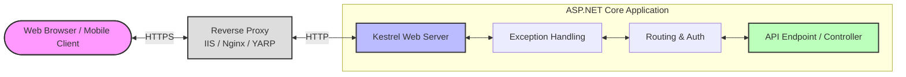
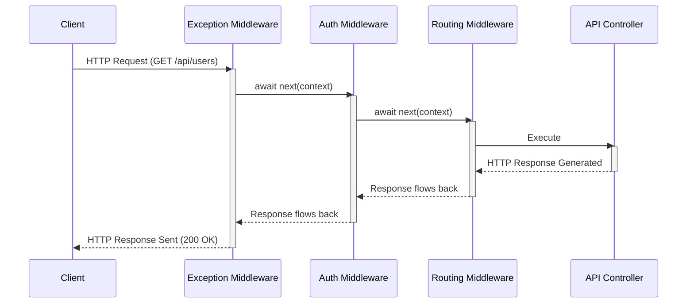

# Lecture 45 — ASP.NET Core Fundamentals & Middleware

**Course:** Full-Stack Web Development  
**Instructor:** Kyrillos Medhat  
**Duration:** 3 hours (Theory + Lab)

---

## 🛑 Prerequisites

Before beginning this lecture, you must have a solid foundation in the following areas:

- **C# Programming & Object-Oriented Design (OOD):** 
  - You must understand classes, interfaces, inheritance, and polymorphism.
  - Deep familiarity with `async/await` and Task Parallel Library (TPL). ASP.NET Core is entirely asynchronous.
  - Generics (e.g., `List<T>`, `IEnumerable<T>`) as they are heavily used in Dependency Injection.
- **HTTP Fundamentals:** 
  - Familiarity with the stateless nature of HTTP.
  - Understanding of HTTP verbs (GET, POST, PUT, DELETE, PATCH).
  - Knowledge of common status codes (200 OK, 400 Bad Request, 401 Unauthorized, 404 Not Found, 500 Internal Server Error).
- **Development Environment:** 
  - The .NET 8 SDK (or later) installed on your machine.
  - A modern IDE such as Visual Studio 2022, JetBrains Rider, or Visual Studio Code.
  - Basic familiarity with the `dotnet CLI` for creating projects.

---

## 🎯 Objectives & 📋 Agenda

### Objectives
By the end of this comprehensive deep-dive lecture, you will be professionally equipped to:
1. **Deconstruct ASP.NET Core Architecture:** Understand the exact path an HTTP request takes from the client to your code.
2. **Master the Request Pipeline:** Architect, sequence, and debug powerful custom middleware components.
3. **Command Dependency Injection (DI):** Register, inject, and manage the lifecycles of your application's services.
4. **Implement Robust Configuration Strategies:** Utilize the Options Pattern (`IOptions<T>`) and multi-layered configuration sources for secure deployments.
5. **Embrace Modern Hosting & Orchestration:** Leverage the Minimal Hosting Model (`Program.cs`) and scale up to cloud-native orchestration with .NET Aspire.

### Agenda

**Part 1: The Core Architecture & Hosting (45 min)**
- The journey of an HTTP Request (Kestrel vs. Reverse Proxies).
- The `launchSettings.json` file demystified.
- The modern Minimal Hosting Model (`WebApplicationBuilder`).

**Part 2: The Middleware Pipeline in High Definition (45 min)**
- The "Water Filter" Analogy expanded.
- `Use`, `Run`, `Map`, and `MapWhen` delegates.
- Building class-based, robust middleware.

**Part 3: Dependency Injection Deep Dive (45 min)**
- Inversion of Control (IoC) basics and the `IServiceProvider`.
- Transient vs. Scoped vs. Singleton lifetimes in detail.
- Scopes and resolving Captive Dependencies.

**Part 4: Configuration & Secrets Management (30 min)**
- Configuration providers and hierarchical overriding.
- The Options Pattern (`IOptions<T>`).
- Securing local development with `dotnet user-secrets`.

**Part 5: Introduction to .NET Aspire (15 min)**
- Orchestrating distributed systems gracefully.
- AppHost and the Aspire Dashboard.

---

## 1. ASP.NET Core Architecture Deep Dive

To write highly performant web applications, you must understand exactly how your application interfaces with the outside world. ASP.NET Core does not listen to the internet directly in the same way legacy frameworks did; it relies on a sophisticated, cross-platform web server architecture.

### The Request Journey

1. **The Client Network:** A user clicks a button on their browser or a mobile app makes an API call. A TCP/IP connection is established.
2. **The Reverse Proxy (Optional but standard in Production):** In an enterprise environment, your ASP.NET Core app usually sits behind a reverse proxy like IIS, Nginx, or a cloud-native Load Balancer. Reverse proxies handle raw network concerns, SSL/TLS termination, static file caching, and load balancing.
3. **Kestrel:** The reverse proxy forwards the decrypted HTTP request to Kestrel. Kestrel is ASP.NET Core's built-in, insanely fast, cross-platform edge web server. Kestrel's primary job is to read the raw HTTP text bytes and translate them into a structured C# object called `HttpContext`.
4. **The Application Pipeline:** Kestrel hands the populated `HttpContext` over to your application code—specifically, the ASP.NET Core Middleware Pipeline.



### Why Kestrel is a Game Changer
Kestrel is designed to be a lightweight, ultra-high-performance server. 
- It is based on **asynchronous I/O**.
- It heavily utilizes modern .NET features like `Span<T>` and `Memory<T>` to parse HTTP requests with near-zero memory allocations. Every time Kestrel avoids allocating a string, it saves the Garbage Collector (GC) from having to clean it up.
- Kestrel natively supports modern HTTP protocols, including HTTP/2 and HTTP/3 (QUIC), allowing for multiplexed streams and faster connections over lossy networks.

### Exploring `launchSettings.json`
When developing locally, you will notice a `Properties/launchSettings.json` file. This file tells your IDE how to start the application.

```json
{
  "profiles": {
    "http": {
      "commandName": "Project",
      "applicationUrl": "http://localhost:5000",
      "environmentVariables": {
        "ASPNETCORE_ENVIRONMENT": "Development"
      }
    },
    "IIS Express": {
      "commandName": "IISExpress",
      "environmentVariables": {
        "ASPNETCORE_ENVIRONMENT": "Development"
      }
    }
  }
}
```
- **"commandName": "Project"**: This starts Kestrel directly using the `dotnet run` command. This is the modern, preferred way to develop locally, as it exactly matches how your app will run in a Linux Docker container.
- **"commandName": "IISExpress"**: This starts a lightweight version of Windows IIS, which then reverse-proxies to Kestrel. This was standard in older versions of .NET but is increasingly obsolete.

---

## 2. Project Structure & The Minimal Hosting Model

Let's begin by generating a new Web API project from the terminal. We will use the standard template which implements the Minimal Hosting Model.

```bash
dotnet new webapi -n EnterpriseShopAPI
```

### The Magic of `Program.cs`

In modern .NET (since .NET 6), the entire configuration, service registration, and pipeline setup of your web application occurs in a single file called `Program.cs` using top-level statements. This file is logically divided into distinct, immutable phases. 

Understanding these phases is critical because performing an action in the wrong phase will result in a runtime exception.

```csharp
// ==========================================
// PHASE 1: The Builder Creation
// ==========================================
// WebApplication.CreateBuilder(args) does heavy lifting behind the scenes:
// 1. Instantiates the Kestrel web server.
// 2. Loads appsettings.json, environment variables, and user secrets.
var builder = WebApplication.CreateBuilder(args);

// ==========================================
// PHASE 2: Service Registration (Dependency Injection)
// ==========================================
// Here, we add "ingredients" (services) to our DI container via builder.Services.
// We are teaching ASP.NET Core how to construct our dependencies later.

builder.Services.AddControllers(); 
builder.Services.AddEndpointsApiExplorer();
builder.Services.AddSwaggerGen();

// ==========================================
// PHASE 3: The Build
// ==========================================
// The builder locks the IServiceCollection (DI container) and creates the 
// actual WebApplication instance.
// CRITICAL: After this line executes, you CANNOT add more services.
var app = builder.Build();

// ==========================================
// PHASE 4: Middleware Pipeline Configuration
// ==========================================
// THE ORDER IN WHICH YOU ADD MIDDLEWARE IS ABSOLUTELY CRITICAL.

// 1. Exception Handling should always be first!
if (app.Environment.IsDevelopment())
{
    app.UseSwagger();
    app.UseSwaggerUI();
}
else 
{
    // In production, catch errors and return generic 500 JSON
    app.UseExceptionHandler("/error"); 
}

app.UseHttpsRedirection(); // Redirects HTTP to HTTPS
app.UseRouting();

// Security (Must happen AFTER routing, but BEFORE executing the endpoint)
app.UseAuthentication();   // Determines WHO the user is
app.UseAuthorization();    // Determines WHAT the user is allowed to do

// Endpoint Execution
app.MapControllers();      // Maps incoming URLs to your Controller class methods

// ==========================================
// PHASE 5: Run
// ==========================================
// Starts the Kestrel server and begins listening for HTTP requests.
app.Run();
```

---

## 3. Middleware: The Request Pipeline in High Definition

### The Water Filter Analogy (Expanded)

Imagine water flowing from a muddy river (the Internet) into a high-tech treatment plant (your Server). Before the water reaches the city reservoir (your Application Controller Logic), it is forced through a series of filters enclosed in a single large pipe. 

1. **Filter 1 (Security/CORS):** A wide mesh that removes large debris. If debris is found, it dumps the water out.
2. **Filter 2 (Authentication):** A chemical sensor tests the water. It requires a specific digital signature (a JWT token). If missing, it halts the flow and rejects it.
3. **Filter 3 (Routing):** A series of valves that direct the water to the correct neighborhood based on its intended destination.

Finally, the clean, authorized, correctly-routed water reaches the home. 

If there is an issue at any point (e.g., an unhandled Exception occurs in the Controller), the chaotic water rushes backward through the pipe. Filter 1 (which we might configure as an Exception Handler) catches the backward flow, cleans it up, and safely discharges it.

### The Bidirectional Nature of Middleware

ASP.NET Core implements the **Chain of Responsibility** pattern. 



Every middleware has **two opportunities** to execute code:
1. **Inbound Processing:** Modifying the `HttpContext.Request` before calling the `next` middleware.
2. **Outbound Processing:** Modifying the `HttpContext.Response` after the `next` middleware completes its work and control returns back up the call stack.

### Inline Middleware: `Use`, `Run`, and `Map`

While building the pipeline in `Program.cs`, you have several tools at your disposal.

#### 1. `app.Use()`
The most common approach. It performs logic, then explicitly invokes the `next` middleware in the chain via `await next(context)`.

```csharp
app.Use(async (context, next) =>
{
    // ---> INBOUND LOGIC (Before Controller executes)
    var timer = System.Diagnostics.Stopwatch.StartNew();
    
    // Pass control down the pipe
    await next(context); 
    
    // <--- OUTBOUND LOGIC (After Controller executes)
    timer.Stop();
    context.Response.Headers.Append("X-Processing-Time-Ms", timer.ElapsedMilliseconds.ToString());
});
```

#### 2. `app.Run()`
A **Terminal** middleware. It performs logic and immediately writes a response. It *never* receives a `next` delegate. It "short-circuits" the pipeline.

```csharp
app.Run(async context =>
{
    context.Response.StatusCode = 404;
    await context.Response.WriteAsync("Resource not found. Pipeline terminated.");
});
```

#### 3. Branching: `app.Map()`
Sometimes you want a completely separate mini-pipeline for specific routes.

```csharp
app.Map("/admin", adminBranch =>
{
    adminBranch.Use(async (context, next) => 
    {
        Console.WriteLine("Admin area accessed.");
        await next(context);
    });
    
    adminBranch.Run(async context => await context.Response.WriteAsync("Admin Dashboard"));
});
```

### Class-Based Custom Middleware (Enterprise Standard)

For complex logic, inline lambda functions become unreadable. The professional approach is to write a dedicated class.

A valid Middleware class requires:
1. A public constructor containing a `RequestDelegate` (the pointer to the next middleware).
2. A public `InvokeAsync` (or `Invoke`) method that takes an `HttpContext`.

Let's build a highly practical **Correlation ID Middleware**. In a microservices environment, a Correlation ID is a unique GUID passed in the headers that tracks the request across multiple APIs.

```csharp
using Microsoft.AspNetCore.Http;
using Microsoft.Extensions.Logging;
using System.Threading.Tasks;
using System;

public class CorrelationIdMiddleware
{
    private const string CorrelationIdHeaderName = "X-Correlation-ID";
    private readonly RequestDelegate _next;

    public CorrelationIdMiddleware(RequestDelegate next)
    {
        _next = next;
    }

    public async Task InvokeAsync(HttpContext context, ILogger<CorrelationIdMiddleware> logger)
    {
        string correlationId = context.Request.Headers[CorrelationIdHeaderName].FirstOrDefault();

        if (string.IsNullOrEmpty(correlationId))
        {
            correlationId = Guid.NewGuid().ToString();
            context.Request.Headers.Append(CorrelationIdHeaderName, correlationId);
        }

        using (logger.BeginScope("CorrelationId: {CorrelationId}", correlationId))
        {
            logger.LogInformation("Processing request {Method} {Path}", context.Request.Method, context.Request.Path);

            context.Response.OnStarting(() =>
            {
                if (!context.Response.Headers.ContainsKey(CorrelationIdHeaderName))
                {
                    context.Response.Headers.Append(CorrelationIdHeaderName, correlationId);
                }
                return Task.CompletedTask;
            });

            await _next(context); 
            
            logger.LogInformation("Finished processing request.");
        }
    }
}
```

To use this cleanly, we write an Extension Method for `IApplicationBuilder`:

```csharp
public static class MiddlewareExtensions
{
    public static IApplicationBuilder UseCorrelationId(this IApplicationBuilder builder)
    {
        return builder.UseMiddleware<CorrelationIdMiddleware>();
    }
}
```

Then in `Program.cs`:
```csharp
app.UseCorrelationId(); 
```

> [!WARNING]
> **Middleware Ordering is a primary source of catastrophic bugs!**
> If you place `app.UseAuthorization()` *before* `app.UseAuthentication()`, the application will try to verify the user's role before it has even decrypted the JWT to figure out who the user is! Always follow the standard template ordering carefully.

---

## 4. Dependency Injection & Service Lifetimes

ASP.NET Core is built from the ground up on the **Inversion of Control (IoC)** principle using its built-in Dependency Injection (DI) container. 

Instead of a class instantiating its own dependencies using the `new` keyword (which creates tight coupling), a class simply declares what it needs in its constructor. The framework's DI container is responsible for creating the dependency and passing it in.

### Service Lifetimes in Extreme Detail

When you register a service in `Program.cs`, you must declare its **Lifetime**. This tells the `IServiceProvider` how often it should create a new instance of the object in memory.

| Lifetime | Method | Behavior (When is a new instance created?) | Analogy | Common Real-World Use Cases |
|----------|--------|--------------------------------------------|---------|-----------------------------|
| **Transient** | `AddTransient<I, T>()` | **Every single time** it is requested. If a single HTTP request asks for `IService` 3 times, 3 separate instances are created. | A disposable paper cup. Use it once, throw it away. | Lightweight, stateless services. Math calculators, formatting utilities. |
| **Scoped** | `AddScoped<I, T>()` | **Once per HTTP request**. All classes that ask for this service during the *same* HTTP request share the *exact same* instance. | A table at a restaurant. Yours for the duration of the meal, then cleared. | **Entity Framework `DbContext`**, repositories, unit of work patterns. |
| **Singleton** | `AddSingleton<I, T>()` | **Only once** for the entire lifespan of the application. It is created the very first time it's requested and shared across all subsequent requests. | The restaurant building itself. Everyone shares it simultaneously forever. | In-memory caches (`IMemoryCache`), configuration loaders. |

### Code Example: Registration and Injection

**1. Define the Interface and Implementation:**
```csharp
public interface IPaymentProcessor
{
    bool ProcessPayment(decimal amount);
}

public class StripePaymentProcessor : IPaymentProcessor
{
    private readonly string _apiKey;
    
    public StripePaymentProcessor(IConfiguration config)
    {
        _apiKey = config["Stripe:ApiKey"];
    }

    public bool ProcessPayment(decimal amount)
    {
        Console.WriteLine($"Processing {amount} via Stripe...");
        return true;
    }
}
```

**2. Registration in `Program.cs` (Phase 2):**
```csharp
builder.Services.AddScoped<IPaymentProcessor, StripePaymentProcessor>();
```

**3. Injection into a Controller:**
```csharp
[ApiController]
[Route("api/[controller]")]
public class CheckoutController : ControllerBase
{
    private readonly IPaymentProcessor _paymentProcessor;

    // The ASP.NET Core framework automatically sees this constructor requirement
    // during the request pipeline, resolves the Scoped instance, and fulfills it.
    public CheckoutController(IPaymentProcessor paymentProcessor)
    {
        _paymentProcessor = paymentProcessor;
    }

    [HttpPost("pay")]
    public IActionResult Pay([FromBody] decimal amount)
    {
        var result = _paymentProcessor.ProcessPayment(amount);
        return result ? Ok("Payment Successful!") : BadRequest("Payment Failed.");
    }
}
```

---

## 5. Configuration & Secure Environments

### The Configuration Hierarchy (The "Last-In-Wins" Rule)

ASP.NET Core aggregates configuration from multiple sources, merging them into a single key-value dictionary in memory. If the exact same key exists in multiple sources, the **last provider registered wins**. 

By default, the order is:
1. **`appsettings.json`** 
2. **`appsettings.{Environment}.json`** 
3. **User Secrets** (Local developer secrets)
4. **Environment Variables** 
5. **Command-line arguments** 

### The Options Pattern (`IOptions<T>`)

Injecting the raw `IConfiguration` object everywhere and relying on "magic string" keys (like `_config["PaymentGateway:ApiKey"]`) is an anti-pattern. ASP.NET Core encourages the **Options Pattern**, which maps JSON configuration directly to strongly-typed C# classes.

**1. The JSON Configuration (`appsettings.json`):**
```json
{
  "StripeConfig": {
    "SecretKey": "sk_test_12345",
    "TimeoutSeconds": 30
  }
}
```

**2. The Strongly-Typed C# Class:**
```csharp
public class StripeOptions
{
    public const string SectionName = "StripeConfig";
    public string SecretKey { get; set; } = string.Empty;
    public int TimeoutSeconds { get; set; }
}
```

**3. Registration in `Program.cs`:**
```csharp
builder.Services.Configure<StripeOptions>(
    builder.Configuration.GetSection(StripeOptions.SectionName));
```

**4. Usage via `IOptions<T>` in a Service:**
```csharp
public class PaymentService
{
    private readonly StripeOptions _stripeOptions;

    public PaymentService(IOptions<StripeOptions> options)
    {
        _stripeOptions = options.Value; 
    }

    public void InitiateTransfer()
    {
        Console.WriteLine($"Using Key: {_stripeOptions.SecretKey}");
    }
}
```

### The Secret Manager (User Secrets)

**NEVER** put real database passwords or production API keys into `appsettings.json`. That file is tracked by Git. For local development, ASP.NET Core provides **User Secrets**. These are stored in a hidden, unencrypted JSON file in your computer's user profile, completely isolated from your source code repository.

**How to use User Secrets:**
1. Navigate to your project folder.
2. Initialize secrets: `dotnet user-secrets init`
3. Set a secret: `dotnet user-secrets set "StripeConfig:SecretKey" "sk_test_REAL_SECRET_DO_NOT_SHARE"`

---

## 6. Introduction to .NET Aspire

Building modern cloud-native applications often means your ASP.NET Core API relies on other services: a PostgreSQL database, a Redis cache, and a frontend application.

**.NET Aspire** (introduced in .NET 8) is an opinionated, cloud-native stack for building observable, distributed applications entirely in C#.

When you use an Aspire template, it creates an `AppHost` project. The AppHost acts as a master orchestrator. Instead of writing YAML files, you use a Fluent API in C# to define your infrastructure.

```csharp
// Program.cs inside the Aspire AppHost project
var builder = DistributedApplication.CreateBuilder(args);

// 1. Define a PostgreSQL database server container
var postgres = builder.AddPostgres("postgres").AddDatabase("ShopDb");

// 2. Define a Redis cache container
var redis = builder.AddRedis("cache");

// 3. Launch our ASP.NET Core API project!
var api = builder.AddProject<Projects.EnterpriseShopAPI>("shop-api")
                 .WithReference(postgres)
                 .WithReference(redis);

// 4. Launch the Angular frontend
builder.AddNpmApp("frontend", "../frontend")
       .WithReference(api);

builder.Build().Run();
```

When you hit Run, Aspire dynamically provisions Docker containers for Redis and Postgres, starts your API and Frontend, maps all the ports, and opens a beautiful **Aspire Dashboard** showing structured logs, OpenTelemetry traces, and metrics.

---

## 🧠 Think Like a Developer (Real-World Scenarios)

### Scenario 1: The Captive Dependency (The Silent Memory Leak)
**The Situation:** You register an `InMemoryCacheService` as a **Singleton** to store frequently accessed data. Inside that cache service, you inject your Entity Framework `ShopDbContext` (which is **Scoped** by default).
**The Developer's Thought Process:** "A Singleton lives forever. If I inject a Scoped service (DbContext) into a Singleton, the Singleton saves a reference to it. The DbContext becomes trapped and will *never* be disposed at the end of the HTTP request."
**The Consequence:** The database connection remains open indefinitely. The server's memory usage will climb continuously until it crashes with an `OutOfMemoryException`.
**The Fix:** This is a **Captive Dependency**. The solution is to inject an `IServiceScopeFactory` into the Singleton instead of the DbContext. When a cache miss occurs, manually create a temporary scope, resolve the DbContext, query the database, and immediately dispose the scope.

### Scenario 2: The Middleware Ordering Crisis
**The Situation:** You added a `RateLimitingMiddleware` to stop DDoS attacks. You casually place `app.UseRateLimiter()` *after* `app.UseAuthentication()` in `Program.cs`.
**The Developer's Thought Process:** "The pipeline processes requests in order. The server will perform expensive cryptographic JWT signature validation on *every single request* first, before the rate limiter even gets a chance to see them."
**The Consequence:** The CPU spikes to 100%, and legitimate users experience massive timeouts because the server is dying from the cryptographic workload.
**The Fix:** `app.UseRateLimiter()` must be moved to the very top of the pipeline, before Authentication, ensuring bad actors are rejected before burning CPU cycles.

---

## 🔄 Before vs After

### Legacy `Startup.cs` vs Modern `Program.cs`

Prior to .NET 6, ASP.NET Core required two separate files (`Program.cs` and `Startup.cs`) with heavy boilerplate.

**❌ Before (.NET 5 and older)**
```csharp
public class Program
{
    public static void Main(string[] args) => CreateHostBuilder(args).Build().Run();

    public static IHostBuilder CreateHostBuilder(string[] args) =>
        Host.CreateDefaultBuilder(args)
            .ConfigureWebHostDefaults(webBuilder => { webBuilder.UseStartup<Startup>(); });
}

public class Startup
{
    public void ConfigureServices(IServiceCollection services) { services.AddControllers(); }
    public void Configure(IApplicationBuilder app) 
    { 
        app.UseRouting();
        app.UseEndpoints(endpoints => { endpoints.MapControllers(); });
    }
}
```

**✅ After (.NET 6+)**
```csharp
var builder = WebApplication.CreateBuilder(args);
builder.Services.AddControllers();

var app = builder.Build();
app.MapControllers();
app.Run();
```

---

## ⚠️ Common Mistakes & How to Avoid Them

| ❌ The Mistake | 💥 The Consequence | ✅ The Pro Fix |
|----------------|--------------------|----------------|
| **Committing secrets to Git** | Your Database accounts get compromised by bots scanning GitHub. | Use `dotnet user-secrets` locally. Use Key Vault in Production. |
| **Using `app.Run()` in the middle of `Program.cs`** | Any middleware registered after `app.Run()` is completely ignored. | Always use `app.Use()` with `await next(context);` unless explicitly short-circuiting. |
| **Registering a `DbContext` as a Singleton** | Database contexts are not thread-safe. Concurrent requests will crash. | Ensure `DbContext` is registered as `Scoped`. |
| **Captive Dependencies** | Injecting a Transient/Scoped service into a Singleton causes memory leaks. | Use `IServiceScopeFactory` to manually create short scopes inside singletons. |

---

## 🧪 Labs & Assignments

### Lab 1: Building a Global Exception Handler Middleware
**Goal:** Prevent your API from returning raw HTML stack traces to a client.

1. Create a class `GlobalExceptionMiddleware.cs`.
```csharp
public class GlobalExceptionMiddleware
{
    private readonly RequestDelegate _next;
    private readonly ILogger<GlobalExceptionMiddleware> _logger;

    public GlobalExceptionMiddleware(RequestDelegate next, ILogger<GlobalExceptionMiddleware> logger)
    {
        _next = next;
        _logger = logger;
    }

    public async Task InvokeAsync(HttpContext context)
    {
        try
        {
            await _next(context);
        }
        catch (Exception ex)
        {
            _logger.LogError(ex, "A critical unhandled exception occurred.");
            context.Response.ContentType = "application/json";
            context.Response.StatusCode = StatusCodes.Status500InternalServerError;
            await context.Response.WriteAsJsonAsync(new { Error = "An unexpected error occurred." });
        }
    }
}
```
2. In `Program.cs`, register it: `app.UseMiddleware<GlobalExceptionMiddleware>();` as the very first middleware.
3. Add a dummy endpoint to test it: `app.MapGet("/crash", () => { throw new Exception("Simulated Failure!"); });`

### Lab 2: The Dependency Injection Lifetimes Experiment
**Goal:** Visually prove how Transient, Scoped, and Singleton lifetimes behave.
1. Create a simple interface `IGuidGenerator` with `Guid Id { get; }`.
2. Create three separate classes implementing it: `TransientGenerator`, `ScopedGenerator`, and `SingletonGenerator`. 
3. In each class's constructor, assign `Id = Guid.NewGuid();`.
4. Register them in `Program.cs` using their respective DI lifetimes.
5. Create a new API Controller. Inject all three interfaces into the constructor twice (`transient1`, `transient2`, etc.).
6. Create an endpoint that returns all 6 Guid values.
7. Hit the endpoint and refresh. Observe which GUIDs change and which remain static.

---

## 🎙️ Interview Prep

**Q1: Explain the difference between Transient, Scoped, and Singleton DI lifetimes.**
> **Answer:** Transient creates a brand new instance every time. Scoped creates one instance per HTTP request. Singleton creates a single instance that is shared across the entire application lifespan.

**Q2: What is a Captive Dependency in ASP.NET Core, and why is it dangerous?**
> **Answer:** A captive dependency occurs when a Singleton is injected with a Scoped or Transient service. The shorter-lived dependency is "held captive" in the Singleton's memory and is never disposed. This leads to severe memory leaks and thread-safety violations.

**Q3: How does the Middleware pipeline process requests and handle errors?**
> **Answer:** The pipeline is a Chain of Responsibility pattern. Requests flow *in* through the sequence of middlewares, and responses flow *out* in reverse order. An Exception Handling middleware at the top of the pipeline wraps the downstream pipeline in a `try/catch` block, catching any bubbling exceptions.

---

## 📜 Cheat Sheet: ASP.NET Core Initialization

```csharp
// 1. BUILDER PHASE
var builder = WebApplication.CreateBuilder(args);

// DI Registrations
builder.Services.AddTransient<IMyService, MyService>();
builder.Services.AddScoped<IMyRepo, MyRepo>();
builder.Services.AddSingleton<IMyCache, MyCache>();

// 2. APP PHASE (PIPELINE)
var app = builder.Build();

// Inline Middleware
app.Use(async (context, next) => {
    // Inbound
    await next(context);
    // Outbound
});

// Terminal Middleware (Stops pipeline)
app.Run(async context => {
    await context.Response.WriteAsync("Pipeline ends here.");
});

// Class Middleware registration
app.UseMiddleware<GlobalExceptionMiddleware>();

app.MapControllers();
app.Run();
```

---

## 📌 Key Takeaways & Resources

### Key Takeaways
- **Kestrel is the Engine:** ASP.NET Core relies on the ultra-fast Kestrel web server.
- **Middleware is a Bidirectional Chain:** Requests flow IN, responses flow OUT. Order is mathematically critical.
- **IoC is Mandatory:** Dependency Injection is the fundamental way the entire framework operates. Mastering lifetimes is required for any senior developer.
- **Options Pattern:** Strongly type your configurations and use User Secrets.

### Recommended Official Resources
- [Microsoft Docs: ASP.NET Core Fundamentals](https://learn.microsoft.com/en-us/aspnet/core/fundamentals/)
- [Microsoft Docs: Middleware Architecture](https://learn.microsoft.com/en-us/aspnet/core/fundamentals/middleware/)
- [Microsoft Docs: Dependency Injection](https://learn.microsoft.com/en-us/dotnet/core/extensions/dependency-injection)

---

**Next Lecture:** [Lecture 46 — Controllers, Routing & Model Binding](./46%20-%20Controllers%2C%20Routing%20%26%20Model%20Binding.md)

### 📚 Extensive Tutorials & Resources
- **CodeMaze:** [ASP.NET Core Web API Tutorials](https://code-maze.com/net-core-series/)
- **FreeCodeCamp:** [Build APIs with ASP.NET Core](https://www.freecodecamp.org/news/build-web-apis-with-asp-net-core/)
- **Microsoft Learn:** [Create web APIs with ASP.NET Core](https://learn.microsoft.com/en-us/training/paths/create-web-api-aspnet-core/)
