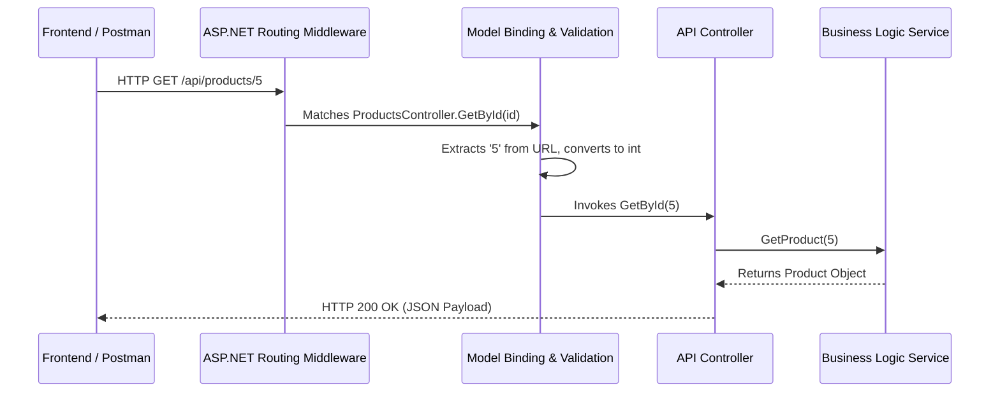

# Lecture 46 — Controllers, Routing & Model Binding

**Course:** Full-Stack Web Development  
**Instructor:** Kyrillos Medhat  
**Duration:** 3 hours (Theory + Lab)

---

## 🧱 Prerequisites
Before diving into this lecture, you should have a solid grasp of:
- **C# Fundamentals:** Classes, interfaces, properties, methods, records, and basic LINQ operations.
- **HTTP Basics:** An understanding of HTTP verbs (GET, POST, PUT, DELETE, PATCH), status codes (2xx, 4xx, 5xx), and request/response headers.
- **RESTful Concepts:** The basic architectural idea of what a REST API is and how clients interact with stateful resources.
- **JSON Formatting:** Familiarity with reading and writing JSON (JavaScript Object Notation), as it is the standard payload format in modern web APIs.
- **Environment Setup:** Visual Studio 2022 or VS Code with the .NET 8 SDK installed.
- **Basic Dependency Injection:** A conceptual understanding of how inversion of control works in .NET.

---

## 🎯 Learning Objectives

By the end of this comprehensive lecture, you will be able to:
1. Explain the architectural role of API Controllers in a modern backend system and the Request-Response lifecycle.
2. Construct robust Controller classes using `ControllerBase` and the `[ApiController]` attribute.
3. Precisely route HTTP requests to specific C# methods using Attribute Routing.
4. Apply advanced route constraints to ensure endpoints only handle valid data types and formats.
5. Bind data from various parts of HTTP requests (Body, Query, Route, Headers, Form) directly to C# parameters and complex objects.
6. Return standard, semantic HTTP Response Codes using `IActionResult` and the strongly-typed `ActionResult<T>`.
7. Implement resilient data validation using Data Annotations, `IValidatableObject`, and understand the integration of third-party tools like FluentValidation.
8. Distinguish between different HTTP verbs, understand concepts like idempotency, and recognize when to use PUT vs. PATCH.
9. Architect "Thin Controllers" by properly delegating business logic to Service layers.

---

## 📋 Agenda

### Part 1 — Theory & Deep Dive (~100 min)
1. **The Request Lifecycle & What is an API Controller?** (The Drive-Thru Analogy, Request Pipeline).
2. **Attribute Routing:** Directing Traffic, Route Parameters, and Advanced Constraints.
3. **HTTP Verbs & Action Methods:** Exploring the semantics of REST and Idempotency.
4. **Model Binding:** Extracting Data from Requests (`[FromRoute]`, `[FromQuery]`, `[FromBody]`, `[FromHeader]`, `[FromForm]`).
5. **Action Results & Content Negotiation:** Sending Proper, Meaningful Responses in JSON/XML.
6. **Data Validation:** Mastering `ModelState`, Data Annotations, Custom Validation, and `[ApiController]` magic.
7. **Architectural Best Practices:** Fat vs. Thin Controllers, Exception Handling.

### Part 2 — Practice / Lab (~80 min)
1. Build a basic `ProductsController` with hardcoded static data.
2. Implement advanced routing constraints and custom validation.
3. Use Postman or Swagger to test all 5 CRUD operations.
4. ShopAPI Project Part 2: Product Controllers, robust Validation, and DTO implementations.

---

## 1. The Request Lifecycle & What is an API Controller?

### The Request Lifecycle: From Client to Controller
Before we write code, it is critical to understand what happens when a frontend application (like Angular or React) makes an HTTP request to your backend.



### The Real-World Analogy: The Drive-Thru Speaker

Imagine a busy fast-food drive-thru. 
- You pull up in your car (The **HTTP Request** from a frontend application).
- You speak your order into the **Speaker System** ("I want a double cheeseburger, please").
- The speaker system itself doesn't cook the burger. It has no grill. It just listens to what you want, translates it into a format the kitchen understands, sends it to the cooks, and when the food is ready, hands it back to you through the window (The **HTTP Response**).

In ASP.NET Core, an **API Controller** is exactly that Speaker System. It acts as the primary entry point for incoming HTTP requests. A well-designed controller doesn't contain heavy business logic or complex database queries; it simply receives the request, asks a Service or Repository layer to do the actual work, and returns the appropriately formatted result to the client.

### Building a Controller

A Web API controller must inherit from `ControllerBase` and should always be decorated with the `[ApiController]` attribute. 

```csharp
using Microsoft.AspNetCore.Mvc;

// 1. The Route attribute determines the base URL path (e.g., /api/products)
[Route("api/[controller]")]
// 2. The ApiController attribute enables automatic validation and binding behaviors
[ApiController]
// 3. Inherit from ControllerBase (NOT Controller)
public class ProductsController : ControllerBase
{
    // Endpoints go here...
    
    [HttpGet("ping")]
    public IActionResult Ping()
    {
        return Ok(new { Message = "The Products API is up and running!", Timestamp = DateTime.UtcNow });
    }
}
```

> [!NOTE]
> `[controller]` is a special framework token. It is automatically replaced with the name of the class minus the word "Controller". Therefore, `ProductsController` becomes accessible at `api/products`. If you rename your class to `ItemsController`, the route automatically changes to `api/items`.

### Controller vs. ControllerBase
Why do we inherit from `ControllerBase` and not `Controller`? 
- `Controller` contains helper methods for returning MVC Views (`View()`, `PartialView()`), which are used when you are rendering HTML directly on the server (like in older ASP.NET MVC applications).
- `ControllerBase` is stripped down to just the essentials needed for an HTTP API. It saves memory and prevents accidental misuse of View-rendering methods in an API context. Modern Web APIs should exclusively use `ControllerBase`.

### The Role of Dependency Injection
Controllers are instantiated by the ASP.NET Core framework per request. The framework uses its built-in Dependency Injection (DI) container to supply the controller with any services it needs via its constructor.

```csharp
// Program.cs
builder.Services.AddScoped<IUserService, UserService>();

// UsersController.cs
[Route("api/[controller]")]
[ApiController]
public class UsersController : ControllerBase
{
    private readonly IUserService _userService;

    // The framework automatically injects the IUserService instance here!
    public UsersController(IUserService userService)
    {
        _userService = userService;
    }
}
```

---

## 2. Attribute Routing: Directing Traffic

When a request arrives at `https://api.example.com/api/products/5`, how does the ASP.NET routing engine know which specific C# method to run? It uses **Routing**.

While older applications used Conventional Routing (defined centrally in `Program.cs`), modern Web APIs almost exclusively use **Attribute Routing** by placing `[Http...]` and `[Route...]` attributes directly above controllers and methods. This keeps the route definition close to the implementation.

### Basic Attribute Routing

```csharp
[Route("api/[controller]")]
[ApiController]
public class ProductsController : ControllerBase
{
    // Matches: GET /api/products
    [HttpGet]
    public string GetAll() 
    {
        return "All products";
    }

    // Matches: GET /api/products/5
    // The "{id}" part is a route parameter!
    [HttpGet("{id}")]
    public string GetById(int id) 
    {
        return $"Product {id}";
    }
}
```

### Advanced Route Constraints

Sometimes, you want to ensure that a route only matches if the parameter fits a certain criteria. For example, an ID should always be an integer. If you don't constrain it, a request to `/api/products/abc` might hit your `GetById` method and throw a server 500 error when it tries to cast "abc" to an `int`. You can prevent this using **Route Constraints**.

```csharp
// Matches: GET /api/products/5, but WILL NOT match /api/products/abc
[HttpGet("{id:int}")]
public IActionResult GetById(int id) 
{
    return Ok($"Product {id}");
}

// Ensures the ID is a GUID
[HttpGet("{id:guid}")]
public IActionResult GetByGuid(Guid id) 
{
    return Ok($"Product GUID {id}");
}

// Matches: GET /api/products/search/laptop
// Forces the query parameter to be a string of at least 3 characters
[HttpGet("search/{query:alpha:minlength(3)}")]
public IActionResult SearchProducts(string query)
{
    return Ok($"Searching for {query}");
}

// Regular Expression Constraint: matches a 5-digit zipcode
[HttpGet("locations/{zipcode:regex(^\\d{{5}}$)}")]
public IActionResult GetByZip(string zipcode)
{
    return Ok($"Location for zip {zipcode}");
}
```
If a request comes in that doesn't match the constraint (e.g., `/api/products/abc` when `int` is required), the framework will safely and automatically return a `404 Not Found` instead of crashing your application.

---

## 3. HTTP Verbs & Action Methods

A standard REST API maps the classic CRUD operations (Create, Read, Update, Delete) to specific HTTP Verbs. Understanding the semantics and rules of these verbs is crucial for building standard-compliant APIs that other developers expect.

| Action | HTTP Verb | Route Example | C# Attribute | Description | Idempotent? |
|--------|-----------|---------------|--------------|-------------|-------------|
| Read (All) | **GET** | `/api/products` | `[HttpGet]` | Retrieves a list of resources. Should never modify data. | ✅ Yes |
| Read (One) | **GET** | `/api/products/{id}` | `[HttpGet("{id}")]` | Retrieves a specific resource by ID. | ✅ Yes |
| Create | **POST** | `/api/products` | `[HttpPost]` | Creates a new resource. The server generates the new ID. | ❌ No |
| Update (Full) | **PUT** | `/api/products/{id}` | `[HttpPut("{id}")]` | Replaces an entire resource. Omitted fields are set to null/default. | ✅ Yes |
| Update (Partial)| **PATCH** | `/api/products/{id}` | `[HttpPatch("{id}")]` | Updates only specific fields of a resource (e.g., changing just a password). | ❌ No (Usually) |
| Delete | **DELETE** | `/api/products/{id}` | `[HttpDelete("{id}")]` | Removes a resource. | ✅ Yes |

### What is Idempotency?
An operation is considered **idempotent** if performing it multiple times yields the same state on the server as performing it just once. This is vital for network resilience. If a client sends a request and loses connection before getting the response, can they safely retry the request?
- **GET** is idempotent. Calling it 1 time or 100 times doesn't change the database. Retries are safe.
- **PUT** is idempotent. If you tell the server "Set product 5's price to $10", doing it multiple times leaves the price at $10. Retries are safe.
- **DELETE** is idempotent. Deleting product 5 multiple times results in product 5 not existing. Retries are safe (though subsequent retries might return a 404).
- **POST** is NOT idempotent. If you send a POST request to create a product 5 times, you will end up with 5 brand new products in the database. Retries are dangerous without external checks.

### The PUT vs PATCH Debate
When updating a user's email, should you use PUT or PATCH?
- If using **PUT**: You must send the *entire* user object. `{ "id": 1, "name": "Kyrillos", "email": "new@email.com", "age": 30 }`.
- If using **PATCH**: You only send the data that changed. `{ "email": "new@email.com" }`.
While PATCH is more efficient for payload size, implementing true RESTful PATCH (like JSON Patch standard) in C# is complex. Many APIs compromise by using PUT but allowing partial updates in their custom business logic, though technically this breaks the strict REST definition.

---

## 4. Model Binding: Extracting Data from Requests

When the frontend sends data, it can exist in several different parts of the HTTP Request: the URL path, the Query String, the Headers, the Form Data, or the JSON Body. 

**Model Binding** is the core framework magic where ASP.NET extracts that raw HTTP string data, converts it into strongly-typed C# variables (strings, ints, DateTimes, complex nested objects), and injects it directly into your method parameters. You explicitly tell ASP.NET where to look using binding attributes.

### `[FromRoute]` (The URL Path)
Used to identify a specific resource. This data is structurally part of the URL path itself.
```csharp
// Example Request: GET /api/employees/42
[HttpGet("{id}")]
public IActionResult GetEmployee([FromRoute] int id) 
{
    // The framework extracts "42" from the URL and parses it as an int
    return Ok($"Fetching employee {id}");
}
```

### `[FromQuery]` (The Query String)
Used for filtering, sorting, or pagination. It comes after the `?` in the URL.
```csharp
// Example Request: GET /api/products?category=electronics&limit=15&sortBy=price
[HttpGet]
public IActionResult GetFilteredProducts(
    [FromQuery] string category, 
    [FromQuery] int limit = 10,  // Default values work here!
    [FromQuery] string sortBy = "name") 
{
    return Ok($"Fetching {limit} items from {category} sorted by {sortBy}");
}
```

**Advanced Query Binding (Arrays):**
You can also bind arrays from query strings!
```csharp
// GET /api/products/filter?tags=sale&tags=new&tags=featured
[HttpGet("filter")]
public IActionResult FilterByTags([FromQuery] string[] tags)
{
    // tags array will contain ["sale", "new", "featured"]
    return Ok($"Filtering by {tags.Length} tags");
}
```

### `[FromBody]` (The JSON Payload)
Used when the client sends a large JSON object (typically in POST or PUT requests). ASP.NET uses `System.Text.Json` to automatically deserialize the JSON stream into your C# class, record, or struct.
```csharp
public record CreateProductDto(string Name, decimal Price, string Description);

// Example Request: POST /api/products
// Body: { "name": "Laptop", "price": 1200.50, "description": "Gaming laptop" }
// Header: Content-Type: application/json
[HttpPost]
public IActionResult CreateProduct([FromBody] CreateProductDto newProduct) 
{
    // ASP.NET automatically parsed the JSON into the CreateProductDto object!
    // Notice how it handles camelCase JSON to PascalCase C# conversion automatically.
    return Created($"/api/products/99", newProduct);
}
```
> [!WARNING]
> You can only have **ONE** `[FromBody]` parameter per action method. The HTTP request stream can only be read once. If you need multiple objects, wrap them in a single parent wrapper DTO.

### `[FromHeader]` (HTTP Headers)
Useful for extracting custom metadata, API keys, tracking tokens, or correlation IDs that aren't part of the core business payload.
```csharp
// Extracts the "X-Api-Key" header from the incoming request
[HttpGet("secure-data")]
public IActionResult GetSecureData([FromHeader(Name = "X-Api-Key")] string apiKey)
{
    if(string.IsNullOrEmpty(apiKey) || apiKey != "secret123") 
        return Unauthorized("Missing or invalid API Key");
        
    return Ok("Here is the highly secure data.");
}
```

### `[FromForm]` (Form Data & File Uploads)
Used when processing `multipart/form-data`, typically for uploading files like images or PDFs alongside text data.
```csharp
public class DocumentUploadDto
{
    public string DocumentName { get; set; }
    public IFormFile File { get; set; }
}

[HttpPost("upload")]
public IActionResult UploadDocument([FromForm] DocumentUploadDto upload)
{
    if (upload.File == null || upload.File.Length == 0)
        return BadRequest("No file uploaded.");
        
    // Process upload.File.OpenReadStream()...
    return Ok($"Uploaded {upload.DocumentName} sized {upload.File.Length} bytes.");
}
```

> [!TIP]
> Thanks to the `[ApiController]` attribute on the class, ASP.NET Core often guesses these sources correctly automatically via convention. (e.g., complex objects default to Body, primitives default to Query/Route). However, it is considered a **strong best practice** in enterprise teams to explicitly write the attributes (`[FromBody]`, `[FromQuery]`) so your code is highly readable, self-documenting, and less prone to unexpected behaviors during refactoring.

---

## 5. Action Results & Content Negotiation

When your API finishes its work, it shouldn't just return a raw string or object. It needs to return a proper HTTP Status Code so the frontend knows if the operation succeeded, failed, or requires authentication.

To do this, we return `IActionResult` (or `ActionResult<T>`) and use the controller's built-in helper methods.

### The Problem with Returning Raw Objects
If you write `public Product GetProduct(int id)`, and the product doesn't exist, what do you return? `null`? If you return `null`, ASP.NET translates that to a `204 No Content` or a `200 OK` with an empty body. That's semantically incorrect; it should be a `404 Not Found`. This is exactly why we use `IActionResult` or `ActionResult<T>`.

### Success Codes (2xx)
```csharp
[HttpGet]
public ActionResult<IEnumerable<string>> GetEverything()
{
    var list = new[] { "Apple", "Banana" };
    
    // Returns HTTP 200 OK along with the JSON array
    return Ok(list); 
}

[HttpPost]
public ActionResult<Product> CreateSomething([FromBody] CreateProductDto dto)
{
    var newProduct = new Product { Id = 1, Name = dto.Name };
    // Returns HTTP 201 Created. 
    // Best practice for 201 is to include the Location header pointing to the new resource URL.
    return CreatedAtAction(nameof(GetById), new { id = newProduct.Id }, newProduct); 
}

[HttpDelete("{id}")]
public IActionResult DeleteSomething(int id)
{
    // Deletes the item...
    // Returns HTTP 204 No Content. Ideal for successful deletes where no data needs to be returned.
    return NoContent();
}
```

### Client Error Codes (4xx)
```csharp
[HttpGet("{id}")]
public ActionResult<Product> GetSingle(int id)
{
    if (id < 1) 
    {
        // Returns HTTP 400 Bad Request
        return BadRequest("ID must be greater than zero."); 
    }

    var product = _database.Find(id);
    if (product == null)
    {
        // Returns HTTP 404 Not Found
        return NotFound(new { Error = $"Product with ID {id} was not found." }); 
    }

    return Ok(product); // Implicitly wraps in 200 OK
}
```

### Content Negotiation
By default, ASP.NET Core returns JSON. But what if a client specifically requests XML?
If you configure your `Program.cs` with `builder.Services.AddControllers().AddXmlDataContractSerializerFormatters();`, the framework performs **Content Negotiation**.
If a client sends the header `Accept: application/xml`, the `Ok(product)` method will automatically serialize the product to XML instead of JSON, with zero changes to your controller code!

> [!IMPORTANT]
> The modern recommendation is to use `ActionResult<T>` rather than plain `IActionResult`. `ActionResult<T>` explicitly defines what type of object is being returned (e.g., `ActionResult<Product>`), which vastly improves Swagger/OpenAPI documentation generation and makes your method signatures much more readable for other developers. Notice how in `GetSingle` above, we return `ActionResult<Product>`, which allows us to return either an `IActionResult` like `NotFound()` OR the raw `Product` object which implicitly converts to `Ok(Product)`.

---

## 6. Data Validation (`ModelState`)

You should **never, ever** trust data sent by the frontend. A malicious user can bypass your beautiful React/Angular form validations, disable javascript, and send bad data directly to your API using Postman or a custom script.

We use **Data Annotations** on our DTO (Data Transfer Object) classes to enforce rules before our business logic ever runs.

### Step 1: Annotate the Class
Use the `System.ComponentModel.DataAnnotations` namespace.

```csharp
using System.ComponentModel.DataAnnotations;

public class CreateUserDto
{
    [Required(ErrorMessage = "Username is absolutely required!")]
    [StringLength(20, MinimumLength = 3, ErrorMessage = "Username must be between 3 and 20 characters.")]
    public string Username { get; set; }

    [Required]
    [EmailAddress(ErrorMessage = "Invalid email format.")]
    public string Email { get; set; }

    [Range(18, 120, ErrorMessage = "You must be 18 or older to register.")]
    public int Age { get; set; }
    
    [RegularExpression(@"^[a-zA-Z0-9]*$", ErrorMessage = "Only alphanumeric characters allowed.")]
    public string InviteCode { get; set; }
}
```

### Step 2: Receive it in the Controller
Because of the `[ApiController]` attribute on your controller, the ASP.NET pipeline inspects the incoming data against your annotations *before* your method even executes!

If the data is invalid, the framework automatically intercepts the request, short-circuits the pipeline, and instantly returns a `400 Bad Request`. The response will contain a standardized JSON error object (`ValidationProblemDetails`) detailing exactly which fields failed validation.

```csharp
[HttpPost]
public IActionResult CreateUser([FromBody] CreateUserDto dto)
{
    // MAGIC HAPPENS HERE: If the data reaches this line, it is 100% valid!
    // The [ApiController] attribute rejected it automatically if it wasn't.
    // You do NOT need to write `if (!ModelState.IsValid) { return BadRequest(ModelState); }`
    
    // Proceed with saving to database...
    return Ok("User created successfully!");
}
```

### Advanced Validation: Cross-Property Checks
What if you need to validate that a `EndDate` is strictly after a `StartDate`? Basic Data Annotations can only look at one property at a time. For this, implement `IValidatableObject`.

```csharp
public class EventDto : IValidatableObject
{
    public DateTime StartDate { get; set; }
    public DateTime EndDate { get; set; }

    public IEnumerable<ValidationResult> Validate(ValidationContext validationContext)
    {
        if (EndDate <= StartDate)
        {
            // This will be automatically caught by [ApiController] and returned as a 400!
            yield return new ValidationResult(
                "EndDate must be strictly after StartDate.", 
                new[] { nameof(StartDate), nameof(EndDate) });
        }
    }
}
```
*(Note: For massive enterprise applications, many developers prefer to use the **FluentValidation** library instead of Data Annotations, as it allows separating validation rules into entirely different classes rather than cluttering the DTOs).*

---

## 7. Architectural Best Practices & Developer Scenarios

Let's look at three scenarios where professional developers have to make architectural decisions regarding controllers.

### 🧠 Scenario 1: Fat Controllers vs. Thin Controllers
**The Situation:** You are building an endpoint to register a user. The logic requires hashing a password, checking if the email exists in the DB, sending a welcome email, and saving to the DB.
**Amateur Approach (Fat Controller):** You inject `DbContext`, `IEmailService`, and `IPasswordHasher` directly into the controller and write 150 lines of complex procedural code inside the `[HttpPost]` method. This makes the controller impossible to unit test and creates a nightmare of dependencies.
**Expert Approach (Thin Controller):** You realize the controller's ONLY job is HTTP translation (receive request -> format response). You create an `IUserRegistrationService` and write the 150 lines of code there. The controller simply calls `_userService.Register(dto)` and returns `Ok()` or `BadRequest()`. This makes your code infinitely more modular, reusable, and testable.

### 🧠 Scenario 2: Handling Missing Data in Search Queries
**The Situation:** A user calls `GET /api/products?search=flyingcars`. There are no flying cars in your database.
**Amateur Approach:** Return a `404 Not Found`. 
**Expert Approach:** A search query that yields no results is not an "error" or a missing resource. The search successfully executed, it just found 0 items. You should return a `200 OK` with an empty array `[]`. You only return `404 Not Found` when a specific resource requested by a specific unique identifier is missing (e.g., `/api/products/99`).

### 🧠 Scenario 3: Exception Handling in Controllers
**The Situation:** You are querying the database, but the database connection fails and throws a `SqlException`.
**Amateur Approach:** Wrap every single endpoint in a massive `try { ... } catch (Exception ex) { return StatusCode(500, ex.Message); }` block. This clutters the code and leaks sensitive stack traces to the public.
**Expert Approach:** Controllers should assume the happy path. You handle exceptions globally using a Global Exception Middleware or an Exception Filter. The controller method simply executes its logic; if it blows up, the global handler catches it, logs the error securely, and returns a generic, safe `500 Internal Server Error` to the client.

---

## 🔄 Before vs After: The Evolution of Controllers

### 1. Manual Validation vs. [ApiController] Magic

**Before (Legacy .NET Framework / Missing `[ApiController]`):**
```csharp
[HttpPost]
public IActionResult Create([FromBody] ProductDto dto)
{
    // We had to manually check ModelState in EVERY single method!
    // And manually construct the BadRequest response.
    if (!ModelState.IsValid)
    {
        return BadRequest(ModelState);
    }
    
    _service.Create(dto);
    return Ok();
}
```

**After (Modern ASP.NET Core with `[ApiController]`):**
```csharp
[HttpPost]
public IActionResult Create([FromBody] ProductDto dto)
{
    // The framework intercepts invalid data and handles the ModelState check automatically!
    _service.Create(dto);
    return Ok();
}
```

### 2. Ambiguous Returns vs. `ActionResult<T>`

**Before (Hard to document and test, Swagger has no idea what object is returned):**
```csharp
[HttpGet("{id}")]
public IActionResult Get(int id)
{
    var item = _db.Get(id);
    if (item == null) return NotFound();
    return Ok(item); // Returns an untyped object
}
```

**After (Self-documenting, Swagger-friendly, strongly typed):**
```csharp
[HttpGet("{id}")]
public ActionResult<Product> Get(int id)
{
    var item = _db.Get(id);
    if (item == null) return NotFound();
    return item; // Implicitly converts to OkObjectResult containing the Product!
}
```

---

## ❌ Common Mistakes & How to Avoid Them

| ❌ Mistake | ⚠️ The Impact | ✅ The Fix |
|-----------|--------------|--------|
| Inheriting from `Controller` instead of `ControllerBase` | `Controller` includes unnecessary view-rendering logic (HTML) which wastes memory and processing power. | Always use `ControllerBase` for APIs to keep the memory footprint minimal. |
| Forgetting the `[ApiController]` attribute | Automatic Model Binding validation won't work. Invalid data will slip through, and you must manually check `ModelState.IsValid`. | Add `[ApiController]` at the top of every single API controller class. |
| Returning Database Entities instead of DTOs | You risk leaking sensitive database fields (like passwords or internal IDs) to the public, and create tight coupling between DB and UI. | Always map your Database Entity to a specific Data Transfer Object (DTO) before returning it. |
| Trusting Client Data | Malicious users can send massive payloads or malicious strings, causing SQL Injection or memory exceptions. | Always use Data Annotations (`[Required]`, `[MaxLength]`) on `[FromBody]` objects. |
| Using `POST` for idempotent updates | Violates REST standards. `POST` means "Create". Developers calling your API will be confused. | Use `PUT` for full replacements, or `PATCH` for partial updates. |
| Catching exceptions and returning `200 OK` | Masking server errors as success (with a body like `{ error: "DB Failed" }`) breaks HTTP semantics and frontend automated error handling. | Let exceptions bubble up to global middleware, or explicitly return `500 Internal Server Error`. |

---

## 🧪 Practice Labs

### Lab 1 — Building a Basic Products Controller (40 min)
In this lab, you will build a functional in-memory API controller to understand the basic mechanics.
1. Open your Web API project. In the `Controllers` folder, create a new class `ProductsController.cs`.
2. Inherit from `ControllerBase`.
3. Decorate the class with `[ApiController]` and `[Route("api/[controller]")]`.
4. Create a static list to act as a mock database: `private static List<string> _products = new() { "Laptop", "Mouse", "Keyboard" };`
5. Implement `[HttpGet]` to return the entire list wrapped in an `Ok()`.
6. Implement `[HttpGet("{id:int}")]` to return a specific item by index. If the index is out of range, return `NotFound()`.
7. Implement `[HttpPost]` that takes a `[FromBody] string newProduct`. Add it to the list and return `Ok("Product added");`.
8. **Run and Test:** Use Swagger to test these endpoints. What happens if you pass a string to the GET by ID endpoint?

### Lab 2 — Advanced Routing and Validation (40 min)
Let's add professional constraints.
1. Create a new file `CreateProductDto.cs`. Add `Name` (Required, Max 50 chars, Minimum 3 chars) and `Price` (Range 1 to 10000).
2. Modify your POST method in `ProductsController` to accept this strongly-typed DTO instead of a raw string.
3. Add a new method with route `[HttpGet("search")]`. Use `[FromQuery]` to accept a `searchTerm`. Filter the `_products` list based on the search term (ignoring case) and return the results.
4. Add a DELETE endpoint. Implement an `[HttpDelete("{id:int}")]` route. Remove the item from the list and return `204 NoContent`.
5. **Run and Test:** Use Swagger to POST an invalid product (e.g., Price = 0 or Name = "ab"). Observe the automatic 400 Bad Request generated by the framework and inspect the `ProblemDetails` JSON.

---

## 📝 Assignment: ShopAPI Project — Part 2

Let's integrate robust controllers into our ongoing E-commerce backend project!

### Requirements
1. **Setup:** Create a `ProductsController`. For now, define a static, hardcoded `List<Product>` inside the controller to act as a fake database (we will replace this with Entity Framework later).
2. **DTOs:** Create two DTOs: `CreateProductDto` and `UpdateProductDto`. Ensure they have strict validation rules (Name required, Price > 0.01, Description max length 500).
3. **Endpoints:** Implement all 5 standard REST endpoints following strict architectural guidelines:
   - `GET /api/products` -> Returns all products.
   - `GET /api/products/{id:guid}` -> Returns one product or 404 (Assuming your IDs are Guids now).
   - `POST /api/products` -> Accepts `CreateProductDto`, generates a new ID, adds to list, returns `201 Created` pointing to the new GET route.
   - `PUT /api/products/{id:guid}` -> Accepts `UpdateProductDto`, updates existing item fully, or returns 404.
   - `DELETE /api/products/{id:guid}` -> Removes item from list or returns 404.
4. **Custom Validation:** Implement `IValidatableObject` on `CreateProductDto` to ensure that if the product is categorized as "Digital", the `ShippingWeight` property must be exactly 0.
5. **Testing & Delivery:** Export a Postman Collection containing pre-configured requests for all 5 endpoints. Verify that entering bad data results in a 400 Bad Request, and requesting non-existent IDs results in a strict 404 Not Found.

---

## 🎤 Interview Prep

Here are 5 common interview questions related to this topic, and how to answer them like a seasoned pro:

**Q1: What is the primary difference between PUT and PATCH?**
> **Answer:** `PUT` is used to completely replace an existing resource. If you omit fields in a PUT request body, they should conceptually be set to null or their default values on the server. `PATCH` is used for partial updates. You only send the specific fields you want to change, and the rest of the entity remains completely untouched. 

**Q2: Explain Model Binding in ASP.NET Core.**
> **Answer:** Model Binding is the underlying process where ASP.NET maps raw incoming HTTP request data (extracted from the URL, query string, headers, or JSON body) directly to strongly-typed C# parameters or objects in a controller method. It handles type conversion (e.g., parsing the string "123" into an integer 123) and subsequently triggers the validation pipeline via Data Annotations.

**Q3: Why should API controllers inherit from `ControllerBase` instead of `Controller`?**
> **Answer:** `Controller` actually inherits from `ControllerBase`, but it adds significant support and overhead for MVC Views (rendering HTML pages). APIs don't render HTML; they serialize data into formats like JSON. Using `ControllerBase` keeps the controller lightweight, reduces memory overhead, and avoids developer confusion by hiding irrelevant methods like `View()`.

**Q4: What is Idempotency in REST APIs, and which HTTP verbs are idempotent?**
> **Answer:** Idempotency means that executing the identical request multiple times has the exact same effect on the server's state as executing it a single time. `GET`, `PUT`, and `DELETE` are inherently idempotent. `POST` is not idempotent, because sending the same POST request twice typically results in the creation of two separate, identical resources.

**Q5: How does the `[ApiController]` attribute simplify controller code and improve developer experience?**
> **Answer:** It enables several massive quality-of-life features: it enforces attribute routing (you can't accidentally use conventional routing), it enables automatic HTTP 400 responses for model validation errors (entirely removing the need to manually write `if(!ModelState.IsValid)` in every method), and it assumes smart, convention-based defaults for binding sources (e.g., complex objects are automatically inferred to come from `[FromBody]`).

---

## 📄 Cheat Sheet: Quick Syntax Reference

```csharp
// --- CONTROLLER SETUP ---
[Route("api/[controller]")]
[ApiController]
public class DemoController : ControllerBase { }

// --- HTTP VERBS & ROUTES ---
[HttpGet]                // Matches GET /api/demo
[HttpGet("{id:int}")]    // Matches GET /api/demo/5 (constrained to int)
[HttpPost]               // Matches POST /api/demo
[HttpPut("{id:guid}")]   // Matches PUT /api/demo/123e4567-e89b...
[HttpDelete("{id}")]     // Matches DELETE /api/demo/5
[HttpGet("search")]      // Matches GET /api/demo/search

// --- MODEL BINDING SOURCES ---
[FromRoute] int id       // Extracts from URL path: /api/demo/{id}
[FromQuery] string name  // Extracts from URL query: /api/demo?name=xyz
[FromBody] UserDto dto   // Extracts & deserializes from JSON Payload body
[FromHeader] string auth // Extracts from HTTP Headers (e.g. Authorization)
[FromForm] IFormFile f   // Extracts from multipart/form-data payload

// --- COMMON ACTION RESULTS ---
return Ok(data);         // 200 OK - Successful read/update
return CreatedAtAction(nameof(Get), new { id = 1 }, data); // 201 Created
return NoContent();      // 204 No Content - Successful delete/update, no body
return BadRequest(".."); // 400 Bad Request - Client sent invalid data
return Unauthorized();   // 401 Unauthorized - Missing/invalid credentials
return Forbid();         // 403 Forbidden - Authenticated, but lacks permissions
return NotFound();       // 404 Not Found - Resource does not exist
```

---

## 🔗 Resources & Further Reading

| Resource | Link |
|----------|------|
| Official MS Docs: Web API Controllers | [Microsoft Learn](https://learn.microsoft.com/en-us/aspnet/core/web-api/) |
| Deep Dive: Model Binding & Validation | [Microsoft Learn](https://learn.microsoft.com/en-us/aspnet/core/mvc/models/model-binding) |
| Controller Action Return Types | [Microsoft Learn](https://learn.microsoft.com/en-us/aspnet/core/web-api/action-return-types) |
| REST API Design Guidelines (Microsoft) | [Microsoft REST API Guidelines](https://github.com/microsoft/api-guidelines) |
| RFC 7231: HTTP Semantics and Content | [IETF RFC 7231](https://tools.ietf.org/html/rfc7231) |

---

## 📌 Key Takeaways

1. **Architecture Layer:** API Controllers act as the absolute entry point for HTTP traffic. Keep them strictly thin by delegating complex business rules, database calls, and data mapping to underlying Services.
2. **Explicit Routing:** Always use Attribute Routing (`[Route]`) and specific HTTP verb attributes (`[HttpGet]`, `[HttpPost]`) to explicitly define your endpoints. Utilize Route Constraints to fail fast on bad URL parameters.
3. **Smart Binding:** Let ASP.NET's Model Binding do the heavy lifting of extracting data from Route, Query, Form, or Body. Always be explicit by using attributes like `[FromBody]` for clarity.
4. **Semantic Responses:** Return correct HTTP status codes using strongly-typed `ActionResult<T>` (e.g., 200 OK for success, 404 for missing items, 400 for bad data, 201 for creation). Do not invent your own custom error response formats; stick to standard HTTP semantics.
5. **Zero-Trust Validation:** Never trust frontend data. Enforce rigorous Data Annotations (`[Required]`, `[MaxLength]`) on DTOs, and let the `[ApiController]` attribute automatically return structured 400 Bad Request responses when validation fails.

---

**Next Lecture:** [Lecture 47 — Entity Framework Core with Web API](../47%20-%20Entity%20Framework%20Core%20with%20Web%20API/47%20-%20Entity%20Framework%20Core%20with%20Web%20API.md)

### 📚 Extensive Tutorials & Resources
- **Microsoft Learn:** [Create Web APIs with ASP.NET Core](https://learn.microsoft.com/en-us/training/modules/create-web-api-aspnet-core/)
- **CodeMaze:** [Routing in ASP.NET Core Web API](https://code-maze.com/routing-aspnet-core-web-api/)
- **Microsoft Learn:** [Model Binding in ASP.NET Core](https://learn.microsoft.com/en-us/aspnet/core/mvc/models/model-binding)
- **CodeMaze:** [Model Binding in ASP.NET Core Web API](https://code-maze.com/model-binding-aspnet-core-web-api/)
- **Microsoft Learn:** [Model Validation in ASP.NET Core Web API](https://learn.microsoft.com/en-us/aspnet/core/mvc/models/validation)
- **DotNetTutorials:** [ASP.NET Core Web API Routing](https://dotnettutorials.net/lesson/routing-in-asp-net-core-web-api/)
- **CodeMaze:** [Action Return Types in ASP.NET Core Web API](https://code-maze.com/action-return-types-aspnet-core-web-api/)
