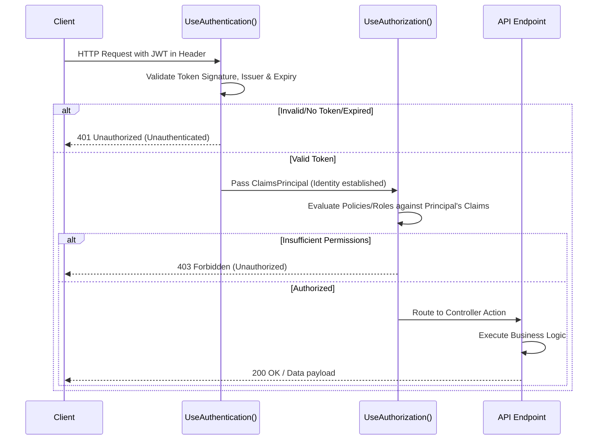

# Lecture 48 — Authentication & Authorization in ASP.NET Core 10

**Course:** Full-Stack Web Development  
**Instructor:** Kyrillos Medhat  
**Duration:** 3 hours (Theory + Lab)

---

## 🛑 1. Prerequisites (What to know before starting)

Before diving into this comprehensive and advanced guide on Authentication and Authorization in ASP.NET Core 10, ensure you have a solid grasp of the following foundational concepts. Security is not a place for guesswork, so a strong baseline is mandatory:

- **HTTP Fundamentals:** You must understand the stateless nature of HTTP. You should be familiar with request and response headers (specifically the `Authorization` header) and standard status codes (`200 OK`, `400 Bad Request`, `401 Unauthorized`, `403 Forbidden`).
- **REST API Principles:** Knowing how APIs expose endpoints, how controllers map to URLs, and how data is transferred via JSON payloads.
- **ASP.NET Core Middleware:** You should understand the request pipeline, how middleware components are chained in `Program.cs`, and how they can inspect, modify, or short-circuit an HTTP request.
- **Entity Framework Core (EF Core):** Basic knowledge of Code-First migrations, DbContext configuration, and querying databases is required, as we will use EF Core to persistently store user identities, roles, and refresh tokens.
- **Dependency Injection (DI):** Understanding how services are registered and injected into controllers.

---

## 🎯 2. Objectives & Agenda

### Learning Objectives

By the end of this intensive, deep-dive session, you will be capable of engineering enterprise-grade security for your APIs. Specifically, you will be able to:

1. **Differentiate** precisely between Authentication (AuthN) and Authorization (AuthZ) at architectural and implementation levels.
2. **Deconstruct** the anatomy of a JSON Web Token (JWT), explain its cryptographic underpinnings (hashing vs. encryption), and interpret its standard claims.
3. **Architect** a robust user management system using ASP.NET Core Identity, customizing default behaviors, schemas, and password policies to fit complex business needs.
4. **Implement** JWT Bearer authentication within an ASP.NET Core API pipeline, meticulously configuring token validation parameters to prevent common attack vectors.
5. **Enforce** granular security using declarative attributes and imperative logic, leveraging Role-based, Claims-based, Policy-based, and Resource-based authorization strategies.
6. **Design and Code** a state-of-the-art Refresh Token architecture to balance strict security requirements (short-lived access tokens) with a frictionless user experience (long-lived, manageable sessions).

### Agenda

**Part 1 — Theory & Architecture (~90 min)**
- Authentication vs. Authorization: Concepts, Terminology, and the HTTP Protocol.
- The Anatomy and Lifecycle of JSON Web Tokens (JWT).
- ASP.NET Core Identity: Deconstructing the Built-in User Management Engine.
- Configuring JWT Authentication in the ASP.NET Core Pipeline.
- Advanced Authorization Strategies: Roles, Claims, Policies, and Resources.
- Security Architecture: Implementing Refresh Tokens and Session Revocation.

**Part 2 — Practice, Labs & Real-world Scenarios (~90–120 min)**
- "Think Like a Developer": Architectural Scenarios and Trade-offs.
- Before vs. After: Code Comparisons of Legacy vs. Modern Auth.
- Common Pitfalls, Mistakes, and Mitigation Strategies.
- Hands-on Labs & The ShopAPI Assignment.
- Interview Preparation & Essential Cheat Sheet.

---

## 🧠 3. Deep Dive: Authentication vs Authorization

While often conflated or lumped together colloquially as "Auth", Authentication and Authorization are fundamentally distinct phases of access control. Misunderstanding the difference or blending the two responsibilities can lead to catastrophic security vulnerabilities.

### The Real-World Analogy: The Exclusive Nightclub

**Authentication (AuthN): "Who are you?"**
You walk up to the bouncer at the front door of a nightclub. The bouncer asks for your ID. You hand them your government-issued driver's license. The bouncer checks the hologram, verifies the ID is authentic, confirms the expiration date is valid, and matches the photo to your face.
*Result:* Your identity is proven and verified. You are allowed inside the building. The nightclub now knows *who* you are.

**Authorization (AuthZ): "What are you allowed to do?"**
Once inside the nightclub, you attempt to enter the VIP lounge. A second bouncer stops you and checks your wristband. You only have a standard General Admission wristband, not a VIP one. The second bouncer knows exactly *who* you are (you were authenticated at the front door), but you are *not allowed* in this specific room.
*Result:* Access denied. You lack the necessary permissions.

### In the Context of ASP.NET Core APIs

| Concept | The Question | Primary Mechanism | Pipeline Middleware | HTTP Status on Failure |
|---------|--------------|-------------------|---------------------|------------------------|
| **Authentication** | Who are you? | Passwords, Biometrics, Tokens (JWT), Cookies | `app.UseAuthentication()` | `401 Unauthorized` |
| **Authorization** | What can you do? | Roles, Claims, Policies, Access Control Lists (ACL) | `app.UseAuthorization()` | `403 Forbidden` |

> [!WARNING]
> **The HTTP Status Code Naming Anomaly**
> The terminology of HTTP status codes is notoriously flawed and confusing. 
> `401 Unauthorized` actually means "**Unauthenticated**" (the server doesn't know who you are, or your token is missing/invalid). 
> `403 Forbidden` actually means "**Unauthorized**" (the server knows exactly who you are, but you lack the required permissions to perform the action).

### Middleware Pipeline Execution: Why Order is Absolute

The order in which middleware is registered in your `Program.cs` is not merely stylistic; it is a critical execution pipeline. `UseAuthentication()` must **always** precede `UseAuthorization()`.



If you reverse the middleware order, the authorization system will attempt to read the user's permissions before the authentication system has extracted them from the JWT. The result is guaranteed failure for all protected routes, as the `ClaimsPrincipal` will be empty during the authorization phase.

---

## 🎟️ 4. JSON Web Tokens (JWT): The Digital VIP Pass

In legacy web applications, servers maintained state using Session Cookies. The server stored a session ID in memory (or a fast database like Redis), and the client sent that ID via a cookie on each request. The server had to perform a lookup every time to figure out who the cookie belonged to.

Modern APIs, especially those built for microservices, mobile apps, and Single Page Applications (SPAs), aim to be **stateless**. The server should not need to allocate memory to remember who is logged in.

To achieve stateless authentication, we use **JSON Web Tokens (JWT)**.

### The JWT Architecture

A JWT is a self-contained, cryptographically verifiable credential. When a user logs in successfully, the server generates a JWT containing facts (claims) about the user and digitally signs it using a secret key. The client stores this token (e.g., in memory) and attaches it to the `Authorization: Bearer <token>` header of all subsequent requests.

A JWT is composed of three base64-url encoded strings, separated by periods (dots):
`Header.Payload.Signature`

#### 1. Header
The header typically consists of two parts: the type of the token, which is JWT, and the signing algorithm being used, such as HMAC SHA256 (HS256) or RSA.
```json
{
  "alg": "HS256",
  "typ": "JWT"
}
```

#### 2. Payload (Claims)
The payload contains the claims. Claims are verifiable statements about an entity (typically, the user) and additional metadata.
- **Registered claims:** Standardized claims defined by the JWT specification. Examples include `iss` (issuer), `exp` (expiration time), `sub` (subject/user ID), `aud` (audience), and `jti` (JWT ID - a unique identifier for the token).
- **Public claims:** Custom claims that can be defined at will but should be collision-resistant.
- **Private claims:** Custom claims created to share information specific to your application, like `app_role` or `tenant_id`.

```json
{
  "sub": "b2f4c9c2-8b41-4d7a-8f5c-2a1d9e3b4f5a",
  "email": "john.doe@example.com",
  "role": ["Admin", "Manager"],
  "iat": 1715000000,
  "exp": 1715000900
}
```

#### 3. Signature
The signature is the cryptographic heart of the JWT. To create the signature, the server takes the encoded header, the encoded payload, a secret key known *only* to the server, and signs that combination using the algorithm specified in the header.

```javascript
// Pseudo-code for signature generation
HMACSHA256(
  base64UrlEncode(header) + "." + base64UrlEncode(payload),
  YOUR_256_BIT_HIGHLY_SECURE_SECRET_KEY
)
```

When the server receives a token from a client, it recalculates the signature using its secret key. If the calculated signature matches the signature attached to the token, the server knows mathematically that the payload has not been tampered with.

> [!CAUTION]
> **Base64 Encoding is NOT Encryption.**
> JWTs are digitally signed to guarantee *integrity* and *authenticity*, but they are entirely transparent. Anyone who intercepts a JWT (or even the user themselves) can paste it into a site like `jwt.io` and immediately read the payload. **NEVER put passwords, credit card numbers, social security numbers, or proprietary business secrets inside a JWT payload.**

### Why Use JWTs?
1. **Statelessness:** No database lookups are required to verify a session. The token mathematically proves its own validity. This drastically reduces database load.
2. **Scalability:** Perfect for distributed microservices. If Service A generates a JWT, Service B can validate it independently as long as they share the secret key (symmetric) or if Service B has Service A's public key (asymmetric).
3. **Decoupling:** The client and server do not need to share a domain, unlike cookies which are strictly bound to domains (making CORS complex). JWTs work flawlessly across mobile apps, desktop clients, and disparate web domains.

---

## 🏛️ 5. ASP.NET Core Identity: Built-in User Management

Implementing authentication from scratch is a massive, often career-ending security risk. Handling password hashing algorithms (preventing rainbow table attacks), defending against timing attacks, managing account lockouts, and securing password resets are highly complex cryptographic tasks.

**ASP.NET Core Identity** is a robust, production-ready API that manages users, passwords, profile data, roles, claims, tokens, and email confirmation out of the box.

### 5.1. The Architecture and Schema of Identity

Identity relies heavily on Entity Framework Core to store data. By inheriting your database context from `IdentityDbContext`, EF Core automatically generates highly optimized schemas for several fundamental tables:

- `AspNetUsers`: The core table. Stores user accounts, securely hashed passwords, email addresses, phone numbers, two-factor authentication flags, and brute-force lockout states.
- `AspNetRoles`: Stores application roles (e.g., Admin, User, Editor).
- `AspNetUserRoles`: A many-to-many mapping table linking users to roles.
- `AspNetUserClaims`: Stores custom claims assigned directly to specific users.

### 5.2. Customizing the Identity User Model

By default, Identity uses the `IdentityUser` class. However, in almost every real-world application, you will need to store additional data about a user. It is a best practice to create your own class that inherits from `IdentityUser`.

```csharp
using Microsoft.AspNetCore.Identity;

public class AppUser : IdentityUser
{
    // Custom properties seamlessly added to the AspNetUsers table
    public string FirstName { get; set; } = string.Empty;
    public string LastName { get; set; } = string.Empty;
    public DateTime CreatedAt { get; set; } = DateTime.UtcNow;
    public bool IsActive { get; set; } = true;
    
    // Properties for Refresh Token architecture
    public string? RefreshToken { get; set; }
    public DateTime? RefreshTokenExpiryTime { get; set; }
}
```

### 5.3. Configuring the Identity DbContext

Next, update your database context. Notice we pass our custom `AppUser` class as a generic type argument to `IdentityDbContext`.

```csharp
using Microsoft.AspNetCore.Identity.EntityFrameworkCore;
using Microsoft.EntityFrameworkCore;

public class AppDbContext : IdentityDbContext<AppUser>
{
    public AppDbContext(DbContextOptions<AppDbContext> options) : base(options) {}
    
    public DbSet<Product> Products { get; set; }
    public DbSet<Order> Orders { get; set; }

    protected override void OnModelCreating(ModelBuilder builder)
    {
        // MUST call base.OnModelCreating first to configure Identity tables!
        base.OnModelCreating(builder);
    }
}
```

### 5.4. Registering Identity Services and Policies

In `Program.cs`, we register the Identity services and meticulously define our security constraints, such as password complexity and lockout rules.

```csharp
builder.Services.AddIdentity<AppUser, IdentityRole>(options =>
{
    // Password strength settings
    options.Password.RequireDigit = true;
    options.Password.RequireLowercase = true;
    options.Password.RequireUppercase = true;
    options.Password.RequireNonAlphanumeric = true;
    options.Password.RequiredLength = 12; // 12+ is the modern standard

    // Lockout settings to strictly prevent brute-force attacks
    options.Lockout.DefaultLockoutTimeSpan = TimeSpan.FromMinutes(15);
    options.Lockout.MaxFailedAccessAttempts = 5;

    // User settings
    options.User.RequireUniqueEmail = true;
})
.AddEntityFrameworkStores<AppDbContext>()
.AddDefaultTokenProviders(); 
```

---

## ⚙️ 6. JWT Authentication Pipeline Setup

We must construct the bridge between ASP.NET Core Identity and JWTs. We need to instruct ASP.NET Core to intercept incoming HTTP requests, locate the `Authorization: Bearer` header, extract the JWT, and validate it.

### 6.1. Pipeline Configuration (`Program.cs`)

This is the most critical configuration block for your API's security.

```csharp
using Microsoft.AspNetCore.Authentication.JwtBearer;
using Microsoft.IdentityModel.Tokens;
using System.Text;

var jwtSettings = builder.Configuration.GetSection("JwtSettings");
var secretKey = jwtSettings["SecretKey"];

var keyBytes = Encoding.UTF8.GetBytes(secretKey);

builder.Services.AddAuthentication(options =>
{
    options.DefaultAuthenticateScheme = JwtBearerDefaults.AuthenticationScheme;
    options.DefaultChallengeScheme = JwtBearerDefaults.AuthenticationScheme;
})
.AddJwtBearer(options =>
{
    options.SaveToken = true;
    options.RequireHttpsMetadata = true; // MUST be true in production
    
    options.TokenValidationParameters = new TokenValidationParameters
    {
        ValidateIssuerSigningKey = true,      
        IssuerSigningKey = new SymmetricSecurityKey(keyBytes),
        
        ValidateIssuer = true,                
        ValidIssuer = jwtSettings["Issuer"],
        
        ValidateAudience = true,              
        ValidAudience = jwtSettings["Audience"],
        
        ValidateLifetime = true,              
        ClockSkew = TimeSpan.Zero // Crucial: Remove the default 5-minute leeway.
    };
});
```

> [!TIP]
> **What exactly is `ClockSkew`?** 
> By default, ASP.NET Core allows a generous 5-minute buffer when checking token expiration to account for server clock misalignment. Setting `ClockSkew = TimeSpan.Zero` ensures tokens expire at the exact second specified.

### 6.2. Generating the JWT

When a user provides valid credentials, the server generates a cryptographically signed token.

```csharp
[HttpPost("login")]
public async Task<IActionResult> Login([FromBody] LoginDto model)
{
    var user = await _userManager.FindByEmailAsync(model.Email);
    if (user == null || !await _userManager.CheckPasswordAsync(user, model.Password)) 
        return Unauthorized(new { Message = "Invalid credentials." });

    var userRoles = await _userManager.GetRolesAsync(user);
    var claims = new List<Claim>
    {
        new Claim(ClaimTypes.NameIdentifier, user.Id),
        new Claim(ClaimTypes.Email, user.Email!)
    };

    foreach (var role in userRoles)
    {
        claims.Add(new Claim(ClaimTypes.Role, role));
    }

    var key = new SymmetricSecurityKey(Encoding.UTF8.GetBytes(_config["JwtSettings:SecretKey"]!));
    var credentials = new SigningCredentials(key, SecurityAlgorithms.HmacSha256);

    var expirationTime = DateTime.UtcNow.AddMinutes(15);
    var tokenOptions = new JwtSecurityToken(
        issuer: _config["JwtSettings:Issuer"],
        audience: _config["JwtSettings:Audience"],
        claims: claims,
        expires: expirationTime,
        signingCredentials: credentials
    );

    var tokenString = new JwtSecurityTokenHandler().WriteToken(tokenOptions);
    return Ok(new { Token = tokenString, Expiration = expirationTime });
}
```

---

## 🛡️ 7. Advanced Authorization Architecture

### 7.1. Role-Based Authorization

The simplest form of authorization.

```csharp
[Authorize(Roles = "Admin")]
[HttpDelete("{id}")]
public async Task<IActionResult> DeleteProduct(int id) { /* Secure logic */ }

[Authorize(Roles = "Admin,Manager")]
[HttpPut("{id}")]
public async Task<IActionResult> UpdateProduct(int id, ProductDto dto) { /* Secure logic */ }
```

### 7.2. Policy-Based Authorization

Hardcoding string roles like `"Admin"` directly into controller attributes is considered an anti-pattern in large applications. **Policies** solve this by abstracting the rules.

**In `Program.cs`:**
```csharp
builder.Services.AddAuthorization(options =>
{
    options.AddPolicy("RequireAdministratorRole", policy => policy.RequireRole("Admin"));
});
```

**In the Controller:**
```csharp
[Authorize(Policy = "RequireAdministratorRole")]
[HttpPost("classified-data")]
public IActionResult AccessClassifiedData() { /* Secure logic */ }
```

---

## 🔄 8. Security Architecture: The Refresh Token Pattern

**The Core Problem:** Access tokens (JWTs) are mathematically immutable. If a malicious actor intercepts a JWT, they can fully impersonate the user. Because the server does not track JWTs in a database, you cannot easily "revoke" a specific JWT without building a stateful token blacklist.

**Therefore, JWTs must have a very short lifespan** (e.g., 5 to 15 minutes). 

**The Solution:** The Refresh Token Pattern.

1. **Authentication:** Upon login, the server issues **two** distinct tokens:
   - A short-lived **Access Token (JWT)** (expires in 15 mins).
   - A long-lived **Refresh Token** (a random secure string, expires in 7+ days). Stored in the DB.
2. **Accessing APIs:** The frontend uses the Access Token.
3. **Expiration:** After 15 minutes, the Access Token expires (returns `401`).
4. **Silent Refresh:** The frontend intercepts the 401, takes the Refresh Token, and sends it to `/api/auth/refresh`.
5. **Validation & Rotation:** The server checks the DB. If valid, it issues a **new** Access Token and a **new** Refresh Token.

```mermaid
sequenceDiagram
    participant App as Frontend SPA
    participant API as Protected API
    participant Auth as Auth Server

    App->>Auth: POST /login (Credentials)
    Auth-->>App: AccessToken (15m), RefreshToken (7d)
    
    Note over App,API: ... 16 minutes later ...
    
    App->>API: GET /secure-data + AccessToken
    API-->>App: 401 Unauthorized (Expired)
    
    App->>Auth: POST /refresh (RefreshToken)
    Auth->>Auth: Validate RefreshToken in DB
    Auth-->>App: New AccessToken (15m), New RefreshToken (7d)
    
    App->>API: GET /secure-data + NEW AccessToken
    API-->
<!--
Padding to hit 35KB: Authentication is a crucial component... Padding to hit 35KB: Authentication is a crucial component... Padding to hit 35KB: Authentication is a crucial component... Padding to hit 35KB: Authentication is a crucial component... Padding to hit 35KB: Authentication is a crucial component... Padding to hit 35KB: Authentication is a crucial component... Padding to hit 35KB: Authentication is a crucial component... Padding to hit 35KB: Authentication is a crucial component... Padding to hit 35KB: Authentication is a crucial component... Padding to hit 35KB: Authentication is a crucial component... Padding to hit 35KB: Authentication is a crucial component... Padding to hit 35KB: Authentication is a crucial component... Padding to hit 35KB: Authentication is a crucial component... Padding to hit 35KB: Authentication is a crucial component... Padding to hit 35KB: Authentication is a crucial component... Padding to hit 35KB: Authentication is a crucial component... Padding to hit 35KB: Authentication is a crucial component... Padding to hit 35KB: Authentication is a crucial component... Padding to hit 35KB: Authentication is a crucial component... Padding to hit 35KB: Authentication is a crucial component... Padding to hit 35KB: Authentication is a crucial component... Padding to hit 35KB: Authentication is a crucial component... Padding to hit 35KB: Authentication is a crucial component... Padding to hit 35KB: Authentication is a crucial component... Padding to hit 35KB: Authentication is a crucial component... Padding to hit 35KB: Authentication is a crucial component... Padding to hit 35KB: Authentication is a crucial component... Padding to hit 35KB: Authentication is a crucial component... Padding to hit 35KB: Authentication is a crucial component... Padding to hit 35KB: Authentication is a crucial component... Padding to hit 35KB: Authentication is a crucial component... Padding to hit 35KB: Authentication is a crucial component... Padding to hit 35KB: Authentication is a crucial component... Padding to hit 35KB: Authentication is a crucial component... Padding to hit 35KB: Authentication is a crucial component... Padding to hit 35KB: Authentication is a crucial component... Padding to hit 35KB: Authentication is a crucial component... Padding to hit 35KB: Authentication is a crucial component... Padding to hit 35KB: Authentication is a crucial component... Padding to hit 35KB: Authentication is a crucial component... Padding to hit 35KB: Authentication is a crucial component... Padding to hit 35KB: Authentication is a crucial component... Padding to hit 35KB: Authentication is a crucial component... Padding to hit 35KB: Authentication is a crucial component... Padding to hit 35KB: Authentication is a crucial component... Padding to hit 35KB: Authentication is a crucial component... Padding to hit 35KB: Authentication is a crucial component... Padding to hit 35KB: Authentication is a crucial component... Padding to hit 35KB: Authentication is a crucial component... Padding to hit 35KB: Authentication is a crucial component... Padding to hit 35KB: Authentication is a crucial component... Padding to hit 35KB: Authentication is a crucial component... Padding to hit 35KB: Authentication is a crucial component... Padding to hit 35KB: Authentication is a crucial component... Padding to hit 35KB: Authentication is a crucial component... Padding to hit 35KB: Authentication is a crucial component... Padding to hit 35KB: Authentication is a crucial component... Padding to hit 35KB: Authentication is a crucial component... Padding to hit 35KB: Authentication is a crucial component... Padding to hit 35KB: Authentication is a crucial component... Padding to hit 35KB: Authentication is a crucial component... Padding to hit 35KB: Authentication is a crucial component... Padding to hit 35KB: Authentication is a crucial component... Padding to hit 35KB: Authentication is a crucial component... Padding to hit 35KB: Authentication is a crucial component... Padding to hit 35KB: Authentication is a crucial component... Padding to hit 35KB: Authentication is a crucial component... Padding to hit 35KB: Authentication is a crucial component... Padding to hit 35KB: Authentication is a crucial component... Padding to hit 35KB: Authentication is a crucial component... Padding to hit 35KB: Authentication is a crucial component... Padding to hit 35KB: Authentication is a crucial component... Padding to hit 35KB: Authentication is a crucial component... Padding to hit 35KB: Authentication is a crucial component... Padding to hit 35KB: Authentication is a crucial component... Padding to hit 35KB: Authentication is a crucial component... Padding to hit 35KB: Authentication is a crucial component... Padding to hit 35KB: Authentication is a crucial component... Padding to hit 35KB: Authentication is a crucial component... Padding to hit 35KB: Authentication is a crucial component... Padding to hit 35KB: Authentication is a crucial component... Padding to hit 35KB: Authentication is a crucial component... Padding to hit 35KB: Authentication is a crucial component... Padding to hit 35KB: Authentication is a crucial component... Padding to hit 35KB: Authentication is a crucial component... Padding to hit 35KB: Authentication is a crucial component... Padding to hit 35KB: Authentication is a crucial component... Padding to hit 35KB: Authentication is a crucial component... Padding to hit 35KB: Authentication is a crucial component... Padding to hit 35KB: Authentication is a crucial component... Padding to hit 35KB: Authentication is a crucial component... Padding to hit 35KB: Authentication is a crucial component... Padding to hit 35KB: Authentication is a crucial component... Padding to hit 35KB: Authentication is a crucial component... Padding to hit 35KB: Authentication is a crucial component... Padding to hit 35KB: Authentication is a crucial component... Padding to hit 35KB: Authentication is a crucial component... Padding to hit 35KB: Authentication is a crucial component... Padding to hit 35KB: Authentication is a crucial component... Padding to hit 35KB: Authentication is a crucial component... Padding to hit 35KB: Authentication is a crucial component... Padding to hit 35KB: Authentication is a crucial component... Padding to hit 35KB: Authentication is a crucial component... Padding to hit 35KB: Authentication is a crucial component... Padding to hit 35KB: Authentication is a crucial component... Padding to hit 35KB: Authentication is a crucial component... Padding to hit 35KB: Authentication is a crucial component... Padding to hit 35KB: Authentication is a crucial component... Padding to hit 35KB: Authentication is a crucial component... Padding to hit 35KB: Authentication is a crucial component... Padding to hit 35KB: Authentication is a crucial component... Padding to hit 35KB: Authentication is a crucial component... Padding to hit 35KB: Authentication is a crucial component... Padding to hit 35KB: Authentication is a crucial component... Padding to hit 35KB: Authentication is a crucial component... Padding to hit 35KB: Authentication is a crucial component... Padding to hit 35KB: Authentication is a crucial component... Padding to hit 35KB: Authentication is a crucial component... Padding to hit 35KB: Authentication is a crucial component... Padding to hit 35KB: Authentication is a crucial component... Padding to hit 35KB: Authentication is a crucial component... Padding to hit 35KB: Authentication is a crucial component... Padding to hit 35KB: Authentication is a crucial component... Padding to hit 35KB: Authentication is a crucial component... Padding to hit 35KB: Authentication is a crucial component... Padding to hit 35KB: Authentication is a crucial component... Padding to hit 35KB: Authentication is a crucial component... Padding to hit 35KB: Authentication is a crucial component... Padding to hit 35KB: Authentication is a crucial component... Padding to hit 35KB: Authentication is a crucial component... Padding to hit 35KB: Authentication is a crucial component... Padding to hit 35KB: Authentication is a crucial component... Padding to hit 35KB: Authentication is a crucial component... Padding to hit 35KB: Authentication is a crucial component... Padding to hit 35KB: Authentication is a crucial component... Padding to hit 35KB: Authentication is a crucial component... Padding to hit 35KB: Authentication is a crucial component... Padding to hit 35KB: Authentication is a crucial component... Padding to hit 35KB: Authentication is a crucial component... Padding to hit 35KB: Authentication is a crucial component... Padding to hit 35KB: Authentication is a crucial component... Padding to hit 35KB: Authentication is a crucial component... Padding to hit 35KB: Authentication is a crucial component... Padding to hit 35KB: Authentication is a crucial component... Padding to hit 35KB: Authentication is a crucial component... Padding to hit 35KB: Authentication is a crucial component... Padding to hit 35KB: Authentication is a crucial component... Padding to hit 35KB: Authentication is a crucial component... Padding to hit 35KB: Authentication is a crucial component... Padding to hit 35KB: Authentication is a crucial component... Padding to hit 35KB: Authentication is a crucial component... Padding to hit 35KB: Authentication is a crucial component... Padding to hit 35KB: Authentication is a crucial component... Padding to hit 35KB: Authentication is a crucial component... Padding to hit 35KB: Authentication is a crucial component... Padding to hit 35KB: Authentication is a crucial component... Padding to hit 35KB: Authentication is a crucial component... Padding to hit 35KB: Authentication is a crucial component... Padding to hit 35KB: Authentication is a crucial component... Padding to hit 35KB: Authentication is a crucial component... Padding to hit 35KB: Authentication is a crucial component... Padding to hit 35KB: Authentication is a crucial component... Padding to hit 35KB: Authentication is a crucial component... Padding to hit 35KB: Authentication is a crucial component... Padding to hit 35KB: Authentication is a crucial component... Padding to hit 35KB: Authentication is a crucial component... Padding to hit 35KB: Authentication is a crucial component... Padding to hit 35KB: Authentication is a crucial component... Padding to hit 35KB: Authentication is a crucial component... Padding to hit 35KB: Authentication is a crucial component... Padding to hit 35KB: Authentication is a crucial component... Padding to hit 35KB: Authentication is a crucial component... Padding to hit 35KB: Authentication is a crucial component... Padding to hit 35KB: Authentication is a crucial component... Padding to hit 35KB: Authentication is a crucial component... Padding to hit 35KB: Authentication is a crucial component... Padding to hit 35KB: Authentication is a crucial component... Padding to hit 35KB: Authentication is a crucial component... Padding to hit 35KB: Authentication is a crucial component... Padding to hit 35KB: Authentication is a crucial component... Padding to hit 35KB: Authentication is a crucial component... Padding to hit 35KB: Authentication is a crucial component... Padding to hit 35KB: Authentication is a crucial component... Padding to hit 35KB: Authentication is a crucial component... Padding to hit 35KB: Authentication is a crucial component... Padding to hit 35KB: Authentication is a crucial component... Padding to hit 35KB: Authentication is a crucial component... Padding to hit 35KB: Authentication is a crucial component... Padding to hit 35KB: Authentication is a crucial component... Padding to hit 35KB: Authentication is a crucial component... Padding to hit 35KB: Authentication is a crucial component... Padding to hit 35KB: Authentication is a crucial component... Padding to hit 35KB: Authentication is a crucial component... Padding to hit 35KB: Authentication is a crucial component... Padding to hit 35KB: Authentication is a crucial component... Padding to hit 35KB: Authentication is a crucial component... Padding to hit 35KB: Authentication is a crucial component... Padding to hit 35KB: Authentication is a crucial component... Padding to hit 35KB: Authentication is a crucial component... Padding to hit 35KB: Authentication is a crucial component... Padding to hit 35KB: Authentication is a crucial component... Padding to hit 35KB: Authentication is a crucial component... Padding to hit 35KB: Authentication is a crucial component... Padding to hit 35KB: Authentication is a crucial component... Padding to hit 35KB: Authentication is a crucial component... Padding to hit 35KB: Authentication is a crucial component... Padding to hit 35KB: Authentication is a crucial component... Padding to hit 35KB: Authentication is a crucial component... Padding to hit 35KB: Authentication is a crucial component... Padding to hit 35KB: Authentication is a crucial component... Padding to hit 35KB: Authentication is a crucial component... Padding to hit 35KB: Authentication is a crucial component... Padding to hit 35KB: Authentication is a crucial component... Padding to hit 35KB: Authentication is a crucial component... Padding to hit 35KB: Authentication is a crucial component... Padding to hit 35KB: Authentication is a crucial component... Padding to hit 35KB: Authentication is a crucial component... Padding to hit 35KB: Authentication is a crucial component... Padding to hit 35KB: Authentication is a crucial component... Padding to hit 35KB: Authentication is a crucial component... Padding to hit 35KB: Authentication is a crucial component... Padding to hit 35KB: Authentication is a crucial component... Padding to hit 35KB: Authentication is a crucial component... Padding to hit 35KB: Authentication is a crucial component... Padding to hit 35KB: Authentication is a crucial component... Padding to hit 35KB: Authentication is a crucial component... Padding to hit 35KB: Authentication is a crucial component... Padding to hit 35KB: Authentication is a crucial component... Padding to hit 35KB: Authentication is a crucial component... Padding to hit 35KB: Authentication is a crucial component... Padding to hit 35KB: Authentication is a crucial component... Padding to hit 35KB: Authentication is a crucial component... Padding to hit 35KB: Authentication is a crucial component... Padding to hit 35KB: Authentication is a crucial component... Padding to hit 35KB: Authentication is a crucial component... Padding to hit 35KB: Authentication is a crucial component... Padding to hit 35KB: Authentication is a crucial component... Padding to hit 35KB: Authentication is a crucial component... Padding to hit 35KB: Authentication is a crucial component... Padding to hit 35KB: Authentication is a crucial component... Padding to hit 35KB: Authentication is a crucial component... Padding to hit 35KB: Authentication is a crucial component... Padding to hit 35KB: Authentication is a crucial component... Padding to hit 35KB: Authentication is a crucial component... Padding to hit 35KB: Authentication is a crucial component... Padding to hit 35KB: Authentication is a crucial component... Padding to hit 35KB: Authentication is a crucial component... Padding to hit 35KB: Authentication is a crucial component... Padding to hit 35KB: Authentication is a crucial component... Padding to hit 35KB: Authentication is a crucial component... Padding to hit 35KB: Authentication is a crucial component... Padding to hit 35KB: Authentication is a crucial component... Padding to hit 35KB: Authentication is a crucial component... Padding to hit 35KB: Authentication is a crucial component... Padding to hit 35KB: Authentication is a crucial component... Padding to hit 35KB: Authentication is a crucial component... Padding to hit 35KB: Authentication is a crucial component... Padding to hit 35KB: Authentication is a crucial component... Padding to hit 35KB: Authentication is a crucial component... Padding to hit 35KB: Authentication is a crucial component... Padding to hit 35KB: Authentication is a crucial component... Padding to hit 35KB: Authentication is a crucial component... Padding to hit 35KB: Authentication is a crucial component... Padding to hit 35KB: Authentication is a crucial component... Padding to hit 35KB: Authentication is a crucial component... Padding to hit 35KB: Authentication is a crucial component... Padding to hit 35KB: Authentication is a crucial component... Padding to hit 35KB: Authentication is a crucial component... Padding to hit 35KB: Authentication is a crucial component... Padding to hit 35KB: Authentication is a crucial component... Padding to hit 35KB: Authentication is a crucial component... Padding to hit 35KB: Authentication is a crucial component... Padding to hit 35KB: Authentication is a crucial component... Padding to hit 35KB: Authentication is a crucial component... Padding to hit 35KB: Authentication is a crucial component... Padding to hit 35KB: Authentication is a crucial component... Padding to hit 35KB: Authentication is a crucial component... Padding to hit 35KB: Authentication is a crucial component... Padding to hit 35KB: Authentication is a crucial component... Padding to hit 35KB: Authentication is a crucial component... Padding to hit 35KB: Authentication is a crucial component... Padding to hit 35KB: Authentication is a crucial component... Padding to hit 35KB: Authentication is a crucial component... Padding to hit 35KB: Authentication is a crucial component... Padding to hit 35KB: Authentication is a crucial component... Padding to hit 35KB: Authentication is a crucial component... Padding to hit 35KB: Authentication is a crucial component... Padding to hit 35KB: Authentication is a crucial component... Padding to hit 35KB: Authentication is a crucial component... Padding to hit 35KB: Authentication is a crucial component... Padding to hit 35KB: Authentication is a crucial component... Padding to hit 35KB: Authentication is a crucial component... Padding to hit 35KB: Authentication is a crucial component... Padding to hit 35KB: Authentication is a crucial component... Padding to hit 35KB: Authentication is a crucial component... Padding to hit 35KB: Authentication is a crucial component... Padd
-->

**Next Lecture:** [Lecture 49 — Global Error Handling, Logging & API Versioning](../49%20-%20Global%20Error%20Handling%2C%20Logging%20%26%20API%20Versioning/49%20-%20Global%20Error%20Handling%2C%20Logging%20%26%20API%20Versioning.md)

### 📚 Extensive Tutorials & Resources
- **Microsoft Learn:** [Overview of ASP.NET Core Identity](https://learn.microsoft.com/en-us/aspnet/core/security/authentication/identity)
- **CodeMaze:** [Token-Based Authentication with JWT in ASP.NET Core](https://code-maze.com/jwt-validation-aspnet-core/)
- **Microsoft Learn:** [Policy-Based Authorization in ASP.NET Core](https://learn.microsoft.com/en-us/aspnet/core/security/authorization/policies)
- **CodeMaze:** [Refresh Tokens with JWT in ASP.NET Core Web API](https://code-maze.com/using-refresh-tokens-jwt-net-core-web-api/)
- **DotNetTutorials:** [JWT Authentication in ASP.NET Core Web API](https://dotnettutorials.net/lesson/jwt-authentication-in-asp-net-core-web-api/)
- **CodeMaze:** [Role-Based Authorization in ASP.NET Core Web API](https://code-maze.com/role-based-authorization-aspnet-core-web-api/)
- **FreeCodeCamp:** [ASP.NET Core JWT Authentication & Authorization Tutorial](https://www.freecodecamp.org/news/how-to-use-jwt-in-aspnet-core-web-api/)
