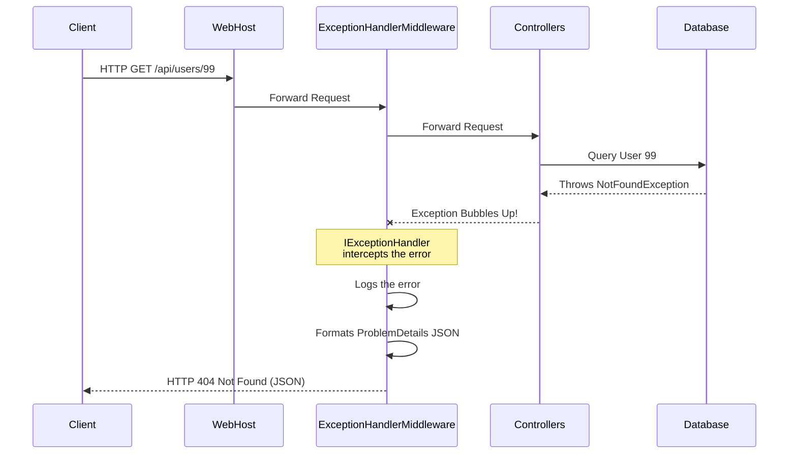

# Lecture 49 — Global Error Handling, Logging & API Versioning

**Course:** Full-Stack Web Development  
**Instructor:** Kyrillos Medhat  
**Duration:** 3 hours (Theory + Lab)

---

## 🛠️ Prerequisites

Before starting this lecture, you should be perfectly comfortable with the following concepts:
- **C# Exception Handling:** Deep understanding of `try`, `catch`, `finally`, `throw`, and `throw;`.
- **ASP.NET Core Middleware Pipeline:** Knowing how HTTP requests flow through the `_next()` pipeline and how responses bubble back up.
- **RESTful API Concepts:** Familiarity with standard HTTP status codes (200, 201, 204, 400, 401, 403, 404, 500, etc.).
- **Dependency Injection (DI):** Registering transient, scoped, and singleton services in ASP.NET Core via `Program.cs`.
- **JSON Serialization:** Understanding how C# objects are converted into JSON and vice versa.

---

## 🎯 Learning Objectives

By the end of this comprehensive lecture, you will be able to:
- Implement robust **Global Exception Handling** in ASP.NET Core 8+ using the modern `IExceptionHandler` interface, removing the need for messy controller-level `try-catch` blocks.
- Standardize and unify API error responses using the official **ProblemDetails** format (RFC 9457), ensuring a predictable contract with frontend and mobile clients.
- Master **Structured Logging** concepts and clearly differentiate them from legacy unstructured text logs.
- Integrate **Serilog** for enterprise-grade, professional logging, routing logs simultaneously to the Console, Rolling Files, and remote centralized servers (like Seq or Datadog).
- Architect robust **API Versioning** using `Asp.Versioning` to gracefully introduce breaking changes, ensuring backward compatibility for legacy clients.

---

## 📋 Agenda

### Part 1 — Theory & Deep Dive (~90 min)
1. **The Evolution of Error Handling:** From `try-catch` to Middleware, to `IExceptionHandler`.
2. **The ProblemDetails Standard:** Unifying error formats across the web (RFC 9457).
3. **Logging Fundamentals & Structured Logging:** Writing semantic, searchable log data.
4. **Advanced Logging Architectures with Serilog:** Industry-standard log routing and enrichment.
5. **API Versioning Strategies:** URL Segmentation, Query Strings, and HTTP Header versioning.

### Part 2 — Practice / Lab (~90–120 min)
1. Implement `IExceptionHandler` mapped with custom domain exceptions.
2. Integrate and comprehensively configure Serilog with multiple Sinks.
3. Add multi-strategy versioning to an existing Web API.
4. **ShopAPI Project Part 5:** Overhauling Errors, Logs, and Versions in our capstone project.

---

## 1. Global Exception Handling: The Safety Net

### The 'Why': The Real-World Circus Analogy

Imagine you are watching a trapeze artist at the circus. Occasionally, the artist might slip. Without a safety net, they crash into the ground, and the show stops in panic. In software terms, this is what happens when your API crashes and returns a raw HTML stack trace (or worse, drops the TCP connection) to the consumer. The consumer (a mobile app, an IoT device, or a Single Page Application) crashes because it has no idea how to gracefully parse or handle a raw HTML stack trace.

If you install a safety net underneath the *entire* circus tent, it doesn't matter where the acrobat falls. The net catches them gracefully. The announcer calmly informs the audience of a slight delay, and the show continues. 

In software terms, your API intercepts the unhandled exception at the highest level, securely logs the raw stack trace for your developers, and returns a polite, structurally formatted JSON error message to the client.

In ASP.NET Core 8+, the modern safety net is the `IExceptionHandler` interface. It replaces the older, clunky approaches like custom Exception Middleware or MVC Exception Filters.

### 🔄 Before vs After: Error Handling Evolution

#### ❌ The "Before" (Legacy Middleware Approach - Do Not Use in Modern .NET)
In older .NET Core versions (3.1, 5, 6), developers had to write raw custom middleware to catch errors. This required manual stream manipulation, setting raw content types, and manually serializing objects. It was verbose and error-prone.

```csharp
// Legacy Middleware Approach (Anti-Pattern in .NET 8+)
public class ErrorHandlingMiddleware
{
    private readonly RequestDelegate _next;
    private readonly ILogger<ErrorHandlingMiddleware> _logger;

    public ErrorHandlingMiddleware(RequestDelegate next, ILogger<ErrorHandlingMiddleware> logger) 
    { 
        _next = next; 
        _logger = logger;
    }

    public async Task Invoke(HttpContext context)
    {
        try
        {
            // Proceed to the next middleware (Controllers, etc.)
            await _next(context);
        }
        catch (Exception ex)
        {
            _logger.LogError(ex, "An unhandled exception occurred.");
            context.Response.StatusCode = 500;
            context.Response.ContentType = "application/json";
            
            // Manual serialization - very clunky!
            var result = JsonSerializer.Serialize(new { error = "An unexpected error occurred.", details = ex.Message });
            await context.Response.WriteAsync(result);
        }
    }
}
```

#### ✅ The "After" (Modern .NET 8+ IExceptionHandler)
.NET 8 introduced a native interface specifically optimized for handling exceptions cleanly. It integrates perfectly with the framework's internal error routing.

### Architecture Workflow Diagram

Let's visualize where the `ExceptionHandlerMiddleware` sits in the request pipeline.



### Step 1: Create Custom Domain Exceptions

First, we create specific C# exceptions to cleanly represent business logic errors. This allows our global handler to differentiate between a client error (e.g., entity not found) and a true server crash (e.g., database connection timeout).

```csharp
namespace ShopAPI.Domain.Exceptions;

// Base class for our domain exceptions (Optional but recommended)
public abstract class DomainException : Exception
{
    protected DomainException(string message) : base(message) {}
}

// Thrown when an entity is not found in the database (Maps to 404)
public class EntityNotFoundException : DomainException
{
    public EntityNotFoundException(string entityName, object key) 
        : base($"{entityName} with key '{key}' was not found.") {}
}

// Thrown when business validation fails (Maps to 400)
public class ValidationException : DomainException
{
    public ValidationException(string message) : base(message) {}
}

// Thrown when a user lacks permissions (Maps to 403)
public class ForbiddenAccessException : DomainException
{
    public ForbiddenAccessException(string message) : base(message) {}
}
```

### Step 2: Implement `IExceptionHandler`

Now we create the class that will intercept *any* unhandled exception thrown in our application.

```csharp
using Microsoft.AspNetCore.Diagnostics;
using Microsoft.AspNetCore.Mvc;
using ShopAPI.Domain.Exceptions;

namespace ShopAPI.Infrastructure.Errors;

public class GlobalExceptionHandler : IExceptionHandler
{
    private readonly ILogger<GlobalExceptionHandler> _logger;

    public GlobalExceptionHandler(ILogger<GlobalExceptionHandler> logger)
    {
        _logger = logger;
    }

    public async ValueTask<bool> TryHandleAsync(
        HttpContext context, 
        Exception exception, 
        CancellationToken cancellationToken)
    {
        // 1. Log the exact error for the developers. 
        // We log the full exception object so the stack trace is preserved in our logs.
        _logger.LogError(
            exception, 
            "An unhandled exception occurred during request processing: {Message}", 
            exception.Message);

        // 2. Map the Exception type to the correct HTTP Status Code
        var statusCode = exception switch
        {
            EntityNotFoundException => StatusCodes.Status404NotFound,
            ValidationException => StatusCodes.Status400BadRequest,
            ForbiddenAccessException => StatusCodes.Status403Forbidden,
            UnauthorizedAccessException => StatusCodes.Status401Unauthorized,
            // Fallback for real crashes (NullReferenceException, SqlException, etc.)
            _ => StatusCodes.Status500InternalServerError 
        };

        // 3. Set the response status code
        context.Response.StatusCode = statusCode;
        
        // 4. We will integrate ProblemDetails in the next section.
        // For now, we could return a simple anonymous object:
        var response = new { error = exception.Message };
        await context.Response.WriteAsJsonAsync(response, cancellationToken);
        
        // 5. Return true to signify we handled the exception and execution should stop propagating
        return true; 
    }
}
```

### Step 3: Register in `Program.cs`

Wiring this up in .NET 8 is beautifully simple.

```csharp
// --- 1. Register the handler in the DI container ---
builder.Services.AddExceptionHandler<GlobalExceptionHandler>();

var app = builder.Build();

// --- 2. Add it to the middleware pipeline ---
// WARNING: Place this as early in the pipeline as possible so it wraps everything else!
app.UseExceptionHandler(); 
```

> [!IMPORTANT]  
> Order strictly matters in `Program.cs`. `app.UseExceptionHandler()` must be one of the very first middleware components you register (usually right after `app.UseForwardedHeaders()` or `app.UseSerilogRequestLogging()`) so it can catch exceptions thrown by routing, authentication, authorization, and your controllers.

---

## 2. The ProblemDetails Standard (RFC 9457)

### The 'Why': Ending the Chaos of Unified Error Formats

In the wild west of early web APIs, every company invented its own error format:
- **GitHub** returned: `{ "message": "Not Found", "documentation_url": "..." }`
- **Twitter/X** returned: `{ "errors": [{ "code": 34, "message": "Sorry, that page does not exist." }] }`
- **Stripe** returned: `{ "error": { "type": "invalid_request_error", "message": "..." } }`
- Your bespoke API probably returned: `{ "errorText": "..." }`

This chaos forced frontend (React, Angular) and mobile (iOS, Android) developers to write custom error-parsing logic for every single API they integrated. To permanently solve this, the Internet Engineering Task Force (IETF) published **RFC 9457** (which obsoletes RFC 7807). 

This RFC defines a standard JSON format for API errors known as **Problem Details for HTTP APIs**.

### Expanding Our Global Handler with Problem Details

Let's modify our `GlobalExceptionHandler` to return this strictly standardized JSON structure. We will utilize the `ProblemDetails` class built into ASP.NET Core.

```csharp
public async ValueTask<bool> TryHandleAsync(
    HttpContext context, 
    Exception exception, 
    CancellationToken cancellationToken)
{
    // ... [Logging logic remains the same] ...

    // Pattern matching to extract both Status Code and a Human-Readable Title
    var (statusCode, title) = exception switch
    {
        EntityNotFoundException => (StatusCodes.Status404NotFound, "Resource Not Found"),
        ValidationException => (StatusCodes.Status400BadRequest, "Bad Request"),
        ForbiddenAccessException => (StatusCodes.Status403Forbidden, "Forbidden Access"),
        _ => (StatusCodes.Status500InternalServerError, "Internal Server Error")
    };

    context.Response.StatusCode = statusCode;

    // Determine if we should show the raw exception message to the client.
    // SECURITY WARNING: Never show raw exception messages for 500 errors in production!
    // They might leak database connection strings or SQL queries.
    string detailMessage = statusCode == 500 
        ? "An unexpected error occurred. Please contact support." 
        : exception.Message;

    // Create the standard ProblemDetails object
    var problemDetails = new ProblemDetails
    {
        Status = statusCode,
        Title = title,
        Detail = detailMessage,
        Type = $"https://httpstatuses.com/{statusCode}", // Standard URI identifying the problem type
        Instance = context.Request.Path // Helps trace exactly which endpoint failed
    };

    // Extensions allow you to add custom properties to the JSON output!
    problemDetails.Extensions.Add("timestamp", DateTime.UtcNow);

    // Write the JSON to the response payload
    await context.Response.WriteAsJsonAsync(problemDetails, cancellationToken);

    return true; // We successfully handled it
}
```

### Example ProblemDetails Response Payload

If a client executes `GET /api/users/99` and the service layer throws an `EntityNotFoundException("User", 99)`, the API returns:

```json
{
  "type": "https://httpstatuses.com/404",
  "title": "Resource Not Found",
  "status": 404,
  "detail": "User with key '99' was not found.",
  "instance": "/api/users/99",
  "traceId": "00-2d83ab9f9fa9d7b9736c0d83cf4b5e00-8b1e4c7d0e413000-01",
  "timestamp": "2024-11-20T14:32:01.123Z"
}
```

> [!NOTE]  
> The `traceId` property is automatically injected by ASP.NET Core when you call `builder.Services.AddProblemDetails();` in `Program.cs`. This specific ID is absolutely invaluable for finding the exact error stack trace in your distributed logging system (like Application Insights or Datadog). You can ask the user, "Please give me the traceId you see on your screen," and find the exact log instantly.

---

## 3. Logging Fundamentals & Structured Logging

### The 'Why': Deep Observability

When your API is running in production, you cannot simply attach a Visual Studio debugger to it. It might be running across 10 different Docker containers in a Kubernetes cluster on AWS. 

Logs are your *only* window into what the application is actively doing. Excellent logging is the difference between resolving a critical production bug in 5 minutes versus agonizing over it for 5 days.

### Log Severity Levels

Not all logs are created equal. ASP.NET Core standardizes several severity levels. You must choose the right level for the right event.

1. **Trace (0):** Extremely detailed, high-volume logs containing sensitive data. Only used locally during deep debugging. Never enabled in production.
2. **Debug (1):** Information strictly useful for development and debugging workflows. 
3. **Information (2):** Tracking the general, expected flow of the application (e.g., "User logged in", "Payment processed", "Order created").
4. **Warning (3):** Abnormal or unexpected events, but the application safely recovered (e.g., "Retrying database connection", "Disk space at 85%", "API rate limit approaching").
5. **Error (4):** A specific operation failed, but the application as a whole is still running perfectly fine (e.g., "Failed to send welcome email to User X", "Database record not found").
6. **Critical (5):** A catastrophic failure that requires a developer to be woken up at 3 AM (e.g., "Main SQL database is offline", "Out of Memory Exception", "Payment gateway is completely unreachable").

### 🧠 Think Like a Developer: Unstructured vs. Structured Logging

**Scenario:** You have a bug where a specific user (`UserId = 54321`) is failing to log in, but thousands of other users are logging in fine. You need to search your logs across the last 30 days to see every attempt they made.

#### ❌ Unstructured Logging (The Legacy Method)

Unstructured logging treats log entries as flat, baked strings.

```csharp
int userId = 54321;
string ip = "192.168.1.5";

// BAD: String Interpolation bakes the data into the message forever
_logger.LogWarning($"User {userId} failed to login from IP {ip}.");
```

**Why it is a nightmare:** The logging system stores the literal string `"User 54321 failed to login from IP 192.168.1.5."`. 
To find this in a central log server (like Datadog, Splunk, or ElasticSearch), you have to write complex, slow Regex statements to extract the User ID. Furthermore, because every log string is unique (due to different IP addresses and User IDs), the log server cannot index them efficiently.

#### ✅ Structured Logging (The Modern Standard)

Structured logging treats logs as JSON-like data structures where the message template and the variable data are kept entirely separate.

```csharp
int userId = 54321;
string ip = "192.168.1.5";

// GOOD: Message Template with variable Placeholders
_logger.LogWarning("User {UserId} failed to login from IP {IpAddress}.", userId, ip);
```

**Why it is brilliant:** The logging system stores the static template `"User {UserId} failed to login from IP {IpAddress}."` AND a dictionary of strongly-typed properties: `{ "UserId": 54321, "IpAddress": "192.168.1.5" }`. 

In your logging dashboard, you don't search for text. You execute SQL-like queries against the properties:
`SELECT * FROM Logs WHERE Level = 'Warning' AND Properties.UserId = 54321`

This is exponentially faster, cleaner, and allows for powerful metric aggregation (e.g., "Count how many times `UserId = 54321` failed to login grouped by `IpAddress`").

---

## 4. Advanced Logging Architectures with Serilog

The built-in ASP.NET Core `ILogger` implementation is merely a facade. By default, it writes to the Console output. This is completely useless once you deploy your application to a Linux server or a cloud provider because the console output disappears when the terminal closes.

**Serilog** is the undisputed industry standard logging provider for .NET ecosystems. It specializes entirely in Structured Logging and can route your logs to dozens of destinations (referred to as "Sinks"), such as Text Files, SQL Server, Elasticsearch, Azure Application Insights, Datadog, or Seq.

### Step 1: Installation via NuGet

```bash
dotnet add package Serilog.AspNetCore
# Optional: Add specific sinks if you want to route logs to specialized systems
# dotnet add package Serilog.Sinks.Seq
# dotnet add package Serilog.Sinks.Async
```

### Step 2: Bootstrapping Configuration in `Program.cs`

We want to replace the default ASP.NET logger completely with Serilog *before* the web application even builds. Why? So we can catch and log application startup crashes (like a missing `appsettings.json` or a bad DI configuration).

```csharp
using Serilog;
using Serilog.Events;

// 1. Create the Bootstrap Logger immediately
Log.Logger = new LoggerConfiguration()
    // Define the absolute minimum log level we care about
    .MinimumLevel.Information()
    // Override Microsoft's extremely noisy internal logs. 
    // We only want to see Warning or higher from the ASP.NET framework itself.
    .MinimumLevel.Override("Microsoft.AspNetCore", LogEventLevel.Warning) 
    
    // Enrich logs with contextual data (ThreadId, Environment, MachineName)
    .Enrich.FromLogContext() 
    .Enrich.WithMachineName()
    
    // Sink 1: Write to the Console with a beautiful, readable template
    .WriteTo.Console(outputTemplate: 
        "[{Timestamp:HH:mm:ss} {Level:u3}] {Message:lj} {Properties:j}{NewLine}{Exception}")
        
    // Sink 2: Write to a rolling text file on the server's hard drive
    // RollingInterval.Day creates a brand new file at midnight every day
    .WriteTo.File("logs/shopapi-log-.txt", 
        rollingInterval: RollingInterval.Day,
        retainedFileCountLimit: 30) // Automatically delete logs older than 30 days
        
    // (Optional) Sink 3: Write to a centralized log server like Seq for production
    // .WriteTo.Seq("http://localhost:5341")
    
    .CreateLogger();

try
{
    // Now we know this will definitely be logged, even if the app crashes instantly!
    Log.Information("Starting up the Shop API Web Host...");
    
    var builder = WebApplication.CreateBuilder(args);
    
    // 2. Tell ASP.NET Core to completely replace its internal logger with Serilog
    builder.Host.UseSerilog(); 
    
    // ... Register all your standard services (Controllers, DB Contexts, etc.) ...
    
    var app = builder.Build();

    // 3. Add Serilog Request Logging middleware
    // This MUST be placed early in the pipeline, usually right after UseRouting.
    app.UseSerilogRequestLogging(); 

    // ... Register other middleware (Auth, Controllers) ...

    app.Run();
}
catch (Exception ex)
{
    // Catch startup errors that would otherwise kill the app silently
    Log.Fatal(ex, "The application experienced a fatal crash during startup.");
}
finally
{
    // Ensure all pending logs are flushed from memory to the hard drive before the app exits
    Log.CloseAndFlush();
}
```

### The Magic Power of `UseSerilogRequestLogging()`

By default, ASP.NET Core logs about 4 to 6 lines of text for *every single HTTP request*.
1. "Executing endpoint..."
2. "Route matched..."
3. "Executing controller..."
4. "Executed controller..."
5. "Executed endpoint..."

If you have 100 users, your logs become unreadable garbage. 

`app.UseSerilogRequestLogging()` suppresses all of that built-in noise and condenses the entire HTTP request lifecycle into a **single, highly structured, beautiful log line** containing the HTTP method, Path, Status Code, and Elapsed Time.

Example Output:
`[14:32:01 INF] HTTP GET /api/users/99 responded 404 in 14.2345 ms`

---

## 5. API Versioning: Handling Change Without Breaking Clients

### The 'Why': The Grocery Store Analogy

Imagine your favorite grocery store suddenly rearranges all the aisles overnight. You walk in to buy milk, and the dairy section is now entirely filled with automotive parts. You are frustrated, confused, and your morning routine is broken. 

If the store instead opened a secondary "V2" door that led to the new layout, while strictly keeping the "V1" door open for a few months, you could slowly adjust your routine at your own pace without going hungry.

When you build a public web API, mobile apps (iOS/Android), partner websites, and IoT devices rely on your exact, precise JSON structure. If you decide to rename a property from `firstName` to `givenName`, or change an `Id` from an integer to a GUID, you introduce a **breaking change**. Mobile apps that haven't downloaded the latest update from the App Store will instantly crash when they try to parse the new JSON. 

**API Versioning** allows you to iteratively evolve your API, add new features, and change structures while explicitly maintaining support for older, legacy clients.

### Step 1: Installation via NuGet

```bash
# Core API Versioning logic
dotnet add package Asp.Versioning.Mvc

# Required if you want Swagger/OpenAPI to understand your multiple versions
dotnet add package Asp.Versioning.Mvc.ApiExplorer 
```

### Step 2: Configure Versioning in `Program.cs`

```csharp
builder.Services.AddApiVersioning(options =>
{
    // If a client doesn't explicitly specify a version, what do they get?
    options.AssumeDefaultVersionWhenUnspecified = true;
    options.DefaultApiVersion = new ApiVersion(1, 0); // Default to v1.0
    
    // Automatically adds an "api-supported-versions" header to the HTTP response
    // Tells clients "Hey, v2.0 is available if you want it!"
    options.ReportApiVersions = true; 
    
    // How will clients request a specific version? 
    // We can combine multiple strategies so clients have choices.
    options.ApiVersionReader = ApiVersionReader.Combine(
        new UrlSegmentApiVersionReader(),        // /api/v1/users
        new QueryStringApiVersionReader("v"),    // /api/users?v=1.0
        new HeaderApiVersionReader("X-Version")  // Header: X-Version: 1.0
    );
}).AddApiExplorer(options => 
{
    // Format the version as "'v'major[.minor]" (e.g. 'v1' or 'v1.1') for Swagger
    options.GroupNameFormat = "'v'VVV"; 
    options.SubstituteApiVersionInUrl = true;
});
```

### Step 3: Implement Versioning in Your Controllers

Let's assume our legacy V1 API returns a single `FullName` string, but our new business requirements demand that V2 must return separated `FirstName` and `LastName` fields.

```csharp
using Asp.Versioning;
using Microsoft.AspNetCore.Mvc;

[ApiController]
// Declare which versions this controller technically supports
[ApiVersion("1.0", Deprecated = true)] // Mark V1 as deprecated so clients know to migrate!
[ApiVersion("2.0")]

// The URL routing strictly requires a version segment
[Route("api/v{version:apiVersion}/customers")] 
public class CustomersController : ControllerBase 
{
    // GET: /api/v1/customers
    [HttpGet]
    [MapToApiVersion("1.0")] // Explicitly binds this action to v1.0
    public ActionResult GetV1() 
    { 
        // Legacy format
        return Ok(new { FullName = "John Doe" }); 
    }

    // GET: /api/v2/customers
    [HttpGet]
    [MapToApiVersion("2.0")] // Explicitly binds this action to v2.0
    public ActionResult GetV2() 
    { 
        // Modern format
        return Ok(new { FirstName = "John", LastName = "Doe" }); 
    }
}
```

### 🧠 Think Like an Architect: Which Versioning Strategy is Best?

There are three predominant ways to handle API versioning in the industry. As a senior developer, you must know the trade-offs of each.

1. **URL Path Segment (`/api/v1/resource`)**:
   - *Pros:* Extremely explicit. Unambiguous. Easy to see in browser address bars, proxy logs, and analytics. Easiest to route in load balancers (like AWS ALB or Nginx).
   - *Cons:* Technically violates strict REST principles (a URI should theoretically represent a resource, not a version of a resource).
   - *Verdict:* The most popular, pragmatic, and widely adopted approach in the industry (used by Twitter, Stripe, Twilio). **Highly recommended.**

2. **Query String (`/api/resource?v=1.0`)**:
   - *Pros:* Keeps the base URL clean and resource-focused.
   - *Cons:* Very easy for clients to forget to include the query string. Can complicate caching mechanisms (CDNs might cache the default version improperly).
   - *Verdict:* Good for internal APIs, but often messy for public-facing ones.

3. **Custom HTTP Header (`X-Api-Version: 1.0` or `Accept: application/vnd.myapi.v1+json`)**:
   - *Pros:* The purest, most theoretically correct REST approach. URLs remain completely pristine and stable forever.
   - *Cons:* Extremely hard to test and debug (you cannot simply share a URL in Slack or click a link in a browser; you must use Postman or cURL to manually inject HTTP headers). Harder to see in basic server logs.
   - *Verdict:* Preferred by architectural purists, but often loathed by frontend developers who have to consume it.

---

## 🛑 Common Mistakes & How to Avoid Them

| ❌ The Mistake | 💥 The Consequence | ✅ The Expert Fix |
|----------------|--------------------|-------------------|
| Using `try-catch` inside every single controller method to return 500s. | Massive code duplication. Inconsistent error responses across different controllers. | Use `IExceptionHandler` globally. Only use `try-catch` locally if you plan to dynamically recover from the error (e.g., catching a timeout to trigger a retry algorithm). |
| Using string interpolation (`$""`) in `ILogger` methods. | Ruins structured logging. Fills your log database with millions of unique message templates, making aggregation and searching virtually impossible. | Always use Structured Logging templates: `Log("{UserId}", id)`. Never bake variables directly into the string. |
| Logging sensitive PII or Application Secrets. | User Passwords, SSNs, OAuth Tokens, or credit cards end up in Splunk/Datadog, violating GDPR/HIPAA/PCI compliance, leading to massive lawsuits. | Never log secrets. Implement Serilog Destructuring policies to automatically mask or redact sensitive fields before they leave the application. |
| Making structural breaking changes without bumping the API version. | Mobile clients instantly crash because they expect a property that no longer exists. Your App Store ratings plummet to 1-star. | If you rename a property, change a primitive type (e.g., int to string), or remove a field entirely, you **MUST** create a V2 endpoint. (Note: *Adding* new fields is generally safe and non-breaking). |
| Swallowing Exceptions silently. (`catch(Exception) { }` with no logging). | Silent, invisible failures. Bugs happen but leave absolutely zero trace in the logs. You will never know the app is failing. | Always log the exception if you catch it. If you need to rethrow it up the chain, use `throw;` **NOT** `throw ex;` to preserve the original stack trace. |

---

## 🧪 Practice Labs

### Lab 1 — Implementing the Safety Net (45 min)
1. Create a new ASP.NET Core Web API project. Create a folder named `Exceptions`.
2. Create two custom exceptions: `EntityNotFoundException` and `ValidationException`.
3. Create a `GlobalExceptionHandler` class implementing the `IExceptionHandler` interface.
4. Write logic inside `TryHandleAsync` to intercept your custom exceptions and map them to a `ProblemDetails` object with the appropriate 404 or 400 HTTP status code.
5. Map all other unknown exceptions (e.g., `DivideByZeroException`) to a 500 Internal Server Error.
6. Register the handler and `ProblemDetails` in `Program.cs`.
7. **Testing:** Create a dummy `[HttpGet("test-error")]` endpoint that manually throws an `EntityNotFoundException`. Test it via Swagger and verify the JSON matches the strict ProblemDetails standard and includes a `traceId`.

### Lab 2 — The Serilog Upgrade (30 min)
1. Install the `Serilog.AspNetCore` NuGet package.
2. In `Program.cs`, set up the `LoggerConfiguration` to log to both the Console and a rolling File (e.g., `logs/api-log-.txt`).
3. Replace the default host logger with `builder.Host.UseSerilog()`.
4. Add `app.UseSerilogRequestLogging()` immediately after your routing middleware.
5. Inject `ILogger<HomeController>` into a controller. Write a structured log: `_logger.LogInformation("Processing item {ItemId} for User {UserId}", 42, 999);`.
6. **Testing:** Make several requests in Swagger. Check your terminal output to witness the clean, condensed request logs. Open the generated text file in the `/logs` directory to see the persisted file logs.

### Lab 3 — Versioning an Endpoint (30 min)
1. Install `Asp.Versioning.Mvc`.
2. Configure `AddApiVersioning` in `Program.cs` to exclusively use the `UrlSegmentApiVersionReader`.
3. Create a `WeatherForecastController`. Decorate the class with `[ApiVersion("1.0")]` and `[ApiVersion("2.0")]`.
4. Define the route as `[Route("api/v{version:apiVersion}/weather")]`.
5. Create a V1 GET endpoint that returns `{ temperatureC: 25 }`.
6. Create a V2 GET endpoint that returns `{ temperatureCelsius: 25, temperatureFahrenheit: 77 }`.
7. **Testing:** Call both endpoints via your browser or Postman (`/api/v1/weather` and `/api/v2/weather`) and verify the routing flawlessly directs you to the correct method.

---

## 📝 Assignment: ShopAPI Project — Part 5

It is time to elevate our ongoing ShopAPI project to production-ready status by implementing proper observability and error resilience.

### Strict Requirements
1. **Refactor Errors:** Completely delete any custom Error Handling Middleware classes you wrote in previous parts of the course.
2. **Global Handler:** Create a modern `GlobalExceptionHandler` class implementing `IExceptionHandler`.
3. **Problem Details:** Configure the handler to return standard `ProblemDetails` JSON responses for absolutely all errors.
4. **Domain Exceptions:** Refactor your Application Services. Throw your custom `NotFoundException` from your Services when a database entity isn't found. Stop returning `null`! Let the global handler catch the exception and automatically return a 404 to the client.
5. **Serilog Integration:** Install Serilog. Configure it in `Program.cs` to write to the Console (with a clean custom template) and a rolling daily file named `shopapi-log-.txt`.
6. **Request Logging:** Add `UseSerilogRequestLogging()` to your pipeline to automatically log all incoming HTTP requests and their exact response times.
7. **Versioning Prep:** Add `Asp.Versioning.Mvc`, configure the default API versioning to `1.0`, and update your base `ApiController` to use the `api/v{v:apiVersion}/[controller]` route template across the entire project.

---

## 🎤 Interview Prep (Top 5 Questions)

**Q1: What is the fundamental difference between `throw ex;` and `throw;` in C#?**
*Expert Answer:* `throw ex;` resets the stack trace to the exact line where the `catch` block is located, completely destroying the history of where the exception originally occurred. `throw;` preserves the original, complete stack trace, making debugging exponentially easier. You should almost always use `throw;` unless you intentionally want to hide the original stack trace.

**Q2: Why should we use Structured Logging instead of string interpolation for our logs?**
*Expert Answer:* String interpolation bakes variable values directly into the final log message string. This creates millions of completely unique log strings, making it impossible to query, group, or aggregate logs effectively in centralized logging systems like Splunk, Datadog, or Elasticsearch. Structured logging keeps the message template and variables entirely separate, allowing you to query logs exactly like a relational database (e.g., `WHERE UserId == 123`).

**Q3: What is the Problem Details standard (RFC 9457) and why do we use it?**
*Expert Answer:* It is a standardized JSON format for returning HTTP errors from APIs. It defines standard fields like `type`, `title`, `status`, `detail`, and `instance`. Adopting this standard means frontend and mobile developers don't have to write custom, brittle parsing logic for every different API they consume; they can rely on a single, predictable structure.

**Q4: How do you gracefully handle a breaking change in a public API?**
*Expert Answer:* You handle breaking changes through explicit API Versioning. You leave the existing V1 endpoint and its corresponding data models entirely untouched so current legacy clients don't break. You then deploy the breaking changes to a brand new V2 endpoint. Clients migrate at their own pace. You can achieve this via URL versioning (e.g., `/api/v2/`), Query Strings, or Custom HTTP Headers.

**Q5: In ASP.NET Core, where should `app.UseExceptionHandler()` be placed in the middleware pipeline, and why?**
*Expert Answer:* It should be placed as early in the middleware pipeline as possible, typically right after initialization and logging. Middleware operates like an onion; placing it early ensures that it wraps all subsequent middleware (like Authentication, Authorization, Routing, and Controllers). If an exception is thrown in *any* of those deeper layers, the Exception Handler can catch it as the error bubbles back up the pipeline.

---

## 📄 Comprehensive Cheat Sheet

### 1. The Global Exception Handler Class
```csharp
public class GlobalExceptionHandler(ILogger<GlobalExceptionHandler> logger) : IExceptionHandler
{
    public async ValueTask<bool> TryHandleAsync(HttpContext ctx, Exception ex, CancellationToken ct)
    {
        logger.LogError(ex, "Error occurred: {Message}", ex.Message);
        
        ctx.Response.StatusCode = ex switch {
            NotFoundException => 404,
            ValidationException => 400,
            _ => 500
        };

        var problem = new ProblemDetails { 
            Status = ctx.Response.StatusCode, 
            Title = "An error occurred",
            Detail = ex.Message 
        };
        
        await ctx.Response.WriteAsJsonAsync(problem, ct);
        return true;
    }
}
```

### 2. Wiring up Error Handling in Program.cs
```csharp
builder.Services.AddProblemDetails();
builder.Services.AddExceptionHandler<GlobalExceptionHandler>();
// ...
app.UseExceptionHandler(); // Add very early in the pipeline
```

### 3. Serilog Bootstrapping (Program.cs)
```csharp
Log.Logger = new LoggerConfiguration()
    .MinimumLevel.Information()
    .WriteTo.Console()
    .WriteTo.File("logs/log-.txt", rollingInterval: RollingInterval.Day)
    .CreateLogger();

builder.Host.UseSerilog();
// ...
app.UseSerilogRequestLogging();
```

### 4. API Versioning Setup
```csharp
builder.Services.AddApiVersioning(options =>
{
    options.DefaultApiVersion = new ApiVersion(1, 0);
    options.AssumeDefaultVersionWhenUnspecified = true;
    options.ReportApiVersions = true;
    options.ApiVersionReader = new UrlSegmentApiVersionReader();
});

// In Controller:
[ApiVersion("1.0")]
[Route("api/v{version:apiVersion}/[controller]")]
```

---

## 🔗 Deep-Dive Resources

| Topic | Official Documentation Link |
|-------|-----------------------------|
| **Microsoft: `IExceptionHandler`** | [ASP.NET Core Error Handling Docs](https://learn.microsoft.com/en-us/aspnet/core/fundamentals/error-handling) |
| **RFC 9457 Problem Details** | [IETF RFC 9457 Specification](https://datatracker.ietf.org/doc/html/rfc9457) |
| **Serilog Official Site** | [Serilog Documentation](https://serilog.net/) |
| **ASP.NET API Versioning** | [Dotnet API Versioning GitHub Repo](https://github.com/dotnet/aspnet-api-versioning) |
| **Structured Logging Guide** | [MessWithDNS - Logging best practices](https://messwithdns.net/) |

---

## 📌 Key Takeaways for Senior Developers

- **`IExceptionHandler`** is the modern, DI-friendly, performant way to catch exceptions globally in .NET 8+. It completely replaces clunky custom middleware.
- **ProblemDetails (RFC 9457)** standardizes error payloads. Adopting it makes your API professional, predictable, and heavily reduces friction for client-side developers.
- **Structured Logging** is absolutely non-negotiable for production applications. It turns messy text files into highly searchable, aggregatable databases of application events.
- **Serilog** radically simplifies routing logs to various sinks (Files, Console, Elastic) and drastically reduces log noise with its powerful `UseSerilogRequestLogging()` feature.
- **API Versioning** is your ultimate insurance policy against breaking changes. It protects your downstream clients and preserves your sanity when business requirements inevitably force API structure changes.

---

**Next Lecture:** [Lecture 50 — Real-Time Communication & Background Jobs](../50%20-%20Real-Time%20Communication%20%26%20Background%20Jobs/50%20-%20Real-Time%20Communication%20%26%20Background%20Jobs.md)
### 📚 Extensive Tutorials & Resources
- **CodeMaze:** [Global Error Handling in ASP.NET Core Web API](https://code-maze.com/global-error-handling-aspnetcore/)
- **CodeMaze:** [Using Serilog in ASP.NET Core Web API](https://code-maze.com/serilog-in-aspnet-core-web-api/)
- **CodeMaze:** [API Versioning in ASP.NET Core Web API](https://code-maze.com/api-versioning-in-aspnet-core-web-api/)
- **CodeMaze:** [Problem Details in ASP.NET Core Web API](https://code-maze.com/aspnet-core-problem-details/)
- **Microsoft Learn:** [Handle errors in ASP.NET Core web APIs](https://learn.microsoft.com/en-us/aspnet/core/web-api/handle-errors)
- **Microsoft Learn:** [Logging in .NET Core and ASP.NET Core](https://learn.microsoft.com/en-us/aspnet/core/fundamentals/logging/)
