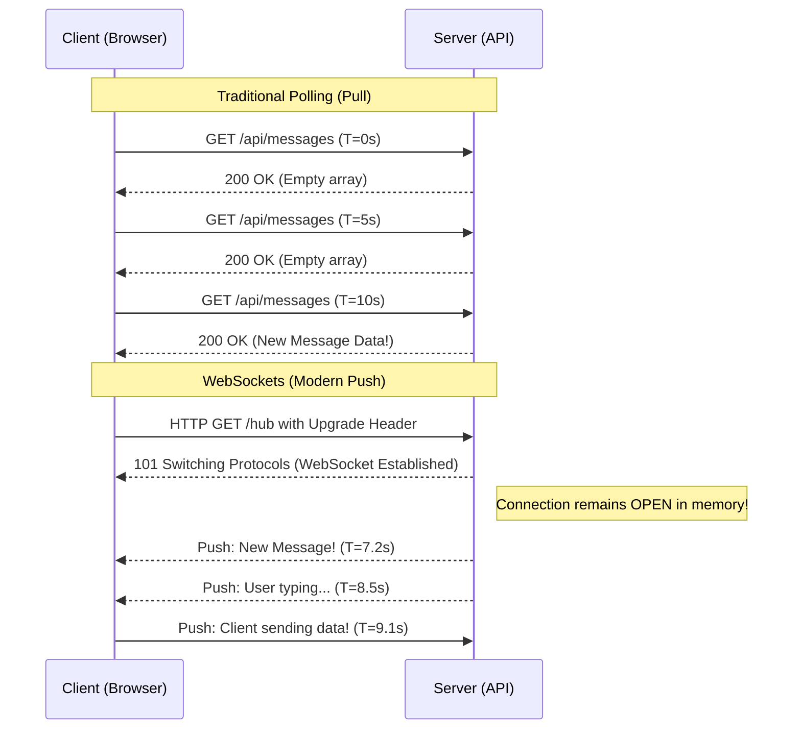

# Lecture 50 — Real-Time Communication & Background Jobs

**Course:** Full-Stack Web Development  
**Instructor:** Kyrillos Medhat  
**Duration:** 3 hours (Theory + Lab)

---

## 🛑 Prerequisites (What to Know Before Starting)

Before diving into this lecture, you should be completely comfortable with the following foundational concepts:
1. **ASP.NET Core Web API:** Understanding Dependency Injection (DI), Controllers, routing, and the application request pipeline. You should know how an HTTP request enters the system, passes through middleware, hits a controller, and returns a response.
2. **HTTP Protocol Basics:** Understanding Request/Response cycles, HTTP headers, standard verbs (GET, POST, PUT, DELETE), and status codes. Knowing why HTTP is inherently stateless is critical.
3. **Angular Fundamentals:** Services, Components, dependency injection in the frontend, and basic reactive programming concepts using RxJS (Observables, Subjects) or modern Angular Signals.
4. **Entity Framework Core (EF Core):** Basic CRUD operations, DbContext lifecycle, and how scoped services interact within an application.
5. **Basic Concurrency Concepts:** A clear understanding of the difference between asynchronous (`async/await`) execution and synchronous, blocking execution, especially in the context of server thread pools.

---

## 🎯 Objectives & Agenda

### Learning Objectives
By the end of this comprehensive, deep-dive session, you will be well-equipped to:
- **Differentiate** thoroughly between the traditional HTTP "Pull" model and the modern real-time "Push" model, understanding the performance implications of each at scale.
- **Architect** robust real-time solutions utilizing ASP.NET Core SignalR's hub-based architecture.
- **Explain** and configure SignalR's transport fallback mechanisms (WebSockets, Server-Sent Events, Long Polling) and articulate when each protocol is selected.
- **Implement** server-to-client pushing from standard REST API Controllers using the `IHubContext` abstraction.
- **Integrate** an Angular single-page application (SPA) with a SignalR hub, complete with advanced reconnection strategies, state management, and clean RxJS wrappers.
- **Design** basic, in-memory background daemon tasks using ASP.NET Core's native `BackgroundService` and `IHostedService` interfaces.
- **Deploy** and manage persistent, fault-tolerant scheduled and recurring background jobs using Hangfire and SQL Server.
- **Scale** real-time applications across multiple load-balanced server nodes using a Redis backplane architecture.

### Comprehensive Agenda
1. **The Evolution of the Web:** Limitations of HTTP, Pull vs. Push Models, and the WebSocket Revolution.
2. **SignalR Deep Dive:** The Hub Pipeline, Transports, Protocols, and Connection Lifecycle.
3. **Server-Side Integration:** Broadcasting events securely from Controllers using `IHubContext`.
4. **Client-Side Integration (Angular):** Building bulletproof, reactive SPA integrations with `@microsoft/signalr`.
5. **Background Processes:** The Hosted Service Paradigm, its uses, and its architectural flaws.
6. **Enterprise Task Management:** Introducing Hangfire for persistent, durable background workloads.
7. **Think Like a Developer:** Real-World Architecture Scenarios and Decision Matrices.
8. **Before vs After:** Code evolution from legacy patterns to modern asynchronous event-driven designs.
9. **Common Mistakes & How to Avoid Them:** Identifying and fixing junior-level architectural errors.
10. **Labs, Assignments, and Interview Prep:** Hands-on exercises and technical interview readiness.

---

## 1. Push vs. Pull: The Real-Time Web (The Deep Dive)

### The Problem with Traditional HTTP
HTTP (Hypertext Transfer Protocol) was designed in the early 1990s as a stateless, unidirectional document retrieval protocol. The client (typically a web browser) must initiate a request, and the server provides a response. Once the response is sent, the connection is instantly closed. The server cannot initiate communication with the client; it can only respond when spoken to.

Imagine building a modern, interactive web application like a live chat application, a real-time stock trading dashboard, a collaborative document editor (like Google Docs), or a live multiplayer game. If the server only speaks when spoken to, how do you know when another user types a message or the stock price drastically changes? 

### The "Pull" Model (Polling): The Legacy Approach
In the early days of dynamic web applications, developers solved this problem using a technique known as **Polling**. The client simply asks the server repeatedly at a fixed interval:
*Client: "Any new messages?"* -> *Server: "No."* (Wait 5 seconds)
*Client: "Any new messages?"* -> *Server: "No."* (Wait 5 seconds)
*Client: "Any new messages?"* -> *Server: "Yes, here is a message from John."*

> [!WARNING]
> Polling is notoriously inefficient and scales terribly. If you have 10,000 active clients polling your server every 5 seconds, your server is handling 2,000 requests per second. Every single request requires opening a TCP connection, negotiating TLS/SSL, parsing HTTP headers, checking the database, and returning a payload. Furthermore, 99% of those requests might return an empty payload or a `304 Not Modified`. This wastes CPU cycles, consumes massive bandwidth, fills up server logs, and rapidly drains battery life on mobile devices.

### Long Polling (The Transitional Hack)
Before WebSockets existed, engineers invented "Long Polling". In this model, the client sends a request, but the server purposefully *hangs* the request open and does not respond immediately. The server holds the HTTP connection open until new data is available or a timeout is reached. The moment the server responds with data, the client immediately sends a brand new Long Polling request. While better than standard polling, it still carries the heavy overhead of HTTP headers and connection re-establishment.

### The "Push" Model (Real-Time Web via WebSockets)
The Push model completely flips the paradigm. The client opens a **persistent, full-duplex connection** to the server. The server keeps this connection open in memory indefinitely. Because the connection remains open, the server can actively *push* data down the pipe to the client at the exact millisecond an event occurs. 



With WebSockets, there is only one HTTP request at the very beginning (the handshake). After the handshake, data is sent as raw binary or text frames. The overhead is virtually zero, allowing for thousands of messages per second with minimal latency.

---

## 2. SignalR: Hubs & Transport Mechanisms

ASP.NET Core **SignalR** is a robust, open-source library provided by Microsoft that dramatically simplifies adding real-time web functionality to applications. It abstracts away the complex low-level details of connection management, fallback negotiation, and message serialization.

### The Transport Fallback Chain
Not all network environments (corporate firewalls, aggressive proxies, older browsers) support the WebSocket protocol. SignalR is beautifully engineered to gracefully degrade across three distinct transport protocols, automatically selecting the best one available:

1. **WebSockets:** (The Gold Standard) Provides a true full-duplex, persistent, two-way connection over a single TCP socket. Headers are only sent once during the initial handshake, making it extremely bandwidth-efficient. This is what SignalR tries to use first.
2. **Server-Sent Events (SSE):** (The Silver Medal) An HTML5 standard where the server maintains a persistent one-way connection to the client. The client can listen to the stream infinitely, but if the client needs to send data *back* to the server, it must use standard, separate HTTP POST requests. SignalR manages this behind the scenes.
3. **Long Polling:** (The Bronze Fallback) The fallback of last resort. As described earlier, the client makes an HTTP request, the server hangs it open until data is ready, and upon receipt, the client immediately opens a new request. It mimics real-time behavior but with higher latency and resource consumption.

> [!NOTE]
> SignalR handles this negotiation automatically during the initial connection phase. You can observe this negotiation in your browser's Developer Tools -> Network tab. Look for the `/negotiate` endpoint!

### Creating Your First Hub
A **Hub** is the central concept in SignalR. It is a high-level pipeline that allows the client and server to call methods on each other directly, crossing the network boundary seamlessly.

```csharp
using Microsoft.AspNetCore.SignalR;
using System;
using System.Threading.Tasks;
using Microsoft.Extensions.Logging;

namespace RealTimeApp.Hubs
{
    // 1. Inherit from the base ASP.NET Core SignalR Hub class
    public class NotificationHub : Hub
    {
        private readonly ILogger<NotificationHub> _logger;

        public NotificationHub(ILogger<NotificationHub> logger)
        {
            _logger = logger;
        }

        // 2. Define a method that a connected CLIENT can invoke
        public async Task SendMessageToServer(string user, string message)
        {
            _logger.LogInformation($"Message received from {user}: {message}");

            // 3. The server processes it, and then PUSHES it out to ALL connected clients.
            // "ReceiveMessage" is the exact string name of the JavaScript function 
            // that the client-side code must be listening for.
            await Clients.All.SendAsync("ReceiveMessage", user, message);
        }

        // You can deeply customize the connection lifecycle
        public override async Task OnConnectedAsync()
        {
            string connectionId = Context.ConnectionId;
            _logger.LogInformation($"Client Connected: {connectionId}");

            // Automatically add every connected user to a "GlobalUsers" group
            await Groups.AddToGroupAsync(connectionId, "GlobalUsers");
            
            // Notify others that someone joined
            await Clients.Others.SendAsync("UserJoined", connectionId);

            await base.OnConnectedAsync();
        }

        public override async Task OnDisconnectedAsync(Exception? exception)
        {
            string connectionId = Context.ConnectionId;
            _logger.LogInformation($"Client Disconnected: {connectionId}. Reason: {exception?.Message}");

            await base.OnDisconnectedAsync(exception);
        }
    }
}
```

### Registering the Hub in the Application Pipeline
To wire this up in a modern `.NET` application (`Program.cs`):

```csharp
var builder = WebApplication.CreateBuilder(args);

// 1. Add SignalR services to the Dependency Injection (DI) container
builder.Services.AddSignalR(options => 
{
    // Optional: Configure advanced settings
    options.EnableDetailedErrors = true;
    options.KeepAliveInterval = TimeSpan.FromSeconds(15);
});
builder.Services.AddControllers();

var app = builder.Build();

app.UseRouting();

// Middleware: Ensure authentication happens BEFORE SignalR connects
app.UseAuthentication();
app.UseAuthorization();

app.MapControllers();

// 2. Map a specific URL endpoint to your hub class
// Clients will connect to https://yourdomain.com/hubs/notifications
app.MapHub<NotificationHub>("/hubs/notifications");

app.Run();
```

---

## 3. Pushing Data from API Controllers (`IHubContext`)

A very common architectural misconception is that the client (Angular/React) must *always* communicate directly with the SignalR Hub. While that is appropriate for a chat application, it is often wrong for line-of-business applications.

In a standard enterprise app, a user performs an action by making a standard RESTful HTTP POST request to an API Controller (e.g., placing an order, uploading a document). The API Controller performs validation, interacts with the database via EF Core, commits the transaction, and finalizes the business logic. 
**It is at this exact moment that the API Controller should use SignalR to broadcast the success of the action to everyone else on the system.**

To bridge the gap between REST Controllers and SignalR Hubs, ASP.NET Core allows you to inject `IHubContext<THub>` into any service or controller!

```csharp
using Microsoft.AspNetCore.Mvc;
using Microsoft.AspNetCore.SignalR;
using RealTimeApp.Hubs;
using RealTimeApp.Models;
using RealTimeApp.Data;
using System.Threading.Tasks;
using System;

[ApiController]
[Route("api/[controller]")]
public class OrdersController : ControllerBase
{
    // 1. Inject the Context for your specific Hub
    private readonly IHubContext<NotificationHub> _hubContext;
    private readonly ApplicationDbContext _dbContext;

    public OrdersController(
        IHubContext<NotificationHub> hubContext, 
        ApplicationDbContext dbContext)
    {
        _hubContext = hubContext;
        _dbContext = dbContext;
    }

    [HttpPost]
    public async Task<IActionResult> CreateOrder([FromBody] OrderDto orderDto)
    {
        // 1. Standard Business Logic & Database Persistence
        var order = new Order 
        { 
            Product = orderDto.Product, 
            Amount = orderDto.Amount,
            CreatedAt = DateTime.UtcNow
        };
        _dbContext.Orders.Add(order);
        await _dbContext.SaveChangesAsync();
        
        // 2. Push a real-time notification to EVERYONE currently on the website
        // This alerts other users' live dashboards to refresh their data instantly!
        var payload = new 
        { 
            Message = $"New order placed for {order.Product}!", 
            OrderId = order.Id,
            Timestamp = order.CreatedAt 
        };

        await _hubContext.Clients.All.SendAsync("OrderCreated", payload);
        
        return Ok(new { success = true, orderId = order.Id });
    }
}
```

> [!TIP]
> **Targeted Broadcasting:** You rarely want to broadcast to `.All` in a production system. `IHubContext.Clients` exposes highly targeted targeting options:
> - `Clients.Caller`: The specific client who invoked the hub method.
> - `Clients.Others`: Everyone EXCEPT the caller (useful so the caller doesn't get a notification for their own action).
> - `Clients.Group("Admins")`: Only users who were actively added to the "Admins" group.
> - `Clients.User(userId)`: A specific authenticated user (across all their active devices/tabs), matched securely by their JWT `NameIdentifier` claim!

---

## 4. Connecting the Angular Client

The server is broadcasting, but the frontend needs to actively "tune in" to the correct frequency. We will wrap the SignalR library in an Angular Service to keep our UI components clean, testable, and reactive.

### Step 1: Install the Client Library
You must install the official Microsoft JavaScript client for SignalR.
```bash
npm install @microsoft/signalr
```

### Step 2: Create a Reactive Angular Service
Instead of passing messy callback functions around our components, we will use an RxJS `BehaviorSubject` (or Angular Signals) to hold the latest notification stream. This allows any component in the application to subscribe to real-time events cleanly.

```typescript
import { Injectable } from '@angular/core';
import * as signalR from '@microsoft/signalr';
import { BehaviorSubject, Observable } from 'rxjs';

export interface NotificationPayload {
  message: string;
  orderId: number;
  timestamp: string;
}

@Injectable({
  providedIn: 'root'
})
export class SignalRService {
  private hubConnection: signalR.HubConnection | undefined;
  
  // Create an RxJS Subject to emit data to subscribed components
  private orderNotificationSource = new BehaviorSubject<NotificationPayload | null>(null);
  public orderNotifications$ = this.orderNotificationSource.asObservable();

  public startConnection(): void {
    // 1. Configure the connection builder
    this.hubConnection = new signalR.HubConnectionBuilder()
      .withUrl('https://localhost:5001/hubs/notifications', {
         // IMPORTANT: Pass JWT token if the Hub requires [Authorize]
         accessTokenFactory: () => localStorage.getItem('jwt_token') || ''
      })
      // Exponential backoff strategy for network drops
      .withAutomaticReconnect([0, 2000, 5000, 10000, 30000, null]) 
      .configureLogging(signalR.LogLevel.Information)
      .build();

    // 2. Start the persistent connection
    this.hubConnection
      .start()
      .then(() => console.log('SignalR Connection established successfully.'))
      .catch(err => console.error('Error while starting SignalR connection: ', err));

    // 3. Register Event Listeners
    // The string 'OrderCreated' MUST match the string used in C# SendAsync
    this.hubConnection.on('OrderCreated', (payload: NotificationPayload) => {
      console.log('Real-time order received from server:', payload);
      // Push new data into the observable stream for components to react
      this.orderNotificationSource.next(payload);
    });

    // Handle lifecycle events
    this.hubConnection.onreconnecting(error => {
      console.warn('Connection lost. Reconnecting...', error);
    });
    
    this.hubConnection.onreconnected(connectionId => {
      console.log('Connection reestablished. ID: ', connectionId);
    });
  }
  
  public stopConnection(): void {
    if (this.hubConnection) {
      this.hubConnection.stop().then(() => console.log('SignalR stopped.'));
    }
  }
}
```

---

## 5. Background Jobs: The Overnight Janitor

### The Architectural Flaw of HTTP Context for Heavy Work
An API Controller is functionally identical to a cashier at a fast-food restaurant. They take your order (the HTTP Request), hand you your food (the HTTP Response), and immediately move to the next customer in line. 
**A cashier should never leave the register to go mop the floors in the back.** 

If you have a business task that takes 5 minutes to execute (e.g., generating a massive PDF report, scraping a third-party API, or cleaning out expired temporary records from the database), you absolutely cannot execute that logic synchronously inside the Controller. If you do, the HTTP request will time out, the user will stare at an infinite spinning loader, and worse, the server thread pool will become completely blocked, crippling your application's ability to serve other users.

You need a Janitor: a background worker process that runs independently of the web request lifecycle.

### `IHostedService` & `BackgroundService`
ASP.NET Core provides a native, built-in mechanism for running long-running, asynchronous daemon tasks directly alongside your web server: the `BackgroundService` class (which implements `IHostedService`).

```csharp
using Microsoft.Extensions.Hosting;
using Microsoft.Extensions.Logging;
using Microsoft.Extensions.DependencyInjection;
using System;
using System.Threading;
using System.Threading.Tasks;

public class DatabaseCleanupWorker : BackgroundService
{
    private readonly ILogger<DatabaseCleanupWorker> _logger;
    // We must inject IServiceScopeFactory, NOT the DbContext directly!
    private readonly IServiceScopeFactory _scopeFactory;

    public DatabaseCleanupWorker(
        ILogger<DatabaseCleanupWorker> logger, 
        IServiceScopeFactory scopeFactory)
    {
        _logger = logger;
        _scopeFactory = scopeFactory;
    }

    protected override async Task ExecuteAsync(CancellationToken stoppingToken)
    {
        _logger.LogInformation("Janitor Service is starting.");

        // Set a timer for 1 hour intervals
        using var timer = new PeriodicTimer(TimeSpan.FromHours(1));
        
        // Loop continuously until the application is gracefully shut down
        // The stoppingToken will trigger when IIS/Kestrel stops the app
        while (await timer.WaitForNextTickAsync(stoppingToken) && !stoppingToken.IsCancellationRequested)
        {
            _logger.LogInformation($"Janitor: Running hourly database cleanup at {DateTime.Now}");
            
            try 
            {
                // CRITICAL: BackgroundService is a Singleton. 
                // We must create a manual Scope to resolve Scoped services like DbContext!
                using (var scope = _scopeFactory.CreateScope())
                {
                    var dbContext = scope.ServiceProvider.GetRequiredService<ApplicationDbContext>();
                    
                    // Business Logic: Delete unverified users older than 24 hours
                    var cutoff = DateTime.UtcNow.AddDays(-1);
                    var oldUsers = dbContext.Users.Where(u => !u.IsVerified && u.CreatedAt < cutoff);
                    
                    dbContext.Users.RemoveRange(oldUsers);
                    int deletedCount = await dbContext.SaveChangesAsync(stoppingToken);
                    
                    _logger.LogInformation($"Cleanup complete. Deleted {deletedCount} users.");
                }
            }
            catch(Exception ex)
            {
                _logger.LogError(ex, "An error occurred during database cleanup.");
            }
        }
        
        _logger.LogInformation("Janitor Service is stopping cleanly.");
    }
}
```

**Registration in `Program.cs`:**
```csharp
// Note the special AddHostedService registration method!
builder.Services.AddHostedService<DatabaseCleanupWorker>();
```

---

## 6. Hangfire for Persistent Enterprise Jobs

### The Fatal Flaw of `BackgroundService`
While `BackgroundService` is fantastic for simple, volatile daemon tasks, it suffers from severe architectural limitations for enterprise, mission-critical workloads:
1. **Extreme Volatility:** If the IIS Server restarts, the App Pool recycles, or the Docker container crashes (which happens constantly in cloud environments), the background thread is violently terminated. Any task currently executing is lost forever. There is no state persistence.
2. **Total Amnesia:** If a scheduled task was supposed to run at 3:00 AM, but the server was offline from 2:00 AM to 4:00 AM for maintenance, the task will just never execute. The trigger was missed, and the system has no memory of it.
3. **Catastrophic Scaling Issues:** If you scale your API to 5 load-balanced instances (Nodes A, B, C, D, E), you suddenly have 5 identical `BackgroundServices` running simultaneously. They will all wake up at 3:00 AM and attempt to process the exact same database records, causing extreme duplication of work, race conditions, and catastrophic database deadlocks.

### Enter Hangfire: The Industry Standard
**Hangfire** is a robust, open-source framework that solves these exact problems by persisting job states into a real, durable database (SQL Server, Redis, Postgres). 

- **Fault Tolerance:** If the server crashes mid-job, Hangfire reads the database on startup, sees the job was aborted, and automatically retries it.
- **Distributed Locks:** If you scale to 5 servers, they all act as competing consumers pulling from the same centralized SQL-backed queue. Hangfire manages distributed locking, guaranteeing a task executes exactly once, no matter how many server nodes you have running.

### Hangfire Setup
**1. Installation:**
```bash
dotnet add package Hangfire.AspNetCore
dotnet add package Hangfire.SqlServer
```

**2. Configuration in `Program.cs`:**
```csharp
using Hangfire;

// 1. Add Hangfire services and configure the SQL storage provider
builder.Services.AddHangfire(configuration => configuration
    .SetDataCompatibilityLevel(CompatibilityLevel.Version_180)
    .UseSimpleAssemblyNameTypeSerializer()
    .UseRecommendedSerializerSettings()
    .UseSqlServerStorage(builder.Configuration.GetConnectionString("DefaultConnection")));

// 2. Add the background processing server as an IHostedService
// This allows this API node to actively process jobs from the SQL queue
builder.Services.AddHangfireServer();

var app = builder.Build();

// 3. Enable the beautiful, interactive Dashboard UI
// WARNING: In production, secure this endpoint!
app.UseHangfireDashboard("/hangfire");
```

### The 4 Pillars of Hangfire Jobs

Hangfire offers extreme flexibility for task scheduling via a clean, lambda-based API:

```csharp
// 1. Fire-and-Forget
// Pushes the job definition to SQL Server and returns immediately. 
// Hangfire will pick it up and run it ASAP. Great for offloading heavy work from Controllers.
var jobId = BackgroundJob.Enqueue(() => EmailService.SendWelcomeEmail(userId));

// 2. Delayed Jobs
// Runs exactly 24 hours from now. Hangfire persists this intention in the DB.
// Even if the server reboots 10 times in the next 24 hours, it will fire.
BackgroundJob.Schedule(() => FollowUpService.SendEmail(userId), TimeSpan.FromHours(24));

// 3. Recurring Jobs (Cron Jobs)
// Runs on a strict, unbreakable schedule. Uses standard CRON expressions.
RecurringJob.AddOrUpdate(
    "daily-sales-report", 
    () => ReportService.GenerateSalesReport(), 
    Cron.Daily // Equivalent to "0 0 * * *"
);

// 4. Continuations
// Chains jobs together. Runs immediately AFTER another specific job finishes successfully.
BackgroundJob.ContinueJobWith(
    jobId, 
    () => NotificationService.AlertAdmin("Welcome email was successfully sent!")
);
```

> [!IMPORTANT]
> **Hangfire Security:** By default, the `/hangfire` dashboard is strictly limited to `localhost` requests. If you deploy to production, you will be locked out. You **must** configure a Dashboard Authorization Filter to ensure only authenticated users with an `Admin` role can view and manipulate background jobs.

---

## 7. Think Like a Developer (Architecture Scenarios)

### Scenario 1: The "Heavy Payload" SignalR Anti-Pattern
**Context:** You are building a live stock ticker application. Stock prices update 15 times a second.
**The Junior Developer Thought Process:** *"I will serialize my massive `StockAnalyticsDTO` (which includes 50 properties, nested historical arrays, and company metadata) and use `IHubContext` to broadcast it to `.All` 15 times a second."*
**The Critical Problem:** SignalR is meant for *signaling*. Sending massive JSON payloads at extremely high frequencies will instantly choke the server's CPU (due to JSON serialization overhead) and max out client bandwidth, causing the WebSockets to violently disconnect due to frame size limits.
**The Senior Architect Solution:** Use SignalR to send a microscopic "Tick" event payload (e.g., just the `StockId` and the new `Price`). If the client UI determines it actually needs the full historical array, the client reacts to the SignalR Tick by making a standard, separate HTTP GET request to fetch the rest. SignalR tells them *when* to fetch; HTTP handles the heavy data lifting.

### Scenario 2: The Dependency Injection Trap in BackgroundService
**Context:** You write a simple `BackgroundService` to clean up old database records every night.
**The Junior Developer Thought Process:** *"I'll just inject my `AppDbContext` into the constructor of my BackgroundService and use it inside `ExecuteAsync`."*
**The Critical Problem:** The application crashes instantly on startup, throwing an `InvalidOperationException`. Why? Because `BackgroundService` is registered as a **Singleton** (lives forever in memory), but `AppDbContext` is registered as **Scoped** (created and destroyed per HTTP request). You cannot put a short-lived object inside a long-lived object; if you could, the DbContext would stay alive forever, eventually timing out and exhausting the SQL Server connection pool.
**The Senior Architect Solution:** Inject `IServiceScopeFactory`. Create a manual, ephemeral scope strictly inside your `while` loop, resolve the DbContext from that temporary scope, and let it dispose immediately when the loop iteration finishes. (See the code snippet in Section 5).

---

## 8. Before vs After: Code Evolution

### Submitting an Order with Heavy Processing Requirements

**🔴 BEFORE: Blocking the HTTP Request (The Legacy/Junior Anti-Pattern)**
```csharp
[HttpPost("checkout")]
public async Task<IActionResult> Checkout(Order order)
{
    // Fast operation
    _db.Orders.Add(order);
    await _db.SaveChangesAsync();
    
    // EXTREMELY BAD: We are forcing the user to wait 15 seconds staring at a loader 
    // while we synchronously generate a heavy PDF and talk to an external SMTP server.
    // If the SMTP server timeouts, the entire order process fails and rolls back!
    await _pdfService.GenerateInvoice(order.Id);
    await _emailService.SendInvoiceEmail(order.Id);
    
    return Ok("Order Complete"); // User finally gets response 15 seconds later
}
```

**🟢 AFTER: Offloading to Hangfire (The Modern Enterprise Pattern)**
```csharp
[HttpPost("checkout")]
public async Task<IActionResult> Checkout(Order order)
{
    // Fast operation
    _db.Orders.Add(order);
    await _db.SaveChangesAsync();
    
    // EXTREMELY GOOD: Hand the heavy workflow to Hangfire. 
    // This enqueue operation takes < 5 milliseconds. It is persisted to SQL.
    BackgroundJob.Enqueue(() => _workflowService.ProcessOrderPostCheckout(order.Id));
    
    // User gets immediate 202 Accepted response. UI feels blazing fast.
    // Hangfire handles the PDF and Email securely in the background, with automatic retries if SMTP fails!
    return Accepted(new { Message = "Order placed! Check email shortly for your invoice." }); 
}
```

---

## 9. Common Mistakes & How to Avoid Them

| ❌ Mistake (Anti-Pattern) | ✅ Modern Solution / Fix |
|-------------------------|-------------------------|
| **Heavy Logic in Hub Methods** | Hub methods run on a limited pool of worker threads. If you execute long-running DB queries inside a Hub method, you starve the entire SignalR infrastructure. Keep Hub methods microscopic. Use Hangfire for the heavy lifting. |
| **Silent Reconnection Failures** | WebSockets drop frequently on mobile devices (e.g., walking out of WiFi range and switching to Cellular). Always, always use `.withAutomaticReconnect()` in the Angular client connection builder. |
| **Zombie Background Tasks** | Overriding `ExecuteAsync` in a BackgroundService but failing to check `stoppingToken.IsCancellationRequested` inside your loop. The application will hang indefinitely when trying to shut down gracefully, blocking CI/CD deployments. |
| **Hangfire Dashboard Exposed** | Leaving `app.UseHangfireDashboard()` unprotected in Production allows literally anyone on the internet to view your internal queues, view method arguments, and trigger manual jobs. Implement `IDashboardAuthorizationFilter` strictly. |
| **Large Payload Broadcasting** | Broadcasting entire EF Core entity objects (which often contain massive navigation properties causing JSON cyclical reference loops) to thousands of users. Map to small DTOs and send only necessary delta updates. |

---

## 10. 🧪 Practice Labs

### Lab 1: The Hangfire Nightly Backup (45 min)
**The Goal:** Configure a bulletproof CRON job to simulate daily maintenance.
1. Install `Hangfire.AspNetCore` and `Hangfire.MemoryStorage` (using memory storage makes local development incredibly easy without needing a local SQL instance).
2. Create an interface `IBackupService` with a method `PerformDbBackup()`. Register it in DI.
3. Inside the method implementation, simply write a simulated `Task.Delay(5000)` and a `Console.WriteLine("Backup complete!")`.
4. In `Program.cs`, use `RecurringJob.AddOrUpdate` to schedule this method to run at `0 2 * * *` (2 AM every day).
5. Run the application, open the Hangfire Dashboard (`/hangfire`), navigate to the "Recurring Jobs" tab, and click "Trigger Now" to manually force the job to execute immediately and watch the console output.

---

## 11. 📝 Assignment: ShopAPI Project — Part 6

It is time to make our E-Commerce platform feel truly alive! We want a real-time notification to appear on every active user's screen the exact moment an administrator adds a new product to the system catalog.

### Strict Requirements:
1. **Infrastructure:** Add the SignalR service and middleware to your existing `ShopAPI` project.
2. **The Hub:** Create a `CatalogHub`. It does not need any custom C# methods inside it; we simply need it to exist as a WebSocket endpoint.
3. **Routing:** Map the hub to the `/hubs/catalog` endpoint in your pipeline.
4. **The Trigger:** Open your existing `ProductsController`. Inject `IHubContext<CatalogHub>` directly into the constructor.
5. **The Broadcast:** Inside your `POST` endpoint, exactly after the successful EF Core `SaveChangesAsync()` call, use the hub context to broadcast a message named `"ProductAdded"`. Send an anonymous object containing the Name and Price of the new product as the payload.
6. **Frontend Integration:** In your Angular application, install the `@microsoft/signalr` package. Create a robust `NotificationService` that initiates connection to the hub when the application loads. 
7. **UX Polish:** Utilize Angular Material Snackbar (or ngx-toastr) to display a slick popup notification to the user whenever the `"ProductAdded"` event fires from the server. Test this by opening two browser windows side-by-side!

---

## 12. 🗣️ Technical Interview Preparation

If you claim modern .NET experience on your resume, expect architectural questions regarding real-time and background processing. Master these answers:

**Q1: How exactly does SignalR establish a connection if the client's strict corporate firewall aggressively blocks WebSocket traffic?**
*Answer:* SignalR is built with graceful degradation. It automatically negotiates the connection protocol during the initial handshake. It attempts WebSockets first. If the handshake fails or times out, it falls back to Server-Sent Events (SSE), and if that fails, it relies on Long Polling (holding a standard HTTP request open). The developer doesn't have to write any fallback logic.

**Q2: What is the fundamental difference between ASP.NET Core `IHostedService` and Hangfire?**
*Answer:* `IHostedService` (BackgroundService) runs entirely in-memory on a background thread within the application process. If the server process restarts, crashes, or scales horizontally, state is completely lost and tasks duplicate. Hangfire utilizes persistent storage (like SQL Server) to maintain job state, allowing for extreme durability, automatic retries upon failure, and safe distributed processing across multiple servers acting as competing consumers.

**Q3: How do you resolve a Scoped service (like an EF Core DbContext) inside an IHostedService (which operates as a Singleton)?**
*Answer:* You absolutely cannot inject a Scoped service directly into a Singleton via the constructor; it will cause an exception or a massive memory leak. You must inject `IServiceScopeFactory`, call `CreateScope()` manually within your execution loop, and then use the `ServiceProvider` of that specific scope to resolve the DbContext. You must ensure the scope is disposed when the operation completes.

**Q4: What is a "Fire-and-Forget" job in Hangfire and when would you use it?**
*Answer:* It is a job that is enqueued into persistent storage and immediately returns control to the calling thread. The actual execution happens asynchronously on a background worker thread as soon as resources are available. It is ideal for offloading slow tasks (like sending emails, generating PDFs, or pinging external webhooks) away from the main HTTP Request thread, ensuring the user gets an instant response.

---

## 13. 📄 Cheat Sheet (Syntax Reference)

### SignalR Client (Angular/TypeScript)
```typescript
// 1. Connection Setup with robust fallbacks
const connection = new signalR.HubConnectionBuilder()
    .withUrl("https://api.domain.com/hubs/chat", {
       accessTokenFactory: () => localStorage.getItem('token')
    })
    .withAutomaticReconnect()
    .build();

// 2. Listen for Server Events (Define this BEFORE starting)
connection.on("MessageReceived", (user, message) => { 
    console.log(`${user} says ${message}`); 
});

// 3. Start Connection
await connection.start();

// 4. Call Server Methods from Client
await connection.invoke("SendMessageToServer", "John", "Hello World");
```

### Hangfire (C#)
```csharp
// 1. Fire & Forget (Immediate offloading)
var id = BackgroundJob.Enqueue(() => Console.WriteLine("Running now!"));

// 2. Delayed (Scheduled for the future)
BackgroundJob.Schedule(() => Console.WriteLine("Running later!"), TimeSpan.FromMinutes(15));

// 3. Recurring (CRON based scheduling)
RecurringJob.AddOrUpdate("daily-email", () => SendDigestEmail(), Cron.Daily);

// 4. Continuations (Chaining jobs)
BackgroundJob.ContinueJobWith(id, () => Console.WriteLine("Finished previous task!"));
```

---

## 14. 🔗 Key Takeaways & Resources

### Critical Architectural Takeaways
- **The Modern Web is Push-Based:** The era of aggressive polling is dead. Modern applications must react instantly to data changes using WebSockets.
- **SignalR Abstracts Complexity:** It expertly manages the tricky fallback logic, connection negotiation, and reconnection states, allowing you to focus purely on your business logic.
- **The Hybrid Architecture is Best:** API Controllers handle the incoming HTTP requests and data validation; `IHubContext` handles the outbound real-time notifications to keep UI state synchronized.
- **Respect the Request Lifecycle:** Never run long, heavy, or unpredictable tasks synchronously inside an API Controller. Offload them to background workers.
- **Choose the Right Tool for the Job:** Use `BackgroundService` for simple, continuous, non-critical in-memory daemons. Use **Hangfire** for mission-critical business workflows that demand reliability, retries, auditability, and precise scheduling.

### Resources for Mastery
| Resource | Link |
|----------|------|
| **SignalR Official Architecture Docs** | [Microsoft Docs: SignalR Core](https://learn.microsoft.com/en-us/aspnet/core/signalr/introduction) |
| **Angular SignalR Client API** | [Microsoft Docs: JS Client](https://learn.microsoft.com/en-us/aspnet/core/signalr/javascript-client) |
| **Hangfire Deep Dive Documentation** | [Hangfire Official Docs](https://docs.hangfire.io/en/latest/) |
| **CRON Expression Generator** | [Crontab Guru (An absolute lifesaver for scheduling)](https://crontab.guru/) |
| **Redis Backplane Setup Guide** | [Scale out SignalR with Redis](https://learn.microsoft.com/en-us/aspnet/core/signalr/redis-backplane) |

---

**Next Lecture:** [Lecture 51 — Advanced API Patterns — CQRS, MediatR & Caching](../51%20-%20Advanced%20API%20Patterns%20-%20CQRS%2C%20MediatR%20%26%20Caching/51%20-%20Advanced%20API%20Patterns%20-%20CQRS%2C%20MediatR%20%26%20Caching.md)
### 📚 Extensive Tutorials & Resources
- **CodeMaze:** [Real-Time Web Apps With ASP.NET Core SignalR and Angular](https://code-maze.com/net-core-series-signalr-angular/)
- **CodeMaze:** [Hangfire with ASP.NET Core](https://code-maze.com/hangfire-with-asp-net-core/)
- **CodeMaze:** [How to Use Hosted Services in ASP.NET Core](https://code-maze.com/aspnetcore-hosted-services/)
- **Microsoft Learn:** [Introduction to ASP.NET Core SignalR](https://learn.microsoft.com/en-us/aspnet/core/signalr/introduction)
- **Microsoft Learn:** [Background Tasks with Hosted Services in ASP.NET Core](https://learn.microsoft.com/en-us/aspnet/core/fundamentals/host/hosted-services)
- **FreeCodeCamp:** [SignalR in C# - A Guide to Real-Time Apps](https://www.freecodecamp.org/news/signalr-csharp-dotnet-real-time-applications-guide/)
