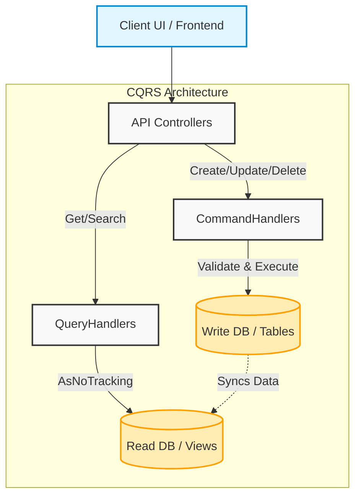

# Lecture 51 — Advanced API Patterns: CQRS, MediatR & Caching

**Course:** Full-Stack Web Development  
**Instructor:** Kyrillos Medhat  
**Duration:** 3 hours (Theory + Lab)

---

## 🛠️ Prerequisites (What to know before starting)

Before diving into advanced enterprise architecture patterns, ensure you are comfortable with the following concepts:
- **C# & .NET 8/9:** Familiarity with modern C# features (records, top-level statements, async/await).
- **Dependency Injection (DI):** Understanding how `IServiceCollection` works, lifetimes (Transient, Scoped, Singleton).
- **Entity Framework Core:** Comfort with `DbContext`, LINQ queries, and migrations.
- **RESTful API Principles:** Knowledge of controllers, routing, HTTP verbs (GET, POST, PUT, DELETE), and status codes.
- **Middleware:** Understanding how the ASP.NET Core request pipeline operates.
- **Basic Caching:** General understanding of what memory caching means.

If any of these topics feel rusty, please review **Lecture 39: EF Core Fundamentals** and **Lecture 43: Dependency Injection & Middleware** before proceeding.

---

## 🎯 Objectives & Agenda

### Learning Objectives
By the end of this intensive session, you will be able to:
1. **Architect** systems using the **CQRS pattern** to securely separate database read logic from write logic, optimizing for scalability.
2. **Decouple** API Controllers from Business Logic entirely by integrating the **MediatR** library.
3. **Implement** global, cross-cutting concerns using **MediatR Pipeline Behaviors** (e.g., performance logging and validation).
4. **Centralize** complex, conditional business rules outside of your domain models using **FluentValidation**.
5. **Optimize** API response times and protect databases from traffic spikes (Cache Stampedes) using modern **HybridCache**.
6. **Generate** compile-time, high-performance OpenAPI (Swagger) documents using modern **.NET Source Generators**.

### 📋 Agenda

#### Part 1 — Theory & Deep Dive (~90 min)
1. **CQRS:** Command Query Responsibility Segregation (The Restaurant Analogy, Architecture, and vs Event Sourcing).
2. **The Mediator Pattern (MediatR):** Decoupling controllers and services. (Vertical Slice Architecture intro).
3. **Centralized Rules with FluentValidation:** Moving beyond data annotations.
4. **MediatR Pipeline Behaviors:** Intercepting the business logic pipeline (Validation and Logging).
5. **High-Performance Caching (`HybridCache`):** Stopping cache stampedes and utilizing L1/L2 caching.
6. **OpenAPI Source Generation:** Compile-time optimizations for API documentation.

#### Part 2 — Practice / Lab (~90–120 min)
1. Refactor a legacy Fat-Controller API to CQRS with MediatR.
2. Implement FluentValidation as a global Pipeline Behavior.
3. **ShopAPI Project Part 7:** CQRS, Validation & Caching integration.

---

## 1. CQRS: Command Query Responsibility Segregation

### The Problem with Traditional CRUD (The "Why")

In standard CRUD applications, developers often use the exact same Entity (e.g., `Product`), the exact same `DbContext`, and the exact same Service layer to both Read data and Write data. 

For a simple blog or a small internal tool, this is perfectly fine. But in large-scale, real-world systems, this unified approach begins to crack under pressure:
- **Asymmetric Workloads:** In most applications, reads happen 100x to 1000x more often than writes. Think of an e-commerce site—thousands of people view a product (Read), but only a few buy it or update its stock (Write). 
- **Different Needs:** Reads need to be incredibly fast (using caching, No-Tracking queries, or even materialized views). Writes need to be incredibly safe (using transactions, complex business validation, domain events).
- **Data Model Conflicts:** The data format optimized for inserting into a relational database is rarely the same data format optimized for returning to a frontend UI.

### The Real-World Analogy: The Restaurant Kitchen

Imagine going to a high-end restaurant. 
- You don't walk into the kitchen, look at raw ingredients, and figure out what to eat. You read from a **Menu**—a simplified, read-optimized projection of what the kitchen can make. This is the **Query**.
- When you order, you don't cook it yourself. You write down your intent on an **Order Ticket** and hand it to a waiter. The kitchen validates it (do we have the ingredients?), processes it, and updates their inventory. This is the **Command**.

### Deep Dive: The CQRS Pattern

CQRS (Command Query Responsibility Segregation) forces you to split your application's operations into two distinct halves:

1. **Commands (Writes):** 
   - **Purpose:** Intent to mutate state (Create, Update, Delete).
   - **Return Value:** Usually returns `void`, a success boolean, or the ID of the newly created resource. It does *not* return the full entity.
   - **Characteristics:** Highly validated, transactional, slow.

2. **Queries (Reads):** 
   - **Purpose:** Request for data (Get, List, Search).
   - **Return Value:** Returns ViewModels or DTOs specifically tailored for the UI.
   - **Characteristics:** Does not change state, heavily cached, uses `AsNoTracking()`, extremely fast.

### Event Sourcing vs CQRS (The Ultimate Evolution)

Often, you will hear CQRS mentioned alongside **Event Sourcing**. It is critical to know that these are two different patterns, though they pair beautifully together.
- **CQRS** means separating your reads and writes.
- **Event Sourcing** means instead of saving the *current state* of an entity in the database (e.g., User Balance is $100), you save the *history of all events* that happened to that entity (User Deposited $150, User Withdrew $50). To get the current balance, you "replay" the events.
Event Sourcing is incredibly complex and should only be used in banking or audit-heavy systems, whereas CQRS can be used in almost any enterprise API.

### Visualizing CQRS Architecture



*Note: In simpler CQRS implementations, the Write DB and Read DB are exactly the same database, just accessed via different code paths (e.g., EF Core for writes, Dapper for reads).*

---

## 2. The Mediator Pattern (MediatR)

### Why Use a Mediator?

As you implement CQRS, you will create a separate Handler class for every single Command and Query. If a Controller needs to Create, Update, Delete, and Get products, you might end up injecting 4 or 5 different services into your constructor. This leads to "Constructor Over-Injection" and tight coupling.

The **Mediator Pattern** solves this. Instead of the Controller knowing *who* processes the request, the Controller simply hands the request to a central Mediator. The Mediator is the traffic cop—it looks at the request type and automatically routes it to the exact class registered to handle it.

**Benefits:**
- **Razor-thin Controllers:** Controllers only route HTTP traffic. They contain zero business logic.
- **Single Responsibility Principle:** Each Handler class does exactly one thing.
- **Loose Coupling:** The sender of a request does not know the receiver.
- **Vertical Slice Architecture:** Instead of grouping files by type (Controllers, Services, Repositories), you can group them by Feature (e.g., `Features/Products/CreateProduct`).

### Before vs After: Refactoring to MediatR

#### ❌ BEFORE: Fat Controller with Multiple Services
```csharp
[ApiController]
[Route("api/[controller]")]
public class ProductsController : ControllerBase
{
    private readonly IProductQueryService _queryService;
    private readonly IProductCommandService _commandService;
    private readonly IEmailService _emailService;
    private readonly ILogger<ProductsController> _logger;

    public ProductsController(
        IProductQueryService queryService, 
        IProductCommandService commandService, 
        IEmailService emailService,
        ILogger<ProductsController> logger)
    {
        _queryService = queryService;
        _commandService = commandService;
        _emailService = emailService;
        _logger = logger;
    }

    [HttpPost]
    public async Task<IActionResult> CreateProduct(ProductDto dto)
    {
        _logger.LogInformation("Creating product...");
        var id = await _commandService.CreateAsync(dto);
        await _emailService.SendAdminAlertAsync(id);
        return CreatedAtAction(nameof(Get), new { id }, null);
    }
}
```
*Critique: Too many dependencies. The controller is orchestrating business processes.*

#### ✅ AFTER: Clean Controller with MediatR

```bash
dotnet add package MediatR
```

**Step 1: Define the Request and Handler**
```csharp
using MediatR;

// 1. The Command (Intent)
public record CreateProductCommand(string Name, decimal Price) : IRequest<int>;

// 2. The Handler (Execution)
public class CreateProductHandler : IRequestHandler<CreateProductCommand, int>
{
    private readonly AppDbContext _db;
    
    public CreateProductHandler(AppDbContext db) => _db = db;

    public async Task<int> Handle(CreateProductCommand request, CancellationToken ct)
    {
        var product = new Product { Name = request.Name, Price = request.Price };
        _db.Products.Add(product);
        await _db.SaveChangesAsync(ct);
        return product.Id;
    }
}
```

**Step 2: The Controller**
```csharp
[ApiController]
[Route("api/[controller]")]
public class ProductsController : ControllerBase
{
    private readonly IMediator _mediator;
    
    // Only one dependency!
    public ProductsController(IMediator mediator) => _mediator = mediator;

    [HttpPost]
    public async Task<IActionResult> Create(CreateProductCommand command)
    {
        // MediatR finds the handler, executes it, and returns the result.
        var resultId = await _mediator.Send(command);
        return CreatedAtAction(nameof(Get), new { id = resultId }, null);
    }
    
    [HttpGet("{id}")]
    public async Task<IActionResult> Get(int id)
    {
        var result = await _mediator.Send(new GetProductByIdQuery(id));
        return Ok(result);
    }
}
```

---

## 3. Centralized Rules with FluentValidation

### Moving Beyond Data Annotations
Historically, .NET developers use Data Annotations (`[Required]`, `[MaxLength(100)]`) on their DTO classes. 

**Why Data Annotations fail in Enterprise Apps:**
1. **Clutter:** Your DTO becomes 80% attributes and 20% properties.
2. **Lack of Flexibility:** What if a field is required *only if* another field has a specific value? Data annotations cannot do cross-property validation easily.
3. **No Async Support:** You cannot inject a database context into a Data Annotation to check if an email already exists.
4. **Violates Separation of Concerns:** Domain models should not dictate how they are validated; business rules change based on context.

**FluentValidation** is the industry-standard library that separates validation rules into dedicated, strongly-typed classes.

```bash
dotnet add package FluentValidation.DependencyInjectionExtensions
```

### Advanced Validation Example

Notice how we can inject services, do complex cross-property logic, and keep our Command completely clean!

```csharp
using FluentValidation;

// Clean Command
public record RegisterUserCommand(string Email, string Password, string ConfirmPassword, int Age) : IRequest<Guid>;

// Dedicated Validator
public class RegisterUserValidator : AbstractValidator<RegisterUserCommand>
{
    private readonly IUserRepository _repo;

    public RegisterUserValidator(IUserRepository repo)
    {
        _repo = repo;

        RuleFor(x => x.Email)
            .NotEmpty().WithMessage("Email is required.")
            .EmailAddress().WithMessage("Must be a valid email.")
            .MustAsync(BeUniqueEmail).WithMessage("Email is already taken."); // Async DB Check!

        RuleFor(x => x.Password)
            .MinimumLength(8).WithMessage("Password must be at least 8 characters.")
            .Matches("[A-Z]").WithMessage("Password must contain an uppercase letter.");

        RuleFor(x => x.ConfirmPassword)
            .Equal(x => x.Password).WithMessage("Passwords do not match.");

        // Conditional validation
        RuleFor(x => x.Age)
            .GreaterThanOrEqualTo(18).When(x => x.Email.EndsWith("@adult.com"))
            .WithMessage("Must be 18 or older for this domain.");
    }

    private async Task<bool> BeUniqueEmail(string email, CancellationToken cancellationToken)
    {
        // Calls the database to ensure uniqueness
        bool exists = await _repo.EmailExistsAsync(email);
        return !exists;
    }
}
```

---

## 4. MediatR Pipeline Behaviors

### The Magic of Interception

In standard ASP.NET Core, we have HTTP Middleware that intercepts requests (e.g., authentication, CORS). However, HTTP Middleware operates on `HttpContext` (Headers, Body, Status Codes).

When using MediatR, we are operating purely in C# domain objects (Commands and Queries). **MediatR Pipeline Behaviors** act like Middleware, but for your Business Logic. They wrap around *every single request* sent through `_mediator.Send()`.

### Building a Logging Behavior

Before we handle validation, let's look at how easy it is to implement a global `LoggingBehavior` that logs how long every single Command/Query takes to execute.

```csharp
using MediatR;
using System.Diagnostics;

public class LoggingBehavior<TRequest, TResponse> : IPipelineBehavior<TRequest, TResponse>
    where TRequest : IRequest<TResponse>
{
    private readonly ILogger<LoggingBehavior<TRequest, TResponse>> _logger;

    public LoggingBehavior(ILogger<LoggingBehavior<TRequest, TResponse>> logger)
    {
        _logger = logger;
    }

    public async Task<TResponse> Handle(TRequest request, RequestHandlerDelegate<TResponse> next, CancellationToken cancellationToken)
    {
        _logger.LogInformation("Handling {RequestName}", typeof(TRequest).Name);
        var stopwatch = Stopwatch.StartNew();

        // Continue the pipeline (calls the next behavior, or the actual handler)
        var response = await next();

        stopwatch.Stop();
        _logger.LogInformation("Handled {RequestName} in {ElapsedMilliseconds} ms", typeof(TRequest).Name, stopwatch.ElapsedMilliseconds);

        return response;
    }
}
```

### Building a Global Validation Behavior

Instead of manually calling `_validator.Validate(command)` inside every single handler, we can write a single Pipeline Behavior that intercepts all incoming commands, finds their associated FluentValidation classes, runs them, and throws an exception if they fail.

```csharp
using FluentValidation;
using MediatR;

public class ValidationBehavior<TRequest, TResponse> : IPipelineBehavior<TRequest, TResponse>
    where TRequest : IRequest<TResponse>
{
    private readonly IEnumerable<IValidator<TRequest>> _validators;

    // MediatR DI will inject all validators found in your assembly
    public ValidationBehavior(IEnumerable<IValidator<TRequest>> validators)
    {
        _validators = validators;
    }

    public async Task<TResponse> Handle(TRequest request, RequestHandlerDelegate<TResponse> next, CancellationToken cancellationToken)
    {
        if (_validators.Any())
        {
            var context = new ValidationContext<TRequest>(request);

            // Run all validators in parallel
            var validationResults = await Task.WhenAll(
                _validators.Select(v => v.ValidateAsync(context, cancellationToken)));
            
            // Gather all errors
            var failures = validationResults
                .SelectMany(r => r.Errors)
                .Where(f => f != null)
                .ToList();

            if (failures.Count != 0)
            {
                // Throw a custom exception. 
                // A Global Exception Handler middleware will catch this and format a 400 Bad Request.
                throw new ValidationException(failures);
            }
        }

        // If validation passes, proceed to the actual Handler!
        return await next();
    }
}
```

**Registering in Program.cs:**
```csharp
builder.Services.AddMediatR(cfg => {
    cfg.RegisterServicesFromAssembly(typeof(Program).Assembly);
    
    // Register behaviors in the order they should execute!
    cfg.AddBehavior(typeof(IPipelineBehavior<,>), typeof(LoggingBehavior<,>));
    cfg.AddBehavior(typeof(IPipelineBehavior<,>), typeof(ValidationBehavior<,>));
});
```

---

## 5. High-Performance Caching (`HybridCache`)

### The Cache Stampede Problem (Dogpiling)

Caching is essential. If a slow query takes 2 seconds, you cache it for 60 seconds so subsequent users get a 5ms response.

However, consider the **Cache Stampede**. 
1. Your "Trending Products" cache expires at exactly 12:00:00.
2. At 12:00:01, a massive spike of 5,000 users hits your API simultaneously.
3. The cache is empty. All 5,000 requests bypass the cache and hit your SQL database.
4. Your database attempts to run a 2-second query 5,000 times concurrently. The CPU spikes to 100%, connections time out, and your database crashes.

### Enter `HybridCache` (.NET 9+)

Older caching solutions (`IMemoryCache`, `IDistributedCache`) suffered from the stampede problem. Developers had to write complex Semaphore locks to fix it.

`HybridCache` solves this natively. When 5,000 users request an expired cache key simultaneously:
1. `HybridCache` lets **only one request** through to query the database.
2. It puts the other 4,999 requests on "pause" (awaiting).
3. The 1 request finishes, updates the cache.
4. `HybridCache` instantly resumes and serves the data to all 5,000 requests from memory.

Furthermore, it natively supports **L1/L2 Caching**. It checks local memory (L1) first. If it's missing, it checks Redis (L2). If that's missing, it hits the DB, saves to both L2 and L1, and returns.

```bash
dotnet add package Microsoft.Extensions.Caching.Hybrid
```

```csharp
// Program.cs
builder.Services.AddHybridCache();
```

### Implementing Caching in MediatR

```csharp
public class GetProductsHandler : IRequestHandler<GetProductsQuery, List<ProductDto>>
{
    private readonly HybridCache _cache;
    private readonly AppDbContext _db;

    public GetProductsHandler(HybridCache cache, AppDbContext db)
    {
        _cache = cache;
        _db = db;
    }

    public async Task<List<ProductDto>> Handle(GetProductsQuery request, CancellationToken ct)
    {
        // GetOrCreateAsync checks cache first. 
        // Handles cache stampedes natively.
        return await _cache.GetOrCreateAsync(
            "catalog-all-products", // Unique Cache Key
            async cancelToken => await FetchFromDatabaseAsync(cancelToken),
            options: new HybridCacheEntryOptions
            {
                Expiration = TimeSpan.FromMinutes(5)
            },
            cancellationToken: ct
        );
    }

    private async Task<List<ProductDto>> FetchFromDatabaseAsync(CancellationToken ct)
    {
        // Heavy DB Query
        return await _db.Products
            .Select(p => new ProductDto(p.Id, p.Name, p.Price))
            .ToListAsync(ct);
    }
}
```

> [!WARNING]
> **Cache Invalidation:** The hardest problem in computer science. If you cache `catalog-all-products`, you MUST inject `HybridCache` into your `CreateProductHandler` and call `await _cache.RemoveAsync("catalog-all-products")` when a new product is added. Otherwise, users will see stale data for 5 minutes!

---

## 6. OpenAPI Source Generation

### The Evolution of Swagger in .NET

For years, .NET developers relied on the `Swashbuckle` package to generate Swagger UI. Swashbuckle worked at **runtime** using Reflection. When your app started, it scanned all controllers, inspected attributes, and built the OpenAPI JSON schema dynamically.

**The Problem:** Reflection is incredibly slow. In modern cloud environments using Serverless (AWS Lambda, Azure Functions) or scaling out Kubernetes pods, application **cold start time** is critical. Wasting 500ms on startup just to build documentation is unacceptable.

### .NET Source Generators

Modern .NET introduces built-in OpenAPI support using **Source Generators**. Instead of scanning your code at runtime, the compiler analyzes your code during the `dotnet build` process and statically generates the OpenAPI schema. This results in zero runtime overhead!

```bash
dotnet add package Microsoft.AspNetCore.OpenApi
```

**Implementation in Program.cs:**
```csharp
// Register the source-generated OpenAPI services
builder.Services.AddOpenApi(); 

var app = builder.Build();

if (app.Environment.IsDevelopment())
{
    // Exposes the raw schema at /openapi/v1.json
    app.MapOpenApi(); 
    
    // Most modern teams pair this with a UI like Scalar to render the visual docs
    // dotnet add package Scalar.AspNetCore
    app.MapScalarApiReference(); 
}
```

---

## 🧠 Think Like a Developer (Scenarios)

### Scenario 1: To CQRS or Not to CQRS?
**Context:** You are building an internal admin dashboard that manages user roles. There are 3 tables, no complex logic, and traffic is very low. A junior dev suggests implementing full CQRS with MediatR, separate Read/Write databases, and Event Sourcing.
**Expert Decision:** *Push back.* CQRS introduces massive complexity, file bloat, and indirection. For simple CRUD apps, it is severe over-engineering. **Rule of thumb:** Only introduce CQRS when the complexity of your business rules or the scale of your read/write ratio demands it.

### Scenario 2: Caching Personalized Data
**Context:** You successfully cached the "Products List" using `HybridCache`. Now, you want to cache the "Shopping Cart" endpoint. You use the cache key `"shopping-cart"`. User A adds an item, and suddenly User B sees User A's items!
**Expert Decision:** You just cached user-specific data under a global key! **Always append the User ID or Tenant ID to the cache key** for personalized data. 
*Fix:* `var cacheKey = $"shopping-cart-{request.UserId}";`

### Scenario 3: Dealing with Distributed Validation
**Context:** You have validation rules in FluentValidation (Backend), but the frontend team wants to know the rules so they can build UI validation (React/Angular). They are manually copying your rules and complaining when they go out of sync.
**Expert Decision:** FluentValidation rules can be serialized. You can expose an endpoint `/api/validation-rules` that reflects over your Validators and returns them as JSON. The frontend can dynamically read this JSON and apply HTML5 validation rules automatically, keeping a Single Source of Truth!

---

## 🛑 Common Mistakes & How to Avoid Them

| ❌ Common Mistake | ⚠️ The Impact | ✅ How to Avoid (Best Practice) |
|------------------|--------------|---------------------------------|
| **Fat Commands/Queries** | Passing massive, nested objects into MediatR commands makes tracking state hard. | Keep Commands thin. Pass IDs instead of full objects when referencing relationships. |
| **Generic Handlers** | Trying to build a `CrudHandler<T>` to save time defeats the purpose of CQRS. | MediatR is for explicit *Use Cases* (`CreateUser`, `DeactivateAccount`). Embrace explicit files. |
| **DB calls in Validation**| Running expensive SQL queries inside FluentValidation without caching. | Be extremely careful with `.MustAsync()`. It runs on every request. Consider caching the lookup data. |
| **Forgetting Cache Keys** | Updating a database record but forgetting to invalidate its cache. | Always pair cache reads with cache invalidation strategies (Event triggers, Interceptors, or manual `RemoveAsync`). |
| **Swallowing MediatR Exceptions** | Catching exceptions inside a Handler and returning a boolean instead of failing fast. | Let exceptions bubble up. Use a Global Exception Handler Middleware to map them to HTTP Status Codes. |

---

## 🧪 Practice Labs

### Lab 1 — MediatR & CQRS Refactoring (45 min)
**Objective:** Decouple a traditional controller.
1. Create a new Web API project. Install the `MediatR` package.
2. Register it in `Program.cs`: `builder.Services.AddMediatR(cfg => cfg.RegisterServicesFromAssembly(typeof(Program).Assembly));`.
3. Create folders: `/Features/Products/Commands` and `/Features/Products/Queries`.
4. Create a `CreateProductCommand.cs` record and its `CreateProductCommandHandler` class. Implement simple list-based memory storage to simulate a DB.
5. Update `ProductsController` to accept `IMediator` via Dependency Injection and map HTTP POST to `_mediator.Send()`.

### Lab 2 — FluentValidation Pipeline (45 min)
**Objective:** Intercept requests to validate automatically.
1. Install `FluentValidation.DependencyInjectionExtensions`.
2. Write a `CreateProductValidator` ensuring `Name` is not empty and `Price > 0`.
3. Implement the `ValidationBehavior` generic class shown in Section 4.
4. Register the behavior in `Program.cs`.
5. Send an invalid POST request via Postman and verify that your application throws a Validation Exception before the Handler is ever executed!

### Lab 3 — HybridCache Stampede Protection (30 min)
**Objective:** Observe the power of HybridCache.
1. Install `Microsoft.Extensions.Caching.Hybrid`.
2. Wrap a simulated slow query (`await Task.Delay(2000)`) inside `_cache.GetOrCreateAsync`. Add a `Console.WriteLine("CACHE MISS! Hitting DB...")`.
3. Use a tool like Apache JMeter or simply write a quick console script to fire 50 simultaneous HTTP GET requests at your endpoint.
4. Check your terminal. You should see "CACHE MISS!" printed exactly **once**, proving the cache stampede protection works!

---

## 👔 Interview Prep

Be prepared to answer these architectural questions:

**Q1: What is the primary difference between CQRS and standard CRUD?**
> **Answer:** CRUD uses a unified model for reading and writing. CQRS strictly separates operations into Commands (which mutate state) and Queries (which read state). This allows us to scale, secure, and optimize read models independently from write models.

**Q2: How does the Mediator pattern help with Dependency Injection?**
> **Answer:** In traditional APIs, a Controller might need to inject 5 different services to handle various endpoints, leading to tight coupling. A Mediator acts as a central bus. The Controller only injects the Mediator, dispatching messages to it, and the Mediator resolves the appropriate Handler.

**Q3: What is a Cache Stampede, and how does HybridCache prevent it?**
> **Answer:** A cache stampede occurs when a highly requested cache key expires, causing a flood of concurrent requests to bypass the cache and overwhelm the database. `HybridCache` prevents this by locking the key on a cache miss; it allows exactly one thread to query the DB while pausing the others, then serves the fresh data to all waiting threads simultaneously.

**Q4: Why use FluentValidation over Data Annotations?**
> **Answer:** Data Annotations clutter domain models and are restricted to simple property-level checks. FluentValidation allows for complex, conditional, cross-property validation, asynchronous checks (like DB uniqueness), and enforces a clean separation of concerns by keeping validation logic out of the model classes.

**Q5: What is the benefit of Pipeline Behaviors in MediatR?**
> **Answer:** They allow you to define cross-cutting concerns (like logging, validation, authorization, or performance monitoring) in one place. Every request passing through MediatR triggers the behavior, ensuring consistent application of rules without duplicating code in every handler.

**Q6: Can you explain the difference between CQRS and Event Sourcing? Are they the same thing?**
> **Answer:** No, they are not the same. CQRS simply separates read operations from write operations. Event Sourcing is a data storage approach where you do not store current state, but rather an append-only log of every state change (events). They are often used together because Event Sourced databases are terrible for querying, so CQRS is used to build a separate read-optimized database.

**Q7: If you use L1 and L2 caching via HybridCache, what happens if the Redis server (L2) goes down?**
> **Answer:** One of the great benefits of `HybridCache` is its resiliency. If Redis goes down, `HybridCache` degrades gracefully. It will still use the local in-memory cache (L1), and if there's a cache miss, it fetches from the DB. It essentially ignores the unavailable L2 cache without throwing application-crashing exceptions.

---

## 📄 Cheat Sheet: Quick Syntax Reference

**Registering MediatR:**
```csharp
builder.Services.AddMediatR(cfg => {
    cfg.RegisterServicesFromAssembly(typeof(Program).Assembly);
    cfg.AddBehavior(typeof(IPipelineBehavior<,>), typeof(ValidationBehavior<,>));
});
```

**CQRS Command & Handler:**
```csharp
public record DeleteUserCommand(int Id) : IRequest; // Returns void (Unit)

public class DeleteUserHandler : IRequestHandler<DeleteUserCommand>
{
    public async Task Handle(DeleteUserCommand request, CancellationToken ct) { /* Logic */ }
}
```

**FluentValidation Dependency Injection:**
```csharp
// Automatically registers all validators in the assembly
builder.Services.AddValidatorsFromAssembly(typeof(Program).Assembly);
```

**HybridCache GetOrCreate:**
```csharp
var data = await _cache.GetOrCreateAsync(
    $"user-{id}",
    async ct => await GetUserFromDbAsync(id, ct)
);
```

**OpenAPI Source Generator Registration:**
```csharp
builder.Services.AddOpenApi();
app.MapOpenApi();
```

---

## 📝 Assignment: ShopAPI Project — Part 7

It is time to elevate our ShopAPI architecture to Enterprise standards!

### Requirements & Grading Rubric
1. **CQRS Refactoring (30%):** 
   - Wipe out your existing Service layer.
   - Refactor your `ProductsController` and `OrdersController` to strictly use `IMediator`. 
   - Create highly organized folders: `Features/Products/Queries`, `Features/Products/Commands`.
2. **Global Validation (30%):** 
   - Implement the `ValidationBehavior` pipeline.
   - Delete all `[Required]` and `[MaxLength]` annotations from your DTOs.
   - Create FluentValidation classes. Ensure `OrderAmount` is > 0 and `CustomerEmail` is valid.
   - Verify that invalid JSON bodies trigger a 400 Bad Request automatically.
3. **Caching Strategy (20%):** 
   - Implement `HybridCache` in your `GetAllProductsQueryHandler`.
   - In `CreateProductCommandHandler`, ensure you call `_cache.RemoveAsync` so new products are visible immediately.
4. **Modern Documentation (20%):** 
   - Uninstall the legacy `Swashbuckle.AspNetCore` package.
   - Implement `.AddOpenApi()` and map the endpoint. Test it by navigating to `/openapi/v1.json`.

---

## 🔗 Key Takeaways & Resources

### Key Takeaways
- Architecture is about trade-offs. **CQRS** introduces complexity but solves massive scaling issues by isolating read/write models.
- **MediatR** shifts your application from a tightly-coupled monolith to a decoupled, message-driven architecture.
- **Cross-cutting concerns** (Validation, Logging) should never pollute your business logic. Use Pipeline Behaviors to handle them globally.
- **Caching** is mandatory for performance, but stale data and cache stampedes are real threats. `HybridCache` addresses both elegantly.
- **Source Generation** is the future of .NET performance. Moving work from runtime to compile-time makes applications start instantly and run faster.

### Official Resources
| Topic | Resource Link |
|----------|------|
| **MediatR GitHub & Docs** | [https://github.com/jbogard/MediatR](https://github.com/jbogard/MediatR) |
| **FluentValidation** | [https://docs.fluentvalidation.net/](https://docs.fluentvalidation.net/) |
| **.NET 9 HybridCache** | [Microsoft Docs: HybridCache](https://learn.microsoft.com/en-us/aspnet/core/performance/caching/hybrid) |
| **OpenAPI Source Gen** | [Microsoft Docs: OpenAPI](https://learn.microsoft.com/en-us/aspnet/core/fundamentals/openapi/) |
| **CQRS Martin Fowler** | [https://martinfowler.com/bliki/CQRS.html](https://martinfowler.com/bliki/CQRS.html) |

---

**Next Lecture:** [Lecture 52 — Testing, CI/CD & Cloud Deployment](./52%20-%20Testing%2C%20CI%20CD%20%26%20Cloud%20Deployment.md)

### 📚 Extensive Tutorials & Resources
- **CodeMaze:** [ASP.NET Core Web API Tutorials](https://code-maze.com/net-core-series/)
- **FreeCodeCamp:** [Build APIs with ASP.NET Core](https://www.freecodecamp.org/news/build-web-apis-with-asp-net-core/)
- **Microsoft Learn:** [Create web APIs with ASP.NET Core](https://learn.microsoft.com/en-us/training/paths/create-web-api-aspnet-core/)
