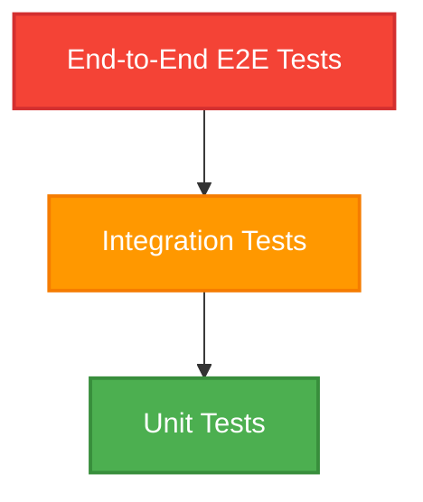
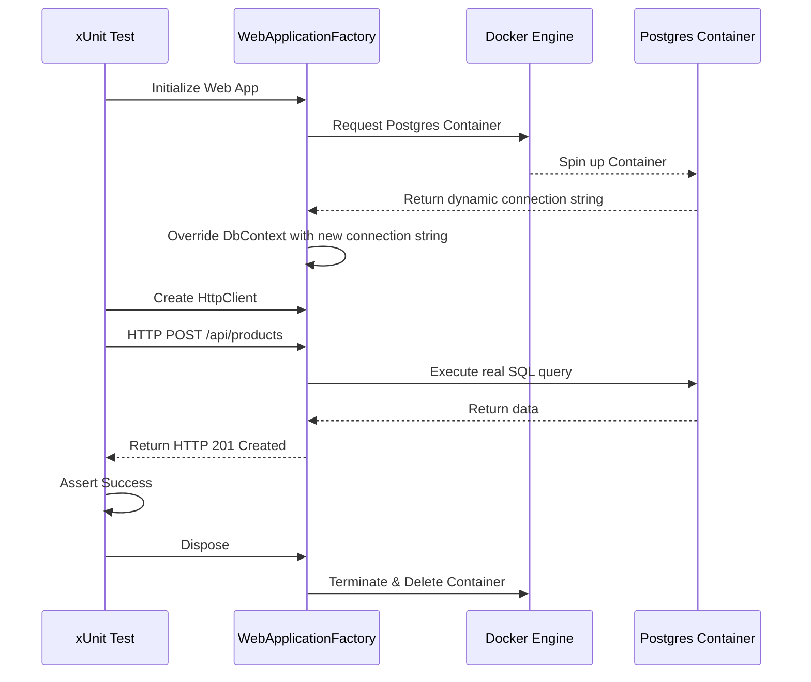
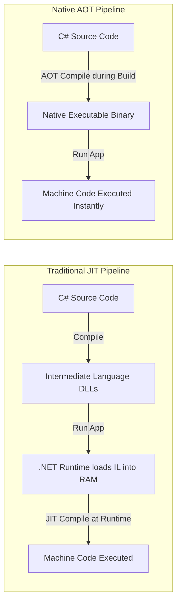

# Lecture 52 — Testing, CI/CD & Cloud Deployment

**Course:** Full-Stack Web Development  
**Instructor:** Kyrillos Medhat  
**Duration:** 3 hours (Theory + Lab)

---

## 🛑 1. Prerequisites (What to know before starting)
- Solid grasp of C# and ASP.NET Core Web API (Controllers, Minimal APIs, Dependency Injection).
- Familiarity with the MediatR pattern and CQRS architecture.
- Entity Framework Core basics (DbContext, LINQ, migrations).
- Basic understanding of Git and GitHub (commits, branches, PRs, pushing).
- Docker Desktop installed on your local machine and a fundamental grasp of containerization.

> [!IMPORTANT]
> If you have never run a Docker container before, please review the Docker 101 appendix. We will be using Docker heavily for both local integration testing (via Testcontainers) and for our final production deployments. Without Docker running locally, your integration tests will fail.

---

## 🎯 2. Objectives & Agenda

### Learning Objectives
By the end of this deep-dive lecture, you will be equipped to:
1. **Design and Implement Unit Tests**: Master the `xUnit` framework and `Moq` library to test individual components in complete isolation.
2. **Architect Bulletproof Integration Tests**: Move beyond fragile in-memory databases by leveraging `WebApplicationFactory` and `Testcontainers` to spin up real, disposable PostgreSQL/SQL Server Docker containers for testing your entire HTTP pipeline.
3. **Master .NET Native AOT**: Understand the architectural differences between Just-In-Time (JIT) and Ahead-Of-Time (AOT) compilation, and compile your ASP.NET Core apps to tiny, ultra-fast native binaries. Learn to overcome AOT reflection limitations.
4. **Containerize with Docker Best Practices**: Write highly optimized, multi-stage `Dockerfile` configurations specifically tailored for .NET AOT, drastically reducing attack surface and resulting in micro-images under 50MB.
5. **Automate with GitHub Actions**: Build professional Continuous Integration (CI) and Continuous Deployment (CD) pipelines that automatically build, test, containerize, and deploy your code to the cloud on every commit.

### Agenda
**Part 1 — Theory & Deep Dives (~90 min)**
- The Testing Pyramid: Why we need different layers of tests.
- Unit Testing: The Engine on a Stand (xUnit & Moq).
- Integration Testing: The Full Car (Testcontainers & WebApplicationFactory).
- Compilation Architectures: JIT vs .NET Native AOT.
- Docker Containerization for .NET (Multi-stage builds).
- CI/CD Pipelines with GitHub Actions.

**Part 2 — Practice / Lab (~90–120 min)**
- Lab 1: Writing robust Unit & Integration Tests.
- Lab 2: Native AOT Compilation & Docker Multi-stage Builds.
- Assignment: ShopAPI Project Part 8 — Testing & Deployment.

---

## 🧠 3. Deep Numbered Sections

### 3.1 The Testing Pyramid and Why We Test

Before we write code, we must understand *why* we are writing tests. In software engineering, code is a liability. Every new line of code introduces a potential bug. Automated testing is your safety net. Manual testing is slow, error-prone, and scales terribly as the application grows.



- **Unit Tests (Green/Base):** Fast, numerous, and highly isolated. They test one method or one class at a time. They run in milliseconds. They shouldn't touch the file system, network, or database. 
- **Integration Tests (Orange/Middle):** Slower, fewer. They test how components interact with each other (e.g., your API controllers talking through EF Core to a real database).
- **E2E Tests (Red/Top):** Very slow, very few. They simulate a real user clicking through the UI in a real browser. 

> [!NOTE]
> Aim for high unit test coverage for complex business logic, but rely heavily on integration tests for API endpoints where data persistence, JSON serialization, and HTTP routing are the primary concerns.

---

### 3.2 Unit Testing: The Engine on a Stand

#### The Real-World Analogy: Testing a Car Engine
Imagine you are an engineer building a new car engine. You don't put the engine inside the car, fill it with gas, attach the wheels, and drive it down the highway just to see if the spark plugs work. If the car doesn't start, what failed?
Instead, you mount the engine on a test stand in a highly controlled environment. 

**Unit Tests** do exactly this in software. They test a single class in complete isolation. If the class depends on a Database or an External API, we do not use the real ones. Instead, we create "fake" versions of these dependencies called **Mocks**.

#### Setting up xUnit and Moq
We use `xUnit` as our test runner and assertion library. We pair it with `Moq`, a library that allows us to dynamically create fake implementations of our interfaces.

```bash
dotnet new xunit -n ShopAPI.Tests
dotnet add package Moq
dotnet add package FluentAssertions
dotnet add reference ../ShopAPI/ShopAPI.csproj
```

#### The AAA Pattern (Arrange, Act, Assert)
Every well-written test follows three distinct phases:

1. **Arrange:** Set up the initial state, define variables, and configure your mocks.
2. **Act:** Call the exact method or execute the command you want to test.
3. **Assert:** Verify the result matches your expectations. Check return values, exceptions thrown, or verify that specific methods on mocks were called.

#### Deep Dive Code Example: Mocking a Dependency
Let's look at a MediatR handler for getting a product by its ID.

```csharp
using Xunit;
using Moq;
using FluentAssertions;
using ShopAPI.Application.Products.Queries;
using ShopAPI.Domain.Entities;
using ShopAPI.Application.Common.Interfaces;

public class GetProductByIdHandlerTests
{
    [Fact] 
    public async Task Handle_GivenValidId_ReturnsProductDto()
    {
        // ==========================================
        // 1. ARRANGE
        // ==========================================
        var productId = 1;
        var expectedProduct = new Product { Id = productId, Name = "High-End Laptop", Price = 1500.00m };
        
        var mockRepo = new Mock<IProductRepository>();
        
        mockRepo.Setup(repo => repo.GetByIdAsync(productId))
                .ReturnsAsync(expectedProduct);

        var handler = new GetProductByIdHandler(mockRepo.Object);

        // ==========================================
        // 2. ACT
        // ==========================================
        var query = new GetProductByIdQuery(productId);
        var result = await handler.Handle(query, CancellationToken.None);

        // ==========================================
        // 3. ASSERT
        // ==========================================
        result.Should().NotBeNull();
        result.Name.Should().Be("High-End Laptop");
        result.Price.Should().Be(1500.00m);
        
        mockRepo.Verify(repo => repo.GetByIdAsync(productId), Times.Once);
    }
    
    [Fact]
    public async Task Handle_GivenInvalidId_ThrowsNotFoundException()
    {
        var mockRepo = new Mock<IProductRepository>();
        mockRepo.Setup(repo => repo.GetByIdAsync(It.IsAny<int>())).ReturnsAsync((Product)null);
        var handler = new GetProductByIdHandler(mockRepo.Object);

        var act = async () => await handler.Handle(new GetProductByIdQuery(999), CancellationToken.None);
        
        await Assert.ThrowsAsync<NotFoundException>(act);
    }
}
```

> [!TIP]
> Use `It.IsAny<T>()` in Moq when you don't care about the specific argument passed to a mock, just that it was called with *some* value of type `T`. It makes tests less brittle.

---

### 3.3 Integration Testing: The Full Car

While unit tests are incredibly fast and precise, they suffer from a major flaw: **they don't test integration points**. 

Unit tests can't answer these questions because everything external is mocked. **Integration Tests** solve this by testing the entire HTTP request pipeline, from the Controller, through the MediatR handler, down to a *real database*, and back.

#### The Problem with In-Memory Databases
For years, the standard advice in .NET was to use the Entity Framework `UseInMemoryDatabase()` provider for integration tests. **This is an anti-pattern.**

Why?
1. **False Positives:** SQLite or In-Memory providers don't enforce relational constraints the same way SQL Server or PostgreSQL do.
2. **Missing Features:** Database-specific features will crash the In-Memory provider.

#### The Solution: Testcontainers
Modern .NET solves this elegantly using **Testcontainers**. Testcontainers is an open-source library that programmatically spins up real Docker containers for your tests and automatically tears them down when the tests finish.



#### Setting up WebApplicationFactory and Testcontainers

```bash
dotnet add package Microsoft.AspNetCore.Mvc.Testing
dotnet add package Testcontainers.PostgreSql
```

First, we create a custom Factory. This class spins up your entire `Program.cs` in memory for testing, but intercepts the dependency injection container to swap out the real database connection string for our temporary Docker container's connection string.

```csharp
using Microsoft.AspNetCore.Hosting;
using Microsoft.AspNetCore.Mvc.Testing;
using Microsoft.EntityFrameworkCore;
using Microsoft.Extensions.DependencyInjection;
using Testcontainers.PostgreSql;
using Xunit;

public class CustomWebApplicationFactory : WebApplicationFactory<Program>, IAsyncLifetime
{
    private readonly PostgreSqlContainer _dbContainer = new PostgreSqlBuilder()
        .WithImage("postgres:15-alpine")
        .WithDatabase("shopapi_test_db")
        .WithUsername("postgres")
        .WithPassword("supersecret")
        .Build();

    public async Task InitializeAsync()
    {
        await _dbContainer.StartAsync();
    }

    public new async Task DisposeAsync()
    {
        await _dbContainer.StopAsync();
    }

    protected override void ConfigureWebHost(IWebHostBuilder builder)
    {
        builder.ConfigureServices(services =>
        {
            var descriptor = services.SingleOrDefault(
                d => d.ServiceType == typeof(DbContextOptions<ShopContext>));

            if (descriptor != null)
            {
                services.Remove(descriptor);
            }

            services.AddDbContext<ShopContext>(options =>
            {
                options.UseNpgsql(_dbContainer.GetConnectionString());
            });

            var sp = services.BuildServiceProvider();
            using var scope = sp.CreateScope();
            var db = scope.ServiceProvider.GetRequiredService<ShopContext>();
            db.Database.Migrate(); 
        });
    }
}
```

#### Writing the Integration Test

```csharp
using System.Net.Http.Json;
using Xunit;
using FluentAssertions;

public class ProductIntegrationTests : IClassFixture<CustomWebApplicationFactory>
{
    private readonly HttpClient _client;

    public ProductIntegrationTests(CustomWebApplicationFactory factory)
    {
        _client = factory.CreateClient(); 
    }

    [Fact]
    public async Task CreateProduct_WithValidData_Returns201CreatedAndSavesToDb()
    {
        var newProduct = new { Name = "Integration Test Product", Price = 99.99, Stock = 10 };

        var response = await _client.PostAsJsonAsync("/api/products", newProduct);

        response.EnsureSuccessStatusCode(); 
        response.StatusCode.Should().Be(System.Net.HttpStatusCode.Created);
        
        var locationHeader = response.Headers.Location;
        var getResponse = await _client.GetAsync(locationHeader);
        
        getResponse.EnsureSuccessStatusCode();
        var fetchedProduct = await getResponse.Content.ReadFromJsonAsync<ProductDto>();
        
        fetchedProduct.Should().NotBeNull();
        fetchedProduct.Name.Should().Be("Integration Test Product");
    }
}
```

> [!WARNING]
> Because Testcontainers spins up real Docker containers, your integration tests will take a few seconds to start. This is normal and a worthwhile trade-off for 100% confidence.

---

### 3.4 .NET Native AOT Compilation (JIT vs AOT)

Historically, languages like C# and Java compile your code into an intermediate format (IL for C#, Bytecode for Java). When you run the application, the .NET runtime starts up, reads this intermediate code, and a **Just-In-Time (JIT) Compiler** translates it into the actual machine code exactly when it is needed.

#### The Problem with JIT
1. **Slower Startup Time (Cold Starts):** The JIT compiler takes massive CPU cycles to compile code at startup.
2. **High Memory Usage:** You have to load the entire .NET Runtime and the JIT Compiler itself into RAM.

#### The Solution: Native AOT (Ahead-Of-Time)
Introduced heavily in .NET 8, **Native AOT** fundamentally changes how .NET works. Instead of compiling to intermediate code, the .NET SDK compiles your C# directly into native OS machine code during the build process.



#### Why Native AOT is a Game Changer for the Cloud
- **Instant Startup:** Applications start in less than 50 milliseconds.
- **Microscopic Memory Footprint:** Applications can idle in less than 30MB of RAM.
- **Tiny Disk Size:** A typical AOT binary is 10-20MB, completely self-contained. 

#### Enabling AOT & Overcoming Limitations
Enabling AOT is simple, but it comes with extreme restrictions. The compiler must know about every single class and type you use at compile-time. **Dynamic Reflection** is heavily restricted.

```xml
<Project Sdk="Microsoft.NET.Sdk.Web">
  <PropertyGroup>
    <TargetFramework>net10.0</TargetFramework>
    <Nullable>enable</Nullable>
    <ImplicitUsings>enable</ImplicitUsings>
    <PublishAot>true</PublishAot> 
    <OptimizationPreference>Size</OptimizationPreference>
  </PropertyGroup>
</Project>
```

#### Fixing JSON Serialization with Source Generators
If you run an AOT app and try to return an object as JSON, it will crash. We must use **Source Generators** to generate the JSON serialization code at compile-time.

```csharp
using System.Text.Json.Serialization;

public class ProductDto
{
    public int Id { get; set; }
    public string Name { get; set; }
}

[JsonSerializable(typeof(ProductDto))]
[JsonSerializable(typeof(List<ProductDto>))]
internal partial class AppJsonSerializerContext : JsonSerializerContext
{
}

var builder = WebApplication.CreateSlimBuilder(args); 

builder.Services.ConfigureHttpJsonOptions(options =>
{
    options.SerializerOptions.TypeInfoResolverChain.Insert(0, AppJsonSerializerContext.Default);
});
```

---

### 3.5 Docker Containerization for .NET

To deploy a web application safely to modern cloud infrastructure, we use **Docker**. A Docker container is a lightweight, standalone, executable package that includes everything needed to run a piece of software.

#### Multi-Stage Dockerfiles: The Secret to Micro Images
A naive Dockerfile might use the `.NET SDK` image, copy the code, run `dotnet run`, and serve the app. **Do not do this in production.** The SDK image is over 800MB because it contains compilers, MSBuild, NuGet caches, etc. You don't need any of that in production.

Instead, we use a **Multi-Stage Build**. 
1. **Stage 1 (Build):** Uses the heavy SDK image. It compiles the code and generates the final output.
2. **Stage 2 (Runtime):** Uses a tiny Alpine Linux runtime image. It copies *only the compiled output* from Stage 1.

#### The Ultimate .NET AOT Dockerfile

```dockerfile
# STAGE 1: Build Environment
FROM mcr.microsoft.com/dotnet/sdk:10.0-alpine AS build
WORKDIR /src

RUN apk add --no-cache clang build-base zlib-dev

COPY ["ShopAPI/ShopAPI.csproj", "ShopAPI/"]
RUN dotnet restore "ShopAPI/ShopAPI.csproj"

COPY . .
WORKDIR "/src/ShopAPI"

RUN dotnet publish "ShopAPI.csproj" -c Release -r linux-musl-x64 -o /app/publish

# STAGE 2: Runtime Environment
FROM mcr.microsoft.com/dotnet/runtime-deps:10.0-alpine AS final
WORKDIR /app

RUN adduser --disabled-password \
  --home /app \
  --gecos '' dotnetuser && chown -R dotnetuser /app
USER dotnetuser

EXPOSE 8080
ENV ASPNETCORE_URLS=http://+:8080

COPY --from=build /app/publish .

ENTRYPOINT ["./ShopAPI"] 
```

This Dockerfile will produce an image that is roughly **25-40 MB total**, containing an entire Linux OS and your highly-performant Web API.

---

### 3.6 CI/CD Pipelines with GitHub Actions

Writing tests and Dockerfiles is great, but relying on developers to run them manually before deployment is a recipe for disaster. We need automation.

- **Continuous Integration (CI):** Every time code is pushed, an automated server compiles it, and runs every single unit and integration test. 
- **Continuous Deployment (CD):** Once CI passes, the pipeline automatically builds the Docker image and deploys it.

#### Creating the CI/CD Pipeline
Create a file exactly at this path in your repository: `.github/workflows/main.yml`

```yaml
name: .NET Enterprise CI/CD Pipeline

on:
  push:
    branches: [ "main" ]
  pull_request:
    branches: [ "main" ]

jobs:
  build_and_test:
    name: Build & Test Application
    runs-on: ubuntu-latest 

    steps:
    - name: Checkout Code
      uses: actions/checkout@v4

    - name: Setup .NET SDK 10.0
      uses: actions/setup-dotnet@v4
      with:
        dotnet-version: '10.0.x'

    - name: Restore Dependencies
      run: dotnet restore

    - name: Build Application
      run: dotnet build --no-restore -c Release

    - name: Run Unit & Integration Tests
      run: dotnet test --no-build -c Release --verbosity normal

  docker_build_and_push:
    name: Build & Push Docker Image
    needs: build_and_test 
    runs-on: ubuntu-latest
    
    if: github.ref == 'refs/heads/main'

    steps:
    - name: Checkout Code
      uses: actions/checkout@v4

    - name: Log in to Docker Hub
      uses: docker/login-action@v3
      with:
        username: ${{ secrets.DOCKER_USERNAME }} 
        password: ${{ secrets.DOCKER_PASSWORD }}

    - name: Build and Push AOT Docker Image
      uses: docker/build-push-action@v5
      with:
        context: .
        file: ./Dockerfile
        push: true
        tags: |
          mycompany/shopapi:latest
          mycompany/shopapi:${{ github.sha }}
```

> [!IMPORTANT]
> **Security Best Practice:** Never hardcode passwords or API keys in your GitHub repository YAML files. Use GitHub Secrets.

---

## 🧐 4. Think Like a Developer

Let's walk through 3 real-world scenarios showing how expert developers make architectural testing and deployment decisions.

### Scenario 1: The Flaky Payment Gateway Mock
**Context:** You are writing a Unit Test for the `CheckoutCartHandler`. 
**The Problem:** The actual Stripe API sometimes fails due to network timeouts. You want to test how your system handles a sudden timeout.
**Expert Decision:** Do not hit the real Stripe API in a unit test! Instead, mock the interface to aggressively force an exception.
```csharp
var mockPaymentGateway = new Mock<IPaymentGateway>();

mockPaymentGateway
    .Setup(p => p.ChargeCardAsync(It.IsAny<string>(), It.IsAny<decimal>()))
    .ThrowsAsync(new TimeoutException("Network failed"));

var handler = new CheckoutCartHandler(mockPaymentGateway.Object);

var result = await handler.Handle(new CheckoutCommand(...), CancellationToken.None);
result.IsSuccess.Should().BeFalse();
result.ErrorMessage.Should().Contain("Payment processor unavailable");
```

### Scenario 2: Selecting the Base Docker Image
**Context:** Your team is deploying the API to AWS Fargate. 
**The Problem:** Your current Docker image uses the standard `aspnet:10.0` image and is 250MB. It takes 15 seconds to pull when scaling up during spikes.
**Expert Decision:** Switch to Alpine Linux and Native AOT. By compiling AOT targeting `linux-musl-x64` and placing the bare binary on the `runtime-deps:10.0-alpine` image, you reduce the overall image size to 35MB. The image pull time drops from 15 seconds to 1.5 seconds.

### Scenario 3: Database Migrations in CI/CD
**Context:** You are setting up your CI/CD pipeline. Your integration tests pass. Now you need to deploy.
**The Problem:** How does the production database schema get updated? You shouldn't have `db.Database.Migrate()` running inside your API `Program.cs`.
**Expert Decision:** Remove `Migrate()` from the API completely. Instead, generate an idempotent SQL script during the CI pipeline (`dotnet ef migrations script -i -o migrate.sql`). Have a dedicated step in your CD pipeline that applies this raw SQL script directly to the production database *before* the new Docker containers are spun up.

---

## 🔄 5. Before vs After: The Evolution of Quality

### Before: Manual Testing & In-Memory Databases
```csharp
// BAD PRACTICE: In-Memory Database for testing
builder.Services.AddDbContext<AppDbContext>(options =>
    options.UseInMemoryDatabase("TestDb"));
// Why it's bad: In-memory databases do not support referential integrity.
// You can insert a foreign key that doesn't exist, and the test will pass!
```

### After: Professional Integration Testing with Testcontainers
```csharp
// GOOD PRACTICE: Real Docker Database via Testcontainers
public class TestFactory : WebApplicationFactory<Program>, IAsyncLifetime
{
    private readonly PostgreSqlContainer _db = new PostgreSqlBuilder().Build();
    
    public async Task InitializeAsync() => await _db.StartAsync();
    
    protected override void ConfigureWebHost(IWebHostBuilder builder)
    {
        builder.ConfigureServices(services => {
            services.AddDbContext<AppDbContext>(options =>
                options.UseNpgsql(_db.GetConnectionString())); 
        });
    }
}
// Why it's good: 100% parity with production.
```

---

## ⚠️ 6. Common Mistakes & How to Avoid Them

| ❌ Common Mistake | 🤔 Why it happens | ✅ The Expert Fix |
|------------------|-------------------|-------------------|
| **Mocking Everything** | Developers think every single class needs an interface and a mock for unit testing. | Only mock **external boundaries** (I/O, APIs, Databases). If a class just does math or internal business logic, use the real class in the test! |
| **Testing Implementation Details** | Asserting that a private internal method was called exactly 3 times in a specific order. | Test **behavior**, not implementation. Assert that given Input A, the system returns Output B. |
| **Leaking State Between Tests** | Using shared database instances across tests, causing tests to pass randomly depending on execution order. | For integration tests, ensure data is cleared or use the `Respawn` library to quickly truncate tables between test runs. |
| **Bloated Docker Images** | Copying the entire project and running `dotnet run` inside the container. | Always use **Multi-Stage builds**. Only the final compiled binary should make it into the production image. |
| **Ignoring the Cold Start** | Deploying a massive monolithic API with full reflection capabilities to a Serverless environment. | Transition to Minimal APIs and **Native AOT** to eliminate JIT compilation during startup. |

---

## 🧪 7. Practice Labs & Assignments

### Lab 1: Building a Bulletproof Unit Test (45 min)
**Objective:** Write an advanced unit test using Moq to verify error handling.
**Steps:**
1. Open your `ShopAPI.Tests` project.
2. Create a handler `CreateOrderCommandHandler` in the main project. It should depend on `IInventoryService` and `IOrderRepository`.
3. In the handler, if `IInventoryService.CheckStockAsync(productId)` returns false, it should immediately throw an `InsufficientStockException`.
4. In your test class, mock `IInventoryService` to return false.
5. Use `Assert.ThrowsAsync<InsufficientStockException>` to verify the handler stops execution.
6. Verify that `IOrderRepository.SaveAsync()` was **never** called using `mockRepo.Verify(r => r.SaveAsync(It.IsAny<Order>()), Times.Never)`.

### Lab 2: The AOT Docker Challenge (45 min)
**Objective:** Containerize your Minimal API into an image smaller than 50MB.
**Steps:**
1. Enable `<PublishAot>true</PublishAot>` in your API `.csproj`.
2. Delete any calls to `builder.Services.AddControllers()`. Ensure you are using Minimal APIs (`app.MapGet()`, `app.MapPost()`).
3. Implement a `JsonSerializerContext` to fix any JSON serialization issues.
4. Copy the Multi-Stage Alpine Dockerfile provided in section 3.5.
5. Run `docker build -t shop-api-aot .` in your terminal.
6. Run `docker images` and verify the size of `shop-api-aot`. If it's over 100MB, you did something wrong.
7. Run the container: `docker run -d -p 8080:8080 shop-api-aot`. Navigate to `http://localhost:8080/api/products` and monitor the instant response time.

---

## 📝 Assignment: ShopAPI Project — Part 8

Let's test and deploy the final version of our eCommerce Backend!

### Requirements Checklist:
- [ ] Add a `ShopAPI.Tests` xUnit project to your solution.
- [ ] Write 5 Unit Tests covering your MediatR Command Handlers using `Moq`. 
- [ ] Set up `WebApplicationFactory` and `Testcontainers.PostgreSql`. Write 2 Integration Tests that hit your real API endpoints.
- [ ] Refactor your codebase to be AOT-compatible (no heavy reflection, use SlimBuilder).
- [ ] Enable AOT compilation and create a Multi-Stage `Dockerfile`.
- [ ] Create a `.github/workflows/deploy.yml` pipeline.
- [ ] Configure the pipeline to run `dotnet test` on every PR.
- [ ] Configure the pipeline to build and push the Docker image to DockerHub ONLY when code is successfully merged into the `main` branch.

---

## 🎤 8. Interview Prep

**Q1: What is the exact difference between a Unit Test and an Integration Test?**
**Answer:** A unit test verifies a single component in complete isolation, using mocks for any external dependencies. It is very fast. An integration test verifies that multiple components work together properly, such as testing an HTTP endpoint that reads from a real database. It requires I/O and is slower.

**Q2: What is the purpose of the AAA pattern in testing?**
**Answer:** Arrange, Act, Assert provides a standardized structure for writing tests. It makes tests readable, maintainable, and prevents developers from testing multiple behaviors in a single unreadable block.

**Q3: Why shouldn't we use Entity Framework's In-Memory provider for Integration Testing?**
**Answer:** The In-Memory provider behaves differently than relational databases. It doesn't enforce referential integrity (foreign keys) or transaction isolation. A test passing in-memory gives a false sense of security. Modern best practice is to use Testcontainers.

**Q4: Explain the difference between JIT and AOT compilation in .NET.**
**Answer:** JIT (Just-In-Time) compiles intermediate language (IL) into machine code at runtime as the application executes, causing slower startup times. AOT (Ahead-Of-Time) compiles C# directly into native OS machine code during the build process. AOT yields incredibly fast startup times and low memory usage but heavily restricts dynamic runtime features like reflection.

**Q5: Describe a multi-stage Dockerfile and why it's a security and performance necessity.**
**Answer:** A multi-stage Dockerfile uses multiple `FROM` instructions. The first stage contains a heavy SDK to build the application. The second stage uses a minimal runtime environment. Only the final compiled binaries are copied from the build stage to the runtime stage. This drastically reduces the final image size and minimizes security vulnerabilities.

---

## 📑 9. Cheat Sheet: Testing & Docker Commands

**Testing (CLI)**
```bash
# Run all tests in the solution
dotnet test

# Run tests and collect code coverage (requires coverlet.collector package)
dotnet test --collect:"XPlat Code Coverage"

# Run tests with detailed verbosity to see exact errors
dotnet test --verbosity detailed

# Run a specific test by its exact name
dotnet test --filter "FullyQualifiedName~GetProductByIdHandlerTests"
```

**Docker (CLI)**
```bash
# Build an image from a Dockerfile in the current directory, tag it as my-app:latest
docker build -t my-app:latest .

# List all local images (Check your sizes!)
docker images

# Run a container in the background (-d) and map host port 8080 to container port 8080
docker run -d -p 8080:8080 --name my-running-app my-app:latest

# View live logs of a running container
docker logs -f my-running-app

# Stop and remove a container
docker stop my-running-app
docker rm my-running-app

# DELETE EVERYTHING: Delete all stopped containers, unused networks, and dangling images
docker system prune -a --volumes
```

---

## 📌 10. Key Takeaways & Resources

### Key Takeaways
- **Testing is non-negotiable:** Without automated tests, confident refactoring is impossible. Unit tests provide speed; Integration tests provide confidence.
- **Mock at the boundaries:** Only use `Moq` for I/O bounds like databases, file systems, and HTTP clients. Never mock your own internal logic.
- **Testcontainers > In-Memory:** Always test against the exact database engine and version you will use in production.
- **Embrace AOT:** .NET Native AOT is the future of cloud-native deployment.
- **Automate Everything:** A CI/CD pipeline ensures quality gates are passed on every single commit.

### Additional Resources
| Resource | Link | Description |
|----------|------|-------------|
| xUnit Documentation | [xunit.net](https://xunit.net/) | Official guide for the xUnit framework. |
| Moq Framework GitHub | [github.com/moq/moq](https://github.com/moq/moq) | Advanced mocking strategies and setups. |
| Testcontainers for .NET | [testcontainers.com/dotnet](https://testcontainers.com/modules/dotnet/) | Library for managing Docker containers in tests. |
| .NET Native AOT Docs | [learn.microsoft.com](https://learn.microsoft.com/en-us/dotnet/core/deploying/native-aot/) | Official Microsoft guide on optimizing AOT. |
| GitHub Actions Syntax | [docs.github.com/actions](https://docs.github.com/en/actions) | Comprehensive reference for CI/CD workflows. |

---

**Next Lecture:** [Lecture 53 — Full-Stack Integration — Angular + ASP.NET Web API](../Module%2010%20-%20Full-Stack%20Integration%20%26%20Capstone/53%20-%20Full-Stack%20Integration%20-%20Angular%20%2B%20ASP.NET%20Web%20API.md)
### 📚 Extensive Tutorials & Resources
- **Atlassian:** [Git Tutorials](https://www.atlassian.com/git/tutorials)
- **FreeCodeCamp:** [Git and GitHub Crash Course](https://www.freecodecamp.org/news/git-and-github-crash-course/)
- **GitHub Docs:** [Get Started with GitHub](https://docs.github.com/en/get-started)
